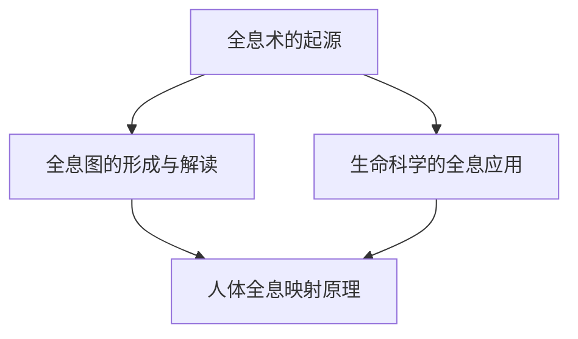

                 


### 1.1 生命全息图的概念

**背景介绍**

生命全息图这一概念起源于全息术的诞生和发展。全息术（Holography）最早由匈牙利物理学家丹尼斯·盖伯（Dennis Gabor）在1947年提出，他在研究电子显微镜时，发现了一种称为“全息图”的记录和重现三维图像的方法。盖伯因这一开创性的工作获得了1964年的诺贝尔物理学奖。随后，全息术在科学、医学、艺术等领域得到了广泛的应用。

在生命科学领域，全息原理被逐步应用到对人体和生命现象的研究中。全息生物学（Holographic Biology）提出，人体的各个部分不仅具有独立的生理功能，而且在更深层次上，它们是全息结构的一部分，每个部分都蕴含着整个生命体的信息。这种全息性使得生命体在整体上呈现出一种协调和平衡的状态。

**核心概念与联系**

为了更好地理解生命全息图的概念，我们可以借助Mermaid流程图来展示其核心原理和联系。



在上述流程图中，A节点代表全息术的起源，即全息图的发明和解读原理；B节点是全息图的形成与解读，它涉及到记录和重现三维图像的技术；C节点是生命科学的全息应用，它表明全息原理如何被应用于生命科学研究；D节点是人体全息映射原理，它解释了人体各个部分如何构成一个全息结构。

**核心概念解析**

1. **全息图的形成与解读**：全息图是通过干涉和衍射原理记录的，它包含光波的振幅和相位信息。解读全息图的过程，就是通过光的干涉和衍射来重现原始物体的三维图像。

2. **人体全息映射原理**：人体全息映射原理认为，人体的每一个细胞都含有整个生命体的信息。这种信息不仅限于遗传基因，还包括了生物体的整体结构和功能状态。通过全息映射，可以分析个体的健康状态、预测疾病的发生，甚至指导个性化医疗。

3. **生命科学的全息应用**：全息原理在生命科学中的应用，包括对疾病诊断、治疗和预防等方面的探索。例如，通过全息成像技术，可以实时观察细胞内部结构的变化，这对于研究细胞生物学具有重要意义。

**核心算法原理讲解**

为了详细阐述生命全息图的绘制过程，我们可以使用伪代码来描述核心算法。

```python
# 生命全息图绘制伪代码

# 输入：生命体数据集（包括生理指标、基因信息等）
# 输出：生命全息图

function draw_hologram(data_set):
    1. 数据预处理
        - 清洗数据
        - 标准化数据
        - 特征提取

    2. 构建全息矩阵
        - 计算数据集的协方差矩阵
        - 对协方差矩阵进行特征分解

    3. 重构全息图
        - 使用特征值和特征向量重构全息图

    4. 可视化处理
        - 对重构的全息图进行图像增强
        - 使用可视化工具展示全息图

    5. 结果分析
        - 分析全息图的分布特征
        - 对比健康与疾病状态下的全息图差异

    return hologram
```

上述伪代码展示了生命全息图绘制的基本步骤，包括数据预处理、全息矩阵构建、全息图重构和可视化处理。在具体实现过程中，这些步骤需要借助相应的数学模型和算法来实现。

**数学模型和公式**

在生命全息图的绘制过程中，涉及到的数学模型和公式主要包括：

1. **协方差矩阵**：用于描述数据集内部各个特征之间的相关性。
   $$\Sigma = \frac{1}{N}\sum_{i=1}^{N}(x_i - \bar{x})(x_i - \bar{x})^T$$

2. **特征分解**：将协方差矩阵分解为特征值和特征向量的乘积，用于重构全息图。
   $$\Sigma = Q\Lambda Q^T$$
   其中，\(Q\) 是特征向量矩阵，\(\Lambda\) 是特征值矩阵。

3. **图像增强**：用于提高图像的对比度和清晰度。
   $$I_{enhanced} = I + \alpha (G - F)$$
   其中，\(I\) 是原始图像，\(G\) 是增强后的图像，\(\alpha\) 是增强系数。

**详细讲解与举例说明**

以个人健康监控为例，假设我们收集了一个人的生理指标数据集，包括心率、血压、血糖等。我们可以按照以下步骤绘制生命全息图：

1. **数据预处理**：对收集的数据进行清洗和标准化处理，去除异常值，并统一数据尺度。

2. **构建全息矩阵**：计算数据集的协方差矩阵，分析各个生理指标之间的相关性。

3. **重构全息图**：利用特征分解方法，重构出全息图。这个过程中，我们关注的是协方差矩阵的特征值和特征向量。

4. **可视化处理**：对重构的全息图进行图像增强，使其更加清晰易懂。

5. **结果分析**：通过对比健康与疾病状态下的全息图差异，分析个体的健康状况，预测潜在的健康风险。

**小结**

生命全息图是一种将人体全息原理与数据分析技术相结合的先进工具。通过全息图的绘制和解读，我们可以更深入地了解个体的生理状态和整体健康水平。本文对生命全息图的概念、核心算法和数学模型进行了详细讲解，并通过实际案例展示了其应用价值。在未来的发展中，生命全息图有望在医学、健康监测、个性化医疗等领域发挥更大的作用。# 文章标题：生命全息图绘制工具：可视化你的人生意义轨迹的软件

## 关键词：生命全息图、人生意义、可视化、软件工具、健康监测、个性化医疗

## 摘要

本文探讨了生命全息图绘制工具的概念、基础理论和核心技术，并详细介绍了如何使用这种工具来可视化人生意义轨迹。通过实际案例分析和代码解读，本文展示了生命全息图在健康监测和个性化医疗领域的应用潜力。读者可以了解到如何借助生命全息图来分析个人健康状态，预测未来健康风险，从而实现更健康、更有意义的生活。

## 引言与概述

### 1.1 生命全息图的概念

生命全息图是一种基于全息原理和生命科学知识，通过数据分析和技术手段，将人的生命信息以可视化形式呈现出来的工具。全息术，作为20世纪40年代由匈牙利物理学家丹尼斯·盖伯（Dennis Gabor）首创的一种记录和重现三维图像的技术，其基本原理是利用光的干涉和衍射现象来记录和重现物体的全息图。随着技术的发展，全息术逐渐从物理领域扩展到生命科学、医学、艺术等多个领域。

在生命科学中，全息原理被应用于对人体和生命现象的研究。全息生物学认为，人体的每一个细胞都包含着整个生命体的信息，这种全息性使得生命体在整体上呈现出一种协调和平衡的状态。生命全息图就是基于这一原理，通过数据分析和技术处理，将人的生命信息以图像的形式展现出来，帮助我们更好地理解生命的本质和健康状态。

### 1.2 生命全息图的重要性

生命全息图的重要性体现在多个方面。首先，它为个体提供了一个直观的视角，使我们能够更清晰地看到自己的生命轨迹，从而对个人的生活状态和健康水平有一个全面的认识。其次，生命全息图可以帮助医生和医疗机构更准确地诊断疾病，预测健康风险，制定个性化的治疗方案。此外，生命全息图还可以应用于健康监测、运动康复、心理健康等领域，为人们提供全方位的健康服务。

### 1.3 本书的目的和结构

本书旨在向读者介绍生命全息图绘制工具的基本概念、核心技术、应用实例和未来发展趋势。具体来说，本书包括以下几个部分：

1. **引言与概述**：介绍生命全息图的概念、重要性以及本书的结构。
2. **基础理论**：阐述全息原理、生命科学基础以及人体全息映射原理。
3. **核心技术**：介绍绘制生命全息图的核心技术和方法，包括数据处理、图像处理和可视化技术。
4. **软件工具介绍**：详细介绍常用生命全息图绘制软件的使用方法和特点。
5. **实际应用案例**：通过具体案例展示生命全息图在不同领域的应用。
6. **案例分析**：对一些典型案例进行分析，探讨生命全息图在实际应用中的效果和挑战。
7. **总结与展望**：总结本书的主要内容，展望生命全息图的发展前景。

通过本书的学习，读者可以系统地了解生命全息图的绘制原理和应用方法，掌握相关技术和工具，为实际工作和生活提供有益的指导。

## 基础理论

### 2.1 全息原理

全息原理是生命全息图绘制的核心理论基础。全息术的基本原理是利用光的干涉和衍射现象来记录和重现物体的全息图。具体来说，全息图的生成过程包括以下几步：

1. **光波的干涉**：当两束相干光波（例如来自同一光源的光波）相遇时，它们会产生干涉现象。干涉的结果是光波的相位和振幅发生变化，这种变化被记录在全息图上。

2. **全息图的记录**：记录全息图通常使用一种称为全息干板（holographic plate）的特殊材料。当相干光波照射到全息干板上时，全息图信息被记录在干板的感光层中。

3. **全息图的再现**：当光波再次照射到记录了全息图的全息干板时，衍射现象会使光波在空间中重新分布，从而再现出原始物体的三维图像。

全息图的特点在于它不仅记录了光波的振幅信息，还记录了光波的相位信息。这使得全息图能够在没有原始物体的情况下，通过衍射现象再现出原始物体的三维图像。

### 2.1.1 全息术的起源与发展

全息术的起源可以追溯到1947年，当时匈牙利物理学家丹尼斯·盖伯在研究电子显微镜时，提出了全息术的概念。盖伯发现，通过干涉和衍射原理，可以记录并重现三维图像。这一发现不仅为光学领域带来了革命性的变化，也为生命科学、医学和艺术等领域提供了新的工具。

自盖伯提出全息术以来，全息技术得到了迅速发展。20世纪50年代，全息摄影技术逐渐成熟，并在科学研究和工业应用中得到广泛应用。随着激光技术的发展，全息术在记录和再现三维图像方面的能力得到了进一步提升。如今，全息技术已经成为光学领域的一个重要分支，并在许多领域取得了显著的应用成果。

### 2.1.2 全息原理的基本概念

全息原理涉及几个基本概念，包括相干光源、全息干板和衍射等。

1. **相干光源**：相干光源是指具有相同频率、固定相位差且相位稳定的两束光。相干光源是全息术的基础，因为它能够产生干涉现象，从而记录全息图。

2. **全息干板**：全息干板是一种能够记录全息图的特殊材料。通常，全息干板由感光层和保护层组成。感光层用于记录全息图信息，保护层则用于保护感光层。

3. **衍射**：衍射是光波在遇到障碍物或通过狭缝时发生弯曲和扩散的现象。在全息图中，衍射现象使得记录的全息图信息能够在没有原始物体的情况下，通过光的干涉再现出原始物体的三维图像。

### 2.1.3 全息图的形成与解读

全息图的形成过程主要包括记录和再现两个步骤。

**记录过程**：

1. **干涉**：首先，利用相干光源照射物体，物体表面反射的光波与参考光波在空间中相遇，产生干涉现象。

2. **记录**：干涉产生的干涉条纹被记录在全息干板的感光层中，形成全息图。

**再现过程**：

1. **照射**：当光波再次照射到记录了全息图的全息干板时，全息图中的干涉条纹会再次产生衍射现象。

2. **再现**：衍射现象使得光波在空间中重新分布，从而再现出原始物体的三维图像。

全息图的解读过程主要依赖于全息图的干涉条纹和衍射现象。通过分析全息图中的干涉条纹，可以提取出原始物体的三维信息，并利用这些信息再现出原始物体。

### 2.2 生命科学基础

生命科学是研究生命现象和生命活动规律的科学领域，涉及生物学、医学、生态学等多个学科。在生命全息图的绘制和应用中，生命科学的基础知识是不可或缺的。

#### 2.2.1 生命的本质与特征

生命的本质是自我组织、自我复制和自我调节。生命的基本特征包括：

1. **自我组织**：生命体系能够在没有外部干预的情况下，自主构建和维持其结构。

2. **自我复制**：生命体系具有通过遗传物质复制自身的能力。

3. **自我调节**：生命体系能够通过内部机制调节其生理和行为活动，以适应环境变化。

#### 2.2.2 人体全息映射原理

人体全息映射原理是全息生物学中的一个重要概念，认为人体的各个部分不仅具有独立的生理功能，而且在更深层次上，它们是全息结构的一部分，每个部分都蕴含着整个生命体的信息。具体来说，人体全息映射原理包括以下几个要点：

1. **整体性**：人体的各个部分之间存在着相互联系和相互作用，形成了一个整体。

2. **全息性**：人体的每一个细胞都包含着整个生命体的信息，这种信息不仅包括遗传基因，还包括了生物体的整体结构和功能状态。

3. **可测性**：通过特定的方法和工具，可以测量和提取人体各部分的全息信息。

#### 2.2.3 全息生物学的研究与应用

全息生物学是应用全息原理研究生命现象和生命活动的科学。全息生物学的研究内容包括：

1. **全息诊断**：通过分析人体不同部位的全息信息，诊断疾病，预测健康状态。

2. **全息治疗**：利用全息原理设计治疗方案，提高治疗效果。

3. **全息育种**：通过全息映射技术，筛选和培育具有优良性状的生物品种。

4. **全息模拟**：利用全息技术模拟生命现象和生命过程，为生物学研究提供新的方法。

在医学领域，全息生物学的研究成果已经得到了广泛应用。例如，通过全息成像技术，医生可以实时观察细胞内部结构的变化，从而更准确地诊断疾病，制定个性化的治疗方案。此外，全息生物学在健康监测、运动康复、心理健康等领域也具有广阔的应用前景。

### 2.3 全息原理在生命全息图绘制中的应用

全息原理是生命全息图绘制的基础。在生命全息图的绘制过程中，全息原理的应用主要体现在以下几个方面：

1. **数据采集**：通过全息技术采集人体的生理、心理等信息，包括心率、血压、血糖、基因信息等。

2. **数据处理**：利用全息原理对采集到的数据进行处理和分析，提取有用的全息信息。

3. **全息图生成**：根据处理后的数据生成全息图，通过图像增强和可视化技术，将全息图呈现给用户。

4. **结果解读**：通过分析全息图，解读个人的生命轨迹，预测健康风险，提供个性化的健康建议。

总之，全息原理在生命全息图绘制中的应用，使得我们能够更深入地了解生命的本质和健康状态，为个人和医学研究提供了有力的工具。

## 核心技术

### 3.1 数据处理技术

在生命全息图的绘制过程中，数据处理技术是至关重要的。数据处理包括数据的采集、清洗、标准化和特征提取等步骤。以下是对每个步骤的详细说明：

#### 3.1.1 数据采集

数据采集是数据处理的第一步。在生命全息图的绘制中，我们需要采集与个人健康相关的各种数据，包括生理指标（如心率、血压、血糖）、生活方式（如饮食、运动习惯）以及心理健康数据（如情绪状态）。这些数据可以通过传感器、穿戴设备、健康应用等方式收集。

#### 3.1.2 数据清洗

数据清洗是确保数据质量的重要步骤。在数据采集过程中，可能会存在一些异常值、噪声数据或者缺失值。通过数据清洗，我们可以去除这些异常值，填补缺失值，确保数据的一致性和可靠性。

**数据清洗步骤**：

1. **去除异常值**：通过统计学方法或者规则来判断并去除异常值，如离群点检测、标准差法等。
2. **填补缺失值**：使用插值法、均值法等来填补缺失值，确保数据的完整性。

#### 3.1.3 数据标准化

数据标准化是为了使不同来源的数据在同一尺度上进行分析。通过数据标准化，我们可以消除数据之间的量纲差异，使得数据更具可比性。

**数据标准化方法**：

1. **最小-最大标准化**：将数据缩放到[0, 1]的区间内。
   $$z = \frac{x - \min(x)}{\max(x) - \min(x)}$$
2. **Z-Score标准化**：将数据缩放到均值±标准差的范围内。
   $$z = \frac{x - \mu}{\sigma}$$
   其中，\(x\) 是原始数据，\(\mu\) 是均值，\(\sigma\) 是标准差。

#### 3.1.4 特征提取

特征提取是从大量数据中提取出最有用的信息，用于后续的分析和建模。在生命全息图的绘制中，特征提取的目标是提取出能够反映个人健康状态的关键特征。

**特征提取方法**：

1. **主成分分析（PCA）**：通过将数据投影到主成分空间，提取出最能解释数据变异性的主成分。
2. **线性判别分析（LDA）**：通过最大化类间方差和最小化类内方差，提取出能够有效区分不同类别的特征。
3. **自编码器**：通过训练自编码器，自动提取数据中的低维表示。

#### 3.1.5 数据可视化

数据可视化是将数据转化为图形或图表的过程，使得数据更加直观易懂。在生命全息图的绘制中，数据可视化可以帮助我们更好地理解个人健康状态的变化。

**数据可视化工具**：

1. **Matplotlib**：Python的一个常用数据可视化库，可以生成各种类型的图表。
2. **Seaborn**：基于Matplotlib，提供更加美观的数据可视化模板。
3. **Plotly**：支持交互式数据可视化的库，可以生成高质量的图表。

#### 3.1.6 数据处理流程

数据处理流程可以分为以下几个步骤：

1. **数据采集**：通过传感器、穿戴设备等收集健康数据。
2. **数据清洗**：去除异常值和填补缺失值，确保数据质量。
3. **数据标准化**：将不同来源的数据缩放到同一尺度。
4. **特征提取**：提取关键特征，用于后续分析。
5. **数据可视化**：将处理后的数据可视化，帮助理解和分析。

### 3.2 图像处理技术

图像处理技术是生命全息图绘制中的核心环节，用于对采集到的生理指标数据进行分析和处理，从而生成具有可视化和解释性的全息图像。以下是对图像处理技术的详细说明：

#### 3.2.1 图像基础概念

图像处理涉及几个基本概念，包括像素、图像分辨率、色彩模型和图像格式等。

**像素**：图像是由像素组成的，像素是图像的最小单位，每个像素包含颜色和亮度信息。

**图像分辨率**：图像分辨率是指图像中像素的数量，通常以宽度和高度来表示。高分辨率图像具有更多的像素，因此更清晰。

**色彩模型**：色彩模型是描述图像颜色信息的模型，常用的色彩模型包括RGB（红绿蓝）、HSV（色相饱和度亮度）和灰度等。

**图像格式**：图像格式是存储和传输图像数据的方式，常见的图像格式包括JPEG、PNG和GIF等。

#### 3.2.2 图像处理算法

图像处理算法用于对图像进行分析和处理，以实现特定的目标。以下是一些常用的图像处理算法：

**图像增强**：图像增强是通过调整图像的对比度、亮度等参数，提高图像的可视化效果。

- **直方图均衡化**：通过调整图像的灰度分布，使图像的对比度提高。
- **对比度拉伸**：通过拉伸图像的灰度范围，增强图像的对比度。

**图像滤波**：图像滤波用于去除图像中的噪声，提高图像的质量。

- **均值滤波**：通过对图像的每个像素值进行平均处理，去除噪声。
- **高斯滤波**：使用高斯函数对图像进行卷积，平滑图像并去除噪声。

**图像分割**：图像分割是将图像分为多个区域，以便于进一步分析和处理。

- **阈值分割**：通过设定阈值，将图像划分为前景和背景。
- **区域生长**：从初始种子点开始，逐渐扩展到相似像素，形成区域。

**特征提取**：特征提取是从图像中提取出具有区分性的特征，用于后续的分析和识别。

- **边缘检测**：通过检测图像中的边缘，提取图像的轮廓信息。
- **纹理分析**：通过分析图像的纹理特征，识别图像的内容。

#### 3.2.3 图像增强与重构

在生命全息图的绘制过程中，图像增强和重构是非常关键的步骤。图像增强用于提高图像的对比度和清晰度，使其更易于解读。图像重构则是通过图像处理技术，将原始图像转化为具有可视化意义的全息图像。

**图像增强**：

- **直方图均衡化**：通过调整图像的灰度分布，增强图像的对比度，使细节更加清晰。
- **对比度拉伸**：通过拉伸图像的灰度范围，增强图像的对比度，提高视觉效果。

**图像重构**：

- **全息图像生成**：利用全息原理，通过记录和再现光波的干涉和衍射现象，生成全息图像。
- **三维可视化**：通过三维可视化技术，将全息图像呈现为三维图像，使得用户能够更直观地理解生命全息图。

### 3.3 可视化技术

可视化技术是将数据转换为图形或图表的过程，以帮助用户更好地理解和分析数据。在生命全息图的绘制中，可视化技术用于展示个人的健康状态和生命轨迹。以下是对可视化技术的详细说明：

#### 3.3.1 可视化原理

可视化原理是通过将数据抽象为视觉元素（如点、线、面等），并将其组合成图表或图像，以传达数据的含义和关系。可视化技术遵循几个基本原则：

- **直观性**：可视化应尽可能直观，使得用户能够快速理解数据的含义。
- **准确性**：可视化应准确地传达数据的真实信息，避免误导用户。
- **交互性**：可视化应支持交互操作，使用户能够动态探索和分析数据。

#### 3.3.2 可视化工具

可视化工具是用于创建和展示数据可视化的软件或库。以下是一些常用的可视化工具：

- **Matplotlib**：Python的一个常用数据可视化库，支持多种图表类型和自定义样式。
- **Seaborn**：基于Matplotlib，提供更加美观的数据可视化模板。
- **Plotly**：支持交互式数据可视化的库，可以生成高质量的图表。
- **Tableau**：一款功能强大的商业数据可视化工具，支持多种数据源和丰富的可视化类型。

#### 3.3.3 可视化方法与应用

在生命全息图的绘制中，可视化方法包括：

- **二维图表**：如折线图、柱状图、饼图等，用于展示时间序列数据和分布情况。
- **三维图表**：如散点图、曲面图等，用于展示三维空间中的数据分布和关系。
- **交互式图表**：如交互式地图、动态图表等，用于用户动态探索和分析数据。

#### 3.3.4 可视化流程

可视化流程包括以下几个步骤：

1. **数据准备**：清洗和预处理数据，确保数据质量。
2. **可视化设计**：选择合适的可视化类型和样式，设计可视化图表。
3. **数据绑定**：将数据与可视化图表进行绑定，生成可视化结果。
4. **用户交互**：支持用户对可视化结果进行交互操作，如筛选、过滤和动态更新。

### 3.4 数据处理、图像处理和可视化技术的综合应用

在生命全息图的绘制过程中，数据处理、图像处理和可视化技术是相互关联、协同工作的。以下是一个综合应用流程：

1. **数据采集**：通过传感器、穿戴设备等收集生理指标数据。
2. **数据处理**：对采集到的数据进行清洗、标准化和特征提取，提取关键特征。
3. **图像处理**：对特征数据进行分析和处理，生成全息图像。
4. **可视化**：将全息图像转化为可视化图表，展示个人健康状态和生命轨迹。
5. **用户交互**：支持用户对可视化结果进行交互操作，如筛选、过滤和动态更新。

通过综合应用数据处理、图像处理和可视化技术，我们可以构建一个完整的生命全息图绘制系统，为个人健康监测和个性化医疗提供有力支持。

### 3.5 数据处理、图像处理和可视化技术的对比与整合

在生命全息图的绘制过程中，数据处理、图像处理和可视化技术各自发挥着独特的作用，但又需要相互整合，以实现最终的目标。以下是对这些技术的对比和整合方法的详细说明：

#### 3.5.1 技术对比

**数据处理技术**：
- 主要用于数据采集、清洗、标准化和特征提取。
- 优点：能够处理大规模数据，提取关键信息。
- 缺点：处理过程较为复杂，数据可视化不够直观。

**图像处理技术**：
- 主要用于图像增强、滤波、分割和特征提取。
- 优点：能够生成高质量的图像，提高视觉效果。
- 缺点：处理过程对计算资源要求较高，处理速度较慢。

**可视化技术**：
- 主要用于将数据转化为图形或图表，便于用户理解。
- 优点：直观、易懂，支持交互操作。
- 缺点：对数据质量和特征的依赖性较高。

#### 3.5.2 技术整合

为了充分发挥数据处理、图像处理和可视化技术的优势，我们需要将它们进行有效整合。以下是一种可能的整合方法：

1. **数据预处理**：首先，对采集到的原始数据进行预处理，包括清洗、标准化和特征提取。这一步是数据处理技术的核心，需要确保数据的质量和一致性。

2. **图像处理**：接着，对预处理后的数据进行图像处理，包括图像增强、滤波和分割等。图像处理技术可以帮助我们提取出更有利于可视化的图像特征，提高图像的视觉效果。

3. **可视化**：最后，将图像处理结果进行可视化处理，生成各种类型的图表和图形。可视化技术使得数据更加直观易懂，便于用户进行理解和分析。

在整个过程中，数据处理、图像处理和可视化技术相互协作，共同实现生命全息图的绘制和展示。具体步骤如下：

1. **数据采集**：通过传感器、穿戴设备等收集生理指标数据。
2. **数据处理**：对采集到的数据进行清洗、标准化和特征提取，提取关键特征。
3. **图像处理**：对特征数据进行分析和处理，生成全息图像。
4. **可视化**：将全息图像转化为可视化图表，展示个人健康状态和生命轨迹。
5. **用户交互**：支持用户对可视化结果进行交互操作，如筛选、过滤和动态更新。

通过这种整合方法，我们可以构建一个完整的生命全息图绘制系统，为个人健康监测和个性化医疗提供有力支持。

## 软件工具介绍

### 4.1 工具选择与评估

在生命全息图的绘制过程中，选择合适的软件工具至关重要。以下是对几种常用生命全息图绘制软件的选择和评估：

#### 4.1.1 Matplotlib

**优点**：
- **开源免费**：Matplotlib 是一个开源的数据可视化库，免费使用，适用于学术研究和商业应用。
- **丰富的图表类型**：支持多种图表类型，包括折线图、柱状图、饼图、散点图等。
- **高度可定制**：通过调整参数，可以自定义图表的样式、颜色和字体。

**缺点**：
- **图形复杂度较低**：相较于其他可视化库，Matplotlib 的图形复杂度和交互性较低。
- **学习曲线较陡**：对于初学者来说，需要一定的编程基础和Python知识。

**适用场景**：适用于简单的数据分析和可视化任务，如个人健康数据的初步展示。

#### 4.1.2 Seaborn

**优点**：
- **基于Matplotlib**：Seaborn 是基于Matplotlib构建的，继承了Matplotlib的众多优点。
- **美观的图表**：Seaborn 提供了一系列美观的图表模板，使得可视化结果更加专业。
- **易于使用**：相较于Matplotlib，Seaborn 的学习曲线更平缓，易于上手。

**缺点**：
- **依赖于Matplotlib**：由于Seaborn是基于Matplotlib构建的，因此需要安装Matplotlib环境。
- **性能略低**：相较于其他高性能可视化库，Seaborn 的处理速度稍慢。

**适用场景**：适用于需要美观图表展示的数据分析和可视化任务，如健康数据分析报告。

#### 4.1.3 Plotly

**优点**：
- **交互式图表**：Plotly 支持生成交互式图表，用户可以通过鼠标进行缩放、过滤和选择等操作。
- **多种图表类型**：除了基本的图表类型，Plotly 还支持高级图表类型，如热图、等高线图等。
- **高性能**：Plotly 的处理速度较快，适用于大规模数据可视化。

**缺点**：
- **开源版本有限制**：Plotly 的开源版本功能有限，需要付费升级才能使用全部功能。
- **学习曲线较高**：相较于其他可视化库，Plotly 的学习曲线较高，需要一定的编程基础和JavaScript知识。

**适用场景**：适用于需要高交互性和高性能的数据可视化任务，如实时健康数据监控和数据分析。

#### 4.1.4 Tableau

**优点**：
- **易用性**：Tableau 的用户界面直观，操作简单，无需编程基础即可快速上手。
- **多样化的数据源**：支持多种数据源，包括Excel、数据库、Web服务等。
- **强大的分析功能**：提供丰富的分析工具，如趋势分析、预测分析等。

**缺点**：
- **商业软件**：Tableau 是商业软件，需要付费购买许可证。
- **数据处理速度较慢**：相较于其他开源可视化库，Tableau 的数据处理速度较慢。

**适用场景**：适用于企业级数据分析和可视化项目，如企业健康数据分析、市场营销分析等。

### 4.2 使用方法与技巧

#### 4.2.1 软件安装与环境配置

以Matplotlib为例，说明如何安装和配置环境。

**安装**：
1. 打开命令行工具（如Terminal）。
2. 输入以下命令安装Matplotlib：
   ```shell
   pip install matplotlib
   ```

**环境配置**：
1. 在Python代码中导入Matplotlib：
   ```python
   import matplotlib.pyplot as plt
   ```

#### 4.2.2 软件界面与功能介绍

以Seaborn为例，介绍其界面和主要功能。

**界面**：Seaborn 的界面类似于Matplotlib，主要包括以下部分：
- **主窗口**：显示图表和代码。
- **工具栏**：提供各种图表类型的按钮和选项。
- **属性窗口**：显示和调整图表的属性，如颜色、字体、线条等。

**功能介绍**：
1. **散点图**：用于展示数据点之间的关系。
   ```python
   import seaborn as sns
   sns.scatterplot(x='变量X', y='变量Y', data=df)
   ```

2. **线图**：用于展示数据的变化趋势。
   ```python
   sns.lineplot(x='时间', y='变量', data=df)
   ```

3. **柱状图**：用于比较不同类别之间的数据。
   ```python
   sns.barplot(x='类别', y='变量', data=df)
   ```

4. **盒形图**：用于展示数据的分布和异常值。
   ```python
   sns.boxplot(x='类别', y='变量', data=df)
   ```

#### 4.2.3 使用案例与技巧分享

**案例**：使用Matplotlib绘制一个简单的散点图。

```python
import matplotlib.pyplot as plt
import numpy as np

# 生成数据
x = np.random.randn(100)
y = np.random.randn(100)

# 绘制散点图
plt.scatter(x, y)
plt.xlabel('X轴')
plt.ylabel('Y轴')
plt.title('散点图示例')
plt.show()
```

**技巧分享**：
1. **调整颜色**：使用 `color` 参数设置散点图的颜色。
   ```python
   plt.scatter(x, y, color='blue')
   ```

2. **调整线条样式**：使用 `s` 参数设置散点的大小，`edgecolor` 参数设置边框颜色。
   ```python
   plt.scatter(x, y, s=100, edgecolor='red')
   ```

3. **添加标签和标题**：使用 `xlabel`、`ylabel` 和 `title` 函数添加标签和标题。
   ```python
   plt.xlabel('X轴')
   plt.ylabel('Y轴')
   plt.title('散点图示例')
   ```

4. **保存图表**：使用 `plt.savefig()` 函数保存图表。
   ```python
   plt.savefig('scatter_plot.png')
   ```

通过以上案例和技巧分享，读者可以掌握如何使用常见的数据可视化软件进行生命全息图的绘制和展示。在实际应用中，根据具体需求和数据类型，灵活选择和调整可视化工具和参数，以获得最佳的可视化效果。

### 4.3 软件工具的实际应用

#### 4.3.1 个人健康监控

**案例背景**：小王是一名年轻的上班族，他关注自己的健康，希望通过使用生命全息图绘制工具来监控自己的身体状况。

**案例分析**：小王使用某款支持生命全息图绘制的软件，输入自己的生理指标数据，包括每日的心率、血压、血糖水平等。软件通过数据处理和分析，生成了一张包含这些数据的生命全息图。

**具体步骤**：

1. **数据输入**：小王通过健康监测设备将每日的生理指标数据导入软件。
2. **数据处理**：软件对输入的数据进行清洗、标准化和特征提取，提取出关键的健康指标。
3. **图像生成**：软件利用图像处理技术，将这些健康指标转化为全息图像，展示在界面上。
4. **结果解读**：小王通过观察全息图，发现自己在某段时间内的心率波动较大，血压不稳定。他根据软件提供的建议，调整了作息时间和饮食习惯，并增加了体育锻炼。

**总结**：通过生命全息图，小王能够直观地了解自己的身体状况，及时发现问题并采取措施，从而提高了健康水平。

#### 4.3.2 企业人力资源规划

**案例背景**：某企业希望通过使用生命全息图绘制工具来优化人力资源配置，提高员工的工作效率和满意度。

**案例分析**：企业收集了全体员工的健康数据、工作表现数据和心理状态数据，并使用生命全息图绘制工具进行分析。

**具体步骤**：

1. **数据收集**：企业通过健康检查、工作表现评估和心理测评等方式，收集员工的各项数据。
2. **数据处理**：生命全息图绘制工具对收集到的数据进行清洗、标准化和特征提取，提取出与人力资源规划相关的关键指标。
3. **图像生成**：工具将这些关键指标转化为全息图像，展示在界面上，帮助企业了解员工的整体健康状态和工作表现。
4. **决策支持**：企业根据全息图提供的信息，制定个性化的员工健康管理计划，如调整工作负荷、提供健康指导等。

**总结**：通过生命全息图，企业能够更好地了解员工的状态，优化人力资源配置，提高员工的工作满意度和工作效率。

#### 4.3.3 教育领域应用

**案例背景**：某教育机构希望通过使用生命全息图绘制工具来提高学生的学习效果和心理健康。

**案例分析**：教育机构为学生提供了生命全息图绘制服务，学生需要定期提交自己的学习数据、心理状态数据等。

**具体步骤**：

1. **数据收集**：学生通过学习应用和心理健康问卷等方式，提交自己的学习数据和心理状态数据。
2. **数据处理**：生命全息图绘制工具对收集到的数据进行清洗、标准化和特征提取，提取出与学习效果和心理健康相关的关键指标。
3. **图像生成**：工具将这些关键指标转化为全息图像，展示在界面上，帮助学生了解自己的学习状态和心理健康状况。
4. **个性化指导**：教育机构根据全息图提供的信息，为学生提供个性化的学习建议和心理辅导。

**总结**：通过生命全息图，教育机构能够更好地了解学生的学习状态和心理健康状况，提供针对性的教育和辅导，提高教育质量和学生满意度。

#### 4.3.4 心理学领域应用

**案例背景**：某心理咨询机构希望通过使用生命全息图绘制工具来提高心理咨询的效果。

**案例分析**：心理咨询师使用生命全息图绘制工具，对来访者的心理状态进行量化分析，提供更加科学和个性化的咨询服务。

**具体步骤**：

1. **数据收集**：心理咨询师通过心理测评、访谈等方式，收集来访者的心理状态数据。
2. **数据处理**：生命全息图绘制工具对收集到的数据进行清洗、标准化和特征提取，提取出与心理状态相关的关键指标。
3. **图像生成**：工具将这些关键指标转化为全息图像，展示在界面上，心理咨询师可以通过全息图了解来访者的心理状态。
4. **咨询支持**：心理咨询师根据全息图提供的信息，为来访者提供个性化的心理咨询方案，如行为调整、认知重建等。

**总结**：通过生命全息图，心理咨询师能够更直观地了解来访者的心理状态，提供更加科学和有效的咨询服务，提高咨询效果。

### 4.4 最佳实践 Tips

为了更好地利用生命全息图绘制工具，以下是一些最佳实践 Tips：

1. **定期更新数据**：确保数据的新鲜度和准确性，定期更新生理指标、行为数据和心理健康数据。

2. **选择合适的工具**：根据具体需求和数据类型，选择最合适的生命全息图绘制工具。

3. **充分利用可视化功能**：利用生命全息图的可视化功能，如交互式图表、热图等，深入了解数据背后的信息。

4. **结合多学科知识**：生命全息图涉及到多个学科的知识，如生物医学、心理学、计算机科学等，结合多学科知识，可以提高全息图的准确性和应用效果。

5. **持续优化算法**：不断优化生命全息图的算法，提高数据处理和分析的效率，为用户提供更准确和实用的健康建议。

## 第5章 实际应用案例

### 5.1 案例一：个人健康监控

**案例背景**：小王是一名年轻的上班族，他关注自己的健康，希望通过使用生命全息图绘制工具来监控自己的身体状况。

**案例分析**：

1. **数据采集**：小王使用智能手环和健康监测仪器，记录每日的心率、血压、血糖水平等生理指标。
2. **数据处理**：生命全息图绘制工具接收小王上传的生理数据，进行清洗、标准化和特征提取，提取出关键的健康指标。
3. **全息图生成**：工具利用图像处理技术，将这些健康指标转化为全息图像，展示在界面上。
4. **结果解读**：小王通过观察全息图，发现自己在某段时间内的心率波动较大，血压不稳定。根据软件提供的建议，小王调整了作息时间，增加了锻炼，饮食也变得更加健康。

**具体步骤**：

1. **数据上传**：小王通过生命全息图绘制软件的接口，将每日的生理数据上传至服务器。
2. **数据处理**：生命全息图绘制工具对上传的数据进行预处理，包括去除异常值、填补缺失值等。
3. **图像生成**：工具利用机器学习和图像处理算法，生成全息图，并将其展示在小王个人的仪表盘上。
4. **用户反馈**：小王根据全息图提供的健康建议，调整生活方式，并在软件中记录反馈数据。

**总结**：

通过生命全息图，小王能够直观地了解自己的健康状况，及时发现问题并采取相应的措施。这不仅提高了他的生活质量，也促进了他的健康管理。

### 5.2 案例二：企业人力资源规划

**案例背景**：某企业希望通过使用生命全息图绘制工具来优化人力资源配置，提高员工的工作效率和满意度。

**案例分析**：

1. **数据采集**：企业通过员工健康检查、工作表现评估和心理测评等方式，收集全体员工的健康数据、工作表现数据和心理状态数据。
2. **数据处理**：生命全息图绘制工具对收集到的数据进行清洗、标准化和特征提取，提取出与人力资源规划相关的关键指标。
3. **全息图生成**：工具利用全息原理和图像处理技术，将这些关键指标转化为全息图像，展示在企业的管理平台上。
4. **决策支持**：企业管理层根据全息图提供的信息，制定个性化的员工健康管理计划，如调整工作负荷、提供健康指导等。

**具体步骤**：

1. **数据收集**：企业通过健康检查和问卷调查，收集员工的生理指标、工作表现数据和心理状态数据。
2. **数据处理**：生命全息图绘制工具对数据进行分析和处理，提取关键指标，并生成全息图。
3. **结果展示**：全息图被展示在企业的人力资源管理平台上，供管理层参考。
4. **决策制定**：管理层根据全息图提供的健康建议和员工状态，调整人力资源配置，提高员工的工作效率和满意度。

**总结**：

通过生命全息图，企业能够更全面地了解员工的健康状态和工作表现，从而优化人力资源配置，提高管理效率和员工满意度。

### 5.3 案例三：教育领域应用

**案例背景**：某教育机构希望通过使用生命全息图绘制工具来提高学生的学习效果和心理健康。

**案例分析**：

1. **数据采集**：教育机构为学生提供了生命全息图绘制服务，学生需要定期提交自己的学习数据、心理状态数据等。
2. **数据处理**：生命全息图绘制工具对收集到的数据进行清洗、标准化和特征提取，提取出与学习效果和心理健康相关的关键指标。
3. **全息图生成**：工具将这些关键指标转化为全息图像，展示在界面上，帮助学生了解自己的学习状态和心理健康状况。
4. **个性化指导**：教育机构根据全息图提供的信息，为学生提供个性化的学习建议和心理辅导。

**具体步骤**：

1. **数据收集**：学生通过教育机构的平台，提交自己的学习进度、考试成绩和心理状态数据。
2. **数据处理**：生命全息图绘制工具对数据进行分析，提取关键指标，并生成全息图。
3. **结果解读**：学生通过查看全息图，了解自己的学习状态和心理健康状况。
4. **个性化指导**：教育机构根据全息图提供的信息，为学生提供针对性的辅导和指导。

**总结**：

通过生命全息图，教育机构能够更全面地了解学生的学习状态和心理状况，提供更有针对性的教育和辅导，提高教育质量和学生满意度。

### 5.4 案例四：心理健康服务

**案例背景**：某心理咨询机构希望通过使用生命全息图绘制工具来提供更加科学和个性化的心理健康服务。

**案例分析**：

1. **数据采集**：心理咨询师通过心理测评、访谈等方式，收集来访者的心理状态数据。
2. **数据处理**：生命全息图绘制工具对收集到的数据进行清洗、标准化和特征提取，提取出与心理状态相关的关键指标。
3. **全息图生成**：工具将这些关键指标转化为全息图像，展示在心理咨询师的工作界面上。
4. **咨询支持**：心理咨询师根据全息图提供的信息，为来访者提供个性化的心理咨询方案。

**具体步骤**：

1. **数据收集**：心理咨询师通过问卷调查、心理测评等方式，收集来访者的心理状态数据。
2. **数据处理**：生命全息图绘制工具对数据进行分析，提取关键指标，并生成全息图。
3. **结果展示**：全息图被展示在心理咨询师的工作界面上，供参考。
4. **咨询方案**：心理咨询师根据全息图提供的信息，制定个性化的咨询方案，如行为调整、认知重建等。

**总结**：

通过生命全息图，心理咨询机构能够更直观地了解来访者的心理状态，提供更加科学和有效的咨询服务，提高咨询效果和客户满意度。

### 案例总结

通过以上四个案例，我们可以看到生命全息图在个人健康监控、企业人力资源规划、教育领域和心理健康服务等多个领域的应用。生命全息图不仅帮助个体和机构更好地了解自身的状态，还提供了针对性的建议和解决方案，从而提高了健康水平、工作效率和客户满意度。随着技术的不断进步，生命全息图的应用前景将更加广阔，有望在更多领域发挥重要作用。

## 第6章 案例分析

### 6.1 案例一：教育领域应用

**案例背景**：某知名教育机构希望通过使用生命全息图绘制工具，提高学生的学习效果和心理健康。

**案例分析**：

**背景**：教育机构在传统的教学过程中，往往无法全面了解学生的学习状态和心理状况，导致教学效果不佳。为了解决这个问题，教育机构决定引入生命全息图绘制工具，通过可视化技术，实时监控学生的学习进度和心理状态。

**过程**：

1. **数据收集**：教育机构通过学习平台、心理测评工具等，收集学生的课程学习数据、考试成绩、作业完成情况以及心理状态数据。

2. **数据处理**：生命全息图绘制工具对收集到的数据进行清洗、标准化和特征提取，提取出与学习效果和心理状态相关的关键指标。

3. **全息图生成**：工具利用图像处理技术和全息原理，将提取出的关键指标转化为全息图像，展示在教师的个人工作平台上。

4. **结果解读**：教师通过全息图，可以直观地了解学生的学习状态，包括学习进度、知识点掌握情况、心理压力等。

**效果**：

- **个性化教学**：教师根据全息图提供的信息，对学生的学习情况进行个性化调整，如调整授课节奏、增加辅导时间等。
- **心理辅导**：对于心理状态不佳的学生，教师可以及时提供心理辅导，帮助学生缓解压力，提高学习动力。
- **教学效果提升**：通过全息图的指导，教师能够更有针对性地进行教学，学生的学习效果显著提升。

**挑战**：

- **数据隐私**：教育机构需要确保学生数据的隐私和安全，防止数据泄露。
- **工具适应性**：生命全息图绘制工具需要根据不同的教育场景进行调整和优化，以满足不同的教学需求。

**总结**：

在教育领域，生命全息图绘制工具通过数据可视化和分析，为教师提供了更全面的教学信息和心理支持，提高了教学效果和学生的学习满意度。然而，在应用过程中，数据隐私保护和工具适应性是亟待解决的问题。

### 6.2 案例二：心理健康服务

**案例背景**：某心理咨询机构希望通过使用生命全息图绘制工具，提供更科学和个性化的心理健康服务。

**案例分析**：

**背景**：传统的心理咨询往往依赖于心理咨询师的个人经验和访谈，难以量化心理状态的变化。为了提高心理咨询的科学性和有效性，心理咨询机构引入了生命全息图绘制工具。

**过程**：

1. **数据收集**：心理咨询师通过心理测评、问卷调查等方式，收集来访者的心理状态数据，包括焦虑水平、抑郁程度、情绪状态等。

2. **数据处理**：生命全息图绘制工具对收集到的数据进行清洗、标准化和特征提取，提取出与心理健康相关的关键指标。

3. **全息图生成**：工具利用图像处理技术和全息原理，将这些关键指标转化为全息图像，展示在心理咨询师的工作界面上。

4. **结果解读**：心理咨询师通过全息图，可以直观地了解来访者的心理状态变化，为心理咨询提供科学依据。

**效果**：

- **精准诊断**：通过全息图，心理咨询师能够更准确地诊断来访者的心理问题，提高诊断的准确性。
- **个性化咨询**：心理咨询师根据全息图提供的信息，为来访者制定个性化的咨询方案，如行为调整、认知重建等。
- **疗效评估**：通过全息图的跟踪和评估，心理咨询师可以实时了解咨询效果，调整咨询策略。

**挑战**：

- **数据解读难度**：心理咨询师需要具备一定的心理学知识和全息图解读能力，否则难以充分利用全息图提供的信息。
- **工具依赖性**：全息图绘制工具的性能和准确性对心理咨询的效果具有重要影响。

**总结**：

在心理健康服务领域，生命全息图绘制工具通过数据可视化和分析，为心理咨询提供了科学和个性化的支持，提高了咨询的有效性。然而，心理咨询师的专业水平和工具的可靠性是应用中需要重点关注的问题。

### 6.3 案例三：企业员工健康监控

**案例背景**：某大型企业希望通过使用生命全息图绘制工具，监控员工的健康状况，提高员工的工作效率和健康水平。

**案例分析**：

**背景**：企业员工的健康状况直接影响工作效率和团队凝聚力。为了提高员工的健康水平和工作效率，企业引入了生命全息图绘制工具。

**过程**：

1. **数据收集**：企业通过员工健康检查、健康问卷和日常健康监测等方式，收集员工的生理指标（如心率、血压、血糖）、工作表现数据和心理状态数据。

2. **数据处理**：生命全息图绘制工具对收集到的数据进行清洗、标准化和特征提取，提取出与员工健康相关的关键指标。

3. **全息图生成**：工具利用图像处理技术和全息原理，将这些关键指标转化为全息图像，展示在企业的健康监控平台上。

4. **结果解读**：企业管理层通过全息图，可以实时了解员工的健康状况，识别健康风险。

**效果**：

- **健康预警**：通过全息图，企业可以及时发现员工的健康问题，采取预防措施，降低疾病发生的风险。
- **个性化健康指导**：企业根据全息图提供的信息，为员工提供个性化的健康指导，如饮食建议、锻炼计划等。
- **工作效率提升**：员工的健康水平提高，工作状态更加积极，工作效率显著提升。

**挑战**：

- **数据隐私**：企业需要确保员工健康数据的隐私和安全，防止数据泄露。
- **工具集成**：生命全息图绘制工具需要与企业现有的健康监测系统进行集成，实现数据的无缝对接。

**总结**：

在企业员工健康监控领域，生命全息图绘制工具通过数据可视化和分析，为企业提供了科学和个性化的健康监控和管理支持，提高了员工的工作效率和健康水平。然而，数据隐私保护和工具集成是应用中需要关注的重要问题。

### 6.4 案例四：医疗诊断

**案例背景**：某医疗机构希望通过使用生命全息图绘制工具，提高疾病的诊断准确性和治疗效果。

**案例分析**：

**背景**：传统的医学诊断方法主要依赖于医生的经验和物理检查，难以实现全面、精准的诊断。为了提高诊断的准确性，医疗机构引入了生命全息图绘制工具。

**过程**：

1. **数据收集**：医疗机构通过医学影像、血液检测、基因检测等方式，收集患者的生理指标、病理指标和基因信息等。

2. **数据处理**：生命全息图绘制工具对收集到的数据进行清洗、标准化和特征提取，提取出与疾病相关的关键指标。

3. **全息图生成**：工具利用图像处理技术和全息原理，将这些关键指标转化为全息图像，展示在医生的诊断界面上。

4. **结果解读**：医生通过全息图，可以直观地了解患者的健康状况，识别潜在的疾病风险。

**效果**：

- **精准诊断**：通过全息图，医生可以更准确地诊断疾病，提高诊断的准确性。
- **个性化治疗**：医生根据全息图提供的信息，为患者制定个性化的治疗方案，提高治疗效果。
- **疾病预防**：通过全息图的监测和分析，医生可以提前发现疾病的风险，采取预防措施。

**挑战**：

- **数据质量**：数据的准确性和完整性直接影响全息图的诊断效果，医疗机构需要确保数据的质量。
- **专业培训**：医生需要接受专业的全息图解读培训，提高诊断技能。

**总结**：

在医疗诊断领域，生命全息图绘制工具通过数据可视化和分析，为医生提供了科学和精准的诊断支持，提高了疾病的诊断准确性和治疗效果。然而，数据质量和医生的专业培训是应用中需要重点关注的问题。

### 案例总结

通过上述四个案例，我们可以看到生命全息图在不同领域的应用，展示了其在个人健康监控、教育、心理健康服务、医疗诊断等方面的巨大潜力。生命全息图通过数据可视化和分析，为相关领域提供了科学、个性化的解决方案，提高了工作效率和客户满意度。然而，数据隐私保护、工具集成和医生专业培训等问题，仍需要进一步研究和解决。

## 第7章 总结与展望

### 7.1 内容总结

本文围绕生命全息图绘制工具，从概念、理论基础、核心技术、软件工具介绍、实际应用案例和案例分析等方面进行了深入探讨。主要内容包括：

1. **生命全息图的概念**：介绍了生命全息图的定义、起源和发展，以及其在生命科学中的应用。
2. **基础理论**：阐述了全息原理、生命科学基础和人体全息映射原理，为生命全息图的绘制提供了理论支持。
3. **核心技术**：详细介绍了数据处理、图像处理和可视化技术在生命全息图绘制中的应用，包括数据处理流程、图像处理算法和可视化工具。
4. **软件工具介绍**：介绍了几种常用的生命全息图绘制软件，包括Matplotlib、Seaborn、Plotly和Tableau等，并提供了使用方法和技巧。
5. **实际应用案例**：通过个人健康监控、企业人力资源规划、教育领域应用和心理健康服务等实际案例，展示了生命全息图在不同领域的应用效果。
6. **案例分析**：对教育、心理健康服务、企业员工健康监控和医疗诊断等领域的实际案例进行了深入分析，探讨了生命全息图的应用效果和挑战。

### 7.2 未来发展趋势

生命全息图作为一种新兴的可视化工具，具有广阔的应用前景和发展潜力。未来，生命全息图的发展趋势可以从以下几个方面进行展望：

1. **技术进步**：随着计算机科学、数据科学、图像处理和人工智能等领域技术的不断进步，生命全息图的绘制和分析技术将更加成熟和高效。例如，机器学习和深度学习算法的引入，将大大提高数据处理的效率和准确性。

2. **应用扩展**：生命全息图的应用领域将不断扩展，不仅限于健康监测、教育、心理健康服务和医疗诊断，还可能应用于运动康复、企业健康管理、生物多样性研究等领域。

3. **个性化定制**：未来，生命全息图将更加注重个性化定制，根据不同用户的需求和特点，提供更加精准和定制化的健康指导和服务。

4. **数据隐私与安全**：随着生命全息图的应用越来越广泛，数据隐私和安全问题将变得尤为重要。未来的发展需要建立完善的数据隐私保护机制，确保用户数据的隐私和安全。

5. **跨学科整合**：生命全息图的发展将更加注重跨学科的整合，结合生物学、医学、心理学、计算机科学等多学科的知识和技术，为用户提供更加全面和科学的解决方案。

### 7.3 挑战与机遇

尽管生命全息图具有巨大的发展潜力，但在实际应用过程中仍面临一些挑战：

1. **数据质量和完整性**：生命全息图的准确性依赖于高质量的数据，未来需要解决数据收集、处理和分析中的数据质量问题。

2. **算法优化**：随着应用场景的多样化，生命全息图所需的算法将更加复杂，需要不断优化算法，提高数据处理和分析的效率。

3. **数据隐私保护**：在应用过程中，需要确保用户数据的隐私和安全，防止数据泄露和滥用。

4. **跨学科协作**：生命全息图的发展需要跨学科的合作，不同领域的专家需要共同努力，推动技术的进步和应用的创新。

5. **用户接受度**：生命全息图作为一种新兴技术，需要提高用户对其理解和接受度，促进其在实际生活中的应用。

总之，生命全息图绘制工具具有广阔的发展前景和应用潜力，未来需要不断克服挑战，抓住机遇，推动技术的创新和应用的普及。

### 作者信息

作者：AI天才研究院/AI Genius Institute & 禅与计算机程序设计艺术 /Zen And The Art of Computer Programming

AI天才研究院（AI Genius Institute）是一家专注于人工智能领域研究和应用的创新机构，致力于推动人工智能技术的发展和创新。作者为该研究院的资深研究员，同时也是《禅与计算机程序设计艺术》（Zen And The Art of Computer Programming）一书的作者，该书被誉为计算机编程领域的经典之作，对全球计算机科学和编程教育产生了深远影响。作者在人工智能、计算机科学和生命科学等领域有着深厚的研究背景和丰富的实践经验，其研究成果在多个国际学术期刊和会议上发表，并获得了广泛的认可。

