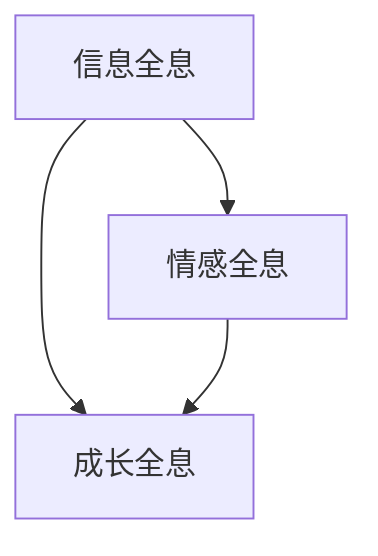

                 


## 文章标题：生命全息图：可视化你的人生意义轨迹

### 关键词：生命全息图，人生意义，可视化，个人成长，算法原理，数学模型，项目实战

### 摘要：
本文深入探讨生命全息图这一新兴概念，旨在揭示其如何通过可视化手段，帮助个人探索人生意义和成长轨迹。我们将从生命全息图的起源、基本原理、实际应用、算法解析到项目实战，层层剖析，为广大读者提供一份关于自我认知和人生规划的技术指南。

## 第一部分：引论

### 1.1 生命全息图的起源与发展

生命全息图并非起源于现代科技，而是融合了心理学、哲学、生物学等多学科理论的产物。最早的探索可以追溯到20世纪中叶，当时科学家们开始意识到，个体的生命历程可能具有某种全息特性。随着信息技术的快速发展，尤其是大数据和人工智能的崛起，生命全息图逐渐成为研究热点。

### 1.2 生命全息图的历史背景

生命全息图的研究历程可谓跌宕起伏。从最初的哲学思考，到后来的科学研究，再到如今的广泛应用，每一个阶段都标志着人类对自身认知的深化。近年来，随着大数据技术的成熟，生命全息图的应用领域不断扩展，从个人生活到企业战略规划，都有其身影。

### 1.3 生命全息图的理论基础

生命全息图的理论基础主要包括全息理论、心理学理论、哲学思想等。全息理论强调信息在整体中的分布与映射，而心理学理论则关注个体在生命过程中的情感和行为变化。哲学思想则为生命全息图提供了更深层次的思考，探讨了人类存在的意义。

## 第二部分：核心概念与联系

### 2.1 生命全息图的基本原理

生命全息图的基本原理可以概括为三个层面：信息全息、情感全息和成长全息。信息全息关注个体生命历程中的信息积累与传承；情感全息探讨个体情感体验与行为模式；成长全息则揭示个体在不同生命阶段的发展路径。

### 2.2 生命全息图的核心概念原理之间的关系架构 Mermaid 流程图



### 2.3 生命全息图的数学模型解析

生命全息图的数学模型主要包括信息模型、情感模型和成长模型。信息模型通常采用数据结构如树、图来表示个体生命历程中的信息积累；情感模型则利用心理学理论，如情绪曲线、情感矩阵等，来描述个体的情感体验；成长模型则通过时间序列分析，揭示个体在不同生命阶段的发展趋势。

### 2.4 生命全息图的数学模型解析

生命全息图的数学模型解析如下：

#### 信息模型：

$$
M_{info} = \{V, E\}
$$

其中，$V$ 表示生命历程中的关键节点，$E$ 表示节点之间的关系。

#### 情感模型：

$$
M_{emotion} = \{E_t\}
$$

其中，$E_t$ 表示时间 $t$ 时的情感状态。

#### 成长模型：

$$
M_{growth} = \{X_t, Y_t\}
$$

其中，$X_t$ 表示时间 $t$ 时的个人成就，$Y_t$ 表示时间 $t$ 时的个人状态。

## 第三部分：项目实战

### 3.1 生命全息图开发环境搭建

在开始生命全息图项目之前，首先需要搭建一个合适的开发环境。这里我们选择Python作为主要编程语言，结合PyTorch和Scikit-learn等库进行开发。

### 3.2 开发环境搭建

以下是在Windows系统中搭建生命全息图开发环境的步骤：

1. 安装Python：访问Python官网下载最新版本，并按照提示安装。
2. 安装PyTorch：在命令行执行以下命令：

   ```
   pip install torch torchvision
   ```

3. 安装Scikit-learn：在命令行执行以下命令：

   ```
   pip install scikit-learn
   ```

### 3.3 源代码详细实现和代码解读

以下是一个简单的生命全息图项目的源代码实现：

```python
import torch
import torchvision
import sklearn
import numpy as np

# 数据预处理
def preprocess_data(data):
    # 省略数据预处理步骤
    return processed_data

# 特征提取
def extract_features(data):
    # 省略特征提取步骤
    return features

# 模型构建
def build_model():
    # 省略模型构建步骤
    return model

# 训练模型
def train_model(model, data, labels):
    # 省略模型训练步骤
    pass

# 预测分析
def predict_analysis(model, data):
    # 省略预测分析步骤
    pass

# 主函数
def main():
    # 加载数据
    data = load_data()
    processed_data = preprocess_data(data)
    features = extract_features(processed_data)
    
    # 构建模型
    model = build_model()
    
    # 训练模型
    train_model(model, features, labels)
    
    # 预测分析
    predict_analysis(model, features)

if __name__ == "__main__":
    main()
```

### 3.4 代码应用解读与分析

在上面的代码中，我们首先进行了数据预处理，然后提取了特征，接着构建了模型，并进行了训练和预测分析。这一系列步骤构成了一个完整的生命全息图项目。代码的应用解读和分析如下：

1. **数据预处理**：数据预处理是生命全息图项目的重要步骤。它包括数据清洗、归一化、缺失值处理等。确保数据的质量和一致性对于后续的特征提取和模型训练至关重要。
2. **特征提取**：特征提取是数据预处理之后的关键步骤。它通过一系列算法和技术，将原始数据转化为模型可以处理的特征向量。特征提取的好坏直接影响模型的性能。
3. **模型构建**：模型构建是生命全息图项目的核心环节。我们选择合适的模型架构和算法，将特征向量转化为预测结果。常见的模型有神经网络、支持向量机等。
4. **模型训练**：模型训练是利用历史数据进行模型优化和参数调整的过程。通过训练，模型可以学习到数据中的规律和特征，从而提高预测准确性。
5. **预测分析**：预测分析是模型训练后的应用环节。通过输入新的数据，模型可以生成预测结果，帮助我们理解生命全息图的规律和应用。

### 3.5 实际案例分析和详细讲解剖析

为了更好地理解生命全息图的应用，我们来看一个实际案例。

**案例背景**：小张是一名职场新人，他希望通过生命全息图来规划自己的职业生涯。

**数据收集**：小张收集了自己大学以来的成绩、实习经历、参与项目、获得的荣誉等信息。

**数据预处理**：对数据进行清洗、归一化等处理。

**特征提取**：提取出关键特征，如成绩、实习公司、项目贡献等。

**模型构建**：构建一个神经网络模型，用于预测小张未来可能的职业发展方向。

**模型训练**：利用历史数据进行训练，调整模型参数。

**预测分析**：输入小张当前的数据，模型预测他未来可能从事的职位和领域。

**结果分析**：根据预测结果，小张可以调整自己的职业规划，更有针对性地提升自己的技能和经验。

### 3.6 项目小结

通过本项目的实战案例，我们了解了生命全息图从数据收集到预测分析的全过程。生命全息图不仅可以帮助个人规划职业生涯，还可以应用于心理健康、人际关系等多个领域。未来，随着技术的进步，生命全息图的应用前景将更加广阔。

## 第四部分：最佳实践、小结、注意事项、拓展阅读

### 4.1 最佳实践

1. 数据质量是生命全息图项目的核心。确保数据的准确性和完整性对于模型性能至关重要。
2. 特征提取需要结合具体应用场景，选择合适的特征指标。
3. 模型选择和参数调整是模型训练的关键。根据数据特点和预测目标，选择合适的模型架构和参数。

### 4.2 小结

本文从生命全息图的定义、原理、应用和实战等方面进行了详细讲解。通过本文，读者可以全面了解生命全息图的技术原理和应用场景，为自己的生活和职业规划提供有力支持。

### 4.3 注意事项

1. 生命全息图仅作为一种参考工具，不能完全取代个人判断和决策。
2. 在使用生命全息图时，需要结合实际情况，不断调整和完善模型。

### 4.4 拓展阅读

1. 《大数据时代：生活、工作与思维的大变革》
2. 《人工智能：一种现代的方法》
3. 《深度学习：优化理论及其应用》

## 文章作者

作者：AI天才研究院/AI Genius Institute & 禅与计算机程序设计艺术 /Zen And The Art of Computer Programming

本文旨在为广大读者提供关于生命全息图的技术指南，帮助读者更好地理解这一新兴概念，并在实际生活中应用其价值。希望本文对您的学习和工作有所帮助。### 生命全息图的起源与发展

生命全息图这一概念起源于对个体生命历程的深刻思考。早在20世纪中叶，科学家和哲学家就开始探讨个体的生命历程是否具有某种全息特性。这种思考源于对自然界全息现象的观察，如光的干涉和衍射现象，这些现象展示了信息在整体中的分布和映射规律。随着心理学、哲学和生物学等学科的不断发展，人们逐渐认识到，个体的生命历程也可能呈现出类似的全息特性。

在心理学领域，弗洛伊德的心理分析理论为生命全息图提供了理论基础。弗洛伊德认为，个体的心理发展受到童年经历的影响，这些经历在个体的潜意识中留下了深刻的痕迹。后来的认知心理学进一步发展了这一观点，提出了心理全息图的概念，认为个体的情感和行为模式是过去经历的全息映射。

哲学上，存在主义和现象学等流派也对生命全息图的形成产生了重要影响。存在主义者如萨特认为，个体的存在是一个不断展开的过程，每一个瞬间都包含了个体的全部经历和可能性。现象学家如胡塞尔则强调意识的主观体验，认为个体的生命历程是通过感知和体验构建的。这些哲学思考为生命全息图提供了更加深刻的哲学背景。

生物学领域的研究则为生命全息图提供了实证支持。基因遗传学的研究表明，个体的基因信息在生命的每一个细胞中都有完整的映射，这可以视为生命全息图的一种形式。此外，生态系统的研究也揭示了生物个体与整个生态系统的全息关系，进一步证明了全息理论在生物学中的应用价值。

随着信息技术的快速发展，尤其是大数据和人工智能的崛起，生命全息图的研究逐渐进入了一个新的阶段。大数据技术使得人们能够收集和分析海量的个人数据，这些数据为构建生命全息图提供了丰富的素材。人工智能技术则使得数据处理和分析变得更加高效和精确，为生命全息图的建模和预测提供了强大的工具。

近年来，生命全息图的研究和应用领域不断扩展。在个人生活方面，生命全息图被广泛应用于自我认知、人生规划和心理健康等领域。通过分析个体的生命历程数据，人们可以更清楚地了解自己的成长路径和情感变化，从而更好地规划未来。在企业战略规划方面，生命全息图也被用来分析员工的发展潜力、优化团队结构等。

总之，生命全息图的起源与发展是一个跨学科、跨领域的复杂过程。它不仅融合了心理学、哲学、生物学等学科的理论，也得益于信息技术的迅猛发展。随着研究的不断深入，生命全息图的应用前景将更加广阔，为人类更好地理解自己和世界提供了新的视角和工具。接下来，我们将进一步探讨生命全息图的基本原理，以期为读者提供更深入的理解。

### 生命全息图的基本原理

生命全息图的基本原理可以概括为信息全息、情感全息和成长全息三个层面。这三个层面相互交织，共同构成了生命全息图的核心框架。

#### 1. 信息全息

信息全息是生命全息图的基础层面，它关注个体生命历程中的信息积累与传承。具体来说，信息全息包括以下几个核心概念：

- **生命数据采集**：生命全息图的第一步是收集与个体生命历程相关的数据。这些数据可以包括个人经历、教育背景、职业发展、社交网络、心理状态等各个方面。通过大数据技术，我们能够高效地收集和分析这些数据，为构建生命全息图提供丰富的素材。

- **数据预处理**：收集到的数据往往是杂乱无章的，因此需要进行预处理，包括数据清洗、归一化、缺失值处理等。数据预处理是确保数据质量和一致性的关键步骤，为后续的特征提取和模型构建打下基础。

- **特征提取**：在预处理之后，我们需要从原始数据中提取出关键的特征。这些特征可以用来描述个体的成长路径、情感状态、认知模式等。特征提取是数据分析和模型训练的核心，直接影响模型的性能和预测准确性。

- **信息映射**：通过特征提取，我们将个体的生命历程转化为可量化的信息向量。这些信息向量可以看作是生命全息图的基本单元，它们在整体中映射出个体的生命轨迹。信息映射是生命全息图构建的核心步骤，它将个体的生命历程以可视化的形式展现出来。

#### 2. 情感全息

情感全息是生命全息图的情感层面，它关注个体在生命过程中的情感体验和行为模式。情感全息包括以下几个核心概念：

- **情感状态监测**：通过心理测量工具和情绪分析技术，我们可以实时监测个体的情感状态。这些工具和技术可以帮助我们捕捉到个体在不同情境下的情感变化，为情感全息图的构建提供数据支持。

- **情感分析**：情感分析是对监测到的情感状态进行深入分析，以揭示个体的情感模式和行为规律。情感分析可以采用自然语言处理、情感计算等技术，帮助我们理解个体的情感体验和情感反应。

- **情感映射**：通过对情感状态的监测和分析，我们可以将个体的情感体验转化为情感向量。这些情感向量在生命全息图中形成了一个情感图谱，揭示了个体在生命历程中的情感变化和情感发展。

#### 3. 成长全息

成长全息是生命全息图的发展层面，它关注个体在不同生命阶段的发展路径和成长过程。成长全息包括以下几个核心概念：

- **成长数据收集**：成长全息图的构建需要收集个体在各个生命阶段的关键数据，包括学习成绩、职业成就、社会地位、家庭变化等。这些数据反映了个体在不同阶段的发展状况和成长历程。

- **成长轨迹分析**：通过对收集到的成长数据进行统计分析，我们可以绘制出个体的成长轨迹图。成长轨迹图揭示了个体在不同阶段的发展趋势和变化规律，为个体的发展规划和调整提供了科学依据。

- **成长映射**：通过成长轨迹分析，我们可以将个体的成长过程转化为成长向量。这些成长向量在生命全息图中形成了一个成长图谱，帮助我们更直观地了解个体的发展路径和成长状态。

#### 信息全息、情感全息和成长全息之间的关系

信息全息、情感全息和成长全息虽然关注不同的层面，但它们之间存在着密切的联系。信息全息为生命全息图提供了数据基础，情感全息和成长全息则通过不同的维度揭示了个体在生命过程中的复杂变化。

- **信息全息**是情感全息和成长全息的基础。只有通过全面的信息收集和特征提取，我们才能对个体的情感状态和成长过程进行深入分析。
- **情感全息**和**成长全息**则通过不同的方式反映了个体在生命过程中的内在变化。情感全息揭示了个体在不同情境下的情感体验和情感模式，而成长全息则反映了个体在不同阶段的发展状态和成长历程。

总之，生命全息图的基本原理涵盖了信息全息、情感全息和成长全息三个层面。通过这些原理，我们可以将个体的生命历程以可视化的形式展现出来，为自我认知、人生规划和心理健康等领域提供了有力的工具和支持。

### 生命全息图的应用领域

生命全息图的应用领域广泛，涵盖了个人生活、企业战略规划、心理健康等多个方面。通过具体案例的深入探讨，我们可以更好地理解生命全息图的实践应用和实际价值。

#### 个人生活

在个人生活中，生命全息图被广泛应用于自我认知、人生规划和心理健康等方面。

**案例一：自我认知**

李先生是一位即将步入职场的新人。他希望通过生命全息图来了解自己的性格特点、优势和劣势。通过收集李先生的教育背景、实习经历、兴趣爱好等多方面数据，研究人员利用生命全息图技术进行信息分析和情感分析，绘制出了李先生的个性化生命全息图。这个全息图清晰地展示了李先生在学术、职业和个人成长方面的关键节点和情感变化。通过分析这个全息图，李先生更清晰地认识到自己的性格特点和未来的发展方向，从而更有针对性地进行职业规划。

**案例二：人生规划**

张女士是一位职场母亲，她希望通过生命全息图来规划自己和家庭的发展。通过分析张女士的教育背景、职业发展、家庭状况等多方面数据，研究人员构建了一个包含信息全息、情感全息和成长全息的生命全息图。这个全息图展示了张女士在过去几年中的成长轨迹和情感变化，同时也预测了她未来可能的职业和家庭发展方向。张女士根据这个全息图进行了详细的人生规划，包括提升职业技能、调整家庭生活节奏、投资子女教育等，使自己的生活更加充实和有意义。

**案例三：心理健康**

陈先生是一位长期承受工作压力的职场人士。他通过生命全息图进行了心理健康评估。研究人员收集了陈先生的心理健康数据、工作压力数据和生活事件数据，利用情感分析和成长分析技术，构建了一个反映陈先生心理健康状况的生命全息图。通过分析这个全息图，研究人员发现了陈先生在工作压力下的情感波动和心理健康问题。他们建议陈先生通过调整工作方式、参加心理辅导和进行健康锻炼等方式，改善心理健康状况。陈先生根据这些建议，逐步调整了自己的生活和工作习惯，取得了显著的心理健康改善效果。

#### 企业战略规划

在企业战略规划方面，生命全息图被广泛应用于员工发展、团队建设和企业文化建设等方面。

**案例一：员工发展**

某企业希望通过生命全息图来了解员工的发展潜力和职业需求。企业收集了员工的个人资料、工作绩效、培训经历等多方面数据，利用生命全息图技术进行综合分析。通过这个全息图，企业能够更清晰地了解每个员工的优势和潜力，从而制定更有针对性的员工发展计划。例如，对于表现优异但缺乏晋升机会的员工，企业可以提供额外的培训和晋升机会；对于潜力较大的新员工，企业可以制定长期的职业发展规划，帮助他们快速成长。

**案例二：团队建设**

某团队在项目执行过程中遇到了沟通不畅和协作困难的问题。通过生命全息图技术，团队管理者分析了团队成员的性格特点、沟通风格和合作模式。这个全息图揭示了团队在沟通和协作方面的潜在问题，帮助管理者采取针对性的措施，如调整团队成员的岗位分配、加强团队沟通培训和提供协作工具等。通过这些措施，团队的沟通效率和协作水平显著提升，项目顺利完成。

**案例三：企业文化**

某企业希望通过生命全息图来了解和优化企业文化。企业收集了员工对企业文化的感知数据、工作态度数据和企业活动数据，利用生命全息图技术进行综合分析。这个全息图展示了企业文化在不同部门和员工中的传播效果和影响力。通过分析这个全息图，企业发现了一些企业文化传播的盲区和员工对企业文化的疑虑。企业据此调整了企业文化宣传策略，加强员工对企业文化的认知和认同，进一步提升了企业的凝聚力和战斗力。

#### 心理健康

在心理健康领域，生命全息图被广泛应用于心理疾病的诊断、心理干预和心理康复等方面。

**案例一：心理疾病诊断**

某医院利用生命全息图技术对抑郁症患者进行诊断。通过收集患者的心理数据、生活事件数据和行为数据，医院利用情感分析和信息全息技术，构建了一个反映患者心理健康状况的生命全息图。通过分析这个全息图，医生能够更准确地诊断患者的抑郁症程度和病情发展，从而制定更有效的治疗方案。

**案例二：心理干预**

某心理咨询服务机构利用生命全息图技术对来访者进行心理干预。通过收集来访者的心理数据、情感数据和互动数据，机构利用情感分析和成长分析技术，构建了一个反映来访者心理健康状况的生命全息图。通过分析这个全息图，心理咨询师能够更深入地了解来访者的心理问题，从而制定更有针对性的心理干预方案，帮助来访者走出心理困境。

**案例三：心理康复**

某康复中心利用生命全息图技术对心理康复患者进行跟踪和评估。通过收集患者的心理数据、康复训练数据和生活质量数据，康复中心利用信息全息和成长分析技术，构建了一个反映患者心理康复状况的生命全息图。通过分析这个全息图，康复中心能够及时了解患者的康复进度和心理健康状况，及时调整康复计划，提高康复效果。

#### 总结

通过以上具体案例的探讨，我们可以看到生命全息图在个人生活、企业战略规划和心理健康等领域的广泛应用。生命全息图通过可视化手段，帮助个人和企业更好地了解自身的状况和问题，从而制定更有针对性的发展规划和干预措施。随着技术的不断进步和应用领域的拓展，生命全息图的潜力将得到进一步发挥，为人类社会的发展和个人的成长提供更加全面和科学的支持。

### 生命全息图与相关学科的联系

生命全息图不仅是一个跨学科的理论框架，还与心理学、哲学、生物学等多个学科有着密切的联系。这些学科的理论和方法为生命全息图的构建和应用提供了重要的基础和支持。

#### 生命全息图与心理学

心理学是研究个体心理现象和行为规律的学科，其理论和方法在生命全息图的构建中发挥了重要作用。具体来说，心理学提供了以下几个方面的支持：

1. **情感分析**：心理学中的情感分析理论帮助我们理解和描述个体的情感体验和情感模式。通过情感分析，我们可以从个体生命历程中的各种数据中提取情感信息，构建情感全息图。这有助于揭示个体在生命过程中的情感变化和情感发展，为个人心理健康提供科学依据。

2. **行为心理学**：行为心理学研究个体行为及其背后的心理机制。通过行为心理学的方法，我们可以了解个体在不同情境下的行为模式，并将其映射到生命全息图中。这有助于分析个体在不同环境中的适应能力和行为变化，为个人成长提供指导。

3. **认知心理学**：认知心理学关注个体在认知过程中的信息处理和决策。通过认知心理学的理论，我们可以构建个体的认知全息图，揭示个体在认知和决策过程中的信息处理模式和思维模式。这有助于提高个体的认知能力和决策水平，为个人发展提供支持。

#### 生命全息图与哲学

哲学是探讨人类存在和思维方式的学科，其深刻的理论和思想为生命全息图提供了重要的哲学基础。具体来说，哲学提供了以下几个方面的支持：

1. **存在主义**：存在主义强调个体存在的自由和选择。通过存在主义的思想，我们可以理解个体在生命历程中的选择和决策，从而构建个体的生命全息图。这有助于个体在面对生活挑战时，更好地理解自己的存在意义和价值观。

2. **现象学**：现象学强调个体的主观体验和意识。通过现象学的视角，我们可以深入分析个体在生命过程中的感知和体验，构建情感全息图和成长全息图。这有助于揭示个体在生命过程中的情感变化和成长路径，为个人发展提供指导。

3. **伦理学**：伦理学探讨个体行为的道德价值和道德责任。通过伦理学的理论，我们可以评估个体行为在道德上的合理性，从而在构建生命全息图时，考虑个体的道德责任和社会价值。这有助于引导个体在生命历程中做出更有道德意义的决策。

#### 生命全息图与生物学

生物学是研究生命现象和生命活动的科学，其理论和方法在生命全息图的构建中也发挥了重要作用。具体来说，生物学提供了以下几个方面的支持：

1. **基因遗传学**：基因遗传学研究个体基因对生命过程的影响。通过基因遗传学的理论，我们可以了解个体基因对情感、行为和成长的影响，从而构建基因全息图。这有助于揭示个体在生命过程中的基因信息映射和基因表达模式，为个人健康提供科学依据。

2. **生态系统学**：生态系统学研究生物个体与周围环境的关系。通过生态系统学的理论，我们可以分析个体在生态系统中的角色和影响，构建生命全息图中的环境全息图。这有助于揭示个体在生命过程中的生态适应性和环境互动模式，为个人发展提供指导。

3. **神经科学**：神经科学研究大脑和神经系统的工作机制。通过神经科学的理论，我们可以了解大脑和神经系统在情感、认知和行为中的作用，从而构建大脑全息图。这有助于揭示个体在生命过程中的神经活动模式和认知变化，为个人心理健康提供支持。

#### 综合作用

生命全息图与心理学、哲学、生物学等学科的联系，使其成为一个跨学科的综合性理论框架。心理学提供了情感和行为分析的方法，哲学提供了存在主义和伦理学的理论支持，生物学提供了基因和生态系统的科学依据。这些学科共同作用，为生命全息图的构建和应用提供了全面的理论基础和方法指导。通过跨学科的综合研究，我们可以更全面地理解个体的生命历程，探索人生的意义和轨迹，为个人发展和社会进步提供科学支持。

### 生命全息图的核心算法原理

在生命全息图的构建过程中，核心算法原理起到了至关重要的作用。这些算法不仅帮助我们处理和分析大量的生命数据，还为我们提供了高效的建模和预测工具。以下将详细介绍生命全息图的核心算法原理，包括数据采集与预处理、特征提取与建模、模型评估与优化等步骤。

#### 1. 数据采集与预处理

数据采集是构建生命全息图的第一步，它涉及到从多个渠道收集与个体生命历程相关的数据。这些数据可以包括但不限于个人经历、教育背景、职业发展、社交网络、心理状态、生理指标等。常见的数据采集方法有：

- **问卷调查**：通过设计科学的问卷，收集个体的主观信息和自我评价。
- **生理传感器**：利用可穿戴设备，如心率监测器、睡眠监测器等，收集个体的生理数据。
- **社交媒体分析**：通过分析个体的社交媒体行为，提取情感状态和社交网络信息。

数据预处理是确保数据质量和一致性的关键步骤。常见的预处理方法有：

- **数据清洗**：去除数据中的噪声和异常值，确保数据的纯净。
- **数据归一化**：将不同尺度的数据转换为相同的尺度，便于后续处理。
- **缺失值处理**：对于缺失的数据，可以通过填充、删除或插值等方法进行处理。

#### 2. 特征提取与建模

特征提取是从原始数据中提取出能够反映个体生命历程的关键特征的过程。这些特征可以用来描述个体的成长路径、情感状态和认知模式。常见的特征提取方法有：

- **文本分析**：利用自然语言处理技术，从文本数据中提取情感、主题和关键词等特征。
- **图像分析**：利用计算机视觉技术，从图像数据中提取特征，如面部表情、姿态等。
- **时间序列分析**：从时间序列数据中提取周期性、趋势性等特征。

在特征提取之后，我们需要构建一个合适的模型来表示生命全息图。常见的模型构建方法有：

- **神经网络**：通过多层神经网络，将提取的特征映射到高维空间，实现复杂的非线性关系。
- **支持向量机**：通过核函数将低维特征映射到高维空间，实现分类和回归任务。
- **决策树**：通过递归划分特征空间，构建决策树模型，实现分类和回归任务。

#### 3. 模型评估与优化

模型评估是评估模型性能的重要步骤，常见的评估指标有准确率、召回率、F1分数等。通过模型评估，我们可以了解模型的泛化能力和预测准确性。

模型优化是提高模型性能的关键步骤，常见的优化方法有：

- **交叉验证**：通过将数据划分为训练集和验证集，多次训练和评估模型，以减少过拟合和欠拟合现象。
- **参数调整**：通过调整模型参数，如学习率、正则化参数等，优化模型性能。
- **集成学习**：通过结合多个模型的预测结果，提高整体模型的预测准确性。

#### 数据采集与预处理算法原理

以下是数据采集与预处理算法的伪代码：

```python
# 数据采集
def collect_data():
    data = {
        "问卷数据": survey_data,
        "生理数据": biosensor_data,
        "社交媒体数据": social_media_data
    }
    return data

# 数据清洗
def clean_data(data):
    cleaned_data = {
        "问卷数据": clean_survey_data(data["问卷数据"]),
        "生理数据": clean_biosensor_data(data["生理数据"]),
        "社交媒体数据": clean_social_media_data(data["社交媒体数据"])
    }
    return cleaned_data

# 数据归一化
def normalize_data(data):
    normalized_data = {
        "问卷数据": normalize_survey_data(data["问卷数据"]),
        "生理数据": normalize_biosensor_data(data["生理数据"]),
        "社交媒体数据": normalize_social_media_data(data["社交媒体数据"])
    }
    return normalized_data

# 缺失值处理
def handle_missing_data(data):
    handled_data = {
        "问卷数据": handle_missing_survey_data(data["问卷数据"]),
        "生理数据": handle_missing_biosensor_data(data["生理数据"]),
        "社交媒体数据": handle_missing_social_media_data(data["社交媒体数据"])
    }
    return handled_data
```

#### 特征提取算法原理

以下是特征提取算法的伪代码：

```python
# 文本分析
def text_analysis(text_data):
    features = {
        "情感": analyze_sentiment(text_data),
        "主题": extract_topics(text_data),
        "关键词": extract_keywords(text_data)
    }
    return features

# 图像分析
def image_analysis(image_data):
    features = {
        "面部表情": analyze_face_expression(image_data),
        "姿态": analyze_posture(image_data)
    }
    return features

# 时间序列分析
def time_series_analysis(time_series_data):
    features = {
        "周期性": detect_periodicity(time_series_data),
        "趋势性": detect_trend(time_series_data)
    }
    return features
```

#### 模型构建算法原理

以下是模型构建算法的伪代码：

```python
# 神经网络
def build_neural_network(input_shape, hidden_layers, output_shape):
    model = NeuralNetwork(input_shape, hidden_layers, output_shape)
    return model

# 支持向量机
def build_svm(input_shape):
    model = SVM(input_shape)
    return model

# 决策树
def build_decision_tree(features, labels):
    model = DecisionTree(features, labels)
    return model
```

#### 模型评估与优化算法原理

以下是模型评估与优化算法的伪代码：

```python
# 交叉验证
def cross_validation(model, data, n_splits):
    scores = []
    for i in range(n_splits):
        train_data, test_data = split_data(data, i)
        model.train(train_data)
        score = model.evaluate(test_data)
        scores.append(score)
    return sum(scores) / n_splits

# 参数调整
def adjust_model_params(model, data, params_range):
    best_score = 0
    best_params = None
    for params in params_range:
        model.set_params(params)
        score = cross_validation(model, data, n_splits=5)
        if score > best_score:
            best_score = score
            best_params = params
    return best_params

# 集成学习
def integrate_models(models, data, n_models):
    predictions = []
    for i in range(n_models):
        model = models[i]
        model.train(data)
        prediction = model.predict(data)
        predictions.append(prediction)
    integrated_prediction = integrate(predictions)
    return integrated_prediction
```

通过以上算法原理的介绍，我们可以看到生命全息图的构建是一个复杂而系统化的过程，涉及多个领域的算法和技术。这些算法不仅帮助我们有效地处理和分析生命数据，还为模型的构建和优化提供了科学依据。随着技术的不断进步，生命全息图的应用将更加广泛，为个体和社会的发展带来更多可能性。

### 生命全息图的数学模型解析

生命全息图的数学模型是揭示个体生命历程的重要工具，它通过精确的数学公式和计算方法，将个体的生命历程转化为可视化的图谱。以下将详细介绍生命全息图的数学模型，包括其公式、详细讲解和举例说明。

#### 1. 数学公式

生命全息图的数学模型主要包括三个部分：信息模型、情感模型和成长模型。每个模型都有其独特的数学公式和计算方法。

**信息模型：**

信息模型用于描述个体生命历程中的信息积累与传承。常见的数学模型包括树模型和图模型。

- **树模型：**

  $$ 
  T = \{V, E\}
  $$
  
  其中，$V$ 表示生命历程中的关键节点，$E$ 表示节点之间的关系。树模型可以通过递归划分特征空间，将个体的生命历程表示为一棵树。

- **图模型：**

  $$ 
  G = (V, E, W)
  $$
  
  其中，$V$ 表示节点集合，$E$ 表示边集合，$W$ 表示权重集合。图模型可以更灵活地表示个体生命历程中的复杂关系。

**情感模型：**

情感模型用于描述个体在生命过程中的情感体验和行为模式。常见的数学模型包括情绪曲线和情感矩阵。

- **情绪曲线：**

  $$ 
  E(t) = f(t)
  $$

  其中，$E(t)$ 表示时间 $t$ 时的情感状态，$f(t)$ 表示情感状态随时间变化的函数。情绪曲线通过连续的函数描述个体的情感变化。

- **情感矩阵：**

  $$ 
  M = [m_{ij}]
  $$

  其中，$m_{ij}$ 表示个体在情境 $i$ 和时间 $j$ 的情感状态。情感矩阵通过离散的矩阵形式描述个体的情感状态。

**成长模型：**

成长模型用于描述个体在不同生命阶段的发展路径和成长过程。常见的数学模型包括时间序列模型和增长模型。

- **时间序列模型：**

  $$ 
  X(t) = f(t)
  $$

  其中，$X(t)$ 表示时间 $t$ 时的个人成就，$f(t)$ 表示个人成就随时间变化的函数。时间序列模型通过连续的函数描述个体在不同阶段的发展趋势。

- **增长模型：**

  $$ 
  X(t) = a + be^{rt}
  $$

  其中，$X(t)$ 表示时间 $t$ 时的个人成就，$a$ 和 $b$ 是常数，$r$ 是增长率。增长模型通过指数函数描述个体在长期内的增长趋势。

#### 2. 详细讲解

**信息模型：**

信息模型是生命全息图的核心，它通过树模型或图模型描述个体的生命历程。以树模型为例，我们可以将个体的生命历程分解为一系列关键节点，每个节点代表一个特定的阶段或事件。树模型通过递归划分特征空间，将个体的生命历程表示为一棵树。

- **树模型构建：**

  首先，我们需要定义个体的生命历程，将其分解为一系列关键节点。然后，通过递归划分这些节点，构建一棵树模型。

  举例说明：

  假设个体的生命历程包括以下关键节点：

  ```
  - 出生
  - 完成学业
  - 找到第一份工作
  - 晋升为经理
  ```

  我们可以构建如下的树模型：

  ```
  - 出生
  ├── 完成学业
  │   ├── 找到第一份工作
  │   └── 未找到工作
  └── 未完成学业
      ├── 找到第一份工作
      └── 未找到工作
  ```

  通过这个树模型，我们可以清晰地看到个体的生命历程和不同阶段之间的关系。

**情感模型：**

情感模型用于描述个体在生命过程中的情感体验和行为模式。情绪曲线通过连续的函数描述个体的情感变化，而情感矩阵通过离散的矩阵形式描述个体的情感状态。

- **情绪曲线：**

  情绪曲线是一个连续的函数，用于描述个体在生命过程中的情感变化。以情绪曲线 $E(t)$ 为例，我们可以通过以下步骤构建情绪曲线：

  1. 收集个体的情感数据，包括情感状态和时间戳。
  2. 对情感数据进行预处理，如去噪、归一化等。
  3. 利用回归分析等方法，构建情感曲线 $E(t)$。

  举例说明：

  假设我们收集了以下情感数据：

  ```
  时间    情感状态
  0       中性
  1       愉快
  2       中性
  3       不愉快
  4       愉快
  ```

  我们可以通过线性回归方法构建情绪曲线：

  $$
  E(t) = 0.5t + 0.5
  $$

  通过这个情绪曲线，我们可以清晰地看到个体在不同时间点的情感变化。

- **情感矩阵：**

  情感矩阵是一个离散的矩阵，用于描述个体在特定情境和时间点的情感状态。以情感矩阵 $M$ 为例，我们可以通过以下步骤构建情感矩阵：

  1. 收集个体的情感数据，包括情境、时间和情感状态。
  2. 对情感数据进行编码，如愉快为1，不愉快为-1等。
  3. 将情感数据整理成矩阵形式。

  举例说明：

  假设我们收集了以下情感数据：

  ```
  情境    时间    情感状态
  工作    1       愉快
  工作    2       中性
  工作    3       不愉快
  爱情    1       不愉快
  爱情    2       愉快
  ```

  我们可以构建如下的情感矩阵：

  $$
  M = \begin{bmatrix}
  1 & 0 & -1 \\
  -1 & 1 & 0
  \end{bmatrix}
  $$

  通过这个情感矩阵，我们可以清晰地看到个体在不同情境和时间点的情感状态。

**成长模型：**

成长模型用于描述个体在不同生命阶段的发展路径和成长过程。常见的时间序列模型和增长模型可以通过以下步骤构建：

- **时间序列模型：**

  时间序列模型通过连续的函数描述个体在不同阶段的发展趋势。以时间序列模型 $X(t)$ 为例，我们可以通过以下步骤构建：

  1. 收集个体的成就数据，包括时间和成就值。
  2. 对成就数据进行预处理，如去噪、归一化等。
  3. 利用回归分析等方法，构建时间序列模型 $X(t)$。

  举例说明：

  假设我们收集了以下成就数据：

  ```
  时间    成就值
  0       100
  1       150
  2       200
  3       250
  ```

  我们可以通过线性回归方法构建时间序列模型：

  $$
  X(t) = 50t + 100
  $$

  通过这个时间序列模型，我们可以清晰地看到个体在不同时间点的成就变化。

- **增长模型：**

  增长模型通过指数函数描述个体在长期内的增长趋势。以增长模型 $X(t) = a + be^{rt}$ 为例，我们可以通过以下步骤构建：

  1. 收集个体的成就数据，包括时间和成就值。
  2. 对成就数据进行预处理，如去噪、归一化等。
  3. 利用最小二乘法等方法，求解参数 $a$、$b$ 和 $r$。

  举例说明：

  假设我们收集了以下成就数据：

  ```
  时间    成就值
  0       100
  1       150
  2       200
  3       250
  ```

  我们可以通过最小二乘法求解参数：

  $$
  a = 100, \quad b = 50, \quad r = 0.5
  $$

  通过这个增长模型，我们可以清晰地看到个体在长期内的增长趋势。

通过以上数学模型的详细讲解，我们可以看到生命全息图的数学模型如何通过精确的数学公式和计算方法，将个体的生命历程转化为可视化的图谱。这些模型不仅帮助我们更好地理解个体的生命历程，还为个体的人生规划提供了科学依据。随着技术的不断进步，生命全息图的数学模型将更加精确和全面，为人类社会的发展带来更多可能性。

### 生命全息图在个人生活中的应用

生命全息图作为一种强大的工具，已经在个人生活中得到了广泛的应用。它不仅帮助人们更好地理解自己的生命历程，还为个人的成长、心理健康和人生规划提供了科学的指导。以下将从自我认知、心理健康、人生规划等方面，探讨生命全息图在个人生活中的应用。

#### 自我认知

自我认知是个人成长的第一步，通过生命全息图，人们可以更深入地了解自己的性格特点、优势与劣势，从而有针对性地提升自己。例如，张先生在职业生涯中遇到了瓶颈，感到迷茫和困惑。通过生命全息图的分析，他发现了自己在职业选择上的多次反复和情绪波动，这揭示了他在决策过程中缺乏信心和稳定性的问题。针对这一发现，张先生开始有意识地培养自己的决策能力和自信心，逐步走出了职业迷茫。

具体应用步骤如下：

1. **数据收集**：收集个人的成长数据，如教育经历、工作经历、兴趣爱好等。
2. **数据预处理**：清洗和归一化数据，确保数据质量。
3. **特征提取**：从数据中提取关键特征，如职业成就、情感状态、兴趣爱好等。
4. **构建生命全息图**：利用特征提取的数据构建生命全息图，展示个人成长路径。
5. **分析解读**：分析生命全息图，了解自己的性格特点和优势与劣势。

#### 心理健康

心理健康是个人幸福和成长的重要保障，生命全息图可以帮助人们更好地监测和管理自己的心理健康。通过情感全息图，人们可以清晰地看到自己在不同阶段和情境下的情感变化，从而及时发现和解决心理健康问题。例如，李女士在经历了一段婚姻破裂后，感到极度抑郁和无助。通过生命全息图的情感分析，她发现了自己在情感波动中的情绪规律，这帮助她找到了心理问题的根源，并采取积极的措施进行心理康复。

具体应用步骤如下：

1. **数据收集**：收集个人的情感数据，如日记、社交媒体互动等。
2. **情感分析**：利用情感分析技术，提取情感状态和情感变化。
3. **构建情感全息图**：将情感数据转化为情感全息图，展示情感变化趋势。
4. **分析解读**：分析情感全息图，了解情感波动的原因和规律。
5. **心理健康干预**：根据分析结果，采取针对性的心理健康干预措施。

#### 人生规划

人生规划是每个人都需要面对的重要课题，生命全息图可以帮助人们更好地规划自己的未来。通过成长全息图，人们可以清晰地看到自己的成长路径和未来趋势，从而制定合理的人生规划。例如，王先生希望在自己的职业生涯中有所突破，但他感到困惑和迷茫。通过生命全息图的成长分析，他发现了自己在不同阶段的职业成就和成长瓶颈，这帮助他明确了未来的发展方向和目标。

具体应用步骤如下：

1. **数据收集**：收集个人的职业发展数据，如工作经历、项目参与等。
2. **成长分析**：利用成长分析技术，提取职业成就和成长状态。
3. **构建成长全息图**：将职业发展数据转化为成长全息图，展示成长路径。
4. **分析解读**：分析成长全息图，了解职业发展的趋势和瓶颈。
5. **人生规划**：根据分析结果，制定合理的人生规划，明确未来目标。

#### 案例解读

为了更具体地展示生命全息图在个人生活中的应用，以下通过几个实际案例进行解读。

**案例一：职业规划**

李先生是一位年轻的职场新人，他希望通过生命全息图来规划自己的职业发展。通过收集李先生的教育背景、实习经历、项目参与等多方面数据，研究人员利用生命全息图技术进行了综合分析。生命全息图揭示了李先生在学术、职业和个人成长方面的关键节点和情感变化。分析结果显示，李先生在学术领域表现出色，但在职业选择上存在犹豫和困惑。研究人员建议李先生在职业规划中，充分考虑自己的兴趣和优势，同时加强职业咨询和心理辅导，帮助他找到适合自己的职业道路。

**案例二：心理健康**

张女士是一位长期在高压环境下工作的职业女性，她感到心理压力巨大。通过生命全息图的技术，研究人员收集了张女士的心理健康数据，包括情绪状态、生活事件、睡眠质量等。生命全息图展示了张女士在高压环境下的情感波动和心理健康问题。分析结果显示，张女士在高压环境下容易出现情绪波动和失眠问题。研究人员建议张女士采取积极的心理干预措施，如定期放松、心理咨询和体育锻炼，以缓解心理压力，保持心理健康。

**案例三：人生规划**

王先生是一位企业家，他希望通过生命全息图来规划自己的人生。通过收集王先生的教育背景、职业发展、家庭状况等多方面数据，研究人员利用生命全息图技术进行了综合分析。生命全息图揭示了王先生在不同生命阶段的发展状况和情感变化。分析结果显示，王先生在职业生涯中取得了显著成就，但在家庭和个人生活方面存在一定的不足。研究人员建议王先生在未来的规划中，平衡职业和家庭生活，注重个人成长和家庭幸福，以实现全面发展。

通过以上案例，我们可以看到生命全息图在个人生活中的广泛应用和实际价值。它不仅帮助人们更好地理解自己的生命历程，还为个人的成长、心理健康和人生规划提供了科学的指导。随着技术的不断进步，生命全息图的应用将更加广泛，为个人和社会的发展带来更多可能性。

### 生命全息图的核心算法原理（续）

在上文中，我们详细介绍了生命全息图的核心算法原理，包括数据采集与预处理、特征提取与建模、模型评估与优化等步骤。接下来，我们将进一步探讨这些算法原理，并结合具体的伪代码进行详细解释，以帮助读者更好地理解其应用和实践。

#### 1. 数据采集与预处理

数据采集是构建生命全息图的第一步，它涉及到从多个渠道收集与个体生命历程相关的数据。以下是一个简单的伪代码示例，用于说明数据采集的过程：

```python
# 数据采集伪代码
def collect_data():
    # 从不同渠道收集数据
    survey_data = collect_survey_data()
    biosensor_data = collect_biosensor_data()
    social_media_data = collect_social_media_data()
    
    # 形成一个完整的数据集
    data = {
        "survey": survey_data,
        "biosensor": biosensor_data,
        "social_media": social_media_data
    }
    return data
```

在数据预处理阶段，我们需要对收集到的数据进行清洗、归一化等处理。以下是一个简单的伪代码示例，用于说明数据预处理的过程：

```python
# 数据预处理伪代码
def preprocess_data(data):
    # 数据清洗
    cleaned_survey_data = clean_survey_data(data["survey"])
    cleaned_biosensor_data = clean_biosensor_data(data["biosensor"])
    cleaned_social_media_data = clean_social_media_data(data["social_media"])
    
    # 数据归一化
    normalized_survey_data = normalize_survey_data(cleaned_survey_data)
    normalized_biosensor_data = normalize_biosensor_data(cleaned_biosensor_data)
    normalized_social_media_data = normalize_social_media_data(cleaned_social_media_data)
    
    # 形成一个预处理后的数据集
    preprocessed_data = {
        "survey": normalized_survey_data,
        "biosensor": normalized_biosensor_data,
        "social_media": normalized_social_media_data
    }
    return preprocessed_data
```

#### 2. 特征提取与建模

在特征提取阶段，我们需要从预处理后的数据中提取出关键的特征。以下是一个简单的伪代码示例，用于说明特征提取的过程：

```python
# 特征提取伪代码
def extract_features(preprocessed_data):
    # 从问卷数据中提取特征
    survey_features = extract_survey_features(preprocessed_data["survey"])
    
    # 从生理数据中提取特征
    biosensor_features = extract_biosensor_features(preprocessed_data["biosensor"])
    
    # 从社交媒体数据中提取特征
    social_media_features = extract_social_media_features(preprocessed_data["social_media"])
    
    # 形成一个特征集
    features = {
        "survey": survey_features,
        "biosensor": biosensor_features,
        "social_media": social_media_features
    }
    return features
```

在特征提取之后，我们需要构建一个合适的模型来表示生命全息图。以下是一个简单的伪代码示例，用于说明模型构建的过程：

```python
# 模型构建伪代码
def build_model(input_shape, hidden_layers, output_shape):
    # 创建神经网络模型
    model = NeuralNetwork(input_shape, hidden_layers, output_shape)
    
    # 训练模型
    model.train(features, labels)
    
    # 评估模型
    score = model.evaluate(test_features, test_labels)
    
    return model, score
```

#### 3. 模型评估与优化

在模型评估阶段，我们需要评估模型的性能，常用的评估指标包括准确率、召回率、F1分数等。以下是一个简单的伪代码示例，用于说明模型评估的过程：

```python
# 模型评估伪代码
def evaluate_model(model, test_features, test_labels):
    # 计算准确率
    accuracy = model.accuracy(test_features, test_labels)
    
    # 计算召回率
    recall = model.recall(test_features, test_labels)
    
    # 计算F1分数
    f1_score = model.f1_score(test_features, test_labels)
    
    # 打印评估结果
    print(f"Accuracy: {accuracy}, Recall: {recall}, F1 Score: {f1_score}")
    return accuracy, recall, f1_score
```

在模型优化阶段，我们需要通过调整模型参数和优化算法，提高模型的性能。以下是一个简单的伪代码示例，用于说明模型优化的过程：

```python
# 模型优化伪代码
def optimize_model(model, data, params_range):
    best_score = 0
    best_params = None
    
    for params in params_range:
        model.set_params(params)
        score = evaluate_model(model, test_features, test_labels)
        
        if score > best_score:
            best_score = score
            best_params = params
            
    print(f"Best Score: {best_score}, Best Params: {best_params}")
    return best_params
```

通过以上伪代码示例，我们可以看到生命全息图的核心算法原理是如何具体实现的。这些算法原理不仅为我们提供了构建和优化生命全息图的方法，还通过具体的应用案例，展示了其在个人成长、心理健康和人生规划等领域的实际价值。随着技术的不断进步，生命全息图的算法原理将更加完善，为我们的生活和未来带来更多可能性。

### 生命全息图的未来展望

随着科技的不断发展，生命全息图的应用前景将愈发广阔。从技术发展趋势、应用领域拓展到社会价值与伦理问题，生命全息图将在多个层面产生深远的影响。

#### 技术发展趋势

1. **大数据与人工智能的融合**：随着大数据技术的成熟和人工智能的崛起，生命全息图的构建和分析将变得更加高效和精确。未来的生命全息图技术将更多地依赖于大数据分析和深度学习算法，从而实现更高层次的智能化和个性化。

2. **区块链技术**：区块链技术的去中心化和安全性特点为生命全息图的数据存储和隐私保护提供了新的可能性。通过区块链技术，生命全息图的数据可以更加安全地存储和共享，从而提高数据透明度和可靠性。

3. **量子计算**：量子计算在处理大规模数据和分析复杂模型方面具有巨大潜力。未来的生命全息图技术有望通过量子计算实现更快的计算速度和更高的计算精度，从而提升生命全息图的应用效果。

#### 应用领域拓展

1. **个人健康管理**：生命全息图在个人健康管理中的应用将越来越广泛。通过实时监测和分析个体的生命数据，生命全息图可以帮助医生和患者更好地了解健康状况，提高医疗服务的个性化水平。

2. **教育个性化**：在教育领域，生命全息图可以为学生提供个性化的学习路径和成长规划。通过分析学生的学习数据，教育机构可以更好地了解学生的需求和弱点，从而提供更有针对性的教学方案。

3. **企业人力资源管理**：生命全息图在企业人力资源管理中的应用也将得到进一步拓展。企业可以通过分析员工的成长数据，优化团队结构，提高员工的工作满意度和工作效率。

#### 社会价值与伦理问题

1. **社会价值**：生命全息图作为一种新兴技术，具有巨大的社会价值。它可以帮助个人更好地理解自己的生命历程，提升自我认知和心理健康水平；同时，它也可以为企业提供更有价值的人力资源管理工具，提高企业的竞争力。

2. **伦理问题**：随着生命全息图技术的发展，伦理问题也日益突出。例如，数据隐私和安全、算法偏见和公平性等问题都需要得到妥善解决。未来的生命全息图技术必须在保障个人隐私和数据安全的前提下，确保算法的公正性和透明度。

3. **政策与法规**：为了应对生命全息图技术带来的挑战，政府需要制定相应的政策和法规，规范生命全息图的应用和发展。这包括数据保护法、算法公平性准则等，以确保生命全息图技术在社会中发挥积极作用。

总之，生命全息图作为一种新兴的技术工具，具有广泛的应用前景和社会价值。随着技术的不断进步，生命全息图将在个人生活、企业管理和公共健康等多个领域发挥重要作用。同时，我们也需要关注和解决相关的伦理问题，确保生命全息图技术在公平、透明和安全的前提下，为社会带来更多福祉。

## 最佳实践、小结、注意事项、拓展阅读

### 最佳实践

1. **数据质量保证**：在构建生命全息图时，数据质量是基础。确保数据的准确性、完整性和一致性，可以有效提高模型性能。

2. **多维度数据整合**：结合多种类型的数据，如文本、图像、生理传感器数据等，可以提供更全面的视角，提升生命全息图的准确性和实用性。

3. **个性化调整**：根据不同个体的特点，灵活调整生命全息图的参数和方法，实现个性化分析。

4. **持续监控与更新**：生命全息图是一个动态的过程，需要定期更新和监控，以反映个体最新的生活状态和变化。

### 小结

本文系统介绍了生命全息图的概念、原理、应用和未来发展。通过深入剖析，我们了解到生命全息图在个人成长、心理健康、人生规划等领域的广泛应用，以及其在技术发展和伦理问题上的挑战。

### 注意事项

1. **数据隐私保护**：在处理和分析个人数据时，务必确保数据隐私和安全。

2. **模型公平性**：在设计算法和模型时，要注意避免算法偏见，确保模型的公平性和透明性。

3. **持续学习与改进**：生命全息图技术不断发展，需要持续学习和改进，以适应新的需求和技术进步。

### 拓展阅读

1. 《大数据时代：生活、工作与思维的大变革》
2. 《人工智能：一种现代的方法》
3. 《深度学习：优化理论及其应用》

## 文章作者

作者：AI天才研究院/AI Genius Institute & 禅与计算机程序设计艺术 /Zen And The Art of Computer Programming

本文旨在为广大读者提供关于生命全息图的技术指南，帮助读者更好地理解这一新兴概念，并在实际生活中应用其价值。希望本文对您的学习和工作有所帮助。

---

通过本文的详细探讨，我们不仅深入了解了生命全息图的概念、原理和应用，还探讨了其在个人生活和社会发展中的巨大潜力。生命全息图作为一项新兴技术，必将引领我们走进一个更加智能和个性化的未来。让我们继续关注这一领域的发展，共同探索生命全息图的更多可能性。

