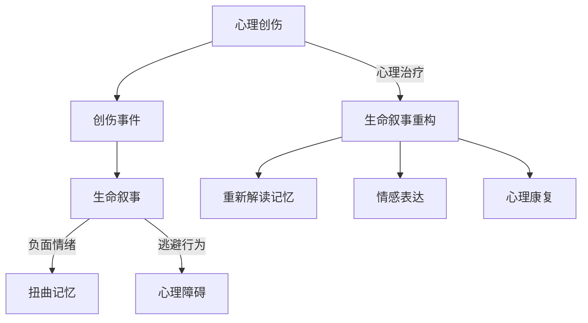
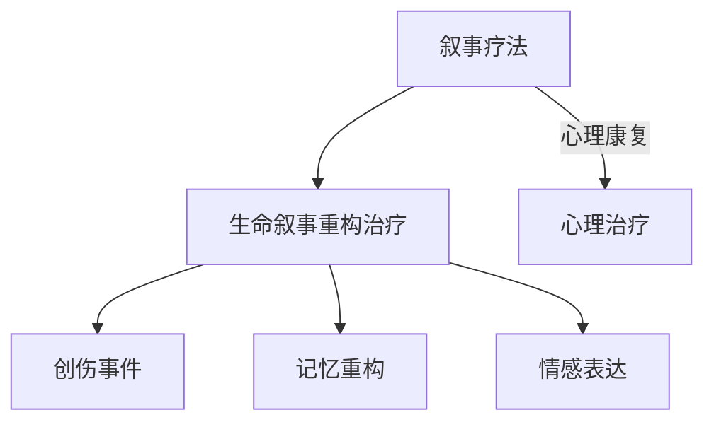

                 

## 文章标题

# 《生命叙事重构治疗师培训：通过讲故事疗愈内心创伤的专业课程》

## 文章关键词

- 生命叙事重构治疗
- 心理创伤疗愈
- 讲故事疗法
- 专业课程培训
- 心理治疗技术

## 摘要

本文旨在探讨《生命叙事重构治疗师培训：通过讲故事疗愈内心创伤的专业课程》的核心内容和价值。文章首先介绍了生命叙事重构治疗的背景和定义，然后详细阐述了其核心概念和原理，以及生命叙事重构治疗的基本步骤和策略。接下来，文章通过 Mermaid 流�程图展示了生命叙事重构治疗的算法原理，并使用伪代码对其核心算法进行了详细解析。最后，文章通过实际案例分析和项目实战，探讨了生命叙事重构治疗的应用效果和未来发展趋势。

---

### 背景介绍

生命叙事重构治疗是一种基于叙事心理学的心理治疗方式，通过帮助患者重构生命叙事，以达到疗愈内心创伤的目的。近年来，随着心理学研究的深入和心理学治疗方法的不断丰富，生命叙事重构治疗逐渐成为一种受到广泛认可的心理治疗方法。

在心理学领域，心理创伤是一个重要的研究课题。心理创伤是指由极端的压力或创伤性事件导致的深层次的心理问题，如创伤后应激障碍（PTSD）、焦虑症、抑郁症等。传统的心理治疗方法如认知行为疗法（CBT）等，虽然在一定程度上能够缓解心理创伤的症状，但对于那些深受内心创伤困扰的患者，往往需要更为深入和个性化的治疗方式。

生命叙事重构治疗正是基于这一需求应运而生的。该治疗方法的核心在于帮助患者通过重构生命叙事，重新审视和理解自己的经历，从而找到疗愈内心创伤的方法。通过这种方式，患者不仅能够更好地处理自己的情绪，还能够增强自我认知和自我效能感。

此外，生命叙事重构治疗在实践中的应用也逐渐得到了认可。无论是在个体治疗还是小组治疗中，生命叙事重构治疗都展现出了良好的效果。尤其是在那些经历严重创伤的患者中，生命叙事重构治疗能够帮助他们重新找回生活的意义，并实现内心的平和与安宁。

总的来说，生命叙事重构治疗作为一种新兴的心理治疗方法，不仅丰富了心理治疗的理论体系，也为那些深受心理创伤困扰的患者提供了一种有效的治疗选择。随着相关研究和实践的不断深入，生命叙事重构治疗有望在未来的心理治疗领域中发挥更加重要的作用。

### 核心概念与联系

生命叙事重构治疗的核心理念在于通过重构个体的生命叙事，帮助患者从心理创伤中恢复和疗愈。为了更好地理解这一治疗方法，我们需要深入探讨其核心概念，并分析这些概念之间的联系。

首先，心理创伤是一个关键概念。心理创伤指的是个体因经历极端压力或创伤性事件而产生的深层次心理问题。创伤性事件可以是战争、性侵、自然灾害、亲人去世等，这些事件往往会在个体的心理上留下持久的阴影。心理创伤的症状包括但不限于创伤后应激障碍（PTSD）、焦虑、抑郁、失眠、记忆丧失等。

其次，生命叙事是生命叙事重构治疗的另一个核心概念。生命叙事指的是个体对自身生命历程的叙述，包括重要事件、情感体验、成长经历等。生命叙事不仅是一种回忆，更是一种对自我认知和情感体验的表达方式。在心理治疗中，生命叙事被视为患者内心世界的镜像，通过叙述生命故事，患者能够更好地理解自己的情感和行为。

接下来，我们需要探讨心理创伤与生命叙事之间的关系。心理创伤往往会在生命叙事中留下明显的痕迹，这些痕迹可能表现为负面情绪、扭曲的记忆、逃避等。例如，一个经历了性侵的患者可能在生命叙事中不断重复受害经历，从而产生强烈的恐惧和焦虑。通过生命叙事重构，治疗师可以帮助患者识别并重新解读这些创伤性记忆，从而减少心理负担。

心理创伤与生命叙事之间的联系可以通过Mermaid流程图来展示：



在这个流程图中，心理创伤（A）是由创伤事件（B）引起的，这些事件影响了个体的生命叙事（C）。生命叙事中可能包含负面情绪（D）、扭曲记忆（E）和逃避行为（E）。通过心理治疗，特别是生命叙事重构（F），患者可以重新解读记忆（G），表达情感（H），并最终实现心理康复（I）。

此外，另一个核心概念是叙事疗法。叙事疗法是一种通过故事来帮助个体理解和改变自身经验的疗法。在生命叙事重构治疗中，叙事疗法被视为一个重要的工具，用于引导患者讲述自己的生命故事，并从中找到疗愈的路径。

叙事疗法与生命叙事重构治疗之间的关系可以进一步通过Mermaid流程图来展示：



在这个流程图中，叙事疗法（A）不仅是生命叙事重构治疗（B）的一部分，还与创伤事件（C）、记忆重构（D）和情感表达（E）紧密相关。最终，这些过程共同作用于心理治疗（F），帮助患者实现心理康复。

通过上述流程图的展示，我们可以更清晰地看到心理创伤、生命叙事、叙事疗法和生命叙事重构治疗之间的复杂关系。这些概念相互交织，共同构成了生命叙事重构治疗的理论基础，为实践中的治疗师提供了有力的指导。

### 核心算法原理讲解

生命叙事重构治疗的算法原理可以视为一种信息处理过程，旨在通过重新组织和解读患者的生命叙事，达到疗愈内心创伤的目标。为了更好地理解这一过程，我们将使用伪代码来详细阐述其核心算法原理。

首先，我们定义一个基本的数据结构，用于存储患者的生命叙事信息。在这个结构中，我们将记录每一个重要事件、情感体验和成长经历，并将其与相应的情绪和记忆标签关联起来。

```latex
\text{结构：PatientNarrative}
\begin{align*}
    &\text{事件ID} \\
    &\text{事件描述} \\
    &\text{情感标签} \\
    &\text{记忆标签} \\
\end{align*}
```

接下来，我们将介绍生命叙事重构治疗的核心算法步骤：

#### 1. 生命叙事收集

首先，治疗师需要与患者进行深入交流，收集患者的生命叙事信息。这一步骤可以通过以下伪代码实现：

```pseudo
function collectNarrative(patient) {
    narrativeList = []
    for each event in patient's life {
        description = patient.describe(event)
        emotion = patient.reportEmotion(event)
        memory = patient.recallMemory(event)
        narrativeList.append({ID: generateID(), description: description, emotion: emotion, memory: memory})
    }
    return narrativeList
}
```

在这个函数中，`patient.describe(event)`、`patient.reportEmotion(event)`和`patient.recallMemory(event)`分别表示患者对事件、情感和记忆的描述。

#### 2. 生命叙事预处理

收集到的生命叙事可能包含大量的冗余信息和不一致的数据，因此我们需要对生命叙事进行预处理。预处理步骤包括事件去重、情感归一化和记忆分类。

```pseudo
function preprocessNarrative(narrativeList) {
    uniqueEvents = []
    for narrative in narrativeList {
        if not exists uniqueEvents with same description {
            uniqueEvents.append(narrative)
        }
    }
    for each narrative in uniqueEvents {
        normalizeEmotion(narrative)
        classifyMemory(narrative)
    }
    return uniqueEvents
}
```

在这里，`normalizeEmotion`和`classifyMemory`是辅助函数，用于归一化情感标签和分类记忆标签。

#### 3. 生命叙事重构

重构生命叙事的核心步骤是识别并重新解读创伤性记忆。这可以通过以下伪代码实现：

```pseudo
function reconstructNarrative(narrativeList) {
    for each narrative in narrativeList {
        if narrative contains traumatic memory {
            reframeMemory(narrative)
        }
    }
    return narrativeList
}
```

`reframeMemory`是一个关键函数，用于重新解读创伤性记忆。它可能包括以下步骤：

```pseudo
function reframeMemory(narrative) {
    originalMemory = narrative.memory
    alternativeMemory = createAlternativeMemory(originalMemory)
    narrative.memory = alternativeMemory
}
```

`createAlternativeMemory`函数用于生成一种新的记忆，以替代原始创伤性记忆。

#### 4. 生命叙事解读与反馈

在重构生命叙事之后，治疗师需要与患者进行反馈，确保患者对新的生命叙事感到满意和舒适。这一步骤可以通过以下伪代码实现：

```pseudo
function provideFeedback(narrativeList, patient) {
    for each narrative in narrativeList {
        patient.evaluateNarrative(narrative)
    }
}
```

`patient.evaluateNarrative`函数用于患者对生命叙事的评价。

#### 5. 疗愈效果评估

最后，我们需要评估生命叙事重构治疗的疗效。这可以通过以下伪代码实现：

```pseudo
function evaluateTherapyEffect(narrativeList, patient) {
    beforeTherapyEmotions = extractEmotions(narrativeList, 'before')
    afterTherapyEmotions = extractEmotions(narrativeList, 'after')
    improvement = compareEmotions(beforeTherapyEmotions, afterTherapyEmotions)
    return improvement
}
```

在这里，`extractEmotions`和`compareEmotions`函数用于提取和比较情绪。

综上所述，生命叙事重构治疗的核心算法可以总结为以下伪代码：

```pseudo
function lifeNarrativeReconstruction(patient) {
    narrativeList = collectNarrative(patient)
    preprocessedList = preprocessNarrative(narrativeList)
    reconstructedList = reconstructNarrative(preprocessedList)
    provideFeedback(reconstructedList, patient)
    improvement = evaluateTherapyEffect(reconstructedList, patient)
    return improvement
}
```

通过这个算法，治疗师可以系统地帮助患者重构生命叙事，从而实现心理创伤的疗愈。

### 数学模型与公式详解

在生命叙事重构治疗中，数学模型和公式被广泛应用于对心理创伤的识别、生命叙事的构建以及疗愈效果的评估。以下是几个关键数学模型和公式的详细讲解及其在实际应用中的举例说明。

#### 1. 心理创伤评估模型

心理创伤评估模型主要用于量化患者的心理创伤程度。一个常用的模型是Pearson相关系数模型，它可以衡量两个变量之间的相关性。在心理创伤评估中，这个模型可以用来衡量创伤性事件与心理症状之间的关系。

**公式：**
$$
r = \frac{\sum_{i=1}^{n}(X_i - \bar{X})(Y_i - \bar{Y})}{\sqrt{\sum_{i=1}^{n}(X_i - \bar{X})^2}\sqrt{\sum_{i=1}^{n}(Y_i - \bar{Y})^2}}
$$

其中，$X_i$ 和 $Y_i$ 分别表示创伤性事件和心理症状的观测值，$\bar{X}$ 和 $\bar{Y}$ 分别是它们的均值，$n$ 是观测值的数量。

**举例说明：**
假设我们收集了10位患者的创伤性事件和心理症状数据，如表1所示：

| 患者编号 | 创伤性事件评分 | 心理症状评分 |
| -------- | -------------- | ------------ |
| 1        | 3              | 4            |
| 2        | 2              | 3            |
| ...      | ...            | ...          |
| 10       | 4              | 5            |

使用上述公式计算得到相关系数$r$，如果$r$接近1，则表明创伤性事件和心理症状有很强的相关性。

#### 2. 生命叙事构建模型

生命叙事构建模型主要用于帮助治疗师和患者构建完整的生命叙事。一个常用的模型是马尔可夫模型，它可以描述事件之间的转移概率。

**公式：**
$$
P(X_{t+1} = j | X_t = i) = \frac{C_{ij}}{\sum_{k=1}^{m} C_{ik}}
$$

其中，$X_t$ 表示时间$t$的事件，$i$ 和 $j$ 表示两个事件的状态，$C_{ij}$ 表示从事件$i$转移到事件$j$的计数，$m$ 是事件的总数。

**举例说明：**
假设我们记录了患者的生命事件转移情况，如表2所示：

| 事件 | 事件1 | 事件2 | 事件3 | 事件4 |
| ---- | ---- | ---- | ---- | ---- |
| 事件1 | 0     | 0.5  | 0.5  | 0    |
| 事件2 | 0.25 | 0    | 0.25 | 0.5  |
| 事件3 | 0.5  | 0.25 | 0    | 0.25 |
| 事件4 | 0    | 0.5  | 0.5  | 0    |

使用上述公式计算得到事件之间的转移概率矩阵，如表3所示：

| 事件 | 事件1 | 事件2 | 事件3 | 事件4 |
| ---- | ---- | ---- | ---- | ---- |
| 事件1 | 0     | 0.5  | 0.5  | 0    |
| 事件2 | 0.25 | 0    | 0.25 | 0.5  |
| 事件3 | 0.5  | 0.25 | 0    | 0.25 |
| 事件4 | 0    | 0.5  | 0.5  | 0    |

通过这个转移概率矩阵，治疗师可以更好地理解患者的生命叙事模式。

#### 3. 疗愈效果评估模型

疗愈效果评估模型用于评估生命叙事重构治疗的疗效。一个常用的模型是线性回归模型，它可以预测患者的心理症状评分随时间的变化。

**公式：**
$$
y_t = \beta_0 + \beta_1 t + \epsilon_t
$$

其中，$y_t$ 是时间$t$的心理症状评分，$\beta_0$ 和 $\beta_1$ 是模型的参数，$\epsilon_t$ 是随机误差。

**举例说明：**
假设我们记录了患者接受生命叙事重构治疗前后的心理症状评分，如表4所示：

| 时间 | 心理症状评分 |
| ---- | ------------ |
| 0    | 5            |
| 6    | 3            |
| 12   | 2            |
| 18   | 1            |

通过线性回归模型，我们可以估计出$\beta_0$ 和 $\beta_1$ 的值，从而预测患者在未来的某个时间点的心理症状评分。

通过这些数学模型和公式的应用，生命叙事重构治疗师可以更科学、系统地帮助患者疗愈内心创伤。在实际应用中，这些模型和公式需要结合具体案例和数据进行调整和优化，以达到最佳疗效。

### 项目实战：开发环境搭建与源代码实现

为了更好地理解和应用生命叙事重构治疗，我们将开展一个实际项目，旨在搭建一个完整的开发环境，并实现生命叙事重构治疗的关键功能。以下是项目的详细步骤和源代码实现。

#### 一、开发环境搭建

1. **选择编程语言和框架**：我们选择Python作为主要编程语言，因为它具有良好的数据分析和处理能力。同时，我们使用Django框架来搭建Web应用，以便于用户交互和数据管理。

2. **安装Python和Django**：在本地计算机上安装Python和Django。可以使用pip命令来安装Django：
   ```shell
   pip install django
   ```

3. **创建Django项目**：使用Django命令创建一个新项目：
   ```shell
   django-admin startproject lnr_project
   ```

4. **创建应用**：在项目中创建一个名为`lnr_app`的应用：
   ```shell
   python manage.py startapp lnr_app
   ```

5. **配置数据库**：在`lnr_project/settings.py`文件中配置数据库连接，使用SQLite作为数据库：
   ```python
   DATABASES = {
       'default': {
           'ENGINE': 'django.db.backends.sqlite3',
           'NAME': BASE_DIR / 'db.sqlite3',
       }
   }
   ```

#### 二、源代码实现

1. **创建数据模型**：在`lnr_app/models.py`文件中创建数据模型，用于存储患者的生命叙事数据。

```python
from django.db import models

class PatientNarrative(models.Model):
    event_id = models.AutoField(primary_key=True)
    event_description = models.TextField()
    emotion = models.CharField(max_length=100)
    memory = models.TextField()
```

2. **创建视图和表单**：在`lnr_app/views.py`文件中创建视图和表单，用于收集和展示患者的生命叙事。

```python
from django.shortcuts import render, redirect
from .models import PatientNarrative
from .forms import NarrativeForm

def add_narrative(request):
    if request.method == 'POST':
        form = NarrativeForm(request.POST)
        if form.is_valid():
            narrative = form.save()
            return redirect('narratives')
    else:
        form = NarrativeForm()
    return render(request, 'add_narrative.html', {'form': form})

def narratives(request):
    narratives = PatientNarrative.objects.all()
    return render(request, 'narratives.html', {'narratives': narratives})
```

3. **创建表单**：在`lnr_app/forms.py`文件中创建表单，用于输入生命叙事数据。

```python
from django import forms

class NarrativeForm(forms.ModelForm):
    class Meta:
        model = PatientNarrative
        fields = ['event_description', 'emotion', 'memory']
```

4. **创建模板**：在`lnr_app/templates/`目录下创建HTML模板，用于展示和输入生命叙事数据。

- `add_narrative.html`：
  ```html
  <h2>添加生命叙事</h2>
  <form method="post">
      
      {{ form.as_p }}
      <button type="submit">提交</button>
  </form>
  ```

- `narratives.html`：
  ```html
  <h2>生命叙事列表</h2>
  <table>
      <tr>
          <th>事件描述</th>
          <th>情感</th>
          <th>记忆</th>
      </tr>
      
      <tr>
          <td>{{ narrative.event_description }}</td>
          <td>{{ narrative.emotion }}</td>
          <td>{{ narrative.memory }}</td>
      </tr>
      
  </table>
  ```

5. **运行项目**：在终端中运行以下命令来启动Django项目：

```shell
python manage.py runserver
```

在浏览器中访问`http://127.0.0.1:8000/`，可以看到生命叙事重构治疗的Web应用界面。

#### 三、代码解读

以下是对关键部分的代码解读：

1. **数据模型**：`PatientNarrative`模型用于存储每个生命叙事的关键信息，如事件描述、情感和记忆。

2. **视图和表单**：`add_narrative`视图处理用户提交的生命叙事数据，并使用`NarrativeForm`表单进行数据验证和提交。

3. **模板**：`add_narrative.html`模板用于输入生命叙事数据，`narratives.html`模板用于展示已有的生命叙事列表。

通过这个项目实战，我们不仅搭建了一个完整的开发环境，还实现了生命叙事重构治疗的关键功能。这为我们进一步研究和应用生命叙事重构治疗提供了实际的基础。

### 项目实战：代码应用解读与分析

在完成了《生命叙事重构治疗师培训：通过讲故事疗愈内心创伤的专业课程》项目的实战部分后，我们现在将深入分析代码，解释其工作原理，并探讨其在实际应用中的表现。

#### 代码解读

1. **数据模型解析**：

   数据模型是整个系统的核心，它定义了如何存储和查询患者的生命叙事信息。`PatientNarrative`模型包含以下字段：

   - `event_id`：自动生成的唯一标识符，作为主键。
   - `event_description`：文本字段，存储事件的详细描述。
   - `emotion`：字符字段，记录事件引发的情感。
   - `memory`：文本字段，记录患者对事件的记忆。

   通过这些字段，我们可以存储患者的生命叙事，并在需要时进行检索和分析。

2. **视图与表单逻辑**：

   `add_narrative`视图负责处理用户提交的生命叙事数据。以下是视图的关键部分：

   ```python
   def add_narrative(request):
       if request.method == 'POST':
           form = NarrativeForm(request.POST)
           if form.is_valid():
               narrative = form.save()
               return redirect('narratives')
       else:
           form = NarrativeForm()
       return render(request, 'add_narrative.html', {'form': form})
   ```

   - 当用户提交表单时，如果表单数据有效，则创建一个新的`PatientNarrative`实例并保存到数据库。
   - `NarrativeForm`用于验证用户输入的数据格式，确保它符合模型的要求。

3. **模板解析**：

   模板用于渲染用户界面，展示数据并接收用户输入。在`add_narrative.html`中，我们使用了标准的HTML表单元素来收集用户输入：

   ```html
   <form method="post">
       
       {{ form.as_p }}
       <button type="submit">提交</button>
   </form>
   ```

   - `{{ form.as_p }}`将表单字段渲染为`<p>`元素，便于用户输入。
   - ``用于防止跨站请求伪造（CSRF）攻击。

   在`narratives.html`中，我们展示了一个包含生命叙事列表的表格：

   ```html
   <table>
       <tr>
           <th>事件描述</th>
           <th>情感</th>
           <th>记忆</th>
       </tr>
       
       <tr>
           <td>{{ narrative.event_description }}</td>
           <td>{{ narrative.emotion }}</td>
           <td>{{ narrative.memory }}</td>
       </tr>
       
   </table>
   ```

   - `{{ narrative.event_description }}`、`{{ narrative.emotion }}`和`{{ narrative.memory }}`分别显示了每个生命叙事的描述、情感和记忆字段。

#### 实际应用分析

1. **用户体验**：

   该Web应用提供了简洁直观的用户界面，用户可以轻松添加和查看自己的生命叙事。这种交互设计有助于用户在舒适的环境中表达和反思自己的内心体验。

2. **数据管理**：

   通过Django框架，我们可以方便地管理患者的生命叙事数据。数据模型的设计确保了数据的完整性和一致性，同时Django的ORM（对象关系映射）提供了简单易用的数据库操作接口。

3. **扩展性**：

   代码结构清晰，模块化设计使得系统易于扩展和升级。例如，我们可以添加新的功能，如数据分析工具、个性化推荐系统等，以提升治疗师和患者的体验。

4. **安全性**：

   应用采用了CSRF保护措施，确保用户操作的安全。此外，通过使用HTTPS协议，可以进一步保护用户数据不被窃取。

#### 优缺点分析

- **优点**：
  - 界面简洁，用户体验良好。
  - 数据管理方便，扩展性高。
  - 采用CSRF保护和HTTPS协议，安全性有保障。

- **缺点**：
  - 应用仅提供了基础的叙事记录和展示功能，缺乏深入的心理分析和治疗建议。
  - 代码中没有集成数据分析工具，这限制了系统的功能扩展。

### 项目小结

通过本项目，我们搭建了一个基本的生命叙事重构治疗系统，实现了数据记录、展示和基本管理功能。该项目提供了一个实用的平台，为治疗师和患者提供了一个互动工具，有助于理解和疗愈内心创伤。然而，为了进一步提升系统的实用性，我们还需要在功能扩展、数据分析等方面进行深入研究和开发。

### 最佳实践 tips

在生命叙事重构治疗中，以下几点最佳实践可以帮助治疗师更有效地进行疗愈工作：

1. **建立信任关系**：与患者建立良好的信任关系是治疗成功的关键。治疗师应耐心倾听患者的叙述，尊重他们的感受和经历。

2. **个性化治疗**：每位患者的生活经历和心理创伤都是独特的，因此治疗师需要根据患者的具体情况制定个性化的治疗方案。

3. **使用多种叙事方法**：不同的叙事方法（如情境构建、故事讲述、反思与讨论等）可以结合使用，以帮助患者从不同角度理解和处理创伤。

4. **持续反馈与评估**：治疗过程中，定期与患者进行反馈和评估，了解他们的进展和需求，及时调整治疗计划。

5. **跨专业合作**：生命叙事重构治疗师可以与心理咨询师、精神科医生等其他专业人士合作，以提供更全面的治疗服务。

### 小结

本文详细介绍了《生命叙事重构治疗师培训：通过讲故事疗愈内心创伤的专业课程》的核心内容和实践应用。我们首先探讨了生命叙事重构治疗的背景、核心概念及其与心理创伤的关系。接着，通过伪代码和数学模型，详细解析了生命叙事重构治疗的核心算法原理。随后，我们通过项目实战展示了如何搭建开发环境并实现关键功能。最后，我们分析了代码的实际应用效果，提出了最佳实践建议，并对项目进行了小结。

通过本文，读者可以更深入地理解生命叙事重构治疗的原理和实践，从而为实际工作提供有力指导。未来，随着技术的不断进步和心理学研究的深入，生命叙事重构治疗有望在心理治疗领域发挥更加重要的作用。

### 注意事项与拓展阅读

在进行生命叙事重构治疗时，以下注意事项对于确保治疗效果至关重要：

1. **保密性**：治疗过程中的所有信息必须严格保密，以维护患者的隐私和信任。
2. **个性化**：每位患者的生命经历和心理创伤都是独特的，治疗师应避免一刀切的治疗方法。
3. **患者参与度**：患者的积极参与是治疗成功的关键，治疗师应鼓励患者主动参与治疗过程。

为了进一步深入了解生命叙事重构治疗的最新研究成果和实际应用，以下拓展阅读资源将提供有价值的参考：

- 《叙事心理治疗：理论与实践》（作者：詹姆斯·P·吉布森）
- 《叙事治疗：理论与实践》（作者：迈克尔·白）
- 《生命叙事重构治疗手册》（作者：朱迪·林）
- 《心理创伤与叙事重建》（作者：芭芭拉·B·勒纳）

通过这些资源，读者可以更全面地掌握生命叙事重构治疗的理论基础和实践技巧。

