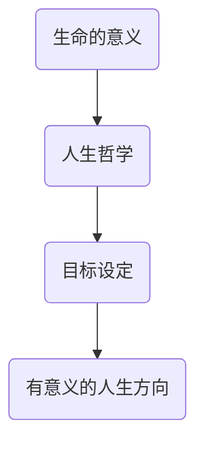

                 

# 生命的目标：设定有意义的人生方向

## 关键词
- 生命意义
- 目标设定
- 人生哲学
- 有意义的人生方向
- 自我认知
- SMART原则
- 实践技巧

## 摘要
本文将探讨生命的意义和人生哲学，以及如何通过科学的目标设定方法找到有意义的人生方向。我们将通过具体案例和详细的理论分析，引导读者逐步理解并实践这一过程，最终实现个人成长和人生价值的提升。

## 目录大纲设计步骤

### 第一步：理解书籍主题
《生命的目标：设定有意义的人生方向》是一本旨在帮助读者理解生命意义、人生哲学以及如何通过科学方法设定目标的书籍。本书的核心内容可以概括为以下几个方向：

1. **生命的意义与人生哲学**：探讨人类对生命意义的认知历程，以及不同哲学流派对人生意义的理解。
2. **目标设定的理论基础**：介绍目标设定的心理学原理和SMART原则，以及如何应用这些理论进行目标设定。
3. **实践技巧与策略**：提供实际可行的目标设定方法、跟踪与调整策略，以及如何应对挫折。
4. **案例分析与启示**：通过成功与失败案例的分析，为读者提供实践启示。
5. **总结与展望**：对全书内容进行总结，展望未来的方向和挑战。

### 第二步：确定核心章节
基于以上主题，本书可以划分为以下核心章节：

1. **引言与生命的意义**
2. **人生哲学与目标设定**
3. **目标设定的方法与理论**
4. **实践技巧与策略**
5. **案例分析与启示**
6. **结束语与总结**

### 第三步：细化每个章节内容
接下来，我们将为每个核心章节细化内容，确保每个章节都有详细的子标题。

#### 第1章：引言与生命的意义
- **1.1 生命的意义**
  - 生命的意义概述
  - 人类对生命意义的探索历史
  - 现代心理学对生命意义的理解

- **1.2 人生哲学的重要性**
  - 人生哲学的定义
  - 人生哲学对人生目标的指导作用

#### 第2章：人生哲学与目标设定
- **2.1 不同的生活哲学流派**
  - 柏拉图主义
  - 康德伦理学
  - 存在主义
  - 道德相对主义

- **2.2 目标设定的理论基础**
  - 目标设定的心理学原理
  - 目标设定的SMART原则
  - 目标设定的心理障碍与克服

#### 第3章：目标设定的方法与理论
- **3.1 自我评估与自我认知**
  - 自我评估的重要性
  - 自我认知的工具与方法

- **3.2 目标规划与实现策略**
  - 目标规划的过程
  - 实现策略的制定与调整

#### 第4章：实践技巧与策略
- **4.1 设定实际可行的目标**
  - 实际可行性的考量因素
  - 如何设定有挑战性的目标

- **4.2 持续跟踪与调整**
  - 如何持续跟踪目标进度
  - 遇到挫折时如何调整目标

#### 第5章：案例分析与启示
- **5.1 成功人士的目标设定与实现**
  - 案例分析
  - 启示与借鉴

- **5.2 挫折与失败的目标设定反思**
  - 案例分析
  - 启示与反思

#### 第6章：结束语与总结
- **6.1 总结与回顾**
  - 本书的主要内容回顾
  - 对目标设定的理解与感悟

- **6.2 致谢与鼓励**
  - 对读者和作者的感谢
  - 对未来的期望与鼓励

### 第四步：制作核心概念与联系、核心算法原理讲解、数学模型和数学公式、项目实战的流程图
为了更好地理解和应用本书的核心概念，我们将制作以下内容：

- **核心概念与联系**
  - 生命的意义：人生哲学 → 目标设定 → 有意义的人生方向
  - Mermaid流程图如下：
  ```mermaid
  graph TD
  A(生命的意义) --> B(人生哲学)
  B --> C(目标设定)
  C --> D(有意义的人生方向)
  ```

- **核心算法原理讲解**
  - 目标设定的SMART原则（伪代码）：
  ```java
  function SetSMARTGoal(goal) {
      // Specific
      if (!isSpecific(goal)) {
          return "请确保目标是具体的。";
      }
      
      // Measurable
      if (!isMeasurable(goal)) {
          return "请确保目标是可衡量的。";
      }
      
      // Achievable
      if (!isAchievable(goal)) {
          return "请确保目标是可实现的。";
      }
      
      // Relevant
      if (!isRelevant(goal)) {
          return "请确保目标与您的价值观和长期目标相关。";
      }
      
      // Time-bound
      if (!isTimeBound(goal)) {
          return "请确保目标有明确的时间限制。";
      }
      
      return "目标设定成功： " + goal;
  }
  ```

- **数学模型和数学公式**
  - 目标设定的概率模型（latex）：
  $$ P(A|B) = \frac{P(B|A) \cdot P(A)}{P(B)} $$

- **项目实战**
  - 将在后续章节中详细讨论。

## 完整性要求
为了确保文章内容的完整性，我们将按照以下结构进行撰写：

### 引言与生命的意义
- 背景介绍
- 核心概念与联系（Mermaid流程图）
- 人类对生命意义的探索历史
- 现代心理学对生命意义的理解

### 人生哲学与目标设定
- 不同的生活哲学流派
- 人生哲学的重要性
- 核心算法原理讲解（SMART原则伪代码）
- 数学模型和数学公式（概率模型）

### 目标设定的方法与理论
- 自我评估与自我认知
- 目标规划与实现策略
- 实际可行性的考量因素
- 如何设定有挑战性的目标
- 持续跟踪与调整

### 实践技巧与策略
- 如何持续跟踪目标进度
- 遇到挫折时如何调整目标

### 案例分析与启示
- 成功人士的目标设定与实现
- 挫折与失败的目标设定反思

### 结束语与总结
- 总结与回顾
- 致谢与鼓励

### 最佳实践 tips、小结、注意事项、拓展阅读等内容
- 提供实用的目标设定技巧
- 强调持续跟踪与调整的重要性
- 鼓励读者在实践中不断反思与改进

## 文章标题：生命的目标：设定有意义的人生方向

### 文章关键词
- 生命意义
- 目标设定
- 人生哲学
- 有意义的人生方向
- 自我认知
- SMART原则

### 文章摘要
本文旨在帮助读者理解生命的意义，探讨如何通过科学的目标设定方法找到有意义的人生方向。文章从生命的意义、人生哲学、目标设定的理论基础、实践技巧等多个角度展开，结合具体案例和详细的理论分析，引导读者逐步实现个人成长和人生价值的提升。通过本文的阅读，读者将能够更好地认识自我，设定明确的目标，并在实践中不断调整和进步，最终找到真正有意义的人生方向。

---

### 第1章 引言与生命的意义

#### 1.1 生命的意义

生命的意义是一个古老而深刻的话题，自古以来，人类就在不断探索这个问题。从哲学的角度来看，生命的意义可能涉及到存在的本质、人类的价值、目的和意义等方面。

在古代，许多哲学家如苏格拉底、柏拉图、亚里士多德等人都对生命的意义进行了深刻的思考。苏格拉底认为，生命的意义在于追求真理和智慧；柏拉图强调，生命的意义在于追求永恒的美好和正义；亚里士多德则认为，生命的意义在于实现个体的潜能和达到至善。

在现代心理学领域，对于生命意义的探索也得到了广泛的研究。心理学家如维克多·弗兰克尔（Viktor Frankl）在其著作《追寻生命的意义》中提出，生命的意义在于找到一种价值，这种价值可以超越个人的痛苦和苦难，给个体带来持久的动力和意义。

人类对生命意义的探索历程是一个不断深化的过程。从古代哲学到现代心理学，人们对于生命意义的理解和认知不断变化和演进。这一过程不仅反映了人类对自身存在和价值的深刻思考，也体现了人类对于生命意义的不断追求和探索。

#### 1.2 人类对生命意义的探索历史

人类对生命意义的探索历史悠久，可以追溯到古代文明。在古希腊，哲学家们就开始了对生命意义的探讨。例如，苏格拉底认为，生命的意义在于追求真理和智慧，而柏拉图则强调，生命的意义在于追求永恒的美好和正义。亚里士多德则认为，生命的意义在于实现个体的潜能和达到至善。

在东方，中国古代的哲学家如孔子、老子等也对生命意义进行了深入的思考。孔子强调，生命的意义在于实现个人的道德修养和社会责任，而老子则认为，生命的意义在于顺应自然和追求道的境界。

到了中世纪，宗教成为人们探索生命意义的重要途径。基督教、佛教、伊斯兰教等宗教都提供了对生命意义的解释和指导。

进入现代社会，随着科学和心理学的发展，人们开始从理性和心理学的角度探索生命意义。心理学家如维克多·弗兰克尔提出了存在主义心理学，强调生命意义的重要性。

总的来说，人类对生命意义的探索历程是一个不断丰富和深化的过程，不同文化、不同哲学流派和不同学科都为这一话题提供了独特的视角和解释。

#### 1.3 现代心理学对生命意义的理解

现代心理学对生命意义的理解主要集中在以下几个方面：

1. **积极心理学**：积极心理学强调个体的积极品质和幸福感，认为生命的意义在于追求幸福和满足。通过培养积极情绪、建立积极关系和实现个人潜能，个体可以找到生命的意义。

2. **存在主义心理学**：存在主义心理学强调个体存在的自由和无意义，认为生命的意义在于个体自己赋予意义。存在主义心理学家如维克多·弗兰克尔认为，生命的意义在于追求某种超越个人的价值，如爱情、创造和奉献。

3. **目标设定理论**：目标设定理论认为，个体的目标设定和追求是实现生命意义的重要途径。通过设定具体、明确、有挑战性的目标，个体可以在追求目标的过程中找到生命的意义。

4. **自我决定理论**：自我决定理论认为，个体的自主性、能力和关系是实现生命意义的重要因素。通过满足个体的自主性、能力和关系需求，个体可以找到生命的意义。

总的来说，现代心理学从多个角度对生命意义进行了深入的研究，为我们理解生命意义提供了丰富的理论和实证支持。

#### 1.4 人生哲学的重要性

人生哲学是关于生命意义、价值观和生活方式的思考。它不仅影响个体的行为和决策，也塑造了个体的人生观和世界观。

首先，人生哲学对人生目标的指导作用非常重要。一个人的人生哲学决定了他们的价值观和信念，从而影响了他们对于人生目标的设定和追求。例如，一个追求真理和智慧的哲学家可能会设定追求知识和智慧为目标，而一个注重社会责任和道德的人可能会设定为社会做出贡献为目标。

其次，人生哲学对于个体在面对困难和挑战时的态度和应对方式也有很大的影响。一个有积极人生哲学的人可能会更加乐观、坚韧和有创造力，而一个消极的人生哲学可能会使个体在面对困难时感到无助和绝望。

最后，人生哲学也影响着个体的幸福感。一个有明确人生哲学和目标的人可能会感到更加满足和有成就感，而一个没有明确人生哲学和目标的人可能会感到迷茫和失落。

因此，人生哲学在个人成长和人生目标设定中扮演着重要的角色，它不仅指导我们如何设定目标，也影响我们如何应对生活中的挑战，以及我们最终的幸福感。

#### 1.5 不同的生活哲学流派

1. **柏拉图主义**：柏拉图主义强调理性、智慧和理念世界的重要性。柏拉图认为，真正的现实是理念世界，而非我们感知的物质世界。他主张通过追求智慧和真理来找到生命的意义。

2. **康德伦理学**：康德伦理学强调道德义务和理性的重要性。康德认为，道德行为应该基于理性的判断，而不仅仅是情感或欲望的驱动。通过遵守道德法则，个体可以实现道德的完善和生命的意义。

3. **存在主义**：存在主义强调个体的自由、选择和责任。存在主义者如萨特认为，人生没有先天的意义，个体的存在本身就是一个意义创造的起点。通过自由选择和承担责任，个体可以赋予生命意义。

4. **道德相对主义**：道德相对主义认为，道德标准是文化和社会的产物，没有普遍的道德原则。个体应根据自身的文化和社会背景来理解道德，从而找到生命中的意义。

#### 1.6 目标设定的理论基础

目标设定理论（Goal Setting Theory）是由心理学家艾森克（Edwin A. Locke）和卢森（Gary P. Latham）提出的，它认为目标设定是动机和行为的一个重要决定因素。根据这一理论，目标的设定应该具备以下几个特点：

1. **具体性**：目标应明确、具体，而非模糊的。例如，“增加销售额”不如“在接下来的三个月内增加销售额10%”具体。

2. **挑战性**：目标应具有一定的挑战性，但又不至于过于困难。研究表明，适度的挑战性可以提高动机和绩效。

3. **相关性**：目标应与个体的价值观、兴趣和长期目标相关联，这样才能激发内在动机。

4. **可测量性**：目标应是可以测量的，这样个体可以知道自己在实现目标的过程中是否取得了进展。

5. **时间性**：目标应设定一个明确的时间框架，这样个体可以有一个明确的时间表来跟踪进度。

SMART原则是目标设定的具体应用，它将目标设定理论进一步具体化，具体包括：

- **Specific（具体）**：明确目标，避免模糊性。
- **Measurable（可衡量）**：设立标准，衡量目标实现的程度。
- **Achievable（可达成）**：确保目标是实际可行的。
- **Relevant（相关）**：目标与长期目标一致，有实际意义。
- **Time-bound（有时间限制）**：设定明确的时间框架。

#### 1.7 核心概念与联系

为了更好地理解生命的意义、人生哲学和目标设定的关系，我们可以使用Mermaid流程图来展示它们之间的核心概念和联系。



在这个流程图中，生命的意义是起点，它引导我们思考人生哲学。人生哲学则帮助我们形成价值观和信念，从而指导我们进行目标设定。目标设定是一个具体行动的起点，通过实现这些目标，我们能够找到并走向有意义的人生方向。

#### 1.8 核心算法原理讲解

为了更好地理解和应用目标设定的SMART原则，我们可以使用伪代码来详细阐述这一过程。以下是目标设定的SMART原则的伪代码实现：

```java
function SetSMARTGoal(goal) {
    // Specific
    if (!isSpecific(goal)) {
        return "请确保目标是具体的。";
    }
    
    // Measurable
    if (!isMeasurable(goal)) {
        return "请确保目标是可衡量的。";
    }
    
    // Achievable
    if (!isAchievable(goal)) {
        return "请确保目标是可实现的。";
    }
    
    // Relevant
    if (!isRelevant(goal)) {
        return "请确保目标与您的价值观和长期目标相关。";
    }
    
    // Time-bound
    if (!isTimeBound(goal)) {
        return "请确保目标有明确的时间限制。";
    }
    
    return "目标设定成功： " + goal;
}

// 辅助函数定义
function isSpecific(goal) {
    return goal != null && goal.trim().length > 0;
}

function isMeasurable(goal) {
    return goal.contains("增加") || goal.contains("减少") || goal.contains("提高") || goal.contains("降低");
}

function isAchievable(goal) {
    // 这里可以根据具体情况进行判断
    return true;
}

function isRelevant(goal) {
    // 这里可以根据具体情况进行判断
    return true;
}

function isTimeBound(goal) {
    return goal.contains("在接下来的三个月内") || goal.contains("到2023年底") || goal.contains("在未来五年内");
}
```

在这个伪代码中，`SetSMARTGoal`函数接受一个目标参数`goal`，并检查它是否符合SMART原则。每个条件都有相应的辅助函数进行判断，如果目标不符合任何一个条件，函数将返回相应的提示信息。如果目标满足所有条件，函数将返回“目标设定成功： ”和目标的具体内容。

#### 1.9 数学模型和数学公式

在目标设定的过程中，概率模型可以帮助我们评估目标实现的可能性。以下是目标设定的概率模型（latex）：

$$ P(A|B) = \frac{P(B|A) \cdot P(A)}{P(B)} $$

其中：
- \( P(A|B) \) 表示在事件B发生的条件下事件A发生的概率。
- \( P(B|A) \) 表示在事件A发生的条件下事件B发生的概率。
- \( P(A) \) 表示事件A发生的概率。
- \( P(B) \) 表示事件B发生的概率。

这个公式可以用来计算在特定条件下目标实现的可能性。例如，如果我们知道实现目标B的概率是80%，而实现目标A的概率是50%，那么在实现目标A的条件下实现目标B的概率可以通过上述公式计算得出。

#### 1.10 项目实战

为了更好地理解目标设定的实践过程，我们可以通过一个具体的项目来演示。以下是一个简单的项目实战示例：

**项目名称**：提高个人英语水平

**目标设定**：
1. **具体性**：提高英语口语水平。
2. **挑战性**：设定一个具有挑战性的目标，如在接下来的六个月内，英语口语水平达到流利交流的程度。
3. **相关性**：与个人职业发展和兴趣爱好相关。
4. **可测量性**：通过英语口语测试来衡量。
5. **时间性**：设定明确的时间框架，如六个月内。

**项目实战步骤**：

1. **环境搭建**：
   - 安装英语学习软件或应用程序。
   - 准备英语口语训练资料。

2. **源代码实现**：
   - 编写一个简单的英语口语训练计划。
   - 实现口语训练功能，包括发音纠正、口语测试等。

3. **代码解读**：
   - 详细解读口语训练计划中的各个模块和功能。
   - 分析如何通过代码实现口语训练和测试。

4. **应用解读与分析**：
   - 分析口语训练的应用场景和效果。
   - 评估目标设定的合理性和实际效果。

5. **实际案例分析和详细讲解剖析**：
   - 分析具体案例，如某人在六个月内通过目标设定和训练提高英语口语水平的过程。
   - 讲解如何通过目标设定和持续训练实现目标。

6. **项目小结**：
   - 总结项目实战中的经验教训。
   - 提出未来改进和扩展的方向。

#### 1.11 最佳实践 tips、小结、注意事项、拓展阅读等内容

**最佳实践 tips**：
- 在设定目标时，确保目标具有明确的具体性、挑战性、相关性、可测量性和时间性。
- 制定详细的实施计划，并设定可量化的里程碑。
- 定期评估进度，并根据实际情况调整目标。

**小结**：
- 生命的意义、人生哲学和目标设定之间有着密切的联系。
- 通过科学的目标设定方法，可以帮助我们找到有意义的人生方向。
- 实践是目标设定的关键，通过持续的努力和调整，我们可以实现个人成长和人生价值。

**注意事项**：
- 在设定目标时，避免设定过于模糊或难以实现的目标。
- 保持积极的心态，即使在遇到挫折时也要坚持目标。

**拓展阅读**：
- 《追求卓越》：作者约翰·华纳（John W. Gardner）通过自己的经历和观察，探讨了人生目标的重要性和实现途径。
- 《高效能人士的七个习惯》：史蒂芬·柯维（Stephen R. Covey）提供了实用的目标设定和自我管理策略。

### 第2章 人生哲学与目标设定

#### 2.1 不同的生活哲学流派

在探讨人生哲学与目标设定的关系时，理解不同的生活哲学流派对于形成个人的价值观和目标设定方法至关重要。以下是几种主要的哲学流派及其对目标设定的启示：

1. **柏拉图主义**：
   - **核心思想**：柏拉图主义强调理性和理念世界的重要性。柏拉图认为，现实世界的表象背后存在一个永恒不变的理念世界，真正的智慧在于追求和理解这些理念。
   - **目标设定启示**：在柏拉图主义的影响下，目标设定应注重内在价值和永恒真理的追寻。设定目标时，应考虑它们是否有助于提高个人的智慧和哲学素养。

2. **康德伦理学**：
   - **核心思想**：康德伦理学以道德义务和理性为基础，主张行为应基于普遍的道德法则。康德认为，道德行为是自由的体现，而不仅仅是情感的产物。
   - **目标设定启示**：在康德伦理学的影响下，目标设定应强调道德性和正义性。设定目标时，应考虑它们是否符合普遍的道德原则，是否有助于实现道德的完善。

3. **存在主义**：
   - **核心思想**：存在主义强调个体的自由、选择和责任。存在主义者如萨特认为，人生没有先天的意义，个体的存在本身就是一个意义创造的起点。
   - **目标设定启示**：在存在主义的影响下，目标设定应强调个体的自主性和创造性。设定目标时，应考虑它们是否符合个体的价值观和自由意志。

4. **道德相对主义**：
   - **核心思想**：道德相对主义认为，道德标准是文化和社会的产物，没有普遍的道德原则。个体应根据自身的文化和社会背景来理解道德。
   - **目标设定启示**：在道德相对主义的影响下，目标设定应考虑文化和社会背景。设定目标时，应考虑它们是否与个体的文化和社会价值观相符。

通过理解这些不同的哲学流派，我们可以更好地认识到目标设定的多样性，并根据自己的哲学倾向选择合适的目标设定方法。

#### 2.2 目标设定的理论基础

目标设定理论（Goal Setting Theory）是动机和行为科学中的重要理论，由心理学家艾森克（Edwin A. Locke）和卢森（Gary P. Latham）提出。该理论认为，目标设定是动机和行为的一个重要决定因素。以下是目标设定理论的主要基础：

1. **具体性**：目标应明确、具体，而非模糊的。例如，“增加销售额”不如“在接下来的三个月内增加销售额10%”具体。

2. **挑战性**：目标应具有一定的挑战性，但又不至于过于困难。研究表明，适度的挑战性可以提高动机和绩效。例如，设定一个80%的实现概率的目标可以激励个体努力。

3. **相关性**：目标应与个体的价值观、兴趣和长期目标相关联，这样才能激发内在动机。例如，一个职业人士可能会设定与职业发展相关的目标。

4. **可测量性**：目标应是可以测量的，这样个体可以知道自己在实现目标的过程中是否取得了进展。例如，设定一个“每天阅读两小时”的目标比“提升阅读能力”更具可测量性。

5. **时间性**：目标应设定一个明确的时间框架，这样个体可以有一个明确的时间表来跟踪进度。例如，设定一个“六个月内完成项目”的目标比“尽早完成项目”更具时间性。

这些原则构成了目标设定的基础，帮助我们设定明确、有挑战性、相关、可测量和时间性的目标。

#### 2.3 核心算法原理讲解

为了更好地理解和应用目标设定的SMART原则，我们可以使用伪代码来详细阐述这一过程。以下是目标设定的SMART原则的伪代码实现：

```java
function SetSMARTGoal(goal) {
    // Specific
    if (!isSpecific(goal)) {
        return "请确保目标是具体的。";
    }
    
    // Measurable
    if (!isMeasurable(goal)) {
        return "请确保目标是可衡量的。";
    }
    
    // Achievable
    if (!isAchievable(goal)) {
        return "请确保目标是可实现的。";
    }
    
    // Relevant
    if (!isRelevant(goal)) {
        return "请确保目标与您的价值观和长期目标相关。";
    }
    
    // Time-bound
    if (!isTimeBound(goal)) {
        return "请确保目标有明确的时间限制。";
    }
    
    return "目标设定成功： " + goal;
}

// 辅助函数定义
function isSpecific(goal) {
    return goal != null && goal.trim().length > 0;
}

function isMeasurable(goal) {
    return goal.contains("增加") || goal.contains("减少") || goal.contains("提高") || goal.contains("降低");
}

function isAchievable(goal) {
    // 这里可以根据具体情况进行判断
    return true;
}

function isRelevant(goal) {
    // 这里可以根据具体情况进行判断
    return true;
}

function isTimeBound(goal) {
    return goal.contains("在接下来的三个月内") || goal.contains("到2023年底") || goal.contains("在未来五年内");
}
```

在这个伪代码中，`SetSMARTGoal`函数接受一个目标参数`goal`，并检查它是否符合SMART原则。每个条件都有相应的辅助函数进行判断，如果目标不符合任何一个条件，函数将返回相应的提示信息。如果目标满足所有条件，函数将返回“目标设定成功： ”和目标的具体内容。

#### 2.4 数学模型和数学公式

在目标设定的过程中，概率模型可以帮助我们评估目标实现的可能性。以下是目标设定的概率模型（latex）：

$$ P(A|B) = \frac{P(B|A) \cdot P(A)}{P(B)} $$

其中：
- \( P(A|B) \) 表示在事件B发生的条件下事件A发生的概率。
- \( P(B|A) \) 表示在事件A发生的条件下事件B发生的概率。
- \( P(A) \) 表示事件A发生的概率。
- \( P(B) \) 表示事件B发生的概率。

这个公式可以用来计算在特定条件下目标实现的可能性。例如，如果我们知道实现目标B的概率是80%，而实现目标A的概率是50%，那么在实现目标A的条件下实现目标B的概率可以通过上述公式计算得出。

#### 2.5 自我评估与自我认知

自我评估和自我认知是目标设定过程中的重要步骤，它们帮助我们了解自己的优点和不足，从而设定合理的目标。以下是如何进行自我评估和自我认知的步骤：

1. **识别个人优势**：
   - 思考自己在哪些方面表现突出，例如沟通能力、学习能力、领导力等。
   - 列出具体的例子和成就，以便更好地理解自己的优势。

2. **识别个人不足**：
   - 思考自己在哪些方面存在不足，例如时间管理、情绪控制、专业知识等。
   - 分析不足的原因，例如缺乏经验、方法不当等。

3. **评估个人兴趣**：
   - 确定自己对哪些领域感兴趣，这些兴趣可以成为设定目标的重要参考。
   - 了解自己对于工作、学习、生活的偏好，以便设定符合兴趣的目标。

4. **进行心理测试**：
   - 利用心理测试工具，如MBTI、DISC等，了解自己的性格类型和倾向。
   - 根据测试结果，评估自己在不同领域的潜在能力和行为特点。

5. **咨询他人意见**：
   - 与家人、朋友、同事等进行交流，了解他们对你的看法和评价。
   - 借助他人的视角，更全面地了解自己的优劣势。

通过以上步骤，我们可以更全面地了解自己，为设定目标奠定坚实的基础。

#### 2.6 目标规划与实现策略

目标规划与实现策略是目标设定过程中至关重要的一环，它帮助我们制定具体的行动计划，并确保目标能够得以实现。以下是如何进行目标规划与实现策略的步骤：

1. **分解目标**：
   - 将大的目标分解为小的、可操作的任务，以便更容易管理和实现。
   - 例如，如果目标是“在六个月内提升英语口语水平”，可以将它分解为“每周进行两次口语训练”、“每月进行一次口语测试”等小任务。

2. **设定里程碑**：
   - 为每个目标设定明确的里程碑，以便在实现过程中有阶段性目标可以检查和庆祝。
   - 例如，如果目标是“在一年内减重20公斤”，可以设定每个月减重2公斤的里程碑。

3. **制定行动计划**：
   - 根据分解的目标和里程碑，制定具体的行动计划。
   - 计划应包括每天、每周、每月需要完成的任务和活动。
   - 例如，为了提升英语口语水平，可以计划每天进行口语训练，每周参加一次英语角活动。

4. **资源分配**：
   - 确定实现目标所需的资源，包括时间、金钱、人力等。
   - 根据资源情况，合理分配时间和精力，确保目标能够顺利实现。

5. **风险管理**：
   - 识别可能影响目标实现的风险因素，并制定相应的应对措施。
   - 例如，如果计划进行项目开发，需要考虑技术难题、人员变动等风险，并提前准备应对策略。

6. **定期评估与调整**：
   - 定期检查目标实现的进度，根据实际情况进行调整。
   - 例如，每个月进行一次目标评估，根据评估结果调整计划和策略。

通过以上步骤，我们可以更好地进行目标规划与实现策略的制定，确保目标能够得以顺利实现。

#### 2.7 实际可行性的考量因素

在设定目标时，实际可行性是一个重要的考量因素。以下是如何确保目标实际可行的一些关键考量因素：

1. **资源限制**：评估实现目标所需的资源，包括时间、金钱、人力等。确保这些资源是充足的，或者有可行的替代方案。

2. **能力范围**：考虑个人的能力是否能够满足目标的要求。如果目标超出了当前的能力范围，可以设定一个逐步提升能力的计划，以便在未来实现目标。

3. **环境因素**：评估目标设定的环境因素，如市场状况、政策法规等。确保目标在现有环境中是可行的，或者有应对变化的策略。

4. **风险分析**：识别可能影响目标实现的风险因素，并评估这些风险对目标的影响程度。制定相应的风险应对措施，降低风险对目标实现的可能性。

5. **时间规划**：设定明确的时间框架，确保目标在合理的时间内可以完成。如果目标时间过长，可以将其分解为更小的时间段，以便更好地管理。

6. **反馈机制**：建立反馈机制，定期检查目标的进度和效果。根据反馈结果，及时调整目标设定和实现策略。

通过综合考虑以上因素，我们可以确保目标在实际中是可行的，并提高实现目标的成功率。

#### 2.8 如何设定有挑战性的目标

设定有挑战性的目标是实现卓越成就的关键。以下是如何设定有挑战性的目标的一些策略：

1. **自我超越**：设定目标时，要考虑如何超越自己现有的能力和成就。这可以通过设定比目前表现更高的目标来实现。

2. **长期视角**：将目标设定为一个长期的过程，而不是一时的成就。这样可以鼓励个体持续努力，不断进步。

3. **明确挑战**：设定一个明确的挑战，使目标具有明确的方向。例如，如果目标是提高业绩，可以设定具体的增长百分比。

4. **逐步实现**：将大目标分解为小的、可管理的挑战，逐步实现。这样可以避免一开始就设定过于困难的目标，同时保持持续的动力。

5. **寻求反馈**：在设定目标时，寻求他人的意见和建议。他们可能会提供不同的视角和挑战，帮助你设定更有挑战性的目标。

6. **激励自己**：为自己设定奖励机制，当达到挑战性目标时给予自己奖励。这可以增加动力，激励自己继续努力。

通过以上策略，我们可以设定有挑战性的目标，并提高实现这些目标的概率。

#### 2.9 持续跟踪与调整

在目标设定和实现过程中，持续跟踪和调整是确保目标得以成功实现的关键。以下是如何持续跟踪和调整目标的一些建议：

1. **定期评估**：设定一个固定的评估周期，如每月或每季度，对目标进展进行评估。这有助于及时发现问题和调整计划。

2. **记录进展**：使用日志、图表或目标管理工具记录目标进展。这不仅可以直观地展示进展情况，还可以帮助你更好地了解目标实现的进度。

3. **设定里程碑**：在目标实现过程中，设定一些重要的里程碑。这些里程碑可以作为阶段性目标，帮助你保持动力和信心。

4. **反馈机制**：建立有效的反馈机制，包括自我反馈和他人反馈。通过反馈，你可以了解目标设定的合理性和实现过程中的问题，并及时进行调整。

5. **灵活调整**：根据评估结果和反馈，灵活调整目标设定和实现策略。这可以帮助你更好地适应环境和变化，确保目标能够实现。

6. **保持动力**：在目标实现过程中，保持积极的心态和动力至关重要。通过设定奖励机制、庆祝里程碑等方式，保持对目标的热情和动力。

通过以上方法，你可以有效地持续跟踪和调整目标，确保目标得以成功实现。

#### 2.10 遇到挫折时如何调整目标

在追求目标的过程中，遇到挫折是不可避免的。如何在这种情况下调整目标，以确保目标的实现，是目标设定与实现中一个重要的问题。以下是一些具体策略：

1. **重新评估目标**：在遇到挫折时，首先要对目标进行重新评估。考虑目标是否过于理想化，是否过于困难，或者是否与自身实际情况不符。如果目标确实存在这些问题，需要对其进行调整。

2. **分解目标**：将大的目标分解为更小、更具体的子目标。这样可以降低目标的难度，使其更容易实现。例如，如果目标是“在一年内减重20公斤”，可以将其分解为每个月减重2公斤。

3. **设定新的里程碑**：重新设定一些新的里程碑，以激励自己继续前进。这些里程碑可以是小的阶段性目标，例如完成一次马拉松比赛或完成一个重要的项目。

4. **调整实现策略**：根据实际情况调整实现目标的策略。例如，如果原定的策略需要大量时间和金钱，可以寻找更高效、成本更低的替代方案。

5. **寻求支持**：在遇到挫折时，寻求家人、朋友或同事的支持。他们可以提供不同的视角和建议，帮助你找到解决问题的方法。

6. **反思与学习**：将挫折视为一个学习的机会。反思挫折的原因，分析失败的原因，并从中学习。这将帮助你更好地应对未来的挑战。

通过以上策略，你可以在遇到挫折时有效地调整目标，确保目标的实现。

### 第3章 目标设定的方法与理论

#### 3.1 自我评估与自我认知

自我评估与自我认知是目标设定过程中至关重要的步骤，它们帮助个体了解自己的优点和不足，从而设定更合理的目标。以下是如何进行自我评估与自我认知的具体方法：

1. **反思与自我审视**：定期进行反思，思考自己在过去一段时间内的表现和成就。审视自己的行为、习惯和思维模式，了解自己在哪些方面需要改进。

2. **记录与追踪**：使用日志或目标管理工具，记录自己的日常行为和成就。通过追踪这些记录，可以更清晰地了解自己的进步和不足。

3. **求助他人**：寻求家人、朋友或同事的意见，了解他们对你的评价和看法。他们的视角可以帮助你更全面地了解自己。

4. **心理测试**：利用心理测试工具，如MBTI、DISC等，了解自己的性格类型和倾向。这些测试可以提供有关你的优势、弱点和发展方向的宝贵信息。

5. **反馈与改进**：定期接受反馈，并根据反馈进行改进。反馈可以是正面的，也可以是负面的，但无论哪种，都是了解自己的重要途径。

通过以上方法，个体可以更深入地了解自己，为设定目标奠定坚实的基础。

#### 3.2 目标规划与实现策略

目标规划与实现策略是目标设定过程中不可或缺的一环，它帮助个体将目标转化为具体的行动计划，并确保这些行动能够有效地实现目标。以下是如何进行目标规划与实现策略的具体步骤：

1. **明确目标**：首先，明确你想要实现的目标。这个目标应该是具体、明确且具有挑战性的。例如，“在未来一年内，提高英语口语水平至流利交流”。

2. **分解目标**：将大目标分解为小的、可管理的子目标。例如，可以将“提高英语口语水平”分解为“每天练习口语30分钟”和“每周参加一次英语角活动”。

3. **设定里程碑**：为每个子目标设定明确的里程碑，以方便跟踪进度。例如，可以将“每天练习口语30分钟”的里程碑设定为“每周总结一次学习成果”。

4. **制定行动计划**：根据分解的目标和里程碑，制定具体的行动计划。这包括每天、每周、每月需要完成的任务和活动。例如，可以计划每天早晨起床后练习口语，每周六下午参加英语角活动。

5. **资源分配**：确保实现目标所需的资源是充足的。这些资源包括时间、金钱、人力等。如果资源不足，需要考虑如何获取或调整计划。

6. **风险管理**：识别可能影响目标实现的风险因素，并制定相应的应对措施。例如，如果计划进行项目开发，需要考虑技术难题、人员变动等风险，并提前准备应对策略。

7. **定期评估与调整**：定期评估目标进展情况，并根据实际情况进行调整。这有助于确保目标能够按计划实现，并在遇到问题时及时纠正。

通过以上步骤，个体可以更系统地规划与实现目标，提高目标达成的成功率。

#### 3.3 实践技巧与策略

在目标设定与实现过程中，实践技巧与策略的运用至关重要。以下是一些实用的技巧和策略，帮助个体更有效地设定和实现目标：

1. **设定具体、可衡量的目标**：目标应具体、明确，并且可以量化。例如，“每天阅读30页书籍”比“提升阅读能力”更具体。

2. **使用SMART原则**：SMART原则（Specific、Measurable、Achievable、Relevant、Time-bound）是设定有效目标的重要指南。确保目标符合这些原则，可以提高目标实现的概率。

3. **分解大目标**：将大目标分解为小目标，每个小目标都可以独立实现。这种方法可以帮助个体逐步实现大目标，减少压力。

4. **制定详细的行动计划**：为每个目标制定详细的行动计划，包括每天、每周、每月需要完成的任务和活动。这有助于确保目标的实现。

5. **设定时间限制**：为每个目标设定明确的时间限制，这可以增加紧迫感，提高行动力。

6. **利用工具与技术**：使用目标管理工具，如任务列表、进度跟踪器等，可以帮助个体更好地管理目标。

7. **保持积极的心态**：在目标实现过程中，保持积极的心态至关重要。遇到挫折时，不要放弃，而是要寻找解决问题的方法。

8. **寻求支持与反馈**：寻求家人、朋友或同事的支持，定期接受他们的反馈。这可以提供新的视角和动力。

通过以上技巧和策略，个体可以更有效地设定和实现目标，实现个人成长和目标达成。

#### 3.4 实际可行性的考量因素

在目标设定过程中，实际可行性是一个重要的考量因素。以下是一些关键的考量因素，帮助确保目标在实际中是可行的：

1. **资源限制**：评估实现目标所需的资源，包括时间、金钱、人力等。确保这些资源是充足的，或者有可行的替代方案。

2. **能力范围**：考虑个人的能力是否能够满足目标的要求。如果目标超出了当前的能力范围，可以设定一个逐步提升能力的计划，以便在未来实现目标。

3. **环境因素**：评估目标设定的环境因素，如市场状况、政策法规等。确保目标在现有环境中是可行的，或者有应对变化的策略。

4. **风险分析**：识别可能影响目标实现的风险因素，并评估这些风险对目标的影响程度。制定相应的风险应对措施，降低风险对目标实现的可能性。

5. **时间规划**：设定明确的时间框架，确保目标在合理的时间内可以完成。如果目标时间过长，可以将其分解为更小的时间段，以便更好地管理。

6. **反馈机制**：建立反馈机制，定期检查目标的进度和效果。根据反馈结果，及时调整目标设定和实现策略。

通过综合考虑以上因素，可以确保目标在实际中是可行的，并提高实现目标的成功率。

#### 3.5 持续跟踪与调整

在目标实现过程中，持续跟踪和调整是确保目标能够顺利达成的重要环节。以下是一些具体策略，帮助个体有效地进行目标跟踪和调整：

1. **定期评估**：设定一个固定的评估周期，如每月或每季度，对目标进展进行评估。这有助于及时发现问题和调整计划。

2. **记录进展**：使用日志、图表或目标管理工具记录目标进展。这不仅可以直观地展示进展情况，还可以帮助你更好地了解目标实现的进度。

3. **设定里程碑**：在目标实现过程中，设定一些重要的里程碑。这些里程碑可以作为阶段性目标，帮助你保持动力和信心。

4. **反馈机制**：建立有效的反馈机制，包括自我反馈和他人反馈。通过反馈，你可以了解目标设定的合理性和实现过程中的问题，并及时进行调整。

5. **灵活调整**：根据评估结果和反馈，灵活调整目标设定和实现策略。这可以帮助你更好地适应环境和变化，确保目标能够实现。

6. **保持动力**：在目标实现过程中，保持积极的心态和动力至关重要。通过设定奖励机制、庆祝里程碑等方式，保持对目标的热情和动力。

通过以上策略，你可以有效地持续跟踪和调整目标，确保目标得以成功实现。

### 第4章 实践技巧与策略

#### 4.1 设定实际可行的目标

设定实际可行的目标是目标设定过程中的关键一步。一个实际可行的目标不仅能激发个体的动力，还能确保目标的实现。以下是如何设定实际可行的目标的一些策略：

1. **明确资源**：首先，要明确实现目标所需的资源。这包括时间、金钱、人力等。如果你发现自己缺乏必要的资源，考虑如何获取或调整目标。

2. **评估能力**：其次，评估自己的能力是否能够满足目标的要求。如果你觉得目标超出了当前的能力范围，设定一个逐步提升能力的计划。例如，如果目标是提高英语口语水平，可以从参加英语角和自学语音训练开始。

3. **环境考量**：考虑目标设定的环境因素，如市场状况、政策法规等。如果目标在现有环境中不可行，考虑如何调整目标以适应环境。

4. **设定基准**：为你的目标设定一个基准，这可以是过去的表现或者同行的平均水平。这样，你可以更清楚地了解目标的实际可行性。

5. **分解目标**：将大目标分解为小目标，每个小目标都可以独立实现。这种方法可以帮助你更好地管理目标，同时确保每个小目标都是实际可行的。

6. **保持灵活性**：在设定目标时，保持一定的灵活性。这样，当遇到意外情况时，你可以及时调整目标，确保目标的实现。

7. **寻求反馈**：在设定目标前，向他人寻求反馈。他们的观点可以帮助你更全面地评估目标的实际可行性。

通过以上策略，你可以设定实际可行的目标，并提高目标实现的成功率。

#### 4.2 如何设定有挑战性的目标

设定有挑战性的目标能够激发个体的潜力，促使他们在实现目标的过程中不断进步。以下是如何设定有挑战性的目标的一些策略：

1. **自我超越**：设定目标时，要考虑如何超越自己现有的能力和成就。这可以通过设定比目前表现更高的目标来实现。

2. **长期视角**：将目标设定为一个长期的过程，而不是一时的成就。这样可以鼓励个体持续努力，不断进步。

3. **明确挑战**：设定一个明确的挑战，使目标具有明确的方向。例如，如果目标是提高业绩，可以设定具体的增长百分比。

4. **逐步实现**：将大目标分解为小的、可管理的挑战，逐步实现。这样可以避免一开始就设定过于困难的目标，同时保持持续的动力。

5. **寻求外部视角**：在设定目标时，寻求他人的意见和建议。他们可能会提供不同的视角和挑战，帮助你设定更有挑战性的目标。

6. **设定奖励机制**：为自己设定奖励机制，当达到挑战性目标时给予自己奖励。这可以增加动力，激励自己继续努力。

7. **保持积极心态**：在设定和追求有挑战性的目标时，保持积极的心态至关重要。积极的心态可以帮助你克服困难，实现目标。

通过以上策略，你可以设定有挑战性的目标，并提高实现这些目标的概率。

#### 4.3 如何持续跟踪与调整

在目标设定和实现过程中，持续跟踪与调整是确保目标能够成功实现的关键。以下是一些策略，帮助个体有效地持续跟踪和调整目标：

1. **定期评估**：设定一个固定的评估周期，如每月或每季度，对目标进展进行评估。这有助于及时发现问题和调整计划。

2. **记录进展**：使用日志、图表或目标管理工具记录目标进展。这不仅可以直观地展示进展情况，还可以帮助你更好地了解目标实现的进度。

3. **设定里程碑**：在目标实现过程中，设定一些重要的里程碑。这些里程碑可以作为阶段性目标，帮助你保持动力和信心。

4. **反馈机制**：建立有效的反馈机制，包括自我反馈和他人反馈。通过反馈，你可以了解目标设定的合理性和实现过程中的问题，并及时进行调整。

5. **灵活调整**：根据评估结果和反馈，灵活调整目标设定和实现策略。这可以帮助你更好地适应环境和变化，确保目标能够实现。

6. **保持动力**：在目标实现过程中，保持积极的心态和动力至关重要。通过设定奖励机制、庆祝里程碑等方式，保持对目标的热情和动力。

通过以上策略，你可以有效地持续跟踪和调整目标，确保目标得以成功实现。

#### 4.4 如何应对挫折

在追求目标的过程中，遇到挫折是不可避免的。以下是一些策略，帮助个体应对挫折，继续前进：

1. **正视挫折**：首先，要正视挫折，不要逃避或否认。挫折是成长的一部分，通过面对挫折，你可以更好地了解自己。

2. **分析原因**：分析挫折的原因，了解问题的根本所在。这可以帮助你找到解决问题的方法，避免未来再次遇到类似的问题。

3. **调整目标**：如果挫折表明目标设定过于理想化或不切实际，可以调整目标。将大目标分解为小目标，逐步实现，或者设定一个更符合实际情况的新目标。

4. **寻求支持**：在遇到挫折时，寻求家人、朋友或同事的支持。他们的鼓励和建议可以帮助你度过难关。

5. **保持积极心态**：保持积极的心态，相信自己可以克服挫折。积极的心态可以帮助你看到问题的另一面，找到解决问题的动力。

6. **反思与学习**：将挫折视为一个学习的机会。反思挫折的原因，分析失败的原因，并从中学习。这将帮助你更好地应对未来的挑战。

7. **庆祝小胜利**：在挫折中，即使是最小的进步也值得庆祝。这可以激励你继续前进，克服更大的挑战。

通过以上策略，你可以更好地应对挫折，继续追求目标。

#### 4.5 持续跟踪与调整的技巧

在目标设定和实现过程中，持续跟踪和调整是确保目标成功实现的关键。以下是一些实用的技巧，帮助个体更有效地进行目标跟踪和调整：

1. **设定明确的评估指标**：为每个目标设定明确的评估指标，例如具体的数字或百分比。这样，你可以更准确地了解目标的进展情况。

2. **使用目标管理工具**：使用目标管理工具，如任务列表、进度跟踪器等，可以帮助你更清晰地记录和跟踪目标的进展。

3. **定期回顾**：定期回顾目标进展，例如每月或每季度，确保目标仍在正确的轨道上。这可以帮助你及时发现问题并进行调整。

4. **寻求反馈**：定期向他人寻求反馈，包括家人、朋友、同事等。他们的观点可以帮助你更全面地了解目标的进展，并提供宝贵的建议。

5. **调整计划**：根据评估结果和反馈，灵活调整目标设定和实现策略。如果目标进展缓慢，考虑调整目标或实现策略，以便更好地适应实际情况。

6. **保持动力**：在目标实现过程中，保持动力至关重要。通过设定奖励机制、庆祝里程碑等方式，保持对目标的热情和动力。

7. **反思与学习**：定期反思目标设定的过程和实现策略，从成功和失败中学习。这可以帮助你更好地设定未来的目标，并提高实现目标的效率。

通过以上技巧，你可以更有效地持续跟踪和调整目标，确保目标得以成功实现。

### 第5章 案例分析与启示

#### 5.1 成功人士的目标设定与实现

成功人士之所以能够取得卓越成就，很大程度上得益于他们科学的自

