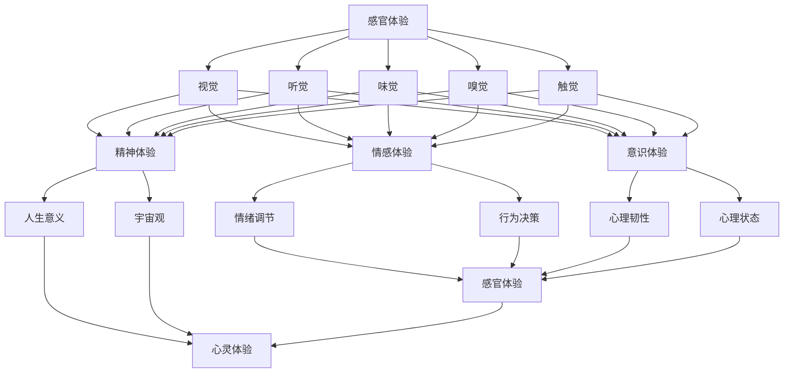

                 

### 文章标题：《生命的质感：丰富感官和心灵体验》

### 关键词：
- 感官体验
- 心灵体验
- 生活质感
- 情感调节
- 冥想与意识
- 实践与反思

### 摘要：
本文深入探讨了生命的质感，从感官体验和心灵体验两个角度出发，详细分析了视觉、听觉、味觉、嗅觉和触觉等感官体验的机制及其对生命质感的影响。同时，探讨了情感、意识和精神体验的深层内涵，以及如何通过实际生活实践提升感官和心灵体验的质量。文章通过具体的案例和项目实战，提供了实用的建议和指导，旨在帮助读者在日常生活中提高生命的质感。

### 引言

生命的质感，是一种难以用言语完全描述的体验，却又是每个人内心深处最真实的感受。当我们谈论生命的质感时，我们实际上在谈论什么？是感官体验，还是心灵体验？又或者是两者交织在一起的复杂感受？本文旨在探讨生命的质感，从感官和心灵两个角度深入分析，以帮助读者更好地理解并丰富自己的生命体验。

#### 感官体验

感官体验是生命质感的重要组成部分。我们的眼睛看到的世界，耳朵听到的声音，鼻子嗅到的气味，舌头尝到的味道，以及皮肤触到的触感，构成了我们对世界的感知。这些感官体验不仅影响着我们的情绪和心理状态，也在很大程度上决定了我们生命质感的好坏。

首先，视觉体验是感官体验中最为直观的一部分。从艺术作品中感受到的美，到日常生活中所看到的景象，视觉体验在很大程度上塑造了我们的情绪和情感。例如，一幅美丽的风景画可以让我们感到愉悦和宁静，而一个破败的景象则可能引发沮丧和焦虑。

听觉体验同样重要。音乐、声音环境，甚至是简单的噪音，都可以对我们的情绪产生深远的影响。音乐作为一种艺术形式，可以通过旋律、节奏和和声等元素，直接触动我们的情感。而声音环境，如交通噪音、人群喧哗等，则可能对我们的情绪产生负面影响。

味觉体验和嗅觉体验则更多地与我们的生存本能相关。食物的味道和气味的感知，不仅影响着我们的食欲和营养摄入，还在很大程度上决定了我们的生活质量。一个美味的菜肴可以让我们感到满足和幸福，而一个难闻的气味则可能引发厌恶和不适。

触觉体验则更多地与我们的情感和情绪相关。一个温暖的拥抱，一个轻轻的抚摸，都可以让我们感到安慰和放松。而在一些极端情况下，如触觉剥夺实验中，触觉的缺失甚至会对我们的情绪和心理状态产生严重的影响。

#### 心灵体验

与感官体验相比，心灵体验更多地涉及到情感、意识和精神层面。情感体验是心灵体验的核心部分，它包括了喜悦、悲伤、愤怒、恐惧等多种情感。这些情感不仅是我们对外界刺激的反应，也在很大程度上决定了我们的行为和决策。

意识体验则更多地涉及到我们的心理状态和思维过程。从基本的感知和记忆，到复杂的思考和分析，意识体验贯穿了我们的整个生命过程。通过冥想和意识训练，我们可以更好地理解自己的内心世界，提高情绪调节能力和心理韧性。

精神体验则是心灵体验的更高层次。它涉及到对生命、宇宙和自我的深刻思考，是一种超越日常经验和常识的体验。通过精神修养和探索，我们可以找到内心的平静和力量，从而更好地应对生活中的挑战。

#### 感官体验与心灵体验的联系

感官体验和心灵体验并不是相互独立的，而是紧密交织在一起的。我们的感官体验影响着我们的情感和意识，而我们的情感和意识又反过来影响着我们的感官体验。例如，当我们看到一幅美丽的画作时，我们不仅会感到愉悦，还会在意识层面上对其进行欣赏和思考。这种交织的关系，使得我们的生命质感更加丰富和多元。

### 核心概念与联系

为了更好地理解生命的质感，我们需要引入一些核心概念，并探讨它们之间的关系。

首先，感官体验包括视觉、听觉、味觉、嗅觉和触觉等五个方面。每个感官都有其独特的机制和功能，例如，视觉体验依赖于视网膜上的感光细胞，而味觉体验则依赖于舌头上的味蕾。

其次，心灵体验包括情感体验、意识体验和精神体验。情感体验是我们对外界刺激的情感反应，意识体验是我们对世界的感知和理解，而精神体验则是对生命和宇宙的深层次思考。

最后，我们需要探讨感官体验和心灵体验之间的联系。这种联系不仅体现在它们之间的相互影响，还体现在它们共同构成了我们的生命质感。例如，一个美丽的视觉体验可以引发愉悦的情感体验，而这种情感体验又可以促进我们对美的欣赏和思考，从而提升我们的精神体验。

为了更清晰地展示这些概念之间的关系，我们可以使用 Mermaid 流程图来表示。

### 感官体验

感官体验是我们与世界互动的窗口，它们不仅决定了我们对世界的感知，也在很大程度上影响了我们的情绪和心理状态。在这部分，我们将深入探讨视觉、听觉、味觉、嗅觉和触觉等感官体验的机制和重要性。

#### 视觉体验

视觉体验是人类最重要的感官体验之一。我们的眼睛可以捕捉到光的信息，并通过视网膜上的感光细胞将光信号转换为神经信号，传递到大脑进行处理。视觉体验不仅包括我们对物体的形状、颜色、大小和运动等信息的感知，还包括我们对空间、距离和方向的理解。

**视觉艺术与生命质感**

视觉艺术作为一种表达和沟通的方式，对生命的质感有着深远的影响。从古代的壁画到现代的数字艺术，视觉艺术的形式多种多样，但它们都有一个共同点，那就是能够触动人心。一幅美丽的画作可以让人感到愉悦和宁静，而一个震撼的景观可以让人感到兴奋和激动。这些视觉体验不仅丰富了我们的情感体验，也在很大程度上提升了我们的生命质感。

**视觉刺激与心理反应**

视觉刺激对我们的心理反应有着显著的影响。例如，明亮的颜色可以激发兴奋和愉悦的情绪，而暗淡的颜色则可能引发沮丧和不安。此外，视觉刺激的强度、频率和持续时间也会影响我们的情绪和心理状态。例如，长时间盯着电脑屏幕可能会引起眼睛疲劳和头痛，而适当的休息和调整可以缓解这些不适。

**视觉训练与实践**

为了提高视觉体验的质量，我们可以进行一些视觉训练。例如，通过练习专注力、视觉记忆和视觉分辨能力，我们可以提高我们的视觉敏锐度和感知能力。此外，多接触自然光线和户外环境，也有助于提升视觉体验的质量。

#### 听觉体验

听觉体验是人类感知世界的重要组成部分。我们的耳朵可以捕捉到声波的信息，并通过耳膜、听小骨和内耳的复杂结构将声波转换为电信号，传递到大脑进行处理。听觉体验不仅包括我们对声音的感知，还包括我们对声音的识别、理解和反应。

**音乐与心灵体验**

音乐作为一种独特的艺术形式，对心灵体验有着深远的影响。音乐的旋律、节奏和和声等元素可以直接触动我们的情感，引发喜悦、悲伤、兴奋等情绪。此外，音乐还可以帮助调节情绪，缓解压力和焦虑。通过聆听不同风格和类型的音乐，我们可以丰富自己的心灵体验，提升生命的质感。

**声音环境与生活品质**

声音环境对我们的生活品质有着重要的影响。一个安静、舒适的声音环境可以让我们感到放松和愉悦，而一个嘈杂、刺耳的声音环境则可能引发不适和焦虑。因此，我们在日常生活中需要注意声音环境的优化，例如减少噪音源、使用隔音材料等，以提高生活品质。

**听力训练与保护**

为了保护我们的听力，我们需要进行一些听力训练。例如，通过练习听力分辨能力、听力记忆和听力专注力，我们可以提高我们的听力敏锐度和感知能力。此外，避免长时间处于噪音环境中，定期进行听力检查，也是保护听力的重要措施。

#### 味觉体验

味觉体验是人体感知食物的主要方式之一。我们的舌头上有味蕾，可以感知到食物的甜、酸、苦、咸和鲜等基本味道。味觉体验不仅影响着我们的食欲和营养摄入，也在很大程度上决定了我们的生活质量。

**食物与情感联系**

食物与情感之间有着密切的联系。不同的食物可以引发不同的情感反应。例如，美味的食物可以让我们感到愉悦和满足，而难吃的食物则可能引发厌恶和不适。此外，食物的气味和味道也会影响我们的情感体验。例如，咖啡的香气可以让人感到兴奋和清醒，而香草的香气则可能让人感到放松和舒适。

**味觉训练与健康**

为了保持味觉的健康，我们需要进行一些味觉训练。例如，通过练习味觉分辨能力、味觉记忆和味觉专注力，我们可以提高我们的味觉敏锐度和感知能力。此外，保持均衡的饮食，避免过度食用刺激性食物，也是保持味觉健康的重要措施。

**食品科学与生命质感**

食品科学的发展对我们的生活产生了深远的影响。通过食品科学的进步，我们可以更好地理解和控制食物的口感、风味和营养。例如，食品添加剂的开发和使用可以改善食物的口感和保鲜效果，而营养学的研究可以帮助我们更好地了解食物的营养价值，从而提高我们的生活质量。

#### 嗅觉体验

嗅觉体验是人体感知气味的主要方式之一。我们的鼻子可以捕捉到空气中的气味分子，并通过嗅觉神经将气味信息传递到大脑进行处理。嗅觉体验不仅影响着我们的食欲和营养摄入，也在很大程度上决定了我们的生活质量。

**香水与情绪调节**

香水作为一种特殊的气味，可以影响我们的情绪和心理状态。例如，薰衣草的香气可以让人感到放松和舒缓，而柠檬的香气则可能让人感到清新和提神。通过选择合适的香水，我们可以调节自己的情绪，提高生活的质感。

**嗅觉记忆与情感**

嗅觉记忆是人类记忆中最为持久和深刻的记忆之一。研究表明，嗅觉记忆与情感体验有着密切的联系。例如，小时候熟悉的饭菜味道可能会引发我们对家的思念，而某些特殊的气味可能会触发我们对特定事件的回忆。这些嗅觉记忆不仅丰富了我们的情感体验，也在很大程度上提升了我们的生命质感。

**嗅觉训练与应用**

为了提高嗅觉体验的质量，我们可以进行一些嗅觉训练。例如，通过练习嗅觉分辨能力、嗅觉记忆和嗅觉专注力，我们可以提高我们的嗅觉敏锐度和感知能力。此外，在日常生活中的应用，如烹饪、香水选择和环境香氛布置等，也可以帮助我们提升嗅觉体验的质量。

#### 触觉体验

触觉体验是人体感知触感的主要方式之一。我们的皮肤遍布着触觉感受器，可以感知到物体表面的纹理、温度和压力等触感信息。触觉体验不仅影响着我们的情绪和心理状态，也在很大程度上决定了我们的生活质量。

**触觉与情绪**

触觉与情绪之间有着紧密的联系。例如，一个温暖的拥抱可以让人感到安慰和放松，而一个寒冷的触感则可能引发不适和紧张。此外，触觉刺激还可以影响我们的心理状态。例如，按摩作为一种触觉刺激，可以缓解压力和焦虑，提高生活质量。

**触觉刺激与健康**

触觉刺激对健康有着重要的影响。适当的触觉刺激可以促进血液循环，增强免疫力，缓解疼痛等。例如，婴儿抚触、按摩和瑜伽等都是常见的触觉刺激方式，它们对健康和心理健康都有显著的积极影响。

**触觉训练与敏感度提升**

为了提高触觉体验的质量，我们可以进行一些触觉训练。例如，通过练习触觉分辨能力、触觉记忆和触觉专注力，我们可以提高我们的触觉敏锐度和感知能力。此外，多接触不同材质的物体，如砂纸、丝绸、毛绒等，也可以帮助我们提升触觉敏感度。

### 心灵体验

心灵体验是生命的深层体验，它涉及到情感、意识和精神层面。与感官体验不同，心灵体验更多是内在的、主观的体验。在这部分，我们将深入探讨心灵体验的各个方面，包括情感体验、意识体验和精神体验。

#### 情感体验

情感体验是心灵体验的核心部分。它包括了喜悦、悲伤、愤怒、恐惧等多种情感。情感不仅是我们对外界刺激的自然反应，也是我们内心世界的真实表达。情感体验对我们的生命质感有着深远的影响。

**情感与生命质感**

情感体验直接影响我们的生命质感。一个愉悦的情感体验可以让我们感到幸福和满足，而一个悲伤或愤怒的情感体验则可能让我们感到沮丧和不安。通过调节和体验情感，我们可以提升生命的质感，使其更加丰富和多元。

**情感调节与心灵健康**

情感调节对心灵健康至关重要。良好的情感调节能力可以帮助我们更好地应对生活中的挑战和压力。例如，通过练习情绪调节技巧，如深呼吸、冥想和正面思考等，我们可以改善情绪状态，提高心理健康水平。

**情感表达与人际关系**

情感表达是人际关系中的重要组成部分。通过适当地表达情感，我们可以增进与他人的理解和沟通，建立更深层次的人际关系。例如，真诚的表达感激和爱意可以增进亲密关系，而适当地表达不满和冲突可以促进解决问题的过程。

#### 意识体验

意识体验是心灵体验的另一个重要方面。它涉及到我们对世界的感知和理解。从基本的感知和记忆，到复杂的思考和分析，意识体验贯穿了我们的整个生命过程。通过意识训练和冥想，我们可以提高意识体验的质量，提升生命的质感。

**意识的层面与特质**

意识体验可以分为多个层面和特质。例如，醒着的状态、梦境状态和深睡眠状态都是意识体验的不同层面。每个层面都有其独特的特质和体验。通过冥想和意识训练，我们可以探索这些不同层面的意识体验，提升我们对自我和世界的理解。

**意识训练与冥想**

意识训练和冥想是提高意识体验质量的有效方法。通过冥想，我们可以放松身心，提高专注力，增强自我觉察。例如，练习正念冥想可以帮助我们更好地感知当下的体验，减少杂念和焦虑，提升生活质量。

**意识扩展与心灵成长**

意识扩展是心灵成长的一个重要目标。通过扩展意识体验，我们可以超越日常的感知和思考，探索更深层次的真理和智慧。例如，一些心灵修行者通过长期的冥想和修行，实现了意识的扩展，获得了深刻的洞见和智慧。

#### 精神体验

精神体验是心灵体验的更高层次。它涉及到对生命、宇宙和自我的深刻思考。通过精神修养和探索，我们可以找到内心的平静和力量，提升生命的质感。

**精神世界的探索**

精神世界是一个广阔而深邃的领域。通过阅读、冥想和探索，我们可以进入精神世界，探索其中的奥秘和智慧。例如，通过阅读哲学、宗教和精神成长类的书籍，我们可以获得对生命和宇宙的深刻理解。

**精神能量与生命力**

精神能量是生命力的一个重要组成部分。通过精神修养和练习，我们可以提高精神能量，增强生命力。例如，通过练习太极、瑜伽和冥想等，我们可以提高精神能量，增强身体的活力和健康。

**精神修养与人生意义**

精神修养是提升人生意义的重要途径。通过精神修养，我们可以找到生命的意义和目的，提升生命的质感。例如，通过冥想和修行，我们可以超越日常的烦恼和困扰，找到内心的平静和满足。

### 生活实践

在日常生活中，我们可以通过多种方式来丰富感官和心灵体验，提升生命的质感。以下是一些具体的生活实践建议：

#### 视觉实践

1. **观赏自然美景**：多出去观赏自然美景，如山水、湖泊、森林等，感受大自然的魅力。
2. **艺术创作**：尝试进行绘画、摄影等艺术创作，表达自己的情感和创造力。
3. **优化视觉环境**：保持家居和工作环境的整洁和美观，使用合适的照明和色彩搭配，提升视觉体验。

#### 听觉实践

1. **欣赏音乐**：选择自己喜欢的音乐，欣赏旋律和歌词，提升情感体验。
2. **改善声音环境**：减少噪音干扰，保持室内外的声音环境舒适，提高生活质量。
3. **声音训练**：通过听音辨音训练，提高听力敏锐度和感知能力。

#### 味觉实践

1. **烹饪与品尝**：学习烹饪技巧，尝试制作不同口味的菜肴，提升味觉体验。
2. **健康饮食**：保持均衡的饮食，选择新鲜、有营养的食物，提高生活质量。
3. **味觉训练**：通过味觉分辨训练，提高味觉敏锐度和感知能力。

#### 嗅觉实践

1. **香味选择**：选择合适的香水和香氛，提升嗅觉体验。
2. **环境优化**：保持室内外的清洁和空气流通，减少不良气味的干扰。
3. **嗅觉训练**：通过嗅觉记忆和分辨训练，提高嗅觉敏锐度和感知能力。

#### 触觉实践

1. **触摸体验**：多进行触摸不同材质的物体，如砂纸、丝绸、毛绒等，提升触觉体验。
2. **按摩与抚触**：定期进行按摩和抚触，促进血液循环，提高生活质量。
3. **触觉训练**：通过触觉分辨和记忆训练，提高触觉敏锐度和感知能力。

### 阅读与反思

阅读和反思是提升心灵体验的重要途径。通过阅读，我们可以获取知识，拓宽视野；通过反思，我们可以深入思考，提升自我认知。以下是一些建议：

1. **定期阅读**：选择适合自己的书籍，保持定期阅读的习惯。
2. **阅读反思**：阅读后进行反思，思考书中的观点和感悟，提升阅读效果。
3. **撰写读书笔记**：记录阅读过程中的感悟和思考，加深对书中内容的理解。

### 项目实战

在项目实战部分，我们将通过具体的案例来展示如何将书中的概念和理论应用于实践中。

#### 视觉项目案例

**项目背景与目标**：该项目旨在通过视觉艺术创作，提升参与者的情感体验和生命质感。

**项目实施过程**：

1. **准备阶段**：为参与者提供绘画材料，如画纸、颜料、画笔等。
2. **创作阶段**：参与者自由发挥，根据提供的主题或自己的情感体验进行绘画创作。
3. **展示阶段**：组织展览，让参与者展示自己的作品，并邀请观众进行欣赏和反馈。

**项目成果与反思**：通过项目，参与者不仅提升了绘画技巧，更通过艺术创作表达了自己的情感和内心世界，提升了生命的质感。

#### 听觉项目案例

**项目背景与目标**：该项目旨在通过音乐欣赏和创作，提升参与者的心灵体验和生活质量。

**项目实施过程**：

1. **音乐欣赏**：为参与者播放不同风格和类型的音乐，引导他们欣赏和体验音乐的美妙。
2. **音乐创作**：鼓励参与者进行音乐创作，表达自己的情感和想法。
3. **音乐分享**：组织音乐分享会，让参与者展示自己的作品，并进行交流和反馈。

**项目成果与反思**：通过项目，参与者不仅提升了对音乐的欣赏能力，更通过音乐创作表达了自己的情感，提升了心灵体验和生活质量。

### 结论

通过本文的探讨，我们可以看到，生命的质感不仅仅是由感官体验和心灵体验构成的，它们之间存在着紧密的联系和相互影响。通过丰富感官体验和心灵体验，我们可以提升生命的质感，使其更加丰富、多元和有意义。

未来，我们可以进一步研究如何通过技术手段提升感官和心灵体验的质量，如虚拟现实、增强现实和人工智能等。此外，我们还可以探索如何在实践中更好地应用这些理论，提升人们的生命质感。

### 最佳实践 Tips、小结、注意事项、拓展阅读

#### 最佳实践 Tips

1. **定期进行感官训练**：通过定期的感官训练，如视觉分辨力训练、听力专注力训练等，可以提高感官体验的质量。
2. **保持良好的饮食习惯**：健康的饮食可以提升味觉体验，同时也有助于身体健康。
3. **多进行触觉刺激**：定期进行触觉刺激，如按摩、触摸不同材质的物体等，可以提升触觉体验。

#### 小结

本文深入探讨了生命的质感，从感官体验和心灵体验两个角度出发，详细分析了视觉、听觉、味觉、嗅觉和触觉等感官体验的机制及其对生命质感的影响。同时，探讨了情感、意识和精神体验的深层内涵，以及如何通过实际生活实践提升感官和心灵体验的质量。

#### 注意事项

1. **保护听力**：避免长时间处于噪音环境中，定期进行听力检查。
2. **保持良好的视觉环境**：保持家居和工作环境的整洁和美观，使用合适的照明和色彩搭配。
3. **关注情感健康**：保持良好的情绪调节能力，减少负面情绪的影响。

#### 拓展阅读

1. **《禅与摩托车维修艺术》**：作者罗伯特·M·波西格通过讲述摩托车维修的故事，探讨了技术、哲学和心灵体验的关系。
2. **《人类简史》**：作者尤瓦尔·赫拉利从宏观视角讲述了人类历史，探讨了人类情感和意识的发展。
3. **《感觉的秩序》**：作者乔治·米勒详细探讨了人类感官体验的机制和影响。作者：AI天才研究院/AI Genius Institute & 禅与计算机程序设计艺术 /Zen And The Art of Computer Programming

