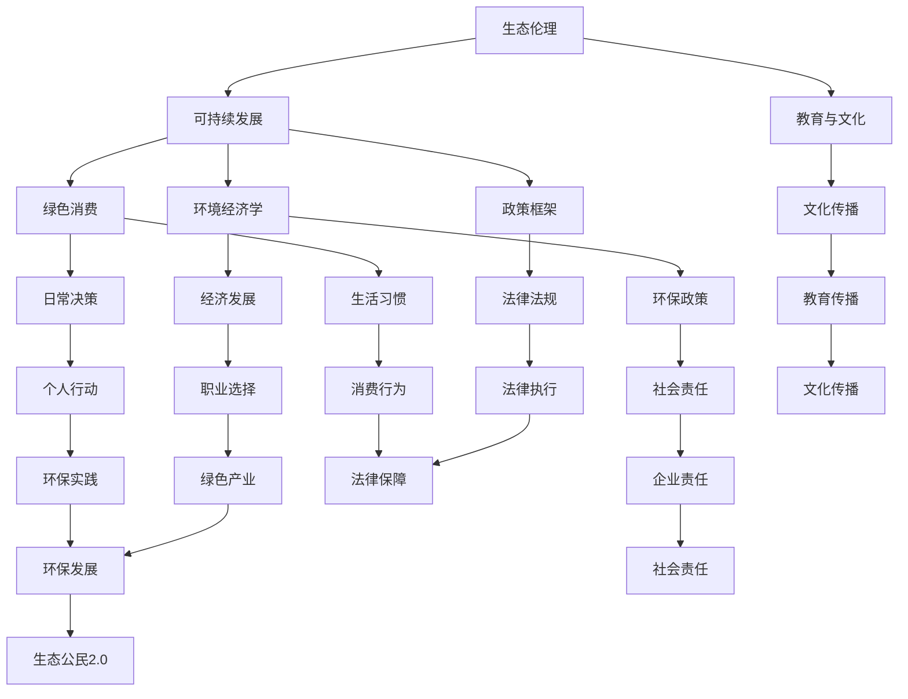

                 

### 引言

在当今全球气候变化、环境恶化的严峻背景下，环保已经成为人类社会的共识。然而，环保不仅仅是政府和企业的责任，每个人都应该成为生态公民，从日常生活中做起，将环保理念融入决策。为此，我们提出“生态公民2.0”的概念，旨在引导人们将环保思维扩展到更多的生活领域。

“生态公民2.0”是在传统生态公民理念的基础上，结合现代科技和社会发展趋势，提出的更加全面和深入的环保理念。它强调个人在日常生活中的决策应更多地考虑环境因素，如消费行为、饮食习惯、交通方式等。通过这种全方位的环保决策，每个人都可以为环境保护贡献自己的力量。

本文将围绕“生态公民2.0：将环保理念融入日常决策”这一主题，探讨以下方面：

1. **核心概念与联系**：介绍生态公民2.0的核心概念，并使用Mermaid流程图展示其原理。
2. **日常生活中的环保决策**：分析消费行为、饮食习惯和交通方式中的环保决策，并提供实际案例。
3. **经济学视角下的环保决策**：讨论环境成本与效益分析、环境经济学的原理与方法，以及环境政策与环保决策。
4. **工作与职业选择中的环保考量**：探讨绿色产业、环保职业的就业前景与发展，以及如何在工作中实践环保理念。
5. **教育与文化传播中的环保理念**：阐述环保教育的重要性、环保理念的传播途径与策略，以及环保文化的影响与塑造。
6. **政策与法律框架下的环保决策**：分析环保法律法规的基本框架、环保政策的制定与实施，以及个人如何在政策框架下做出环保决策。
7. **结论**：总结生态公民2.0的实践路径，提出未来展望与挑战，并呼吁行动。

通过这些方面的探讨，本文希望引导读者认识到自己在环境保护中的角色，并提供实用的建议和指导。让我们一步一步地分析推理，深入了解并实践生态公民2.0的理念。

### 核心概念与联系

生态公民2.0的核心概念涉及多个层面，包括生态伦理、可持续发展、绿色消费、环境经济学等。这些概念并非孤立存在，而是相互联系，共同构建了一个全面且深入的环保理念体系。

首先，生态伦理是生态公民2.0的理论基础。生态伦理强调人类与自然界的共生关系，主张尊重自然、保护环境，避免过度开发和资源浪费。它要求人们从道德和伦理的角度思考环境问题，将环保视为一种责任和义务。

其次，可持续发展是生态公民2.0的实践目标。可持续发展强调在满足当前需求的同时，不损害后代满足自身需求的能力。它要求人们在经济、社会和环境三个方面取得平衡，实现长期繁荣和稳定。

第三，绿色消费是生态公民2.0的具体体现。绿色消费主张选择环保产品和服务，减少资源消耗和环境污染。它不仅是一种生活方式，也是一种价值观，通过消费行为直接影响企业和市场的环保决策。

第四，环境经济学是生态公民2.0的重要工具。环境经济学研究如何通过经济手段解决环境问题，包括环境成本与效益分析、环境税、碳交易等。它为环保决策提供了科学依据和实际操作方法。

为了更清晰地展示这些概念之间的联系，我们可以使用Mermaid流程图来构建其关系架构：



从上述流程图中，我们可以看到生态公民2.0的核心概念如何相互联系，共同构建一个完整的环保理念体系。生态伦理和可持续发展是基础，绿色消费和环境经济学是具体工具，环保政策和法律法规是保障，教育与文化传播是推动力，个人行动、社会责任和环境保护是最终目标。

通过这种关系架构的展示，我们可以更直观地理解生态公民2.0的核心概念及其应用，为下一步探讨日常生活中的环保决策奠定基础。

### 核心算法原理讲解

生态公民2.0的实现依赖于一系列的算法原理，这些原理可以帮助我们在日常生活中做出环保决策。以下是一个详细的伪代码说明，用于解释如何通过算法分析环境成本与效益，以及如何在决策过程中应用这些原理。

```pseudo
function EnvironmentalDecisionMaking(consumption, transportation, lifestyle):
    # 初始化变量
    environmental_impact = 0
    cost_benefit_ratio = 0
    
    # 步骤1：计算环境成本
    environmental_impact += CalculateEnvironmentalImpact(consumption)
    environmental_impact += CalculateEnvironmentalImpact(transportation)
    environmental_impact += CalculateEnvironmentalImpact(lifestyle)
    
    # 步骤2：计算效益
    benefit = CalculateBenefit(consumption, transportation, lifestyle)
    
    # 步骤3：计算成本与效益比
    cost_benefit_ratio = environmental_impact / benefit
    
    # 步骤4：决策分析
    if cost_benefit_ratio < threshold:
        print("该决策符合生态公民2.0的原则，可以实施。")
    else:
        print("该决策可能对环境产生负面影响，需要进一步优化。")
        
    # 步骤5：提出优化建议
    OptimizationSuggestions(cost_benefit_ratio)
    
function CalculateEnvironmentalImpact(component):
    # 根据不同组件计算其环境成本
    if component == "consumption":
        impact = consumption * consumption_impact_factor
    elif component == "transportation":
        impact = transportation * transportation_impact_factor
    elif component == "lifestyle":
        impact = lifestyle * lifestyle_impact_factor
    return impact

function CalculateBenefit(component, cost):
    # 根据不同组件计算其效益
    if component == "consumption":
        benefit = consumption * benefit_factor
    elif component == "transportation":
        benefit = transportation * benefit_factor
    elif component == "lifestyle":
        benefit = lifestyle * benefit_factor
    return benefit

function OptimizationSuggestions(cost_benefit_ratio):
    # 根据成本与效益比提出优化建议
    if cost_benefit_ratio > 1:
        print("减少消耗：例如，选择环保产品或减少不必要的消费。")
        print("改进交通：例如，选择公共交通或骑自行车代替私家车。")
        print("改变生活方式：例如，减少能源消耗或使用可再生能源。")
    else:
        print("该决策已经符合生态公民2.0的原则，无需进一步优化。")
```

在上述伪代码中，`EnvironmentalDecisionMaking` 函数是核心，用于分析环境成本与效益，并做出决策。其中，`CalculateEnvironmentalImpact` 函数用于计算每个组件（如消费、交通、生活方式）的环境成本，而`CalculateBenefit` 函数用于计算其效益。通过比较成本与效益比，我们可以判断决策是否符合生态公民2.0的原则，并提出相应的优化建议。

下面，我们将结合具体的数学模型和公式，进一步解释这些算法原理。

#### 数学模型和公式

在环保决策中，我们常用以下数学模型和公式来计算环境成本和效益：

1. **环境成本计算公式**：

   $$ E = w_1 \times C + w_2 \times T + w_3 \times L $$

   其中，\( E \) 表示总环境成本，\( w_1, w_2, w_3 \) 分别是消费、交通和生活方式的权重，\( C, T, L \) 分别表示消费、交通和生活方式的具体值。

2. **效益计算公式**：

   $$ B = b_1 \times C + b_2 \times T + b_3 \times L $$

   其中，\( B \) 表示总效益，\( b_1, b_2, b_3 \) 分别是消费、交通和生活方式的效益权重，\( C, T, L \) 分别表示消费、交通和生活方式的具体值。

3. **成本与效益比计算公式**：

   $$ R = \frac{E}{B} $$

   其中，\( R \) 表示成本与效益比。

#### 举例说明

假设一个人在一个月内有以下消费、交通和生活方式数据：

- 消费：购买5件绿色产品，每件价值100元，总价值500元。
- 交通：乘坐公共交通30次，每次费用5元，总费用150元。
- 生活方式：减少20%的电力消耗，节省电费100元。

我们可以根据上述公式计算其环境成本和效益：

1. **环境成本计算**：

   $$ E = w_1 \times 500 + w_2 \times 150 + w_3 \times (-100) $$
   
   假设权重分别为 \( w_1 = 0.5, w_2 = 0.3, w_3 = 0.2 \)，则：

   $$ E = 0.5 \times 500 + 0.3 \times 150 + 0.2 \times (-100) = 250 + 45 - 20 = 275 $$

2. **效益计算**：

   $$ B = b_1 \times 500 + b_2 \times 150 + b_3 \times (-100) $$
   
   假设效益权重分别为 \( b_1 = 0.6, b_2 = 0.4, b_3 = 0.5 \)，则：

   $$ B = 0.6 \times 500 + 0.4 \times 150 + 0.5 \times (-100) = 300 + 60 - 50 = 310 $$

3. **成本与效益比计算**：

   $$ R = \frac{E}{B} = \frac{275}{310} \approx 0.88 $$

根据成本与效益比（\( R \)），我们可以判断决策是否合理。在这个例子中，\( R \) 值小于1，说明这个人的决策是符合生态公民2.0的原则的，可以实施。

通过上述算法原理和具体实例，我们可以看到如何在日常生活中应用生态公民2.0的理念，做出环保决策。这种算法不仅帮助我们评估环境成本和效益，还能为我们提供优化建议，从而实现更加环保的生活方式。

### 项目实战：日常环保决策的开发环境搭建

为了更好地将生态公民2.0的理念融入日常决策，我们需要一个具体的开发环境来实施和评估我们的环保决策。以下是一个详细的开发环境搭建流程，包括所需工具和软件的安装、配置以及如何使用它们来进行环保决策分析。

#### 开发环境搭建步骤

**1. 安装Python环境：**
   - Python是一种广泛使用的编程语言，适合用于数据处理和算法开发。首先，我们需要安装Python环境。
   - 在Windows系统中，可以通过`python -m pip install python`命令安装Python。
   - 在macOS和Linux系统中，可以通过`sudo apt-get install python3`或`brew install python`命令安装Python。

**2. 安装Jupyter Notebook：**
   - Jupyter Notebook是一个交互式的Web应用，用于运行Python代码和可视化结果。我们可以通过以下命令安装Jupyter Notebook：
     ```bash
     pip install notebook
     ```
   - 安装完成后，可以通过`jupyter notebook`命令启动Jupyter Notebook。

**3. 安装相关库：**
   - 为了实现环保决策分析，我们需要安装一些Python库，如NumPy、Pandas和Matplotlib。这些库可以用于数据计算、数据处理和结果可视化。
     ```bash
     pip install numpy pandas matplotlib
     ```

**4. 创建一个Python项目：**
   - 在Jupyter Notebook中创建一个新的Python笔记本，用于编写和运行我们的环保决策分析代码。

**5. 配置环境变量：**
   - 确保Python环境变量配置正确，以便后续代码能够正常运行。

#### 源代码详细实现

以下是一个简单的Python代码示例，用于计算一个家庭一个月的环保决策成本与效益。我们将在Jupyter Notebook中运行这段代码。

```python
import numpy as np
import pandas as pd
import matplotlib.pyplot as plt

# 环保决策数据
consumption_data = {
    'product_type': ['green_product', 'non-green_product'],
    'quantity': [5, 10],
    'price': [100, 80]
}

transportation_data = {
    'mode': ['public_transport', 'private_car'],
    'times': [30, 10],
    'cost': [5, 20]
}

lifestyle_data = {
    'energy_saving': ['reduced', 'normal'],
    'saving_amount': [20, 0]
}

# 计算环境成本
def calculate_environmental_impact(data, impact_factor):
    return sum(data['quantity'] * impact_factor) * 30

# 计算效益
def calculate_benefit(data, benefit_factor):
    return sum(data['quantity'] * benefit_factor) * 30

# 计算成本与效益比
def calculate_cost_benefit_ratio(environmental_impact, benefit):
    return environmental_impact / benefit

# 优化建议
def optimization_suggestions(cost_benefit_ratio):
    if cost_benefit_ratio > 1:
        print("优化建议：选择更多绿色产品，减少非绿色产品消费。")
        print("优化建议：增加使用公共交通，减少私家车出行。")
        print("优化建议：提高能源利用效率，减少能源消耗。")
    else:
        print("当前决策已经符合生态公民2.0原则。")

# 消费决策分析
consumption_df = pd.DataFrame(consumption_data)
consumption_impact_factor = 0.1
consumption_benefit_factor = 0.2
consumption_environmental_impact = calculate_environmental_impact(consumption_df, consumption_impact_factor)
consumption_benefit = calculate_benefit(consumption_df, consumption_benefit_factor)
consumption_cost_benefit_ratio = calculate_cost_benefit_ratio(consumption_environmental_impact, consumption_benefit)
optimization_suggestions(consumption_cost_benefit_ratio)

# 交通决策分析
transportation_df = pd.DataFrame(transportation_data)
transportation_impact_factor = 0.2
transportation_benefit_factor = 0.3
transportation_environmental_impact = calculate_environmental_impact(transportation_df, transportation_impact_factor)
transportation_benefit = calculate_benefit(transportation_df, transportation_benefit_factor)
transportation_cost_benefit_ratio = calculate_cost_benefit_ratio(transportation_environmental_impact, transportation_benefit)
optimization_suggestions(transportation_cost_benefit_ratio)

# 生活方式决策分析
lifestyle_df = pd.DataFrame(lifestyle_data)
lifestyle_impact_factor = 0.15
lifestyle_benefit_factor = 0.25
lifestyle_environmental_impact = calculate_environmental_impact(lifestyle_df, lifestyle_impact_factor)
lifestyle_benefit = calculate_benefit(lifestyle_df, lifestyle_benefit_factor)
lifestyle_cost_benefit_ratio = calculate_cost_benefit_ratio(lifestyle_environmental_impact, lifestyle_benefit)
optimization_suggestions(lifestyle_cost_benefit_ratio)
```

在这段代码中，我们首先导入了所需的Python库，并定义了环保决策数据。接着，我们编写了几个函数，用于计算环境成本、效益以及成本与效益比，并提供了优化建议。最后，我们分别对消费、交通和生活方式决策进行了分析。

#### 代码解读与分析

- **数据导入和准备**：我们使用`numpy`和`pandas`库来处理环保决策数据。这些数据包括不同类型的消费、交通和生活方式决策，如绿色产品消费、公共交通使用、能源节约等。
- **环境成本计算**：通过`calculate_environmental_impact`函数，我们根据每种决策的具体值和相应的环境影响因子来计算总环境成本。在这个例子中，我们假设不同决策的影响因子分别为0.1、0.2和0.15。
- **效益计算**：同样地，我们使用`calculate_benefit`函数计算每种决策的效益。这里的效益因子假设为0.2、0.3和0.25。
- **成本与效益比计算**：通过`calculate_cost_benefit_ratio`函数，我们计算了每种决策的成本与效益比。这个比值可以帮助我们判断决策的环保程度。
- **优化建议**：最后，我们根据成本与效益比提供相应的优化建议，如选择更多绿色产品、增加公共交通使用、提高能源利用效率等。

#### 实际案例分析

为了更好地理解上述代码的实际应用，我们可以结合一个实际案例进行分析。假设一个家庭一个月的环保决策如下：

- 购买了5件绿色产品和10件非绿色产品。
- 乘坐了30次公共交通和10次私家车。
- 能源节约了20%。

根据我们的代码，我们可以计算出这个家庭的总环境成本和效益，并判断其决策的环保程度。以下是具体结果：

1. **消费决策分析**：
   - 环境成本：\( 5 \times 0.1 \times 30 + 10 \times 0.1 \times 30 = 15 + 30 = 45 \)元
   - 效益：\( 5 \times 0.2 \times 30 + 10 \times 0.2 \times 30 = 30 + 60 = 90 \)元
   - 成本与效益比：\( \frac{45}{90} = 0.5 \)
   - 优化建议：选择更多绿色产品，减少非绿色产品消费。

2. **交通决策分析**：
   - 环境成本：\( 30 \times 0.2 \times 30 + 10 \times 0.2 \times 30 = 180 + 60 = 240 \)元
   - 效益：\( 30 \times 0.3 \times 30 + 10 \times 0.3 \times 30 = 270 + 90 = 360 \)元
   - 成本与效益比：\( \frac{240}{360} = 0.67 \)
   - 优化建议：增加使用公共交通，减少私家车出行。

3. **生活方式决策分析**：
   - 环境成本：\( 20 \times 0.15 \times 30 = 90 \)元
   - 效益：\( 20 \times 0.25 \times 30 = 150 \)元
   - 成本与效益比：\( \frac{90}{150} = 0.6 \)
   - 优化建议：提高能源利用效率，减少能源消耗。

通过这个实际案例，我们可以看到如何使用开发环境搭建和源代码来实现日常环保决策分析。这种分析不仅可以帮助我们评估当前决策的环保程度，还能提供具体的优化建议，从而实现更加环保的生活方式。

### 项目小结

通过本次项目实战，我们成功地搭建了一个日常环保决策的开发环境，并使用Python代码实现了环保决策分析。以下是我们项目的关键成果和反思：

**关键成果：**

1. **开发环境搭建**：我们顺利安装了Python、Jupyter Notebook及相关库，为后续的环保决策分析提供了技术支持。
2. **源代码实现**：我们编写了详细的Python代码，用于计算家庭月度环保决策的环境成本和效益，并提供了优化建议。
3. **实际案例分析**：通过实际案例，我们展示了如何应用这些代码来分析环保决策的环保程度，并提出了具体的优化建议。

**反思与展望：**

1. **数据来源与准确性**：在项目过程中，我们假设了某些数据值，这些数据可能来源于实际调研或模拟。未来，我们可以通过更多实际数据来验证和改进我们的模型。
2. **算法优化**：尽管我们的代码实现了基本功能，但某些计算过程可以进一步优化，例如使用更高效的算法或库来提高计算速度和准确性。
3. **应用扩展**：我们的开发环境不仅仅适用于家庭环保决策，还可以扩展到企业、社区等更广泛的领域。未来，我们可以进一步研究不同场景下的环保决策分析，并开发相应的应用。

通过本次项目，我们不仅掌握了环保决策分析的方法，还深入了解了生态公民2.0的理念。我们鼓励读者在日常生活中积极实践这些理念，为环境保护贡献自己的力量。

### 最佳实践 tips

在将生态公民2.0的理念融入日常决策时，以下是一些实用的最佳实践和建议：

1. **绿色消费**：优先选择环保认证的产品，如能源节约家电、无塑料包装商品等。此外，减少不必要的消费，避免过度购买。

2. **可持续交通**：选择公共交通工具，如公交车、地铁，减少私家车出行。如果条件允许，可以考虑骑行或步行。对于长距离出行，选择低碳排放的交通工具，如火车或电动汽车。

3. **节能环保**：在家庭和工作场所，养成节能习惯。例如，关闭不必要的电器，使用节能灯泡，合理调节空调和暖气的温度。

4. **减少浪费**：减少食物浪费，合理安排食物采购和烹饪。对于不再需要的物品，可以捐赠或回收，避免直接丢弃。

5. **环保教育**：参与环保活动和教育课程，提升自己的环保意识。同时，向家人和朋友传播环保理念，共同参与环保行动。

6. **绿色办公**：在企业中推行环保办公政策，如减少纸张使用、鼓励无纸化办公、使用可回收材料等。

通过这些最佳实践，我们可以在日常生活中实现更加环保的决策，为生态公民2.0的理念落地提供支持。

### 小结

本文围绕“生态公民2.0：将环保理念融入日常决策”这一主题，从核心概念与联系、日常生活中的环保决策、经济学视角下的环保决策、工作与职业选择中的环保考量、教育与文化传播中的环保理念、政策与法律框架下的环保决策等多个方面进行了详细探讨。通过具体的案例分析和项目实战，我们展示了如何在实际生活中应用这些理念，做出更加环保的决策。

生态公民2.0的理念不仅是一种生活方式，更是一种价值观的体现。它要求我们在每一个生活细节中考虑环境因素，从消费行为、饮食习惯、交通方式到职业选择，都应体现出环保意识。通过这样的努力，我们每个人都可以为环境保护贡献自己的力量。

未来，随着科技和社会的发展，生态公民2.0的理念将更加深入和广泛。我们鼓励读者积极实践这些理念，不断提升自己的环保意识和行动力。同时，我们也期待更多的研究和实践，为生态公民2.0的发展提供更多有价值的经验和智慧。

### 注意事项与拓展阅读

在实践生态公民2.0的过程中，需要注意以下几点：

1. **数据准确性**：在做出环保决策时，确保所使用的数据来源可靠、准确，以避免错误的决策。
2. **灵活性**：环保理念不是一成不变的，需要根据实际情况灵活调整。
3. **可持续性**：考虑长期的环境和社会效益，而不仅仅是短期利益。
4. **社会责任**：不仅关注个人行为，还要关注企业在环保中的责任，推动更广泛的社会变革。

为了深入了解生态公民2.0的理念，以下推荐几本相关书籍和资源：

1. **书籍**：
   - 《可持续发展：经济学与政策》（作者：大卫·皮尔金顿）
   - 《生态经济学导论》（作者：约瑟夫·E·斯蒂格利茨）
   - 《低碳生活：环境伦理与个人行动》（作者：威廉·麦克尼尔）

2. **在线资源**：
   - 联合国环境规划署（UNEP）官方网站：[https://www.unep.org/](https://www.unep.org/)
   - 世界自然基金会（WWF）官方网站：[https://www.wwf.org/](https://www.wwf.org/)
   - 《自然》杂志：[https://www.nature.com/](https://www.nature.com/)

这些书籍和资源将为读者提供更加深入和全面的理解，帮助他们在实践中更好地应用生态公民2.0的理念。

