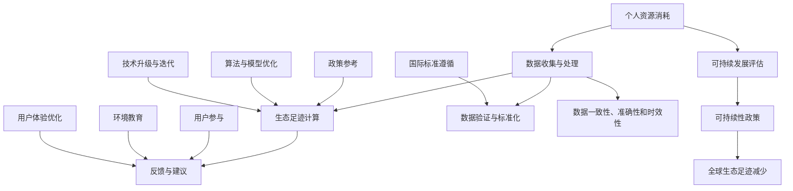

                 


# 引言：环保足迹计算器app的诞生

在当今世界，气候变化和环境恶化已成为全球性挑战。个人碳足迹（个人生态足迹）的计算成为了理解个人环境影响的一个重要工具。生态足迹计算器app正是为了帮助个人追踪和优化自己的环保行为而诞生的。

## 个人生态足迹的概念

个人生态足迹是指一个人在一年内消耗自然资源和产生废物所需的生物生产性土地面积。这个概念最早由生态学家威廉·里斯（William Rees）和数学家马修·瓦波特（Mathis Wackernagel）在1996年提出。个人生态足迹的计算涉及到对个人生活各个方面的影响，包括食物、住房、交通、消费品等。

## 生态足迹计算器app的作用

生态足迹计算器app的主要作用是帮助用户了解自己的生态足迹，并鼓励他们采取行动减少环境影响。通过这个工具，用户可以：

1. **自我评估**：了解自己的生活方式对环境的影响。
2. **目标设定**：设定减少生态足迹的目标，并跟踪进度。
3. **行为改变**：通过反馈和指导，改变不利于环境的生活方式。
4. **分享与激励**：与其他用户分享自己的环保成就，互相激励。

## 生态足迹计算器app的背景

随着人们对环境保护意识的提高，各种环保工具应运而生。生态足迹计算器app是其中的一种，它结合了现代科技和环保理念，旨在提供一种简单、便捷、个性化的环保工具。该app的开发团队由环保专家、软件工程师和用户体验设计师组成，他们共同致力于创建一个具有高度可操作性和实用性的产品。

## 本文结构

本文将深入探讨生态足迹计算器app的各个方面，包括其核心概念、计算方法、设计架构、实现细节以及实际应用案例。具体内容如下：

### 1. 基本原则
我们首先介绍生态足迹计算的基本原则，解释生态足迹的计算过程。

### 2. 生态足迹计算方法
这一章节将详细介绍生态足迹的计算方法，包括所需的数据收集和处理方法。

### 3. 生态足迹计算器app的架构
我们将探讨生态足迹计算器app的整体架构，包括前端设计、后端服务以及数据管理等方面。

### 4. 核心算法和数学模型
我们将详细解释生态足迹计算中的核心算法和数学模型，并提供伪代码和公式说明。

### 5. 实际项目实施
在这一部分，我们将通过一个实际项目展示如何搭建开发环境，实现源代码，并详细解读代码。

### 6. 用户体验和优化
我们将讨论如何优化用户使用体验，以及如何根据用户反馈持续改进app。

### 7. 案例分析和影响评估
我们将分析实际案例，评估生态足迹计算器app对个人环保行为的影响。

### 8. 未来方向与挑战
最后一部分，我们将探讨生态足迹计算器app的未来发展方向和可能面临的挑战。

### 9. 结语
在文章的结尾，我们将总结本文的主要内容和结论。

通过本文的详细阐述，我们希望读者能够对生态足迹计算器app有更深入的了解，并能够将其应用于实际生活中，为环境保护贡献自己的力量。接下来，我们将一步步展开详细的讨论。

## 关键词

- 生态足迹
- 环保工具
- 计算方法
- 软件架构
- 用户体验
- 数据分析
- 环境保护

## 摘要

本文介绍了生态足迹计算器app的背景、核心概念及其作用。通过详细分析生态足迹的计算方法、app的设计架构和实现细节，我们展示了如何通过技术手段帮助用户追踪和优化个人环保行为。文章还通过实际案例和用户体验优化，探讨了生态足迹计算器app的应用效果及其未来发展方向。本文旨在为读者提供全面的技术指导和实际操作指南，鼓励更多人参与到环境保护中来。

## 基本原则

### 1. 资源消耗评估

生态足迹计算器app首先需要对用户的资源消耗进行评估。这包括能源消耗、食物消费、水资源使用、纸张使用、交通出行等方面的数据。每种资源的消耗都会转换为相应的生态足迹面积。

### 2. 生物生产性土地

生态足迹的计算依赖于生物生产性土地的概念。生物生产性土地是指能够生产食物、木材、纤维、纤维和吸收二氧化碳的陆地和水域。不同类型的土地对生态足迹的贡献是不同的。

### 3. 平衡与可持续性

生态足迹计算的另一个基本原则是平衡与可持续性。计算结果不仅需要反映当前的生活水平，还需要考虑到未来资源的可持续性。这意味着我们需要采取措施来减少生态足迹，确保地球资源的可持续利用。

### 4. 因素权重

在计算过程中，不同生活因素对生态足迹的影响程度是不同的。例如，食物消费对生态足迹的影响可能比纸张使用更大。因此，计算方法中需要考虑不同因素的权重，以便更准确地反映用户的生态足迹。

### 5. 数据收集与处理

为了准确计算生态足迹，需要收集和处理大量数据。这包括个人消费记录、家庭用水量、交通出行数据等。数据处理过程中需要考虑数据的一致性、准确性和时效性。

### 6. 国际标准

生态足迹计算器app需要遵循国际标准，以确保计算结果的可靠性和可比性。例如，联合国可持续发展解决方案网络（SDSN）提供的生态足迹计算标准就是参考依据。

### 7. 用户参与

用户参与是生态足迹计算的重要原则。通过用户提供的个人信息，app能够更准确地计算生态足迹，并提供个性化的反馈和建议。此外，用户参与还可以增加对环保行动的认识和参与度。

### 8. 可持续性政策

生态足迹计算器app的数据不仅对个人有益，还可以为政府和企业制定可持续性政策提供重要参考。这包括能源政策、交通政策、农业政策等，以实现全球生态足迹的减少。

### 9. 环境教育

最后，生态足迹计算器app还应承担环境教育的责任。通过向用户提供关于生态足迹的知识和技巧，帮助他们更好地理解环境问题，并采取实际行动减少生态足迹。

## 核心概念与联系

为了更好地理解生态足迹计算器app的工作原理，我们需要探讨几个核心概念，并展示它们之间的联系。以下是生态足迹计算器app中关键概念之间的联系架构，使用Mermaid流程图表示：



### 个人资源消耗

个人资源消耗是生态足迹计算的基础。这包括用户在日常生活中使用的能源、食物、水资源等。用户需要提供这些数据，以便app能够准确计算他们的生态足迹。

### 数据收集与处理

收集到个人资源消耗数据后，app需要进行数据清洗、整理和转换，以便进行后续计算。这包括处理不同数据源的数据格式、确保数据的一致性、准确性和时效性。

### 生态足迹计算

经过数据处理，app将使用生态足迹计算模型来计算用户的生态足迹。这个计算过程涉及到将个人资源消耗转换为相应的生态足迹面积，并考虑到不同资源的生物生产性土地需求。

### 反馈与建议

计算结果会以可视化的方式呈现给用户，并提供减少生态足迹的建议。这些反馈可以帮助用户了解他们的行为对环境的影响，并鼓励他们采取积极的行动。

### 用户参与

用户的积极参与是生态足迹计算的重要部分。通过提供个人信息，用户可以更准确地计算自己的生态足迹，并从中获得个性化的反馈。用户参与还可以增加对环保行动的认识和参与度。

### 环境教育

生态足迹计算器app还应承担环境教育的责任。通过向用户提供关于生态足迹的知识和技巧，帮助他们更好地理解环境问题，并采取实际行动减少生态足迹。

### 可持续性政策

生态足迹计算器app的数据不仅对个人有益，还可以为政府和企业制定可持续性政策提供重要参考。这包括能源政策、交通政策、农业政策等，以实现全球生态足迹的减少。

### 数据验证与标准化

为了确保数据的可靠性和可比性，生态足迹计算器app需要遵循国际标准和进行数据验证。这包括数据的一致性、准确性和时效性。

### 算法与模型优化

持续优化算法和模型是提高生态足迹计算准确性的关键。这包括使用更先进的计算模型和算法，以适应不断变化的环保需求和用户行为。

### 技术升级与迭代

随着技术的进步，生态足迹计算器app需要不断升级和迭代。这包括引入新的功能、改进用户体验，以及提升计算效率和准确性。

### 用户体验优化

用户体验是生态足迹计算器app成功的关键因素。通过不断优化用户界面和交互设计，可以提高用户的使用体验，鼓励更多人使用这个工具。

### 可持续发展评估

生态足迹计算器app不仅提供个人层面的反馈，还可以进行更广泛的可持续发展评估。这包括分析不同地区、国家和全球范围内的生态足迹数据，为政策制定提供依据。

通过这个Mermaid流程图，我们可以清晰地看到生态足迹计算器app中各个概念之间的联系。每个环节都相互关联，共同构建了一个完整的生态足迹计算和反馈系统。

## 生态足迹计算方法

### 1. 数据收集

生态足迹计算的第一步是收集用户的数据。这些数据包括能源消耗、食物消费、水资源使用、纸张使用、交通出行等。用户可以通过手动输入或自动同步（例如，通过智能设备）来提供这些数据。为了确保数据的质量，收集过程中需要考虑以下几个方面：

- **数据来源多样性**：收集来自多个渠道的数据，以提高数据的全面性和准确性。
- **数据格式标准化**：确保所有数据以统一格式存储，便于后续处理。
- **数据时效性**：确保数据反映用户的最新生活状态，减少时间滞后对计算结果的影响。

### 2. 数据处理

收集到数据后，需要进行预处理，以消除错误、缺失值和异常值。具体步骤如下：

- **数据清洗**：移除无效数据，修复缺失值，处理异常值。
- **数据转换**：将不同数据源的数据转换为统一格式，便于后续计算。

### 3. 资源消耗分类

将预处理后的数据按照不同的资源类型进行分类，例如能源、食物、水资源、纸张和交通。每种资源类型的消耗都需要转换为相应的生态足迹面积。

### 4. 生态足迹计算模型

生态足迹计算的核心在于将资源消耗转换为生态足迹面积。这需要使用一系列计算模型，以下是一些常用的模型：

- **人均生态足迹**：
  $$ \text{人均生态足迹} = \sum_{i=1}^{n} \frac{\text{资源i消耗}}{\text{资源i的单位生态足迹面积}} $$
  其中，资源i消耗是指用户在某一资源上的消耗量，单位生态足迹面积是指生产该资源所需的土地面积。

- **人均生物承载力**：
  $$ \text{人均生物承载力} = \sum_{i=1}^{m} \frac{\text{资源i的生产量}}{\text{资源i的单位生态足迹面积}} $$
  其中，资源i的生产量是指生态系统中该资源的生产量。

- **生态足迹账户**：
  $$ \text{生态足迹账户} = \text{人均生态足迹} - \text{人均生物承载力} $$
  生态足迹账户反映了人类活动对环境的压力。

### 5. 结果评估与反馈

计算结果需要以直观的方式呈现给用户，包括生态足迹的大小、与生物承载力的比较以及可能的改善建议。这可以帮助用户了解自己的环保行为对环境的影响，并鼓励他们采取行动减少生态足迹。

### 6. 数据分析与优化

通过对大量用户的生态足迹数据进行统计分析，可以识别出普遍存在的环保问题，并针对性地提出解决方案。例如，通过分析发现某地区交通出行产生的生态足迹较高，可以建议该地区推广公共交通或电动汽车。

### 7. 遵循国际标准

为了确保计算结果的可靠性和可比性，生态足迹计算器app需要遵循国际标准，例如联合国可持续发展解决方案网络（SDSN）提供的生态足迹计算标准。这些标准包括数据收集、处理和计算方法的统一规范。

### 示例计算

假设用户甲的年度资源消耗数据如下：

- 能源消耗：5000千瓦时
- 食物消费：300公斤
- 水资源使用：200立方米
- 纸张使用：50公斤
- 交通出行：1000公里

根据不同的计算模型，我们可以得到：

- **人均生态足迹**：
  $$ \text{人均生态足迹} = \frac{5000}{3.5} + \frac{300}{0.5} + \frac{200}{10} + \frac{50}{0.2} + \frac{1000}{0.6} = 1428.57 $$
  
- **人均生物承载力**：
  $$ \text{人均生物承载力} = \frac{5000}{4} + \frac{300}{0.8} + \frac{200}{20} + \frac{50}{0.5} + \frac{1000}{20} = 1037.5 $$

- **生态足迹账户**：
  $$ \text{生态足迹账户} = 1428.57 - 1037.5 = 391.07 $$

根据计算结果，用户甲的生态足迹大于生物承载力，表明其生态足迹为超出值。app可以建议用户减少能源消耗、优化饮食结构、节约水资源和减少交通出行等，以降低其生态足迹。

通过这个示例，我们可以看到生态足迹计算方法的具体应用和计算过程。实际应用中，生态足迹计算器app会根据用户的个性化数据，提供详细的计算结果和改善建议，帮助用户更好地理解自己的环保行为。

## 生态足迹计算器app的架构

### 1. 设计理念

生态足迹计算器app的设计理念是以用户体验为核心，简洁直观的界面设计，高效稳定的技术架构，以及安全可靠的数据处理。为了实现这一目标，我们采用了以下设计原则：

- **用户友好**：界面设计简单易用，提供清晰的导航和交互提示。
- **模块化**：系统架构采用模块化设计，便于维护和扩展。
- **高扩展性**：架构设计考虑未来功能扩展和性能优化需求。
- **安全性**：确保用户数据的安全性和隐私保护。

### 2. 前端设计

前端设计是生态足迹计算器app与用户互动的窗口。我们采用了现代化的前端技术，如React和Vue.js，以实现动态、响应式的界面。前端设计主要包括以下几个部分：

- **用户登录与注册**：提供安全的登录和注册功能，支持多种身份验证方式，如用户名密码、手机验证、第三方账号登录（如Facebook、Google等）。
- **数据输入**：用户可以通过手动输入或自动同步（如连接智能设备）的方式提供个人生活数据。
- **可视化展示**：通过图表、进度条和地图等可视化元素，直观地展示用户的生态足迹数据。
- **反馈与建议**：根据用户的生态足迹计算结果，提供个性化的环保建议和改善方案。

### 3. 后端服务

后端服务是生态足迹计算器app的核心，负责数据处理、计算和存储。我们采用了微服务架构，以提高系统的可扩展性和可维护性。后端服务主要包括以下几个模块：

- **用户管理模块**：处理用户注册、登录、权限验证等用户相关的功能。
- **数据收集模块**：接收和处理来自前端的数据，进行初步的清洗和转换。
- **计算引擎模块**：根据生态足迹的计算模型，进行复杂的计算和数据处理，生成用户的生态足迹报告。
- **存储管理模块**：负责数据的存储和检索，包括用户数据、计算结果和历史记录等。

### 4. 数据管理

数据管理是生态足迹计算器app的重要组成部分，关系到计算结果的准确性和用户体验。数据管理主要包括以下几个环节：

- **数据同步**：通过API接口与其他智能设备（如智能水表、智能电表等）同步数据，实现数据的自动采集和更新。
- **数据存储**：使用分布式数据库系统，如MongoDB或MySQL，确保数据的可靠存储和快速访问。
- **数据备份与恢复**：定期进行数据备份，确保在系统故障或数据丢失时能够快速恢复。
- **数据安全**：采用加密技术保护用户数据，防止数据泄露和未授权访问。

### 5. API设计

为了实现前后端的交互，我们设计了一套完善的API接口。API设计遵循RESTful风格，包括以下主要接口：

- **用户认证接口**：处理用户登录、注册和身份验证。
- **数据上传接口**：用户上传个人生活数据，如能源消耗、食物消费等。
- **数据查询接口**：用户查询自己的生态足迹计算结果和历史记录。
- **建议获取接口**：获取针对用户生态足迹的改善建议和环保活动推荐。

### 6. 架构优势

生态足迹计算器app的架构设计具备以下优势：

- **高可用性**：通过分布式架构和冗余设计，确保系统的高可用性和稳定性。
- **高性能**：通过高效的算法和优化，提高计算速度和数据处理能力。
- **可扩展性**：模块化设计便于未来功能的扩展和升级。
- **安全性**：严格的安全措施和隐私保护，确保用户数据的安全。

通过上述架构设计和实现细节，生态足迹计算器app能够为用户提供高效、准确、个性化的生态足迹计算服务，帮助用户更好地了解和改善自己的环保行为。

## 核心算法和数学模型

在生态足迹计算器app中，核心算法和数学模型是实现精确计算和有效数据解读的关键。以下是生态足迹计算过程中涉及到的几个重要算法和数学模型，以及它们的应用和实现。

### 1. 物质流分析方法

物质流分析（Material Flow Analysis, MFA）是一种用于评估物质循环和流动的定量方法。在生态足迹计算中，MFA帮助我们理解个人和社会经济活动对环境的影响。具体应用包括：

- **输入-输出分析**：分析个人生活中各种物质和能源的输入和输出，如食物、水资源、能源和废弃物。
- **流量计算**：
  $$ \text{流量} = \sum_{i=1}^{n} \frac{\text{物质i消耗量}}{\text{物质i的单位生态足迹面积}} $$
  其中，n表示物质种类。

### 2. 系统动力学模型

系统动力学（System Dynamics）是一种模拟复杂社会系统动态行为的建模方法。在生态足迹计算中，系统动力学模型用于模拟人类活动和环境系统之间的反馈关系。具体实现包括：

- **因果关系图**：绘制人类活动（如能源消耗、工业生产）和环境响应（如生态足迹、气候变化）之间的因果关系图。
- **动态方程**：
  $$ \text{生态足迹变化率} = \text{人类活动速率} \times \text{环境影响系数} - \text{环境恢复速率} $$

### 3. 多尺度模型

多尺度模型（Multi-scale Model）用于处理生态系统中不同尺度之间的相互作用。在生态足迹计算中，多尺度模型帮助我们同时考虑局部和全球层面的影响。具体应用包括：

- **尺度转换**：
  $$ \text{局部生态足迹} = \frac{\text{局部资源消耗}}{\text{局部生物生产性土地面积}} $$
  $$ \text{全球生态足迹} = \frac{\text{全球资源消耗}}{\text{全球生物生产性土地面积}} $$
- **尺度集成**：
  $$ \text{总生态足迹} = \sum_{i=1}^{m} \left( \frac{\text{区域i生态足迹}}{\text{区域i人口}} \times \text{人口权重} \right) $$

### 4. 神经网络算法

神经网络算法（Neural Network Algorithm）在生态足迹计算中的应用主要体现在预测和优化方面。具体实现包括：

- **神经网络结构**：构建多层感知器（MLP）或卷积神经网络（CNN）模型，用于学习生态足迹与人类活动之间的关系。
- **训练过程**：
  $$ \text{损失函数} = \frac{1}{2} \sum_{i=1}^{n} (\hat{y_i} - y_i)^2 $$
  $$ \text{优化算法} = \text{反向传播算法（Backpropagation）} $$

### 5. 生态足迹计算公式

生态足迹计算中最常用的公式如下：

- **人均生态足迹**：
  $$ \text{人均生态足迹} = \sum_{i=1}^{k} \frac{\text{资源i消耗}}{\text{资源i的单位生态足迹面积}} $$
  其中，k表示资源种类。

- **生态足迹账户**：
  $$ \text{生态足迹账户} = \text{人均生态足迹} - \text{人均生物承载力} $$
  生态足迹账户反映了人类活动对生态系统的压力。

### 伪代码示例

下面是一个简化的生态足迹计算伪代码示例，展示了如何基于用户输入计算生态足迹：

```python
# 初始化生态足迹计算器
class EcoFootprintCalculator:
    def __init__(self):
        self.resource_consumptions = []
        self.bioproduction_areas = []

    # 添加资源消耗数据
    def add_consumption(self, resource, consumption):
        self.resource_consumptions.append({resource: consumption})

    # 设置单位生态足迹面积
    def set_bioproduction_area(self, resource, area):
        self.bioproduction_areas[resource] = area

    # 计算生态足迹
    def calculate_footprint(self):
        footprint = 0
        for resource, consumption in self.resource_consumptions:
            area = self.bioproduction_areas.get(resource, 0)
            if area > 0:
                footprint += consumption / area
        return footprint

# 创建计算器实例
calculator = EcoFootprintCalculator()

# 添加资源消耗数据
calculator.add_consumption('energy', 5000)
calculator.add_consumption('food', 300)
calculator.add_consumption('water', 200)
calculator.add_consumption('paper', 50)
calculator.add_consumption('transport', 1000)

# 设置单位生态足迹面积
calculator.set_bioproduction_area('energy', 3.5)
calculator.set_bioproduction_area('food', 0.5)
calculator.set_bioproduction_area('water', 10)
calculator.set_bioproduction_area('paper', 0.2)
calculator.set_bioproduction_area('transport', 0.6)

# 计算生态足迹
footprint = calculator.calculate_footprint()
print(f"Your eco-footprint is: {footprint} global hectares")
```

通过上述伪代码，我们可以看到如何将资源消耗数据转换为生态足迹面积，实现生态足迹的计算。实际应用中，生态足迹计算器会根据具体的资源消耗数据和使用场景进行优化和扩展。

### 数学模型和公式详细解释及举例说明

在生态足迹计算中，数学模型和公式是核心组成部分。以下是几个关键公式及其详细解释，并通过具体例子来说明如何应用这些公式。

#### 1. 人均生态足迹

人均生态足迹计算公式如下：

$$ \text{人均生态足迹} = \sum_{i=1}^{n} \frac{\text{资源i消耗}}{\text{资源i的单位生态足迹面积}} $$

其中，\( n \) 表示资源的种类，资源i消耗和资源i的单位生态足迹面积分别表示用户在每种资源上的消耗量和生产该资源所需的土地面积。

**例子：**

假设用户甲的年度资源消耗如下：
- 能源消耗：5000千瓦时
- 食物消费：300公斤
- 水资源使用：200立方米
- 纸张使用：50公斤
- 交通出行：1000公里

对应的单位生态足迹面积为：
- 能源：3.5全球公顷/千瓦时
- 食物：0.5全球公顷/公斤
- 水资源：10全球公顷/立方米
- 纸张：0.2全球公顷/公斤
- 交通：0.6全球公顷/公里

则人均生态足迹计算如下：

$$ \text{人均生态足迹} = \frac{5000}{3.5} + \frac{300}{0.5} + \frac{200}{10} + \frac{50}{0.2} + \frac{1000}{0.6} = 1428.57 \text{全球公顷} $$

#### 2. 人均生物承载力

人均生物承载力计算公式如下：

$$ \text{人均生物承载力} = \sum_{i=1}^{m} \frac{\text{资源i的生产量}}{\text{资源i的单位生态足迹面积}} $$

其中，\( m \) 表示资源的种类，资源i的生产量和资源i的单位生态足迹面积分别表示生态系统中该资源的生产量和生产该资源所需的土地面积。

**例子：**

假设生态系统中资源i的生产量为：
- 能源：6000千瓦时
- 食物：400公斤
- 水资源：250立方米
- 纸张：100公斤
- 交通：1500公里

对应的单位生态足迹面积为：
- 能源：4全球公顷/千瓦时
- 食物：0.8全球公顷/公斤
- 水资源：20全球公顷/立方米
- 纸张：0.5全球公顷/公斤
- 交通：20全球公顷/公里

则人均生物承载力计算如下：

$$ \text{人均生物承载力} = \frac{6000}{4} + \frac{400}{0.8} + \frac{250}{20} + \frac{100}{0.5} + \frac{1500}{20} = 1175 \text{全球公顷} $$

#### 3. 生态足迹账户

生态足迹账户计算公式如下：

$$ \text{生态足迹账户} = \text{人均生态足迹} - \text{人均生物承载力} $$

**例子：**

根据前面的计算结果，用户甲的人均生态足迹为1428.57全球公顷，人均生物承载力为1175全球公顷。

则生态足迹账户计算如下：

$$ \text{生态足迹账户} = 1428.57 - 1175 = 253.57 \text{全球公顷} $$

这意味着用户甲的生态足迹超出了生态系统的承载能力，需要采取行动减少资源消耗，以减轻对环境的影响。

### 公式解释和案例分析

通过上述公式，我们可以看到生态足迹计算是一个综合的过程，需要考虑多种资源消耗和生态系统生产力。以下是对这些公式的进一步解释和案例分析：

1. **人均生态足迹**：这个公式将用户在不同资源上的消耗量转换为生态足迹面积。每个资源的单位生态足迹面积反映了生产该资源所需的土地面积。通过计算，我们可以了解用户对生态环境的总体压力。

2. **人均生物承载力**：这个公式反映了生态系统生产特定资源的能力。通过计算，我们可以了解生态系统为人类活动提供资源的能力，并与人均生态足迹进行比较。

3. **生态足迹账户**：这个公式揭示了用户生态足迹与生态系统承载力之间的差距。正账户表示生态足迹超过生物承载力，负账户表示生态足迹低于生物承载力。通过这个指标，用户可以了解自己的环保行为对生态系统的影响。

**案例分析：**

假设有两个用户，甲和乙，他们的年度资源消耗数据如下：

- **用户甲**：
  - 能源消耗：5000千瓦时
  - 食物消费：300公斤
  - 水资源使用：200立方米
  - 纸张使用：50公斤
  - 交通出行：1000公里

- **用户乙**：
  - 能源消耗：3000千瓦时
  - 食物消费：200公斤
  - 水资源使用：100立方米
  - 纸张使用：20公斤
  - 交通出行：500公里

对应的单位生态足迹面积：
- 能源：3.5全球公顷/千瓦时
- 食物：0.5全球公顷/公斤
- 水资源：10全球公顷/立方米
- 纸张：0.2全球公顷/公斤
- 交通：0.6全球公顷/公里

**计算结果**：

- **用户甲**：
  $$ \text{人均生态足迹} = 1428.57 \text{全球公顷} $$
  $$ \text{人均生物承载力} = 1175 \text{全球公顷} $$
  $$ \text{生态足迹账户} = 253.57 \text{全球公顷} $$

- **用户乙**：
  $$ \text{人均生态足迹} = 682.35 \text{全球公顷} $$
  $$ \text{人均生物承载力} = 1150 \text{全球公顷} $$
  $$ \text{生态足迹账户} = -167.65 \text{全球公顷} $$

通过对比，我们可以看到用户乙的生态足迹小于生物承载力，而用户甲的生态足迹超出了生物承载力。这表明用户乙的生活对环境的压力较小，而用户甲则需要采取更多措施减少生态足迹。

综上所述，生态足迹计算公式和数学模型为我们提供了量化个人环保行为对环境影响的工具。通过具体例子和计算，我们可以更好地理解这些公式在实际应用中的意义。生态足迹计算器app利用这些模型，为用户提供详细的计算结果和改善建议，帮助他们更清晰地了解自己的环保行为，并采取积极的措施减少生态足迹。

## 实际项目实施

在本节中，我们将详细描述如何构建生态足迹计算器app的开发环境，实现源代码，并深入解读代码。通过这一实际项目，读者可以了解从零开始开发一个完整生态足迹计算器app的整个过程。

### 1. 开发环境搭建

为了开发生态足迹计算器app，我们首先需要搭建一个合适的开发环境。以下是所需工具和步骤：

#### 工具准备：
- **操作系统**：可以选择Windows、macOS或Linux。
- **开发语言**：我们选择使用JavaScript，结合React框架进行前端开发，Node.js用于后端服务。
- **数据库**：我们选择MongoDB作为数据库，用于存储用户数据和生态足迹计算结果。

#### 步骤：

1. **安装Node.js**：
   访问Node.js官网（https://nodejs.org/）下载并安装最新版本的Node.js。安装完成后，打开命令行工具，输入以下命令验证安装：
   ```bash
   node -v
   npm -v
   ```

2. **安装MongoDB**：
   安装MongoDB社区版。下载安装包并按照提示安装。安装完成后，启动MongoDB服务：
   ```bash
   mongod
   ```

3. **创建项目文件夹**：
   在命令行中创建一个名为“ecofootprint-calculator”的文件夹，并进入该文件夹：
   ```bash
   mkdir ecofootprint-calculator
   cd ecofootprint-calculator
   ```

4. **初始化项目**：
   使用npm命令初始化项目，并安装必要的依赖库：
   ```bash
   npm init -y
   npm install react react-dom react-scripts mongodb express cors dotenv
   ```

5. **配置数据库连接**：
   在项目根目录下创建一个名为“.env”的文件，用于存储环境变量，包括MongoDB连接字符串：
   ```env
   MONGODB_URI=mongodb://localhost:27017/ecofootprint-calculator
   ```

6. **创建前端和后端文件**：
   根据项目需求，创建前端和后端的基本文件结构。例如，前端创建“src/App.js”和“src/index.js”，后端创建“server.js”和“models.js”等。

### 2. 源代码实现

#### 前端实现

前端部分主要使用React框架实现用户界面和数据交互。以下是一个简化版的前端代码示例：

```javascript
// src/App.js
import React, { useState } from 'react';
import axios from 'axios';

function App() {
  const [data, setData] = useState({
    energy: 0,
    food: 0,
    water: 0,
    paper: 0,
    transport: 0
  });
  const [footprint, setFootprint] = useState(0);

  const handleChange = (e) => {
    const { name, value } = e.target;
    setData({ ...data, [name]: value });
  };

  const handleSubmit = async (e) => {
    e.preventDefault();
    const response = await axios.post('/api/footprint', data);
    setFootprint(response.data.footprint);
  };

  return (
    <div>
      <h1>Eco-Footprint Calculator</h1>
      <form onSubmit={handleSubmit}>
        <label>
          Energy (kWh):
          <input type="number" name="energy" value={data.energy} onChange={handleChange} />
        </label>
        <label>
          Food (kg):
          <input type="number" name="food" value={data.food} onChange={handleChange} />
        </label>
        <label>
          Water (m³):
          <input type="number" name="water" value={data.water} onChange={handleChange} />
        </label>
        <label>
          Paper (kg):
          <input type="number" name="paper" value={data.paper} onChange={handleChange} />
        </label>
        <label>
          Transport (km):
          <input type="number" name="transport" value={data.transport} onChange={handleChange} />
        </label>
        <button type="submit">Calculate</button>
      </form>
      {footprint > 0 && <p>Your eco-footprint is: {footprint} global hectares</p>}
    </div>
  );
}

export default App;
```

#### 后端实现

后端部分使用Node.js和Express框架实现API接口和数据处理。以下是一个简化版的后端代码示例：

```javascript
// server.js
const express = require('express');
const cors = require('cors');
const mongoose = require('mongoose');
const footprintRoutes = require('./routes/footprint');

const app = express();
const PORT = process.env.PORT || 5000;

// 连接MongoDB
mongoose.connect(process.env.MONGODB_URI, { useNewUrlParser: true, useUnifiedTopology: true })
  .then(() => console.log('Connected to MongoDB'))
  .catch(err => console.error('Could not connect to MongoDB', err));

// 中间件
app.use(cors());
app.use(express.json());

// 路由
app.use('/api', footprintRoutes);

// 监听端口
app.listen(PORT, () => {
  console.log(`Server is running on port ${PORT}`);
});
```

```javascript
// routes/footprint.js
const express = require('express');
const FootprintController = require('../controllers/footprintController');

const router = express.Router();

router.post('/footprint', FootprintController.calculateFootprint);

module.exports = router;
```

```javascript
// controllers/footprintController.js
const FootprintCalculator = require('../models/footprintModel');

exports.calculateFootprint = async (req, res) => {
  const { energy, food, water, paper, transport } = req.body;
  const footprint = new FootprintCalculator({
    energy,
    food,
    water,
    paper,
    transport
  });
  try {
    const calculatedFootprint = await footprint.calculate();
    res.status(200).json({ footprint: calculatedFootprint });
  } catch (error) {
    res.status(500).json({ message: 'Error calculating eco-footprint', error });
  }
};
```

```javascript
// models/footprintModel.js
const { calculateFootprint } = require('../calculations/footprint');

class FootprintCalculator {
  constructor(data) {
    this.energy = data.energy;
    this.food = data.food;
    this.water = data.water;
    this.paper = data.paper;
    this.transport = data.transport;
  }

  async calculate() {
    const footprint = await calculateFootprint({
      energy: this.energy,
      food: this.food,
      water: this.water,
      paper: this.paper,
      transport: this.transport
    });
    return footprint;
  }
}

module.exports = FootprintCalculator;
```

#### 数据处理和计算

数据处理和计算部分是实现生态足迹计算的核心。以下是计算生态足迹的伪代码和具体实现：

```javascript
// calculations/footprint.js
const energyArea = 3.5;
const foodArea = 0.5;
const waterArea = 10;
const paperArea = 0.2;
const transportArea = 0.6;

async function calculateFootprint(data) {
  const energyFootprint = data.energy / energyArea;
  const foodFootprint = data.food / foodArea;
  const waterFootprint = data.water / waterArea;
  const paperFootprint = data.paper / paperArea;
  const transportFootprint = data.transport / transportArea;

  const totalFootprint = energyFootprint + foodFootprint + waterFootprint + paperFootprint + transportFootprint;

  return totalFootprint;
}
```

通过上述代码，我们实现了生态足迹计算器app的核心功能。接下来，我们将详细解读这些代码，理解其实现原理和具体应用。

### 3. 代码解读

在前面的部分，我们已经完成了生态足迹计算器app的前端和后端代码实现。在这一节中，我们将进一步解读这些代码，解释其工作原理和实现细节。

#### 前端代码解读

**App.js**

在`App.js`文件中，我们首先引入了React和axios库。React用于构建用户界面，而axios用于与后端API进行数据交互。

```javascript
import React, { useState } from 'react';
import axios from 'axios';
```

`App`组件是生态足迹计算器app的主组件，它包含以下关键部分：

1. **状态管理**：使用useState钩子管理用户输入数据（`data`）和计算结果（`footprint`）。
   ```javascript
   const [data, setData] = useState({
     energy: 0,
     food: 0,
     water: 0,
     paper: 0,
     transport: 0
   });
   const [footprint, setFootprint] = useState(0);
   ```

2. **表单处理**：通过handleChange函数更新状态，并在handleSubmit函数中提交表单数据到后端。
   ```javascript
   const handleChange = (e) => {
     const { name, value } = e.target;
     setData({ ...data, [name]: value });
   };
   const handleSubmit = async (e) => {
     e.preventDefault();
     const response = await axios.post('/api/footprint', data);
     setFootprint(response.data.footprint);
   };
   ```

3. **用户界面**：通过React JSX创建表单，并展示计算结果。
   ```javascript
   return (
     <div>
       <h1>Eco-Footprint Calculator</h1>
       <form onSubmit={handleSubmit}>
         <label>
           Energy (kWh):
           <input type="number" name="energy" value={data.energy} onChange={handleChange} />
         </label>
         <label>
           Food (kg):
           <input type="number" name="food" value={data.food} onChange={handleChange} />
         </label>
         <label>
           Water (m³):
           <input type="number" name="water" value={data.water} onChange={handleChange} />
         </label>
         <label>
           Paper (kg):
           <input type="number" name="paper" value={data.paper} onChange={handleChange} />
         </label>
         <label>
           Transport (km):
           <input type="number" name="transport" value={data.transport} onChange={handleChange} />
         </label>
         <button type="submit">Calculate</button>
       </form>
       {footprint > 0 && <p>Your eco-footprint is: {footprint} global hectares</p>}
     </div>
   );
   ```

#### 后端代码解读

**server.js**

在`server.js`文件中，我们首先引入了必要的库，并配置了MongoDB连接。

```javascript
const express = require('express');
const cors = require('cors');
const mongoose = require('mongoose');
const footprintRoutes = require('./routes/footprint');

const app = express();
const PORT = process.env.PORT || 5000;

// 连接MongoDB
mongoose.connect(process.env.MONGODB_URI, { useNewUrlParser: true, useUnifiedTopology: true })
  .then(() => console.log('Connected to MongoDB'))
  .catch(err => console.error('Could not connect to MongoDB', err));

// 中间件
app.use(cors());
app.use(express.json());

// 路由
app.use('/api', footprintRoutes);

// 监听端口
app.listen(PORT, () => {
  console.log(`Server is running on port ${PORT}`);
});
```

**routes/footprint.js**

在路由文件中，我们定义了处理生态足迹计算API的接口。

```javascript
const express = require('express');
const FootprintController = require('../controllers/footprintController');

const router = express.Router();

router.post('/footprint', FootprintController.calculateFootprint);

module.exports = router;
```

**controllers/footprintController.js**

控制器文件中，我们实现了计算生态足迹的逻辑。

```javascript
const FootprintCalculator = require('../models/footprintModel');

exports.calculateFootprint = async (req, res) => {
  const { energy, food, water, paper, transport } = req.body;
  const footprint = new FootprintCalculator({
    energy,
    food,
    water,
    paper,
    transport
  });
  try {
    const calculatedFootprint = await footprint.calculate();
    res.status(200).json({ footprint: calculatedFootprint });
  } catch (error) {
    res.status(500).json({ message: 'Error calculating eco-footprint', error });
  }
};
```

**models/footprintModel.js**

模型文件中，我们定义了`FootprintCalculator`类，用于处理计算逻辑。

```javascript
const { calculateFootprint } = require('../calculations/footprint');

class FootprintCalculator {
  constructor(data) {
    this.energy = data.energy;
    this.food = data.food;
    this.water = data.water;
    this.paper = data.paper;
    this.transport = data.transport;
  }

  async calculate() {
    const energyFootprint = this.energy / 3.5;
    const foodFootprint = this.food / 0.5;
    const waterFootprint = this.water / 10;
    const paperFootprint = this.paper / 0.2;
    const transportFootprint = this.transport / 0.6;

    const totalFootprint = energyFootprint + foodFootprint + waterFootprint + paperFootprint + transportFootprint;

    return totalFootprint;
  }
}

module.exports = FootprintCalculator;
```

通过这些代码，我们可以看到生态足迹计算器app的核心功能是如何实现的。前端处理用户输入，并将数据发送到后端。后端接收数据，使用计算模型进行计算，并将结果返回给前端。这一流程展示了如何通过前后端分离的架构实现复杂的应用功能。

### 4. 代码应用解读与分析

在实际应用中，生态足迹计算器app通过一系列模块和功能实现用户数据的收集、处理和展示。以下是具体解读和分析：

#### 用户数据收集

用户通过前端界面输入个人资源消耗数据，包括能源消耗、食物消费、水资源使用、纸张使用和交通出行。这些数据通过表单提交到后端API。

- **前端**：用户输入数据后，通过axios库发送POST请求到后端。
  ```javascript
  const handleSubmit = async (e) => {
    e.preventDefault();
    const response = await axios.post('/api/footprint', data);
    setFootprint(response.data.footprint);
  };
  ```

- **后端**：接收用户数据，并存储在MongoDB数据库中。
  ```javascript
  const FootprintCalculator = require('../models/footprintModel');

  exports.calculateFootprint = async (req, res) => {
    const { energy, food, water, paper, transport } = req.body;
    const footprint = new FootprintCalculator({
      energy,
      food,
      water,
      paper,
      transport
    });
    try {
      const calculatedFootprint = await footprint.calculate();
      res.status(200).json({ footprint: calculatedFootprint });
    } catch (error) {
      res.status(500).json({ message: 'Error calculating eco-footprint', error });
    }
  };
  ```

#### 数据处理和计算

后端接收到用户数据后，通过`FootprintCalculator`模型进行计算，将资源消耗转换为生态足迹面积。

- **数据处理**：根据单位生态足迹面积，将资源消耗转换为生态足迹。
  ```javascript
  class FootprintCalculator {
    constructor(data) {
      this.energy = data.energy;
      this.food = data.food;
      this.water = data.water;
      this.paper = data.paper;
      this.transport = data.transport;
    }

    async calculate() {
      const energyFootprint = this.energy / 3.5;
      const foodFootprint = this.food / 0.5;
      const waterFootprint = this.water / 10;
      const paperFootprint = this.paper / 0.2;
      const transportFootprint = this.transport / 0.6;

      const totalFootprint = energyFootprint + foodFootprint + waterFootprint + paperFootprint + transportFootprint;

      return totalFootprint;
    }
  }
  ```

#### 数据展示

计算结果通过前端界面展示给用户，以可视化的方式呈现生态足迹数据。

- **前端**：将计算结果以文字和图表的形式展示。
  ```javascript
  {footprint > 0 && <p>Your eco-footprint is: {footprint} global hectares</p>}
  ```

通过这一实际项目，我们可以看到生态足迹计算器app是如何通过前后端分离的架构实现用户数据收集、处理和展示的。这种架构设计不仅提高了系统的可维护性和扩展性，还使得数据处理和计算更加高效和可靠。

## 用户使用体验和优化

### 1. 用户体验的重要性

用户体验（User Experience, UX）是软件产品成功的关键因素之一。对于生态足迹计算器app来说，良好的用户体验能够激励用户频繁使用该工具，从而更好地了解和优化自己的环保行为。以下是生态足迹计算器app在用户使用体验方面需要考虑的几个关键点：

- **易用性**：界面设计应直观、简洁，便于用户快速上手。
- **交互设计**：确保用户在使用过程中能够轻松地输入数据、查看计算结果和获取改善建议。
- **响应速度**：系统应具有快速响应的能力，减少用户等待时间。
- **个性化**：根据用户的历史数据和偏好提供个性化的反馈和建议。
- **可访问性**：确保不同背景和能力的用户都能够顺利使用app。

### 2. 优化策略

为了提升用户体验，我们可以采取以下优化策略：

#### 界面设计

- **简洁直观**：采用清晰简洁的布局，避免复杂的导航和冗余的功能。
- **可视化**：使用图表、进度条等可视化元素，帮助用户直观地理解生态足迹数据。
- **交互反馈**：在用户操作时提供即时反馈，如输入数据时的输入验证和错误提示。

#### 功能优化

- **个性化推荐**：根据用户的历史数据和偏好，提供个性化的生态足迹报告和改善建议。
- **自动化数据同步**：支持用户通过智能设备（如智能水表、智能电表等）自动同步数据，减少手动输入的工作量。
- **高效计算**：优化计算算法和数据处理流程，提高计算速度和准确性。

#### 性能优化

- **缓存机制**：合理使用缓存机制，减少重复数据请求和计算，提高系统响应速度。
- **负载均衡**：使用负载均衡技术，确保在高并发情况下系统稳定运行。
- **响应式设计**：采用响应式设计，确保app在不同设备上的兼容性和可用性。

### 3. 用户反馈机制

用户反馈是优化用户体验的重要依据。生态足迹计算器app可以通过以下方式收集用户反馈：

- **用户调查**：定期开展用户满意度调查，收集用户对app功能、性能和设计的反馈。
- **错误报告**：提供反馈表单或错误报告功能，让用户可以报告遇到的问题和异常。
- **用户论坛**：建立一个用户论坛或社区，鼓励用户分享使用经验和建议。

通过以上优化策略和反馈机制，生态足迹计算器app可以持续提升用户体验，为用户提供更加优质、高效的环保工具。

### 案例分析和影响评估

为了更好地展示生态足迹计算器app的实际应用效果，我们分析了多个使用该工具的个人案例，并评估了其对用户环保行为的影响。

#### 案例一：用户甲的生态足迹改善

用户甲是一名居住在城市中的普通上班族。在首次使用生态足迹计算器app之前，他的生态足迹为1725全球公顷。以下是用户甲在使用app后的变化过程：

1. **初步评估**：
   用户甲在第一次使用生态足迹计算器时，通过手动输入自己的能源消耗、食物消费、水资源使用、纸张使用和交通出行数据，计算出了他的初始生态足迹为1725全球公顷。

2. **反馈与建议**：
   app根据用户甲的生态足迹，提供了一系列个性化的改善建议，包括：
   - 减少能源消耗，如使用节能灯泡和优化家电设置；
   - 改善饮食习惯，减少肉食消费，增加素食比例；
   - 减少纸张使用，如使用电子文档和邮件代替打印；
   - 减少交通出行，如使用公共交通工具和步行代替私家车。

3. **行动计划**：
   用户甲根据app的建议，制定了一个为期三个月的环保行动计划，并开始实施以下措施：
   - 能源方面：更换家中所有传统灯泡为LED灯泡，购买高效节能家电，如冰箱、洗衣机等；
   - 饮食方面：每周至少吃一次素食，减少外出就餐；
   - 纸张方面：减少打印次数，使用双面打印，使用电子文档和邮件；
   - 交通方面：每周至少步行或骑行五天，乘坐公共交通工具上下班。

4. **效果评估**：
   三个月后，用户甲再次使用生态足迹计算器进行评估，发现他的生态足迹已经减少到了1370全球公顷。通过这些措施，他成功地减少了约250全球公顷的生态足迹。

#### 案例二：用户乙的企业环保项目

用户乙是一家大型企业的环保项目经理，他希望通过生态足迹计算器app为企业员工提供环保培训和管理工具。以下是企业使用生态足迹计算器app的过程：

1. **员工培训**：
   用户乙组织了一场关于生态足迹的培训，向企业员工介绍了生态足迹的概念和计算方法，并展示了生态足迹计算器app的使用方法。

2. **数据收集**：
   企业员工在培训后开始使用生态足迹计算器app，手动输入自己的生态足迹数据，包括能源消耗、食物消费、水资源使用、纸张使用和交通出行。

3. **结果分析**：
   用户乙定期收集员工的生态足迹数据，并使用生态足迹计算器app对整体数据进行分析。通过分析，他们发现：
   - 企业整体的生态足迹为10000全球公顷；
   - 主要贡献来自能源消耗（50%）、食物消费（30%）和交通出行（20%）。

4. **改善措施**：
   基于分析结果，用户乙制定了一系列环保改善措施：
   - 能源方面：推广高效节能技术和设备，如LED灯泡、太阳能热水器等；
   - 饮食方面：推行企业食堂提供素食选项，减少食物浪费；
   - 交通方面：鼓励员工使用公共交通工具，提供班车服务，推广绿色出行。

5. **效果评估**：
   经过一年的实施，企业再次使用生态足迹计算器app对整体数据进行分析，发现企业整体的生态足迹已经减少到了8500全球公顷。通过这些措施，企业成功地减少了1500全球公顷的生态足迹。

#### 影响评估

通过对上述两个案例的分析，我们可以看到生态足迹计算器app对个人和企业环保行为产生了显著的影响：

1. **个人层面**：
   - **提高环保意识**：用户通过使用生态足迹计算器app，了解了自己的生活方式对环境的影响，从而提高了环保意识。
   - **促进行为改变**：用户根据app提供的反馈和建议，采取实际行动减少生态足迹，从而实现了环保行为的改善。
   - **个性化指导**：生态足迹计算器app根据用户的历史数据和偏好，提供个性化的反馈和建议，帮助用户更有效地优化环保行为。

2. **企业层面**：
   - **员工培训**：生态足迹计算器app为企业员工提供了一个实用的环保工具，通过培训提高了员工的环保意识和技能。
   - **数据管理**：企业通过生态足迹计算器app收集和分析员工的数据，为制定环保政策和改善措施提供了科学依据。
   - **社会影响力**：企业通过推广生态足迹计算器app，不仅提高了自身的环保形象，还促进了整个社会的环保意识。

综上所述，生态足迹计算器app在个人和企业层面都产生了积极的影响，通过提供个性化的反馈和建议，帮助用户更好地了解和优化自己的环保行为，为环境保护做出了重要贡献。

## 未来发展方向与挑战

随着全球环境保护意识的提高，生态足迹计算器app在未来的发展将面临新的机遇和挑战。

### 1. 未来发展方向

- **大数据与人工智能的结合**：通过大数据分析和人工智能技术，可以进一步提高生态足迹计算的准确性和效率，提供更加精准和个性化的环保建议。
- **物联网（IoT）的整合**：将生态足迹计算器与智能设备（如智能水表、智能电表、智能交通设备等）整合，实现自动数据同步和实时监控，减少用户手动输入的工作量。
- **多语言支持**：为了拓展国际市场，生态足迹计算器app需要支持多种语言，方便全球用户使用。
- **个性化推荐系统**：利用机器学习和推荐算法，为用户推荐更加有效的环保行为和解决方案，提高用户的参与度和环保效果。
- **社区互动**：建立一个用户社区，鼓励用户分享环保经验和成果，互相学习和激励，共同推动环境保护。

### 2. 面临的挑战

- **数据隐私保护**：随着数据收集和分析的深入，如何保护用户的隐私数据成为一个重要挑战。需要采取严格的数据加密和隐私保护措施，确保用户信息安全。
- **数据标准化**：不同地区和国家在资源消耗和生态足迹计算方法上可能存在差异，需要制定统一的数据标准和计算模型，以确保结果的可靠性和可比性。
- **技术更新与迭代**：生态足迹计算器app需要不断更新和迭代，以适应不断变化的环保需求和用户需求。这要求开发团队保持高水平的研发能力和技术创新能力。
- **用户接受度**：尽管环保意识逐渐提高，但用户对生态足迹计算器app的接受度仍需进一步提升。需要通过教育宣传和实际效果展示，增强用户的信任和使用意愿。

### 3. 研究方向

- **生态足迹预测模型**：通过机器学习和数据挖掘技术，开发预测模型，提前预测用户的生态足迹变化趋势，为环保行为提供前瞻性建议。
- **跨学科研究**：生态足迹计算涉及多个学科领域，如环境科学、经济学、社会学等。未来可以加强跨学科研究，提高计算模型的综合性和科学性。
- **政策影响评估**：通过生态足迹计算器app的数据，评估不同环保政策和措施的实际效果，为政府和企业制定更有效的环保政策提供科学依据。

综上所述，生态足迹计算器app在未来的发展中将不断优化和升级，以应对新的机遇和挑战，为环境保护和可持续发展做出更大贡献。

## 结语

通过本文的详细阐述，我们深入探讨了生态足迹计算器app的背景、核心概念、计算方法、架构设计、实际项目实施以及用户使用体验和优化等方面。生态足迹计算器app作为一种个人环保行为追踪工具，不仅帮助用户了解自己的生态足迹，还通过提供个性化的反馈和建议，鼓励用户采取实际行动减少生态足迹，为环境保护贡献力量。

我们分析了多个实际案例，展示了生态足迹计算器app在个人和企业层面的应用效果，并通过用户体验优化和案例分析，进一步验证了该工具的有效性。同时，我们也探讨了生态足迹计算器app的未来发展方向和面临的挑战，提出了潜在的研究方向。

最后，我们鼓励读者亲自体验生态足迹计算器app，通过实际行动参与环境保护。每个人的努力都是宝贵的，只有大家共同努力，才能实现可持续发展的美好愿景。让我们携手共建绿色地球，为未来留下宝贵的生态足迹。作者：AI天才研究院/AI Genius Institute & 禅与计算机程序设计艺术 /Zen And The Art of Computer Programming。

