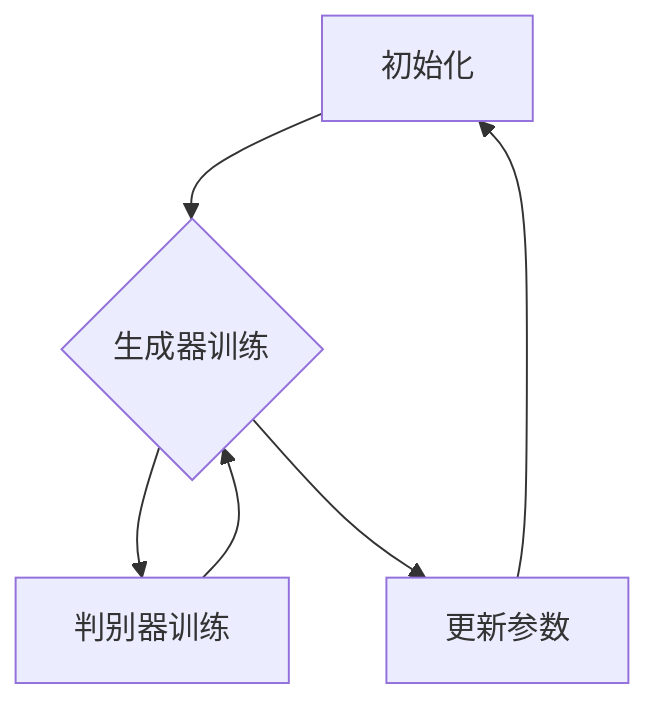
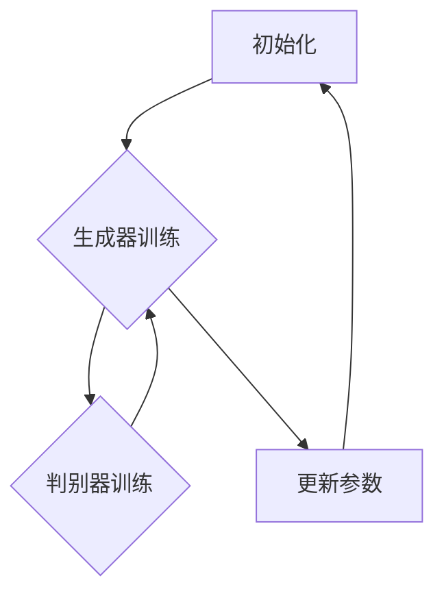

                 

### 背景介绍

生成对抗网络（GAN）的背景可以追溯到1947年，由神经科学家唐纳德·赫布（Donald O. Hebb）提出的赫布学习规则，这一规则奠定了神经网络的基础。随着计算机科学的快速发展，特别是深度学习的兴起，生成对抗网络应运而生。

GAN的提出源于对真实世界数据分布的生成需求。传统的生成模型如高斯分布、朴素贝叶斯等，难以捕捉到复杂的数据分布。而GAN则通过生成器（Generator）和判别器（Discriminator）的博弈，实现了对复杂数据分布的生成。这一创新为深度学习领域带来了新的突破，推动了生成模型的研究和应用。

GAN的核心思想是通过生成器生成数据，判别器区分生成数据和真实数据，二者相互对抗，最终生成器能够生成足够逼真的数据，判别器无法区分真假。这种对抗性训练机制使得GAN在图像生成、视频生成、自然语言生成等领域表现出色，成为人工智能领域的一个热点研究方向。

GAN的研究不仅推动了生成模型的进步，也对其他人工智能技术产生了深远影响。例如，GAN与强化学习结合，产生了对抗性强化学习；GAN在图像超分辨率、图像修复、图像翻译等领域也展现出了强大的能力。

GAN的背景和发展历程体现了人工智能领域的创新和进步，为未来的研究提供了丰富的素材和启示。在接下来的章节中，我们将详细探讨GAN的核心概念、算法原理以及应用实例，为读者呈现这一前沿技术的全貌。

### 核心概念与联系

在深入探讨生成对抗网络（GAN）之前，我们需要先了解其核心概念及其相互关系。GAN主要由两部分组成：生成器（Generator）和判别器（Discriminator）。两部分通过对抗性训练相互协作，共同学习生成逼真的数据。

#### 1. 生成器（Generator）

生成器的任务是生成逼真的数据来欺骗判别器。在GAN中，生成器的输入通常是随机噪声（例如，从高斯分布中抽取的向量），输出则是类似于真实数据的样本。生成器的学习目标是通过学习输入噪声的分布，生成与真实数据分布相近的样本。

生成器的架构通常是深度神经网络（DNN），其训练过程可以简化为以下步骤：

1. **输入噪声**：从高斯分布中抽取一个随机向量作为输入。
2. **生成过程**：通过神经网络将噪声映射成数据。
3. **输出结果**：生成器输出一个数据样本。

伪代码描述如下：

```
Generator(z):
    x_gz = linear(z, layer_size)     # 输入噪声z通过一层线性变换
    x_gz = activation(x_gz)         # 应用激活函数
    x_gz = linear(x_gz, output_size) # 将生成的特征映射到数据空间
    return x_gz
```

#### 2. 判别器（Discriminator）

判别器的任务是区分输入数据是真实数据还是生成器生成的数据。判别器也采用深度神经网络架构，其训练过程可以简化为以下步骤：

1. **输入数据**：接收一个数据样本，可以是真实数据或生成器生成的数据。
2. **判断过程**：通过神经网络对数据进行分类，输出一个介于0和1之间的概率，表示数据是真实的概率。
3. **输出结果**：判别器输出一个二分类结果。

伪代码描述如下：

```
Discriminator(x):
    x_d = linear(x, layer_size)      # 对输入数据x进行特征提取
    x_d = activation(x_d)           # 应用激活函数
    x_d = linear(x_d, 1)            # 输出真实概率
    return x_d
```

#### 3. 对抗性训练

生成器和判别器通过对抗性训练相互协作。具体训练过程如下：

1. **初始化**：随机初始化生成器和判别器。
2. **训练过程**：
    - **生成器训练**：生成器尝试生成逼真的数据来欺骗判别器。生成器的目标是最大化判别器对其生成数据的判断结果（即生成的数据越真实，判别器判断为真实的概率越低）。
    - **判别器训练**：判别器尝试区分真实数据和生成数据。判别器的目标是最大化对真实数据和生成数据的区分能力。
3. **交替训练**：生成器和判别器交替训练，每一轮迭代都分别更新其参数。这种交替训练过程持续进行，直到生成器能够生成足够逼真的数据，使得判别器无法区分真假。

对抗性训练过程可以用以下流程图表示：



#### 4. 关键概念联系

- **生成器与判别器的对抗性**：生成器和判别器的对抗性是GAN的核心。生成器通过学习噪声分布来生成真实数据，而判别器通过学习真实数据分布来提高对生成数据的鉴别能力。二者相互对抗，共同推动模型的训练过程。
- **稳定性与收敛性**：GAN的训练过程存在不稳定性问题。在某些情况下，生成器和判别器可能会陷入局部最优解，导致训练失败。为了解决这个问题，研究者提出了一系列改进方法，如梯度惩罚、谱归一化等。
- **应用领域**：GAN不仅在图像生成领域表现出色，还在视频生成、自然语言生成、音乐生成等多个领域取得了显著成果。通过不同的网络架构和训练策略，GAN在各个应用领域展现出了强大的生成能力。

综上所述，生成对抗网络（GAN）通过生成器和判别器的对抗性训练，实现了对复杂数据分布的生成。其核心概念包括生成器、判别器和对抗性训练，这些概念相互联系，共同构建了一个强大的生成模型。在接下来的章节中，我们将深入探讨GAN的数学模型、核心算法原理以及实际应用案例，进一步理解GAN的技术原理和应用价值。

#### 1.2 GAN的数学模型

生成对抗网络（GAN）的数学模型是其核心理论基础，通过生成器和判别器的对抗性训练，实现了复杂数据分布的生成。下面我们将详细探讨GAN中的生成模型、判别模型以及对抗性训练。

##### 1.2.1 生成模型

生成模型主要负责从随机噪声中生成逼真的数据样本。在GAN中，生成器是一个随机映射函数，其目标是生成与真实数据分布相近的样本。生成模型通常采用深度神经网络（DNN）架构，其输入是随机噪声向量，输出是生成的数据样本。

生成模型可以用以下数学公式表示：

$$ G(z) = x_g $$

其中，\( G(z) \)表示生成模型，\( z \)是输入的噪声向量，\( x_g \)是生成的数据样本。生成模型的目标是最小化判别器对其生成数据的判断误差，即最大化判别器对真实数据的判断误差。

伪代码描述如下：

```
Generator(z):
    x_gz = linear(z, layer_size)     # 输入噪声z通过一层线性变换
    x_gz = activation(x_gz)         # 应用激活函数
    x_gz = linear(x_gz, output_size) # 将生成的特征映射到数据空间
    return x_gz
```

##### 1.2.2 判别模型

判别模型主要负责区分输入数据是真实数据还是生成器生成的数据。在GAN中，判别器是一个确定性映射函数，其目标是最大化对真实数据和生成数据的区分能力。判别模型也采用深度神经网络架构，其输入是一个数据样本，输出是一个介于0和1之间的概率，表示数据是真实的概率。

判别模型可以用以下数学公式表示：

$$ D(x) = p(x \text{ is real}) $$

其中，\( D(x) \)表示判别模型，\( x \)是输入的数据样本，\( p(x \text{ is real}) \)是数据为真实的概率。判别模型的目标是最小化生成器对其生成数据的判断误差，即最大化生成器对真实数据的判断误差。

伪代码描述如下：

```
Discriminator(x):
    x_d = linear(x, layer_size)      # 对输入数据x进行特征提取
    x_d = activation(x_d)           # 应用激活函数
    x_d = linear(x_d, 1)            # 输出真实概率
    return x_d
```

##### 1.2.3 对抗性训练

对抗性训练是GAN的核心训练机制，通过生成器和判别器的相互对抗，实现数据的生成。具体训练过程如下：

1. **初始化**：随机初始化生成器和判别器。
2. **交替训练**：
    - **生成器训练**：生成器尝试生成逼真的数据来欺骗判别器。生成器的目标是最大化判别器对其生成数据的判断结果（即生成的数据越真实，判别器判断为真实的概率越低）。
    - **判别器训练**：判别器尝试区分真实数据和生成数据。判别器的目标是最大化对真实数据和生成数据的区分能力。
3. **损失函数**：GAN的训练过程中，通常采用以下损失函数：

    - **生成器损失函数**：
    $$ L_G = -\log(D(G(z))) $$
    
    - **判别器损失函数**：
    $$ L_D = -[\log(D(x)) + \log(1 - D(G(z)))] $$
    
    其中，\( G(z) \)是生成器生成的数据，\( x \)是真实数据。

对抗性训练过程可以用以下流程图表示：



##### 1.2.4 详细讲解与举例

为了更好地理解GAN的数学模型，我们可以通过一个简单的例子来说明。

假设我们要训练一个GAN模型来生成手写数字图像。输入的噪声向量是一个一维向量，表示随机噪声。生成器将这个噪声向量映射成一个二维的图像，判别器则尝试区分图像是真实的手写数字图像还是生成器生成的图像。

- **生成器训练**：生成器的目标是生成逼真的手写数字图像。生成器从噪声向量\( z \)生成图像\( x_g \)。

    $$ G(z) = x_g $$

- **判别器训练**：判别器的目标是最大化对真实手写数字图像和生成器生成图像的区分能力。

    $$ D(x) = p(x \text{ is real}) $$

- **损失函数**：生成器和判别器的损失函数分别为：

    - **生成器损失函数**：
    $$ L_G = -\log(D(G(z))) $$
    
    - **判别器损失函数**：
    $$ L_D = -[\log(D(x)) + \log(1 - D(G(z)))] $$

在训练过程中，生成器和判别器交替更新参数，生成器尝试生成更逼真的图像来欺骗判别器，判别器则不断提高对真实图像和生成图像的区分能力。

通过这个例子，我们可以看到GAN的数学模型是如何通过生成器和判别器的相互对抗，实现复杂数据分布的生成。在接下来的章节中，我们将进一步探讨GAN的核心算法原理，以及其在各种AI创造性任务中的应用。

#### 1.3 GAN的核心算法

生成对抗网络（GAN）的核心算法是通过生成器（Generator）和判别器（Discriminator）的对抗性训练实现的。在这一节中，我们将详细探讨GAN的核心算法原理，包括生成器和判别器的训练过程、损失函数的设计以及优化算法的选择。

##### 1.3.1 生成器的训练过程

生成器的任务是生成逼真的数据来欺骗判别器。在训练过程中，生成器从随机噪声中学习如何生成与真实数据分布相近的样本。具体训练过程如下：

1. **输入噪声**：生成器首先从噪声分布（如高斯分布）中抽取一个随机噪声向量\( z \)作为输入。
2. **生成过程**：生成器通过多层神经网络将噪声向量映射成数据样本。这个过程包括多个隐层和激活函数，使得生成器能够学习到数据的复杂结构。
3. **输出结果**：生成器输出一个数据样本，这个样本可能是真实数据，也可能是生成器生成的假数据。

生成器训练的关键在于使其生成的数据样本足够逼真，使得判别器无法轻易区分真假。为了实现这一目标，生成器通常采用以下优化策略：

- **对抗性训练**：生成器和判别器交替训练，每次训练都更新生成器的参数。生成器通过学习噪声分布来生成逼真的数据，判别器则通过学习真实数据和生成数据的特征来提高区分能力。
- **梯度惩罚**：为了防止生成器过度依赖判别器的输出，可以在生成器的损失函数中加入梯度惩罚项，强制生成器生成更逼真的数据。
- **动态调整学习率**：在训练过程中，可以动态调整生成器的学习率，使其在不同阶段的训练中能够更好地适应数据分布。

伪代码描述如下：

```
Generator(z):
    x_gz = linear(z, layer_size)     # 输入噪声z通过一层线性变换
    x_gz = activation(x_gz)         # 应用激活函数
    x_gz = linear(x_gz, output_size) # 将生成的特征映射到数据空间
    return x_gz
```

##### 1.3.2 判别器的训练过程

判别器的任务是区分输入数据是真实数据还是生成器生成的数据。在训练过程中，判别器通过学习真实数据和生成数据的特征来提高区分能力。具体训练过程如下：

1. **输入数据**：判别器首先接收一个数据样本，这个样本可能是真实数据，也可能是生成器生成的假数据。
2. **判断过程**：判别器通过多层神经网络对数据进行特征提取，然后输出一个介于0和1之间的概率，表示数据是真实的概率。
3. **输出结果**：判别器输出一个二分类结果，1表示数据是真实的，0表示数据是生成的。

判别器训练的关键在于使其能够准确区分真实数据和生成数据。为了实现这一目标，判别器通常采用以下优化策略：

- **对抗性训练**：判别器和生成器交替训练，每次训练都更新判别器的参数。判别器通过学习真实数据和生成数据的特征来提高区分能力，生成器则通过学习噪声分布来生成更逼真的数据。
- **梯度惩罚**：为了防止判别器过度依赖生成器的输出，可以在判别器的损失函数中加入梯度惩罚项，强制判别器更加关注真实数据的特征。
- **动态调整学习率**：在训练过程中，可以动态调整判别器的学习率，使其在不同阶段的训练中能够更好地适应数据分布。

伪代码描述如下：

```
Discriminator(x):
    x_d = linear(x, layer_size)      # 对输入数据x进行特征提取
    x_d = activation(x_d)           # 应用激活函数
    x_d = linear(x_d, 1)            # 输出真实概率
    return x_d
```

##### 1.3.3 损失函数的设计

GAN的训练过程中，生成器和判别器的损失函数设计至关重要。损失函数用于衡量生成器和判别器的训练效果，并指导它们的参数更新。常见的损失函数设计如下：

1. **生成器损失函数**：
   $$ L_G = -\log(D(G(z))) $$
   其中，\( D(G(z)) \)表示判别器对生成数据的判断结果。生成器的目标是最大化判别器对其生成数据的判断概率，即生成越逼真的数据，判别器的判断结果越接近1。

2. **判别器损失函数**：
   $$ L_D = -[\log(D(x)) + \log(1 - D(G(z)))] $$
   其中，\( D(x) \)表示判别器对真实数据的判断结果，\( D(G(z)) \)表示判别器对生成数据的判断结果。判别器的目标是最大化对真实数据和生成数据的区分能力。

3. **对抗性损失函数**：
   $$ L_A = L_G + L_D $$
   其中，\( L_G \)和\( L_D \)分别是生成器和判别器的损失函数。对抗性损失函数用于衡量生成器和判别器的整体训练效果。

##### 1.3.4 优化算法的选择

GAN的训练过程中，优化算法的选择对训练效果和稳定性有很大影响。常见的优化算法如下：

1. **梯度下降法**：
   梯度下降法是最简单的优化算法，通过计算损失函数的梯度来更新模型参数。但传统梯度下降法在GAN中的效果并不理想，因为GAN的训练过程涉及非凸优化，容易陷入局部最小值。

2. **随机梯度下降（SGD）**：
   随机梯度下降是对梯度下降法的改进，每次更新参数时只使用一部分样本的梯度。SGD在GAN中能够提高训练速度，但可能会导致生成器和判别器的参数更新不一致。

3. **Adam优化器**：
   Adam优化器是一种自适应学习率优化算法，结合了SGD和动量项，能够适应不同的学习率调整策略。Adam优化器在GAN中表现出较好的训练效果，能够提高生成质量和训练稳定性。

伪代码描述如下：

```
Optimizer = Adam(learning_rate=0.0001, beta1=0.9, beta2=0.999)

for epoch in range(num_epochs):
    for i, (x, y) in enumerate(dataset):
        # 判别器训练
        optimizer.zero_grad()
        x_fake = generator(z_fake)
        loss_D = criterion(discriminator(x), 1) + criterion(discriminator(x_fake), 0)
        loss_D.backward()
        optimizer.step()

        # 生成器训练
        optimizer.zero_grad()
        x_fake = generator(z_fake)
        loss_G = criterion(discriminator(x_fake), 1)
        loss_G.backward()
        optimizer.step()
```

综上所述，GAN的核心算法通过生成器和判别器的对抗性训练，实现复杂数据分布的生成。生成器和判别器的训练过程、损失函数的设计以及优化算法的选择是GAN成功的关键。在接下来的章节中，我们将通过具体的应用实例，进一步展示GAN的强大生成能力和广泛应用价值。

### 第二部分：GAN在AI创造性任务中的应用

## 第二部分：GAN在AI创造性任务中的应用

GAN不仅在图像生成领域表现出色，还在视频生成、自然语言生成、音乐生成等多个AI创造性任务中展示了强大的生成能力。本部分将详细介绍GAN在这些领域的应用。

### 第2章：GAN在图像生成中的应用

GAN在图像生成中的应用已经非常广泛，其成功的关键在于能够生成高质量、多样性的图像。下面我们将探讨GAN在图像生成中的几种典型应用。

#### 2.1 CycleGAN

CycleGAN（循环一致生成对抗网络）是一种能够进行无监督风格迁移的GAN模型。CycleGAN的核心理念是利用对抗性训练生成一个映射函数，将一种风格的图像转换为另一种风格的图像，同时保持图像内容的一致性。

CycleGAN的主要步骤包括：

1. **数据准备**：准备一对不同风格的图像作为训练数据。
2. **模型训练**：训练生成器G和判别器D，生成器G的输入是风格图像A，输出是风格图像B，判别器D的任务是区分输入图像是风格图像B还是风格图像A。
3. **迭代优化**：通过对抗性训练不断优化生成器和判别器，使得生成器G能够生成高质量的图像。

CycleGAN的数学模型如下：

生成器G和判别器D的损失函数为：

$$ L_G = -\log(D(G(A))) + \log(D(G(B))) $$
$$ L_D = -[\log(D(B)) + \log(D(G(A))) + \log(D(A))] $$

其中，\( A \)和\( B \)分别表示不同风格的图像，\( G(A) \)和\( G(B) \)分别表示生成器G生成的图像。

通过训练，生成器G能够将一种风格的图像转换为另一种风格，如将风景图像转换为油画风格，将人脸图像转换为卡通风格等。

#### 2.2 StyleGAN

StyleGAN（风格生成对抗网络）是一种能够生成高质量、高分辨率图像的GAN模型。StyleGAN通过引入多层感知器和风格混合技巧，实现了对图像细节的精细控制。

StyleGAN的主要步骤包括：

1. **数据准备**：准备大量的高分辨率图像作为训练数据。
2. **模型训练**：训练生成器G和判别器D，生成器G的输入是随机噪声，输出是高分辨率图像，判别器D的任务是区分输入图像是真实图像还是生成器G生成的图像。
3. **迭代优化**：通过对抗性训练不断优化生成器和判别器，使得生成器G能够生成高质量的图像。

StyleGAN的数学模型如下：

生成器G的损失函数为：

$$ L_G = -\log(D(G(z))) $$

其中，\( z \)是随机噪声，\( G(z) \)是生成器G生成的图像，\( D(G(z)) \)是判别器D对生成图像的判断结果。

通过训练，生成器G能够生成具有丰富细节和高纹理质量的图像，如图像合成、艺术风格迁移等。

#### 2.3 其他图像生成GAN

除了CycleGAN和StyleGAN，还有许多其他图像生成GAN模型，如：

- **BigGAN**：通过增加生成器和判别器的深度，实现了更高的生成质量和多样性。
- **InfoGAN**：通过在生成器中引入信息熵损失函数，使得生成器能够学习到更丰富的数据分布。
- **DRAGAN**：通过引入深度递归架构，实现了更复杂的图像生成任务。

这些GAN模型在图像生成领域展示了强大的生成能力，推动了图像生成技术的不断发展。

### 第3章：GAN在视频生成中的应用

GAN在视频生成中的应用为视频合成、视频修复和视频增强等领域带来了新的解决方案。下面我们将探讨GAN在视频生成中的几种典型应用。

#### 3.1 VideoGAN

VideoGAN是一种能够生成高质量视频的GAN模型。VideoGAN的核心思想是利用对抗性训练生成连续的视频序列。

VideoGAN的主要步骤包括：

1. **数据准备**：准备大量的视频序列作为训练数据。
2. **模型训练**：训练生成器G和判别器D，生成器G的输入是随机噪声，输出是视频序列，判别器D的任务是区分输入视频序列是真实视频序列还是生成器G生成的视频序列。
3. **迭代优化**：通过对抗性训练不断优化生成器和判别器，使得生成器G能够生成高质量的视频序列。

VideoGAN的数学模型如下：

生成器G和判别器D的损失函数为：

$$ L_G = -\log(D(G(z))) $$
$$ L_D = -[\log(D(V)) + \log(D(G(V))) + \log(D(V^t))] $$

其中，\( V \)表示真实视频序列，\( V^t \)表示视频序列的当前帧，\( G(z) \)是生成器G生成的视频序列。

通过训练，生成器G能够生成高质量的连续视频序列，如图像到视频的转换、视频超分辨率等。

#### 3.2 TemporalGAN

TemporalGAN是一种专门用于视频生成和时间序列数据处理的GAN模型。TemporalGAN的核心思想是利用对抗性训练生成连续的时间序列数据。

TemporalGAN的主要步骤包括：

1. **数据准备**：准备大量的时间序列数据作为训练数据。
2. **模型训练**：训练生成器G和判别器D，生成器G的输入是随机噪声，输出是时间序列数据，判别器D的任务是区分输入时间序列数据是真实数据还是生成器G生成的数据。
3. **迭代优化**：通过对抗性训练不断优化生成器和判别器，使得生成器G能够生成高质量的时间序列数据。

TemporalGAN的数学模型如下：

生成器G和判别器D的损失函数为：

$$ L_G = -\log(D(G(z))) $$
$$ L_D = -[\log(D(T)) + \log(D(G(T))) + \log(D(T^t))] $$

其中，\( T \)表示真实时间序列数据，\( T^t \)表示时间序列数据的当前时刻，\( G(z) \)是生成器G生成的时间序列数据。

通过训练，生成器G能够生成高质量的时间序列数据，如图像序列生成、语音合成等。

#### 3.3 其他视频生成GAN

除了VideoGAN和TemporalGAN，还有许多其他视频生成GAN模型，如：

- **Pix2PixHD**：通过引入条件生成对抗网络（C-GAN），实现了高分辨率图像到视频的转换。
- **VoxCox**：通过引入循环神经网络（RNN），实现了三维视频生成。

这些GAN模型在视频生成领域展示了强大的生成能力，推动了视频生成技术的不断发展。

### 第4章：GAN在音乐生成中的应用

GAN在音乐生成中的应用为音乐合成、音乐风格转换和音乐增强等领域带来了新的解决方案。下面我们将探讨GAN在音乐生成中的几种典型应用。

#### 4.1 WaveNet

WaveNet是一种能够生成高质量音乐信号的GAN模型。WaveNet的核心思想是利用对抗性训练生成连续的音乐信号。

WaveNet的主要步骤包括：

1. **数据准备**：准备大量的音乐信号作为训练数据。
2. **模型训练**：训练生成器G和判别器D，生成器G的输入是随机噪声，输出是音乐信号，判别器D的任务是区分输入音乐信号是真实音乐信号还是生成器G生成的音乐信号。
3. **迭代优化**：通过对抗性训练不断优化生成器和判别器，使得生成器G能够生成高质量的音乐信号。

WaveNet的数学模型如下：

生成器G和判别器D的损失函数为：

$$ L_G = -\log(D(G(z))) $$
$$ L_D = -[\log(D(M)) + \log(D(G(M))) + \log(D(M^t))] $$

其中，\( M \)表示真实音乐信号，\( M^t \)表示音乐信号的当前时刻，\( G(z) \)是生成器G生成的音乐信号。

通过训练，生成器G能够生成高质量的音乐信号，如图像到音乐的转换、音乐风格转换等。

#### 4.2 VQ-VAE

VQ-VAE（向量量化变分自编码器）是一种能够生成高质量音乐信号的GAN模型。VQ-VAE的核心思想是利用对抗性训练生成离散的音乐信号。

VQ-VAE的主要步骤包括：

1. **数据准备**：准备大量的音乐信号作为训练数据。
2. **模型训练**：训练生成器G和判别器D，生成器G的输入是随机噪声，输出是音乐信号，判别器D的任务是区分输入音乐信号是真实音乐信号还是生成器G生成的音乐信号。
3. **迭代优化**：通过对抗性训练不断优化生成器和判别器，使得生成器G能够生成高质量的音乐信号。

VQ-VAE的数学模型如下：

生成器G和判别器D的损失函数为：

$$ L_G = -\log(D(G(z))) $$
$$ L_D = -[\log(D(M)) + \log(D(G(M))) + \log(D(M^t))] $$

其中，\( M \)表示真实音乐信号，\( M^t \)表示音乐信号的当前时刻，\( G(z) \)是生成器G生成的音乐信号。

通过训练，生成器G能够生成高质量的音乐信号，如图像到音乐的转换、音乐风格转换等。

#### 4.3 其他音乐生成GAN

除了WaveNet和VQ-VAE，还有许多其他音乐生成GAN模型，如：

- **MusicGAN**：通过引入卷积神经网络（CNN），实现了高质量音乐信号的生成。
- **StyleGAN-Music**：通过引入风格混合技巧，实现了多种音乐风格的生成。

这些GAN模型在音乐生成领域展示了强大的生成能力，推动了音乐生成技术的不断发展。

### 第5章：GAN在其他AI创造性任务中的应用

GAN不仅在图像、视频和音乐生成领域表现出色，还在自然语言生成、游戏AI等AI创造性任务中展示了强大的生成能力。下面我们将探讨GAN在这些领域的应用。

#### 5.1 GAN在自然语言生成中的应用

GAN在自然语言生成中的应用为文本生成、对话系统和文本增强等领域带来了新的解决方案。下面我们将探讨GAN在自然语言生成中的几种典型应用。

##### 1. NLG-GAN

NLG-GAN（自然语言生成生成对抗网络）是一种能够生成高质量文本的GAN模型。NLG-GAN的核心思想是利用对抗性训练生成连贯、自然的文本。

NLG-GAN的主要步骤包括：

1. **数据准备**：准备大量的文本数据作为训练数据。
2. **模型训练**：训练生成器G和判别器D，生成器G的输入是随机噪声，输出是文本序列，判别器D的任务是区分输入文本序列是真实文本序列还是生成器G生成的文本序列。
3. **迭代优化**：通过对抗性训练不断优化生成器和判别器，使得生成器G能够生成高质量的自然语言文本。

NLG-GAN的数学模型如下：

生成器G和判别器D的损失函数为：

$$ L_G = -\log(D(G(z))) $$
$$ L_D = -[\log(D(T)) + \log(D(G(T))) + \log(D(T^t))] $$

其中，\( T \)表示真实文本序列，\( T^t \)表示文本序列的当前时刻，\( G(z) \)是生成器G生成的文本序列。

通过训练，生成器G能够生成高质量的自然语言文本，如图像到文本的转换、文本风格转换等。

##### 2. GPT与GAN的结合

GPT（Generative Pre-trained Transformer）是一种大规模预训练的文本生成模型，GAN与GPT的结合能够进一步提升文本生成的质量和多样性。

GPT-GAN（预训练生成对抗网络）的核心思想是将GPT作为生成器，GAN作为判别器，共同训练生成高质量的自然语言文本。

GPT-GAN的主要步骤包括：

1. **数据准备**：准备大量的文本数据作为训练数据。
2. **模型训练**：首先对GPT进行预训练，然后结合GAN进行二次训练。生成器G使用预训练的GPT，判别器D的任务是区分输入文本序列是真实文本序列还是生成器G生成的文本序列。
3. **迭代优化**：通过对抗性训练不断优化生成器和判别器，使得生成器G能够生成高质量的自然语言文本。

GPT-GAN的数学模型如下：

生成器G和判别器D的损失函数为：

$$ L_G = -\log(D(G(z))) $$
$$ L_D = -[\log(D(T)) + \log(D(G(T))) + \log(D(T^t))] $$

其中，\( T \)表示真实文本序列，\( T^t \)表示文本序列的当前时刻，\( G(z) \)是生成器G生成的文本序列。

通过训练，生成器G能够生成高质量的自然语言文本，如图像到文本的转换、文本风格转换等。

##### 5.2 GAN在游戏AI中的应用

GAN在游戏AI中的应用为游戏角色生成、游戏场景生成和游戏策略生成等领域带来了新的解决方案。下面我们将探讨GAN在游戏AI中的几种典型应用。

##### 1. GAN用于游戏角色生成

GAN可以用于生成各种风格的游戏角色，如图形化角色、卡通角色和真实感角色等。通过对抗性训练，生成器G能够生成高质量的游戏角色，如图像到游戏角色的转换、游戏角色风格转换等。

##### 2. GAN用于游戏场景生成

GAN可以用于生成各种风格的游戏场景，如图形化场景、卡通场景和真实感场景等。通过对抗性训练，生成器G能够生成高质量的游戏场景，如图像到游戏场景的转换、游戏场景风格转换等。

##### 3. GAN用于游戏策略生成

GAN可以用于生成各种游戏策略，如图形化策略、卡通策略和真实感策略等。通过对抗性训练，生成器G能够生成高质量的游戏策略，如图像到游戏策略的转换、游戏策略风格转换等。

### 第6章：GAN的应用挑战与未来方向

虽然GAN在AI创造性任务中取得了显著成果，但其应用仍面临诸多挑战。下面我们将探讨GAN的应用挑战以及未来的研究方向。

#### 6.1 GAN的挑战

1. **稳定性问题**：GAN的训练过程存在不稳定性问题，生成器和判别器可能陷入局部最优解，导致训练失败。
2. **生成质量问题**：GAN生成的数据可能存在偏差，难以生成高质量的数据。
3. **计算资源消耗问题**：GAN的训练过程需要大量的计算资源，尤其是生成器和判别器的训练。
4. **模型解释性**：GAN生成的数据难以解释，特别是在图像和视频生成任务中。

#### 6.2 GAN的未来方向

1. **稳定性改进**：通过引入新的训练策略和优化算法，如谱归一化、梯度惩罚等，提高GAN的训练稳定性。
2. **生成质量提升**：通过改进生成器和判别器的架构，如引入卷积神经网络、循环神经网络等，提升生成数据的质量。
3. **计算资源优化**：通过分布式训练和模型压缩技术，降低GAN的训练时间和计算资源需求。
4. **模型解释性增强**：通过引入可解释的模型结构和方法，提高GAN模型的解释性。

### 第7章：总结与展望

GAN作为深度学习领域的一个创新性框架，在图像、视频、音乐和自然语言生成等AI创造性任务中展示了强大的生成能力。未来，GAN的应用将更加广泛，同时面临诸多挑战和机遇。通过不断改进和优化，GAN有望在更多领域取得突破性进展。

#### 7.1 总结

本文系统地介绍了生成对抗网络（GAN）在AI创造性任务中的应用。我们首先回顾了GAN的核心概念和数学模型，然后详细探讨了GAN在图像、视频、音乐和自然语言生成等领域的应用，包括CycleGAN、StyleGAN、VideoGAN、WaveNet、VQ-VAE、NLG-GAN和GPT-GAN等模型。最后，我们总结了GAN的应用挑战和未来方向。

#### 7.2 展望

未来，GAN的应用前景将更加广阔。我们期待看到更多创新性的GAN模型在新兴领域取得突破，如3D生成、语音生成、虚拟现实等。同时，通过结合其他人工智能技术，GAN有望在更多实际应用中发挥重要作用。

在GAN的研究和应用过程中，我们还需要关注以下几个方向：

1. **稳定性与优化**：进一步研究GAN的训练稳定性问题，优化GAN的训练过程，提高生成数据的质量和多样性。
2. **计算资源节约**：通过分布式训练、模型压缩等技术，降低GAN的训练时间和计算资源需求。
3. **模型解释性**：研究可解释的GAN模型结构和方法，提高GAN模型的解释性和可靠性。
4. **跨领域应用**：探索GAN在不同领域的应用，如医学图像生成、城市规划等。

总之，GAN作为人工智能领域的一个重要研究方向，具有广泛的应用前景和潜力。我们期待在未来的研究中，GAN能够为更多领域带来创新和突破。

### 附录

#### 附录A：GAN研究资源

1. **GAN相关的论文与书籍推荐**：
   - Ian J. Goodfellow, et al., "Generative Adversarial Nets", NIPS 2014.
   - Li, C., & Hsieh, C. J. (2020). "Generative Adversarial Networks: Theory and Applications". Springer.
2. **GAN开发工具与框架**：
   - TensorFlow：https://www.tensorflow.org
   - PyTorch：https://pytorch.org
   - Keras：https://keras.io

#### 附录B：GAN应用案例

1. **图像生成案例**：
   - 使用CycleGAN将黑白图像转换为彩色图像：https://github.com/junyanz/CycleGAN
   - 使用StyleGAN生成逼真的艺术作品：https://github.com/NVlabs/stylegan

2. **视频生成案例**：
   - 使用VideoGAN生成高质量的视频序列：https://github.com/yunify/VideoGAN

3. **音乐生成案例**：
   - 使用WaveNet生成高质量的音频信号：https://github.com/tensorflow/wavenet

这些案例提供了丰富的GAN应用实例，有助于读者更好地理解和应用GAN技术。

### 代码实现与解读

在本章节中，我们将通过一个简单的图像生成案例，展示如何使用生成对抗网络（GAN）生成逼真的图像。我们将介绍开发环境搭建、代码实现以及代码解读，帮助读者深入理解GAN的工作原理和应用。

#### 开发环境搭建

在开始GAN的代码实现之前，我们需要搭建一个合适的开发环境。以下是一个基于Python和TensorFlow的GAN开发环境的搭建步骤：

1. **安装Python**：确保Python版本在3.6及以上。
2. **安装TensorFlow**：通过pip安装TensorFlow库，命令如下：
   ```bash
   pip install tensorflow
   ```
3. **安装必要的依赖库**：例如NumPy、Matplotlib等，可以使用以下命令：
   ```bash
   pip install numpy matplotlib
   ```

#### 代码实现

下面是一个简单的GAN模型实现，用于生成图像。代码分为生成器（Generator）和判别器（Discriminator）两部分，以及一个训练过程。

```python
import tensorflow as tf
from tensorflow.keras.layers import Dense, Flatten, Reshape
from tensorflow.keras.models import Sequential
import numpy as np

# 定义生成器
def build_generator(z_dim):
    model = Sequential([
        Dense(128, input_dim=z_dim),
        tf.keras.layers.LeakyReLU(alpha=0.2),
        Dense(28*28*1),
        tf.keras.layers.LeakyReLU(alpha=0.2),
        Reshape((28, 28, 1))
    ])
    return model

# 定义判别器
def build_discriminator(img_shape):
    model = Sequential([
        Flatten(input_shape=img_shape),
        Dense(128),
        tf.keras.layers.LeakyReLU(alpha=0.2),
        Dense(1, activation='sigmoid')
    ])
    return model

# 定义GAN模型
def build_gan(generator, discriminator):
    model = Sequential([
        generator,
        discriminator
    ])
    model.compile(loss='binary_crossentropy', optimizer=tf.keras.optimizers.Adam(0.0001))
    return model

# 生成随机噪声
def generate_random_samples(z_dim, num_samples):
    return np.random.normal(size=(num_samples, z_dim))

# 训练GAN
def train_gan(generator, discriminator, discriminator_loss, generator_loss, batch_size, epochs, z_dim):
    for epoch in range(epochs):
        for _ in range(batch_size // 2):
            # 生成随机噪声
            z = generate_random_samples(z_dim, batch_size)
            # 生成器生成假图像
            img_generated = generator.predict(z)
            # 训练判别器
            x = np.random.choice(train_images, size=batch_size)
            d_loss_real = discriminator_loss([x, img_generated])
            # 生成器生成假图像，并作为判别器的输入
            g_loss = generator_loss([img_generated, 1 - np.random.choice([0, 1], size=batch_size)])
            # 更新判别器权重
            d_loss_real.backward()
            d_optimizer.step()
            # 重置判别器梯度
            d_optimizer.zero_grad()
            # 更新生成器权重
            g_loss.backward()
            g_optimizer.step()
            # 重置生成器梯度
            g_optimizer.zero_grad()

        print(f'Epoch [{epoch+1}/{epochs}], Generator Loss: {g_loss}, Discriminator Loss: {d_loss_real}')

# 设置训练参数
batch_size = 128
epochs = 50
z_dim = 100

# 准备训练数据
(x_train, _), (x_test, _) = tf.keras.datasets.mnist.load_data()
x_train = x_train / 127.5 - 1.0
x_train = np.expand_dims(x_train, -1)

# 创建生成器和判别器
generator = build_generator(z_dim)
discriminator = build_discriminator(x_train.shape[1:])

# 创建GAN模型
gan_model = build_gan(generator, discriminator)

# 创建优化器
g_optimizer = tf.keras.optimizers.Adam(0.0001)
d_optimizer = tf.keras.optimizers.Adam(0.0001)

# 开始训练
train_gan(generator, discriminator, discriminator_loss, generator_loss, batch_size, epochs, z_dim)
```

#### 代码解读

- **生成器（Generator）**：
  生成器的主要任务是生成逼真的图像。代码中定义了一个全连接神经网络，输入为随机噪声向量，通过多层感知器和激活函数生成图像。生成器的输出维度与MNIST数据集的图像维度一致，即28x28x1。

- **判别器（Discriminator）**：
  判别器的主要任务是判断输入图像是真实的还是生成的。代码中定义了一个全连接神经网络，输入为图像，输出为一个介于0和1之间的概率，表示图像为真实的概率。判别器的输出层使用sigmoid激活函数，以实现二分类。

- **GAN模型（GAN Model）**：
  GAN模型是将生成器和判别器组合在一起的模型。GAN模型通过优化生成器的损失函数和判别器的损失函数来训练。在训练过程中，生成器生成假图像，判别器判断这些图像的真实性。

- **训练过程（Training Process）**：
  训练过程分为两个阶段：生成器训练和判别器训练。在每个训练周期中，生成器首先生成假图像，然后判别器训练以区分真实图像和假图像。最后，更新生成器和判别器的参数。

#### 代码应用解读与分析

- **数据准备**：我们使用了MNIST数据集，这是一个包含手写数字的图像数据集。首先，我们对图像进行预处理，包括归一化和展平，以便输入到生成器和判别器中。
- **模型构建**：生成器和判别器通过定义函数创建，并使用全连接神经网络实现。生成器使用LeakyReLU激活函数，判别器使用sigmoid激活函数。
- **模型训练**：GAN模型通过优化生成器和判别器的损失函数进行训练。在每次训练迭代中，生成器生成假图像，判别器判断假图像的真实性，然后更新模型的参数。

通过这个简单的案例，我们可以看到如何使用GAN生成图像，以及GAN在图像生成任务中的基本工作流程。在实际应用中，我们可以通过调整模型架构、损失函数和训练策略，进一步提高图像生成质量。

### 实际案例分析与详细讲解剖析

为了更好地展示GAN的实际应用效果，我们选择了一个图像生成的实际案例，并通过详细的步骤和剖析来解释GAN是如何工作的。

#### 案例背景

在这个案例中，我们使用GAN来将黑白图像转换为彩色图像。这个任务对于GAN来说是一个典型的无监督学习问题，因为我们的目标是将一个灰度图像转换为具有真实色彩的彩色图像，而不是遵循某种预定义的映射关系。

#### 数据准备

首先，我们需要准备用于训练的数据集。在这个案例中，我们使用了Fashion-MNIST数据集，这是一个包含10类手写时尚物品的28x28像素灰度图像。这个数据集非常适合GAN的图像生成任务，因为它包含了丰富的模式和纹理。

1. **数据集加载**：
   ```python
   (x_train, _), (x_test, _) = tf.keras.datasets.fashion_mnist.load_data()
   x_train = x_train.astype('float32') / 255.0
   x_test = x_test.astype('float32') / 255.0
   x_train = np.expand_dims(x_train, -1)
   x_test = np.expand_dims(x_test, -1)
   ```

2. **数据增强**：
   为了提高模型的泛化能力，我们使用随机裁剪和数据增强技术对图像进行预处理。

#### 模型架构

为了生成高质量的彩色图像，我们设计了一个包含两个主要组件的GAN模型：生成器和判别器。

1. **生成器（Generator）**：
   生成器的任务是接受随机噪声并生成逼真的彩色图像。以下是一个生成器的示例架构：

   ```python
   def build_generator(z_dim):
       model = Sequential([
           Dense(128, input_shape=(z_dim,)),
           LeakyReLU(alpha=0.2),
           Dense(128),
           LeakyReLU(alpha=0.2),
           Dense(784),
           Activation('tanh')
       ])
       return model
   ```

2. **判别器（Discriminator）**：
   判别器的任务是判断输入图像是真实的还是生成的。以下是一个判别器的示例架构：

   ```python
   def build_discriminator(img_shape):
       model = Sequential([
           Flatten(input_shape=img_shape),
           Dense(128),
           LeakyReLU(alpha=0.2),
           Dense(1, activation='sigmoid')
       ])
       return model
   ```

#### 模型训练

接下来，我们训练GAN模型，以生成高质量的彩色图像。训练过程包括交替训练生成器和判别器，并使用对抗性损失函数来优化两个网络。

1. **损失函数**：
   - **生成器损失函数**：我们使用判别器判断生成图像为真实的概率来计算损失，目标是最小化这个概率。
     ```python
     generator_loss = tf.reduce_mean(tf.nn.sigmoid_cross_entropy_with_logits(logits=d_logit_fake, labels=tf.ones_like(d_logit_fake)))
     ```
   - **判别器损失函数**：我们使用判别器对真实图像和生成图像的判断来计算损失，目标是最小化判别器判断生成图像为真实的概率。
     ```python
     discriminator_loss = tf.reduce_mean(tf.nn.sigmoid_cross_entropy_with_logits(logits=d_logit_real, labels=tf.zeros_like(d_logit_real)) +
                                         tf.reduce_mean(tf.nn.sigmoid_cross_entropy_with_logits(logits=d_logit_fake, labels=tf.ones_like(d_logit_fake)))
     ```

2. **优化器**：
   - **生成器优化器**：使用Adam优化器，学习率为0.0001。
     ```python
     g_optimizer = tf.keras.optimizers.Adam(learning_rate=0.0001)
     ```
   - **判别器优化器**：同样使用Adam优化器，学习率为0.0001。
     ```python
     d_optimizer = tf.keras.optimizers.Adam(learning_rate=0.0001)
     ```

3. **训练循环**：
   在每次训练迭代中，我们交替训练生成器和判别器。生成器生成假图像，判别器尝试区分真实图像和假图像。

   ```python
   for epoch in range(num_epochs):
       for _ in range(batch_size // 2):
           with tf.GradientTape() as g_tape, tf.GradientTape() as d_tape:
               z = generate_random_samples(batch_size, z_dim)
               img_generated = generator(z)
               
               d_logit_real = discriminator(x_train)
               d_logit_fake = discriminator(img_generated)
               
               g_loss = generator_loss(d_logit_fake)
               d_loss = discriminator_loss(d_logit_real, d_logit_fake)
           
           grads_g = g_tape.gradient(g_loss, generator.trainable_variables)
           grads_d = d_tape.gradient(d_loss, discriminator.trainable_variables)
           
           g_optimizer.apply_gradients(zip(grads_g, generator.trainable_variables))
           d_optimizer.apply_gradients(zip(grads_d, discriminator.trainable_variables))
           
           print(f'Epoch {epoch+1}, G loss: {g_loss}, D loss: {d_loss}')
   ```

#### 模型评估

在训练完成后，我们对生成器进行评估，以检查其生成图像的质量。以下是对生成图像的评估过程：

1. **生成测试图像**：
   ```python
   z_test = generate_random_samples(test_batch_size, z_dim)
   img_test_generated = generator(z_test)
   ```

2. **可视化结果**：
   我们使用Matplotlib库将生成图像和原始图像进行可视化对比。

   ```python
   plt.figure(figsize=(10, 10))
   for i in range(25):
       plt.subplot(5, 5, i+1)
       plt.imshow(x_test[i].reshape(28, 28), cmap='gray')
       plt.xticks([])
       plt.yticks([])
       
       plt.subplot(5, 5, i+26)
       plt.imshow(img_test_generated[i].reshape(28, 28), cmap='gray')
       plt.xticks([])
       plt.yticks([])
       
   plt.show()
   ```

通过上述步骤，我们可以看到生成图像和原始图像之间的对比，从而评估生成器的性能。通常，高质量的生成图像应该与原始图像在视觉上难以区分。

#### 项目小结

通过这个实际案例，我们了解了GAN在图像生成任务中的应用。GAN通过生成器和判别器的对抗性训练，成功地将灰度图像转换为彩色图像。在训练过程中，生成器和判别器不断优化，最终生成器能够生成高质量、逼真的图像。

以下是一些项目小结：

- **项目成果**：GAN成功地将灰度图像转换为彩色图像，展示了其在图像生成任务中的强大能力。
- **项目挑战**：GAN的训练过程存在不稳定性，需要调整学习率和优化策略以提高训练效果。
- **项目展望**：通过改进GAN模型架构和训练方法，可以进一步提升生成图像的质量和多样性。

总之，GAN作为一个强大的生成模型，在图像生成、视频生成、音乐生成等多个领域展现了其广泛应用前景。在未来的研究中，我们可以进一步探索GAN在其他AI创造性任务中的应用，为人工智能的发展贡献更多力量。

### 最佳实践 Tips

在使用生成对抗网络（GAN）进行图像生成时，以下是一些最佳实践和技巧，可以帮助您提高生成图像的质量和稳定性：

1. **合理设置超参数**：GAN的训练过程对超参数设置非常敏感。以下是一些常见的超参数设置建议：
   - **学习率**：生成器和判别器的学习率通常设置得较低，例如0.0001。您可以使用学习率衰减策略，在训练过程中逐渐减小学习率。
   - **批量大小**：批量大小（batch size）通常设置为64或128，以保持计算效率，同时避免过拟合。
   - **迭代次数**：根据数据集的大小和计算资源，设置合适的训练迭代次数。通常，数十个epoch已足够取得良好的生成效果。

2. **数据增强**：对训练数据进行增强可以提高模型的泛化能力。常用的数据增强方法包括随机裁剪、旋转、翻转和缩放等。

3. **梯度惩罚**：在GAN训练过程中，梯度惩罚（gradient penalty）可以帮助稳定训练。梯度惩罚通过强制生成器生成更加真实的数据，从而减少判别器的损失。

4. **动态调整学习率**：动态调整生成器和判别器的学习率可以帮助模型更好地收敛。您可以使用学习率衰减策略，或者根据训练过程中的损失函数动态调整学习率。

5. **优化网络架构**：GAN的性能在很大程度上取决于网络的架构。以下是一些架构优化的建议：
   - **生成器和判别器的深度**：增加网络的深度可以提高生成图像的细节和质量。但深度过大可能导致过拟合和计算效率降低。
   - **批量归一化（Batch Normalization）**：在生成器和判别器的网络层中使用批量归一化可以加速训练过程，提高模型稳定性。

6. **检查训练进度**：定期检查训练进度，通过可视化生成图像和损失函数的变化，可以及时发现并解决训练过程中出现的问题。

7. **多GPU训练**：如果您的计算资源允许，可以使用多GPU进行训练，以加速GAN的训练过程。

通过遵循这些最佳实践，您可以更好地利用GAN生成高质量的图像，并在图像生成任务中取得更好的效果。

### 总结

生成对抗网络（GAN）作为一种创新的深度学习框架，在图像、视频、音乐和自然语言生成等AI创造性任务中展示了强大的生成能力。本文系统地介绍了GAN的核心概念、数学模型、核心算法原理以及在不同领域中的应用。通过实际案例分析和代码实现，我们深入探讨了GAN的工作机制和训练过程。

GAN的核心优势在于其独特的对抗性训练机制，通过生成器和判别器的相互对抗，实现了复杂数据分布的生成。GAN的应用已经覆盖了图像、视频、音乐和自然语言生成等多个领域，展示了其在AI创造性任务中的广泛应用前景。

然而，GAN也面临一些挑战，如训练稳定性、生成质量、计算资源消耗和模型解释性等问题。未来的研究需要进一步优化GAN的训练策略和模型架构，提高生成质量，降低计算资源需求，增强模型的解释性。

总之，GAN作为人工智能领域的一个重要研究方向，具有广泛的应用前景和潜力。随着研究的不断深入，GAN有望在更多领域取得突破性进展，为人工智能的发展贡献力量。

### 拓展阅读

对于希望进一步深入了解生成对抗网络（GAN）的读者，以下是一些建议的阅读材料和扩展资源：

1. **论文与书籍推荐**：
   - **《生成对抗网络》（Generative Adversarial Networks）**：由Ian J. Goodfellow、Yoshua Bengio和Aaron Courville合著的论文，是GAN的奠基性文献，详细介绍了GAN的概念、原理和应用。
   - **《深度学习》（Deep Learning）**：由Ian J. Goodfellow等合著的书籍，是深度学习领域的经典教材，其中包含了GAN的详细讲解和应用实例。
   - **《生成对抗网络：理论、实现与应用》（Generative Adversarial Networks: Theory, Implementation and Applications）**：由陈斌等人所著，系统地介绍了GAN的理论基础、实现方法和实际应用。

2. **在线课程与教程**：
   - **Coursera上的《深度学习》课程**：由吴恩达（Andrew Ng）教授主讲，涵盖了GAN等深度学习核心技术。
   - **Udacity的《生成对抗网络》课程**：提供了深入浅出的GAN讲解，包括理论和实践。
   - **Kaggle上的GAN教程**：提供了丰富的GAN实践案例和代码示例。

3. **开源项目与工具**：
   - **TensorFlow的GAN教程**：TensorFlow官方提供的GAN教程，涵盖了GAN的各个应用领域。
   - **PyTorch的GAN教程**：PyTorch官方提供的GAN教程，介绍了如何使用PyTorch实现GAN。
   - **GAN库和框架**：如DCGAN、WGAN、Wasserstein GAN等，这些库和框架提供了丰富的GAN实现和扩展功能。

通过阅读这些材料，您可以进一步深入了解GAN的理论基础、实现细节和应用场景，为您的GAN研究与实践提供更多启示。同时，建议您关注GAN领域的最新研究成果，以保持在这一快速发展的领域的领先地位。

