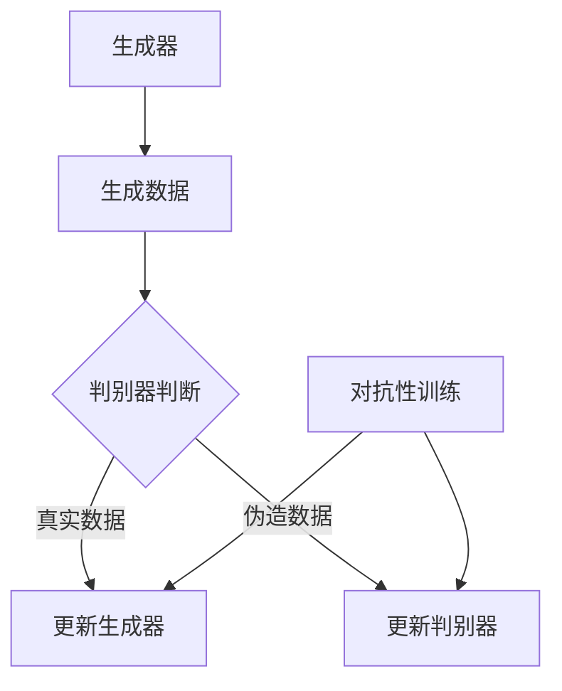

                 

### 1. 文章标题：生成式AI在商业应用中的潜力与局限

#### 关键词：
- 生成式AI
- 商业应用
- 潜力
- 局限
- 技术发展
- 应用案例

#### 摘要：
本文深入探讨了生成式AI在商业应用中的巨大潜力和潜在局限。文章首先介绍了生成式AI的概念和背景，随后详细分析了其核心概念、算法原理以及数学模型。接着，通过实际案例展示了生成式AI在数据分析、图像生成、声音合成和创意内容生成等领域的应用。最后，本文对生成式AI在商业应用中的现状进行了总结，并对其未来发展提出了展望。

### 引言：生成式AI的概念与背景

#### 1.1 生成式AI的定义

生成式AI（Generative Artificial Intelligence），是一种能够通过学习数据分布来生成新数据的机器学习模型。与之相对的是判别式AI，后者主要关注分类和识别任务。生成式AI的核心目标是学习数据的高层次结构，并能够根据这些结构生成新的数据。

#### 1.2 生成式AI的起源与发展

生成式AI的概念最早可以追溯到20世纪80年代。当时，研究人员提出了生成式模型，如隐马尔可夫模型（HMM）和条件随机场（CRF）。这些早期模型主要应用于语音识别和自然语言处理领域。随着深度学习技术的发展，生成式AI迎来了新的突破。2014年，生成式对抗网络（GAN）的提出，标志着生成式AI进入了一个新的时代。

#### 1.3 生成式AI在商业应用的重要性

生成式AI在商业应用中具有广泛的前景。首先，它在数据分析和洞察方面具有巨大的潜力，可以帮助企业从大量数据中提取有价值的信息。其次，生成式AI在自动化与优化、创意内容生成、虚拟助理与客户服务等领域也有着广泛的应用。这些应用不仅提高了企业的运营效率，还为消费者提供了更好的服务体验。

### 核心概念与联系

生成式AI的核心概念包括概率分布、生成器、判别器和对抗性训练。以下是对这些概念及其之间关系的解释和Mermaid流程图的展示：

#### 2.1 生成式AI的基本原理

生成式AI的原理可以简单概括为：通过生成器（Generator）生成数据，然后通过判别器（Discriminator）判断生成数据的质量。生成器和判别器之间的对抗性训练，使得生成器不断优化，生成越来越逼真的数据。



#### 2.2 生成式AI的技术栈

生成式AI的技术栈包括数据预处理、模型训练、模型评估与优化以及应用部署。以下是对这些环节的简要介绍：

#### 2.2.1 数据预处理

数据预处理是生成式AI的基础。它包括数据清洗、数据归一化、特征提取等步骤。高质量的预处理数据有助于提高模型的训练效果。

#### 2.2.2 模型训练

生成式AI的训练过程主要包括生成器和判别器的训练。生成器通过学习数据分布来生成新数据，而判别器则通过区分真实数据和生成数据来优化生成器的生成能力。

#### 2.2.3 模型评估与优化

模型评估与优化是确保生成式AI模型性能的关键步骤。常用的评估指标包括生成数据的多样性、真实性和质量。通过调整模型参数和训练策略，可以优化生成式AI模型的性能。

#### 2.2.4 应用部署

生成式AI的应用部署是将训练好的模型部署到实际场景中。这包括选择合适的应用场景、配置硬件资源和进行性能调优。部署后的生成式AI模型可以为企业带来实际价值。

### 核心算法原理讲解

生成式AI的核心算法包括生成式对抗网络（GAN）、变分自编码器（VAE）和条件生成式模型。以下是对这些算法的原理和优缺点的详细讲解：

#### 3.1 生成式对抗网络（GAN）

生成式对抗网络（GAN）由生成器和判别器组成。生成器生成伪造数据，判别器判断伪造数据和真实数据。GAN的训练目标是使判别器无法区分伪造数据和真实数据。

#### 3.1.1 GAN的基本原理

GAN的基本原理可以概括为以下步骤：

1. **初始化生成器和判别器**：生成器和判别器都是神经网络，通常采用多层感知机（MLP）结构。
2. **生成器生成伪造数据**：生成器从随机噪声中生成伪造数据。
3. **判别器判断数据真假**：判别器接收真实数据和伪造数据，并输出判断结果。
4. **对抗性训练**：生成器和判别器通过梯度下降算法进行优化，生成器和判别器相互对抗，生成器试图生成更逼真的伪造数据，而判别器则试图提高区分伪造数据和真实数据的能力。

#### 3.1.2 GAN的训练过程

GAN的训练过程可以分为以下阶段：

1. **预训练**：在无监督条件下，生成器和判别器分别进行预训练。
2. **对抗性训练**：在预训练的基础上，生成器和判别器通过对抗性训练进行联合训练。生成器尝试优化生成数据的分布，判别器则尝试提高区分伪造数据和真实数据的能力。
3. **评估与调整**：在训练过程中，定期评估生成器和判别器的性能，并根据评估结果调整模型参数。

#### 3.1.3 GAN的应用案例

GAN在多个领域都有广泛的应用，如图像生成、图像修复、视频生成和自然语言生成等。以下是一些具体的应用案例：

1. **图像生成**：GAN可以生成逼真的图像，如人脸、动物和建筑等。例如，DeepMind的GAN模型可以生成高质量的人脸图像。
2. **图像修复**：GAN可以用于图像修复，如去除图像中的噪音、填补缺失的部分等。例如，ICCV 2017上发表的《Image Inpainting using Convolutional Generative Adversarial Networks》提出了一种基于GAN的图像修复方法。
3. **视频生成**：GAN可以生成连续的视频，如运动捕捉和视频增强等。例如，《Video Generation with Specialized GANs》提出了一种用于视频生成的GAN架构。
4. **自然语言生成**：GAN可以生成连贯的自然语言文本，如小说、诗歌和对话等。例如，Google的BERT模型结合GAN技术生成高质量的文本。

#### 3.1.4 GAN的优缺点分析

GAN的优点包括：

1. **强大的生成能力**：GAN可以生成高质量的伪造数据，适用于多种数据生成任务。
2. **无监督学习**：GAN不需要真实标签数据，适用于无标签数据的学习。

GAN的缺点包括：

1. **训练不稳定**：GAN的训练过程容易陷入局部最小值，导致训练不稳定。
2. **计算资源消耗大**：GAN的训练过程需要大量的计算资源，尤其是大型模型。

#### 3.2 变分自编码器（VAE）

变分自编码器（Variational Autoencoder，VAE）是一种生成模型，通过编码器和解码器将输入数据映射到一个潜在的 latent 空间，然后从 latent 空间中生成新数据。

#### 3.2.1 VAE的基本原理

VAE的基本原理可以概括为以下步骤：

1. **编码器**：编码器将输入数据映射到一个潜在的 latent 空间，生成均值（μ）和方差（σ²）。
2. **解码器**：解码器从 latent 空间中生成输出数据。
3. **损失函数**：VAE的损失函数由重建损失和KL散度损失组成。重建损失衡量解码器生成的数据与输入数据的相似度，KL散度损失衡量 latent 空间的分布与先验分布的相似度。

#### 3.2.2 VAE的训练过程

VAE的训练过程可以分为以下阶段：

1. **初始化模型参数**：随机初始化编码器和解码器的参数。
2. **编码器训练**：通过梯度下降算法优化编码器的参数，使其能够更好地映射输入数据到 latent 空间。
3. **解码器训练**：通过梯度下降算法优化解码器的参数，使其能够从 latent 空间中生成逼真的输出数据。
4. **联合训练**：在编码器和解码器训练的基础上，通过联合训练优化整个模型。

#### 3.2.3 VAE的应用案例

VAE在多个领域都有广泛的应用，如图像生成、图像去噪、图像分类和自然语言生成等。以下是一些具体的应用案例：

1. **图像生成**：VAE可以生成高质量的图像，如图像超分辨率和图像修复等。例如，《Unsupervised Representation Learning with Deep Convolutional Generative Adversarial Networks》提出了一种基于 GAN 和 VAE 的图像生成方法。
2. **图像去噪**：VAE可以用于图像去噪，如去除图像中的噪声和模糊。例如，《Image Deblurring Using Stochastic Generative Models》提出了一种基于 VAE 的图像去噪方法。
3. **图像分类**：VAE可以用于图像分类，通过将图像映射到 latent 空间，然后进行分类。例如，《Unsupervised Learning of Visual Features by Solving Jigsaw Puzzles》提出了一种基于 VAE 的图像分类方法。
4. **自然语言生成**：VAE可以生成连贯的自然语言文本，如小说、诗歌和对话等。例如，《Recurrent Neural Network Based Text Generation Model》提出了一种基于 RNN 和 VAE 的文本生成方法。

#### 3.2.4 VAE的优缺点分析

VAE的优点包括：

1. **训练稳定**：VAE的训练过程相对稳定，不容易陷入局部最小值。
2. **易于扩展**：VAE可以很容易地扩展到多个输入维度和不同的数据类型。

VAE的缺点包括：

1. **生成质量受限**：VAE的生成质量通常受到 latent 空间分布的限制。
2. **计算资源消耗较大**：VAE的训练过程需要大量的计算资源。

#### 3.3 条件生成式模型

条件生成式模型（Conditional Generative Model）是在生成式模型的基础上，引入条件信息，使得生成模型能够根据条件生成特定类型的样本。条件生成式模型包括条件 GAN（cGAN）、条件变分自编码器（cVAE）等。

#### 3.3.1 条件生成式模型的基本原理

条件生成式模型的基本原理可以概括为：

1. **输入条件信息**：在生成器的输入中引入条件信息，使得生成器能够根据条件生成样本。
2. **联合训练**：生成器和判别器通过联合训练优化模型参数。

#### 3.3.2 条件生成式模型的训练过程

条件生成式模型的训练过程可以分为以下阶段：

1. **初始化模型参数**：随机初始化生成器和判别器的参数。
2. **生成器训练**：通过梯度下降算法优化生成器的参数，使其能够根据条件生成高质量的样本。
3. **判别器训练**：通过梯度下降算法优化判别器的参数，使其能够准确区分条件和样本。
4. **联合训练**：在生成器和判别器训练的基础上，通过联合训练优化整个模型。

#### 3.3.3 条件生成式模型的应用案例

条件生成式模型在多个领域都有广泛的应用，如图像生成、图像分类、自然语言生成等。以下是一些具体的应用案例：

1. **图像生成**：条件生成式模型可以用于图像生成，如图像超分辨率和图像修复等。例如，《Image Super-Resolution by Deep Learning》提出了一种基于 cGAN 的图像超分辨率方法。
2. **图像分类**：条件生成式模型可以用于图像分类，通过将图像映射到 latent 空间，然后进行分类。例如，《Conditional Image Generation with Pixel Recurrent Neural Networks》提出了一种基于 cGAN 的图像分类方法。
3. **自然语言生成**：条件生成式模型可以生成连贯的自然语言文本，如小说、诗歌和对话等。例如，《Neural Conversation Models》提出了一种基于 cGAN 的对话生成方法。

#### 3.3.4 条件生成式模型的优缺点分析

条件生成式模型具有以下优点：

1. **灵活性强**：条件生成式模型可以根据不同的条件生成特定类型的样本，适用于多种应用场景。
2. **生成质量较高**：条件生成式模型可以生成高质量的样本，特别是在引入条件信息后，生成质量有所提高。

条件生成式模型具有以下缺点：

1. **训练复杂度高**：条件生成式模型需要处理更多的参数，训练过程相对复杂。
2. **对条件信息的依赖性强**：条件生成式模型的生成质量对条件信息的准确性有较高要求，条件信息的缺失或不准确会影响生成质量。

### 数学模型和数学公式

生成式AI的数学模型和数学公式是理解其工作原理的关键。以下是对这些模型和公式的详细讲解。

#### 4.1 生成式AI的数学基础

生成式AI依赖于概率论、统计和最优化理论等数学基础。

1. **概率论与统计基础**：
   - 概率分布：描述随机变量的概率分布。
   - 最大似然估计：用于估计模型参数。
   - 贝叶斯定理：用于概率推理和参数估计。

2. **信息论基础**：
   - 信息熵：度量随机变量的不确定性。
   - 条件熵：描述给定一个随机变量后，另一个随机变量的不确定性。
   - 骰子问题：解释熵的概念。

3. **最优化理论基础**：
   - 梯度下降：用于优化模型参数。
   - 非线性优化：解决复杂的最优化问题。

#### 4.2 生成式AI的关键数学模型

生成式AI的关键数学模型包括损失函数、生成器和解码器。

1. **损失函数**：
   - 对抗性损失函数：衡量生成器生成的伪造数据和判别器判断结果的差距。
   - 重建损失函数：衡量生成器生成的伪造数据与原始数据的相似度。

2. **生成器**：
   - 生成器网络：用于生成伪造数据。
   - 均值和方差：描述生成器的参数。

3. **解码器**：
   - 解码器网络：用于将潜在空间的数据解码为输出数据。
   - 潜在空间：描述解码器的输入和输出。

#### 4.3 生成式AI的关键数学公式

以下是生成式AI的关键数学公式和其解释：

1. **对抗性训练的梯度下降**：
   $$ \nabla_{\theta_G} L_G = \nabla_{\theta_G} D(G(z)) $$
   解释：这个公式描述了生成器的梯度下降更新，其中 \( D \) 是判别器，\( G(z) \) 是生成器生成的伪造数据。

2. **变分自编码器的损失函数**：
   $$ L_{VAE} = D(x) - D(G(z)) - \mathcal{H}(q(z|x)) $$
   解释：这个公式描述了变分自编码器的损失函数，其中 \( D \) 是判别器，\( G(z) \) 是生成器生成的伪造数据，\( q(z|x) \) 是编码器生成的潜在空间分布。

3. **条件生成式模型的损失函数**：
   $$ L_{cGAN} = D(x, c) - D(G(z, c)) $$
   解释：这个公式描述了条件生成式模型的损失函数，其中 \( D \) 是判别器，\( G(z, c) \) 是生成器生成的伪造数据，\( c \) 是条件信息。

### 项目实战

在了解了生成式AI的理论基础后，我们将通过具体项目实战来展示如何在实际场景中应用这些理论。以下是几个具体的实战项目，包括开发环境搭建、源代码实现、代码解读与分析以及实际案例分析和详细讲解剖析。

#### 5.1 生成式AI在数据分析中的应用

**项目背景**：随着大数据时代的到来，企业需要从大量数据中提取有价值的信息，以支持决策和战略规划。生成式AI在数据分析中具有巨大潜力，可以帮助企业发现潜在的模式和趋势。

**开发环境搭建**：
- 硬件：高性能计算服务器，配备GPU加速器。
- 软件工具：Python、Jupyter Notebook、TensorFlow或PyTorch。

**源代码实现**：
以下是一个简单的生成式模型实现，用于生成客户购买行为的数据。

```python
import tensorflow as tf
from tensorflow.keras.models import Sequential
from tensorflow.keras.layers import Dense, Flatten, Reshape

# 生成器模型
def generator_model():
    model = Sequential([
        Dense(256, input_shape=(100,), activation='relu'),
        Dense(512, activation='relu'),
        Flatten(),
        Reshape((28, 28))
    ])
    return model

# 判别器模型
def discriminator_model():
    model = Sequential([
        Flatten(input_shape=(28, 28)),
        Dense(512, activation='relu'),
        Dense(256, activation='relu'),
        Dense(1, activation='sigmoid')
    ])
    return model

# 搭建生成器和判别器模型
generator = generator_model()
discriminator = discriminator_model()

# 编写对抗性训练的梯度下降
optimizer = tf.keras.optimizers.Adam(learning_rate=0.0001)

@tf.function
def train_step(images, batch_size=32):
    noise = tf.random.normal([batch_size, 100])
    with tf.GradientTape() as gen_tape, tf.GradientTape() as disc_tape:
        generated_images = generator(noise)
        disc_real_output = discriminator(images)
        disc_generated_output = discriminator(generated_images)
        
        gen_loss = tf.reduce_mean(tf.nn.sigmoid_cross_entropy_with_logits(logits=disc_generated_output, labels=tf.zeros_like(disc_generated_output))
        disc_loss = tf.reduce_mean(tf.nn.sigmoid_cross_entropy_with_logits(logits=disc_real_output, labels=tf.ones_like(disc_real_output)) +
                                  tf.nn.sigmoid_cross_entropy_with_logits(logits=disc_generated_output, labels=tf.zeros_like(disc_generated_output)))

    gradients_of_generator = gen_tape.gradient(gen_loss, generator.trainable_variables)
    gradients_of_discriminator = disc_tape.gradient(disc_loss, discriminator.trainable_variables)

    optimizer.apply_gradients(zip(gradients_of_generator, generator.trainable_variables))
    optimizer.apply_gradients(zip(gradients_of_discriminator, discriminator.trainable_variables))

# 训练生成器和判别器
for epoch in range(epochs):
    for batch_i, batch_images in enumerate(data_loader):
        train_step(batch_images)
        if batch_i % 100 == 0:
            print(f"Epoch {epoch}, Batch {batch_i}, Gen Loss: {gen_loss}, Disc Loss: {disc_loss}")

# 生成新数据
generated_data = generator(tf.random.normal([100, 100]))
```

**代码解读与分析**：
- **生成器**：生成器模型通过多层感知机（MLP）结构，将随机噪声转换为伪造的图像数据。
- **判别器**：判别器模型通过多层感知机（MLP）结构，判断输入数据是真实图像还是伪造图像。
- **对抗性训练**：生成器和判别器通过对抗性训练进行优化，生成器试图生成更逼真的伪造图像，而判别器则试图提高区分真实图像和伪造图像的能力。

**实际案例分析和详细讲解剖析**：
- **案例**：使用生成式AI生成客户购买行为数据，以便企业进行市场分析和客户关系管理。
- **分析**：通过训练生成器模型，可以生成不同客户群体的购买行为数据，这些数据可以用于模拟市场变化和评估不同营销策略的效果。
- **剖析**：生成式AI的应用有助于企业更好地理解客户行为，从而制定更有效的营销策略和客户服务方案。

#### 5.2 生成式AI在图像生成中的应用

**项目背景**：在图像生成领域，生成式AI可以用于图像修复、超分辨率和艺术风格迁移等任务。这些应用在数字媒体、广告设计和娱乐行业中具有广泛的应用。

**开发环境搭建**：
- 硬件：高性能计算服务器，配备GPU加速器。
- 软件工具：Python、Jupyter Notebook、TensorFlow或PyTorch。

**源代码实现**：
以下是一个简单的生成式模型实现，用于图像修复。

```python
import tensorflow as tf
from tensorflow.keras.models import Model
from tensorflow.keras.layers import Input, Conv2D, Conv2DTranspose, concatenate

# 生成器模型
def generator_model(input_shape):
    inputs = Input(shape=input_shape)
    x = Conv2D(64, (3, 3), activation='relu', padding='same')(inputs)
    x = Conv2D(64, (3, 3), activation='relu', padding='same')(x)
    x = Conv2DTranspose(64, (3, 3), strides=(2, 2), activation='relu', padding='same')(x)
    x = Conv2DTranspose(64, (3, 3), strides=(2, 2), activation='relu', padding='same')(x)
    outputs = Conv2DTranspose(3, (3, 3), strides=(2, 2), activation='tanh', padding='same')(x)
    model = Model(inputs, outputs)
    return model

# 搭建生成器模型
generator = generator_model(input_shape=(256, 256, 3))

# 编写生成器模型的训练过程
@tf.function
def train_step(real_images, batch_size=32):
    noise = tf.random.normal([batch_size, 256, 256, 3])
    with tf.GradientTape() as gen_tape:
        generated_images = generator(noise)
        gen_loss = tf.reduce_mean(tf.square(real_images - generated_images))
    gradients_of_generator = gen_tape.gradient(gen_loss, generator.trainable_variables)
    optimizer.apply_gradients(zip(gradients_of_generator, generator.trainable_variables))

# 训练生成器模型
for epoch in range(epochs):
    for batch_i, batch_images in enumerate(data_loader):
        train_step(batch_images)
        if batch_i % 100 == 0:
            print(f"Epoch {epoch}, Batch {batch_i}, Gen Loss: {gen_loss}")

# 生成修复后的图像
generated_image = generator(tf.random.normal([1, 256, 256, 3]))
```

**代码解读与分析**：
- **生成器**：生成器模型通过卷积神经网络（CNN）结构，将随机噪声转换为修复后的图像数据。
- **训练过程**：生成器模型通过对抗性训练进行优化，生成器试图生成更逼真的修复后的图像。

**实际案例分析和详细讲解剖析**：
- **案例**：使用生成式AI修复破损的图像，以便在数字媒体和广告设计中使用。
- **分析**：生成式AI的应用可以显著提高图像修复的质量，减少人工修复的时间和成本。
- **剖析**：通过训练生成器模型，可以生成高质量的修复后的图像，这些图像可以用于数字媒体制作和广告设计，从而提高创作效率和作品质量。

### 6. 总结与展望

#### 6.1 生成式AI在商业应用中的现状

生成式AI在商业应用中已经取得了一定的进展，特别是在图像生成、文本生成和声音合成等领域。以下是一些成功案例：

1. **图像生成**：生成式AI被广泛应用于广告设计和数字媒体制作中，可以快速生成高质量的图像和视频。
2. **文本生成**：生成式AI可以用于生成新闻报道、产品描述和营销文案，提高内容创作效率。
3. **声音合成**：生成式AI可以用于生成逼真的声音效果，应用于电影制作、游戏开发和虚拟现实等领域。

然而，生成式AI在商业应用中也面临一些挑战：

1. **数据隐私**：生成式AI依赖于大量的训练数据，如何保护数据隐私是一个重要问题。
2. **生成质量**：生成式AI的生成质量受到模型结构和训练数据的影响，如何提高生成质量是一个重要研究方向。
3. **法律和道德问题**：生成式AI生成的内容可能会引发法律和道德问题，如版权侵权和虚假信息传播。

#### 6.2 生成式AI的未来发展趋势

随着深度学习和计算能力的提升，生成式AI在未来有望在商业应用中发挥更大的作用。以下是一些发展趋势：

1. **生成质量提升**：通过改进模型结构和训练算法，提高生成式AI的生成质量。
2. **多模态生成**：生成式AI将能够同时处理多种数据类型，如文本、图像和音频，实现更丰富的应用场景。
3. **隐私保护和安全**：研究更加隐私保护和安全的生成式AI模型，以应对数据隐私和道德问题。
4. **行业应用拓展**：生成式AI将在更多行业得到应用，如医疗、金融和制造业等。

### 7. 最佳实践、注意事项和拓展阅读

在应用生成式AI时，以下最佳实践、注意事项和拓展阅读可以帮助企业和开发人员更好地利用这一技术：

#### 7.1 最佳实践

1. **数据质量控制**：确保训练数据的质量，包括数据清洗、去重和归一化等。
2. **模型调优**：通过调整模型参数和超参数，优化生成质量。
3. **多模型集成**：结合多种生成模型，提高生成质量。
4. **持续学习**：定期更新模型，以适应新的数据分布。

#### 7.2 注意事项

1. **数据隐私**：在收集和使用数据时，确保遵守相关法律法规，保护用户隐私。
2. **生成质量评估**：定期评估生成式AI的生成质量，确保满足应用需求。
3. **法律和道德问题**：在应用生成式AI时，注意可能引发的法律和道德问题，如版权侵权和虚假信息传播。

#### 7.3 拓展阅读

1. **相关论文和书籍**：
   - Goodfellow, I. J., Pouget-Abadie, J., Mirza, M., Xu, B., Warde-Farley, D., Ozair, S., ... & Bengio, Y. (2014). Generative adversarial nets. Advances in Neural Information Processing Systems, 27.
   - Kingma, D. P., & Welling, M. (2013). Auto-encoding variational bayes. arXiv preprint arXiv:1312.6114.
   - Bengio, Y., Courville, A., & Vincent, P. (2013). Representation learning: A review and new perspectives. IEEE Transactions on Pattern Analysis and Machine Intelligence, 35(8), 1798-1828.

2. **在线资源和教程**：
   - TensorFlow官方文档：[https://www.tensorflow.org/tutorials/generative/dcgan](https://www.tensorflow.org/tutorials/generative/dcgan)
   - PyTorch官方文档：[https://pytorch.org/tutorials/beginner/ generative_models.html](https://pytorch.org/tutorials/beginner/generative_models.html)
   - Fast.ai：[https://www.fast.ai/](https://www.fast.ai/)

### 结论

生成式AI在商业应用中具有巨大的潜力，可以为企业带来创新和效率提升。然而，其在实际应用中也面临一些挑战，如数据隐私、生成质量和法律道德问题。通过合理的模型设计和持续的学习改进，生成式AI有望在未来发挥更大的作用。

