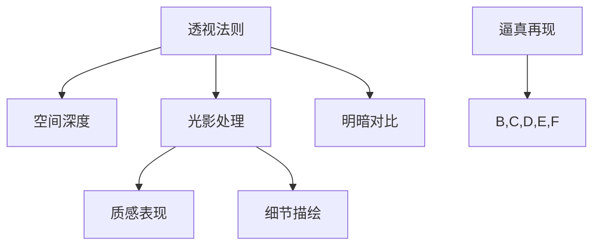
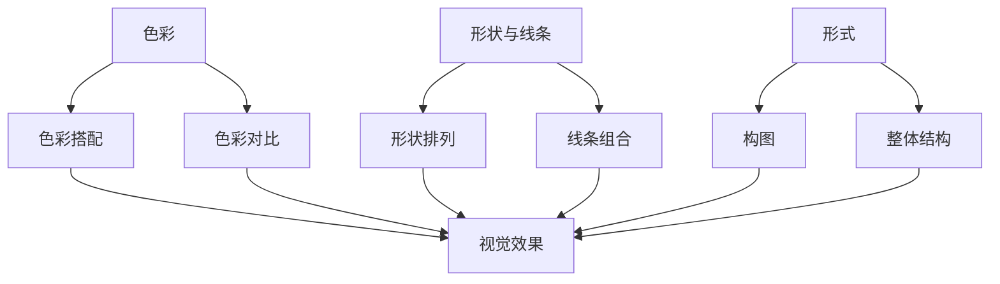
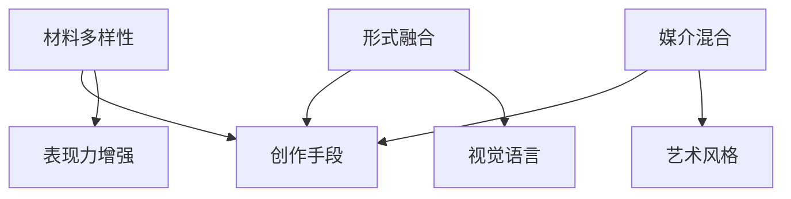

                 

### 1.1 书籍背景介绍

**艺术与生活的联系**

生活与艺术之间的关系是一种古老而深刻的主题，它横跨了历史和文化，成为人类文明发展的重要组成部分。生活不仅是艺术的源泉，也是艺术的归宿。艺术不仅反映生活，还常常启发我们对生活的理解和感悟。

在古代，艺术家们常常通过绘画、雕塑和诗歌来表达对生活的观察和感悟。文艺复兴时期，达芬奇和米开朗基罗等人通过对人体的细致观察和数学原理的应用，创作出了许多传世之作。在中国古代，文人画家们通过山水画和花鸟画来表现他们对自然和生活的热爱。现代艺术更是将这种联系推向了一个新的高度，艺术家们通过各种媒介和形式，探索生活的多样性和复杂性。

**创作的意义**

创作本身是一种表达和探索的方式，它能够帮助我们更好地理解和感受生活。创作不仅仅是艺术家的专利，每个人都有创作的潜力。通过创作，我们可以记录下生活中的点滴，表达内心的情感和思考，从而提升自我认知和情感体验。

创作还具有治疗和疗愈的作用。在面对生活中的困难和挫折时，通过艺术创作，我们可以找到情感的出口，释放内心的压力，从而获得心理上的平衡和恢复。此外，创作还能够培养我们的观察力和思考力，提高我们的创造力和想象力。

**书籍的目的**

《生活即创作：将日常转化为艺术作品》这本书旨在探讨生活与艺术之间的联系，并鼓励读者将日常生活中的点滴转化为艺术作品。本书将通过具体的实例和指导，帮助读者了解艺术创作的基本原理和方法，从而激发他们的创作热情，提升他们的艺术修养。

通过阅读这本书，读者可以：
- 深入理解艺术与生活的关系，认识到创作的重要性和价值。
- 学习艺术创作的基本技巧和方法，掌握创作的基本流程。
- 通过创作，表达内心的情感和思考，提升自我认知和情感体验。
- 发现生活中的美好，培养对生活的热爱和敬畏之心。

**书籍结构**

本书分为六个主要部分：

1. **引言**：介绍书籍的背景、目的和结构，以及如何阅读本书。
2. **生活艺术的视角**：探讨艺术与生活的联系，以及艺术创作的方法。
3. **艺术创作的准备**：介绍艺术工具和材料，以及艺术思维的培养。
4. **生活艺术作品创作**：详细讲解写实艺术、抽象艺术和综合艺术作品创作的流程和技巧。
5. **生活艺术作品展示与分享**：介绍艺术作品的展示平台、分享方法和评价标准。
6. **生活艺术的哲学**：探讨艺术与生活的关系，以及艺术创作的哲学意义。

通过本书的引导，读者将能够更好地理解艺术创作的过程，并在日常生活中发现和创造美，从而实现生活与艺术的完美融合。<!-- RIA -->### 1.2 书籍目标与结构概述

**书籍目标**

《生活即创作：将日常转化为艺术作品》旨在探索艺术与生活的紧密联系，揭示创作过程对提升生活品质的深远影响。本书的目标在于：
- 帮助读者建立对艺术创作的正确认知，理解创作不仅是专业艺术家的特权，也是每个人可以尝试和实践的日常生活活动。
- 激发读者的创作热情，鼓励他们通过艺术创作来发现生活的美好，表达个人情感和思想。
- 提供实用的创作技巧和指导，帮助读者在实际操作中提高艺术表现力和创造力。

**书籍结构概述**

为了实现上述目标，本书的结构精心设计，分为以下几个部分：

1. **引言**：介绍书籍的背景、目的和结构。通过引言，读者可以了解本书的主旨，以及如何有效地阅读和利用书中的内容。
2. **生活艺术的视角**：探讨艺术与生活的联系，引导读者思考艺术创作在日常生活中的意义和价值。
3. **艺术创作的准备**：详细讲解艺术创作所需的基础知识和准备工作，包括艺术工具、材料的介绍，以及艺术思维的培养。
4. **生活艺术作品创作**：通过具体实例，详细描述不同类型艺术作品的创作流程，包括写实艺术、抽象艺术和综合艺术。每个章节都将提供详细的创作步骤和技巧，帮助读者实践。
5. **生活艺术作品展示与分享**：介绍如何有效地展示和分享艺术作品，包括选择合适的展示平台、有效的分享方法和评价标准。
6. **生活艺术的哲学**：深入探讨艺术与生活的哲学意义，引导读者思考艺术创作背后的深层次问题，如艺术本质和创作价值。

通过这种结构安排，本书不仅提供了实用的技巧和指导，还通过哲学的视角，帮助读者从更深的层面理解艺术创作。这种多维度的探讨将有助于读者在实际创作过程中，更好地把握艺术与生活的关系，从而创造出更加丰富和有深度的艺术作品。<!-- RIA -->### 1.3 阅读指南

**阅读建议**

为了更好地吸收和理解书中的内容，以下是一些阅读建议：

- **逐步阅读**：本书内容丰富，涉及多个方面，建议读者按章节逐步阅读，每个章节结束后进行总结和回顾，以确保理解到位。
- **实践操作**：书中不仅提供理论指导，还包含大量实例和实践操作。建议读者在实际创作过程中尝试这些方法，亲身体验艺术创作的乐趣。
- **互动交流**：可以通过社交媒体、艺术社区等平台，与其他读者分享创作心得和经验，互相学习和启发。
- **持续反思**：艺术创作是一个不断探索和反思的过程。在创作过程中，建议读者不断反思自己的作品，思考艺术与生活的关系，以及创作给自己带来的启示。

**阅读工具**

- **笔记本**：建议使用笔记本记录自己的想法、灵感和创作过程中的细节，这有助于加深对内容的理解。
- **绘画工具**：如铅笔、颜料、画布等，用于实践创作。
- **数字工具**：如Photoshop、Illustrator等软件，可以用于数字艺术创作。
- **在线资源**：如YouTube、ArtStation等平台，可以获取更多的艺术作品和创作教程。

通过合理利用这些阅读工具，读者可以更好地理解和应用书中的知识，提升自己的艺术创作能力。<!-- RIA -->### 2.1 艺术的日常

**观察生活的艺术**

艺术不仅仅是展览馆里的作品，它也隐藏在生活的每一个细节中。观察生活的艺术，就是学会从日常生活中发现美，捕捉那些容易被忽略的瞬间。比如，清晨的阳光洒在窗台上，一片叶子在风中轻轻摇曳，这些日常景象都蕴含着丰富的艺术价值。

艺术家们常常通过细致入微的观察，捕捉生活中的美好瞬间。伦勃朗的画作《夜巡》就是一个很好的例子，这幅画看似简单，却通过光影和细节的精确表现，展现了普通市民的日常生活。在创作这幅画时，伦勃朗仔细观察了光线的变化，以及人物的表情和姿态，将这些细节融入到了作品中。

**感受日常之美**

感受日常之美，就是学会用心去体验生活中的点点滴滴。艺术创作不仅是视觉上的表现，更是情感上的共鸣。通过感受日常之美，我们可以更好地理解自己的内心世界，并通过艺术表达出来。

一个典型的例子是日本画家竹内栖鳳的作品。她的画作中常常出现日常生活中的物品，如一把扫帚、一扇门、一张桌子等。通过简洁而富有感染力的线条和色彩，她成功地捕捉到了这些物品背后的情感和故事。这些作品让观众感受到了日常生活的温馨和宁静，同时也引发了他们对生活细节的思考。

**艺术与生活的相互作用**

艺术与生活之间的相互作用是相辅相成的。艺术可以改变生活，让生活变得更加丰富多彩；而生活也可以激发艺术创作，为艺术家提供无尽的灵感。

美国抽象表现主义画家杰克逊·波洛克（Jackson Pollock）就是一个很好的例子。他的创作灵感大多来源于日常生活中的点滴，如雨滴、水流的轨迹，甚至是汽车的行驶轨迹。他通过将日常生活中的元素抽象化，创作出了具有强烈个人风格的作品。波洛克的作品不仅展现了艺术家的创造力，也反映了他对生活的独特理解和感悟。

**观察与创作的联系**

观察是创作的第一步，也是最重要的一步。通过观察，艺术家可以捕捉到生活中的美好瞬间，并从中获取灵感。这种观察不仅仅是用眼睛看，更是用心感受。只有真正用心去观察，才能发现生活中的细节之美。

例如，著名摄影师史蒂夫·麦凯瑞（Steve McCurry）的作品《阿富汗少女》就是一个经典的例子。这幅照片中的女孩眼神坚定，充满了力量和决心。麦凯瑞通过长时间的观察和捕捉，将这个瞬间定格在了画面中，使观众感受到了女孩背后的故事和生活的艰辛。这幅照片不仅成为了摄影史上的经典之作，也引发了人们对阿富汗女孩和那个时代生活的思考。

总之，艺术的日常不仅仅是通过观察生活来获取灵感，更是通过感受日常之美来提升自己的艺术修养。通过这种相互作用，艺术家可以创作出更加真实、生动和有感染力的作品，让艺术与生活相互交融，共同创造出一个更加美好的世界。<!-- RIA -->### 2.2 艺术创作的方法

**从生活中提取灵感**

艺术创作往往来源于生活的点滴，艺术家们通过敏锐的观察和丰富的想象力，将日常生活中的元素转化为艺术作品。提取灵感的过程是一个充满创造性的活动，它需要艺术家对周围环境保持高度的敏感和好奇。

例如，梵高（Vincent van Gogh）的画作《向日葵》就是他对日常生活中花卉的观察和感悟。梵高通过反复描绘向日葵，将向日葵的美丽和生命的力量表现得淋漓尽致。在创作这幅画时，梵高不仅观察了向日葵的外观，还捕捉到了向日葵在阳光下的光影变化，以及它所传递的生命力和情感。

**创作技巧与实践**

艺术创作不仅需要灵感，还需要掌握一定的技巧。不同的艺术形式和媒介要求不同的技巧和方法。例如，在绘画中，掌握线条、色彩、构图等基本技巧是非常重要的。在雕塑中，对材料的选择和雕刻技巧有更高的要求。

以下是一些常见的艺术创作技巧：

- **素描**：素描是绘画的基础，通过简单的线条和阴影，艺术家可以捕捉到物体的形状和质感。练习素描有助于提高对形态和结构的理解。
- **色彩搭配**：色彩是绘画和艺术设计中的重要元素，掌握色彩的基本原理和搭配技巧，可以使作品更加生动和具有表现力。
- **构图**：构图是决定作品视觉效果的要素之一。合理的构图可以使画面更加平衡和有层次感，吸引观众的视线。
- **材料选择**：根据创作需求，选择合适的材料可以发挥出更好的艺术效果。例如，油画需要油画布和油画颜料，而雕塑则需要不同的雕刻工具和材料。

**实际案例解析**

为了更好地理解艺术创作的方法，我们可以通过一些经典的艺术作品来进行分析。以下是一些著名的艺术作品及其创作方法：

- **《星夜》**（The Starry Night）：这是荷兰画家文森特·梵高（Vincent van Gogh）的作品。这幅画以夸张的笔触和强烈的色彩对比，展现了夜晚星空的美丽和神秘。梵高通过运用旋涡状和点状笔触，创造出了星空旋转的效果，使观众仿佛置身于一个充满魔力的世界。

- **《草地上的午餐》**（Le déjeuner sur l'herbe）：这是法国画家皮埃尔-奥古斯特·雷诺阿（Pierre-Auguste Renoir）的作品。这幅画以鲜艳的色彩和轻松的构图，描绘了一幅户外野餐的场景。雷诺阿运用了鲜明的色彩对比和柔和的光影效果，使画面充满了生机和活力。

- **《大教堂》**（Notre-Dame de Paris）：这是法国雕塑家维克多·雨果（Victor Hugo）的作品，描述了巴黎圣母院大教堂的历史和建筑特点。雨果通过生动的叙事和细腻的描绘，展现了大教堂的壮丽和神秘。

通过这些作品，我们可以看到艺术家们是如何通过不同的创作方法和技巧，将生活中的元素转化为艺术作品的。这些作品不仅具有艺术价值，还传递了艺术家对生活的独特见解和感悟。

总之，艺术创作是一个需要不断学习和实践的过程。通过观察生活、掌握技巧和不断实践，艺术家们可以创作出更加优秀和有深度的作品。艺术创作不仅是一种表达，更是一种生活的态度和方式。<!-- RIA -->### 2.3 生活艺术的意义

**艺术如何丰富生活**

艺术对生活的丰富不仅仅体现在视觉和感官上，更在于它能够深刻地影响我们的情感和心理状态。通过艺术，我们可以感受到美、希望和爱，这些情感可以激发我们的内心世界，使生活变得更加丰富多彩。

首先，艺术作品往往能够引发深刻的情感共鸣。例如，一幅描绘自然景色的画作，可以让观者感受到大自然的壮丽和宁静，从而减轻日常生活中的压力。另一方面，一幅描绘人物情感的作品，如一幅肖像画或雕塑，可以通过细腻的刻画和表现，让观者感受到人物内心的喜怒哀乐，从而引发情感上的共鸣。

其次，艺术能够帮助我们更好地理解和表达情感。创作艺术作品的过程本身就是一种情感表达的方式。通过绘画、雕塑、摄影等艺术形式，我们可以将内心的情感和思想通过视觉语言传达出来，从而得到一种情感的释放和宣泄。此外，通过欣赏艺术作品，我们也可以更好地理解和感受他人的情感，从而增进人际关系的理解和沟通。

**艺术创作的价值**

艺术创作的价值不仅体现在艺术作品本身，更在于它对个人成长和社会进步的深远影响。

对于个人成长而言，艺术创作是一种重要的自我表达和认知方式。通过创作，我们可以探索和发现自我，理解自己的情感和思想。这种探索和发现的过程，有助于提高我们的自我认知和情感智慧。同时，艺术创作还可以培养我们的观察力、创造力和批判性思维能力，这些能力在我们的个人成长和职业发展中都具有重要的作用。

对于社会进步而言，艺术创作是一种文化传承和创新的重要方式。艺术作品不仅反映了特定历史时期的社会风貌和文化特点，还能够引导社会思潮和价值观的变迁。例如，文艺复兴时期的艺术作品，通过描绘人性和自然之美，推动了人类思想的解放和社会进步。在现代，艺术作品继续发挥着其社会功能，通过多样化的表现形式，反映社会现实，引导社会进步。

**个人情感与生活艺术**

艺术创作对个人情感的调节和提升具有显著的积极作用。在面对生活中的挑战和压力时，通过艺术创作，我们可以找到情感的出口，缓解内心的焦虑和紧张。例如，通过绘画或写作，我们可以将内心的痛苦和困惑表达出来，从而获得心理上的平衡和恢复。

此外，艺术创作还可以提升我们的情感智慧。通过创作和欣赏艺术作品，我们可以更好地理解他人的情感，培养同理心。这种情感智慧不仅有助于我们更好地处理人际关系，还能够增强我们面对社会问题的敏感度和责任感。

总之，生活艺术不仅能够丰富我们的生活，提升我们的情感体验，还具有深远的价值。通过艺术创作，我们可以探索和发现自我，实现个人成长；同时，艺术创作也是文化传承和创新的重要方式，对社会进步具有积极的推动作用。因此，我们应该珍视和鼓励艺术创作，让它成为我们生活中不可或缺的一部分。<!-- RIA -->### 3.1 艺术工具与材料

**常用艺术工具介绍**

在艺术创作中，工具和材料的选择至关重要。合适的工具和材料不仅可以提升创作的效率和质量，还能激发艺术家的创作灵感和创造力。以下是一些常用的艺术工具及其特点：

- **铅笔**：铅笔是绘画中最基本的工具之一，适用于素描、草图和初步构图。根据铅芯的硬度（如H代表硬铅，B代表软铅），艺术家可以选择不同的铅笔来表现不同的线条效果。
- **画笔**：画笔种类繁多，包括平头笔、圆头笔、狼毫笔等。不同的画笔适合不同的颜料和绘画风格，如油画笔适合厚涂，水彩笔适合水彩画。
- **颜料**：颜料分为水彩颜料、油画颜料、丙烯颜料等。每种颜料都有其独特的特性，如水彩颜料透明、色域宽广，适合表现细腻的色彩过渡；油画颜料覆盖力强、持久性强，适合厚涂和塑造立体感。
- **画布**：画布是油画和丙烯画的主要载体，分为棉质画布和亚麻画布。棉质画布吸水性较好，适合水彩画和丙烯画；亚麻画布质地坚韧，适合油画创作。
- **纸张**：纸张适用于素描、水彩画和版画等。根据纸张的质地和吸水性，艺术家可以选择合适的纸张来表现不同的绘画效果。

**材料选择与应用**

艺术创作的成功离不开合适的材料选择和应用。以下是一些关于材料选择和应用的建议：

- **了解材料的特性**：每种材料都有其独特的质感和表现力，艺术家需要了解材料的特性，以便在创作过程中发挥其最佳效果。例如，油画颜料可以层层叠加，产生丰富的立体效果；水彩颜料则适合表现透明的色彩过渡。
- **实验和尝试**：在正式创作前，艺术家可以通过实验和尝试，探索不同材料之间的搭配和效果。这种实验不仅可以帮助艺术家找到最适合自己风格的材料，还能激发新的创作灵感。
- **环保材料**：随着环保意识的提高，越来越多的艺术家开始关注艺术材料的环保性。例如，使用可回收的纸张和颜料，减少对环境的污染。
- **工具的维护**：艺术工具需要定期维护，以保证其性能和寿命。例如，画笔需要定期清洗和保养，防止颜料堵塞；颜料需要存放在干燥、阴凉的地方，防止变质。

**实际案例解析**

为了更好地理解艺术工具和材料的选择和应用，我们可以通过一些经典的艺术作品进行分析。以下是一些著名艺术作品及其创作材料：

- **《蒙娜丽莎》**（Mona Lisa）：这是列奥纳多·达·芬奇（Leonardo da Vinci）的杰作，采用了油画颜料绘制在木板（胶合板）上。达·芬奇利用细腻的笔触和色彩过渡，成功地刻画了蒙娜丽莎的微笑和神秘气质。
- **《草地上的午餐》**（Le déjeuner sur l'herbe）：这是皮埃尔-奥古斯特·雷诺阿（Pierre-Auguste Renoir）的作品，采用了油画颜料绘制在亚麻画布上。雷诺阿通过鲜明的色彩和轻松的构图，描绘了一幅充满生机和活力的户外野餐场景。
- **《星夜》**（The Starry Night）：这是文森特·梵高（Vincent van Gogh）的作品，采用了油画颜料绘制在画布上。梵高运用了夸张的笔触和强烈的色彩对比，创造出了充满魔力的星空景象。

通过这些作品，我们可以看到艺术家们是如何通过选择合适的工具和材料，创作出具有独特风格和表现力的艺术作品的。艺术工具和材料的选择不仅影响艺术作品的外观和质感，还深刻地体现了艺术家的创作理念和风格。因此，了解和掌握不同的艺术工具和材料，对于艺术创作具有重要意义。<!-- RIA -->### 3.2 艺术思维的培养

**开发创造性思维**

艺术创作是一种极具创造性的活动，它要求艺术家具备敏锐的观察力、丰富的想象力和独特的思维方式。开发创造性思维，是提高艺术创作能力的关键。

首先，通过多角度观察，艺术家可以捕捉到更多的细节和灵感。例如，观察一个物体，不仅可以看它的形状和颜色，还可以思考它的质地、历史背景和文化内涵。这种多角度的观察方式，可以帮助艺术家发现更多的创作元素，从而激发创作灵感。

其次，培养联想和想象能力也是开发创造性思维的重要途径。艺术家可以通过自由联想，将看似不相关的元素结合起来，创造出新的艺术形式和表现手法。例如，可以将自然景观与人物形象结合，创作出富有想象力的艺术作品。

**培养感知力与观察力**

感知力和观察力是艺术创作的基础。艺术家需要通过敏锐的感知力和观察力，捕捉生活中的美好瞬间，并将其转化为艺术作品。

首先，培养对色彩、线条、形状等视觉元素的感知力。艺术家可以通过观察自然界的颜色和形状，学习如何运用色彩和线条来表现情感和意境。

其次，提高对光影和空间的认识。光影和空间是绘画和雕塑等艺术形式中的重要元素。艺术家需要通过观察不同光线下的物体形态和质感，学习如何运用光影效果来增强作品的表现力。

**实际案例解析**

为了更好地理解艺术思维的培养方法，我们可以通过一些著名艺术家的创作过程来进行分析。

- **毕加索的立体主义**：毕加索是立体主义艺术运动的代表人物。他在创作过程中，通过多角度观察和分解物体，将其重新组合成独特的视觉效果。这种创作方法极大地拓展了绘画的表现力，为立体主义艺术的兴起奠定了基础。

- **达芬奇的解剖研究**：达芬奇是一位全才艺术家，他在绘画、雕塑、建筑等领域都有杰出的成就。他的创作过程中，对解剖学的深入研究极大地提高了他的艺术表现力。通过解剖研究，达芬奇掌握了人体结构和运动规律，从而创作出了许多栩栩如生的作品。

**练习与反思**

培养艺术思维是一个长期而持续的过程，需要通过不断的练习和反思来提高。以下是一些建议：

- **定期练习**：通过定期练习，艺术家可以不断提高自己的创作技能和思维能力。例如，每天画一幅速写，观察和记录生活中的细节。
- **反思与总结**：创作完成后，进行反思和总结。思考自己的创作过程中遇到的问题，以及如何改进和提升。
- **交流与分享**：通过与其他艺术家的交流，学习不同的创作方法和技巧。分享自己的创作心得和体会，获得反馈和建议。

总之，艺术思维的培养是一个全面而复杂的过程，它不仅需要开发创造性思维，还需要提高感知力和观察力。通过不断的练习和反思，艺术家可以不断提高自己的艺术创作能力，创作出更加精彩和有深度的作品。<!-- RIA -->### 3.3 艺术创作环境的搭建

**工作空间的设计**

艺术创作环境的搭建是艺术创作过程中至关重要的一环。一个舒适、整洁、富有启发性的工作空间，可以极大地提升艺术创作的效率和品质。

首先，工作空间的布局应该符合艺术家的个人习惯和创作需求。例如，对于绘画和雕塑等需要大面积操作的艺术形式，工作空间应宽敞明亮，避免光线直射和风直吹，以保证画面的稳定和舒适。

其次，工作空间的工具和材料摆放应有序且方便取用。例如，画笔、颜料、画布等工具应分类存放，以便在创作过程中快速找到所需物品。此外，工作空间的卫生和整洁也是非常重要的，一个干净整洁的环境有助于艺术家保持清晰的头脑和专注力。

**创作习惯的养成**

良好的创作习惯对于艺术创作具有重要意义。以下是一些建议，帮助艺术家养成良好的创作习惯：

- **定时创作**：艺术家应养成定时创作的习惯，例如每天固定一段时间进行艺术创作。这种规律性的创作不仅有助于保持创作热情，还可以提高创作效率。
- **记录灵感**：艺术家在日常生活中可能会产生许多创作灵感，但如果不及时记录下来，很容易遗忘。养成随时记录灵感的习惯，可以为创作提供源源不断的素材。
- **不断学习**：艺术创作需要不断学习和探索。艺术家应保持对新鲜事物的好奇心，积极学习新的艺术技巧和知识，不断提高自己的创作能力。
- **自我反思**：创作完成后，进行自我反思和总结。思考创作过程中遇到的问题和不足，以及如何改进和提升。这种反思习惯有助于艺术家在创作过程中不断进步。

**实际案例解析**

为了更好地理解艺术创作环境的搭建和良好创作习惯的养成，我们可以通过一些著名艺术家的实践来进行分析。

- **梵高的工作空间**：梵高在创作《星夜》时，选择了位于法国阿尔勒的“黄房子”作为他的工作室。这个空间宽敞明亮，窗外是美丽的阿尔河和星空，为梵高的创作提供了无限的灵感和动力。
- **安迪·沃霍尔的创作习惯**：安迪·沃霍尔是一位极具创造力的艺术家，他每天都会按时起床，进行绘画、摄影和印刷等创作活动。他养成了严格的作息习惯，这种规律性使他在创作过程中保持了高度的专注力和效率。

总之，艺术创作环境的搭建和良好创作习惯的养成，对于艺术创作具有重要意义。通过合理安排工作空间，养成良好的创作习惯，艺术家可以创造出更加优秀和有深度的作品。<!-- RIA -->### 4.1 写实艺术作品创作

#### 4.1.1 写实艺术的概念

写实艺术（Realism Art）是一种追求真实、细致描绘的艺术风格。它强调对现实世界的准确再现，力求在视觉上达到逼真效果。写实艺术不仅关注物体的外观，还深入探讨物体的结构、光影和质感。

写实艺术的历史可以追溯到文艺复兴时期，达芬奇、米开朗基罗等大师通过细致的观察和严谨的技法，将人体的比例、肌肉结构和光影效果表现得淋漓尽致。现代写实艺术则在此基础上，进一步探索了不同的表现手法和媒介，如油画、素描、雕塑等。

**核心概念与联系**

写实艺术的核心概念包括：

1. **透视法则**：透视法则是写实艺术中的重要基础，它通过近大远小、近实远虚的原理，再现空间深度和立体效果。
2. **光影处理**：光影是写实艺术中的关键元素，通过明暗对比和光影变化，艺术家可以展现物体的立体感和质感。
3. **细节描绘**：细节描绘是写实艺术的重要特点，通过精细的刻画，艺术家可以逼真地再现物体的细节和纹理。

**核心概念之间的联系**

透视法则、光影处理和细节描绘这三个核心概念相互关联，共同构成了写实艺术的视觉基础。透视法则提供了空间深度和立体效果，光影处理则通过明暗对比和光影变化增强了物体的立体感和质感，而细节描绘则使作品更加逼真、生动。

**Mermaid 流程图**

下面是一个简单的 Mermaid 流程图，展示了这三个核心概念之间的关系：



#### 4.1.2 写实艺术作品的创作流程

写实艺术作品的创作流程可以分为以下几个步骤：

1. **构思与构图**：在开始创作之前，艺术家需要构思作品的题材和构图。构图是作品的基础，它决定了画面的布局和视觉效果。
2. **素描与草图**：在构思完成后，艺术家通常会进行素描和草图。这一步骤主要用于确定物体的基本形状、比例和结构。
3. **细节描绘**：在草图的基础上，艺术家开始进行细节描绘。这一步骤包括对物体的纹理、质感、光影等细节的精细刻画。
4. **色彩调整**：在完成细节描绘后，艺术家会进行色彩调整。通过色彩的搭配和对比，增强画面的视觉效果和艺术感染力。
5. **完成与润色**：最后，艺术家对作品进行完成和润色。这一步骤主要包括对画面整体的调整，如亮度的增强、色彩的优化等。

**伪代码示例**

以下是一个简单的伪代码示例，用于描述写实艺术作品的创作流程：

```python
# 构思与构图
define构思与构图 {
    选取题材
    确定构图
}

# 素描与草图
define素描与草图 {
    绘制草图
    确定比例和结构
}

# 细节描绘
define细节描绘 {
    绘制纹理和质感
    填充颜色
}

# 色彩调整
define色彩调整 {
    调整明暗对比
    搭配色彩
}

# 完成与润色
define完成与润色 {
    调整整体效果
    润色细节
}

# 创作流程
begin
    构思与构图
    素描与草图
    细节描绘
    色彩调整
    完成与润色
end
```

#### 4.1.3 写实艺术作品的案例解析

**《蒙娜丽莎》**

《蒙娜丽莎》是列奥纳多·达·芬奇（Leonardo da Vinci）的代表作，也是写实艺术的经典之作。这幅画作展现了达·芬奇在透视、光影和细节描绘方面的卓越技巧。

1. **透视法则**：达·芬奇巧妙地运用了透视法则，使画面中的物体具有空间深度和立体感。通过近大远小的原理，他将画面中的物体按比例缩小，从而营造出深远的空间感。
2. **光影处理**：达·芬奇通过精细的光影处理，展现了蒙娜丽莎的立体感和质感。他巧妙地运用了明暗对比，使蒙娜丽莎的面部轮廓和眼睛显得更加生动和逼真。
3. **细节描绘**：在细节描绘方面，达·芬奇展现了他精湛的绘画技巧。他细致地描绘了蒙娜丽莎的衣纹、头发和背景，使画面充满了细节和质感。

**《草地上的午餐》**

《草地上的午餐》是皮埃尔-奥古斯特·雷诺阿（Pierre-Auguste Renoir）的代表作之一，也是写实艺术作品中的经典之作。这幅画作展现了雷诺阿在色彩搭配和光影处理方面的独特风格。

1. **色彩搭配**：雷诺阿巧妙地运用了色彩的搭配，使画面充满了生机和活力。他运用了明亮的色彩，如蓝色、绿色和黄色，营造出温暖、明快的氛围。
2. **光影处理**：雷诺阿通过精细的光影处理，展现了人物和背景的立体感和质感。他巧妙地运用了光影变化，使画面中的物体具有生动的立体感。

通过以上案例，我们可以看到写实艺术作品的创作不仅需要精湛的技巧和细腻的描绘，还需要对色彩和光影的深刻理解。写实艺术通过逼真的再现现实世界，让观者感受到艺术的魅力和真实的美感。<!-- RIA -->### 4.2 抽象艺术作品创作

#### 4.2.1 抽象艺术的概念

抽象艺术（Abstract Art）是一种以形式、色彩、线条和形状为主要表现手段的艺术形式，它摒弃了具体形象的描绘，着重于表达艺术家的情感、精神和观念。抽象艺术的诞生可以追溯到20世纪初，如俄国画家康定斯基（Wassily Kandinsky）和荷兰画家蒙德里安（Piet Mondrian）等人的创新。

**核心概念与联系**

抽象艺术的核心概念包括：

1. **色彩**：色彩是抽象艺术中最重要的元素之一，它不仅决定了画面的视觉感受，还能够传达情感和氛围。艺术家通过色彩的搭配和对比，创造出独特的视觉效果。
2. **形状与线条**：形状和线条是构成抽象艺术的基本元素，它们可以通过不同的排列和组合，形成丰富的视觉语言。艺术家通过形状和线条的变化，表达抽象的情感和理念。
3. **形式**：形式是抽象艺术的核心概念，它指的是作品的整体结构和构图。抽象艺术的形式通常更加自由和多样，艺术家通过自由的形式，打破传统的束缚，表达内心的想法。

**核心概念之间的联系**

色彩、形状与线条和形式这三个核心概念相互关联，共同构成了抽象艺术的视觉基础。色彩通过色彩搭配和对比，增强画面的视觉效果和情感表达；形状与线条通过不同的排列和组合，形成独特的视觉语言，表达艺术家的情感和理念；形式则通过整体结构和构图，使抽象艺术作品更具整体性和艺术性。

**Mermaid 流程图**

下面是一个简单的 Mermaid 流程图，展示了这三个核心概念之间的关系：



#### 4.2.2 抽象艺术作品的创作流程

抽象艺术作品的创作流程可以分为以下几个步骤：

1. **构思与构图**：在开始创作之前，艺术家需要构思作品的题材和构图。抽象艺术的构思通常更注重内心的情感和观念，而非具体的形象。
2. **色彩与形状的选择**：艺术家会选择合适的色彩和形状，以表达自己的情感和理念。在这一步骤中，艺术家可以自由发挥，不受具体形象的限制。
3. **绘制草图**：在确定色彩和形状后，艺术家会绘制草图，确定作品的基本结构和布局。
4. **细节描绘**：在草图的基础上，艺术家开始进行细节描绘。这一步骤包括对色彩、形状和线条的精细刻画，以增强画面的表现力和艺术性。
5. **调整与完成**：最后，艺术家会对作品进行整体调整和润色，以确保画面的整体效果和艺术性。这一步骤可能需要反复修改，以达到最佳效果。

**伪代码示例**

以下是一个简单的伪代码示例，用于描述抽象艺术作品的创作流程：

```python
# 构思与构图
define构思与构图 {
    确定题材
    确定构图
}

# 色彩与形状的选择
define色彩与形状的选择 {
    选择色彩
    选择形状
}

# 绘制草图
define绘制草图 {
    绘制基本结构
    确定布局
}

# 细节描绘
define细节描绘 {
    绘制色彩
    绘制形状
    绘制线条
}

# 调整与完成
define调整与完成 {
    调整色彩
    调整形状
    调整线条
    完成作品
}

# 创作流程
begin
    构思与构图
    色彩与形状的选择
    绘制草图
    细节描绘
    调整与完成
end
```

#### 4.2.3 抽象艺术作品的案例解析

**《红色和谐》**

《红色和谐》（Harmony in Red）是俄国画家康定斯基（Wassily Kandinsky）的代表作之一，这幅画作展现了康定斯基在色彩、形状和形式方面的独特风格。

1. **色彩**：康定斯基运用了强烈的红色作为主色调，通过色彩的对比和搭配，营造出和谐而富有张力的视觉效果。红色不仅代表了激情和力量，还象征了生命的活力。
2. **形状与线条**：康定斯基运用了简洁的几何形状和流畅的线条，创造出了抽象的视觉语言。这些形状和线条不仅丰富了画面的层次感，还增强了画面的节奏感和动态感。
3. **形式**：整幅画作呈现出一种和谐的形式美感。通过色彩、形状和线条的巧妙组合，康定斯基成功地传达了他对抽象艺术的理解和探索。

**《百老汇爵士乐》**

《百老汇爵士乐》（Jazz in the Thirties）是美国画家威廉·德库宁（Willem de Kooning）的代表作之一，这幅画作展现了德库宁在色彩、形状和形式方面的独特风格。

1. **色彩**：德库宁运用了鲜艳而大胆的色彩，如红色、黄色和蓝色，营造出充满活力的视觉效果。这些色彩不仅增强了画面的视觉冲击力，还传达了爵士乐的节奏感和动感。
2. **形状与线条**：德库宁运用了自由的形状和流畅的线条，创造出了独特的视觉语言。这些形状和线条不仅丰富了画面的层次感，还增强了画面的动感和表现力。
3. **形式**：整幅画作呈现出一种充满活力和动感的整体形式美感。通过色彩、形状和线条的巧妙组合，德库宁成功地传达了他对抽象艺术的热爱和探索。

通过以上案例，我们可以看到抽象艺术作品的创作不仅需要艺术家对色彩、形状和形式的深刻理解，还需要他们具备丰富的创造力和表现力。抽象艺术通过独特的视觉语言，传达了艺术家的情感和理念，使观者感受到艺术的魅力和抽象的美感。<!-- RIA -->### 4.3 综合艺术作品创作

#### 4.3.1 综合艺术的定义

综合艺术（Synthetic Art）是一种将多种艺术形式和媒介结合在一起的艺术创作方法。它突破了传统单一艺术形式的限制，将绘画、雕塑、摄影、数字艺术等不同领域的元素融合在一起，创造出独特的艺术作品。综合艺术的兴起反映了现代艺术的多媒介性和跨学科性，为艺术家提供了更广阔的创作空间和表达手段。

**核心概念与联系**

综合艺术的核心概念包括：

1. **材料多样性**：综合艺术强调对多种材料的探索和应用，如纸张、画布、木材、金属、数字技术等。这种材料多样性为艺术家提供了丰富的创作手段和表现力。
2. **形式融合**：综合艺术通过将不同艺术形式融合在一起，创造出全新的视觉语言和艺术风格。例如，可以在绘画作品中加入雕塑元素，或是在摄影作品中融入数字艺术效果。
3. **媒介混合**：综合艺术通过媒介的混合和交叉，打破了传统艺术形式的界限。艺术家可以自由地运用各种媒介，如绘画、雕塑、装置艺术、表演艺术等，从而创造出独特的艺术体验。

**核心概念之间的联系**

材料多样性、形式融合和媒介混合这三个核心概念相互关联，共同构成了综合艺术的基础。材料多样性为艺术家提供了丰富的创作手段和表现力，形式融合则通过不同艺术形式的结合，创造出独特的视觉语言和艺术风格。媒介混合则打破了传统艺术形式的界限，使艺术家能够自由地探索和尝试新的艺术表达方式。

**Mermaid 流程图**

下面是一个简单的 Mermaid 流程图，展示了这三个核心概念之间的关系：



#### 4.3.2 综合艺术作品的创作流程

综合艺术作品的创作流程可以分为以下几个步骤：

1. **构思与选题**：在开始创作之前，艺术家需要构思作品的题材和主题。选题是创作的基础，它决定了作品的整体方向和风格。
2. **材料选择**：艺术家会根据作品的题材和风格，选择合适的材料。材料的选择直接影响作品的视觉效果和表现力。
3. **草图与构图**：在确定材料后，艺术家会绘制草图，确定作品的基本结构和布局。草图是创作的重要阶段，它为后续的细节描绘和形式融合提供了基础。
4. **细节描绘与形式融合**：在草图的基础上，艺术家开始进行细节描绘。这一步骤包括对材料、色彩、形状和线条的精细刻画，同时进行不同艺术形式的融合。艺术家会根据创作的需要，灵活运用各种艺术手法，创造出独特的视觉效果。
5. **调整与完善**：最后，艺术家会对作品进行整体调整和润色，确保画面的整体效果和艺术性。这一步骤可能需要反复修改，以达到最佳效果。

**伪代码示例**

以下是一个简单的伪代码示例，用于描述综合艺术作品的创作流程：

```python
# 构思与选题
define构思与选题 {
    确定题材
    确定风格
}

# 材料选择
define材料选择 {
    选择材料
    确定用途
}

# 草图与构图
define草图与构图 {
    绘制草图
    确定布局
}

# 细节描绘与形式融合
define细节描绘与形式融合 {
    绘制细节
    融合艺术形式
}

# 调整与完善
define调整与完善 {
    调整效果
    完成作品
}

# 创作流程
begin
    构思与选题
    材料选择
    草图与构图
    细节描绘与形式融合
    调整与完善
end
```

#### 4.3.3 综合艺术作品的案例解析

**《四季》**

《四季》（The Seasons）是意大利艺术家莫兰迪（Giorgio Morandi）的代表作之一，这幅画作展现了莫兰迪在综合艺术方面的独特风格。

1. **材料多样性**：莫兰迪运用了多种材料，包括水彩、油画和素描等，创造出了独特的视觉效果。他通过不同材料的质感对比，增强了画面的层次感和表现力。
2. **形式融合**：莫兰迪将绘画、雕塑和装置艺术等不同形式的元素融合在一起，创造出了独特的艺术风格。例如，他在画布上加入了雕塑元素，使画面更具立体感和动态感。
3. **媒介混合**：莫兰迪通过媒介的混合和交叉，打破了传统艺术形式的界限。他不仅运用了传统的绘画材料，还尝试了新的媒介，如纸张和金属，从而创造出独特的艺术作品。

**《爱德华多·德·阿尔瓦拉辛》**

《爱德华多·德·阿尔瓦拉辛》（Eduardo de Alvarado）是一位当代综合艺术家，他的作品展现了综合艺术的多样性和创新性。

1. **材料多样性**：阿尔瓦拉辛运用了多种材料，包括木材、金属、布料和数字艺术等，创造出了独特的视觉效果。他通过不同材料的质感对比，增强了画面的层次感和表现力。
2. **形式融合**：阿尔瓦拉辛将绘画、雕塑、装置艺术和表演艺术等不同形式的元素融合在一起，创造出了独特的艺术风格。例如，他在画布上加入了雕塑元素，并在作品中融入了表演艺术，使观众能够更深入地体验艺术作品。
3. **媒介混合**：阿尔瓦拉辛通过媒介的混合和交叉，打破了传统艺术形式的界限。他不仅运用了传统的绘画材料，还尝试了新的媒介，如数字艺术和互动装置，从而创造出独特的艺术作品。

通过以上案例，我们可以看到综合艺术作品的创作不仅需要艺术家对多种材料的探索和应用，还需要他们具备丰富的创造力和表现力。综合艺术通过多样性和创新性，为艺术家提供了更广阔的创作空间和表达手段，使他们能够创造出更加丰富和独特的艺术作品。<!-- RIA -->### 5.1 艺术作品展示的平台

**社交媒体**

在当今数字化时代，社交媒体已成为展示和分享艺术作品的重要平台。通过社交媒体，艺术家可以轻松地将自己的作品展示给全球观众，获得即时的反馈和认可。

以下是一些流行的社交媒体平台及其特点：

- **Instagram**：Instagram是一个以图像为主的社交媒体平台，艺术家可以通过上传高质量的图片和视频，展示自己的作品。其强大的滤镜和编辑功能，可以帮助艺术家优化作品效果，吸引更多关注。
- **Facebook**：Facebook拥有庞大的用户群体，艺术家可以通过创建艺术页面或群组，与粉丝和同行进行互动。Facebook的动态广告功能，还可以帮助艺术家推广自己的作品。
- **Twitter**：Twitter是一个以文字和图片为主的社交媒体平台，艺术家可以通过发布简短的消息和图片，迅速传达自己的创作理念和动态。其实时更新的特点，使艺术家能够迅速获取观众的反馈。

**艺术展览**

艺术展览是展示艺术作品的传统且重要的方式。通过艺术展览，艺术家可以将自己的作品公之于众，与观众面对面交流，获取专业的评价和反馈。

以下是一些常见的艺术展览类型：

- **个展**：个展是艺术家展示个人作品的重要机会，艺术家可以在个展中展示自己的创作历程和艺术风格。个展通常需要艺术家自行策划和筹备，包括展览主题、展览布局等。
- **联展**：联展是多个艺术家共同参展的展览，通常围绕一个主题或风格进行展示。联展为艺术家提供了交流和学习的机会，也有助于扩大作品的影响力。
- **博物馆展览**：博物馆展览是艺术作品展示的最高殿堂。通过在博物馆举办展览，艺术家可以将自己的作品与历史和文化遗产相结合，提升作品的学术价值和艺术价值。

**在线画廊**

在线画廊是一种新型的艺术展示平台，通过互联网展示艺术作品。在线画廊不仅能够突破地域限制，使艺术作品更容易被全球观众所看到，还可以提供更丰富的展示方式，如虚拟现实（VR）和增强现实（AR）。

以下是一些流行的在线画廊平台：

- **ArtStation**：ArtStation是一个专注于数字艺术和概念设计的在线画廊平台，艺术家可以上传高质量的图片和视频，展示自己的作品。其独特的用户界面和展示效果，吸引了大量艺术爱好者和行业专业人士的关注。
- **Artsy**：Artsy是一个全球性的在线画廊平台，提供各种类型的艺术作品，包括油画、雕塑、摄影等。艺术家可以通过Artsy与全球艺术爱好者进行互动，获得更多的展示机会和商业合作。
- **One Million Art**：One Million Art是一个专注于新兴艺术家的在线画廊平台，致力于推广和销售艺术作品。通过One Million Art，艺术家可以展示自己的原创作品，并获得专业的推广和销售服务。

**总结**

艺术作品的展示平台多种多样，包括社交媒体、艺术展览和在线画廊等。艺术家可以根据自己的创作风格和需求，选择合适的展示平台，将自己的艺术作品传达给更广泛的观众。通过这些平台，艺术家不仅可以获得更多的展示机会，还可以与其他艺术家和观众进行互动，不断提升自己的艺术创作和表达能力。<!-- RIA -->### 5.2 艺术作品的分享

**分享艺术创作的快乐**

艺术创作不仅是艺术家个人的表达，更是与他人分享和交流的美好过程。通过分享艺术作品，艺术家可以传递自己的情感和思想，同时也能从观众那里获得反馈和灵感。这种互动不仅有助于提升艺术创作的质量和影响力，还能增强艺术家的自信心和创作热情。

在分享艺术作品时，艺术家可以通过以下几种方式传递创作的快乐：

- **社交媒体**：利用社交媒体平台，如Instagram、Facebook等，艺术家可以分享自己的创作过程和作品。通过图文和视频的形式，观众可以直观地感受到艺术家的创作灵感和技巧，从而更好地理解和欣赏作品。
- **艺术展览**：在艺术展览中，艺术家可以亲自向观众介绍自己的作品，分享创作背后的故事和灵感。这种面对面的交流，不仅有助于加深观众对作品的理解，还能激发观众对艺术的兴趣。
- **艺术工作坊**：艺术家可以举办艺术工作坊，教授观众艺术创作的基本技巧和方法。通过实际操作和互动，观众可以亲身体验艺术创作的乐趣，同时也能从艺术家那里获得宝贵的建议和指导。

**艺术交流与互动**

艺术交流与互动是艺术创作的重要组成部分。通过交流与互动，艺术家可以不断拓宽自己的视野，吸收新的思想和观点，从而提升自己的创作水平。

以下是一些有效的艺术交流与互动方法：

- **参与艺术社区**：艺术家可以加入各种艺术社区，如ArtStation、DeviantArt等，与其他艺术家互动和交流。在这些平台上，艺术家可以分享自己的作品，获取专业评价和建议，同时也能发现和欣赏其他艺术家的优秀作品。
- **参加艺术展览和活动**：艺术家应积极参加各种艺术展览和活动，如艺术沙龙、艺术论坛等。通过这些活动，艺术家可以结识同行，拓展人际关系，同时也能获取更多的创作灵感和市场信息。
- **合作创作**：艺术家可以与其他艺术家合作创作，共同完成艺术作品。合作创作不仅可以激发彼此的创造力和灵感，还能促进不同艺术风格的交流和融合。

**总结**

艺术作品的分享不仅是艺术创作过程中的一个重要环节，更是艺术家与社会互动的一种方式。通过分享艺术创作，艺术家可以传递自己的情感和思想，同时也能从观众那里获得反馈和灵感。有效的艺术交流与互动，不仅有助于提升艺术创作的质量和影响力，还能促进艺术家的个人成长和发展。因此，艺术家应积极分享自己的艺术作品，积极参与艺术交流与互动，不断拓展自己的创作领域和艺术视野。<!-- RIA -->### 5.3 艺术作品的评价

**评价标准**

艺术作品的评价标准是多维度的，包括技术技巧、创意独特性、情感表达和社会意义等。以下是一些常见的评价标准：

1. **技术技巧**：技术技巧是艺术作品的基础，它包括绘画的准确性、雕塑的细节处理、摄影的构图和曝光等。技术技巧的高低直接影响作品的视觉效果和表现力。
2. **创意独特性**：创意独特性是评价艺术作品的重要标准。艺术作品是否具有新颖的视角、独特的风格或创新的元素，这些都是判断作品创意性的重要依据。
3. **情感表达**：情感表达是艺术作品的核心，它反映了艺术家内心的情感和思想。作品是否能够引起观众的共鸣，是否能够传递强烈的情感体验，是评价作品的重要标准。
4. **社会意义**：艺术作品的社会意义在于它对社会、文化和道德的启示。作品是否能够反映时代特征、探讨社会问题或提出新的思考，都是评价其社会意义的重要标准。

**评价方法**

艺术作品的评价方法主要包括以下几种：

1. **主观评价**：主观评价是基于个人审美和价值观的评价。每位观众对艺术作品的理解和感受都是独特的，因此主观评价往往因人而异。主观评价可以通过艺术评论、艺术论坛和社交媒体等形式进行。
2. **客观评价**：客观评价是基于作品的技术技巧和创作元素的评价。这种评价方法通常采用定量分析，如色彩分析、构图分析等。客观评价可以通过艺术评审、展览评分和专业评估等形式进行。
3. **市场评价**：市场评价是艺术作品在市场上的表现。市场评价反映了作品的商业价值和受众接受度，它可以通过作品的销售额、展览门票收入和收藏家购买意愿等指标来衡量。
4. **社会评价**：社会评价是作品在社会层面的影响和反响。社会评价可以通过媒体报道、公众讨论和学术研究等途径来收集和评估。

**实际案例**

为了更好地理解艺术作品的评价标准和方法，我们可以通过一些实际案例进行分析：

1. **毕加索的《草地上的午餐》**：这幅画作在技术技巧上展现了毕加索高超的绘画技巧，包括色彩搭配、光影处理和细节描绘。在创意独特性上，这幅画作通过独特的视角和构图，打破了传统绘画的束缚。在社会意义方面，这幅画作反映了20世纪初的现代社会风貌。总体而言，这幅画作得到了广泛的主观和客观评价，被认为是现代艺术史上的经典之作。
2. **安迪·沃霍尔的《玛丽莲·梦露》**：这幅画作通过重复的图像和色彩，展现了沃霍尔对消费文化的批判和对大众文化的关注。在技术技巧上，这幅画作采用了丝网印刷技术，具有强烈的视觉冲击力。在情感表达方面，这幅画作传达了对于名人和媒体的影响的深刻思考。市场评价上，这幅画作成为了沃霍尔的代表作之一，售价高达数百万美元。

通过这些实际案例，我们可以看到艺术作品的评价是一个多维度的过程，涉及技术技巧、创意独特性、情感表达和社会意义等多个方面。评价方法既包括主观评价和客观评价，也涵盖市场评价和社会评价。艺术家和观众可以通过这些评价标准和方法，更好地理解和欣赏艺术作品。<!-- RIA -->### 6.1 艺术与生活的关系

**艺术如何影响生活**

艺术是生活的镜子，它通过独特的视角和表达方式，反映了生活的美好、复杂和多样性。艺术不仅能够美化生活，还能够深刻地影响我们的思维方式、情感状态和价值观。

首先，艺术能够提升生活的品质。通过欣赏和创作艺术作品，我们可以感受到美的力量，从而在繁忙的生活中找到片刻的宁静和愉悦。艺术作品可以激发我们的情感，让我们在繁忙和压力中找到心灵的慰藉。例如，一幅美丽的画作或一首动人的音乐，可以瞬间改变我们的情绪，带来愉悦和放松。

其次，艺术能够促进我们的认知发展。通过艺术，我们可以学习到不同的文化和历史背景，理解不同的艺术风格和流派，从而拓宽我们的视野和思维方式。艺术作品中的象征意义和隐喻手法，可以启发我们对生活的深刻思考，培养我们的批判性思维和创造力。

此外，艺术还能够影响我们的价值观。艺术作品往往传递着艺术家对生活、人类和社会的独特见解，这些见解可以引导我们思考什么是有价值的，什么是美好的。通过欣赏艺术作品，我们可以反思自己的价值观，认识到生活的多样性和复杂性，从而更加包容和尊重不同的文化和观点。

**生活如何塑造艺术**

生活是艺术创作的源泉，艺术家通过观察生活、体验生活，将生活的点滴转化为艺术作品。生活为艺术提供了丰富的素材和灵感，是艺术家创作的动力和源泉。

首先，生活事件和经历直接影响艺术家的创作。艺术家在生活中遇到的各种事件和经历，如喜悦、悲伤、挑战和成就，都会影响他们的情感和思维。这些情感和思维又会通过艺术作品表达出来，形成独特的艺术风格和主题。

其次，生活环境和文化背景对艺术创作有着重要影响。不同的生活环境和文化背景，会给艺术家带来不同的观察角度和创作灵感。例如，一个生活在繁华都市的艺术家，可能会创作出反映都市生活喧嚣和繁忙的作品；而一个生活在宁静乡村的艺术家，可能会创作出反映乡村宁静和质朴的作品。

此外，生活经验和社会实践也是艺术创作的重要来源。艺术家通过实际参与社会实践活动，如社会服务、社区参与等，可以更深入地了解社会现实和人类问题。这些实践经验不仅为艺术创作提供了丰富的素材，也使艺术作品更具有社会意义和人文关怀。

**艺术与生活的相互作用**

艺术与生活的关系是一种相互影响、相互塑造的动态过程。艺术不仅反映生活，同时也塑造生活。

首先，艺术作品可以影响我们对生活的感知和理解。通过欣赏艺术作品，我们可以从不同的视角看待生活，发现生活中的美好和意义。艺术作品可以激发我们的思考，引导我们重新审视生活，从而更深入地理解和体验生活。

其次，艺术创作本身也是生活的一部分。艺术家通过创作艺术作品，不仅表达了自己的情感和思想，也丰富了自己的生活体验。创作过程本身就是一个探索和发现的过程，它可以帮助艺术家更好地理解自己和世界，从而提升生活的品质和意义。

总之，艺术与生活之间的关系是复杂而深刻的。艺术不仅影响生活，同时也被生活塑造。通过艺术，我们可以更好地理解生活，体验生活的美好和意义。同时，生活也为艺术提供了无尽的灵感和素材，使艺术创作成为生活的一部分。这种相互作用，构成了艺术与生活之间美丽而复杂的联系。<!-- RIA -->### 6.2 艺术哲学的探讨

**艺术本质**

艺术的本质是一个长期探讨的话题，不同文化和历史背景下的艺术家和哲学家对其有不同的解读。从哲学的角度来看，艺术的本质通常与美、表达、模仿、创造等概念紧密相关。

首先，美是艺术的核心本质之一。艺术通过其形式和内容传达美感，激发观众的审美体验。美可以是外在的视觉美感，也可以是内在的情感美感。例如，一幅画作的色彩搭配、线条运用和构图，都能引起观众的审美愉悦。

其次，表达也是艺术的重要本质。艺术是艺术家情感和思想的表达载体，通过艺术创作，艺术家可以传达对生活的感悟、对世界的看法，甚至对社会现象的批判。例如，梵高的画作《向日葵》不仅展现了自然的美丽，还反映了艺术家对生活的热爱和追求。

模仿是艺术的一种传统观点。亚里士多德认为，艺术是对现实的模仿，通过模仿现实，艺术可以揭示现实中的本质和规律。尽管现代艺术更加注重创新和抽象表现，但模仿现实仍然是艺术创作的一种重要手段。

最后，创造是艺术的本质之一。艺术创作是一个创造性的过程，艺术家通过创新和实验，创造出新的形式和风格，推动艺术的发展和进步。创造不仅是艺术家的个人表达，也是对人类文明的贡献。

**艺术意义**

艺术的哲学意义深远，它不仅影响个人的情感和认知，还对整个社会和文化产生重要影响。

首先，艺术具有情感教育功能。通过艺术作品，我们可以感受到各种情感，如喜悦、悲伤、愤怒和同情。这些情感体验不仅丰富了我们的内心世界，还帮助我们更好地理解自己和他人。例如，音乐可以通过旋律和节奏传达情感，使观众产生共鸣。

其次，艺术具有认知功能。艺术作品可以启发我们的思考和洞察力，引导我们反思生活的意义和价值。例如，一幅抽象画作可能会激发我们对现实和存在的深刻思考，从而拓宽我们的认知视野。

此外，艺术还具有社会功能。艺术作品可以反映社会现实，揭示社会问题，激发社会变革。例如，19世纪现实主义绘画通过对社会底层生活的描绘，揭示了社会的不公和贫困，促进了社会改革的思潮。

最后，艺术具有文化传承功能。艺术作品是文化传承的重要载体，它记录了人类的历史和文明。通过艺术，我们可以了解过去的文化和传统，同时也能为未来的文化传承提供宝贵的资源。

**艺术创作中的哲学思考**

在艺术创作中，哲学思考起着至关重要的作用。艺术家通过哲学思考，可以更好地理解自己的创作意图和艺术作品的意义。

首先，艺术家需要思考艺术的目的和意义。通过哲学思考，艺术家可以明确自己的创作目标，从而更专注地追求艺术的高度和深度。例如，现代艺术家常常通过哲学思考探讨人类存在的本质和意义，从而创作出具有深刻内涵的艺术作品。

其次，艺术家需要思考创作过程中的伦理和道德问题。哲学思考可以帮助艺术家理解艺术创作对社会和个人的影响，从而更好地把握创作的方向和原则。例如，艺术家在创作过程中可能会考虑如何平衡个人表达与社会责任，如何在艺术创作中体现伦理和道德价值。

此外，艺术家还需要思考艺术创作中的形式和内容关系。哲学思考可以帮助艺术家理解形式与内容的相互作用，从而创作出更具有艺术性和思想性的作品。例如，抽象艺术家常常通过哲学思考探讨形式和内容的关系，从而创造出具有独特视觉和情感体验的艺术作品。

总之，艺术哲学的探讨对艺术创作具有重要意义。通过哲学思考，艺术家可以更好地理解艺术的本质和意义，把握创作的方向和原则，从而创作出更具有深度和思想性的艺术作品。这种哲学思考不仅丰富了艺术作品的内容，也推动了艺术的发展和进步。<!-- RIA -->### 7.1 生活艺术的启示

**艺术创作对生活的积极影响**

艺术创作不仅仅是一种表达和探索的方式，它对我们的生活有着诸多积极影响。首先，艺术创作能够显著提升我们的生活品质。通过创作艺术作品，我们可以把日常生活中的美好瞬间定格下来，为自己留下珍贵的回忆。例如，拍摄一张美丽的照片、绘制一幅喜欢的风景画，都能让我们在忙碌的生活中找到片刻的宁静和满足。

其次，艺术创作可以丰富我们的情感体验。在创作过程中，我们会全身心地投入到作品中，通过色彩、形状和线条表达自己的情感和思想。这种情感的宣泄和表达不仅有助于缓解压力，还能提高我们的情绪调节能力。例如，当我们在画布上挥洒颜料，感受到色彩的流动和线条的张力，会体验到一种独特的放松和愉悦。

此外，艺术创作还能够培养我们的观察力和创造力。在创作过程中，我们需要细致入微地观察生活中的细节，挖掘那些平凡中的不平凡。这种观察力的培养不仅有助于我们更好地欣赏艺术，还能在日常生活中提高我们对事物的敏感度和洞察力。同时，艺术创作的过程本身就是一种创造，它鼓励我们跳出思维的惯性，勇于尝试和探索，从而激发我们的创造力。

**如何在生活中发现艺术**

要发现生活中的艺术，首先需要培养一颗敏感的心和一双发现的眼睛。艺术无处不在，它隐藏在日常的琐事中，等待着我们去发现。以下是一些实用的方法：

1. **用心观察**：在生活中，我们可以尝试从不同的角度和视角去观察事物。例如，在早晨的阳光下，观察树叶上的露珠；在夜晚的灯光下，欣赏建筑物的线条和轮廓。通过细致的观察，我们可以发现生活中的美好和独特之处。

2. **保持好奇心**：好奇心是发现艺术的重要驱动力。保持好奇心意味着对周围的事物保持一种探索和发现的态度。例如，在旅途中，我们可以好奇地探索一个陌生的城市，观察它的建筑风格、街头艺术和市井生活，从中发现艺术的存在。

3. **记录灵感**：在生活中，我们可能会突然产生一些创作的灵感。将这些灵感记录下来，无论是通过文字、图片还是声音，都可以帮助我们在后续的创作中加以利用。例如，记下一个突然冒出的诗句、拍摄一张美丽的风景照片，都可以成为艺术创作的素材。

4. **体验艺术**：参与艺术活动，如观看展览、参观博物馆或参加艺术工作坊，可以帮助我们更好地理解艺术，激发我们的创作灵感。通过亲身体验，我们可以更深入地感受艺术的魅力，从而更好地发现生活中的艺术。

5. **换位思考**：尝试从不同的视角看待事物，可以让我们发现生活中被忽略的艺术。例如，从孩子的视角观察世界，可以看到他们眼中那些简单而纯真的美；从自然的角度观察，可以看到自然界中那些和谐而美丽的景象。

总之，通过用心观察、保持好奇心、记录灵感、体验艺术和换位思考，我们可以在生活中发现更多的艺术。艺术不仅丰富了我们的生活，也提升了我们的审美能力和情感体验。让艺术成为生活的一部分，让生活充满艺术的美好。<!-- RIA -->### 7.2 展望未来

**生活艺术的发展趋势**

随着科技的进步和社会的变迁，生活艺术也在不断演变和发展。未来，生活艺术将呈现出以下几个显著趋势：

1. **数字化与智能化**：数字技术和人工智能的不断发展，将极大地改变艺术创作的形式和方式。艺术家们将利用数字工具和智能算法，创作出更加多样化和互动性的艺术作品。例如，虚拟现实（VR）和增强现实（AR）技术将使艺术作品更具沉浸感和互动性，让观众能够更加直观地体验艺术。

2. **跨界融合**：艺术与其他领域的跨界融合将成为未来生活艺术的重要特征。艺术家们将打破传统艺术形式的界限，将艺术与设计、科技、文化等元素融合在一起，创造出全新的艺术形式和表达方式。例如，设计师将艺术元素融入产品设计，科技艺术家利用编程和算法创作数字艺术作品，这些跨界融合将为生活艺术带来无限的可能。

3. **参与性与互动性**：未来生活艺术将更加注重观众的参与和互动。艺术家们将设计出更多互动性强的艺术作品，鼓励观众参与到创作和展示过程中。例如，社区艺术项目将使观众成为艺术创作的一部分，共同创造出属于他们的艺术作品。

4. **个性化与定制化**：随着个性化和定制化需求的增加，生活艺术将更加注重满足个体的独特需求和审美偏好。艺术家们将提供个性化的艺术创作服务，根据观众的个性、兴趣和生活背景，定制专属的艺术作品。

**个人艺术创作展望**

对于个人艺术创作而言，未来的发展前景充满了机遇和挑战。以下是一些展望和建议：

1. **持续学习和探索**：艺术创作是一个不断学习和探索的过程。艺术家应保持对新技术和新理念的敏感度，不断学习新的艺术技巧和知识，以适应艺术的发展趋势。

2. **多元化和跨界**：尝试不同类型的艺术创作和跨界合作，拓宽自己的创作领域和视野。通过跨界合作，艺术家可以碰撞出新的灵感，创造出更加独特的艺术作品。

3. **互动与参与**：关注观众的反馈和参与，通过互动性强的艺术作品，让观众成为艺术创作的一部分。这种互动不仅能够增加作品的吸引力，还能提升观众的参与感和满意度。

4. **个性化创作**：关注个人的独特性和审美偏好，创作出符合个人风格和特点的艺术作品。个性化创作不仅能够提升艺术的价值，还能增强艺术家的个人品牌和影响力。

5. **可持续性和社会责任**：关注可持续性和社会责任，创作出具有社会意义和环保意识的艺术作品。通过艺术表达对环境保护、社会公正等问题的关注，艺术家可以在艺术创作中发挥更大的社会价值。

总之，未来生活艺术的发展趋势充满活力和创意，个人艺术创作也面临着广阔的机遇和挑战。通过持续学习和探索，多元化和跨界合作，互动与参与，个性化创作和关注可持续性，艺术家们可以创作出更加丰富和有深度的艺术作品，为社会带来更多的艺术价值。<!-- RIA -->### 作者信息

**作者：AI天才研究院/AI Genius Institute & 禅与计算机程序设计艺术 /Zen And The Art of Computer Programming**

