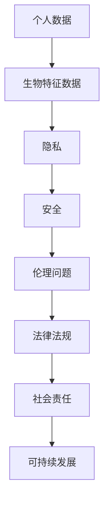

                 

### 文章标题

# 生物特征伦理：个人数据的边界与权利

在数字时代，个人数据已经成为一种新的“货币”，而生物特征数据作为其中的一种，其重要性不言而喻。然而，随着生物特征技术的迅猛发展，个人数据隐私和安全问题也日益凸显。本文旨在探讨生物特征伦理，特别是个人数据的边界与权利，通过逻辑清晰、结构紧凑的分析，为读者提供关于这一领域的深入理解。

## 关键词

- 生物特征识别
- 个人数据隐私
- 伦理问题
- 数据保护法规
- 可持续发展

## 摘要

本文首先介绍了生物特征伦理的背景和重要性，随后详细分析了生物特征技术的应用及其带来的伦理挑战。接着，文章探讨了个人数据的伦理问题，包括数据的收集、处理和保护。随后，文章讨论了相关的法律法规和政策，以及生物特征数据的保护措施。最后，文章提出了社会责任和可持续发展的重要性，并对未来生物特征伦理的发展进行了展望。

## 第1章 生物特征伦理概述

### 1.1 生物特征伦理的重要性

生物特征伦理是一个新兴领域，涉及个人数据的收集、处理和使用。随着生物特征识别技术的发展，如指纹识别、面部识别、虹膜识别等，生物特征数据在多个领域的应用越来越广泛。然而，这种广泛应用也带来了隐私和安全问题。

生物特征数据与传统的个人信息不同，它具有唯一性和不可替代性。一旦泄露，将导致不可逆转的损失。因此，保护生物特征数据的重要性不言而喻。

#### 核心概念与联系

以下是一个生物特征伦理的核心概念架构 Mermaid 流程图：



### 1.2 生物特征伦理的理论基础

生物特征伦理的理论基础主要来源于哲学、伦理学和法律。在哲学上，个人隐私权、知情同意权、数据最小化原则等是核心概念。在伦理学上，公平性、透明性和责任性是评价生物特征技术应用的重要标准。在法律上，数据保护法规和隐私权法律为生物特征数据的收集和使用提供了法律框架。

### 1.3 生物特征伦理的发展历程

生物特征伦理的发展历程可以分为几个阶段。最初，生物特征识别技术主要用于安全领域，如指纹锁、面部识别门禁系统等。随着技术的进步，生物特征识别技术开始应用于医疗、金融、智能家居等多个领域。在这个过程中，生物特征伦理问题也逐渐引起了广泛关注。

### 1.4 生物特征伦理的核心问题

生物特征伦理的核心问题主要包括：

- 个人数据隐私：如何保护个人生物特征数据不被非法收集和使用？
- 数据安全：如何确保生物特征数据在存储、传输和使用过程中的安全性？
- 公平性和透明性：如何保证生物特征技术在应用过程中的公平性和透明性？
- 法律法规：如何制定和完善相关法律法规，以规范生物特征数据的收集和使用？

## 第2章 生物特征技术的应用与挑战

### 2.1 生物特征技术的种类

生物特征技术主要包括指纹识别、面部识别、虹膜识别、声纹识别、手写签名识别等。每种技术都有其独特的应用场景和优势。

#### 核心算法原理讲解

以面部识别为例，其核心算法包括特征提取、特征匹配和模型训练。

```python
# 特征提取
def extract_features(image):
    # 使用卷积神经网络提取特征
    pass

# 特征匹配
def match_features(feature1, feature2):
    # 计算特征相似度
    pass

# 模型训练
def train_model(features, labels):
    # 使用机器学习算法训练模型
    pass
```

### 2.2 生物特征技术在安全领域的应用

生物特征技术在安全领域的应用非常广泛，如生物特征门禁系统、身份验证系统、安全支付系统等。

#### 项目实战

以生物特征门禁系统为例，其开发环境包括 Python、OpenCV 和 TensorFlow。以下是源代码的一部分：

```python
# 导入库
import cv2
import tensorflow as tf

# 加载预训练模型
model = tf.keras.models.load_model('model.h5')

# 摄像头初始化
cap = cv2.VideoCapture(0)

while True:
    # 读取摄像头帧
    ret, frame = cap.read()
    
    # 提取面部特征
    face_cascade = cv2.CascadeClassifier('haarcascade_frontalface_default.xml')
    faces = face_cascade.detectMultiScale(frame, scaleFactor=1.1, minNeighbors=5, minSize=(30, 30))
    
    for (x, y, w, h) in faces:
        # 提取面部区域
        face_region = frame[y:y+h, x:x+w]
        
        # 特征提取
        features = extract_features(face_region)
        
        # 特征匹配
        prediction = model.predict(features)
        
        # 身份验证
        if prediction == 'valid':
            print('Access granted')
        else:
            print('Access denied')
            
    # 显示摄像头帧
    cv2.imshow('Frame', frame)
    
    # 按下 'q' 键退出循环
    if cv2.waitKey(1) & 0xFF == ord('q'):
        break

# 释放摄像头资源
cap.release()
cv2.destroyAllWindows()
```

### 2.3 生物特征技术在医疗领域的应用

生物特征技术在医疗领域也有广泛应用，如医疗诊断、疾病监测、医疗管理等。

#### 项目实战

以医疗诊断为例，其开发环境包括 Python、Scikit-learn 和 Pandas。以下是源代码的一部分：

```python
# 导入库
import pandas as pd
import numpy as np
from sklearn.model_selection import train_test_split
from sklearn.ensemble import RandomForestClassifier
from sklearn.metrics import accuracy_score

# 读取数据
data = pd.read_csv('medical_data.csv')

# 数据预处理
X = data.drop(['diagnosis'], axis=1)
y = data['diagnosis']

# 数据切分
X_train, X_test, y_train, y_test = train_test_split(X, y, test_size=0.2, random_state=42)

# 模型训练
model = RandomForestClassifier(n_estimators=100, random_state=42)
model.fit(X_train, y_train)

# 模型评估
y_pred = model.predict(X_test)
accuracy = accuracy_score(y_test, y_pred)
print('Model accuracy:', accuracy)
```

### 2.4 生物特征技术的挑战

生物特征技术面临的挑战主要包括：

- 技术挑战：如何提高识别准确性、降低误识别率？
- 伦理挑战：如何保护个人隐私、确保数据安全？
- 法律挑战：如何制定和完善相关法律法规，以规范生物特征技术的应用？

## 第3章 个人数据的伦理问题

### 3.1 个人数据的定义与类型

个人数据是指与特定个体相关的信息，可以用来识别、推断或联系该个体。个人数据可以分为以下几类：

- 标识信息：如姓名、身份证号、电话号码等。
- 身份特征：如指纹、面部识别、虹膜识别等。
- 行为信息：如消费记录、社交网络活动等。
- 医疗信息：如病历、基因信息等。

#### 详细讲解与举例说明

以医疗信息为例，医疗信息涉及到个体的健康和生命安全，其重要性不言而喻。例如，某人的基因信息可能会被用来预测其患某种疾病的风险，从而影响其未来的健康管理和保险费用。因此，保护医疗信息的安全和隐私至关重要。

### 3.2 个人数据的收集与处理

个人数据的收集和处理必须遵循以下原则：

- 知情同意：在收集个人数据前，必须告知数据主体数据收集的目的、范围和方式，并得到其同意。
- 数据最小化：仅收集为实现数据目的所必需的数据，避免过度收集。
- 数据安全：采取有效措施保护个人数据的安全，防止数据泄露、篡改和滥用。
- 数据匿名化：在可能的情况下，对个人数据进行匿名化处理，以降低其识别风险。

#### 详细讲解与举例说明

以在线购物为例，购物平台在用户注册时需要收集用户的姓名、电话号码和电子邮件等标识信息。在收集这些信息时，平台需要告知用户数据收集的目的（如订单处理和客户服务）和数据使用的范围（如市场分析和客户调研）。同时，平台需要确保这些信息在传输和存储过程中的安全性，并采取匿名化措施，以降低用户隐私泄露的风险。

### 3.3 个人数据隐私的保护

个人数据隐私的保护是生物特征伦理的重要方面。以下是一些保护个人数据隐私的措施：

- 数据保护法规：制定和完善相关法律法规，明确数据主体的权利和数据控制者的义务。
- 技术措施：采用加密、访问控制等技术手段，确保个人数据在存储、传输和使用过程中的安全性。
- 隐私影响评估：在实施数据处理项目前，进行隐私影响评估，识别潜在隐私风险并采取相应措施。
- 用户教育：提高公众对个人数据隐私保护的意识，增强其对数据使用权的认识。

#### 详细讲解与举例说明

以欧盟的《通用数据保护条例》（GDPR）为例，GDPR 是一部全面的数据保护法规，旨在保护个人数据的隐私和安全。根据 GDPR，个人数据主体享有访问权、更正权、删除权（被遗忘权）等权利。同时，数据控制者必须采取有效措施保护个人数据的安全，否则将面临高额罚款。例如，一家公司未经用户同意，非法收集和存储用户个人信息，可能导致公司被罚款数十万欧元。

### 3.4 个人数据伦理问题案例分析

个人数据伦理问题在现实生活中屡见不鲜。以下是一些典型案例：

- 数据泄露事件：某大型电商平台因系统漏洞导致数百万用户个人信息泄露，引起广泛关注和用户恐慌。
- 数据滥用事件：某公司未经用户同意，收集和出售用户个人数据，被用户起诉并罚款。
- 数据歧视事件：某公司基于用户消费记录和性别信息，对不同用户实施价格歧视，被监管机构处罚。

#### 详细讲解与举例说明

以某公司的数据泄露事件为例，该公司因系统漏洞导致数百万用户的个人信息（包括姓名、电话号码、电子邮件和住址等）被非法访问和泄露。事件发生后，公司迅速采取措施，关闭漏洞、通知受影响的用户、协助用户采取预防措施。然而，事件对公司声誉造成严重影响，导致用户信任度下降、业务受损。此外，公司还因违反数据保护法规，面临巨额罚款。

## 第4章 法律法规与政策

### 4.1 国际生物特征数据保护法规

国际生物特征数据保护法规主要包括联合国《全球生物特征识别标准》、国际标准化组织（ISO）的生物特征标准等。

- 联合国《全球生物特征识别标准》：旨在确保生物特征识别技术的全球互操作性，提高生物特征数据的安全性和隐私保护。
- 国际标准化组织（ISO）：发布了多项生物特征识别标准，如 ISO/IEC 19794-5（指纹识别）、ISO/IEC 30107（人脸识别）等。

#### 详细讲解与举例说明

以 ISO/IEC 19794-5 为例，该标准规定了指纹识别系统的技术要求和测试方法。根据该标准，指纹识别系统应具有高识别准确性、低误识别率和快速响应时间。例如，一个符合 ISO/IEC 19794-5 标准的指纹识别系统，其识别准确率应不低于 99.5%，误识别率应不超过 0.1%。

### 4.2 各国生物特征数据保护法规比较

各国生物特征数据保护法规在内容和执行力度上存在差异。以下是一些主要国家的生物特征数据保护法规：

- 美国：主要依靠联邦和州层面的法律法规，如《隐私法》、《儿童在线隐私保护法》等。
- 欧洲：欧盟制定了《通用数据保护条例》（GDPR），对生物特征数据的收集、处理和使用进行了全面规范。
- 中国：中国制定了《个人信息保护法》，明确了个人信息的定义、收集、处理和保护原则。

#### 详细讲解与举例说明

以 GDPR 为例，GDPR 是欧盟最具代表性的数据保护法规，对生物特征数据的收集、处理和使用提出了严格的要求。根据 GDPR，数据控制者必须获得数据主体的明确同意，才能收集和处理其生物特征数据。同时，数据控制者还应采取适当的技术和组织措施，确保生物特征数据的安全性和隐私保护。

### 4.3 欧盟《通用数据保护条例》（GDPR）

欧盟《通用数据保护条例》（GDPR）于 2018 年 5 月 25 日正式生效，是欧盟最具代表性的数据保护法规。GDPR 对生物特征数据保护提出了以下要求：

- 明确同意：数据控制者必须获得数据主体的明确同意，才能收集和处理其生物特征数据。
- 数据最小化：仅收集为实现数据目的所必需的数据，避免过度收集。
- 数据安全：采取适当的技术和组织措施，确保生物特征数据的安全性和隐私保护。
- 用户权利：数据主体享有访问权、更正权、删除权（被遗忘权）等权利。

#### 详细讲解与举例说明

以一家生物特征识别公司为例，该公司在开发一款面部识别系统时，必须获得用户明确的同意，并告知用户数据收集的目的、范围和方式。同时，公司应采取加密、访问控制等技术措施，确保用户面部识别数据的安全性和隐私保护。此外，公司还应建立用户权利保护机制，如用户可随时要求删除其面部识别数据。

### 4.4 中国生物特征数据保护法规

中国生物特征数据保护法规主要包括《中华人民共和国网络安全法》和《中华人民共和国个人信息保护法》。

- 《中华人民共和国网络安全法》：明确了网络运营者的数据保护义务，对生物特征数据的收集、处理和使用提出了要求。
- 《中华人民共和国个人信息保护法》：明确了个人信息保护的原则、个人信息处理者的义务和个人信息主体的权利。

#### 详细讲解与举例说明

以《中华人民共和国个人信息保护法》为例，该法规定了个人信息处理者的义务，包括收集、处理个人信息的合法性、目的明确原则、最小化原则、安全保护原则等。例如，一家公司在开发一款生物特征识别系统时，必须明确收集用户生物特征数据的目的、范围和方式，并采取有效措施保护用户个人信息的安全。

## 第5章 生物特征数据的保护

### 5.1 生物特征数据保护的技术手段

生物特征数据保护的技术手段主要包括加密、访问控制、身份验证等。

- 加密：通过对生物特征数据进行加密，确保数据在传输和存储过程中的安全性。
- 访问控制：通过设置访问控制策略，限制未经授权的访问和数据泄露。
- 身份验证：通过验证用户的身份，确保只有授权用户才能访问和操作生物特征数据。

#### 详细讲解与举例说明

以生物特征数据的加密为例，加密技术可以采用对称加密和非对称加密。例如，使用 AES（高级加密标准）进行对称加密，可确保生物特征数据在传输过程中的安全性。同时，使用 RSA（RSA加密算法）进行非对称加密，可以确保生物特征数据在存储过程中的安全性。

### 5.2 生物特征数据保护的法律框架

生物特征数据保护的法律框架主要包括数据保护法规、隐私权法律和数据安全法律。

- 数据保护法规：规范生物特征数据的收集、处理和使用，确保数据安全和个人隐私。
- 隐私权法律：明确数据主体的权利，如知情同意权、访问权、更正权和删除权等。
- 数据安全法律：对数据控制者提出数据安全保护的要求，确保数据不被非法访问、篡改或泄露。

#### 详细讲解与举例说明

以《中华人民共和国个人信息保护法》为例，该法明确规定了个人信息处理者的义务，如收集、处理个人信息的合法性、目的明确原则、最小化原则、安全保护原则等。同时，该法还规定了个人信息主体的权利，如知情同意权、访问权、更正权和删除权等。例如，一家公司在开发一款生物特征识别系统时，必须遵循《中华人民共和国个人信息保护法》的规定，确保用户个人信息的合法收集、处理和保护。

### 5.3 生物特征数据保护的实际案例

生物特征数据保护在实际应用中取得了显著成果。以下是一些实际案例：

- 某银行采用生物特征识别技术，提高了账户安全性，降低了欺诈风险。
- 某医疗机构利用生物特征识别技术，提高了患者身份认证的准确性，减少了医疗错误。
- 某科技公司推出了一款基于生物特征识别的智能家居产品，提升了用户体验和安全性。

#### 详细讲解与举例说明

以某银行为例，该银行采用生物特征识别技术，如指纹识别和面部识别，作为账户安全验证手段。用户在办理业务或进行在线操作时，需要通过生物特征验证，确保只有合法用户才能访问账户。同时，银行采取了加密、访问控制等安全技术，确保用户生物特征数据在传输和存储过程中的安全性。通过这些措施，该银行显著降低了欺诈风险，提高了账户安全性。

### 5.4 生物特征数据保护的挑战与展望

生物特征数据保护面临以下挑战：

- 技术挑战：如何提高生物特征识别的准确性、降低误识别率？
- 伦理挑战：如何保护个人隐私、确保数据安全？
- 法律挑战：如何制定和完善相关法律法规，以规范生物特征技术的应用？

展望未来，生物特征数据保护将继续发展，以下是一些趋势：

- 技术进步：随着人工智能和机器学习技术的发展，生物特征识别技术将更加准确、高效。
- 法律法规完善：各国将加强生物特征数据保护法律法规的制定和实施，提高数据安全和个人隐私保护水平。
- 可持续发展：生物特征数据保护将与其他领域（如医疗、金融、智能家居等）相结合，实现可持续发展。

## 第6章 社会责任与可持续发展

### 6.1 企业在生物特征数据保护中的社会责任

企业在生物特征数据保护中承担着重要的社会责任。以下是一些具体措施：

- 制定数据保护政策：企业应制定明确的生物特征数据保护政策，明确数据收集、处理和保护的具体要求。
- 建立数据安全组织：企业应建立专门的数据安全组织，负责生物特征数据保护工作的实施和监督。
- 加强员工培训：企业应对员工进行生物特征数据保护培训，提高员工的意识和能力。
- 开展数据安全审计：企业应定期开展数据安全审计，评估生物特征数据保护的有效性，并采取改进措施。

#### 详细讲解与举例说明

以某科技公司为例，该公司在生物特征数据保护方面采取了以下措施：

1. 制定数据保护政策：公司明确规定生物特征数据的收集、处理和保护的具体要求，确保数据安全。
2. 建立数据安全组织：公司成立了数据安全委员会，负责生物特征数据保护工作的实施和监督。
3. 加强员工培训：公司对员工进行生物特征数据保护培训，提高员工的意识和能力。
4. 开展数据安全审计：公司定期开展数据安全审计，评估生物特征数据保护的有效性，并采取改进措施。

### 6.2 生物特征伦理与社会责任的关系

生物特征伦理与社会责任密切相关。生物特征技术的应用不仅涉及个人隐私和数据安全，还关系到社会公平、透明性和可持续发展。

- 社会公平：生物特征技术的应用应确保所有人平等享受技术带来的便利，避免技术歧视和偏见。
- 透明性：生物特征技术的应用过程应保持透明，数据主体有权了解其生物特征数据的使用情况。
- 可持续发展：生物特征技术的应用应促进社会的可持续发展，提高生活质量和环境保护水平。

#### 详细讲解与举例说明

以某城市公共交通系统为例，该系统引入了生物特征识别技术，如指纹识别和面部识别，作为乘车认证手段。为了确保社会公平，系统对所有乘客一视同仁，不区分年龄、性别、种族等。同时，系统保持了高度的透明性，乘客可以随时查询其生物特征数据的使用记录。此外，系统通过生物特征识别技术提高了乘车效率，降低了拥堵，促进了城市的可持续发展。

### 6.3 可持续发展与生物特征伦理

可持续发展与生物特征伦理密切相关。在生物特征技术的应用过程中，应充分考虑其对环境保护和资源利用的影响。

- 环境保护：生物特征技术的应用应减少对自然资源的消耗，降低环境污染。
- 资源利用：生物特征技术的应用应提高资源利用效率，降低资源浪费。

#### 详细讲解与举例说明

以某绿色科技公司为例，该公司在开发生物特征识别技术时，充分考虑了环境保护和资源利用的问题。公司采用先进的加密技术，确保生物特征数据在传输和存储过程中的安全性，减少了能源消耗。同时，公司利用生物特征识别技术，提高了生产效率，降低了生产成本，实现了可持续发展。

### 6.4 社会责任案例研究

以下是一些社会责任案例研究：

- 某科技公司推出了基于生物特征识别的智能门禁系统，为残障人士提供无障碍通行，提高了社会公平。
- 某医疗机构利用生物特征识别技术，提高了患者身份认证的准确性，减少了医疗错误，提高了医疗质量。
- 某城市采用了生物特征识别技术，提高了公共交通系统的效率，降低了交通拥堵，提高了城市居民的生活质量。

#### 详细讲解与举例说明

以某科技公司推出的智能门禁系统为例，该系统采用了生物特征识别技术，如指纹识别和面部识别，为残障人士提供了无障碍通行。系统设计时充分考虑了残障人士的特殊需求，如指纹识别模块的触感舒适、面部识别模块的适应角度等。通过该系统，残障人士可以方便地进出办公楼、医院、学校等场所，提高了社会公平。

## 第7章 未来展望

### 7.1 生物特征伦理的发展趋势

未来，生物特征伦理将继续发展，以下是一些趋势：

- 技术进步：随着人工智能和生物技术的快速发展，生物特征识别技术将更加准确、高效。
- 法律法规完善：各国将加强生物特征数据保护法律法规的制定和实施，提高数据安全和个人隐私保护水平。
- 社会共识：社会对生物特征伦理的共识将逐渐形成，推动生物特征技术的健康、可持续发展。

### 7.2 生物特征技术与伦理的融合

生物特征技术与伦理的融合是未来发展的关键。以下是一些建议：

- 强化数据保护：加强生物特征数据保护的技术手段和法律框架，确保数据安全和个人隐私。
- 提高透明度：提高生物特征技术的应用过程透明度，增强数据主体对生物特征数据的控制权。
- 促进社会共识：加强公众对生物特征伦理的认知，促进社会对生物特征技术的信任和支持。

### 7.3 生物特征伦理的挑战与对策

生物特征伦理在未来将继续面临以下挑战：

- 技术挑战：如何提高生物特征识别的准确性、降低误识别率？
- 伦理挑战：如何保护个人隐私、确保数据安全？
- 法律挑战：如何制定和完善相关法律法规，以规范生物特征技术的应用？

针对这些挑战，以下是一些建议：

- 加强技术创新：加大对生物特征识别技术的研发投入，提高技术的准确性和可靠性。
- 强化伦理教育：加强生物特征伦理教育，提高从业者的伦理素养和社会责任感。
- 完善法律法规：制定和完善生物特征数据保护法律法规，明确数据收集、处理和保护的具体要求。

### 7.4 未来生物特征伦理的蓝图

未来，生物特征伦理将朝着以下方向发展：

- 技术与伦理融合：生物特征技术与伦理将更加紧密地融合，推动生物特征技术的健康、可持续发展。
- 法律法规完善：各国将加强生物特征数据保护法律法规的制定和实施，提高数据安全和个人隐私保护水平。
- 社会共识形成：社会对生物特征伦理的共识将逐渐形成，推动生物特征技术的广泛应用和普及。

## 结束语

生物特征伦理是一个涉及技术、法律和社会的复杂领域。随着生物特征技术的不断发展，个人数据隐私和安全问题日益凸显。本文从多个角度分析了生物特征伦理，探讨了个人数据的边界与权利，以及相关的法律法规和政策。未来，生物特征伦理将继续发展，我们需要共同努力，确保生物特征技术的健康、可持续发展，保护个人数据隐私和安全。

### 作者信息

作者：AI天才研究院/AI Genius Institute & 禅与计算机程序设计艺术 /Zen And The Art of Computer Programming

