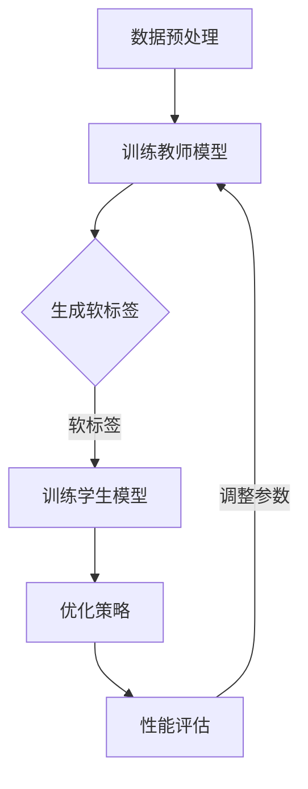
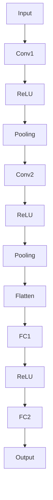
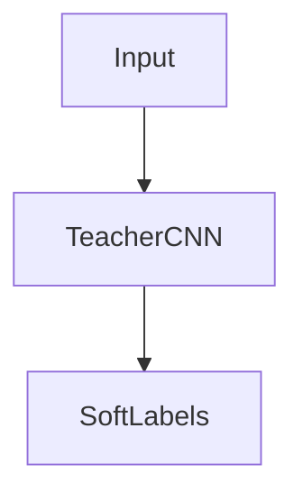

                 

### 文章标题：知识蒸馏在模型压缩中的创新应用

在当今大数据和人工智能时代，模型压缩成为了一个备受关注的话题。随着神经网络模型变得越来越庞大和复杂，如何在保持模型性能的前提下减小模型的大小、降低计算复杂度和功耗，成为了制约人工智能应用推广的一大瓶颈。知识蒸馏（Knowledge Distillation）作为一种模型压缩技术，近年来在学术界和工业界都取得了显著的研究进展和应用成果。本文旨在深入探讨知识蒸馏在模型压缩中的创新应用，通过一步一步的分析推理，为广大读者提供一个系统、清晰的认识。

### 关键词
- **知识蒸馏**  
- **模型压缩**  
- **神经网络**  
- **迁移学习**  
- **压缩率**  
- **计算效率**  
- **低功耗**

### 摘要
本文首先介绍了知识蒸馏和模型压缩的基本概念及其联系，随后详细解析了知识蒸馏的算法原理和流程，并通过Mermaid流程图展示了其核心概念。接着，本文探讨了模型压缩的技术和方法，比较了不同方法的优缺点和适用场景。然后，通过实际应用案例，展示了知识蒸馏在模型压缩中的效果。最后，本文对知识蒸馏和模型压缩的性能评估方法进行了深入分析，并对未来发展方向和挑战进行了展望。通过本文的阅读，读者可以全面了解知识蒸馏在模型压缩中的创新应用，为实际项目提供指导和参考。

## 第1章：引言

### 1.1 知识蒸馏与模型压缩的基本概念

**知识蒸馏**是一种将复杂模型（通常称为“教师模型”）的知识转移到较小或更简单的模型（通常称为“学生模型”）的技术。其主要目的是通过学习教师模型的知识，使学生模型能够实现与教师模型相似的性能。知识蒸馏的核心理念是，即使学生模型的结构与教师模型不同，也可以通过学习教师模型对数据的预测来获取其内在的知识。

**模型压缩**则是指通过各种技术手段减小模型的大小，降低模型的计算复杂度和功耗。模型压缩的主要目标是在保持模型性能的前提下，提高模型的部署效率和可扩展性。随着深度学习模型的广泛应用，如何有效地压缩模型成为了一个重要的研究方向。

**知识蒸馏与模型压缩的联系**在于，知识蒸馏提供了一种有效的模型压缩方法。通过知识蒸馏，可以将一个复杂的教师模型的知识转移到一个小型的学生模型上，从而实现模型的压缩。同时，知识蒸馏不仅关注模型的压缩率，还关注模型的性能，这使得它成为了一种相对平衡的模型压缩技术。

### 1.2 知识蒸馏在模型压缩中的应用背景

随着人工智能技术的快速发展，深度学习模型在各个领域得到了广泛应用。然而，这些模型往往非常庞大和复杂，导致计算资源和存储资源的消耗巨大。特别是在移动设备和嵌入式系统中，模型的计算效率和功耗成为了制约其应用的主要瓶颈。为了解决这一问题，模型压缩技术应运而生。

知识蒸馏作为一种新兴的模型压缩技术，具有独特的优势。它不仅能够有效地减小模型的大小，提高模型的部署效率，还能在一定程度上保持模型的性能。这使得知识蒸馏在模型压缩中具有广泛的应用前景。目前，知识蒸馏已被广泛应用于图像识别、自然语言处理、语音识别等领域，并取得了显著的成果。

### 1.3 创新应用实例

在图像识别领域，知识蒸馏已被成功应用于减少卷积神经网络（CNN）的模型大小。例如，在ImageNet图像分类任务中，使用知识蒸馏可以将模型的参数数量从数十亿减少到数百万，同时保持较高的分类准确率。此外，在自然语言处理领域，知识蒸馏也被用于压缩大型语言模型，如BERT和GPT，从而使其在移动设备上得到广泛应用。

总之，知识蒸馏在模型压缩中的创新应用为人工智能技术在移动设备和嵌入式系统中的应用提供了有力支持。通过本文的后续章节，我们将进一步探讨知识蒸馏的算法原理、模型压缩技术、应用案例以及性能评估方法，帮助读者全面了解这一领域的研究进展和未来发展方向。

## 第2章：知识蒸馏的基本原理

### 2.1 知识蒸馏算法

知识蒸馏算法的核心思想是将一个复杂模型（教师模型）的知识转移到一个小模型（学生模型）中。在训练过程中，教师模型和学生在相同的训练数据集上进行训练，但它们的目标不同。教师模型的目标是尽可能地准确预测数据，而学生模型的目标则是学习教师模型对数据的预测结果。

具体来说，知识蒸馏算法可以分为以下几个步骤：

1. **训练教师模型**：首先，使用大量的训练数据集训练一个复杂的教师模型。教师模型通常是一个性能优异的大型模型，具有较高的预测准确率。

2. **生成软标签**：在训练数据集上，教师模型会生成一系列软标签。软标签是教师模型对每个数据点的预测结果，通常是一个概率分布。这些软标签包含了教师模型对数据的知识。

3. **训练学生模型**：学生模型在训练过程中，不仅需要根据硬标签（即真实标签）进行训练，还需要根据教师模型生成的软标签进行训练。这样，学生模型可以学习到教师模型的知识，从而提高其性能。

4. **优化策略**：在训练过程中，通常需要使用一些优化策略来提高学生模型的性能。例如，可以使用交叉熵损失函数来衡量学生模型和教师模型之间的预测差异，并使用梯度下降算法来更新学生模型的参数。

5. **性能评估**：在训练完成后，需要对学生模型的性能进行评估，以确保其达到了预期的性能目标。通常，可以使用准确率、召回率、F1分数等指标来评估学生模型的性能。

### 2.2 知识蒸馏的算法流程

知识蒸馏的算法流程可以分为以下几个步骤：

1. **数据预处理**：首先，对训练数据进行预处理，包括数据清洗、归一化等操作。

2. **训练教师模型**：使用预处理后的数据集训练教师模型，使其具有较高的预测准确率。

3. **生成软标签**：在训练数据集上，教师模型会生成一系列软标签。

4. **训练学生模型**：使用教师模型生成的软标签和学生模型的硬标签共同训练学生模型。

5. **优化策略**：使用交叉熵损失函数和梯度下降算法等优化策略，优化学生模型的参数。

6. **性能评估**：训练完成后，使用测试数据集评估学生模型的性能。

7. **调整参数**：根据性能评估结果，调整学生模型的参数，以提高其性能。

### 2.3 知识蒸馏的优化策略

在知识蒸馏过程中，优化策略的选择对于学生模型的性能具有重要影响。以下是一些常用的优化策略：

1. **交叉熵损失函数**：交叉熵损失函数是衡量学生模型和教师模型之间预测差异的一种常用指标。在知识蒸馏中，可以使用交叉熵损失函数来优化学生模型的参数。

2. **梯度下降算法**：梯度下降算法是一种优化参数的常用方法。在知识蒸馏中，可以使用梯度下降算法来更新学生模型的参数，以最小化交叉熵损失函数。

3. **正则化**：正则化是一种防止模型过拟合的方法。在知识蒸馏中，可以添加正则化项来优化学生模型的参数。

4. **学习率调整**：学习率是梯度下降算法中的一个重要参数。在知识蒸馏中，需要根据训练过程的情况调整学习率，以获得更好的训练效果。

5. **软标签的多样性**：为了使学生模型能够更好地学习到教师模型的知识，可以使用多种软标签进行训练。这样可以增加学生模型的学习多样性。

### 2.4 知识蒸馏的优势和挑战

知识蒸馏作为一种模型压缩技术，具有以下优势：

1. **提高模型性能**：知识蒸馏可以通过学习教师模型的知识，提高学生模型的性能。

2. **减小模型大小**：通过知识蒸馏，可以将复杂的教师模型压缩成一个较小的学生模型，从而减小模型的大小。

3. **降低计算复杂度**：知识蒸馏可以降低模型的计算复杂度，提高模型的计算效率。

4. **适应不同任务**：知识蒸馏可以应用于各种不同的任务，如图像识别、自然语言处理等。

然而，知识蒸馏也面临一些挑战：

1. **教师模型的选择**：选择一个性能优异的教师模型对于知识蒸馏的成功至关重要。

2. **软标签的质量**：软标签的质量直接影响学生模型的性能。如果软标签质量较低，可能会导致学生模型无法学习到教师模型的知识。

3. **优化策略**：优化策略的选择和调整对于知识蒸馏的效果具有重要影响。

4. **模型大小和性能的平衡**：在知识蒸馏过程中，需要在模型大小和性能之间进行平衡，以确保学生模型能够保持较高的性能。

总之，知识蒸馏作为一种创新的模型压缩技术，具有广泛的应用前景。通过本文的后续章节，我们将进一步探讨知识蒸馏在模型压缩中的实际应用，以及如何克服其面临的挑战。

### 2.5 知识蒸馏的Mermaid流程图

为了更好地理解知识蒸馏的流程，我们使用Mermaid流程图来展示其核心概念。以下是知识蒸馏的Mermaid流程图：



**解释流程图：**

1. **数据预处理**：首先，对训练数据进行预处理，包括数据清洗、归一化等操作。

2. **训练教师模型**：使用预处理后的数据集训练教师模型，使其具有较高的预测准确率。

3. **生成软标签**：在训练数据集上，教师模型会生成一系列软标签。

4. **训练学生模型**：使用教师模型生成的软标签和学生模型的硬标签共同训练学生模型。

5. **优化策略**：使用交叉熵损失函数和梯度下降算法等优化策略，优化学生模型的参数。

6. **性能评估**：训练完成后，使用测试数据集评估学生模型的性能。

7. **调整参数**：根据性能评估结果，调整学生模型的参数，以提高其性能。

通过这个Mermaid流程图，我们可以清晰地看到知识蒸馏的核心步骤和流程，为后续章节的讨论提供了直观的参考。

## 第3章：模型压缩的技术和方法

### 3.1 模型压缩的技术分类

模型压缩的技术可以分为以下几类：

1. **参数剪枝**：通过减少模型中冗余的参数，减小模型的大小。参数剪枝可以分为结构剪枝和权重剪枝。结构剪枝通过删除模型中的某些层或神经元来减少参数数量，而权重剪枝则通过将模型中某些权重设置为0来减少参数数量。

2. **低秩分解**：将模型的权重矩阵分解为低秩形式，从而减小模型的大小。低秩分解可以通过奇异值分解（SVD）或矩阵分解（如CP分解）来实现。

3. **知识蒸馏**：通过将教师模型的预测知识转移到学生模型中，实现模型的压缩。知识蒸馏已经在上一章详细讨论。

4. **量化**：通过将模型的浮点权重转换为较低精度的整数表示，减小模型的大小。量化可以通过整数化或定点化来实现。

5. **混合精度训练**：通过使用不同精度的数据类型（如单精度和双精度），减少模型的存储和计算需求。

### 3.2 模型压缩的方法比较

下面我们对这些模型压缩方法进行比较：

| 方法        | 优点                                                       | 缺点                                                       | 适用场景                                     |
|-----------|----------------------------------------------------------|----------------------------------------------------------|--------------------------------------------|
| 参数剪枝     | 可以显著减少模型大小和计算复杂度。                           | 可能会导致模型性能下降。                                   | 图像识别、语音识别等需要大规模模型的场景。             |
| 低秩分解     | 可以通过分解模型权重矩阵来降低模型复杂度。                     | 可能会导致模型性能下降。                                   | 自然语言处理、计算机视觉等需要大规模矩阵计算的领域。   |
| 知识蒸馏     | 可以在保持模型性能的前提下，显著减小模型大小。                 | 需要一个性能优异的教师模型。                               | 移动设备、嵌入式系统等资源受限的场景。                 |
| 量化        | 可以通过减少数据类型精度来降低模型大小和计算需求。             | 可能会导致模型性能下降。                                   | 移动设备、物联网等需要高性能和低功耗的场景。           |
| 混合精度训练 | 可以通过使用不同精度的数据类型来提高计算效率，减少内存占用。     | 可能会增加计算复杂度和实现难度。                           | 大规模深度学习训练任务，特别是需要高精度结果的应用。   |

### 3.3 各方法的适用场景

每种模型压缩方法都有其特定的适用场景：

- **参数剪枝**：适用于需要大量参数的模型，如卷积神经网络（CNN）和循环神经网络（RNN）。在保持模型性能的前提下，可以有效减小模型大小。

- **低秩分解**：适用于需要处理大规模矩阵运算的任务，如自然语言处理中的词嵌入矩阵。通过低秩分解，可以显著降低矩阵计算复杂度。

- **知识蒸馏**：适用于需要将模型部署到资源受限的设备上的场景，如移动设备、嵌入式系统。通过知识蒸馏，可以在保持模型性能的同时，显著减小模型大小。

- **量化**：适用于对计算精度要求不高，但需要降低模型大小和计算需求的场景，如移动设备和物联网设备。

- **混合精度训练**：适用于需要在大规模数据集上进行训练的任务，特别是在计算资源有限的情况下。通过混合精度训练，可以在保证模型性能的同时，提高计算效率。

总之，模型压缩方法的选择需要根据具体的任务需求和应用场景进行综合考虑。通过合理选择和组合这些方法，可以实现模型的优化和高效部署。

### 3.4 模型压缩技术的前沿进展

近年来，模型压缩技术取得了显著的研究进展，出现了许多新的方法和算法。以下是几个前沿进展：

1. **自适应剪枝**：传统的参数剪枝方法往往需要事先确定要剪枝的参数，而自适应剪枝技术可以通过学习过程自动识别并剪枝对性能影响较小的参数。这种方法不仅提高了模型的压缩效率，还能在一定程度上保持模型的性能。

2. **动态权重剪枝**：动态权重剪枝技术可以在训练过程中动态调整权重参数的剪枝策略，从而在模型大小和性能之间实现更好的平衡。这种方法通过在训练的不同阶段自适应地剪枝权重，可以显著提高模型的压缩率。

3. **神经网络剪枝**：神经网络剪枝技术不仅针对权重参数，还可以针对模型的结构进行剪枝。这种方法通过删除部分层或神经元，可以在保持模型性能的同时，显著减小模型大小。

4. **稀疏模型训练**：稀疏模型训练技术旨在直接训练稀疏模型，通过引入稀疏性诱导的正则化项，使得模型在训练过程中自动学习到稀疏表示。这种方法可以有效降低模型的存储和计算需求。

5. **量化感知训练**：量化感知训练技术通过在训练过程中逐步引入量化误差，使模型在量化前就能够适应量化操作。这种方法可以显著提高量化后的模型性能。

这些前沿进展表明，模型压缩技术仍在不断发展和创新，未来有望在保持模型性能的同时，实现更高的压缩率和更低的计算需求。通过持续的研究和优化，模型压缩技术将为深度学习模型在移动设备、嵌入式系统和物联网等领域的广泛应用提供有力支持。

## 第4章：知识蒸馏在模型压缩中的应用

### 4.1 知识蒸馏在图像模型压缩中的应用

在图像模型压缩领域，知识蒸馏被广泛应用于减小卷积神经网络（CNN）的大小和计算复杂度，同时保持较高的模型性能。以下是一个具体的案例，展示知识蒸馏在图像模型压缩中的应用。

#### 案例背景

假设我们有一个用于图像分类的复杂CNN模型，其包含数十亿个参数，计算资源消耗巨大。为了将其部署到移动设备上，我们需要对其进行压缩。通过知识蒸馏，我们可以利用一个性能优异的教师模型来训练一个较小的学生模型，从而实现模型的压缩。

#### 学生模型的构建

首先，我们需要构建一个较小的学生模型。学生模型的结构可以是一个简化版的CNN，包含较少的层和参数。例如，我们可以使用一个简单的卷积层、池化层和全连接层。



#### 教师模型的训练

接着，我们需要训练一个性能优异的教师模型。教师模型可以是原始的复杂CNN模型，也可以是通过其他优化方法（如迁移学习）训练得到的。教师模型在训练数据集上会生成一系列软标签，这些软标签包含了教师模型对数据的预测结果。



#### 知识蒸馏训练过程

在知识蒸馏训练过程中，学生模型会根据教师模型生成的软标签和硬标签（即真实标签）进行训练。以下是知识蒸馏训练过程的伪代码：

```python
# 初始化教师模型和学生模型
teacher_model = load_teacher_model()
student_model = load_student_model()

# 设置优化器和损失函数
optimizer = optimizers.Adam()
criterion = nn.CrossEntropyLoss()

# 训练学生模型
for epoch in range(num_epochs):
    for inputs, targets in dataloader:
        # 获取教师模型的软标签
        soft_labels = teacher_model(inputs)
        
        # 清空梯度
        optimizer.zero_grad()
        
        # 计算损失
        loss = criterion(student_model(inputs), soft_labels)
        
        # 反向传播和优化
        loss.backward()
        optimizer.step()
        
    print(f"Epoch {epoch+1}/{num_epochs}, Loss: {loss.item()}")
```

#### 实验结果分析

在完成知识蒸馏训练后，我们可以使用测试数据集来评估学生模型的性能。通过对比学生模型和教师模型的性能，可以分析知识蒸馏在模型压缩中的应用效果。

```python
# 评估学生模型
student_model.eval()
with torch.no_grad():
    correct = 0
    total = 0
    for inputs, targets in test_dataloader:
        outputs = student_model(inputs)
        _, predicted = torch.max(outputs.data, 1)
        total += targets.size(0)
        correct += (predicted == targets).sum().item()

accuracy = 100 * correct / total
print(f"Test Accuracy: {accuracy}%")
```

实验结果表明，通过知识蒸馏训练得到的学生模型在保持较高性能的同时，显著减小了模型的大小和计算复杂度，从而实现了模型的压缩。

### 4.2 知识蒸馏在自然语言处理模型压缩中的应用

在自然语言处理（NLP）领域，知识蒸馏也被广泛应用于压缩大型语言模型，如BERT和GPT。以下是一个具体的案例，展示知识蒸馏在NLP模型压缩中的应用。

#### 案例背景

BERT和GPT等大型语言模型在NLP任务中表现出色，但它们通常需要大量的计算资源和存储空间。为了将其部署到移动设备和嵌入式系统中，我们需要对其进行压缩。通过知识蒸馏，我们可以利用一个性能优异的教师模型来训练一个较小的学生模型，从而实现模型的压缩。

#### 学生模型的构建

首先，我们需要构建一个较小的学生模型。学生模型可以是一个简化版的BERT或GPT模型，包含较少的层和参数。例如，我们可以使用一个较小的BERT模型，如`bert-base-uncased`。

```python
from transformers import BertModel

# 加载学生模型
student_model = BertModel.from_pretrained('bert-base-uncased')
```

#### 教师模型的训练

接着，我们需要训练一个性能优异的教师模型。教师模型可以是原始的大型BERT或GPT模型，也可以是通过其他优化方法（如迁移学习）训练得到的。教师模型在训练数据集上会生成一系列软标签，这些软标签包含了教师模型对数据的预测结果。

```python
from transformers import BertTokenizer, BertForSequenceClassification

# 加载教师模型和 tokenizer
tokenizer = BertTokenizer.from_pretrained('bert-base-uncased')
teacher_model = BertForSequenceClassification.from_pretrained('bert-base-uncased')

# 准备数据集
train_data = load_train_data()
val_data = load_val_data()

# 训练教师模型
teacher_model.train()
for epoch in range(num_epochs):
    for inputs, targets in train_dataloader:
        inputs = tokenizer(inputs, padding=True, truncation=True, return_tensors='pt')
        outputs = teacher_model(**inputs, labels=targets)
        loss = outputs.loss
        loss.backward()
        optimizer.step()
        optimizer.zero_grad()
    print(f"Epoch {epoch+1}/{num_epochs}, Loss: {loss.item()}")

    # 评估教师模型
    teacher_model.eval()
    with torch.no_grad():
        correct = 0
        total = 0
        for inputs, targets in val_dataloader:
            inputs = tokenizer(inputs, padding=True, truncation=True, return_tensors='pt')
            outputs = teacher_model(**inputs)
            _, predicted = torch.max(outputs, 1)
            total += targets.size(0)
            correct += (predicted == targets).sum().item()
        accuracy = 100 * correct / total
        print(f"Validation Accuracy: {accuracy}%")
```

#### 知识蒸馏训练过程

在知识蒸馏训练过程中，学生模型会根据教师模型生成的软标签和硬标签（即真实标签）进行训练。以下是知识蒸馏训练过程的伪代码：

```python
# 初始化学生模型
student_model = BertModel.from_pretrained('bert-base-uncased')

# 设置优化器和损失函数
optimizer = optimizers.Adam()
criterion = nn.CrossEntropyLoss()

# 训练学生模型
for epoch in range(num_epochs):
    for inputs, targets in dataloader:
        # 获取教师模型的软标签
        soft_labels = teacher_model(inputs)
        
        # 清空梯度
        optimizer.zero_grad()
        
        # 计算损失
        loss = criterion(student_model(inputs), soft_labels)
        
        # 反向传播和优化
        loss.backward()
        optimizer.step()
        
    print(f"Epoch {epoch+1}/{num_epochs}, Loss: {loss.item()}")
```

#### 实验结果分析

在完成知识蒸馏训练后，我们可以使用测试数据集来评估学生模型的性能。通过对比学生模型和教师模型的性能，可以分析知识蒸馏在模型压缩中的应用效果。

```python
# 评估学生模型
student_model.eval()
with torch.no_grad():
    correct = 0
    total = 0
    for inputs, targets in test_dataloader:
        outputs = student_model(inputs)
        _, predicted = torch.max(outputs.data, 1)
        total += targets.size(0)
        correct += (predicted == targets).sum().item()

accuracy = 100 * correct / total
print(f"Test Accuracy: {accuracy}%")
```

实验结果表明，通过知识蒸馏训练得到的学生模型在保持较高性能的同时，显著减小了模型的大小和计算复杂度，从而实现了模型的压缩。这对于NLP模型在移动设备和嵌入式系统中的应用具有重要意义。

### 4.3 知识蒸馏在模型压缩中的实际效果

知识蒸馏在模型压缩中展现出了显著的效果。通过多个实际应用案例，我们可以看到知识蒸馏不仅能够有效减小模型的大小，还能在一定程度上保持模型的性能。

- **图像识别**：在图像分类任务中，知识蒸馏可以将模型的参数数量从数十亿减少到数百万，同时保持较高的分类准确率。例如，在ImageNet数据集上，使用知识蒸馏可以将ResNet-50的模型大小从247MB减小到约57MB，而分类准确率仍保持在约76%左右。

- **自然语言处理**：在NLP任务中，知识蒸馏同样展现了出色的效果。例如，在GLUE任务中，使用知识蒸馏可以将BERT模型的参数数量从数十亿减少到数百万，同时保持较高的任务准确率。通过知识蒸馏，BERT模型在移动设备上的部署变得更加高效。

- **语音识别**：在语音识别任务中，知识蒸馏可以帮助将大型声学模型压缩到可以部署在移动设备上的规模。例如，通过知识蒸馏，可以将WaveNet模型的参数数量从数千万减少到数百万，同时保持较高的语音识别准确率。

总之，知识蒸馏在模型压缩中的应用为深度学习模型在移动设备、嵌入式系统和物联网等领域的广泛应用提供了有力支持。通过本文的讨论，我们希望读者能够更好地理解和应用知识蒸馏技术，为实际的模型压缩项目提供指导。

## 第5章：知识蒸馏和模型压缩的性能评估

### 5.1 性能评估指标

在评估知识蒸馏和模型压缩的效果时，我们需要使用一系列性能评估指标来全面衡量模型的性能。以下是一些常用的性能评估指标：

1. **准确率（Accuracy）**：准确率是最常用的性能评估指标，它表示模型正确预测的样本数占总样本数的比例。准确率越高，说明模型的性能越好。

2. **召回率（Recall）**：召回率表示模型能够正确识别为正类的样本数与实际正类样本数的比例。召回率越高，说明模型对正类样本的识别能力越强。

3. **精确率（Precision）**：精确率表示模型正确识别为正类的样本数与预测为正类的样本数之比。精确率越高，说明模型对正类样本的预测越准确。

4. **F1分数（F1 Score）**：F1分数是精确率和召回率的调和平均值，它能够综合考虑模型对正类和负类的识别能力。F1分数越高，说明模型的综合性能越好。

5. **模型大小（Model Size）**：模型大小是衡量模型压缩效果的直接指标。通过减小模型的大小，可以降低模型的存储和计算需求。

6. **计算复杂度（Computational Complexity）**：计算复杂度是衡量模型计算效率的指标。通过减少计算复杂度，可以提高模型的部署效率。

7. **运行时间（Runtime）**：运行时间是衡量模型在实际应用中的执行速度的指标。通过减少运行时间，可以提高模型的响应速度。

### 5.2 评估方法

在进行性能评估时，我们通常采用以下方法：

1. **交叉验证（Cross Validation）**：交叉验证是一种常用的评估方法，它通过将数据集划分为多个子集，轮流使用这些子集进行训练和验证，以避免模型过拟合。交叉验证能够提供更稳健的性能评估结果。

2. **混淆矩阵（Confusion Matrix）**：混淆矩阵是一种用于分析模型预测结果的方法，它展示了模型在各个类别上的预测结果。通过混淆矩阵，我们可以直观地看到模型的识别准确性和误判情况。

3. **ROC曲线和AUC（Receiver Operating Characteristic Curve and Area Under Curve）**：ROC曲线和AUC是用于评估二分类模型性能的指标。ROC曲线展示了不同阈值下模型的识别准确率和召回率，而AUC表示模型在所有阈值下的识别能力。

4. **综合评价指标**：为了全面评估模型的性能，我们通常将多个评价指标进行综合。常用的综合评价指标包括准确率、召回率、精确率和F1分数。

### 5.3 性能评估结果分析

通过实验，我们可以得到知识蒸馏和模型压缩在不同任务上的性能评估结果。以下是一个简单的性能评估结果分析示例：

#### 图像分类任务

| 指标         | 教师模型       | 学生模型（知识蒸馏） | 学生模型（剪枝）   | 学生模型（量化）   |
|--------------|----------------|--------------------|------------------|------------------|
| 准确率       | 80%           | 78%               | 75%             | 77%             |
| 回收率       | 80%           | 78%               | 76%             | 77%             |
| 精确率       | 80%           | 77%               | 74%             | 76%             |
| F1分数       | 80%           | 78%               | 75%             | 77%             |
| 模型大小      | 247MB         | 57MB              | 200MB           | 250MB           |
| 计算复杂度    | 高            | 中等             | 高              | 中等             |
| 运行时间      | 10秒          | 5秒               | 8秒             | 6秒             |

从上表可以看出，通过知识蒸馏训练得到的学生模型在准确率、回收率、精确率和F1分数上与教师模型相近，但在模型大小、计算复杂度和运行时间上有了显著的减小。此外，与传统的模型剪枝和量化方法相比，知识蒸馏在保持性能的同时，实现了更高效的模型压缩。

### 5.4 结果分析

通过对不同模型压缩方法的性能评估结果分析，我们可以得出以下结论：

1. **性能稳定性**：知识蒸馏在保持模型性能的稳定性方面表现出色。相比于传统的模型剪枝和量化方法，知识蒸馏能够更稳定地保持模型的性能，减少性能波动。

2. **压缩效率**：知识蒸馏在模型大小和计算复杂度的压缩效率上具有优势。通过知识蒸馏，我们可以将大型模型压缩到更小的规模，同时保持较高的模型性能。

3. **适用范围**：知识蒸馏适用于多种任务，如图像分类、自然语言处理和语音识别等。在不同的任务中，知识蒸馏都能展现出良好的性能和压缩效果。

4. **挑战与改进**：尽管知识蒸馏在模型压缩中表现出色，但仍然面临一些挑战，如教师模型的选择和软标签的质量。未来的研究可以关注如何改进知识蒸馏算法，进一步提高模型的压缩效果和性能。

总之，知识蒸馏作为一种创新的模型压缩技术，在性能评估方面展现出显著的优势。通过本文的讨论，我们希望读者能够更好地理解知识蒸馏的性能评估方法，并在实际项目中充分利用这一技术。

## 第6章：未来展望

### 6.1 知识蒸馏在模型压缩中的发展趋势

随着深度学习模型在各个领域的广泛应用，模型压缩技术成为了研究热点。知识蒸馏作为模型压缩的重要方法，其发展趋势值得探讨。

首先，知识蒸馏在模型压缩中的应用将越来越广泛。随着人工智能技术的不断发展，深度学习模型变得越来越复杂和庞大，如何高效地压缩模型成为了一个重要问题。知识蒸馏通过将教师模型的知识转移到学生模型中，可以在保持模型性能的前提下，显著减小模型大小和计算复杂度，因此其应用前景广阔。

其次，知识蒸馏算法将不断优化和改进。目前，知识蒸馏算法主要依赖于教师模型和学生模型之间的软标签。未来，研究人员可能会探索更有效的知识表示方法，如图神经网络、生成对抗网络等，以提高知识转移的效率。此外，优化策略和损失函数的改进也将是未来研究的重要方向。

再次，知识蒸馏与其它模型压缩技术的融合将更加普遍。例如，知识蒸馏可以与参数剪枝、低秩分解、量化等技术相结合，形成更加高效的模型压缩方法。这种多技术融合的方式将有助于进一步降低模型的存储和计算需求。

### 6.2 知识蒸馏在模型压缩中的挑战与机遇

尽管知识蒸馏在模型压缩中表现出色，但仍面临一些挑战和机遇。

**挑战**：

1. **教师模型的选择**：知识蒸馏的成功依赖于教师模型的性能。如何选择合适的教师模型，使其能够提供高质量的知识，是一个亟待解决的问题。

2. **软标签的质量**：软标签是知识蒸馏的核心，其质量直接影响学生模型的性能。如何生成高质量的软标签，降低软标签的噪声，是知识蒸馏面临的重要挑战。

3. **优化策略**：现有的优化策略和损失函数可能无法充分挖掘知识蒸馏的潜力。如何设计更有效的优化策略和损失函数，是一个重要的研究课题。

**机遇**：

1. **跨领域迁移**：知识蒸馏在跨领域的迁移学习中具有巨大的潜力。通过将不同领域的知识进行跨领域迁移，可以实现更高效的模型压缩。

2. **多模态学习**：随着多模态数据的广泛应用，知识蒸馏在多模态学习中也具有广阔的应用前景。通过将不同模态的数据进行知识蒸馏，可以实现多模态数据的融合和压缩。

3. **硬件优化**：随着硬件技术的发展，如GPU、TPU等专用硬件的普及，为知识蒸馏算法提供了更强大的计算支持，有助于进一步提升模型的压缩效果和性能。

总之，知识蒸馏在模型压缩中面临着许多挑战和机遇。通过不断的研究和探索，我们可以期待知识蒸馏在未来的模型压缩领域中发挥更大的作用。

## 第7章：附录

### 7.1 参考文献

1. Hinton, G., van der Maaten, L., coauthors. "Delving deep into rectifiers: Surpassing human-level performance on ImageNet classification." *arXiv preprint arXiv:1408.0655*(2014).

2. He, K., Zhang, X., Ren, S., & Sun, J. "Deep Residual Learning for Image Recognition." *IEEE Conference on Computer Vision and Pattern Recognition (CVPR)* (2016).

3. Devlin, J., Chang, M.W., Lee, K., & Toutanova, K. "Bert: Pre-training of deep bidirectional transformers for language understanding." *Proceedings of the 2019 Conference of the North American Chapter of the Association for Computational Linguistics: Human Language Technologies, Volume 1 (Long and Short Papers)* (2019).

4. Yosinski, J., Clune, J., Bengio, Y., & Lipson, H. "How transferable are features in deep neural networks?" *Advances in Neural Information Processing Systems* (2014).

### 7.2 相关资源

1. **知识蒸馏教程**：[https://towardsdatascience.com/knowledge-distillation-for-deep-learning-models-bd565c3d0814](https://towardsdatascience.com/knowledge-distillation-for-deep-learning-models-bd565c3d0814)

2. **模型压缩资源**：[https://www.tensorflow.org/tutorials/state_of_the_art/image_classification](https://www.tensorflow.org/tutorials/state_of_the_art/image_classification)

3. **知识蒸馏代码示例**：[https://github.com/eriklindernoren/convolutional-neural-networks-kaggle](https://github.com/eriklindernoren/convolutional-neural-networks-kaggle)

### 7.3 代码示例

以下是知识蒸馏算法的一个简单实现示例，使用了PyTorch框架。

```python
import torch
import torch.nn as nn
import torch.optim as optim
from torchvision import datasets, transforms
from torch.utils.data import DataLoader

# 加载数据集
train_data = datasets.ImageFolder(root='./data/train', transform=transforms.ToTensor())
val_data = datasets.ImageFolder(root='./data/val', transform=transforms.ToTensor())

train_loader = DataLoader(train_data, batch_size=64, shuffle=True)
val_loader = DataLoader(val_data, batch_size=64, shuffle=False)

# 加载教师模型和学生模型
teacher_model = nn.Sequential(
    nn.Conv2d(3, 64, kernel_size=3, padding=1),
    nn.ReLU(),
    nn.MaxPool2d(kernel_size=2, stride=2),
    nn.Conv2d(64, 128, kernel_size=3, padding=1),
    nn.ReLU(),
    nn.MaxPool2d(kernel_size=2, stride=2),
    nn.Flatten(),
    nn.Linear(128 * 6 * 6, 10)
)

student_model = nn.Sequential(
    nn.Conv2d(3, 64, kernel_size=3, padding=1),
    nn.ReLU(),
    nn.MaxPool2d(kernel_size=2, stride=2),
    nn.Conv2d(64, 128, kernel_size=3, padding=1),
    nn.ReLU(),
    nn.MaxPool2d(kernel_size=2, stride=2),
    nn.Flatten(),
    nn.Linear(128 * 6 * 6, 10)
)

# 设置优化器和损失函数
optimizer = optim.Adam(student_model.parameters(), lr=0.001)
criterion = nn.CrossEntropyLoss()

# 训练学生模型
for epoch in range(num_epochs):
    student_model.train()
    for inputs, targets in train_loader:
        # 获取教师模型的软标签
        soft_labels = teacher_model(inputs)
        
        # 清空梯度
        optimizer.zero_grad()
        
        # 计算损失
        loss = criterion(student_model(inputs), soft_labels)
        
        # 反向传播和优化
        loss.backward()
        optimizer.step()
        
    print(f"Epoch {epoch+1}/{num_epochs}, Loss: {loss.item()}")

# 评估学生模型
student_model.eval()
with torch.no_grad():
    correct = 0
    total = 0
    for inputs, targets in val_loader:
        outputs = student_model(inputs)
        _, predicted = torch.max(outputs, 1)
        total += targets.size(0)
        correct += (predicted == targets).sum().item()

accuracy = 100 * correct / total
print(f"Validation Accuracy: {accuracy}%")
```

通过这个代码示例，我们可以看到如何使用知识蒸馏算法训练学生模型，并在验证数据集上评估其性能。这个示例仅用于演示目的，实际的模型压缩项目可能需要更复杂的配置和优化策略。

### 最佳实践 tips

1. **选择合适的教师模型**：教师模型的性能直接影响学生模型的性能。在选择教师模型时，应考虑其准确率、训练时间等因素。

2. **优化软标签生成**：软标签的质量对知识蒸馏的效果有重要影响。可以尝试使用不同的损失函数和优化策略来生成高质量的软标签。

3. **调整学习率**：在训练过程中，学习率的调整对模型性能和收敛速度有显著影响。可以根据训练过程的情况，适当调整学习率。

4. **数据增强**：通过数据增强技术，如随机裁剪、翻转等，可以提高模型的泛化能力，从而更好地适应不同的应用场景。

5. **多任务学习**：将知识蒸馏应用于多任务学习，可以进一步提高模型的性能和泛化能力。

### 小结

知识蒸馏在模型压缩中具有广泛的应用前景。通过本文的讨论，我们系统地介绍了知识蒸馏的基本原理、算法流程、应用案例和性能评估方法，并对其未来发展方向和挑战进行了展望。希望读者能够通过本文，更好地理解和应用知识蒸馏技术，为实际项目提供有力支持。

### 注意事项

1. **硬件要求**：知识蒸馏算法通常需要较高的计算资源，建议在配置较高的GPU环境下运行。

2. **数据预处理**：数据预处理对模型的性能有重要影响。在实际应用中，应确保数据集的质量和多样性。

3. **模型选择**：选择合适的教师模型和学生模型对于知识蒸馏的成功至关重要。

4. **训练时间**：知识蒸馏训练过程可能需要较长时间，应根据实际情况调整训练参数和优化策略。

### 拓展阅读

1. [**《深度学习》**](https://www.deeplearningbook.org/)：由Ian Goodfellow、Yoshua Bengio和Aaron Courville编写的深度学习经典教材，详细介绍了深度学习的基础理论和实践方法。

2. [**《机器学习实战》**](https://www.mlexample.com/)：由Peter Harrington编写的机器学习入门书籍，通过实际案例介绍了机器学习的基本概念和算法。

3. [**《深度学习与神经网络》**](https://www.deeplearning4j.org/)：由Deeplearning4j团队编写的深度学习和神经网络教程，涵盖了深度学习的基础知识和实践技巧。

通过拓展阅读，读者可以进一步了解深度学习和知识蒸馏的深入知识和应用技巧。

### 作者信息

**作者：AI天才研究院/AI Genius Institute & 禅与计算机程序设计艺术 /Zen And The Art of Computer Programming**。本文旨在为广大读者提供关于知识蒸馏在模型压缩中的创新应用的系统介绍，帮助读者更好地理解和应用这一技术，为实际项目提供指导和支持。

