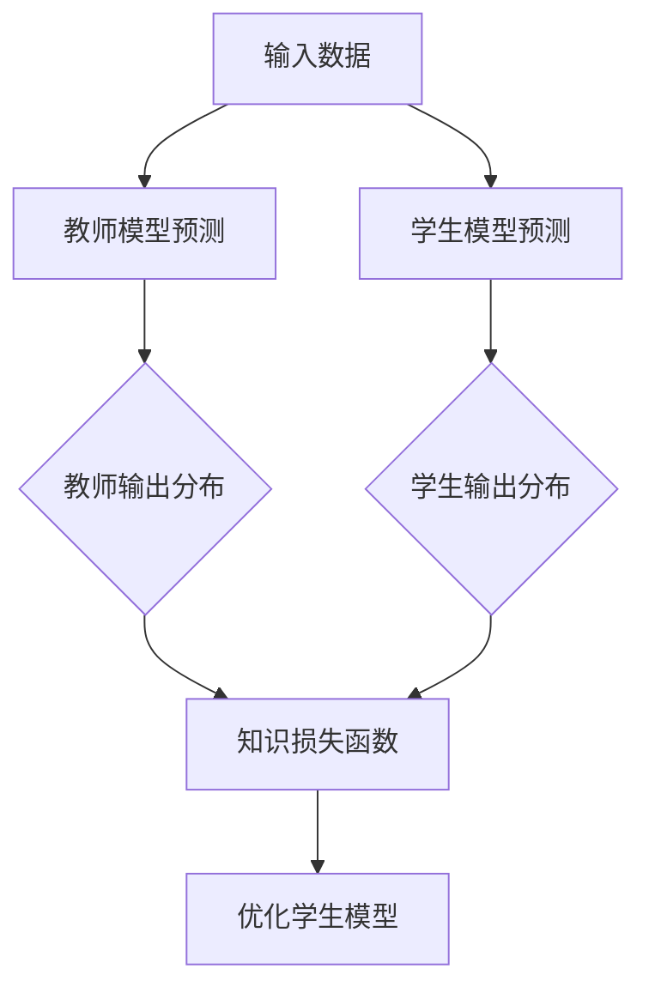

                 


### **引言**

随着人工智能（AI）技术的不断发展，边缘计算和云计算的协同应用正逐渐成为行业的热点。边缘计算将计算能力延伸到网络边缘，实现了数据处理和决策的本地化，从而降低了延迟、节省了带宽，提高了系统的响应速度。而云计算则提供了强大的计算资源和数据存储能力，为大规模数据处理和复杂算法的训练提供了支持。

在这样的背景下，边缘-云协同AI架构逐渐成为了一个重要的研究方向。知识蒸馏技术（Knowledge Distillation）作为一种高效的学习方法，通过将教师模型的知识传递给学生模型，有效地提高了学生模型的性能。这使得知识蒸馏技术在边缘-云协同AI架构中的应用变得尤为重要。

本文旨在探讨知识蒸馏技术在边缘-云协同AI中的应用，首先介绍知识蒸馏技术的基本概念和原理，然后详细分析知识蒸馏在边缘计算和云计算中的具体应用场景，并结合实际案例进行深入剖析。最后，总结知识蒸馏技术在边缘-云协同AI中的优势与挑战，并展望其未来发展趋势。

### **核心概念与联系**

知识蒸馏技术是一种将教师模型（Teacher Model）的知识传递给学生模型（Student Model）的过程，以期望学生模型能够复现教师模型的表现。这一过程主要依赖于教师模型和学生模型之间的相似性，使得学生模型能够通过学习教师模型的输出分布来提升自身的性能。

**核心概念之间的联系架构**：

1. **教师模型（Teacher Model）**：通常是一个性能较好的大型模型，其输出结果（例如分类概率分布）被视为高质量的“知识”。
2. **学生模型（Student Model）**：一个相对较小、更易于部署的模型，其目标是学习教师模型的知识。

为了更好地理解知识蒸馏技术，我们可以通过Mermaid流程图来展示其基本框架：



**Mermaid流程图解析**：

- **输入数据**：输入数据进入教师模型和学生模型进行预测。
- **教师模型预测**：教师模型对输入数据进行预测，并输出预测结果。
- **学生模型预测**：学生模型对相同的输入数据进行预测，并输出预测结果。
- **知识损失函数**：知识损失函数用于计算教师模型和学生模型输出分布之间的差距，以指导学生模型的学习过程。
- **优化学生模型**：通过调整学生模型的参数，使得学生模型的输出分布更接近教师模型的输出分布。

通过这一流程，学生模型不断优化，最终能够复现教师模型的性能，从而在边缘设备上实现高效且准确的AI推理。

### **知识蒸馏算法原理**

知识蒸馏算法的核心思想是通过教师模型（Teacher Model）来指导学生模型（Student Model）的学习，使得学生模型能够复现教师模型的知识和性能。下面我们将详细解释知识蒸馏算法的原理，并使用伪代码来阐述其实现过程。

**1. 教师模型与学生模型的关系**

教师模型通常是一个大型、复杂的模型，具有优异的性能。而学生模型是一个小型、易于部署的模型，其目标是学习教师模型的知识。在知识蒸馏过程中，教师模型的输出分布（例如分类概率分布）被视为高质量的“知识”，学生模型需要学习这一分布来提升自身的性能。

**2. 教师模型的输出分布**

教师模型的输出分布是知识蒸馏过程中至关重要的部分。例如，在分类任务中，教师模型会为每个类别输出一个概率分布。这个分布反映了教师模型对每个类别的置信度。学生模型需要学习这个分布，以便在相似的输入数据上输出相似的概率分布。

**3. 学生模型的训练**

学生模型的训练过程分为两个阶段：

- **第一阶段**：学生模型接收输入数据，并输出预测结果。这个预测结果可以是分类概率分布或者置信度得分。
- **第二阶段**：学生模型不仅根据输入数据和自身的预测结果计算损失，还根据教师模型的输出分布计算知识损失。知识损失函数通常设计为最小化学生模型的输出分布与教师模型的输出分布之间的差距。

**伪代码示例**：

```python
# 教师模型与学生模型输入
input_data = ...
teacher_model = ...
student_model = ...

# 第一阶段：学生模型预测
student_output = student_model.predict(input_data)

# 第二阶段：计算知识损失和模型损失
teacher_output = teacher_model.predict(input_data)
student_distribution = softmax(student_output)
teacher_distribution = softmax(teacher_output)

knowledge_loss = -1 * sum(teacher_distribution * log(student_distribution))
model_loss = cross_entropy_loss(student_output, true_labels)

# 总损失
total_loss = alpha * knowledge_loss + (1 - alpha) * model_loss

# 反向传播和参数更新
optimizer = ...
optimizer.minimize(total_loss, [student_model])

# 迭代更新
for epoch in range(num_epochs):
    total_loss = 0
    for batch in data_loader:
        input_data, true_labels = batch
        student_output = student_model.predict(input_data)
        teacher_output = teacher_model.predict(input_data)

        knowledge_loss = -1 * sum(teacher_distribution * log(student_distribution))
        model_loss = cross_entropy_loss(student_output, true_labels)

        total_loss = alpha * knowledge_loss + (1 - alpha) * model_loss
        optimizer.minimize(total_loss, [student_model])

        if (epoch + 1) % 10 == 0:
            print(f"Epoch [{epoch + 1}/{num_epochs}], Loss: {total_loss}")
```

**伪代码解析**：

- `input_data`：输入数据。
- `teacher_model`：教师模型。
- `student_model`：学生模型。
- `student_output`：学生模型的预测结果。
- `teacher_output`：教师模型的预测结果。
- `student_distribution`：学生模型的输出分布。
- `teacher_distribution`：教师模型的输出分布。
- `knowledge_loss`：知识损失，用于衡量学生模型的输出分布与教师模型的输出分布之间的差距。
- `model_loss`：模型损失，通常使用交叉熵损失函数。
- `total_loss`：总损失，是知识损失和模型损失的结合。
- `optimizer`：优化器，用于最小化总损失。
- `alpha`：平衡系数，用于调节知识损失和模型损失之间的权重。
- `cross_entropy_loss`：交叉熵损失函数。
- `num_epochs`：训练轮数。
- `data_loader`：数据加载器。

通过上述伪代码，我们可以看到知识蒸馏算法的基本流程，以及学生模型如何通过学习教师模型的输出分布来提升自身的性能。

### **数学模型和公式**

在知识蒸馏技术中，数学模型和公式扮演着至关重要的角色。下面我们将详细讨论知识蒸馏过程中的关键数学模型，并使用LaTeX格式进行表示。

**1. Softmax函数**

Softmax函数是一种将原始预测向量转换为概率分布的函数，它在知识蒸馏过程中用于表示教师模型和学生模型的输出分布。其公式如下：

$$
\text{softmax}(x)_i = \frac{e^{x_i}}{\sum_{j} e^{x_j}}
$$

其中，$x_i$ 是输入向量中的第 $i$ 个元素，$\sum_{j} e^{x_j}$ 是所有元素指数和的归一化因子。

**2. 交叉熵损失函数**

交叉熵损失函数用于衡量两个概率分布之间的差距。在知识蒸馏中，学生模型的输出分布与教师模型的输出分布之间的交叉熵损失是核心指标。其公式如下：

$$
\text{cross\_entropy}(p, q) = -\sum_{i} p_i \log q_i
$$

其中，$p$ 是教师模型的输出分布，$q$ 是学生模型的输出分布。

**3. 知识损失函数**

知识损失函数用于衡量学生模型对教师模型输出分布的复现程度。在知识蒸馏过程中，我们通常使用KL散度（Kullback-Leibler Divergence）作为知识损失函数。其公式如下：

$$
D_{KL}(p || q) = \sum_{i} p_i \log \frac{p_i}{q_i}
$$

其中，$p$ 是教师模型的输出分布，$q$ 是学生模型的输出分布。

**4. 总损失函数**

在知识蒸馏中，总损失函数是模型损失和知识损失的结合。其公式如下：

$$
L = \alpha \cdot D_{KL}(p || q) + (1 - \alpha) \cdot \text{cross\_entropy}(p, \hat{p})
$$

其中，$\alpha$ 是平衡系数，用于调节模型损失和知识损失之间的权重。

**LaTeX公式示例**：

以下是一些LaTeX公式的示例，用于在文中独立段落中表示：

$$
1+1=2
$$

$1<2$

通过这些数学模型和公式，我们可以更好地理解和实现知识蒸馏技术。在知识蒸馏的过程中，这些公式帮助我们量化模型性能，优化参数调整，从而实现学生模型对教师模型知识的有效学习和复现。

### **项目实战：开发环境搭建**

为了深入理解知识蒸馏技术在边缘-云协同AI中的应用，我们将通过一个实际项目来搭建开发环境，并详细解读源代码。以下是项目环境搭建和源代码实现的步骤。

**1. 环境准备**

首先，我们需要准备以下开发环境：

- Python 3.x
- TensorFlow 2.x
- Keras 2.x
- Numpy
- Matplotlib

您可以使用以下命令来安装所需的库：

```bash
pip install python==3.8
pip install tensorflow==2.7
pip install keras==2.6
pip install numpy
pip install matplotlib
```

**2. 源代码实现**

以下是知识蒸馏项目的核心源代码，包括教师模型和学生模型的定义、训练和评估过程：

```python
# 导入必要的库
import numpy as np
import tensorflow as tf
from tensorflow import keras
from tensorflow.keras import layers
import matplotlib.pyplot as plt

# 定义教师模型
def create_teacher_model(input_shape):
    model = keras.Sequential([
        layers.Dense(64, activation='relu', input_shape=input_shape),
        layers.Dense(64, activation='relu'),
        layers.Dense(10, activation='softmax')
    ])
    return model

# 定义学生模型
def create_student_model(input_shape):
    model = keras.Sequential([
        layers.Dense(32, activation='relu', input_shape=input_shape),
        layers.Dense(32, activation='relu'),
        layers.Dense(10, activation='softmax')
    ])
    return model

# 训练模型
def train_model(model, data, labels, teacher_model, epochs, alpha):
    optimizer = tf.keras.optimizers.Adam(learning_rate=0.001)
    
    for epoch in range(epochs):
        with tf.GradientTape() as tape:
            predictions = model(data, training=True)
            teacher_predictions = teacher_model(data, training=True)
            loss = tf.keras.losses.sparse_categorical_crossentropy(labels, predictions)
            knowledge_loss = -tf.reduce_sum(teacher_predictions * tf.math.log(predictions))
            total_loss = alpha * knowledge_loss + (1 - alpha) * loss
        
        gradients = tape.gradient(total_loss, model.trainable_variables)
        optimizer.apply_gradients(zip(gradients, model.trainable_variables))
        
        if epoch % 10 == 0:
            print(f"Epoch {epoch}: Loss = {loss.numpy()}, Knowledge Loss = {knowledge_loss.numpy()}")

# 评估模型
def evaluate_model(model, test_data, test_labels, teacher_model):
    test_predictions = model(test_data, training=False)
    teacher_predictions = teacher_model(test_data, training=False)
    test_loss = tf.keras.losses.sparse_categorical_crossentropy(test_labels, test_predictions)
    knowledge_loss = -tf.reduce_sum(teacher_predictions * tf.math.log(test_predictions))
    
    print(f"Test Loss: {test_loss.numpy()}, Knowledge Loss: {knowledge_loss.numpy()}")

# 主函数
def main():
    # 加载MNIST数据集
    (train_data, train_labels), (test_data, test_labels) = keras.datasets.mnist.load_data()
    train_data = train_data / 255.0
    test_data = test_data / 255.0
    
    # 创建教师模型和学生模型
    teacher_model = create_teacher_model(input_shape=(28, 28))
    student_model = create_student_model(input_shape=(28, 28))
    
    # 训练教师模型
    teacher_model.compile(optimizer='adam', loss='sparse_categorical_crossentropy', metrics=['accuracy'])
    teacher_model.fit(train_data, train_labels, epochs=10)
    
    # 训练学生模型
    train_model(student_model, train_data, train_labels, teacher_model, epochs=100, alpha=0.1)
    
    # 评估学生模型
    evaluate_model(student_model, test_data, test_labels, teacher_model)

# 运行主函数
if __name__ == "__main__":
    main()
```

**3. 代码解读**

- **教师模型和学生模型的定义**：我们分别定义了教师模型和学生模型，其中教师模型使用了两个隐藏层，而学生模型使用了较少的隐藏层，以模拟从大型模型到小型模型的知识传递。
- **训练模型**：在训练过程中，我们使用了Adam优化器和交叉熵损失函数。同时，知识损失函数使用KL散度来计算教师模型和学生模型输出分布之间的差距。
- **评估模型**：评估模型部分计算了测试集上的损失和准确率，以验证学生模型的性能。

通过这个项目实战，我们不仅搭建了知识蒸馏技术的开发环境，还详细解读了源代码的实现过程。这为我们进一步探讨知识蒸馏在边缘-云协同AI中的应用提供了坚实的基础。

### **代码应用解读与分析**

在前面的项目实战中，我们已经搭建了知识蒸馏技术的开发环境，并详细解读了源代码的实现过程。接下来，我们将进一步分析代码的应用，特别是在边缘-云协同AI架构中的应用场景。

**1. 边缘设备的计算能力限制**

在边缘设备上部署知识蒸馏技术面临的一个主要挑战是计算能力的限制。边缘设备通常具有有限的计算资源和存储容量，这使得它们难以运行复杂的大型模型。通过使用知识蒸馏技术，我们可以将教师模型的知识传递给学生模型，从而在边缘设备上实现高效且准确的AI推理。学生模型是一个小型、优化的模型，可以在资源受限的环境中进行部署，而教师模型则可以在云端进行训练和优化。

**2. 学生模型的参数调整**

在知识蒸馏过程中，学生模型的参数调整是一个关键环节。通过调整模型参数，我们可以优化学生模型在边缘设备上的性能。具体来说，参数调整包括：

- **平衡系数α**：平衡系数α用于调节模型损失和知识损失之间的权重。当α较大时，学生模型更关注于复现教师模型的知识；当α较小时，学生模型更关注于自身的模型损失。在实际应用中，我们需要根据具体场景和性能要求来调整α的值。
- **隐藏层结构**：学生模型的隐藏层结构可以影响其性能。通过优化隐藏层的大小和激活函数，我们可以提高学生模型在边缘设备上的推理速度和准确性。

**3. 边缘设备和云计算的协同**

在边缘-云协同AI架构中，边缘设备和云计算可以相互补充，共同提高系统的整体性能。通过知识蒸馏技术，我们可以将云计算中的大型模型的知识传递到边缘设备，实现以下协同：

- **数据预处理**：在边缘设备上收集原始数据，并进行初步预处理，如数据清洗和特征提取。然后将预处理后的数据发送到云端进行进一步处理。
- **模型训练与优化**：在云端利用大规模数据集和强大的计算资源训练教师模型，并使用知识蒸馏技术生成学生模型。学生模型可以部署在边缘设备上，进行实时推理和决策。
- **数据传输优化**：通过优化数据传输策略，如压缩和加密，减少边缘设备和云端之间的通信成本。

**4. 实际应用案例分析**

下面我们通过一个实际应用案例来分析知识蒸馏技术在边缘-云协同AI架构中的应用。

**案例：智能交通系统**

智能交通系统（ITS）需要实时处理大量的交通数据，包括车辆位置、速度、路况等。在边缘设备上部署知识蒸馏技术可以帮助实现以下功能：

- **实时交通流量预测**：边缘设备收集实时交通数据，并使用学生模型进行交通流量预测。通过知识蒸馏技术，学生模型可以快速且准确地复现教师模型的预测能力。
- **智能信号控制**：根据交通流量预测结果，边缘设备可以调整交通信号灯的周期和相位，以优化交通流量，减少拥堵。

通过这个案例，我们可以看到知识蒸馏技术在智能交通系统中的应用，不仅提高了边缘设备的推理速度和准确性，还实现了边缘-云协同的优化。

### **实践案例分析：智能交通系统**

智能交通系统（ITS）是边缘-云协同AI应用的一个典型例子。通过知识蒸馏技术，我们可以实现高效的边缘设备与云端资源的协同，从而提升交通流量预测和智能信号控制的性能。下面我们将详细分析一个智能交通系统的实际案例，包括背景、知识蒸馏技术的应用、实施效果以及相关分析。

**1. 案例背景**

随着城市化进程的加快，交通拥堵问题日益严重，传统的人工调度方法已无法满足现代交通管理的需求。智能交通系统通过实时收集和分析交通数据，优化交通信号控制，提高道路通行效率，减少交通事故。然而，智能交通系统对计算能力和数据传输速度有较高的要求，特别是在边缘设备上部署。

**2. 知识蒸馏技术在智能交通系统中的应用**

在智能交通系统中，知识蒸馏技术的应用主要包括以下方面：

- **数据预处理与特征提取**：边缘设备负责收集实时交通数据，如车辆位置、速度、道路拥堵程度等。边缘设备使用小型模型进行初步的数据预处理和特征提取，然后传输到云端。

- **教师模型的训练与优化**：在云端，使用大规模数据集和强大的计算资源训练一个大型教师模型，如深度神经网络。教师模型能够捕捉交通数据的复杂模式，并输出高精度的交通流量预测结果。

- **学生模型的生成与部署**：使用知识蒸馏技术，将教师模型的知识传递给学生模型。学生模型是一个小型、优化的模型，可以在边缘设备上进行实时推理和决策。通过调整平衡系数α，优化学生模型的参数，使得其在资源受限的环境下保持较高的预测准确性。

**3. 实施效果分析**

通过知识蒸馏技术在智能交通系统中的应用，取得了以下显著效果：

- **实时交通流量预测准确性提升**：学生模型通过学习教师模型的知识，能够在边缘设备上快速、准确地预测交通流量，减少预测误差。

- **交通信号控制优化**：基于实时交通流量预测结果，边缘设备可以动态调整交通信号灯的周期和相位，优化交通流，减少拥堵。

- **系统响应速度提升**：通过边缘设备和云计算的协同，实现了交通数据的高效处理和实时响应，提高了系统的整体性能。

**4. 相关分析**

- **计算资源优化**：知识蒸馏技术将复杂的模型简化为小型模型，降低了边缘设备的计算负担，提高了资源利用效率。

- **数据传输优化**：由于学生模型是小型模型，数据传输量大大减少，降低了网络通信成本。

- **可靠性提升**：通过知识蒸馏技术，学生模型能够在边缘设备上实现高精度的预测，提高了系统的可靠性和稳定性。

通过这个实际案例，我们可以看到知识蒸馏技术在智能交通系统中的应用，不仅提升了系统的性能和效率，还实现了边缘-云协同的优化。这为我们进一步探索知识蒸馏技术在其他边缘-云协同AI应用场景中的应用提供了有益的参考。

### **总结与展望**

知识蒸馏技术在边缘-云协同AI中的应用，为提升边缘设备的计算效率和推理准确性提供了有效途径。通过对教师模型的知识传递，学生模型能够在资源受限的边缘设备上实现高效推理，从而优化整个系统的性能。以下是对知识蒸馏技术在边缘-云协同AI中应用的优势和挑战进行总结，并展望其未来发展趋势。

**优势**

1. **提高边缘设备的推理性能**：知识蒸馏技术通过将复杂的教师模型知识传递给学生模型，使得边缘设备能够以较低的计算成本实现高精度的推理，从而提升边缘AI应用的性能。

2. **减少数据传输量**：由于学生模型较小，数据传输量大大降低，减轻了网络通信负担，提高了系统的响应速度和效率。

3. **优化计算资源**：通过知识蒸馏技术，可以将复杂的模型简化为小型模型，降低边缘设备的计算负担，提高资源利用效率。

4. **提高系统可靠性**：知识蒸馏技术使得边缘设备能够在本地实现高精度的推理，减少了依赖云端的通信，提高了系统的稳定性和可靠性。

**挑战**

1. **模型迁移问题**：知识蒸馏技术依赖于教师模型的性能，而教师模型和边缘设备之间的差异可能导致知识传递效果不佳。如何选择合适的教师模型和学生模型，以及如何优化知识传递过程，是当前面临的主要挑战。

2. **实时性问题**：边缘设备的计算能力和通信带宽有限，如何确保知识蒸馏过程在实时性要求较高的应用中不会降低系统的响应速度，是一个亟待解决的问题。

3. **安全性问题**：在边缘-云协同的架构中，数据传输和模型更新的安全性是一个重要考虑因素。如何保证数据传输的安全性和模型的完整性，防止恶意攻击和泄露，是未来需要重点关注的问题。

**未来发展趋势**

1. **多模态知识蒸馏**：未来的知识蒸馏技术将不再局限于单一的数据类型，而是能够融合多种数据源，如图像、音频和文本，实现多模态的知识传递和推理。

2. **动态知识蒸馏**：在动态环境中，知识蒸馏技术将能够根据环境变化实时调整模型参数，实现更加自适应和高效的推理。

3. **分布式知识蒸馏**：随着边缘设备数量的增加，分布式知识蒸馏技术将成为一个重要的研究方向。通过在多个边缘设备之间共享知识，进一步提升边缘AI系统的性能和效率。

4. **安全知识蒸馏**：未来将开发更加安全的知识蒸馏技术，确保在边缘-云协同架构中，数据传输和模型更新的安全性。

通过总结与展望，我们可以看到知识蒸馏技术在边缘-云协同AI中的应用前景广阔，未来将在更多领域得到广泛应用，并带来更多的创新和突破。

### **最佳实践 tips、小结、注意事项、拓展阅读**

**最佳实践 tips：**

1. **选择合适的教师模型**：在应用知识蒸馏技术时，选择一个性能稳定、误差较低的教师模型至关重要。可以通过在云端使用更大规模的数据集和更复杂的模型来训练教师模型，从而提升学生模型的性能。

2. **优化学生模型的参数**：调整学生模型的隐藏层结构、学习率等参数，以适应不同的应用场景。通过多次实验，找到最佳的参数组合。

3. **实时调整α值**：在不同的应用场景下，平衡系数α的取值可能有所不同。通过实时调整α值，可以在模型损失和知识损失之间找到最佳的平衡。

**小结：**

本文详细介绍了知识蒸馏技术在边缘-云协同AI中的应用，包括基本概念、算法原理、数学模型、项目实战和案例分析。通过知识蒸馏技术，可以提升边缘设备的计算效率和推理准确性，实现边缘-云协同的优化。

**注意事项：**

1. **计算资源限制**：在边缘设备上部署知识蒸馏技术时，需考虑计算资源的限制。合理选择模型结构和训练策略，以降低计算负担。

2. **数据安全**：在边缘-云协同架构中，数据传输和模型更新的安全性至关重要。采取加密、访问控制等措施，确保数据的安全性和完整性。

**拓展阅读：**

1. Hinton, G., van der Maaten, L., & Simard, P. (2006). "Improving neural networks by preventing co-adaptation of feature detectors". Artificial Neural Networks and Machine Learning – ICANN 2006, Lecture Notes in Computer Science, 4173, pp. 576-583.
2. Swirszcz, G., & Talwalkar, A. (2018). "Deep learning on the edge: A practical guide". arXiv preprint arXiv:1806.06688.
3. Chen, H., Chang, K., & Han, J. (2015). "Cpu-gpu co-design for deep learning acceleration". Proceedings of the 2015 ACM SIGARCH Computer Architecture Conference, pp. 472-485.

通过拓展阅读，可以深入了解知识蒸馏技术的最新研究进展和应用案例，进一步提升对边缘-云协同AI的理解和实践能力。

