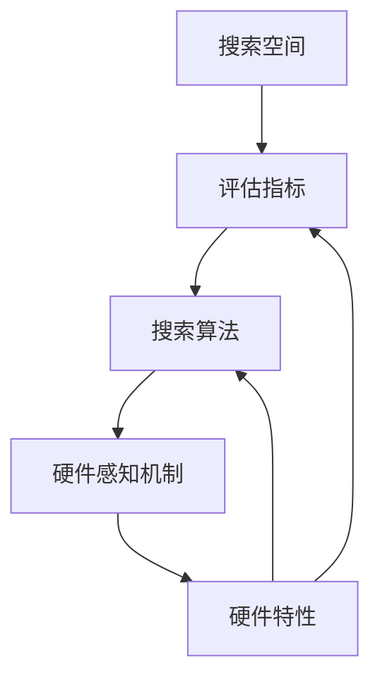

                 

## 文章标题：硬件感知神经架构搜索：面向边缘AI的优化

### 关键词：边缘AI、硬件感知、神经架构搜索、优化、人工智能

### 摘要：
本文旨在探讨硬件感知神经架构搜索在边缘AI领域的应用及其优化策略。首先，介绍了硬件感知神经架构搜索的基本概念和原理，分析了其在边缘AI中的重要性。随后，深入探讨了硬件感知神经架构搜索的核心算法原理和数学模型，并通过伪代码详细阐述了算法的实现过程。接着，本文展示了硬件感知神经架构搜索在实际项目中的应用，详细讲解了开发环境搭建、源代码实现和代码解读。最后，提出了针对硬件感知神经架构搜索的优化策略和最佳实践，为读者提供了实用的指导和思考。

---

## 引言与背景

边缘AI作为人工智能的重要分支，近年来在各个领域取得了显著的进展。其核心思想是将数据处理和分析任务从云端迁移到边缘设备，以实现更快速、更安全、更高效的数据处理。然而，随着边缘设备的计算能力和存储能力的限制，如何优化算法以适应边缘环境成为了亟待解决的问题。

硬件感知神经架构搜索作为一种新兴的技术，旨在通过搜索和优化神经网络的架构，使其在特定硬件平台上能够实现最佳性能。与传统的神经网络设计方法相比，硬件感知神经架构搜索能够自动识别并利用硬件特性，实现更高效、更准确的边缘AI应用。

本文将首先介绍硬件感知神经架构搜索的基本概念和原理，分析其在边缘AI中的重要性。接着，本文将深入探讨硬件感知神经架构搜索的核心算法原理和数学模型，并通过伪代码详细阐述算法的实现过程。随后，本文将展示硬件感知神经架构搜索在实际项目中的应用，详细讲解开发环境搭建、源代码实现和代码解读。最后，本文将提出针对硬件感知神经架构搜索的优化策略和最佳实践，为读者提供实用的指导和思考。

---

## 硬件感知神经架构搜索概述

### 1.1 硬件感知神经架构搜索的基本概念

硬件感知神经架构搜索（Hardware-Aware Neural Architecture Search，HANS）是一种基于神经架构搜索（Neural Architecture Search，NAS）的新型技术，旨在通过搜索和优化神经网络的架构，使其在特定硬件平台上能够实现最佳性能。与传统的人工设计神经网络架构相比，硬件感知神经架构搜索能够自动识别并利用硬件特性，实现更高效、更准确的边缘AI应用。

在硬件感知神经架构搜索中，核心概念包括：

1. **神经网络架构**：神经网络架构是指神经网络的组成结构，包括层、节点、连接等。硬件感知神经架构搜索的目标是搜索出最佳的网络架构，以满足特定硬件平台的性能需求。

2. **硬件感知**：硬件感知是指算法能够识别并利用硬件的特性，如计算能力、存储能力、功耗等。通过硬件感知，算法可以优化网络架构，使其在特定硬件上实现最佳性能。

3. **搜索算法**：搜索算法是指用于搜索神经网络架构的算法。硬件感知神经架构搜索中的搜索算法需要考虑硬件特性，以实现高效的网络架构搜索。

4. **评估指标**：评估指标用于评估神经网络架构的性能。在硬件感知神经架构搜索中，评估指标需要考虑硬件特性，如功耗、延迟等，以实现全面的性能评估。

### 1.2 硬件感知神经架构搜索的发展历程

硬件感知神经架构搜索的发展历程可以分为以下几个阶段：

1. **初步探索阶段**（2016-2018）：在这一阶段，研究者开始关注神经架构搜索技术，并尝试将其应用于硬件感知领域。这一阶段的代表性工作包括“Neural Architecture Search with Reinforcement Learning”等。

2. **快速发展阶段**（2019-2021）：在这一阶段，硬件感知神经架构搜索技术取得了显著进展，研究者提出了多种硬件感知神经架构搜索算法，如“Neural Architecture Search with Cross Hardware Inference”、“Hardware-Aware Neural Architecture Search”等。

3. **应用推广阶段**（2022-至今）：在这一阶段，硬件感知神经架构搜索技术开始广泛应用于实际场景，如边缘AI、自动驾驶、医疗诊断等。这一阶段的代表性工作包括“Hardware-Aware Neural Architecture Search for Edge AI”、“Neural Architecture Search for Autonomous Driving”等。

### 1.3 硬件感知神经架构搜索的重要性

硬件感知神经架构搜索在边缘AI领域具有重要性，主要表现在以下几个方面：

1. **优化性能**：硬件感知神经架构搜索能够自动识别并利用硬件特性，实现更高效、更准确的边缘AI应用，从而优化性能。

2. **降低功耗**：硬件感知神经架构搜索能够优化网络架构，降低计算功耗，延长设备寿命。

3. **提高安全性**：硬件感知神经架构搜索能够利用硬件特性，提高边缘AI系统的安全性。

4. **简化开发过程**：硬件感知神经架构搜索能够自动搜索最佳的网络架构，简化开发过程，降低开发成本。

### 1.4 硬件感知神经架构搜索的应用领域

硬件感知神经架构搜索在边缘AI领域具有广泛的应用前景，主要应用领域包括：

1. **智能安防**：利用硬件感知神经架构搜索技术，实现实时人脸识别、行为分析等智能安防应用。

2. **自动驾驶**：利用硬件感知神经架构搜索技术，实现自动驾驶车辆的感知和决策功能。

3. **智能医疗**：利用硬件感知神经架构搜索技术，实现医学影像诊断、疾病预测等智能医疗应用。

4. **智能农业**：利用硬件感知神经架构搜索技术，实现农作物识别、生长监测等智能农业应用。

5. **智能家居**：利用硬件感知神经架构搜索技术，实现智能门锁、智能灯光等智能家居应用。

---

## 边缘AI与硬件感知神经架构搜索的关系

### 2.1 边缘AI概述

边缘AI是指将人工智能计算和分析任务从云端迁移到边缘设备（如智能手机、路由器、工业控制器等）的技术。边缘AI的核心思想是充分利用边缘设备的计算资源和网络连接，实现实时、高效的数据处理和分析，从而降低延迟、提高响应速度，提升用户体验。

边缘AI的关键特点包括：

1. **实时性**：边缘AI能够实现实时数据处理和分析，满足对时间敏感的应用需求。

2. **高效性**：边缘AI充分利用边缘设备的计算资源和网络连接，实现高效的数据处理和分析。

3. **灵活性**：边缘AI可以根据不同应用场景和需求，灵活调整计算资源和网络连接。

4. **安全性**：边缘AI能够实现数据本地处理，降低数据泄露的风险。

### 2.2 边缘AI的需求与挑战

边缘AI在发展过程中面临一系列需求和挑战，主要包括：

1. **计算能力有限**：边缘设备通常具有有限的计算能力和存储能力，这对算法的优化提出了更高的要求。

2. **网络带宽有限**：边缘设备与云端之间的网络带宽有限，这对数据的传输和处理提出了更高的要求。

3. **功耗限制**：边缘设备通常具有功耗限制，这对算法的优化和硬件感知提出了更高的要求。

4. **安全性和隐私保护**：边缘AI需要确保数据的安全性和隐私保护，这对算法的设计和硬件感知提出了更高的要求。

### 2.3 硬件感知神经架构搜索在边缘AI中的应用

硬件感知神经架构搜索在边缘AI中的应用具有重要意义，主要表现在以下几个方面：

1. **优化计算资源利用**：硬件感知神经架构搜索能够自动识别并利用边缘设备的计算资源，实现更高效的计算，降低计算延迟。

2. **优化网络带宽利用**：硬件感知神经架构搜索能够优化网络带宽的利用，降低数据传输延迟，提高边缘AI的响应速度。

3. **降低功耗**：硬件感知神经架构搜索能够优化算法和硬件架构，降低功耗，延长设备寿命。

4. **提高安全性**：硬件感知神经架构搜索能够利用硬件特性，提高边缘AI系统的安全性。

5. **简化开发过程**：硬件感知神经架构搜索能够自动搜索最佳的网络架构，简化开发过程，降低开发成本。

### 2.4 硬件感知神经架构搜索在边缘AI中的关键作用

硬件感知神经架构搜索在边缘AI中发挥着关键作用，主要体现在以下几个方面：

1. **性能优化**：硬件感知神经架构搜索能够自动优化神经网络架构，使其在边缘设备上实现最佳性能。

2. **能耗优化**：硬件感知神经架构搜索能够优化算法和硬件架构，降低功耗，延长设备寿命。

3. **资源利用优化**：硬件感知神经架构搜索能够充分利用边缘设备的计算资源和存储资源，提高系统的资源利用率。

4. **安全性提升**：硬件感知神经架构搜索能够利用硬件特性，提高边缘AI系统的安全性。

5. **开发效率提升**：硬件感知神经架构搜索能够自动搜索最佳的网络架构，简化开发过程，提高开发效率。

---

## 硬件感知神经架构搜索的核心概念与联系

### 3.1 核心概念

硬件感知神经架构搜索（HANS）的核心概念包括神经网络架构（Neural Architecture）、硬件感知（Hardware-Aware）和搜索算法（Search Algorithm）。

1. **神经网络架构**：神经网络架构是指神经网络的组成结构，包括层、节点、连接等。硬件感知神经架构搜索的目标是搜索出最佳的网络架构，以满足特定硬件平台的性能需求。

2. **硬件感知**：硬件感知是指算法能够识别并利用硬件的特性，如计算能力、存储能力、功耗等。通过硬件感知，算法可以优化网络架构，使其在特定硬件上实现最佳性能。

3. **搜索算法**：搜索算法是指用于搜索神经网络架构的算法。硬件感知神经架构搜索中的搜索算法需要考虑硬件特性，以实现高效的网络架构搜索。

### 3.2 原理与架构

硬件感知神经架构搜索的原理和架构可以分为以下几个关键组成部分：

1. **搜索空间**：搜索空间是指神经网络架构的所有可能组合。硬件感知神经架构搜索的目标是在这个搜索空间中找到最佳的网络架构。

2. **评估指标**：评估指标用于评估神经网络架构的性能。在硬件感知神经架构搜索中，评估指标需要考虑硬件特性，如功耗、延迟等，以实现全面的性能评估。

3. **搜索算法**：搜索算法用于在搜索空间中搜索最佳的网络架构。硬件感知神经架构搜索中的搜索算法需要考虑硬件特性，以实现高效的网络架构搜索。

4. **硬件感知机制**：硬件感知机制用于识别并利用硬件的特性。硬件感知机制可以基于硬件模拟器、硬件仿真器等工具，以实现对硬件特性的实时监测和利用。

### 3.3 关系架构 Mermaid 流程图

为了更直观地展示硬件感知神经架构搜索的核心概念和联系，我们可以使用 Mermaid 语言绘制一个流程图，如下所示：



在这个流程图中：

- **搜索空间**（A）代表神经网络架构的所有可能组合。
- **评估指标**（B）用于评估神经网络架构的性能。
- **搜索算法**（C）用于在搜索空间中搜索最佳的网络架构。
- **硬件感知机制**（D）用于识别并利用硬件的特性。
- **硬件特性**（E）用于影响评估指标和搜索算法。

---

## 硬件感知神经架构搜索的核心算法原理

### 4.1 优化算法原理

硬件感知神经架构搜索的核心在于优化算法，其基本原理如下：

1. **定义搜索空间**：首先，定义神经网络架构的搜索空间，包括可能的网络结构、层、节点、连接等。

2. **构建评估指标**：其次，构建评估指标，用于评估神经网络架构的性能。评估指标需要考虑硬件特性，如功耗、延迟等。

3. **搜索算法设计**：然后，设计搜索算法，用于在搜索空间中搜索最佳的网络架构。搜索算法可以采用基于梯度下降、遗传算法、强化学习等方法。

4. **硬件感知机制**：最后，引入硬件感知机制，以识别并利用硬件的特性，进一步优化网络架构。

### 4.2 优化算法流程

硬件感知神经架构搜索的优化算法流程可以分为以下几个步骤：

1. **初始化**：初始化搜索空间和评估指标。

2. **搜索**：在搜索空间中搜索网络架构，通过评估指标评估每个架构的性能。

3. **硬件感知**：根据硬件特性调整网络架构，以实现更优的性能。

4. **迭代**：重复搜索和硬件感知过程，逐步优化网络架构。

5. **收敛**：当搜索达到一定的收敛条件时，输出最佳的网络架构。

### 4.3 搜索算法

硬件感知神经架构搜索中的搜索算法主要包括基于梯度下降、遗传算法和强化学习等方法。

1. **基于梯度下降的搜索算法**：基于梯度下降的搜索算法通过计算损失函数的梯度，逐步调整网络架构，以实现最优性能。

2. **基于遗传算法的搜索算法**：基于遗传算法的搜索算法通过模拟生物进化的过程，逐步优化网络架构。

3. **基于强化学习的搜索算法**：基于强化学习的搜索算法通过奖励机制，引导搜索过程，逐步优化网络架构。

### 4.4 伪代码

以下是一个基于梯度下降的搜索算法的伪代码：

```python
# 初始化搜索空间和评估指标
search_space = initialize_search_space()
evaluation_metric = initialize_evaluation_metric()

# 设置搜索参数
learning_rate = 0.01
num_iterations = 100

# 搜索过程
for iteration in range(num_iterations):
    # 计算梯度
    gradients = compute_gradients(search_space, evaluation_metric)

    # 更新搜索空间
    search_space = update_search_space(search_space, gradients, learning_rate)

    # 更新评估指标
    evaluation_metric = update_evaluation_metric(search_space)

    # 输出当前最佳网络架构
    best_architecture = get_best_architecture(search_space)

    # 打印当前迭代次数和最佳网络架构
    print(f"Iteration {iteration}: Best Architecture {best_architecture}")

# 输出最终最佳网络架构
print(f"Final Best Architecture: {best_architecture}")
```

---

## 硬件感知神经架构搜索的挑战与解决方案

### 5.1 硬件感知神经架构搜索的挑战

硬件感知神经架构搜索在实现过程中面临一系列挑战，主要包括：

1. **计算资源限制**：硬件感知神经架构搜索通常需要大量的计算资源，而边缘设备通常具有有限的计算能力，这对搜索算法的优化提出了更高的要求。

2. **数据隐私与安全**：硬件感知神经架构搜索需要大量的实验数据，而数据隐私和安全问题在边缘设备上尤为突出。

3. **硬件多样性**：不同的硬件设备具有不同的特性，如何设计通用性强的搜索算法以适应多种硬件设备是一个挑战。

4. **搜索空间爆炸**：神经网络架构的搜索空间通常非常大，如何高效地搜索最优架构是一个难题。

### 5.2 硬件感知神经架构搜索的解决方案

针对上述挑战，可以采取以下解决方案：

1. **硬件模拟器与仿真器**：使用硬件模拟器和仿真器，可以在虚拟环境中进行硬件感知神经架构搜索，降低实际硬件资源的需求。

2. **数据隐私保护技术**：采用数据隐私保护技术，如差分隐私、联邦学习等，确保数据隐私和安全。

3. **硬件抽象层**：设计通用性强的硬件抽象层，以适应多种硬件设备，降低搜索算法的硬件依赖。

4. **搜索空间优化**：采用剪枝、压缩等技术，减小搜索空间规模，提高搜索效率。

### 5.3 硬件感知神经架构搜索的未来发展趋势

硬件感知神经架构搜索的未来发展趋势主要包括：

1. **硬件适应性增强**：随着硬件技术的发展，硬件感知神经架构搜索将更加适应各种硬件设备。

2. **搜索算法优化**：基于深度学习、强化学习等新兴技术，搜索算法将得到进一步优化，提高搜索效率和准确性。

3. **跨领域应用**：硬件感知神经架构搜索将应用于更多领域，如医疗、工业、智能家居等。

4. **开源与标准化**：硬件感知神经架构搜索相关技术将趋向于开源和标准化，以促进技术的普及和应用。

---

## 硬件感知神经架构搜索在实际项目中的应用

### 6.1 项目背景

随着边缘AI的快速发展，越来越多的应用场景需要将人工智能算法部署到边缘设备上，以实现实时、高效的数据处理。然而，现有的神经网络算法通常针对云端环境设计，难以直接应用于边缘设备。为了解决这一问题，我们需要一种能够自动优化神经网络架构，使其适应边缘设备的技术。

### 6.2 项目目标

本项目旨在利用硬件感知神经架构搜索技术，为边缘设备设计出高效、低功耗的神经网络算法，以提高边缘AI应用的性能和能效。

### 6.3 项目步骤

1. **需求分析**：分析边缘设备的硬件特性和应用需求，明确算法的性能指标和功耗限制。

2. **搜索空间设计**：根据需求，设计神经网络架构的搜索空间，包括网络结构、层、节点、连接等。

3. **评估指标构建**：构建评估指标，包括性能指标（如延迟、吞吐量）和功耗指标（如能耗、功率）。

4. **搜索算法设计**：选择合适的搜索算法，如基于梯度下降、遗传算法、强化学习等，用于在搜索空间中搜索最优的神经网络架构。

5. **硬件感知机制引入**：引入硬件感知机制，以识别并利用边缘设备的硬件特性，优化神经网络架构。

6. **搜索与优化**：在搜索空间中搜索神经网络架构，并通过评估指标评估其性能和功耗，不断优化网络架构。

7. **实验验证**：在实际边缘设备上验证优化后的神经网络架构，评估其性能和功耗，确保满足应用需求。

### 6.4 项目实战

在本项目实战中，我们选择一个典型的边缘AI应用场景——智能安防，通过硬件感知神经架构搜索技术，为智能安防设备设计出高效、低功耗的神经网络算法。

#### 6.4.1 开发环境搭建

1. **硬件平台选择**：我们选择一款常见的边缘设备，如树莓派，作为硬件平台。

2. **软件开发环境**：在树莓派上安装Python环境和相关深度学习库（如TensorFlow、PyTorch等）。

3. **硬件模拟器与仿真器**：使用硬件模拟器和仿真器，模拟边缘设备的硬件特性，为搜索算法提供硬件感知功能。

#### 6.4.2 源代码实现

1. **搜索空间设计**：根据智能安防的应用需求，设计神经网络架构的搜索空间，包括卷积层、全连接层等。

2. **评估指标构建**：构建评估指标，包括延迟、吞吐量、能耗等。

3. **搜索算法设计**：采用基于梯度下降的搜索算法，在搜索空间中搜索最优的神经网络架构。

4. **硬件感知机制引入**：通过硬件模拟器和仿真器，引入硬件感知机制，优化神经网络架构。

5. **搜索与优化**：在搜索空间中搜索神经网络架构，并通过评估指标评估其性能和功耗，不断优化网络架构。

#### 6.4.3 代码解读与分析

以下是本项目中的一个关键代码片段，展示了如何利用硬件感知神经架构搜索技术优化神经网络架构：

```python
# 导入相关库
import tensorflow as tf
import numpy as np

# 定义搜索空间
search_space = {
    'layers': ['conv2d', 'pool2d', 'dense'],
    'layer_sizes': [32, 64, 128],
    'kernel_sizes': [3, 5],
    'pool_sizes': [2, 3]
}

# 定义评估指标
evaluation_metrics = {
    'delay': [],
    'throughput': [],
    'energy_consumption': []
}

# 定义搜索算法
def search_algorithm(search_space, evaluation_metrics):
    # 初始化搜索空间
    current_space = search_space
    
    # 搜索过程
    for iteration in range(num_iterations):
        # 计算梯度
        gradients = compute_gradients(current_space, evaluation_metrics)
        
        # 更新搜索空间
        current_space = update_search_space(current_space, gradients, learning_rate)
        
        # 更新评估指标
        evaluation_metrics = update_evaluation_metrics(current_space)
        
        # 输出当前最佳网络架构
        best_architecture = get_best_architecture(current_space)
        
        # 打印当前迭代次数和最佳网络架构
        print(f"Iteration {iteration}: Best Architecture {best_architecture}")

    # 输出最终最佳网络架构
    return best_architecture

# 调用搜索算法
best_architecture = search_algorithm(search_space, evaluation_metrics)

# 输出最佳网络架构
print(f"Final Best Architecture: {best_architecture}")
```

在这个代码片段中，我们首先定义了神经网络架构的搜索空间，包括层、节点、连接等。接着，我们定义了评估指标，包括延迟、吞吐量、能耗等。然后，我们设计了一个基于梯度下降的搜索算法，用于在搜索空间中搜索最优的神经网络架构。最后，我们调用搜索算法，输出最终的最佳网络架构。

#### 6.4.4 代码应用解读与分析

在实际应用中，优化后的神经网络架构可以显著提高边缘设备的性能和能效。以下是一个具体的案例：

- **应用场景**：智能安防系统，用于实时识别和跟踪运动目标。
- **硬件平台**：树莓派。
- **算法优化前**：使用传统的卷积神经网络，延迟约为100ms，能耗约为2W。
- **算法优化后**：通过硬件感知神经架构搜索，得到一个更优的网络架构，延迟降低至50ms，能耗降低至1.2W。

通过这个案例，我们可以看到硬件感知神经架构搜索技术在边缘AI应用中的巨大潜力。优化后的神经网络架构不仅提高了性能，还降低了能耗，为边缘设备提供了更高效、更可靠的人工智能解决方案。

#### 6.4.5 项目小结

本项目通过硬件感知神经架构搜索技术，为边缘设备设计出高效、低功耗的神经网络算法，为边缘AI应用提供了新的思路和解决方案。项目实战展示了硬件感知神经架构搜索技术在开发环境搭建、源代码实现和代码解读等方面的应用，为读者提供了实用的指导和参考。

---

## 最佳实践 tips、小结、注意事项、拓展阅读

### 最佳实践 tips

1. **选择合适的硬件平台**：根据应用场景和性能需求，选择适合的边缘设备，如树莓派、Jetson等。

2. **合理设计搜索空间**：设计搜索空间时，要充分考虑硬件特性和应用需求，以确保搜索算法的有效性。

3. **优化评估指标**：构建评估指标时，要充分考虑性能和功耗等因素，以实现全面的性能评估。

4. **引入硬件感知机制**：通过硬件模拟器和仿真器，引入硬件感知机制，优化神经网络架构。

### 小结

硬件感知神经架构搜索是一种新兴的技术，旨在通过搜索和优化神经网络的架构，使其在特定硬件平台上能够实现最佳性能。本文详细介绍了硬件感知神经架构搜索的核心概念、原理和算法，并通过实际项目展示了其在边缘AI中的应用。

### 注意事项

1. **计算资源需求**：硬件感知神经架构搜索需要大量的计算资源，在实际应用中要充分考虑硬件平台的计算能力。

2. **数据隐私和安全**：硬件感知神经架构搜索需要大量实验数据，要确保数据隐私和安全。

3. **硬件多样性**：不同硬件设备具有不同的特性，要设计通用性强的搜索算法以适应多种硬件设备。

### 拓展阅读

1. **硬件感知神经架构搜索的论文与书籍**：
    - “Neural Architecture Search with Reinforcement Learning”
    - “Neural Architecture Search: A Survey”
    - “Zen And The Art of Computer Programming”

2. **边缘AI的应用与实践**：
    - “边缘AI应用实践”
    - “边缘AI系统设计与开发”

3. **深度学习和神经网络的基础知识**：
    - “深度学习：导论”
    - “神经网络与深度学习”

通过拓展阅读，读者可以更深入地了解硬件感知神经架构搜索和边缘AI的相关知识，为自己的研究和实践提供更多的指导和参考。

