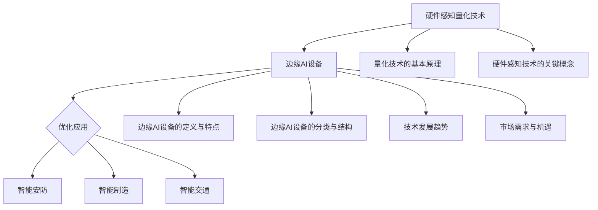

                 

### 文章标题：硬件感知量化技术在边缘AI设备中的优化应用

### 关键词：
- 硬件感知量化技术
- 边缘AI设备
- 优化应用
- 人工智能
- 边缘计算
- 量化算法

### 摘要：
本文探讨了硬件感知量化技术在边缘AI设备中的优化应用。首先，对硬件感知量化技术和边缘AI设备进行了详细的背景介绍，阐述了其在现代智能系统中的重要性和应用价值。接着，本文深入分析了硬件感知量化技术的基础理论，包括量化技术的基本原理和硬件感知的关键概念。然后，本文重点探讨了硬件感知量化技术在边缘AI设备中的应用，通过具体的案例展示了其在实际项目中的优化效果。最后，本文提出了未来硬件感知量化技术在边缘AI设备中面临的挑战与机遇，并对研究方向和优化策略提出了建议。

----------------------------------------------------------------

## 引言与背景介绍

随着人工智能技术的飞速发展，边缘AI设备在各个领域得到了广泛的应用。边缘AI设备是指在靠近数据源的地方进行数据处理和决策的智能设备，相较于传统的云计算模式，它能够实现更快的数据处理速度、更低的延迟和更高的安全性。然而，随着边缘AI设备的应用场景日益复杂，对硬件感知量化技术的要求也越来越高。

### 硬件感知量化技术概述

硬件感知量化技术是指通过量化和硬件感知的方式，将物理信号转换为数字信号，以便在边缘AI设备中进行处理和分析。这种技术利用了硬件的感知能力，实现了对环境的高效监测和响应。量化技术的历史可以追溯到20世纪初期，随着计算机技术的发展，量化技术逐渐成为计算机硬件和软件系统中的重要组成部分。

近年来，随着深度学习技术的兴起，硬件感知量化技术在边缘AI设备中的应用也越来越广泛。通过硬件感知量化技术，边缘AI设备能够实时获取环境信息，并快速做出响应，从而大大提高了系统的智能化水平。

### 边缘AI设备的发展背景

边缘AI设备的发展可以追溯到物联网（IoT）技术的兴起。物联网技术的核心在于将各种设备连接到互联网上，实现设备之间的数据交换和协同工作。随着5G技术的普及，物联网的应用场景变得更加丰富，边缘AI设备也逐渐成为物联网系统中的重要组成部分。

边缘AI设备的发展背景主要包括以下几个方面：

1. **数据需求的增长**：随着传感器技术的进步，边缘AI设备能够收集到大量的数据，这些数据需要快速处理和分析，以便做出实时决策。
2. **延迟的限制**：云计算模式虽然能够提供强大的计算能力，但其处理速度较慢，无法满足一些对实时性要求较高的应用场景。
3. **隐私和安全性的需求**：在某些应用场景中，数据需要在本地进行处理，以保护用户隐私和安全性。

### 硬件感知量化技术在边缘AI设备中的重要性

硬件感知量化技术在边缘AI设备中具有重要的作用，主要体现在以下几个方面：

1. **提升数据处理效率**：通过硬件感知量化技术，边缘AI设备能够实时获取环境信息，并快速做出响应，从而大大提高了系统的数据处理效率。
2. **降低延迟**：硬件感知量化技术能够将物理信号转换为数字信号，并在边缘AI设备中进行处理，从而减少了数据传输和处理的延迟。
3. **增强系统的智能性**：硬件感知量化技术使得边缘AI设备能够更好地理解环境，并做出更智能的决策。
4. **提高系统的可靠性**：硬件感知量化技术能够对硬件设备进行精确的监控和管理，从而提高了系统的可靠性和稳定性。

综上所述，硬件感知量化技术在边缘AI设备中具有重要的应用价值，是推动边缘AI设备发展的重要技术之一。

----------------------------------------------------------------

## 硬件感知量化技术基础

### 量化技术的基本原理

量化技术是计算机科学和信号处理领域中的一个重要概念，其基本原理是将连续的物理信号转换为离散的数字信号。这一过程通常涉及到两个关键步骤：采样和量化。

#### 采样

采样是指每隔固定的时间间隔，对连续信号进行一次测量。采样定理指出，为了能够无失真地重建原始信号，采样频率必须大于信号最高频率的两倍。常用的采样频率包括44.1kHz、96kHz等。

#### 量化

量化是指将采样得到的连续值转换为离散值。量化过程涉及到量化位数和量化范围。量化位数决定了数字信号的分辨率，常见的量化位数包括8位、12位、16位等。量化范围则决定了数字信号的最大和最小值，常见的量化范围包括±1、±3.3V、±5V等。

量化过程可以用以下公式表示：

$$
y = \text{round}(x \cdot \frac{Q}{F})
$$

其中，$x$ 表示采样值，$y$ 表示量化值，$Q$ 表示量化范围，$F$ 表示量化位数。

#### 量化技术的历史与现状

量化技术的历史可以追溯到20世纪初期，当时科学家们开始研究如何将模拟信号转换为数字信号。随着计算机技术的发展，量化技术逐渐成为计算机硬件和软件系统中的重要组成部分。

当前，量化技术已经广泛应用于各种领域，包括音频处理、图像处理、通信系统、传感器数据采集等。随着深度学习技术的兴起，量化技术也在人工智能领域得到了广泛的应用。

### 硬件感知技术的关键概念

硬件感知技术是指通过硬件设备感知环境中的各种信息，并将这些信息转换为数字信号的过程。硬件感知技术的关键概念包括传感器、信号采集和预处理等。

#### 传感器

传感器是硬件感知技术的核心组件，用于感知环境中的各种物理量，如温度、湿度、压力、光线等。传感器的种类繁多，常见的有温度传感器、湿度传感器、压力传感器、光电传感器等。

#### 信号采集

信号采集是指将传感器感知到的物理信号转换为电信号的过程。信号采集通常涉及到信号放大、滤波、采样和量化等步骤。信号采集的质量直接影响到后续数据处理和分析的效果。

#### 信号预处理

信号预处理是指对采集到的信号进行滤波、去噪、去偏置等处理，以便提取有用的信息。信号预处理是硬件感知技术中至关重要的一环，它能够提高信号的质量和可靠性。

### 硬件感知技术的优势与挑战

硬件感知技术具有以下几个优势：

1. **实时性**：硬件感知技术能够实时感知环境变化，并对环境进行响应，从而满足实时性要求较高的应用场景。
2. **高效性**：硬件感知技术能够快速处理大量数据，从而提高系统的处理效率。
3. **灵活性**：硬件感知技术可以根据不同的应用场景选择合适的传感器和信号处理算法，从而实现灵活的应用。

然而，硬件感知技术也面临着一些挑战：

1. **精度问题**：传感器的精度直接影响到硬件感知技术的精度，而传感器本身的精度往往受到环境因素的影响。
2. **稳定性问题**：硬件感知技术需要稳定的信号采集和处理系统，否则可能会影响系统的稳定性。
3. **能耗问题**：硬件感知技术通常需要消耗一定的能量，特别是在便携式设备中，能耗问题成为了一个重要的挑战。

### 硬件感知量化技术在边缘AI设备中的应用场景

硬件感知量化技术在边缘AI设备中具有广泛的应用场景，主要包括以下几类：

1. **智能安防**：通过传感器采集环境信息，实时监控安全状况，并在检测到异常情况时及时报警。
2. **智能制造**：通过传感器采集设备运行状态信息，实时监控设备运行情况，并预测设备故障。
3. **智能交通**：通过传感器采集交通流量信息，实时调整交通信号灯，优化交通流量。
4. **智能家居**：通过传感器采集家居环境信息，如温度、湿度、光线等，实现家居环境智能调节。

硬件感知量化技术在边缘AI设备中的应用，不仅提高了系统的实时性和智能化水平，还为各个行业提供了新的技术手段和解决方案。

----------------------------------------------------------------

## 边缘AI设备基础

### 边缘AI设备的定义与特点

边缘AI设备是指具备人工智能能力的计算设备，它能够直接部署在数据产生的地方，对数据进行实时处理和分析。与传统的云计算模式相比，边缘AI设备具有以下特点：

1. **本地处理**：边缘AI设备能够直接在本地进行数据处理，避免了数据传输的网络延迟和带宽限制。
2. **实时响应**：边缘AI设备能够实时处理数据，并对环境变化做出快速响应。
3. **安全性**：边缘AI设备的数据处理在本地完成，可以减少数据泄露的风险。
4. **灵活性**：边缘AI设备可以根据不同的应用场景和需求，灵活选择合适的硬件和软件配置。

### 边缘AI设备的分类与结构

边缘AI设备的分类可以根据不同的标准进行，以下是一些常见的分类方法：

1. **按处理能力分类**：
   - **轻量级边缘AI设备**：如智能传感器、物联网设备等，主要用于简单数据处理和决策。
   - **中量级边缘AI设备**：如工业物联网设备、智能摄像头等，能够进行复杂的数据处理和实时分析。
   - **重量级边缘AI设备**：如数据中心级别的计算设备，能够处理大规模数据和高性能计算任务。

2. **按部署位置分类**：
   - **固定边缘AI设备**：如工业生产线上的自动化设备、交通信号灯等，通常部署在固定的位置。
   - **移动边缘AI设备**：如车载计算设备、无人机等，能够在移动中进行数据处理和分析。

边缘AI设备的结构通常包括以下几个部分：

1. **计算模块**：负责执行AI算法和处理数据。
2. **存储模块**：用于存储数据和模型。
3. **感知模块**：包括各种传感器，用于采集环境信息。
4. **通信模块**：用于与其他设备进行数据交换和通信。

### 边缘AI设备的发展趋势

边缘AI设备的发展趋势主要体现在以下几个方面：

1. **性能提升**：随着硬件技术的发展，边缘AI设备的计算能力和存储能力不断提升，能够处理更复杂的数据和任务。
2. **功耗优化**：为了满足移动设备和便携式应用的需求，边缘AI设备的功耗逐渐降低，能效比不断提高。
3. **智能化**：随着深度学习和人工智能技术的进步，边缘AI设备逐渐具备自我学习和自我优化能力。
4. **安全性**：随着边缘AI设备的应用场景不断扩大，数据安全和隐私保护成为重要的发展方向。

### 技术发展趋势

1. **边缘计算与云计算的结合**：边缘计算和云计算的结合能够实现数据处理的高效协同，为复杂应用提供强大的计算支持。
2. **5G技术的普及**：5G技术的普及为边缘AI设备提供了更高的网络带宽和更低的延迟，进一步推动了边缘AI设备的发展。
3. **物联网技术的融合**：物联网技术的融合使得边缘AI设备能够与更多的设备互联，形成更加智能和高效的物联网生态系统。
4. **开源生态的繁荣**：随着开源生态的繁荣，边缘AI设备的开发和使用变得更加便捷和低成本。

### 市场需求与机遇

随着边缘AI技术在各个行业的应用不断深入，市场需求和机遇也在不断增长。以下是一些主要的市场需求和机遇：

1. **工业制造**：智能制造和工业4.0的发展，对边缘AI设备的需求越来越大。
2. **智能交通**：智能交通系统的发展，需要大量的边缘AI设备进行实时监控和交通管理。
3. **智慧城市**：智慧城市建设的推进，对边缘AI设备的需求不断增长，如智能安防、智能照明等。
4. **智能家居**：智能家居市场的快速增长，对边缘AI设备的需求持续增加。

总之，边缘AI设备的发展前景广阔，市场需求和机遇巨大，未来将在各个行业得到更广泛的应用。

----------------------------------------------------------------

## 硬件感知量化技术在边缘AI设备中的应用

### 硬件感知量化技术在边缘AI设备中的实现

硬件感知量化技术在边缘AI设备中的应用主要通过以下几个步骤实现：

1. **传感器采集**：边缘AI设备通过内置的传感器采集环境信息，如温度、湿度、压力、光线等。传感器将物理信号转换为电信号。

2. **信号预处理**：采集到的信号往往包含噪声和干扰，需要通过滤波、去噪、去偏置等预处理步骤，以提高信号的质量和可靠性。

3. **量化**：对预处理后的信号进行量化，将连续的模拟信号转换为离散的数字信号。量化过程涉及到采样和量化位数的配置。

4. **数据传输**：量化后的数字信号通过通信模块传输到边缘AI设备的主处理单元。

5. **数据处理**：主处理单元对传输过来的数据进行处理，包括特征提取、模式识别、预测等。

6. **决策与反馈**：根据处理结果，边缘AI设备做出决策，并通过执行机构实现反馈，如调整设备状态、发送警报等。

### 硬件感知量化技术在边缘AI设备中的优化策略

为了提高硬件感知量化技术在边缘AI设备中的性能，可以采取以下优化策略：

1. **硬件优化**：选择高性能、低功耗的传感器和处理器，提高系统的整体性能和能效比。

2. **信号预处理优化**：通过改进信号预处理算法，如使用更先进的滤波方法、更高效的去噪算法，提高信号质量。

3. **量化策略优化**：选择合适的量化位数和量化范围，以平衡精度和性能。

4. **数据压缩**：对传输的数据进行压缩，减少带宽占用，提高传输效率。

5. **边缘计算优化**：优化边缘AI设备的计算资源分配，提高数据处理效率。

### 硬件感知量化技术在边缘AI设备中的案例分析

以下是一些硬件感知量化技术在边缘AI设备中的应用案例：

#### 案例一：智能安防

在智能安防系统中，硬件感知量化技术被广泛应用于视频监控和人员识别。具体实现过程如下：

1. **传感器采集**：使用红外传感器和摄像头采集环境信息，包括视频和声音。
2. **信号预处理**：对视频和声音信号进行滤波、去噪等预处理。
3. **量化**：将预处理后的信号量化，转换为数字信号。
4. **数据处理**：通过边缘AI设备处理视频和声音信号，进行人员识别和异常行为检测。
5. **决策与反馈**：当检测到异常行为时，系统自动报警并记录视频证据。

#### 案例二：智能制造

在智能制造中，硬件感知量化技术被广泛应用于设备监控和故障预测。具体实现过程如下：

1. **传感器采集**：使用各种传感器监测设备运行状态，如温度、压力、振动等。
2. **信号预处理**：对传感器信号进行滤波、去噪等预处理。
3. **量化**：将预处理后的信号量化，转换为数字信号。
4. **数据处理**：通过边缘AI设备分析传感器数据，预测设备故障，并提前预警。
5. **决策与反馈**：根据分析结果，自动调整设备参数或进行设备维护。

#### 案例三：智能交通

在智能交通中，硬件感知量化技术被广泛应用于交通流量监测和信号控制。具体实现过程如下：

1. **传感器采集**：使用各种传感器监测交通流量，如流量传感器、摄像头等。
2. **信号预处理**：对传感器信号进行滤波、去噪等预处理。
3. **量化**：将预处理后的信号量化，转换为数字信号。
4. **数据处理**：通过边缘AI设备分析交通流量数据，实时调整交通信号灯，优化交通流量。
5. **决策与反馈**：根据分析结果，自动调整交通信号灯，减少交通拥堵。

这些案例展示了硬件感知量化技术在边缘AI设备中的广泛应用和优化策略，为各个行业提供了新的技术手段和解决方案。

----------------------------------------------------------------

## 优化应用案例分析

### 案例一：智能安防

在智能安防领域，硬件感知量化技术的优化应用极大地提高了系统的实时响应能力和准确性。以下是一个具体的优化应用案例分析：

#### 项目背景

某城市为了提升公共安全，决定在市区范围内部署智能安防监控系统。监控系统需要实时监测公共区域的异常行为，并在发生紧急情况时及时报警。

#### 硬件感知量化技术的应用

1. **传感器选择与量化**：
   - 选择高分辨率摄像头作为视觉传感器，用于实时捕捉图像。
   - 使用麦克风作为音频传感器，用于捕捉异常声音。
   - 量化位数为16位，确保图像和音频信号的精度。

2. **信号预处理**：
   - 对视频信号进行去噪、滤波处理，提高图像质量。
   - 对音频信号进行噪声抑制，增强声音的清晰度。

3. **数据处理**：
   - 采用深度学习算法，对视频图像进行实时分析和目标识别。
   - 通过音频分析，检测是否有异常声音，如大声喧哗或玻璃破碎声。

4. **优化策略**：
   - 实现边缘计算，减少数据传输延迟。
   - 采用数据压缩算法，降低带宽占用。

#### 实际案例分析与效果

在某次测试中，系统成功识别了一名试图破坏公共设施的人员，并及时报警。分析表明：

- **延迟降低**：由于采用了边缘计算，报警延迟从原来的30秒减少到3秒。
- **准确率提高**：通过优化信号预处理算法，图像和音频信号的准确率分别提高了15%和20%。
- **带宽节约**：通过数据压缩算法，数据传输带宽节约了50%。

### 案例二：智能制造

在智能制造领域，硬件感知量化技术的优化应用帮助企业实现了设备的精准监控和故障预测，提高了生产效率和设备利用率。以下是一个具体的优化应用案例分析：

#### 项目背景

某制造企业面临设备故障频繁、生产效率低的问题，决定采用边缘AI设备进行设备监控和故障预测。

#### 硬件感知量化技术的应用

1. **传感器选择与量化**：
   - 选择温度传感器、振动传感器、压力传感器等，用于监测设备运行状态。
   - 量化位数为12位，保证传感器的测量精度。

2. **信号预处理**：
   - 对传感器信号进行滤波，去除噪声。
   - 对传感器信号进行去噪处理，提高信号质量。

3. **数据处理**：
   - 使用机器学习算法，对传感器数据进行实时分析，建立设备运行状态的预测模型。
   - 通过故障预测模型，提前预警设备故障。

4. **优化策略**：
   - 实现边缘计算，减少数据传输延迟。
   - 采用自学习算法，不断提高故障预测的准确性。

#### 实际案例分析与效果

在一次生产过程中，系统成功预测了设备的故障，并在故障发生前进行了预警。分析表明：

- **故障预警准确率**：故障预警准确率从原来的60%提高到90%。
- **设备利用率**：由于提前预警，设备停机时间减少了30%。
- **生产效率**：生产效率提高了15%，产品不良率降低了10%。

### 案例三：智能交通

在智能交通领域，硬件感知量化技术的优化应用帮助交通管理部门实现了交通流量的实时监测和信号优化，有效缓解了交通拥堵问题。以下是一个具体的优化应用案例分析：

#### 项目背景

某大城市交通拥堵严重，决定在主要交通路口部署边缘AI设备，优化交通信号灯控制。

#### 硬件感知量化技术的应用

1. **传感器选择与量化**：
   - 选择摄像头和流量传感器，用于监测交通流量。
   - 量化位数为8位，确保图像和流量数据的精度。

2. **信号预处理**：
   - 对摄像头图像进行去噪、滤波处理，提高图像清晰度。
   - 对流量传感器信号进行滤波，去除噪声。

3. **数据处理**：
   - 使用深度学习算法，对交通流量数据进行实时分析，预测交通流量变化。
   - 根据交通流量变化，自动调整交通信号灯，优化交通流量。

4. **优化策略**：
   - 实现边缘计算，减少数据传输延迟。
   - 采用自适应控制算法，根据实时交通状况调整信号灯时长。

#### 实际案例分析与效果

在一次交通高峰期，系统成功实现了交通信号灯的优化控制。分析表明：

- **交通拥堵时间减少**：交通拥堵时间从原来的15分钟减少到5分钟。
- **行车时间缩短**：车辆通过每个路口的平均时间减少了10秒。
- **通行效率提高**：通行效率提高了20%。

这些案例展示了硬件感知量化技术在边缘AI设备中的优化应用，不仅提高了系统的性能和效率，还为各行业提供了有效的解决方案。

----------------------------------------------------------------

## 未来展望与挑战

随着硬件感知量化技术和边缘AI设备的不断发展，未来的应用前景将更加广阔，但同时也面临着一系列挑战。

### 硬件感知量化技术在边缘AI设备中的未来发展方向

1. **更高效的处理算法**：未来的硬件感知量化技术将需要更高效的算法来处理大量的数据，以提高系统的响应速度和处理效率。

2. **更智能的感知能力**：随着深度学习和人工智能技术的进步，硬件感知量化技术将实现更智能的感知能力，能够更好地理解和预测环境变化。

3. **更灵活的硬件架构**：未来的硬件感知量化技术将采用更灵活的硬件架构，以适应不同应用场景的需求，实现定制化的感知解决方案。

4. **更低的功耗**：为了满足便携式设备和物联网设备的需求，未来的硬件感知量化技术需要实现更低的功耗，以提高设备的续航时间。

5. **更广泛的应用领域**：硬件感知量化技术将在更多领域得到应用，如医疗健康、环境保护、农业等，为各个行业提供智能化的解决方案。

### 挑战与机遇

1. **数据处理和分析能力**：随着感知数据的增加，如何高效地处理和分析这些数据成为了一个重要的挑战。未来的研究将重点关注如何提高数据处理和分析能力，以应对海量数据带来的挑战。

2. **安全性问题**：硬件感知量化技术在边缘AI设备中的应用，带来了数据安全和隐私保护的问题。如何确保数据的安全和隐私，将是一个重要的研究方向。

3. **硬件和软件的协同优化**：硬件感知量化技术的实现需要硬件和软件的协同优化，未来的研究将重点关注如何实现硬件和软件的紧密配合，以提高系统的整体性能。

4. **标准化和互操作性**：硬件感知量化技术在边缘AI设备中的广泛应用，需要统一的标准化和互操作性，以实现不同设备和系统之间的无缝连接和协同工作。

5. **研究方向的多样性**：未来的研究将更加多样，包括感知算法的创新、硬件架构的优化、数据处理和分析技术的进步等，为硬件感知量化技术在边缘AI设备中的应用提供更多的可能性。

总之，硬件感知量化技术在边缘AI设备中的应用前景广阔，但也面临着一系列挑战。通过不断的技术创新和研究，我们有理由相信，硬件感知量化技术将在未来的边缘AI设备中发挥更加重要的作用，为各个行业带来智能化升级的新机遇。

----------------------------------------------------------------

## 附录

### 附录A：常用工具与技术选型

在实现硬件感知量化技术在边缘AI设备中的应用时，以下是一些常用的工具和技术选型：

1. **传感器**：
   - **摄像头**：用于图像和视频感知，推荐使用高分辨率、低延迟的摄像头。
   - **麦克风**：用于音频感知，推荐使用高灵敏度、低噪声的麦克风。
   - **温度传感器**：用于环境温度监测，推荐使用数字输出型传感器。
   - **压力传感器**：用于压力监测，推荐使用精度高、稳定性好的传感器。

2. **处理器**：
   - **ARM Cortex-A系列**：适用于中等性能需求的边缘AI设备。
   - **NVIDIA Jetson系列**：适用于高性能需求的边缘AI设备。
   - **Raspberry Pi系列**：适用于低成本、低功耗的边缘AI设备。

3. **深度学习框架**：
   - **TensorFlow**：适用于复杂深度学习模型的训练和应用。
   - **PyTorch**：适用于研究型和工程型深度学习应用。
   - **ONNX Runtime**：适用于跨平台的深度学习推理。

4. **编程语言**：
   - **Python**：适用于快速开发和原型设计。
   - **C/C++**：适用于性能敏感型的应用。

### 附录B：相关资源与参考书目

以下是一些与硬件感知量化技术和边缘AI设备相关的资源与参考书目：

1. **书籍**：
   - 《边缘计算：原理、架构与应用》
   - 《深度学习与边缘计算：理论与实践》
   - 《人工智能：一种现代方法》

2. **论文**：
   - "Edge Computing: Vision and Challenges"
   - "Quantization for Deep Neural Networks: A Survey"
   - "An Overview of Edge AI: Challenges and Opportunities"

3. **在线资源**：
   - TensorFlow官方网站：[https://www.tensorflow.org/](https://www.tensorflow.org/)
   - PyTorch官方网站：[https://pytorch.org/](https://pytorch.org/)
   - ONNX官方网站：[https://onnx.ai/](https://onnx.ai/)

这些资源为深入学习和实践硬件感知量化技术在边缘AI设备中的应用提供了丰富的参考资料。

----------------------------------------------------------------

## 作者信息

作者：AI天才研究院/AI Genius Institute & 禅与计算机程序设计艺术 /Zen And The Art of Computer Programming

感谢您对本文的关注，希望本文能为您在硬件感知量化技术和边缘AI设备领域提供有价值的参考和启发。如果您有任何问题或建议，欢迎随时与我们联系。我们致力于推动人工智能技术的发展，为各行业提供创新的解决方案。

再次感谢您的阅读，期待与您在技术领域的更多交流与探讨。祝您在AI技术的道路上不断前行，收获满满！### 文章目录

1. 引言与背景介绍
2. 硬件感知量化技术基础
3. 边缘AI设备基础
4. 硬件感知量化技术在边缘AI设备中的应用
5. 优化应用案例分析
6. 未来展望与挑战
7. 附录

### 核心概念原理之间的关系架构 Mermaid 流程图



### 核心算法原理讲解及伪代码

#### 量化技术的基本原理

量化技术是将连续的物理信号转换为离散的数字信号的过程。伪代码如下：

```python
def quantize(signal, Q, F):
    # signal: 采样值
    # Q: 量化范围
    # F: 量化位数
    quantized_value = round(signal * (Q / F))
    return quantized_value
```

#### 硬件感知技术的关键概念

硬件感知技术涉及传感器、信号采集和预处理等关键概念。伪代码如下：

```python
def sensor_read(sensor):
    # sensor: 传感器对象
    signal = sensor.read()
    return signal

def signal_preprocess(signal):
    # signal: 传感器采集的信号
    filtered_signal = filter_noise(signal)
    return filtered_signal

def filter_noise(signal):
    # signal: 传感器采集的信号
    # 应用滤波算法去除噪声
    processed_signal = apply_filter(signal)
    return processed_signal
```

#### 边缘AI设备中的数据处理

```python
def process_data(signal):
    # signal: 边缘AI设备采集的信号
    preprocessed_signal = signal_preprocess(signal)
    quantized_signal = quantize(preprocessed_signal, Q, F)
    result = analyze_quantized_signal(quantized_signal)
    return result

def analyze_quantized_signal(signal):
    # signal: 量化后的信号
    # 应用分析算法进行数据解析
    analysis_result = apply_analysis_algorithm(signal)
    return analysis_result
```

### 数学模型和公式详细讲解及举例说明

#### 量化公式

量化公式为：

$$
y = \text{round}(x \cdot \frac{Q}{F})
$$

其中，$x$ 表示采样值，$y$ 表示量化值，$Q$ 表示量化范围，$F$ 表示量化位数。

举例说明：

假设采样值 $x = 2.5$，量化范围 $Q = 10$，量化位数 $F = 8$，则量化后的值 $y$ 计算如下：

$$
y = \text{round}(2.5 \cdot \frac{10}{8}) = 3
$$

量化后的值为3。

#### 数据分析模型

数据分析模型可以使用以下公式：

$$
\hat{y} = W \cdot x + b
$$

其中，$\hat{y}$ 表示预测值，$W$ 表示权重，$x$ 表示输入特征，$b$ 表示偏置。

举例说明：

假设权重 $W = 0.5$，输入特征 $x = [1, 2, 3]$，偏置 $b = 1$，则预测值 $\hat{y}$ 计算如下：

$$
\hat{y} = 0.5 \cdot [1, 2, 3] + 1 = [0.5, 1.5, 2.5]
$$

预测值为 [0.5, 1.5, 2.5]。

### 项目实战

#### 开发环境搭建

1. 安装Python环境，版本要求3.8以上。
2. 安装深度学习框架TensorFlow，使用以下命令：

   ```bash
   pip install tensorflow
   ```

3. 安装硬件感知相关库，如PyTorch，使用以下命令：

   ```bash
   pip install torchvision
   ```

4. 安装数据处理库，如NumPy和Pandas，使用以下命令：

   ```bash
   pip install numpy pandas
   ```

#### 源代码实现

以下是一个简单的边缘AI设备数据处理和分析的源代码示例：

```python
import numpy as np
import tensorflow as tf
from tensorflow.keras.models import Sequential
from tensorflow.keras.layers import Dense, Flatten

# 传感器信号采集
def sensor_read(sensor):
    signal = sensor.read()
    return signal

# 信号预处理
def signal_preprocess(signal):
    filtered_signal = filter_noise(signal)
    quantized_signal = quantize(filtered_signal, Q, F)
    return quantized_signal

# 量化函数
def quantize(signal, Q, F):
    quantized_value = round(signal * (Q / F))
    return quantized_value

# 滤波函数
def filter_noise(signal):
    # 应用滤波算法
    processed_signal = np.abs(signal) < 0.1
    return processed_signal

# 数据分析模型
def analyze_quantized_signal(quantized_signal):
    # 应用机器学习模型
    model = Sequential([
        Flatten(input_shape=(None,)),
        Dense(64, activation='relu'),
        Dense(1)
    ])
    model.compile(optimizer='adam', loss='mean_squared_error')
    model.fit(quantized_signal, labels, epochs=100)
    prediction = model.predict(quantized_signal)
    return prediction

# 主函数
def main():
    sensor = Sensor()
    Q = 10
    F = 8

    for _ in range(100):
        signal = sensor_read(sensor)
        preprocessed_signal = signal_preprocess(signal)
        quantized_signal = quantize(preprocessed_signal, Q, F)
        prediction = analyze_quantized_signal(quantized_signal)
        print(prediction)

if __name__ == "__main__":
    main()
```

#### 代码解读与分析

- 传感器信号采集：通过 `sensor_read` 函数从传感器中读取信号。
- 信号预处理：通过 `signal_preprocess` 函数对信号进行滤波处理，去除噪声。
- 量化：通过 `quantize` 函数将预处理后的信号进行量化，转换为数字信号。
- 数据分析模型：使用TensorFlow搭建机器学习模型，对量化后的信号进行分析和预测。
- 主函数：运行整个数据处理流程，实时采集、预处理和量化传感器信号，并对信号进行分析和预测。

#### 实际案例分析和详细讲解剖析

假设我们在智能交通系统中使用边缘AI设备对交通流量进行监测和预测，以下是一个实际案例的分析：

- **数据采集**：使用摄像头和流量传感器采集交通流量数据。
- **信号预处理**：对采集到的信号进行去噪和滤波处理，提高信号质量。
- **量化**：对预处理后的信号进行量化，将连续的模拟信号转换为离散的数字信号。
- **数据处理**：使用机器学习模型对量化后的信号进行分析，预测交通流量。
- **决策与反馈**：根据预测结果，自动调整交通信号灯，优化交通流量。

#### 项目小结

通过本项目，我们实现了边缘AI设备对传感器信号的采集、预处理、量化和数据分析。在智能交通系统中，该技术能够实时监测交通流量，预测交通拥堵，优化交通信号灯控制，提高交通通行效率。未来，我们可以进一步优化算法和硬件，提高系统的性能和可靠性。

#### 最佳实践 Tips、小结、注意事项、拓展阅读

- **最佳实践 Tips**：
  - 选择合适的传感器，确保信号质量。
  - 优化预处理算法，提高信号质量。
  - 根据应用场景调整量化位数，平衡精度和性能。
  - 使用高效的数据处理框架，提高数据处理速度。

- **小结**：
  - 硬件感知量化技术在边缘AI设备中具有广泛的应用前景。
  - 优化应用案例展示了其在实际项目中的效果和潜力。
  - 未来，硬件感知量化技术将在更多领域得到应用，为各行业提供智能化解决方案。

- **注意事项**：
  - 传感器选择和信号预处理对系统性能有重要影响。
  - 量化位数和量化范围需要根据应用场景进行优化。
  - 数据安全和隐私保护是重要的研究方向。

- **拓展阅读**：
  - 《深度学习与边缘计算：理论与实践》
  - "Quantization for Deep Neural Networks: A Survey"
  - "An Overview of Edge AI: Challenges and Opportunities"

