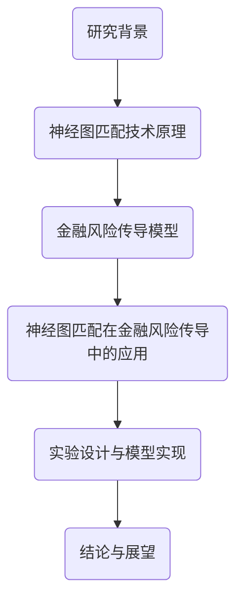

                 

### 第1章: 引言与背景

#### 1.1 研究背景

**1.1.1 金融风险传导的概念**

金融风险传导是指金融体系中的不稳定因素或异常波动在金融机构之间传递，导致整体金融系统面临的风险加剧。这种传导过程可以通过多种渠道实现，如信贷渠道、资产价格渠道、市场信心渠道等。例如，当某一金融机构面临流动性危机时，可能会通过信贷渠道导致其他金融机构也面临流动性问题，从而影响整个金融系统的稳定。

在过去的几十年中，金融风险传导已经成为影响金融市场稳定的重要因素。随着全球化进程的加速，金融风险传导的速度和范围也在不断扩大。因此，研究金融风险传导机制，对金融机构和监管部门来说具有重要的理论和实践意义。

**1.1.2 神经图匹配技术概述**

神经图匹配技术是一种深度学习技术，主要用于处理图数据之间的匹配问题。在图数据中，节点和边代表了数据实体及其相互关系，而传统的匹配方法往往难以处理这种复杂的结构化数据。神经图匹配技术通过将图数据映射到低维空间，利用神经网络学习它们之间的相似性，从而实现图数据之间的匹配。

神经图匹配技术具有以下几个主要特点：

1. **图嵌入：** 将图中的节点和边映射到低维空间，使得原本复杂的图结构可以被向量表示，便于进行进一步的处理和计算。
2. **注意力机制：** 利用注意力机制来关注图中的关键节点和边，提高匹配的准确性。
3. **端到端学习：** 通过端到端学习的方式，将图数据的预处理、特征提取和匹配过程整合到一起，使得整个匹配过程更加高效和灵活。

**1.1.3 神经图匹配技术在金融领域的应用现状**

神经图匹配技术在金融领域已有一定的应用，如在信用风险评估、市场预测、欺诈检测等方面。然而，将其应用于金融风险传导推理方面的研究还相对较少，主要原因是金融风险传导具有复杂性、非线性以及多层次的特性，这使得传统的金融分析方法难以直接应用于图数据的匹配和推理。

近年来，随着深度学习技术的不断发展，神经图匹配技术在金融领域的研究逐渐增多。一些研究尝试将神经图匹配技术应用于金融网络分析，以揭示金融风险的传导路径和影响因素。然而，这些研究大多还处于初步阶段，需要进一步深化和完善。

#### 1.2 研究目的与意义

**1.2.1 研究目的**

本书旨在探讨神经图匹配技术在金融风险传导推理中的应用，通过建立神经图匹配模型，实现对金融风险传导路径的预测和推理。具体目标包括：

1. 研究金融风险传导的机理，建立金融风险传导模型，为神经图匹配技术的应用提供理论基础。
2. 设计和实现基于神经图匹配技术的金融风险传导推理模型，验证其在实际金融场景中的应用效果。
3. 通过实验和案例分析，探索神经图匹配技术在金融风险传导推理中的优势和局限性，提出改进方案。

**1.2.2 研究意义**

1. **理论意义：** 本研究将为金融风险传导研究提供新的理论和方法，有助于深化对金融风险传导机理的理解，为相关领域的研究提供参考。
2. **应用意义：** 本研究将神经图匹配技术应用于金融风险传导推理，有助于提高金融风险管理的效率，为金融机构和监管部门提供有力的决策支持。
3. **技术意义：** 本研究将神经图匹配技术在金融领域中的应用进行深入探索，为其他领域的图数据匹配问题提供参考和启示，促进深度学习技术在金融等领域的应用和发展。

#### 1.2.3 本书结构安排

本书共分为七个章节，具体内容安排如下：

- **第1章：引言与背景**：介绍研究背景、目的和意义。
- **第2章：神经图匹配技术原理**：介绍神经图匹配的基本概念、方法和算法。
- **第3章：金融风险传导模型**：介绍金融风险传导的理论和模型。
- **第4章：神经图匹配在金融风险传导中的应用**：介绍神经图匹配技术在金融风险传导推理中的应用方法和案例。
- **第5章：实验设计与模型实现**：介绍实验设计、模型实现和结果分析。
- **第6章：结论与展望**：总结本书的研究成果，并提出未来研究的方向和建议。
- **第7章：参考文献**：列出本书引用的参考文献。

#### 1.2.4 Mermaid 流程图

以下是一个用于描述神经图匹配技术在金融风险传导推理中的应用流程的Mermaid流程图：



#### 1.2.5 伪代码

下面是一个用于描述金融风险推理函数的伪代码示例：

```python
def financial_risk_inference(graph, model):
    """
    金融风险推理函数

    参数:
    - graph: 金融风险图数据
    - model: 神经图匹配模型

    返回:
    - risk_path: 风险传导路径
    """

    # 初始化风险传导路径
    risk_path = []

    # 对图数据进行预处理
    preprocessed_graph = preprocess_graph(graph)

    # 使用神经图匹配模型进行匹配
    matched_pairs = model.match(preprocessed_graph)

    # 遍历匹配结果，找出风险传导路径
    for pair in matched_pairs:
        # 计算风险传导概率
        risk_probability = calculate_risk_probability(pair)

        # 如果风险传导概率大于阈值，则将路径添加到风险传导路径中
        if risk_probability > threshold:
            risk_path.append(pair)

    return risk_path
```

#### 1.2.6 数学模型和数学公式

**1.2.6.1 金融风险传导概率模型**

以下是一个用于计算金融风险传导概率的数学模型：

$$
P(R_t = R_t^*) = \frac{1}{Z} \sum_{i=1}^{n} e^{-\beta (R_t^* - R_t)}
$$

其中，$P(R_t = R_t^*)$ 表示在时刻 $t$ 风险传导到节点 $i$ 的概率，$Z$ 表示规范化常数，$\beta$ 表示风险传导概率参数，$R_t^*$ 表示在时刻 $t$ 的目标风险值，$R_t$ 表示在时刻 $t$ 的实际风险值。

**1.2.6.2 神经图匹配模型损失函数**

以下是一个用于描述神经图匹配模型损失函数的数学公式：

$$
L(\theta) = - \sum_{i=1}^{n} y_i \log(p_i)
$$

其中，$L(\theta)$ 表示模型损失函数，$\theta$ 表示模型参数，$y_i$ 表示实际标签，$p_i$ 表示预测概率。

通过上述章节的介绍，我们为读者提供了一个关于神经图匹配技术在金融风险传导推理中的研究背景、目的和意义，以及本书的结构安排。接下来，我们将进一步深入探讨神经图匹配技术的原理和算法，为后续章节的研究打下基础。 

### 关键词

- **金融风险传导**  
- **神经图匹配技术**  
- **深度学习**  
- **金融风险管理**  
- **图数据**  
- **风险传导模型**

### 摘要

本文旨在探讨神经图匹配技术在金融风险传导推理中的应用。首先，我们介绍了金融风险传导的概念和神经图匹配技术的基本原理，并概述了神经图匹配技术在金融领域的应用现状。随后，本文明确了研究的目的和意义，并详细阐述了本书的结构安排。通过一个Mermaid流程图和伪代码示例，我们展示了神经图匹配技术在金融风险传导推理中的具体应用方法。最后，本文提出了金融风险传导概率模型和神经图匹配模型损失函数，为后续章节的理论和实验研究奠定了基础。本文的研究有望为金融风险管理提供新的工具和方法，并对深度学习技术在金融领域的应用产生积极影响。

