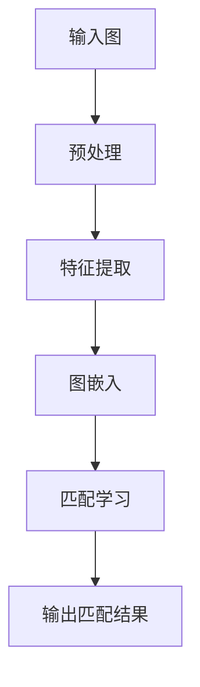

                 


### 文章标题：神经图匹配技术在金融风险推理中的应用

#### 关键词：神经图匹配，金融风险推理，深度学习，图神经网络，人工智能

#### 摘要：
神经图匹配技术作为一种新兴的人工智能方法，近年来在金融风险推理领域取得了显著的应用成果。本文将深入探讨神经图匹配技术的基本概念、原理及其在金融风险推理中的具体应用，通过实例分析和代码实现，展示其在金融风险管理中的实际效用。

### 目录大纲：

## 神经图匹配技术基础

### 第1章：神经图匹配简介

#### 1.1 神经图匹配的概念

神经图匹配是一种基于深度学习的图匹配方法，它通过学习图之间的映射关系，实现节点或子图的相似度评估。在金融风险推理中，这种方法能够帮助识别潜在的风险因素和风险传播路径。

#### 1.2 核心概念与联系

**Mermaid 流程图：**


#### 1.3 神经图匹配的主要类型

神经图匹配可以分为节点匹配和子图匹配两大类。节点匹配关注单个节点之间的相似度，而子图匹配则关注子图之间的整体相似性。

### 第2章：神经图匹配原理

#### 2.1 数学模型

神经图匹配的数学模型基于图嵌入技术，通过学习得到节点和子图的低维表示，然后使用相似度度量计算图与图之间的匹配得分。

**数学公式：**
$$
\phi(G) = f(G; \theta)
$$
其中，$\phi(G)$ 表示图 $G$ 的低维嵌入向量，$f(G; \theta)$ 是嵌入函数，$\theta$ 是模型参数。

#### 2.2 核心算法原理讲解

**伪代码：**
```
function NeuralGraphMatching(G1, G2, θ):
    # 输入：两个图 G1 和 G2，以及模型参数 θ
    Embed(G1)
    Embed(G2)
    CalculateMatchingScores()
    return BestMatchingPair()
```

#### 2.3 神经图匹配的应用场景

神经图匹配在金融风险推理中的应用场景广泛，包括但不限于信用风险评估、市场风险监测、欺诈检测等。

### 第3章：神经图匹配技术在金融风险推理中的理论基础

#### 3.1 金融风险推理的挑战

金融风险推理面临数据多样性、动态性和复杂性的挑战。神经图匹配技术能够通过学习图结构信息，提供一种有效的风险识别和预测手段。

#### 3.2 神经图匹配在金融风险推理中的优势

神经图匹配技术能够捕捉金融数据的异构性和非线性关系，提高风险识别的准确性和效率。

#### 3.3 神经图匹配技术的主要应用领域

神经图匹配技术在金融领域的主要应用包括信用评估、市场预测、投资组合优化等。

## 神经图匹配技术在金融风险推理中的应用实践

### 第4章：金融数据预处理

#### 4.1 金融数据收集

金融数据的收集来源于各种公开数据源、金融报告、交易所公告等。

#### 4.2 金融数据清洗

金融数据的清洗包括处理缺失值、异常值、数据格式不一致等问题。

#### 4.3 金融数据特征提取

金融数据特征提取包括财务指标、市场指标、客户行为指标等。

### 第5章：神经图匹配模型构建

#### 5.1 模型选择与参数调整

根据应用场景选择合适的神经图匹配模型，并对模型参数进行调整优化。

#### 5.2 神经图匹配模型训练

使用训练数据集对模型进行训练，包括图嵌入、匹配学习等步骤。

#### 5.3 模型评估与优化

通过验证数据集评估模型性能，并进行优化调整。

### 第6章：金融风险预测与评估

#### 6.1 风险指标定义

定义与金融风险相关的指标，如违约概率、风险溢价等。

#### 6.2 风险预测模型

使用神经图匹配技术构建风险预测模型，并进行训练和预测。

#### 6.3 风险评估与决策支持

基于预测结果进行风险评估，并提供决策支持。

### 第7章：案例研究

#### 7.1 案例背景

以某金融机构的信用风险评估为例，介绍案例背景和应用场景。

#### 7.2 案例实施步骤

详细描述神经图匹配技术在信用风险评估中的具体实施步骤。

#### 7.3 案例结果分析

分析案例实施后的结果，评估模型的性能和效果。

### 第8章：未来趋势与展望

#### 8.1 神经图匹配技术在金融风险推理中的发展

探讨神经图匹配技术在金融风险推理领域的未来发展趋势。

#### 8.2 神经图匹配技术的潜在挑战与解决方案

分析神经图匹配技术在应用过程中可能遇到的挑战，并提出解决方案。

#### 8.3 神经图匹配技术在金融领域的应用前景

展望神经图匹配技术在金融领域的广阔应用前景。

## 附录

### 附录A：神经图匹配技术常用工具与资源

提供神经图匹配技术相关的常用工具和资源链接。

### 附录B：金融风险推理相关算法汇总

汇总金融风险推理中常用的算法，包括其原理和应用场景。

### 附录C：案例代码与数据集

提供案例实现中的代码和数据集，便于读者复现。

### 结束语

总结全文内容，强调神经图匹配技术在金融风险推理中的重要性，并对未来的研究方向提出建议。

### 作者信息：

**作者：AI天才研究院/AI Genius Institute & 禅与计算机程序设计艺术 /Zen And The Art of Computer Programming**

通过以上的详细目录大纲和内容规划，我们可以确保文章的逻辑清晰、结构紧凑，同时为读者提供丰富具体的技术讲解和实践案例。接下来，我们将按照这个大纲逐步撰写每个章节的具体内容。由于字数限制，这里只提供了概述和核心内容的规划，实际的撰写过程将更加详细和深入。

