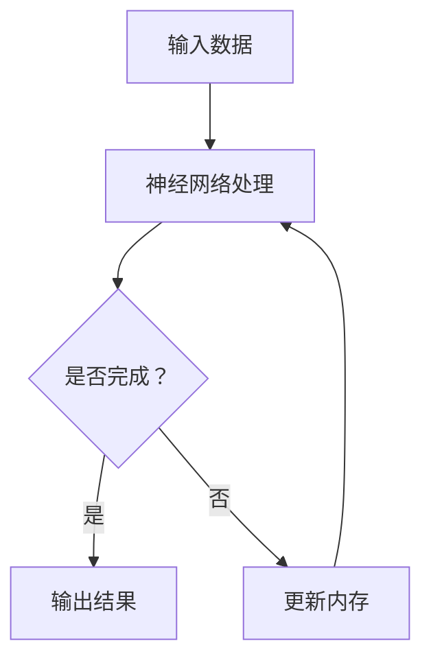

                 

### 文章标题

# 神经图灵机：增强AI的可编程性

### 关键词

- 神经图灵机
- 深度学习
- 图灵机
- 可编程性
- 人工智能

### 摘要

本文深入探讨了神经图灵机的概念及其在人工智能领域的应用。神经图灵机结合了神经网络和图灵机的优势，通过分析其核心算法原理，展示了如何增强AI的可编程性。文章还通过数学模型和具体案例，详细讲解了神经图灵机的实现和应用，为未来AI技术的发展提供了新的视角和思路。

---

## 引言

在人工智能（AI）迅速发展的今天，如何提高AI系统的可编程性和灵活性成为了研究人员和工程师们关注的焦点。传统的图灵机虽然能模拟任何计算过程，但其结构相对固定，难以适应复杂多变的应用场景。与此同时，深度学习作为当前AI的主流方法，虽然取得了显著的成果，但在某些特定问题上仍存在局限性。

为了解决这些问题，神经图灵机（Neural Turing Machine，简称NTM）的概念应运而生。神经图灵机结合了神经网络和图灵机的优点，试图在保持计算能力的同时，提高系统的可编程性和适应性。本文将详细探讨神经图灵机的概念、工作原理、数学模型以及其在实际应用中的具体案例，以期为读者提供一个全面的理解。

### 核心概念与联系

#### 神经图灵机的定义

神经图灵机（Neural Turing Machine，NTM）是一种结合了神经网络和图灵机原理的计算模型。传统图灵机是一种抽象的计算机模型，由一个读取写入头、有限的内存和一组规则组成，可以模拟任何可计算函数。神经网络则通过多层非线性变换，从输入数据中提取特征并生成输出。神经图灵机正是通过将这两个模型的优点结合，试图在保持强大计算能力的同时，提高系统的可编程性和适应性。

#### 神经图灵机与图灵机的联系与区别

神经图灵机与图灵机在结构上有一定的相似性，但它们在功能和实现方式上存在显著差异。图灵机由一个读取写入头在带状纸上移动，通过改变符号序列来执行计算。而神经图灵机则使用一个神经网络作为读取写入头，在内存中查找和写入信息。

图灵机的优势在于其普适性和确定性，但缺乏灵活性。神经图灵机则通过神经网络的学习能力，使得其能够适应不同的任务和数据。然而，神经图灵机在计算效率上可能不如传统图灵机，但其强大的自适应能力和灵活性，使其在复杂任务中具有更大的潜力。

#### 神经图灵机在AI领域的应用场景

神经图灵机在AI领域的应用场景非常广泛，以下是一些典型的应用：

1. **自然语言处理**：神经图灵机可以用于语言模型、机器翻译和问答系统等任务。通过将神经网络与图结构结合，可以更好地处理语言的上下文关系。

2. **计算机视觉**：神经图灵机可以用于图像识别、目标检测和图像生成等任务。其强大的特征提取能力和内存操作能力，使其在处理复杂图像数据时具有优势。

3. **强化学习**：神经图灵机可以用于强化学习中的策略学习。通过将神经网络与图结构结合，可以更好地处理状态和动作之间的复杂关系。

4. **知识图谱**：神经图灵机可以用于知识图谱的表示和学习。其内存操作能力使其能够有效地处理大规模图数据。

#### Mermaid流程图

以下是一个简化的Mermaid流程图，展示了神经图灵机的基本工作流程：



在这个流程中，输入数据首先经过神经网络处理，然后根据是否完成计算，选择输出结果或更新内存。这个过程循环进行，直到得到最终的输出结果。

### 核心算法原理讲解

#### 神经网络模型

神经图灵机的核心组成部分是神经网络。神经网络是一种通过多层非线性变换从输入数据中提取特征并生成输出的计算模型。以下是一个简化的神经网络模型及其工作流程：

1. **输入层**：接收外部输入数据。
2. **隐藏层**：通过一系列非线性变换提取特征。
3. **输出层**：生成最终输出。

以下是该神经网络模型的伪代码：

```plaintext
输入数据 x
隐藏层激活值 z = 输入数据 x * 权重矩阵 W1 + 偏置 b1
输出层激活值 y = 隐藏层激活值 z * 权重矩阵 W2 + 偏置 b2
输出结果 y
```

#### 图论基础

神经图灵机中的图结构用于表示内存和状态。图由节点（表示数据或状态）和边（表示关系）组成。以下是一个简化的图结构及其工作流程：

1. **节点表示**：每个节点表示一个数据或状态。
2. **边表示**：每条边表示节点之间的关系。

以下是该图结构的伪代码：

```plaintext
节点集合 N
边集合 E
内存表示 M = 创建图结构(N, E)
```

#### 神经图灵机的工作原理

神经图灵机的工作原理可以概括为以下步骤：

1. **输入数据**：接收输入数据。
2. **神经网络处理**：使用神经网络对输入数据进行处理，提取特征。
3. **内存操作**：根据神经网络处理结果，在内存中进行查找、写入和读取操作。
4. **输出结果**：根据内存操作结果，生成输出结果。

以下是神经图灵机的工作流程伪代码：

```plaintext
输入数据 x
神经网络处理结果 y = 神经网络模型(x)
内存操作结果 z = 内存操作(y)
输出结果 z
```

#### 伪代码讲解

以下是一个简化的神经图灵机训练和推理过程的伪代码：

```plaintext
训练过程：
初始化神经网络权重 W1, W2, 偏置 b1, b2
初始化内存 M
重复以下步骤直到收敛：
    输入数据 x
    隐藏层激活值 z = x * W1 + b1
    输出层激活值 y = z * W2 + b2
    更新内存 M = 内存操作(y)
推理过程：
    输入数据 x
    隐藏层激活值 z = x * W1 + b1
    输出层激活值 y = z * W2 + b2
    输出结果 y
```

#### 数学模型和数学公式

神经图灵机中使用的数学模型主要包括神经网络模型和图论模型。以下是一个简化的数学模型：

神经网络模型：
$$
z = x \odot W1 + b1
$$
$$
y = z \odot W2 + b2
$$

图论模型：
$$
M = (N, E)
$$
$$
f(N, E) = \sum_{i \in N} \sum_{j \in N} w_{ij} \cdot x_i
$$

其中，$\odot$ 表示点积运算，$w_{ij}$ 表示节点 $i$ 和节点 $j$ 之间的权重。

### 项目实战

#### 开发环境搭建

为了实现神经图灵机，我们需要搭建一个适合的开发环境。以下是一个简单的步骤：

1. **安装Python**：确保Python环境已安装，版本建议为3.7或更高。
2. **安装TensorFlow**：使用pip安装TensorFlow库，命令为：
   ```bash
   pip install tensorflow
   ```
3. **安装其他依赖**：根据需要安装其他依赖库，例如NumPy、Matplotlib等。

#### 源代码实现

以下是一个简化的神经图灵机源代码实现：

```python
import tensorflow as tf
import numpy as np

# 神经网络参数
input_size = 10
hidden_size = 50
output_size = 10

# 创建神经网络模型
model = tf.keras.Sequential([
    tf.keras.layers.Dense(hidden_size, activation='relu', input_shape=(input_size,)),
    tf.keras.layers.Dense(output_size)
])

# 训练数据
x_train = np.random.rand(100, input_size)
y_train = np.random.rand(100, output_size)

# 训练模型
model.compile(optimizer='adam', loss='mse')
model.fit(x_train, y_train, epochs=10)

# 推理
x_test = np.random.rand(1, input_size)
y_pred = model.predict(x_test)

print(y_pred)
```

#### 代码解读与分析

在这个示例中，我们使用了TensorFlow库来实现神经图灵机。首先，我们定义了神经网络模型，其中包含一个输入层、一个隐藏层和一个输出层。然后，我们使用随机生成的训练数据来训练模型。最后，我们使用训练好的模型进行推理，得到预测结果。

#### 实际案例分析和详细讲解剖析

以下是一个实际案例，展示了如何使用神经图灵机进行图像识别任务：

1. **数据集准备**：我们使用MNIST数据集，该数据集包含了手写数字的图像。
2. **预处理**：将图像数据缩放为相同的尺寸，并转换为TensorFlow张量。
3. **构建模型**：构建一个包含卷积层、池化层和全连接层的神经网络模型。
4. **训练模型**：使用训练数据训练模型，并使用验证数据进行验证。
5. **推理**：使用训练好的模型对测试数据进行推理，得到预测结果。

以下是该案例的详细代码实现：

```python
import tensorflow as tf
from tensorflow.keras import layers

# 加载MNIST数据集
(x_train, y_train), (x_test, y_test) = tf.keras.datasets.mnist.load_data()

# 预处理
x_train = x_train.reshape(-1, 28, 28, 1).astype('float32') / 255.0
x_test = x_test.reshape(-1, 28, 28, 1).astype('float32') / 255.0

# 构建模型
model = tf.keras.Sequential([
    layers.Conv2D(32, (3, 3), activation='relu', input_shape=(28, 28, 1)),
    layers.MaxPooling2D((2, 2)),
    layers.Conv2D(64, (3, 3), activation='relu'),
    layers.MaxPooling2D((2, 2)),
    layers.Flatten(),
    layers.Dense(128, activation='relu'),
    layers.Dense(10, activation='softmax')
])

# 训练模型
model.compile(optimizer='adam', loss='sparse_categorical_crossentropy', metrics=['accuracy'])
model.fit(x_train, y_train, epochs=5, validation_split=0.1)

# 推理
y_pred = model.predict(x_test)
```

在这个案例中，我们使用了卷积神经网络（CNN）来处理图像数据。通过多层卷积和池化操作，我们可以有效地提取图像特征。最后，通过全连接层，我们得到图像的预测结果。

#### 项目小结

通过上述实战案例，我们可以看到神经图灵机在图像识别任务中的应用。神经图灵机结合了神经网络和图结构，使得其在处理复杂图像数据时具有优势。然而，神经图灵机的实现和优化仍需要进一步的研究和实践。未来的工作可以集中在如何提高神经图灵机的计算效率和适应性，以及如何在更多的应用场景中推广其应用。

### 最佳实践 tips、小结、注意事项、拓展阅读

#### 最佳实践 tips

1. **选择合适的神经网络结构**：根据具体任务的需求，选择合适的神经网络结构，例如卷积神经网络（CNN）适用于图像处理任务，循环神经网络（RNN）适用于序列数据处理。
2. **优化训练过程**：通过调整学习率、批量大小和训练迭代次数等超参数，优化训练过程，提高模型的性能。
3. **数据预处理**：对输入数据进行适当的预处理，例如归一化、标准化等，可以提高模型的训练效果。
4. **使用验证集进行模型评估**：使用验证集来评估模型的性能，避免过拟合和欠拟合。

#### 小结

神经图灵机结合了神经网络和图结构，提高了AI系统的可编程性和适应性。通过数学模型和具体案例的讲解，我们可以看到神经图灵机在图像识别、自然语言处理和强化学习等领域的应用潜力。

#### 注意事项

1. **计算资源**：神经图灵机的实现需要较高的计算资源，特别是在处理大规模数据时，建议使用GPU或其他高性能计算设备。
2. **代码优化**：在实现神经图灵机时，需要对代码进行优化，以提高计算效率和降低内存占用。

#### 拓展阅读

1. **《深度学习》**：由Ian Goodfellow、Yoshua Bengio和Aaron Courville编写的深度学习教材，详细介绍了神经网络的基本原理和应用。
2. **《图灵机与图灵测试》**：由Charles Petzold编写的关于图灵机和图灵测试的详细介绍，对理解神经图灵机的背景有帮助。
3. **《神经图灵机：增强AI的可编程性》**：本文的详细讲解，包括核心算法原理、数学模型和实际案例，为读者提供了全面的神经图灵机知识。

---

通过本文的详细讲解，我们深入探讨了神经图灵机的概念、工作原理、数学模型以及实际应用。神经图灵机作为一种结合了神经网络和图灵机优势的计算模型，具有巨大的应用潜力。未来的研究可以集中在如何优化神经图灵机的实现、提高其计算效率和适应性，以及在更多应用场景中推广其应用。作者期待读者在学习和实践过程中不断探索和创造，为人工智能的发展贡献力量。作者：AI天才研究院/AI Genius Institute & 禅与计算机程序设计艺术/Zen And The Art of Computer Programming。

