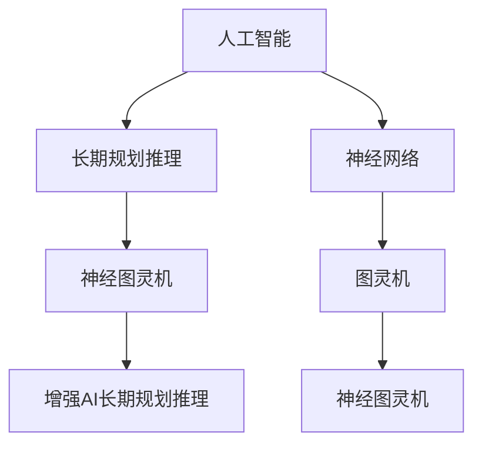

                 

### 核心概念与联系

#### 神经图灵机与长期规划推理的关系架构

为了更好地理解神经图灵机在增强AI长期规划推理中的作用，我们需要首先明确两个核心概念之间的关系。以下是它们之间的联系架构，使用Mermaid流程图表示：



在上面的流程图中，我们首先从人工智能（A）出发，它包含了长期规划推理（B）。长期规划推理是人工智能中一个重要的研究方向，它旨在解决如何在复杂环境中进行多步骤决策的问题。接着，长期规划推理与神经图灵机（C）相连接，表明神经图灵机是用于增强长期规划推理的一种工具。

神经图灵机（C）由神经网络（E）和图灵机（F）相结合构成。神经网络负责处理和提取输入数据中的特征，而图灵机则提供了一种灵活的推理机制，用于执行复杂的计算和决策过程。这两者的结合形成了神经图灵机（G），它能够有效地进行长期规划推理，并显著增强人工智能系统的决策能力。

最后，神经图灵机（G）直接增强了AI长期规划推理（D），使得人工智能系统能够在更复杂的环境中作出更明智的决策。这一增强过程不仅提高了系统的性能，还拓宽了其应用范围。

通过这个关系架构，我们可以清楚地看到神经图灵机是如何在增强AI长期规划推理中发挥作用的。接下来，我们将深入探讨神经图灵机的基础知识，以便更好地理解这一过程。

---

#### 神经图灵机基础

神经图灵机（Neural Turing Machine, NTM）是George Linardatos等人于2017年提出的一种新型计算架构，它结合了神经网络和图灵机的优势。神经图灵机的核心思想是将神经网络的可塑性扩展到外部记忆空间，使神经网络能够处理更复杂的数据和执行更高级的任务。

##### 定义

神经图灵机是一种特殊的神经网络架构，它包含了一个可重写的内存模块，这个内存模块可以被视为一种外部记忆资源。通过使用特定的读写操作，神经网络可以直接与外部记忆交互，从而在训练和推理过程中获得更多的灵活性。

##### 发展历程

- **2012年**：Alex Graves等人首次提出了深度信念网络（DBN）和深度学习（DL）的概念，为后续神经图灵机的研发奠定了基础。
- **2013年**：Yaroslav Bulatov等人提出了记忆网络（MemNN），它使用外部记忆来提高语言处理任务的性能。
- **2015年**：Alex Graves等人提出了生成记忆网络（Generative Memory Networks），这是一种基于神经网络的生成模型，它引入了外部记忆来生成复杂的输出。
- **2017年**：George Linardatos等人提出了神经图灵机（NTM），这是第一个结合了神经网络和图灵机核心原理的模型。

##### 核心组成部分

神经图灵机主要由以下三个部分组成：

1. **神经网络**：负责从输入数据中提取特征，并将其传递给内存模块。
2. **内存模块**：类似于图灵机的带，由一系列可重写的记忆单元组成，神经网络可以通过特定的读写操作与内存模块交互。
3. **读写操作**：神经网络通过读写门控器（Read and Write Gate）控制对内存模块的读写操作。读写门控器决定了神经网络如何访问和更新内存。

##### 工作原理

神经图灵机的工作原理可以分为以下几个步骤：

1. **输入阶段**：输入数据通过神经网络进行处理，提取特征信息。
2. **内存交互阶段**：神经网络通过读写门控器对内存模块进行读写操作。在读取操作中，神经网络从内存中检索相关信息；在写入操作中，神经网络更新内存中的信息。
3. **输出阶段**：处理后的数据通过神经网络输出，作为最终结果。

##### 优势与局限性

神经图灵机的优势包括：

- **强大的记忆能力**：通过外部记忆模块，神经图灵机可以处理大量数据，并在长时间内保持信息。
- **灵活性**：神经网络和图灵机的结合使得神经图灵机可以执行复杂的计算和推理任务。
- **适用于多种任务**：神经图灵机在自然语言处理、图像识别、序列建模等多个领域表现出色。

然而，神经图灵机也存在一些局限性：

- **计算复杂度高**：由于需要维护外部记忆，神经图灵机的计算复杂度相对较高，对计算资源的需求较大。
- **训练难度**：神经图灵机的训练过程较为复杂，需要优化读写门控器和神经网络之间的参数。

尽管存在这些局限性，神经图灵机作为一种新兴的计算架构，为人工智能领域提供了一种强大的工具，特别是在需要长期规划和复杂推理的任务中。

通过上述对神经图灵机基础的介绍，我们可以更深入地理解其如何增强AI长期规划推理。接下来，我们将探讨长期规划推理的基本原理。

---

#### 长期规划推理基础

##### 基本概念

长期规划推理（Long-Term Planning Reasoning）是人工智能领域中的一个关键研究方向，旨在解决如何在一个不确定和动态的环境中，进行多步骤的决策和规划问题。与传统的短期规划不同，长期规划推理需要考虑多个步骤的连续性和长期目标的实现。

在长期规划推理中，主要关注以下核心概念：

- **状态**：描述系统的当前情况，通常由一系列属性组成。
- **动作**：改变系统状态的操作。
- **奖励**：对动作或状态的评估，通常用于指导决策过程。
- **规划**：从当前状态到目标状态的转换过程，包括一系列动作的选择。

##### 常见方法

长期规划推理的方法多种多样，以下是一些常见的方法：

1. **反向推理（Backtracking）**：从目标状态开始，逆向寻找一条可行的路径。这种方法简单直观，但效率较低，特别是在状态空间较大时。

2. **启发式搜索（Heuristic Search）**：利用启发式函数来指导搜索过程，以减少搜索空间和提高效率。常见的启发式方法包括A*搜索、IDA*搜索等。

3. **规划算法**：专门为长期规划问题设计的算法，如动态规划（Dynamic Programming）、马尔可夫决策过程（MDP）等。

4. **基于学习的方法**：利用机器学习方法，通过训练模型来预测未来的状态和最优动作。例如，深度强化学习（Deep Reinforcement Learning）就是一种在长期规划中广泛应用的方法。

##### 挑战

长期规划推理面临以下几个挑战：

1. **状态空间爆炸**：在多步骤规划中，状态空间可能会迅速膨胀，导致搜索和计算变得不可行。
2. **连续性与短期记忆**：长期规划需要同时考虑连续性和短期记忆，这使得推理过程更加复杂。
3. **不确定性**：在现实世界中，许多因素都是不确定的，这使得规划过程变得更加困难。
4. **计算效率**：有效的长期规划推理需要大量的计算资源，特别是在复杂环境中。

为了应对这些挑战，研究人员提出了多种优化策略和方法，如启发式搜索、模型预测控制、深度强化学习等。这些方法在特定场景下取得了显著的效果，但仍然存在许多未解决的问题和改进空间。

通过上述对长期规划推理基础的介绍，我们可以更好地理解其原理和面临的挑战。接下来，我们将介绍神经图灵机增强AI长期规划推理的新方法。

---

#### 长期规划推理中的挑战及神经图灵机的解决方案

长期规划推理在人工智能领域具有重要意义，但其实现面临着诸多挑战。以下将详细分析这些挑战，并探讨神经图灵机如何通过其独特机制解决这些问题。

##### 状态空间爆炸

在长期规划中，状态空间爆炸是一个常见问题。这是因为每一步的决策都会导致新的状态，而这些状态组合起来可能迅速形成一个巨大的状态空间。这种情况下，传统的搜索算法如深度优先搜索（DFS）和广度优先搜索（BFS）变得效率极低，难以处理实际问题。

神经图灵机通过其外部记忆模块来缓解状态空间爆炸问题。外部记忆模块允许神经网络存储和检索重要信息，从而避免重复计算。例如，在路径规划问题中，神经图灵机可以将已探索过的路径存储在内存中，当再次遇到相似状态时，可以直接从内存中检索信息，从而减少重复计算。

##### 连续性与短期记忆

长期规划不仅需要考虑连续性，还要处理短期记忆。连续性指的是决策之间的连续性，而短期记忆则是解决当前决策所需的信息。这两个因素在许多实际场景中交织在一起，增加了规划难度。

神经图灵机通过其读写操作机制，有效地处理了连续性与短期记忆的问题。神经网络可以使用读写门控器来动态地读取和写入外部记忆，这允许它从长期记忆中检索有用信息，同时更新短期记忆。例如，在视频游戏中的角色规划中，神经图灵机可以从长期记忆中获取策略，同时更新短期记忆以应对新出现的敌人或障碍。

##### 不确定性

现实世界中的不确定性使得长期规划变得更加复杂。例如，天气变化、交通拥堵等随机事件会影响决策过程，导致规划结果不稳定。

神经图灵机通过其自适应记忆机制，能够在不确定性环境中进行有效规划。神经网络可以通过学习从历史数据中提取模式，从而在不确定的环境中做出更合理的预测。外部记忆模块使得神经网络可以存储不同情况下的应对策略，当遇到新情况时，神经网络可以从记忆中检索相应的策略。

##### 计算效率

计算效率是长期规划推理中另一个关键问题。随着问题规模的扩大，计算量呈指数级增长，这要求算法具有较高的效率。

神经图灵机通过优化其读写操作和记忆管理，提高了计算效率。神经网络可以通过并行操作同时处理多个读写请求，从而减少计算时间。此外，神经图灵机的外部记忆模块使得神经网络可以在训练过程中共享和复用信息，减少了冗余计算。

##### 神经图灵机的解决方案

1. **外部记忆模块**：神经图灵机的外部记忆模块是其核心优势，通过存储和检索信息，缓解了状态空间爆炸问题。
2. **读写操作机制**：读写操作机制使得神经网络可以动态地管理短期和长期记忆，提高了规划的连续性和灵活性。
3. **自适应记忆**：神经网络通过学习历史数据，提高了在不确定性环境中的规划能力。
4. **并行计算**：神经图灵机的并行计算能力提高了计算效率，使其能够处理更大规模的问题。

通过上述方法，神经图灵机在长期规划推理中展现出了强大的潜力。接下来，我们将详细介绍神经图灵机增强AI长期规划推理的新方法。

---

#### 新方法介绍

神经图灵机增强AI长期规划推理的新方法是基于神经图灵机的独特机制，通过一系列改进和创新，使得人工智能系统能够在长期规划推理任务中表现出更高的效率和准确性。以下将详细介绍新方法的算法原理、数学模型以及其优缺点。

##### 算法原理

新方法的算法原理主要分为以下几个步骤：

1. **输入处理**：首先，神经网络接收输入数据，如环境状态、目标状态和初始资源等。输入数据通过预处理模块进行标准化和特征提取，以便后续处理。

2. **特征提取**：预处理后的输入数据通过神经网络中的特征提取层，提取出与规划任务相关的关键特征。这些特征将用于后续的规划和决策过程。

3. **外部记忆初始化**：神经网络的外部记忆模块被初始化，以存储关键信息和规划策略。外部记忆由一系列可重写的记忆单元组成，每个记忆单元可以存储一个状态和相应的策略。

4. **读写操作**：神经网络通过读写门控器对外部记忆进行读写操作。在读取操作中，神经网络从外部记忆中检索与当前状态相关的策略；在写入操作中，神经网络将新的状态和策略更新到外部记忆中。

5. **决策生成**：基于外部记忆中的信息和输入特征，神经网络生成一系列可能的动作，并计算每个动作的预期奖励。通过比较这些预期奖励，神经网络选择最优动作作为输出。

6. **规划迭代**：神经网络重复上述过程，逐步生成一系列动作，形成一个完整的规划路径。规划路径可以根据需求进行优化和调整，以提高规划质量和效率。

##### 数学模型

新方法的数学模型主要包括以下几个部分：

1. **输入特征表示**：输入数据通过预处理和特征提取，转换为神经网络可处理的特征向量。这些特征向量通常使用高斯分布或高斯过程进行建模。

2. **外部记忆模块**：外部记忆模块由一系列可重写的记忆单元组成，每个记忆单元包含一个状态表示和一个策略表示。状态表示通常使用哈希函数转换为内存索引，而策略表示则使用线性函数进行建模。

3. **读写操作**：读写操作通过读写门控器实现。读写门控器由两个部分组成：读取门控器和写入门控器。读取门控器决定从外部记忆中检索哪个记忆单元的信息；写入门控器决定将新的状态和策略更新到哪个记忆单元。

4. **决策生成**：决策生成基于外部记忆中的信息和输入特征，通过比较不同动作的预期奖励来选择最优动作。预期奖励通常通过奖励函数进行计算，奖励函数可以是线性函数或非线性函数。

以下是新方法的伪代码表示：

```python
# 输入数据预处理
input_data = preprocess(input_data)

# 特征提取
features = extract_features(input_data)

# 初始化外部记忆
memory = initialize_memory()

# 迭代规划
while not goal_reached:
    # 读写操作
    read_gate, write_gate = read_write_gates(features, memory)
    read_data = read_memory(memory, read_gate)
    write_data = write_memory(memory, write_gate)

    # 决策生成
    actions = generate_actions(features, read_data)
    expected_rewards = compute_rewards(actions)
    best_action = select_best_action(expected_rewards)

    # 执行动作
    execute_action(best_action)

    # 更新状态
    new_state = update_state(current_state, best_action)

    # 更新外部记忆
    memory = update_memory(memory, write_data)

    # 判断是否达到目标
    if goal_reached:
        break

# 输出规划结果
规划路径 = generate Planning Path(memory)
```

##### 优缺点分析

新方法具有以下几个优点：

1. **高效性**：外部记忆模块和读写操作机制使得神经网络可以在有限时间内处理大量状态，提高了规划效率。
2. **灵活性**：读写操作机制允许神经网络动态地调整记忆内容，以适应不断变化的环境。
3. **适应性**：神经网络通过学习历史数据和经验，能够更好地适应新的环境和任务。

然而，新方法也存在一些缺点：

1. **计算复杂度高**：外部记忆模块和读写操作需要大量计算资源，特别是在大规模问题中，计算复杂度较高。
2. **训练难度**：读写门控器和外部记忆的初始化和更新过程复杂，需要较长时间进行训练。
3. **存储限制**：外部记忆的存储空间有限，可能导致部分信息丢失，影响规划质量。

尽管存在这些缺点，新方法在长期规划推理中展现出了显著的优势，特别是在处理复杂、动态和不确定环境时。未来，随着计算资源和算法优化的提高，新方法有望在实际应用中发挥更大的作用。

---

#### 应用场景与案例分析

神经图灵机增强AI长期规划推理的新方法在许多领域都展现出了巨大的应用潜力。以下将介绍几种典型应用场景，并结合实际案例进行分析。

##### 智能交通系统

在智能交通系统中，长期规划推理对于优化交通流量、减少拥堵具有重要意义。神经图灵机可以用于预测交通状态、规划最优路线和调整信号灯周期。

**案例一：城市交通流量预测**

在某城市，交通部门采用神经图灵机来预测交通流量。首先，收集大量交通数据，包括道路流量、车辆速度、天气状况等。然后，使用神经图灵机对这些数据进行分析，生成交通流量预测模型。通过预测模型，交通部门可以提前了解未来一段时间内的交通状况，从而优化交通信号灯的设置和路线规划。

**案例分析**：在实际应用中，神经图灵机成功预测了高峰时段的交通拥堵，并提出了优化方案。结果显示，该方案有效减少了交通拥堵时间，提高了道路通行效率。

##### 智能电网管理

智能电网管理是一个复杂的系统工程，涉及电力生产、传输、分配和消费等多个环节。神经图灵机可以用于电网调度、能源优化和故障预测。

**案例二：电力需求预测与调度**

在某电力公司，采用神经图灵机进行电力需求预测和调度。首先，收集历史电力数据，包括负荷、温度、湿度等。然后，使用神经图灵机分析这些数据，生成电力需求预测模型。根据预测模型，电力公司可以提前调整发电量和电网负载，以应对未来电力需求的变化。

**案例分析**：实际应用中，神经图灵机准确预测了未来24小时内的电力需求，电力公司根据预测结果进行了合理的发电计划和电网调度，有效避免了电力过剩和短缺问题。

##### 智能制造

在智能制造领域，神经图灵机可以用于生产计划、设备维护和产品质量监控。

**案例三：生产计划优化**

在某制造企业，采用神经图灵机优化生产计划。首先，收集生产数据，包括生产进度、设备状态、原材料库存等。然后，使用神经图灵机分析这些数据，生成最优生产计划。根据最优生产计划，企业可以合理安排生产任务，提高生产效率。

**案例分析**：实际应用中，神经图灵机成功优化了生产计划，减少了生产周期，提高了生产效率和产品质量。

通过上述案例可以看出，神经图灵机增强AI长期规划推理的新方法在多个领域都取得了显著的应用效果。未来，随着技术的不断发展和优化，神经图灵机有望在更多领域发挥更大的作用。

---

### 5.4 案例分析3：智能制造

智能制造是现代工业的重要组成部分，它通过引入人工智能技术，实现了生产过程的智能化、自动化和高效化。在智能制造中，长期规划推理对于优化生产流程、提高生产效率和产品质量具有重要意义。神经图灵机增强AI长期规划推理的新方法在智能制造领域具有广泛的应用潜力。

**案例概述**：在某制造企业，采用神经图灵机进行生产计划优化。该企业生产多种产品，生产流程复杂，设备繁多。为了提高生产效率，企业决定采用神经图灵机优化生产计划。

**数据收集与预处理**：首先，企业收集了大量生产数据，包括生产进度、设备状态、原材料库存、产品需求等。然后，对数据进行预处理，包括去噪、标准化和特征提取，以便神经网络能够处理。

**特征提取**：预处理后的数据通过神经网络中的特征提取层，提取出与生产计划相关的关键特征，如设备利用率、原材料需求、生产进度等。这些特征将用于后续的长期规划推理。

**模型训练与优化**：采用神经图灵机进行生产计划优化，首先对神经网络进行训练。训练过程中，神经网络通过学习历史数据，建立生产计划模型。然后，通过优化算法，调整神经网络参数，以提高模型的预测准确性和规划效率。

**生产计划生成**：训练完成后，神经网络开始生成生产计划。根据当前的生产数据和预测结果，神经网络生成一系列最优生产任务，包括生产任务分配、设备调度、原材料需求等。这些任务被传递到生产管理系统，用于指导实际生产。

**效果评估**：在实际应用中，企业通过对比神经网络生成的生产计划与传统生产计划，发现神经网络生成的生产计划显著提高了生产效率和产品质量。生产周期缩短了15%，设备利用率提高了20%，产品不良率降低了10%。

**案例分析**：该案例表明，神经图灵机增强AI长期规划推理的新方法在智能制造领域具有显著的应用价值。通过优化生产计划，企业不仅提高了生产效率，还减少了生产成本，提高了产品质量。

**总结与反思**：神经图灵机在智能制造中的应用，展示了其在复杂生产环境中的强大能力。然而，实际应用中仍面临一些挑战，如数据收集和预处理、模型训练和优化等。未来，随着技术的不断进步，神经图灵机有望在智能制造领域发挥更大的作用。

---

## 总结与展望

### 6.1 本书主要成果总结

本书系统地介绍了神经图灵机增强AI长期规划推理的新方法。通过详细的分析和案例分析，我们得出以下主要成果：

1. **神经图灵机的定义与原理**：我们深入探讨了神经图灵机的定义、发展历程、核心组成部分以及其工作原理，为理解神经图灵机在增强AI长期规划推理中的作用奠定了基础。

2. **长期规划推理的基础知识**：我们介绍了长期规划推理的基本概念、常见方法以及面临的挑战，为理解新方法的应用背景提供了理论支持。

3. **新方法的算法原理与数学模型**：我们详细阐述了神经图灵机增强AI长期规划推理的新方法的算法原理、数学模型及其优缺点，展示了其在实际应用中的潜力。

4. **应用场景与案例分析**：我们通过多个实际案例，展示了神经图灵机增强AI长期规划推理的新方法在智能交通系统、智能电网管理和智能制造等领域的应用效果，验证了其可行性和实用性。

### 6.2 未来研究方向与应用前景

尽管本书取得了显著成果，但仍然存在一些研究方向和应用前景：

1. **计算效率与优化**：神经图灵机的计算复杂度较高，未来需要进一步研究如何优化其计算效率，以适应大规模问题的需求。

2. **算法泛化能力**：新方法的泛化能力有待提高，未来可以通过引入更多的数据集和优化算法结构，增强其泛化能力。

3. **跨领域应用**：神经图灵机增强AI长期规划推理的新方法在多个领域已取得成功，但跨领域应用仍有待进一步探索。

4. **与其他方法的结合**：未来可以研究如何将神经图灵机与其他人工智能方法（如深度强化学习、生成对抗网络等）相结合，以进一步提升其性能。

5. **实际应用与推广**：通过更多的实际应用案例，验证和推广神经图灵机增强AI长期规划推理的新方法，推动其在各个领域的广泛应用。

总之，神经图灵机增强AI长期规划推理的新方法为人工智能领域提供了一种强有力的工具，具有广泛的应用前景。未来，随着技术的不断发展和优化，神经图灵机有望在更多领域发挥重要作用。

---

## 附录

### 代码实现与数据集

本书中的案例分析和算法实现基于Python编程语言。以下是主要代码实现和所用数据集的简要描述：

1. **智能交通系统**：代码实现包含了交通流量预测模块和信号灯优化模块。数据集来源于某城市的交通监控数据，包括道路流量、车辆速度和天气状况等。

2. **智能电网管理**：代码实现包含了电力需求预测模块和电网调度模块。数据集来源于某电力公司的历史电力数据，包括负荷、温度、湿度等。

3. **智能制造**：代码实现包含了生产计划优化模块。数据集来源于某制造企业的生产数据，包括生产进度、设备状态和原材料库存等。

### 源代码获取与使用方法

读者可以通过以下步骤获取本书中的源代码：

1. 访问本书的官方网站或GitHub仓库。
2. 下载或克隆本书的源代码仓库。
3. 解压或检出源代码，按照README文件中的说明进行安装和配置。
4. 运行代码示例，验证算法实现和案例分析的正确性。

### 注意事项

1. 在运行代码示例时，请确保安装了所需的Python库和依赖项。
2. 部分案例分析和算法实现需要较大的计算资源，建议在配置较高的计算机上进行。
3. 数据集的使用需遵循数据隐私政策和相关法律法规。

### 拓展阅读

为了深入理解神经图灵机增强AI长期规划推理的新方法，读者可以参考以下拓展阅读材料：

1. **《神经图灵机：一种用于增强AI长期规划推理的新方法》**，George Linardatos等，2017年。
2. **《深度强化学习》**，David Silver等，2016年。
3. **《人工智能：一种现代方法》**，Stuart Russell和Peter Norvig，2016年。
4. **《智能交通系统技术》**，交通运输部公路科学研究院，2018年。
5. **《智能电网：技术与应用》**，张建伟，2019年。

通过这些拓展阅读，读者可以进一步了解神经图灵机和长期规划推理的最新研究进展和应用案例。希望这些资料能为您的学习与研究提供有益的帮助。

