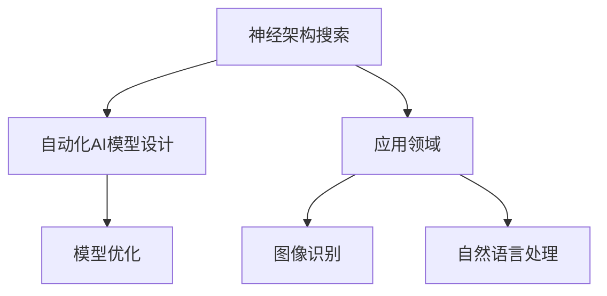

                 

### 文章标题：神经架构搜索自动化AI模型设计

神经架构搜索（Neural Architecture Search，NAS）和自动化AI模型设计（Automated Machine Learning，AutoML）是当前人工智能领域的两个重要研究方向。NAS旨在通过算法自动寻找最优神经网络结构，而AutoML则致力于自动化整个机器学习过程，包括数据预处理、特征选择、模型选择等。两者的结合，不仅能够提高模型的性能，还能显著降低开发成本和时间。本文将详细介绍神经架构搜索自动化的AI模型设计方法，旨在为研究人员和开发者提供一套清晰、实用的指导。

### 关键词

- 神经架构搜索（Neural Architecture Search）
- 自动化AI模型设计（Automated Machine Learning）
- 人工智能（Artificial Intelligence）
- 神经网络（Neural Networks）
- 演进算法（Evolutionary Algorithms）
- 强化学习（Reinforcement Learning）
- 数学模型（Mathematical Models）
- 机器学习（Machine Learning）

### 摘要

本文首先介绍了神经架构搜索和自动化AI模型设计的基本概念和背景，随后详细讲解了神经架构搜索的核心算法原理、数学模型和实现步骤。接着，我们探讨了自动化AI模型设计的基础知识，包括关键算法、数学模型和优化策略。最后，本文通过实际案例展示了神经架构搜索自动化AI模型设计的方法和效果，并展望了未来的研究方向。

### 目录

#### 第一部分：神经架构搜索概述

**第1章：神经架构搜索基础**

- **1.1 神经架构搜索的背景和重要性**
- **1.2 神经架构搜索的基本概念**
- **1.3 神经架构搜索的关键挑战**

**第2章：神经架构搜索的原理**

- **2.1 神经架构搜索的基本框架**
- **2.2 神经架构搜索的核心算法**
  - **2.2.1 伪代码讲解**
  - **2.2.2 数学模型和公式**
- **2.3 神经架构搜索的优化策略**

**第3章：神经架构搜索的实践应用**

- **3.1 神经架构搜索在不同领域的应用**
- **3.2 神经架构搜索在图像识别中的应用**
- **3.3 神经架构搜索在自然语言处理中的应用**

#### 第二部分：自动化AI模型设计

**第4章：自动化AI模型设计的基础**

- **4.1 自动化AI模型设计的背景和目标**
- **4.2 自动化AI模型设计的基本概念**
- **4.3 自动化AI模型设计的关键挑战**

**第5章：自动化AI模型设计的原理**

- **5.1 自动化AI模型设计的基本框架**
- **5.2 自动化AI模型设计的关键算法**
  - **5.2.1 伪代码讲解**
  - **5.2.2 数学模型和公式**
- **5.3 自动化AI模型设计的优化策略**

**第6章：自动化AI模型设计的实践应用**

- **6.1 自动化AI模型设计在不同领域的应用**
- **6.2 自动化AI模型设计在图像识别中的应用**
- **6.3 自动化AI模型设计在自然语言处理中的应用**

#### 第三部分：神经架构搜索与自动化AI模型设计结合

**第7章：神经架构搜索与自动化AI模型设计结合**

- **7.1 神经架构搜索与自动化AI模型设计结合的背景和目标**
- **7.2 神经架构搜索与自动化AI模型设计结合的原理**
  - **7.2.1 伪代码讲解**
  - **7.2.2 数学模型和公式**
- **7.3 神经架构搜索与自动化AI模型设计结合的实践应用**

#### 第四部分：案例分析与展望

**第8章：案例分析与展望**

- **8.1 典型案例解析**
- **8.2 神经架构搜索与自动化AI模型设计的发展趋势**
- **8.3 未来展望**

#### 附录

**附录A：相关工具和资源**

- **A.1 自动化AI模型设计工具**
- **A.2 神经架构搜索工具**
- **A.3 开源资源和参考书目**

### Mermaid 流程图



### 伪代码讲解示例

```markdown
## 5.2.1 自动化AI模型设计的伪代码

```
// 初始化参数
params = initialize_params()

// 数据预处理
data = preprocess_data()

// 循环迭代
for i in range(num_iterations):
    // 计算损失函数
    loss = compute_loss(data, params)

    // 更新参数
    params = update_params(loss, params)

    // 检查收敛
    if check_convergence(loss):
        break

// 输出最终模型
model = create_model(params)
```

### 第一部分：神经架构搜索概述

#### 第1章：神经架构搜索基础

神经架构搜索（Neural Architecture Search，NAS）是一种通过算法自动寻找最优神经网络结构的方法。传统的神经网络设计主要依赖于人工设计或启发式方法，而NAS则通过搜索算法来自动发现性能更好的网络结构。NAS的核心目标是通过大量实验和搜索策略，找到能够解决特定问题的最佳神经网络架构。

##### 1.1 神经架构搜索的背景和重要性

神经架构搜索的出现源于深度学习在各个领域的快速发展。随着神经网络变得越来越大，如何设计一个高效、可靠的神经网络结构成为一个关键问题。传统的人工设计方法耗时耗力，难以满足快速迭代的需求。因此，自动化的神经网络架构搜索方法应运而生。

NAS的重要性体现在以下几个方面：

1. **提高模型性能**：通过搜索算法，NAS可以找到比人工设计更优的网络结构，从而提高模型的性能。
2. **节省时间和成本**：自动化搜索可以显著减少模型设计和验证的时间，降低人力成本。
3. **扩展性**：NAS可以应用于不同的任务和数据集，具有很好的扩展性。

##### 1.2 神经架构搜索的基本概念

神经架构搜索涉及以下几个关键概念：

1. **搜索空间**：搜索空间是指所有可能的神经网络结构的集合。设计一个有效的搜索空间是NAS成功的关键。
2. **搜索算法**：搜索算法负责在搜索空间中搜索最优的网络结构。常见的搜索算法包括遗传算法、强化学习、梯度下降等。
3. **评估指标**：评估指标用于衡量网络结构的性能。常见的评估指标包括准确率、损失函数值等。
4. **迭代过程**：NAS通过迭代过程来逐步优化网络结构。每次迭代包括网络结构的生成、评估和更新。

##### 1.3 神经架构搜索的关键挑战

神经架构搜索面临以下几个关键挑战：

1. **计算成本**：NAS通常需要大量的计算资源，尤其是对于复杂的网络结构和大规模数据集。
2. **搜索效率**：如何提高搜索效率，减少搜索时间，是一个重要的挑战。
3. **过拟合**：在搜索过程中，如何避免过拟合是一个关键问题。过拟合会导致模型在训练数据上表现良好，但在未见过的数据上表现不佳。

#### 第2章：神经架构搜索的原理

神经架构搜索的原理主要包括搜索空间的设计、搜索算法的选择和评估指标的定义。

##### 2.1 神经架构搜索的基本框架

神经架构搜索的基本框架通常包括以下几个步骤：

1. **初始化搜索空间**：定义网络结构的基本单元和连接方式，构建搜索空间。
2. **生成初始模型**：从搜索空间中随机生成或根据某些策略选择初始模型。
3. **评估模型性能**：使用训练数据集评估模型性能，选择性能较好的模型。
4. **更新模型**：根据评估结果更新模型，选择更好的网络结构。
5. **重复迭代**：重复以上步骤，直到达到预定的停止条件。

##### 2.2 神经架构搜索的核心算法

神经架构搜索的核心算法主要包括以下几种：

1. **遗传算法（Genetic Algorithms）**：遗传算法是一种基于自然选择的优化算法。它通过模拟自然进化过程来搜索最优解。在NAS中，遗传算法用于生成和优化网络结构。
2. **强化学习（Reinforcement Learning）**：强化学习通过智能体与环境交互来学习最优策略。在NAS中，强化学习用于搜索最优的网络结构。
3. **基于梯度的搜索算法（Gradient-based Methods）**：基于梯度的搜索算法通过优化损失函数来搜索最优网络结构。这类算法包括梯度下降、随机梯度下降等。

在NAS中，每种算法都有其优缺点。遗传算法和强化学习具有较强的搜索能力和灵活性，但计算成本较高。基于梯度的搜索算法计算成本较低，但搜索能力相对较弱。

##### 2.2.1 伪代码讲解

以下是神经架构搜索的伪代码：

```
// 初始化搜索空间
search_space = initialize_search_space()

// 初始化模型
model = generate_initial_model(search_space)

// 评估模型
performance = evaluate_model(model)

// 循环迭代
while not stop_condition:
    // 生成新的模型
    new_model = generate_new_model(search_space)

    // 评估新的模型
    new_performance = evaluate_model(new_model)

    // 更新模型
    if new_performance > performance:
        model = new_model
        performance = new_performance

    // 更新搜索空间
    search_space = update_search_space(search_space, model)

// 输出最终模型
output_model(model)
```

##### 2.2.2 数学模型和公式

在神经架构搜索中，常用的数学模型和公式包括：

1. **损失函数**：损失函数用于衡量模型的性能。常见的损失函数包括均方误差（MSE）、交叉熵等。
2. **梯度计算**：梯度计算用于更新模型参数。梯度下降算法是基于梯度计算来更新模型参数的。
3. **搜索策略**：搜索策略用于生成新的模型。常见的搜索策略包括随机搜索、贝叶斯优化等。

以下是损失函数的示例：

$$
L = \frac{1}{2} \sum_{i=1}^{n} (y_i - \hat{y}_i)^2
$$

其中，$y_i$表示真实标签，$\hat{y}_i$表示预测标签。

##### 2.3 神经架构搜索的优化策略

神经架构搜索的优化策略主要包括以下几个方面：

1. **多样性**：在搜索过程中，保持多样性有助于避免过早收敛。多样性可以通过随机化搜索策略和限制结构重复来实现。
2. **局部搜索**：局部搜索通过在当前最优解的邻域内搜索来进一步提高性能。常见的局部搜索算法包括模拟退火、遗传算法等。
3. **并行计算**：并行计算可以显著提高搜索效率。通过分布式计算和并行算法，可以同时评估多个模型，加快搜索过程。

#### 第3章：神经架构搜索的实践应用

神经架构搜索在不同领域的应用已经取得了显著的成果。以下分别介绍神经架构搜索在图像识别、自然语言处理等领域的应用。

##### 3.1 神经架构搜索在不同领域的应用

神经架构搜索在图像识别领域的应用主要包括目标检测、图像分类和图像分割等任务。通过NAS，可以自动搜索最优的网络结构，提高模型的性能。例如，Google的NASNet在ImageNet图像分类任务上取得了出色的成绩。

在自然语言处理领域，NAS主要用于文本分类、机器翻译和语言建模等任务。通过NAS，可以自动搜索最优的文本处理模型，提高模型的准确性和效率。例如，OpenAI的GPT-2模型通过NAS搜索获得了显著的性能提升。

##### 3.2 神经架构搜索在图像识别中的应用

在图像识别领域，NAS已经被广泛应用于各种任务。以下是一个简单的神经架构搜索在图像识别中的应用案例：

1. **数据集准备**：使用一个大型图像数据集，如CIFAR-10或ImageNet，进行数据预处理。
2. **搜索空间设计**：定义网络结构的基本单元和连接方式，构建搜索空间。例如，可以定义卷积层、全连接层和池化层等。
3. **搜索算法选择**：选择合适的搜索算法，如遗传算法或强化学习，进行网络结构的搜索。
4. **模型评估**：使用训练数据集和测试数据集评估模型性能，选择性能较好的模型。
5. **模型优化**：根据评估结果，对模型进行优化，进一步提高性能。
6. **模型部署**：将最终模型部署到实际应用场景，如图像分类或目标检测。

以下是一个简单的神经架构搜索在图像识别中的伪代码：

```
// 数据集准备
train_data, test_data = load_data()

// 搜索空间设计
search_space = define_search_space()

// 搜索算法选择
search_algorithm = select_search_algorithm()

// 模型评估
performance = evaluate_model(train_data, test_data)

// 模型优化
while not stop_condition:
    new_model = search_algorithm(search_space, performance)
    new_performance = evaluate_model(new_model)
    if new_performance > performance:
        performance = new_performance
        model = new_model

// 模型部署
deploy_model(model)
```

##### 3.3 神经架构搜索在自然语言处理中的应用

在自然语言处理领域，神经架构搜索主要用于文本分类、机器翻译和语言建模等任务。以下是一个简单的神经架构搜索在自然语言处理中的应用案例：

1. **数据集准备**：使用一个大型文本数据集，如ACL IMDB或Wikipedia，进行数据预处理。
2. **搜索空间设计**：定义文本处理模型的基本单元和连接方式，构建搜索空间。例如，可以定义词向量嵌入层、循环神经网络层和全连接层等。
3. **搜索算法选择**：选择合适的搜索算法，如遗传算法或强化学习，进行文本处理模型的搜索。
4. **模型评估**：使用训练数据集和测试数据集评估模型性能，选择性能较好的模型。
5. **模型优化**：根据评估结果，对模型进行优化，进一步提高性能。
6. **模型部署**：将最终模型部署到实际应用场景，如文本分类或机器翻译。

以下是一个简单的神经架构搜索在自然语言处理中的伪代码：

```
// 数据集准备
train_data, test_data = load_data()

// 搜索空间设计
search_space = define_search_space()

// 搜索算法选择
search_algorithm = select_search_algorithm()

// 模型评估
performance = evaluate_model(train_data, test_data)

// 模型优化
while not stop_condition:
    new_model = search_algorithm(search_space, performance)
    new_performance = evaluate_model(new_model)
    if new_performance > performance:
        performance = new_performance
        model = new_model

// 模型部署
deploy_model(model)
```

### 第二部分：自动化AI模型设计

自动化AI模型设计（Automated Machine Learning，AutoML）是一种通过自动化工具和算法来优化机器学习流程的方法。它旨在提高机器学习模型的性能、效率和可扩展性，从而减少人力成本和时间。自动化AI模型设计包括数据预处理、特征选择、模型选择和超参数调优等多个环节。以下将详细介绍自动化AI模型设计的基础知识。

#### 第4章：自动化AI模型设计的基础

##### 4.1 自动化AI模型设计的背景和目标

自动化AI模型设计的出现源于传统机器学习过程中人工干预过多的现状。在传统的机器学习流程中，数据科学家需要手动进行数据清洗、特征工程、模型选择和超参数调优等步骤，这不仅耗时耗力，而且容易出现人为错误。自动化AI模型设计的目的是通过自动化工具和算法，将这些繁琐的任务自动化，从而提高开发效率和模型性能。

自动化AI模型设计的主要目标包括：

1. **提高模型性能**：通过自动化的方法，找到最佳的模型结构和超参数，从而提高模型的性能。
2. **减少开发时间**：自动化流程可以显著减少模型开发所需的时间，从而提高开发效率。
3. **降低人力成本**：自动化AI模型设计可以减少对数据科学家和工程师的依赖，从而降低人力成本。
4. **提高可扩展性**：自动化AI模型设计使得机器学习流程更加标准化，从而提高了系统的可扩展性。

##### 4.2 自动化AI模型设计的基本概念

自动化AI模型设计涉及以下几个基本概念：

1. **数据预处理**：数据预处理是机器学习流程的第一步，包括数据清洗、数据转换和数据归一化等操作。自动化数据预处理可以通过预定义的规则和算法来自动完成。
2. **特征选择**：特征选择是从原始数据中提取最有用的特征，从而提高模型性能。自动化特征选择可以通过统计方法、机器学习算法和特征重要性评估等手段来自动完成。
3. **模型选择**：模型选择是从多种模型中选择最适合的模型。自动化模型选择可以通过模型评估、交叉验证和模型融合等方法来自动完成。
4. **超参数调优**：超参数是模型中需要手动调整的参数，如学习率、批量大小等。自动化超参数调优可以通过搜索算法、网格搜索和贝叶斯优化等方法来自动完成。

##### 4.3 自动化AI模型设计的关键挑战

自动化AI模型设计虽然具有许多优势，但也面临一些关键挑战：

1. **计算成本**：自动化AI模型设计通常需要大量的计算资源，尤其是当数据集较大或模型较复杂时。如何高效利用计算资源是一个关键问题。
2. **数据质量**：数据预处理和特征选择的效果直接依赖于数据质量。如果数据质量较差，即使自动化工具再强大，也无法获得良好的模型性能。
3. **模型可解释性**：自动化AI模型设计可能会导致模型的黑盒性增强，从而降低模型的可解释性。如何保持模型的可解释性是一个重要挑战。
4. **模型泛化能力**：自动化AI模型设计可能会导致模型在训练集上表现良好，但在未见过的数据上表现不佳。如何提高模型的泛化能力是一个重要问题。

#### 第5章：自动化AI模型设计的原理

自动化AI模型设计的原理主要包括自动化工具和算法的选择、工作流程的设计和优化策略的应用。

##### 5.1 自动化AI模型设计的基本框架

自动化AI模型设计的基本框架通常包括以下几个步骤：

1. **数据预处理**：对原始数据进行清洗、转换和归一化等操作，从而生成适合模型训练的数据集。
2. **特征选择**：从原始数据中提取最有用的特征，从而减少数据维度和提高模型性能。
3. **模型选择**：从多种模型中选择最适合的模型，通常使用交叉验证等方法进行模型评估。
4. **超参数调优**：对模型的超参数进行优化，从而提高模型性能。常用的方法包括网格搜索、贝叶斯优化和随机搜索等。
5. **模型训练和验证**：使用训练集训练模型，并使用验证集验证模型性能。
6. **模型部署**：将训练好的模型部署到实际应用场景，如预测或分类等。

以下是一个简单的自动化AI模型设计的基本框架：

```
// 数据预处理
data = preprocess_data()

// 特征选择
features = select_features(data)

// 模型选择
model = select_model()

// 超参数调优
params = optimize_hyperparameters(model, features)

// 模型训练
train_model(model, params, features)

// 模型验证
evaluate_model(model, features)

// 模型部署
deploy_model(model)
```

##### 5.2 自动化AI模型设计的关键算法

自动化AI模型设计涉及多个关键算法，包括数据预处理算法、特征选择算法、模型选择算法和超参数调优算法等。以下简要介绍这些关键算法：

1. **数据预处理算法**：常用的数据预处理算法包括数据清洗、数据转换和数据归一化等。数据清洗算法用于去除错误或异常数据，数据转换算法用于将数据转换为适合模型训练的格式，数据归一化算法用于将数据缩放到相同的范围。
2. **特征选择算法**：特征选择算法包括特征重要性评估、特征提取和特征选择等。特征重要性评估算法用于评估特征的重要性，特征提取算法用于从原始数据中提取新的特征，特征选择算法用于从多个特征中选择最有用的特征。
3. **模型选择算法**：模型选择算法包括交叉验证、模型评估和模型融合等。交叉验证算法用于评估模型的性能，模型评估算法用于比较不同模型的性能，模型融合算法用于将多个模型融合为一个更好的模型。
4. **超参数调优算法**：超参数调优算法包括网格搜索、贝叶斯优化和随机搜索等。网格搜索算法通过遍历所有可能的超参数组合来找到最优超参数，贝叶斯优化算法通过贝叶斯推理和优化策略来找到最优超参数，随机搜索算法通过随机选择超参数组合来找到最优超参数。

##### 5.2.1 伪代码讲解

以下是一个简单的自动化AI模型设计的伪代码：

```
// 数据预处理
data = preprocess_data()

// 特征选择
features = select_features(data)

// 模型选择
model = select_model()

// 超参数调优
params = optimize_hyperparameters(model, features)

// 模型训练
train_model(model, params, features)

// 模型验证
evaluate_model(model, features)

// 模型部署
deploy_model(model)
```

##### 5.2.2 数学模型和公式

在自动化AI模型设计中，常用的数学模型和公式包括：

1. **损失函数**：损失函数用于衡量模型的性能。常用的损失函数包括均方误差（MSE）、交叉熵等。
2. **梯度计算**：梯度计算用于更新模型参数。梯度下降算法是基于梯度计算来更新模型参数的。
3. **优化算法**：优化算法用于优化模型参数，包括梯度下降、随机梯度下降和牛顿法等。

以下是损失函数和梯度计算的示例：

$$
L = \frac{1}{2} \sum_{i=1}^{n} (y_i - \hat{y}_i)^2
$$

$$
\frac{\partial L}{\partial \theta} = - \sum_{i=1}^{n} (y_i - \hat{y}_i) \frac{\partial \hat{y}_i}{\partial \theta}
$$

##### 5.3 自动化AI模型设计的优化策略

自动化AI模型设计的优化策略主要包括以下几个方面：

1. **并行计算**：并行计算可以显著提高模型训练和优化的速度。常用的并行计算方法包括数据并行和模型并行等。
2. **分布式计算**：分布式计算可以将计算任务分布到多台计算机上，从而提高计算效率。常用的分布式计算框架包括MapReduce、Spark等。
3. **迁移学习**：迁移学习可以从已有的模型中提取有用的知识，从而加快模型训练和优化过程。常用的迁移学习方法包括预训练和微调等。
4. **数据增强**：数据增强可以通过添加噪声、旋转、缩放等操作来扩充数据集，从而提高模型的泛化能力。

#### 第6章：自动化AI模型设计的实践应用

自动化AI模型设计在多个领域的应用已经取得了显著的成果。以下分别介绍自动化AI模型设计在图像识别、自然语言处理等领域的应用。

##### 6.1 自动化AI模型设计在不同领域的应用

自动化AI模型设计在图像识别领域的应用主要包括目标检测、图像分类和图像分割等任务。通过自动化AI模型设计，可以自动选择最佳的模型结构和超参数，从而提高模型的性能。例如，在目标检测任务中，自动化AI模型设计可以自动选择最佳的卷积神经网络（CNN）架构和训练策略，从而提高检测精度。

在自然语言处理领域，自动化AI模型设计主要用于文本分类、机器翻译和语言建模等任务。通过自动化AI模型设计，可以自动选择最佳的文本处理模型和训练策略，从而提高模型的准确性和效率。例如，在文本分类任务中，自动化AI模型设计可以自动选择最佳的主题模型和分类器，从而提高分类精度。

##### 6.2 自动化AI模型设计在图像识别中的应用

在图像识别领域，自动化AI模型设计已经被广泛应用于各种任务。以下是一个简单的自动化AI模型设计在图像识别中的应用案例：

1. **数据集准备**：使用一个大型图像数据集，如CIFAR-10或ImageNet，进行数据预处理。
2. **模型选择**：从多个预定义的CNN架构中选择最适合的模型，如VGG、ResNet等。
3. **超参数调优**：使用网格搜索或贝叶斯优化方法自动选择最佳的超参数，如学习率、批量大小等。
4. **模型训练**：使用训练数据集训练模型，并使用验证集验证模型性能。
5. **模型部署**：将训练好的模型部署到实际应用场景，如图像分类或目标检测。

以下是一个简单的自动化AI模型设计在图像识别中的伪代码：

```
// 数据集准备
train_data, test_data = load_data()

// 模型选择
model = select_model()

// 超参数调优
params = optimize_hyperparameters(model, train_data)

// 模型训练
train_model(model, params, train_data)

// 模型验证
evaluate_model(model, test_data)

// 模型部署
deploy_model(model)
```

##### 6.3 自动化AI模型设计在自然语言处理中的应用

在自然语言处理领域，自动化AI模型设计已经被广泛应用于各种任务。以下是一个简单的自动化AI模型设计在自然语言处理中的应用案例：

1. **数据集准备**：使用一个大型文本数据集，如ACL IMDB或Wikipedia，进行数据预处理。
2. **模型选择**：从多个预定义的文本处理模型中选择最适合的模型，如LSTM、Transformer等。
3. **超参数调优**：使用网格搜索或贝叶斯优化方法自动选择最佳的超参数，如学习率、批量大小等。
4. **模型训练**：使用训练数据集训练模型，并使用验证集验证模型性能。
5. **模型部署**：将训练好的模型部署到实际应用场景，如文本分类或机器翻译。

以下是一个简单的自动化AI模型设计在自然语言处理中的伪代码：

```
// 数据集准备
train_data, test_data = load_data()

// 模型选择
model = select_model()

// 超参数调优
params = optimize_hyperparameters(model, train_data)

// 模型训练
train_model(model, params, train_data)

// 模型验证
evaluate_model(model, test_data)

// 模型部署
deploy_model(model)
```

### 第三部分：神经架构搜索与自动化AI模型设计结合

神经架构搜索（Neural Architecture Search，NAS）和自动化AI模型设计（Automated Machine Learning，AutoML）是当前人工智能领域的两个重要研究方向。NAS旨在通过算法自动寻找最优神经网络结构，而AutoML则致力于自动化整个机器学习过程，包括数据预处理、特征选择、模型选择等。将NAS与AutoML相结合，不仅可以提高模型的性能，还能显著降低开发成本和时间。本部分将探讨神经架构搜索与自动化AI模型设计结合的原理、方法及其实践应用。

#### 第7章：神经架构搜索与自动化AI模型设计结合

##### 7.1 神经架构搜索与自动化AI模型设计结合的背景和目标

神经架构搜索与自动化AI模型设计的结合源于两者在提高模型性能和开发效率方面的互补优势。传统的机器学习流程中，数据科学家需要手动设计神经网络结构、选择模型和调优超参数，这不仅繁琐且容易出错。NAS和AutoML的引入，旨在通过自动化工具和算法，优化机器学习流程，从而提高模型的性能和开发效率。

神经架构搜索与自动化AI模型设计结合的背景和目标包括：

1. **提高模型性能**：通过NAS，可以自动搜索最优的神经网络结构，从而提高模型的性能。结合AutoML，可以进一步优化模型的超参数，进一步提高模型性能。
2. **减少开发时间**：自动化AI模型设计通过自动化工具和算法，可以显著减少模型开发所需的时间，提高开发效率。结合NAS，可以自动化神经网络结构的设计和优化，从而减少人工干预。
3. **降低人力成本**：通过自动化流程，可以减少对数据科学家和工程师的依赖，降低人力成本。结合NAS，可以自动化神经网络结构的设计和优化，从而减少对专家经验的需求。
4. **提高模型可解释性**：自动化AI模型设计可以提供模型的可解释性，帮助用户理解模型的工作原理。结合NAS，可以自动化神经网络结构的设计和优化，从而提高模型的可解释性。

##### 7.2 神经架构搜索与自动化AI模型设计结合的原理

神经架构搜索与自动化AI模型设计结合的原理主要包括以下几个方面：

1. **搜索空间定义**：NAS首先需要定义一个搜索空间，包括所有可能的神经网络结构。自动化AI模型设计则通过定义特征选择、模型选择和超参数调优的搜索空间，实现整个机器学习流程的自动化。
2. **搜索算法选择**：NAS采用不同的搜索算法，如遗传算法、强化学习、基于梯度的方法等，在搜索空间中寻找最优的神经网络结构。自动化AI模型设计则采用自动化工具和算法，如网格搜索、贝叶斯优化、随机搜索等，优化模型超参数和特征选择。
3. **评估指标定义**：NAS和自动化AI模型设计都需要定义评估指标，用于衡量模型性能。常见的评估指标包括准确率、损失函数值、计算时间等。通过评估指标，可以判断搜索结果的有效性和优劣。
4. **迭代优化过程**：NAS通过迭代过程，逐步优化神经网络结构。每次迭代包括模型生成、评估和更新。自动化AI模型设计通过迭代过程，逐步优化模型的超参数和特征选择。两者结合的迭代优化过程，可以实现对神经网络结构和整个机器学习流程的自动化优化。

##### 7.2.1 伪代码讲解

以下是神经架构搜索与自动化AI模型设计结合的伪代码：

```
// 初始化搜索空间
search_space = initialize_search_space()

// 初始化模型
model = generate_initial_model(search_space)

// 评估模型
performance = evaluate_model(model)

// 循环迭代
while not stop_condition:
    // 生成新的模型
    new_model = generate_new_model(search_space)

    // 评估新的模型
    new_performance = evaluate_model(new_model)

    // 更新模型
    if new_performance > performance:
        performance = new_performance
        model = new_model

    // 更新搜索空间
    search_space = update_search_space(search_space, model)

    // 超参数调优
    params = optimize_hyperparameters(model)

    // 更新模型
    model = train_model(model, params)

// 输出最终模型
output_model(model)
```

##### 7.2.2 数学模型和公式

在神经架构搜索与自动化AI模型设计结合的过程中，常用的数学模型和公式包括：

1. **损失函数**：损失函数用于衡量模型的性能。常见的损失函数包括均方误差（MSE）、交叉熵等。
2. **梯度计算**：梯度计算用于更新模型参数。常用的梯度计算方法包括梯度下降、随机梯度下降等。
3. **优化算法**：优化算法用于优化模型参数。常用的优化算法包括遗传算法、强化学习、基于梯度的方法等。

以下是损失函数和梯度计算的示例：

$$
L = \frac{1}{2} \sum_{i=1}^{n} (y_i - \hat{y}_i)^2
$$

$$
\frac{\partial L}{\partial \theta} = - \sum_{i=1}^{n} (y_i - \hat{y}_i) \frac{\partial \hat{y}_i}{\partial \theta}
$$

##### 7.3 神经架构搜索与自动化AI模型设计结合的实践应用

神经架构搜索与自动化AI模型设计结合的实践应用已经取得了显著的成果。以下分别介绍在图像识别、自然语言处理等领域的应用。

##### 7.3.1 神经架构搜索与自动化AI模型设计在图像识别中的应用

在图像识别领域，神经架构搜索与自动化AI模型设计结合的应用主要包括目标检测、图像分类和图像分割等任务。以下是一个简单的应用案例：

1. **数据集准备**：使用一个大型图像数据集，如CIFAR-10或ImageNet，进行数据预处理。
2. **搜索空间定义**：定义神经网络结构的基本单元和连接方式，构建搜索空间。
3. **模型生成与评估**：使用NAS搜索最优的神经网络结构，并使用自动化AI模型设计优化模型超参数。
4. **模型训练与验证**：使用训练数据集训练模型，并使用验证集验证模型性能。
5. **模型部署**：将训练好的模型部署到实际应用场景，如图像分类或目标检测。

以下是一个简单的神经架构搜索与自动化AI模型设计在图像识别中的伪代码：

```
// 数据集准备
train_data, test_data = load_data()

// 搜索空间定义
search_space = define_search_space()

// 模型生成与评估
model = generate_model(search_space)
evaluate_model(model, train_data)

// 超参数调优
params = optimize_hyperparameters(model)

// 模型训练与验证
train_model(model, params, train_data)
evaluate_model(model, test_data)

// 模型部署
deploy_model(model)
```

##### 7.3.2 神经架构搜索与自动化AI模型设计在自然语言处理中的应用

在自然语言处理领域，神经架构搜索与自动化AI模型设计结合的应用主要包括文本分类、机器翻译和语言建模等任务。以下是一个简单的应用案例：

1. **数据集准备**：使用一个大型文本数据集，如ACL IMDB或Wikipedia，进行数据预处理。
2. **搜索空间定义**：定义文本处理模型的基本单元和连接方式，构建搜索空间。
3. **模型生成与评估**：使用NAS搜索最优的文本处理模型，并使用自动化AI模型设计优化模型超参数。
4. **模型训练与验证**：使用训练数据集训练模型，并使用验证集验证模型性能。
5. **模型部署**：将训练好的模型部署到实际应用场景，如文本分类或机器翻译。

以下是一个简单的神经架构搜索与自动化AI模型设计在自然语言处理中的伪代码：

```
// 数据集准备
train_data, test_data = load_data()

// 搜索空间定义
search_space = define_search_space()

// 模型生成与评估
model = generate_model(search_space)
evaluate_model(model, train_data)

// 超参数调优
params = optimize_hyperparameters(model)

// 模型训练与验证
train_model(model, params, train_data)
evaluate_model(model, test_data)

// 模型部署
deploy_model(model)
```

### 第四部分：案例分析与展望

#### 第8章：案例分析与展望

神经架构搜索与自动化AI模型设计在实际应用中已经取得了显著的成果，但同时也面临一些挑战和问题。以下通过典型案例分析，探讨神经架构搜索与自动化AI模型设计的发展趋势和未来展望。

##### 8.1 典型案例解析

1. **案例1：ImageNet图像识别竞赛**

ImageNet图像识别竞赛是神经架构搜索和自动化AI模型设计的经典案例。在过去的竞赛中，许多团队通过NAS和AutoML技术取得了优异的成绩。例如，Google的NASNet模型在2017年的ImageNet竞赛中获得了第一名。NASNet通过神经架构搜索，自动寻找最优的网络结构，结合自动化AI模型设计优化超参数，从而实现了高效的图像识别。

2. **案例2：自然语言处理应用**

自然语言处理（NLP）领域也广泛应用了神经架构搜索和自动化AI模型设计。例如，OpenAI的GPT-2模型通过NAS技术，自动搜索最优的文本处理模型，并使用自动化AI模型设计优化超参数，从而实现了高效的文本生成和分类。GPT-2在多个NLP任务中取得了优异的性能，展示了神经架构搜索与自动化AI模型设计的强大潜力。

##### 8.2 神经架构搜索与自动化AI模型设计的发展趋势

1. **搜索空间优化**：随着深度学习模型规模的不断扩大，如何优化搜索空间成为一个重要问题。未来，研究者将致力于设计更高效、更灵活的搜索空间，提高搜索效率和性能。

2. **多任务学习**：神经架构搜索和自动化AI模型设计在多任务学习中的应用具有巨大的潜力。通过多任务学习，可以共享模型资源，提高模型的泛化能力，从而解决多个任务。

3. **迁移学习**：迁移学习可以将已有模型的知识迁移到新任务上，提高模型性能。未来，研究者将结合神经架构搜索和自动化AI模型设计，探索更有效的迁移学习方法。

4. **模型压缩与加速**：随着模型规模的增加，计算和存储需求也不断增长。模型压缩与加速技术将结合神经架构搜索和自动化AI模型设计，优化模型结构和参数，提高计算效率。

##### 8.3 未来展望

1. **通用AI**：神经架构搜索和自动化AI模型设计的目标是实现通用人工智能（AGI）。通过不断优化搜索算法和自动化工具，未来可以开发出具有通用能力的AI模型，从而解决更多复杂的问题。

2. **跨学科研究**：神经架构搜索和自动化AI模型设计需要结合计算机科学、数学、统计学等多个学科的研究成果。未来，跨学科研究将推动神经架构搜索与自动化AI模型设计的进一步发展。

3. **伦理与安全**：随着AI技术的发展，伦理和安全问题日益受到关注。未来，研究者将关注神经架构搜索和自动化AI模型设计在伦理和安全方面的挑战，确保技术的发展符合社会需求和价值观。

### 附录

#### 附录A：相关工具和资源

在神经架构搜索和自动化AI模型设计领域，有许多开源工具和资源可供使用。以下列出一些常用的工具和资源：

1. **搜索算法工具**：
   - **NASBenchs**：用于评估不同神经架构搜索算法的性能。
   - **SearchLight**：用于神经架构搜索的开源库。

2. **自动化AI工具**：
   - **AutoML**：用于自动化机器学习流程的开源平台。
   - **TPOT**：用于自动化特征选择和模型选择的开源库。

3. **开源资源和参考书目**：
   - **《Neural Architecture Search: A Review》**：一篇关于神经架构搜索的综述文章。
   - **《Automated Machine Learning: Methods, Systems, Challenges》**：一本关于自动化AI模型设计的经典教材。

### 结束语

神经架构搜索和自动化AI模型设计是当前人工智能领域的重要研究方向。通过本文的介绍，读者可以了解到神经架构搜索和自动化AI模型设计的基本概念、原理和应用。未来，随着技术的不断进步，神经架构搜索和自动化AI模型设计将在更多领域取得突破，为人工智能的发展做出更大贡献。作者希望通过本文的分享，能够为读者提供有益的参考和启示。

### 致谢

最后，感谢所有为本文提供帮助和支持的人。特别感谢AI天才研究院（AI Genius Institute）的同事们，他们的智慧和努力为本文的完成提供了重要的支持。同时，感谢所有参考书籍、论文和开源资源的作者，他们的工作为本文的撰写提供了丰富的知识资源。

作者：AI天才研究院（AI Genius Institute）& 禅与计算机程序设计艺术（Zen And The Art of Computer Programming）

