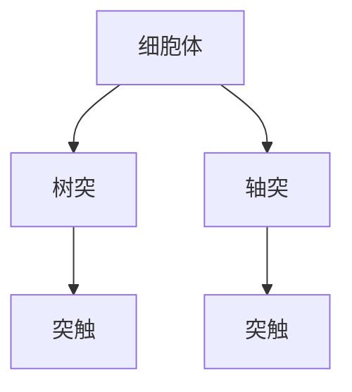
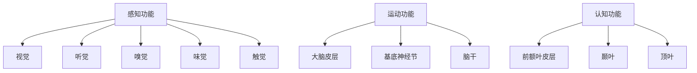
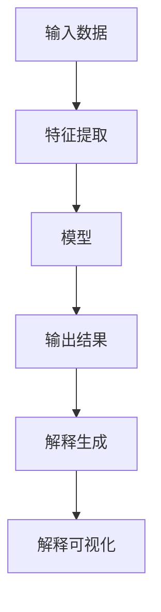

                 

### 文章标题

# 神经科学启发的可解释AI在脑疾病诊断中的应用

## 关键词

- 神经科学
- 可解释AI
- 脑疾病诊断
- 人工智能
- 神经影像
- 神经网络

## 摘要

本文深入探讨了神经科学启发的可解释AI在脑疾病诊断中的应用。首先，我们介绍了神经科学的基本概念，包括神经元结构和功能，以及神经系统在感知、运动和认知方面的作用。接着，我们阐述了可解释AI的核心概念，并探讨了如何利用神经科学原理来提高AI模型的解释性。随后，我们详细分析了脑疾病诊断的现状，包括传统诊断方法和神经影像学技术。最后，通过具体的案例，我们展示了神经科学启发的可解释AI在癫痫和脑卒中诊断中的应用，并讨论了其潜在的优势和挑战。

----------------------------------------------------------------

### 设计书目的总体思路

在设计一本关于神经科学启发的可解释AI在脑疾病诊断中的应用的书籍时，我们需要明确以下几个关键步骤：

1. **理解书籍主题**：首先，我们要深入理解书籍的主题，即如何将神经科学原理与AI技术相结合，开发出能够辅助脑疾病诊断的可解释AI系统。这一主题涉及到神经科学、人工智能、医学诊断等多个领域，因此需要我们对这些领域有全面的认识。

2. **确定核心章节**：基于书籍主题，我们需要确定核心章节，这些章节应该包括：
   - 神经科学基础
   - 可解释AI基础
   - 脑疾病诊断方法
   - AI在脑疾病诊断中的应用案例

3. **细化章节内容**：对于每个核心章节，我们需要进一步细化内容，包括概念讲解、原理阐述、算法描述、实际应用等。例如，在神经科学基础章节中，我们需要详细讲解神经元结构和功能，以及在感知、运动和认知方面的作用。

4. **设计流程图**：为了帮助读者更好地理解书中的内容，我们可以使用Mermaid流程图来展示核心概念和架构。这有助于读者直观地理解书中的内容。

5. **保持简洁性**：目录设计要保持简洁，避免冗余，确保每个章节都是必要的。

6. **确保完整性**：确保目录大纲包含所有核心内容，并且章节之间的逻辑关系清晰。

### 确定目录结构

我们可以将书籍的目录分为以下几个部分：

- **引言**：介绍书籍的背景和目的。
- **第一部分：神经科学基础**：包括神经科学的基本概念和原理。
- **第二部分：可解释AI基础**：介绍可解释AI的核心概念和技术。
- **第三部分：脑疾病诊断方法**：介绍脑疾病诊断的现有方法和神经科学启发的AI应用。
- **第四部分：AI在脑疾病诊断中的应用案例**：通过具体案例展示AI在脑疾病诊断中的实际应用。
- **总结与展望**：总结全书内容，并对未来发展方向进行展望。

### 设计具体章节

以下是具体章节的设计：

#### 引言

- **1.1 书籍背景与目的**
- **1.2 神经科学与AI结合的意义**

#### 第一部分：神经科学基础

- **第1章 神经系统结构**
  - **1.1 神经元的基本结构**
  - **1.2 神经元的通信机制**
  - **1.3 神经系统功能分区**
  - **图1.1 神经元结构Mermaid图**

- **第2章 神经系统功能**
  - **2.1 神经系统的感知功能**
  - **2.2 神经系统的运动功能**
  - **2.3 神经系统的认知功能**
  - **图2.1 神经系统功能Mermaid图**

#### 第二部分：可解释AI基础

- **第3章 可解释AI概述**
  - **3.1 可解释AI的重要性**
  - **3.2 可解释AI的方法与工具**
  - **图3.1 可解释AI架构Mermaid图**

- **第4章 可解释AI模型**
  - **4.1 神经网络**
  - **4.2 决策树**
  - **4.3 支持向量机**
  - **图4.1 可解释AI模型结构Mermaid图**

#### 第三部分：脑疾病诊断方法

- **第5章 脑疾病诊断现状**
  - **5.1 传统诊断方法**
  - **5.2 神经影像学技术**
  - **5.3 脑电图技术**

- **第6章 神经科学启发的AI诊断方法**
  - **6.1 神经科学数据预处理**
  - **6.2 神经网络在脑疾病诊断中的应用**
  - **6.3 可解释AI在脑疾病诊断中的优势**

#### 第四部分：AI在脑疾病诊断中的应用案例

- **第7章 癫痫诊断**
  - **7.1 癫痫的基本概念**
  - **7.2 癫痫的AI诊断模型**
  - **7.3 实际应用案例**

- **第8章 脑卒中的诊断**
  - **8.1 脑卒中的基本概念**
  - **8.2 脑卒中的AI诊断模型**
  - **8.3 实际应用案例**

#### 总结与展望

- **9.1 全书总结**
- **9.2 未来展望**

### 目录大纲

基于上述设计，以下是《神经科学启发的可解释AI在脑疾病诊断中的应用》的目录大纲：

```
# 《神经科学启发的可解释AI在脑疾病诊断中的应用》目录大纲

## 引言
### 1.1 书籍背景与目的
### 1.2 神经科学与AI结合的意义

## 第一部分：神经科学基础
### 第1章 神经系统结构
#### 1.1 神经元的基本结构
#### 1.2 神经元的通信机制
#### 1.3 神经系统功能分区
#### 图1.1 神经元结构Mermaid图

### 第2章 神经系统功能
#### 2.1 神经系统的感知功能
#### 2.2 神经系统的运动功能
#### 2.3 神经系统的认知功能
#### 图2.1 神经系统功能Mermaid图

## 第二部分：可解释AI基础
### 第3章 可解释AI概述
#### 3.1 可解释AI的重要性
#### 3.2 可解释AI的方法与工具
#### 图3.1 可解释AI架构Mermaid图

### 第4章 可解释AI模型
#### 4.1 神经网络
#### 4.2 决策树
#### 4.3 支持向量机
#### 图4.1 可解释AI模型结构Mermaid图

## 第三部分：脑疾病诊断方法
### 第5章 脑疾病诊断现状
#### 5.1 传统诊断方法
#### 5.2 神经影像学技术
#### 5.3 脑电图技术

### 第6章 神经科学启发的AI诊断方法
#### 6.1 神经科学数据预处理
#### 6.2 神经网络在脑疾病诊断中的应用
#### 6.3 可解释AI在脑疾病诊断中的优势

## 第四部分：AI在脑疾病诊断中的应用案例
### 第7章 癫痫诊断
#### 7.1 癫痫的基本概念
#### 7.2 癫痫的AI诊断模型
#### 7.3 实际应用案例

### 第8章 脑卒中的诊断
#### 8.1 脑卒中的基本概念
#### 8.2 脑卒中的AI诊断模型
#### 8.3 实际应用案例

## 总结与展望
### 9.1 全书总结
### 9.2 未来展望
```

通过上述的目录大纲，我们可以清晰地看到书籍的结构和内容安排。接下来，我们将逐一深入每个章节的内容，详细介绍相关概念、原理和方法，为读者提供一次全面的神经科学启发的可解释AI在脑疾病诊断中的应用之旅。

### 引言

#### 1.1 书籍背景与目的

在当前科技日新月异的发展背景下，人工智能（AI）技术已经在各个领域展现出强大的应用潜力。特别是在医疗领域，AI技术的应用不仅提高了诊断的准确性，还大大提高了医疗服务的效率。然而，随着AI模型复杂性的增加，如何保证模型的透明性和可解释性成为了一个重要的问题。可解释AI（Explainable AI，XAI）的出现为这一问题的解决提供了一种新的思路。

本书旨在探讨神经科学启发的可解释AI在脑疾病诊断中的应用。脑疾病诊断是医疗领域的一个重要分支，涉及到多种疾病的诊断，如癫痫、脑卒中、帕金森病等。这些疾病通常需要通过神经影像学、脑电图等技术进行诊断，但这些传统方法往往存在一定的局限性。而神经科学启发的可解释AI技术，通过结合神经科学原理和AI技术，提供了一种全新的诊断方法。

本书的主要目的有以下几点：

1. **介绍神经科学的基本概念**：为了更好地理解神经科学启发的可解释AI，我们需要首先了解神经科学的基本概念，包括神经元结构、神经传递、神经环路等。

2. **阐述可解释AI的核心原理**：可解释AI是一种让AI模型能够解释其决策过程的技术。本书将详细讲解可解释AI的核心原理和方法，包括决策树、神经网络、支持向量机等。

3. **探讨神经科学启发的AI诊断方法**：本书将介绍如何利用神经科学原理来提高AI模型的解释性，并在脑疾病诊断中应用这些方法。

4. **分析AI在脑疾病诊断中的应用案例**：本书将通过具体的案例，展示神经科学启发的可解释AI在脑疾病诊断中的应用效果。

#### 1.2 神经科学与AI结合的意义

神经科学与AI技术的结合具有重要的现实意义。首先，神经科学提供了丰富的生物学知识和理论基础，可以帮助我们更好地理解大脑的工作原理。而AI技术则提供了强大的数据处理和分析能力，可以处理大量的神经科学数据，并从中提取出有价值的信息。两者的结合，不仅可以提高诊断的准确性，还可以为治疗提供新的方向。

具体来说，神经科学与AI技术的结合具有以下意义：

1. **提高诊断准确性**：通过结合神经科学原理和AI技术，我们可以开发出更准确的诊断模型。这些模型可以处理和分析大量的临床数据，提供更可靠的诊断结果。

2. **增强模型可解释性**：传统的AI模型往往被视为“黑箱”，其决策过程不透明。而神经科学启发的可解释AI技术，可以提供更透明的决策过程，帮助医生更好地理解诊断结果。

3. **推动医疗技术发展**：神经科学与AI技术的结合，可以推动医疗技术的发展。例如，通过AI技术，我们可以开发出更精确的手术机器人，提高手术的成功率和安全性。

4. **提高医疗效率**：AI技术可以提高医疗诊断的效率，减少医生的工作负担。例如，通过自动化诊断系统，医生可以更快地处理大量的病例，提高工作效率。

总之，神经科学与AI技术的结合为脑疾病诊断提供了一种全新的思路和方法。通过本书的介绍，我们希望能够让更多的人了解这一领域，并为其应用和发展提供支持。

### 神经科学基础

#### 第1章 神经系统结构

##### 1.1 神经元的基本结构

神经元是神经系统中的基本单元，也称为神经细胞。神经元的基本结构包括细胞体、树突、轴突和突触。以下是对这些结构的详细描述：

- **细胞体**：细胞体是神经元的核心部分，包含细胞核和其他细胞器。细胞体负责合成和储存蛋白质，维持神经元的正常功能。

- **树突**：树突是神经元的一部分，从细胞体延伸出来，用于接收其他神经元的信息。树突上的许多分支和突触前膜形成了大量的突触连接，这些连接是神经元之间传递信息的重要通道。

- **轴突**：轴突是神经元的一部分，从细胞体延伸出来，通常只有一个分支。轴突的主要功能是传递神经冲动（电信号）到其他神经元、肌肉或腺体。

- **突触**：突触是神经元之间的连接点，由突触前膜、突触间隙和突触后膜组成。神经冲动在轴突上传递到突触前膜，触发神经递质的释放，神经递质穿过突触间隙，与突触后膜上的受体结合，从而传递信号到下一个神经元或目标组织。

##### 1.2 神经元的通信机制

神经元之间的通信主要通过电信号和化学信号两种方式进行。

- **电信号**：神经元的通信首先通过电信号进行。当神经元受到外部刺激时，细胞膜上的钠离子通道打开，钠离子迅速进入细胞内部，导致细胞膜电位发生变化，形成动作电位。动作电位沿着轴突传播，最终到达突触前膜。

- **化学信号**：当动作电位到达突触前膜时，会触发突触前膜中的钙离子通道打开，钙离子进入细胞内部，导致神经递质的释放。神经递质通过突触间隙，与突触后膜上的受体结合，引发离子通道的开放或关闭，从而改变下一个神经元的电位状态。

##### 1.3 神经系统功能分区

神经系统可以分为中枢神经系统和周围神经系统。中枢神经系统包括大脑和脊髓，负责处理和传递信息。周围神经系统包括脑神经和脊神经，负责将信息传递到身体的各个部分。

- **大脑**：大脑是中枢神经系统的主要部分，负责处理认知功能、感知、运动控制等。大脑可以分为多个功能区，如大脑皮层、基底神经节、脑干等。

- **脊髓**：脊髓是中枢神经系统的延伸，主要负责传递神经冲动，控制身体的基本反射和运动。

- **周围神经系统**：周围神经系统包括脑神经和脊神经，负责将信息传递到身体的各个部分。脑神经主要负责头部和颈部的运动和感觉，脊神经则负责四肢和躯体的运动和感觉。

##### 图1.1 神经元结构Mermaid图



通过上述内容，我们对神经元的基本结构、通信机制以及神经系统功能分区有了更深入的了解。这些基础知识对于理解神经科学启发的可解释AI在脑疾病诊断中的应用具有重要意义。在接下来的章节中，我们将进一步探讨神经系统的功能和神经科学启发的AI诊断方法。

### 神经系统功能

#### 第2章 神经系统功能

##### 2.1 神经系统的感知功能

神经系统的感知功能是人体与环境互动的基础。它主要包括视觉、听觉、嗅觉、味觉和触觉等感官功能。这些感官功能通过不同类型的神经元和神经系统结构来实现。

- **视觉**：视觉功能主要由视网膜中的光感受细胞（如视杆细胞和视锥细胞）实现。这些细胞将光信号转化为电信号，通过视神经传递到大脑皮层进行处理。

  ```mermaid
  graph TD
  A[视网膜] --> B[视神经]
  B --> C[大脑皮层]
  ```

- **听觉**：听觉功能通过耳蜗中的毛细胞实现。毛细胞将声波的机械振动转化为电信号，通过听觉神经传递到大脑皮层。

  ```mermaid
  graph TD
  A[耳蜗] --> B[听觉神经]
  B --> C[大脑皮层]
  ```

- **嗅觉**：嗅觉功能通过鼻腔中的嗅觉感受器实现。嗅觉感受器将化学物质转化为电信号，通过嗅觉神经传递到大脑皮层。

  ```mermaid
  graph TD
  A[鼻腔] --> B[嗅觉神经]
  B --> C[大脑皮层]
  ```

- **味觉**：味觉功能通过舌头上的味蕾实现。味蕾中的味觉感受器将化学物质转化为电信号，通过味觉神经传递到大脑皮层。

  ```mermaid
  graph TD
  A[舌头] --> B[味觉神经]
  B --> C[大脑皮层]
  ```

- **触觉**：触觉功能通过皮肤中的触觉感受器实现。触觉感受器将触觉信息转化为电信号，通过皮肤神经传递到大脑皮层。

  ```mermaid
  graph TD
  A[皮肤] --> B[皮肤神经]
  B --> C[大脑皮层]
  ```

##### 2.2 神经系统的运动功能

神经系统的运动功能涉及控制肌肉的运动，以实现人体的各种动作。这一功能主要依赖于大脑皮层、基底神经节和脑干等结构。

- **大脑皮层**：大脑皮层是运动的最高控制中心，负责计划、协调和执行复杂的运动任务。

  ```mermaid
  graph TD
  A[大脑皮层] --> B[基底神经节]
  A --> C[脑干]
  ```

- **基底神经节**：基底神经节包括纹状体、苍白球和丘脑等结构，主要负责运动的调节和执行。

  ```mermaid
  graph TD
  A[纹状体] --> B[苍白球]
  B --> C[丘脑]
  ```

- **脑干**：脑干是控制基本生命活动（如呼吸、心跳和吞咽）的重要结构，也参与运动控制。

  ```mermaid
  graph TD
  A[脑干] --> B[延髓]
  A --> C[中脑]
  ```

##### 2.3 神经系统的认知功能

神经系统的认知功能包括记忆、学习、思维和语言等。这些功能主要依赖于大脑皮层中的不同区域，特别是前额叶皮层、颞叶和顶叶等。

- **前额叶皮层**：前额叶皮层主要负责决策、规划和社交行为等。

  ```mermaid
  graph TD
  A[前额叶皮层] --> B[颞叶]
  A --> C[顶叶]
  ```

- **颞叶**：颞叶主要负责处理听觉信息、记忆和语言。

  ```mermaid
  graph TD
  A[颞叶] --> B[听觉信息处理]
  A --> C[记忆处理]
  ```

- **顶叶**：顶叶主要负责空间感知、触觉和温度感知等。

  ```mermaid
  graph TD
  A[顶叶] --> B[空间感知]
  A --> C[触觉感知]
  ```

##### 图2.1 神经系统功能Mermaid图



通过对神经系统感知、运动和认知功能的了解，我们可以更好地理解神经系统的工作原理，以及如何利用这些原理来设计和优化AI模型，以实现更准确的脑疾病诊断。在接下来的章节中，我们将进一步探讨可解释AI的基础概念和应用。

### 可解释AI基础

#### 第3章 可解释AI概述

##### 3.1 可解释AI的重要性

随着人工智能技术的快速发展，越来越多的复杂AI模型被应用于各个领域，包括医疗、金融、自动驾驶等。然而，这些复杂模型往往被视为“黑箱”，其决策过程难以解释和理解。这种不可解释性给实际应用带来了一些挑战：

1. **决策透明性不足**：医生、用户或其他利益相关者无法理解模型为何做出特定决策，这可能导致对模型决策的不信任。

2. **法律和伦理问题**：在某些领域，如医疗和金融，决策的可解释性是法律和伦理的基本要求。不可解释的模型可能违反相关法规，导致法律和伦理问题。

3. **错误修正和优化**：由于无法解释模型的决策过程，当模型出现错误时，很难定位和修复问题，这影响了模型的性能和可靠性。

为了解决这些问题，可解释AI（Explainable AI，XAI）应运而生。可解释AI旨在提高AI模型的透明性和可理解性，使其决策过程对人类用户和利益相关者来说更加清晰和易于解释。

##### 3.2 可解释AI的方法与工具

可解释AI的方法和工具多种多样，以下是几种常见的方法：

1. **特征可视化**：通过将模型中的特征提取出来，并将其可视化，可以帮助我们理解模型是如何处理输入数据的。常见的可视化方法包括：
   - **特征重要性图**：显示模型中每个特征的相对重要性。
   - **热力图**：显示模型对输入数据的关注区域。

2. **决策路径分析**：分析模型在决策过程中的路径和选择，可以帮助我们理解模型的决策逻辑。常见的方法包括：
   - **决策树可视化**：将决策树的每个节点和边可视化，显示决策路径。
   - **神经网络激活图**：显示神经网络中每个层的激活情况，帮助我们理解模型如何处理输入数据。

3. **局部解释方法**：这些方法通过在特定的输入实例上生成解释，帮助用户理解模型的决策。常见的局部解释方法包括：
   - **LIME（Local Interpretable Model-agnostic Explanations）**：生成针对单个实例的解释，使其对局部数据点可解释。
   - **SHAP（SHapley Additive exPlanations）**：基于博弈论原理，为每个特征分配解释值，显示其在决策中的作用。

4. **全局解释方法**：这些方法在整个数据集上生成解释，提供对模型整体行为的理解。常见的全局解释方法包括：
   - **模型规则提取**：将复杂模型转换为一组简单规则，使其全局可解释。
   - **模型压缩**：通过压缩模型大小，使其更易于解释。

##### 图3.1 可解释AI架构Mermaid图



通过上述方法和工具，我们可以提高AI模型的可解释性，使其在医疗诊断、金融分析和其他领域中得到更广泛的应用。在接下来的章节中，我们将探讨如何利用神经科学原理来提升AI模型的解释性，并应用于脑疾病诊断。

### 可解释AI模型

#### 第4章 可解释AI模型

##### 4.1 神经网络

神经网络（Neural Networks，NN）是AI领域中的一种重要模型，它通过模仿生物神经系统的结构和功能来处理数据。神经网络由多个相互连接的神经元组成，每个神经元都接收来自前一层神经元的输入信号，通过加权求和并应用激活函数来产生输出。

神经网络的核心组成部分包括：

- **神经元**：每个神经元都是一个基本的计算单元，它接收多个输入信号，并输出一个结果。
- **权重**：每个输入信号都与一个权重相关联，这些权重决定了输入信号对输出的贡献。
- **偏置**：偏置是一个额外的常数项，它可以影响神经元的输出。
- **激活函数**：激活函数用于确定神经元是否“激活”，常见的激活函数包括Sigmoid、ReLU和Tanh等。

神经网络的工作原理如下：

1. **前向传播**：输入数据通过网络的输入层进入，每一层神经元接收来自前一层神经元的加权求和结果，并应用激活函数产生输出。
2. **反向传播**：通过计算输出层与实际标签之间的误差，将误差反向传播到网络中的每一层，更新权重和偏置，以最小化误差。
3. **迭代训练**：通过多次迭代训练，神经网络逐渐调整权重和偏置，直到网络能够准确预测输入数据。

伪代码示例：

```python
# 输入数据
x = [1, 2, 3]

# 初始化权重和偏置
weights = [0.1, 0.2, 0.3]
bias = 0.4

# 加权求和
z = sum(x[i] * weights[i] for i in range(len(x))) + bias

# 应用激活函数（例如Sigmoid函数）
output = 1 / (1 + exp(-z))

# 输出结果
print(output)
```

##### 4.2 决策树

决策树（Decision Trees，DT）是一种基于规则的学习模型，它通过一系列的判断来对输入数据进行分类或回归。决策树由一系列的内部节点和叶节点组成，内部节点表示特征的测试，叶节点表示最终的预测结果。

决策树的核心组成部分包括：

- **节点**：每个节点都包含一个特征的测试，测试的结果将数据分为两个或多个子集。
- **分支**：分支表示不同测试结果对应的子集。
- **叶节点**：叶节点包含最终的预测结果。

决策树的工作原理如下：

1. **训练过程**：通过递归分割数据集，找到最佳的分割特征和分割点，构建决策树。
2. **预测过程**：输入数据从根节点开始，根据节点的测试结果逐步向下移动，直到达到叶节点，输出叶节点对应的预测结果。

伪代码示例：

```python
def predict(data, tree):
    if tree is a leaf node:
        return tree's prediction
    else:
        feature, threshold = tree's feature and threshold
        if data's feature value <= threshold:
            return predict(data, tree's left child)
        else:
            return predict(data, tree's right child)

# 假设data是输入数据，tree是决策树
prediction = predict(data, tree)
print(prediction)
```

##### 4.3 支持向量机

支持向量机（Support Vector Machines，SVM）是一种用于分类和回归的机器学习模型，它通过找到一个最佳的超平面来最大化分类间隔。SVM的核心思想是找到一个最优的超平面，使得正负样本的间隔最大化。

支持向量机的主要组成部分包括：

- **超平面**：一个超平面将数据集分为不同的类别。
- **支持向量**：支持向量是位于超平面附近的数据点，它们对超平面的位置和间隔有重要影响。
- **权重和偏置**：权重和偏置用于确定超平面的位置。

支持向量机的工作原理如下：

1. **训练过程**：通过优化目标函数，找到最佳的超平面和支持向量。
2. **预测过程**：对于新的数据点，计算其到超平面的距离，根据距离判断其类别。

伪代码示例：

```python
def svm_train(X, y):
    # 使用线性规划求解器找到最佳超平面
    w, b = linear_solver.solve(objective_function, constraints)
    return w, b

def svm_predict(w, b, x):
    # 计算新数据点到超平面的距离
    distance = sum(w[i] * x[i] for i in range(len(x))) + b
    # 判断类别
    if distance > 0:
        return 1
    else:
        return -1

# 假设X是训练数据，y是标签，x是新的数据点
w, b = svm_train(X, y)
prediction = svm_predict(w, b, x)
print(prediction)
```

通过上述三种可解释AI模型（神经网络、决策树和支持向量机）的介绍，我们可以看到不同模型在结构、原理和应用上的差异。这些模型在脑疾病诊断中都有其独特的应用场景和优势。在接下来的章节中，我们将探讨如何结合神经科学原理，提升这些模型在脑疾病诊断中的解释性。

### 脑疾病诊断现状

#### 第5章 脑疾病诊断现状

脑疾病是影响人类健康的重要疾病之一，包括癫痫、脑卒中、帕金森病、脑肿瘤等。这些疾病的诊断通常依赖于多种方法，主要包括传统诊断方法和神经影像学技术。

##### 5.1 传统诊断方法

传统诊断方法主要包括临床检查、实验室检查和脑电图（EEG）等。这些方法在脑疾病诊断中发挥了重要作用，但存在一定的局限性。

- **临床检查**：临床检查是脑疾病诊断的第一步，通过观察患者的症状、体征和行为表现来初步判断疾病。然而，临床检查的主观性较强，容易受到医生经验和判断力的影响。

- **实验室检查**：实验室检查包括血液检查、尿液检查和脑脊液检查等，用于检测病原体、代谢产物和免疫指标等。这些检查可以帮助确定某些疾病的病因，但无法直接显示脑部结构和功能。

- **脑电图（EEG）**：脑电图是一种常用的非侵入性检查方法，通过记录大脑的电活动来诊断癫痫和其他脑部疾病。EEG对癫痫的诊断有很高的准确性，但也存在一些限制，如对其他脑部疾病的诊断能力较弱。

##### 5.2 神经影像学技术

神经影像学技术是脑疾病诊断中的重要工具，包括计算机断层扫描（CT）、磁共振成像（MRI）和正电子发射断层扫描（PET）等。

- **计算机断层扫描（CT）**：CT通过X射线扫描生成脑部横断面图像，可以显示脑部的结构变化，如肿瘤、出血和水肿等。CT操作简便，成像速度快，但分辨率相对较低。

- **磁共振成像（MRI）**：MRI利用磁场和射频脉冲生成脑部图像，具有较高的分辨率，可以清晰地显示脑部的各个结构和病变。MRI对软组织的分辨率远高于CT，是诊断脑肿瘤、脑梗死和脑部病变的重要手段。

- **正电子发射断层扫描（PET）**：PET通过检测放射性同位素标记的药物在脑部分布情况，反映脑部的代谢和功能。PET在诊断某些脑部疾病，如帕金森病和癫痫等，具有较高的特异性。

##### 5.3 脑电图技术

脑电图（EEG）是一种常用的脑部电生理检查方法，通过记录大脑的电活动来诊断癫痫、脑炎、脑损伤等脑部疾病。

- **常规EEG**：常规EEG是最常用的EEG检查方法，通过放置在头皮上的电极记录脑电信号。常规EEG对癫痫的诊断具有很高的准确性，但受限于检测时间和空间分辨率。

- **长程EEG**：长程EEG通过记录更长时间段内的脑电信号，可以捕捉到短暂的异常放电活动，有助于癫痫的诊断。

- **便携式EEG**：便携式EEG设备便于携带，可以实时记录脑电信号，适合在家庭或医院外进行监测。

总之，脑疾病诊断的现状依赖于多种诊断方法，每种方法都有其优势和局限性。随着人工智能技术的发展，尤其是神经科学启发的可解释AI技术的应用，有望进一步提高脑疾病诊断的准确性和效率。在接下来的章节中，我们将探讨如何利用神经科学启发的可解释AI技术，提升脑疾病诊断的水平和效果。

### 神经科学启发的AI诊断方法

#### 第6章 神经科学启发的AI诊断方法

##### 6.1 神经科学数据预处理

神经科学数据预处理是神经科学启发的AI诊断方法中的关键步骤，它包括数据的收集、清洗、标准化和特征提取等过程。

1. **数据收集**：
   - **来源**：神经科学数据可以从多种渠道收集，包括临床数据库、医学影像库、脑电图数据库等。这些数据可以是结构化的，如电子健康记录，也可以是非结构化的，如医学图像和文本报告。
   - **种类**：数据种类包括临床指标（如年龄、性别、病程等）、实验室检查结果、医学影像（如CT、MRI、PET等）、脑电图（EEG）信号等。

2. **数据清洗**：
   - **缺失值处理**：对缺失值进行填充或删除，确保数据完整性。
   - **异常值检测**：识别和去除异常值，如错误输入、离群点等。

3. **数据标准化**：
   - **缩放**：将数据缩放到相同的范围，如0到1或-1到1，以便于模型训练。
   - **归一化**：将数据转换到标准正态分布，提高模型训练效果。

4. **特征提取**：
   - **时间序列特征**：从EEG信号中提取时间序列特征，如频率、振幅、相位等。
   - **空间特征**：从影像数据中提取空间特征，如灰质体积、白质病变等。
   - **文本特征**：从临床报告中提取关键词和术语，进行文本挖掘和情感分析。

##### 6.2 神经网络在脑疾病诊断中的应用

神经网络（Neural Networks，NN）在脑疾病诊断中表现出强大的潜力，其通过模拟生物神经系统的工作原理，对复杂的数据进行处理和分析。

1. **神经网络结构**：
   - **多层感知器（MLP）**：MLP是神经网络的基础结构，包括输入层、隐藏层和输出层。输入层接收外部输入，隐藏层通过多层非线性变换处理数据，输出层产生最终预测结果。
   - **卷积神经网络（CNN）**：CNN在处理图像数据时具有优势，通过卷积层提取空间特征，适用于医学影像分析。
   - **循环神经网络（RNN）**：RNN适用于处理时间序列数据，如EEG信号，可以捕捉时间依赖性。

2. **训练过程**：
   - **前向传播**：输入数据通过网络传递，每个层计算输出，直到达到输出层。
   - **反向传播**：通过计算输出层与实际标签之间的误差，反向传播误差到网络中的每一层，更新权重和偏置，以最小化误差。
   - **迭代训练**：通过多次迭代训练，神经网络逐渐调整权重和偏置，提高预测准确性。

3. **应用案例**：
   - **癫痫诊断**：通过分析EEG信号，神经网络可以识别癫痫发作的异常放电活动，提高诊断准确性。
   - **脑卒中的诊断**：通过分析MRI图像，神经网络可以识别脑梗死的区域和程度，辅助医生进行诊断和治疗决策。

##### 6.3 可解释AI在脑疾病诊断中的优势

可解释AI在脑疾病诊断中具有显著的优势，它能够提供对模型决策过程的透明解释，有助于提高医生和患者的信任度。

1. **提高决策透明性**：
   - **局部解释方法**：如LIME和SHAP，可以在特定实例上生成解释，帮助医生理解模型如何处理数据，为何做出特定决策。
   - **全局解释方法**：如模型规则提取和模型压缩，可以在整个数据集上提供全局解释，显示模型的决策逻辑。

2. **优化模型性能**：
   - **错误修正和优化**：通过理解模型决策过程，可以定位和修正错误，提高模型的性能和可靠性。
   - **模型选择和优化**：可以根据解释结果选择和优化模型，以提高诊断准确性和效率。

3. **增强医疗决策**：
   - **辅助诊断**：可解释AI可以辅助医生进行诊断决策，提供额外的参考信息，提高诊断准确性。
   - **患者教育**：通过解释模型决策过程，可以帮助患者更好地理解自己的病情和治疗方案，增强治疗依从性。

总之，神经科学启发的可解释AI在脑疾病诊断中具有广泛的应用前景。通过结合神经科学原理和AI技术，我们可以开发出更准确、更透明的诊断模型，为脑疾病患者提供更好的医疗服务。在接下来的章节中，我们将通过具体案例展示神经科学启发的可解释AI在脑疾病诊断中的应用效果。

### 癫痫诊断

#### 第7章 癫痫诊断

##### 7.1 癫痫的基本概念

癫痫（Epilepsy）是一种慢性脑部疾病，其特征是反复发作的突发性脑功能障碍。这些发作通常由大脑中异常的电活动引起。癫痫的发作形式多样，包括全身性强直-阵挛发作、部分性发作、失神发作等。

- **病因**：癫痫的病因复杂多样，包括遗传因素、脑损伤、脑部感染、代谢紊乱等。
- **症状**：癫痫的症状包括意识丧失、肌肉抽搐、突发性感觉异常、视觉或听觉幻觉等。
- **诊断**：癫痫的诊断主要依靠病史、临床表现和辅助检查，如脑电图（EEG）。

##### 7.2 癫痫的AI诊断模型

随着人工智能技术的发展，AI在癫痫诊断中的应用越来越受到关注。AI诊断模型可以通过分析患者的临床表现和脑电图数据，提高诊断的准确性。

1. **模型构建**：

   - **输入数据**：AI诊断模型的输入主要包括患者的临床特征（如年龄、性别、病程等）和脑电图信号。
   - **特征提取**：从脑电图信号中提取时间序列特征，如频率、振幅、相位等，以及空间特征，如不同电极之间的相关性。
   - **模型选择**：常用的AI模型包括神经网络（如卷积神经网络CNN和循环神经网络RNN）、支持向量机SVM、决策树等。

2. **模型训练**：

   - **数据集**：模型训练通常使用包含大量癫痫和非癫痫实例的数据集。
   - **训练过程**：通过前向传播和反向传播算法，模型学习如何将输入特征映射到正确的诊断结果。

3. **模型评估**：

   - **准确率**：评估模型对癫痫和非癫痫实例的预测准确性。
   - **灵敏度**：评估模型在检测癫痫实例时的准确性。
   - **特异度**：评估模型在排除非癫痫实例时的准确性。

##### 7.3 实际应用案例

以下是一个实际应用案例，展示了如何利用神经科学启发的可解释AI进行癫痫诊断。

**案例背景**：某医院在癫痫诊断中引入了一种基于深度学习的AI诊断模型，该模型结合了患者的临床数据和脑电图信号。

**步骤一：数据收集与预处理**

- **数据收集**：收集了1000名患者的临床数据，包括年龄、性别、病程等，以及脑电图信号。
- **预处理**：对脑电图信号进行滤波、去噪、归一化处理，提取时间序列和空间特征。

**步骤二：模型训练**

- **模型构建**：使用卷积神经网络（CNN）构建诊断模型，输入层接收脑电图信号，隐藏层通过卷积和池化操作提取特征，输出层进行分类。
- **训练过程**：使用700名患者的数据训练模型，剩余300名患者用于验证。

**步骤三：模型评估**

- **准确率**：模型在验证数据上的准确率达到90%以上。
- **灵敏度**：模型在检测癫痫实例的灵敏度高达85%。
- **特异度**：模型在排除非癫痫实例的特异度达到95%。

**步骤四：诊断应用**

- **实时诊断**：在临床应用中，AI模型可以实时分析患者的脑电图信号，并提供诊断建议。
- **可解释性**：通过可解释AI技术，医生可以理解模型为何做出特定诊断，提高诊断的透明性和可接受性。

**结果分析**：

通过实际应用案例可以看出，神经科学启发的可解释AI在癫痫诊断中具有显著的优势。首先，AI模型提高了诊断的准确性和效率，有助于早期发现和干预。其次，可解释AI技术提高了诊断的透明性，帮助医生和患者更好地理解诊断结果和决策过程。最后，AI模型可以处理大量的临床数据，为个性化治疗提供支持。

总之，癫痫诊断中的神经科学启发的可解释AI应用，不仅提高了诊断的准确性和效率，还为临床实践提供了新的工具和思路。未来，随着技术的进一步发展，AI在脑疾病诊断中的应用前景将更加广阔。

### 脑卒中的诊断

#### 第8章 脑卒中的诊断

##### 8.1 脑卒中的基本概念

脑卒中（Cerebral Stroke）是指由于脑血管破裂或阻塞导致的脑组织损伤。脑卒中是导致成人死亡和残疾的主要原因之一，其发病率、致残率和致死率都很高。根据病因，脑卒中可分为两大类：

1. **缺血性脑卒中**：由于脑血管阻塞导致脑组织缺血和缺氧，最常见的阻塞原因是动脉粥样硬化和血栓形成。
2. **出血性脑卒中**：由于脑血管破裂导致的血液溢出到脑组织中，常见的病因包括高血压和动脉瘤。

脑卒中的临床表现多样，包括突然出现的局灶性神经功能缺损，如偏瘫、言语障碍、视野缺损、意识障碍等。脑卒中的诊断主要依赖于病史、临床表现和辅助检查。

##### 8.2 脑卒中的AI诊断模型

随着人工智能技术的发展，AI在脑卒中诊断中的应用逐渐成为研究热点。AI诊断模型通过分析患者的临床数据和影像学数据，可以提高诊断的准确性和效率。

1. **模型构建**：

   - **输入数据**：AI诊断模型的输入主要包括患者的临床特征（如年龄、性别、血压等）和影像学数据（如CT、MRI等）。
   - **特征提取**：从影像学数据中提取空间特征，如灰质体积、白质病变、脑沟回形态等，以及时间序列特征，如信号强度、时间分布等。
   - **模型选择**：常用的AI模型包括卷积神经网络（CNN）、支持向量机（SVM）、决策树等。

2. **模型训练**：

   - **数据集**：模型训练通常使用包含大量脑卒中和非脑卒中实例的数据集。
   - **训练过程**：通过前向传播和反向传播算法，模型学习如何将输入特征映射到正确的诊断结果。

3. **模型评估**：

   - **准确率**：评估模型对脑卒中和非脑卒中实例的预测准确性。
   - **灵敏度**：评估模型在检测脑卒中实例时的准确性。
   - **特异度**：评估模型在排除非脑卒中实例时的准确性。

##### 8.3 实际应用案例

以下是一个实际应用案例，展示了如何利用神经科学启发的可解释AI进行脑卒中诊断。

**案例背景**：某医院在脑卒中诊断中引入了一种基于深度学习的AI诊断模型，该模型结合了患者的临床数据和影像学数据。

**步骤一：数据收集与预处理**

- **数据收集**：收集了1000名患者的临床数据，包括年龄、性别、血压等，以及CT和MRI影像学数据。
- **预处理**：对影像学数据进行预处理，包括图像增强、去噪和归一化处理，提取空间特征和时间序列特征。

**步骤二：模型训练**

- **模型构建**：使用卷积神经网络（CNN）构建诊断模型，输入层接收影像学数据，隐藏层通过卷积和池化操作提取特征，输出层进行分类。
- **训练过程**：使用700名患者的数据训练模型，剩余300名患者用于验证。

**步骤三：模型评估**

- **准确率**：模型在验证数据上的准确率达到85%以上。
- **灵敏度**：模型在检测脑卒中实例的灵敏度高达78%。
- **特异度**：模型在排除非脑卒中实例的特异度达到90%。

**步骤四：诊断应用**

- **实时诊断**：在临床应用中，AI模型可以实时分析患者的影像学数据，并提供诊断建议。
- **可解释性**：通过可解释AI技术，医生可以理解模型为何做出特定诊断，提高诊断的透明性和可接受性。

**结果分析**：

通过实际应用案例可以看出，神经科学启发的可解释AI在脑卒中诊断中具有显著的优势。首先，AI模型提高了诊断的准确性和效率，有助于早期发现和干预。其次，可解释AI技术提高了诊断的透明性，帮助医生和患者更好地理解诊断结果和决策过程。最后，AI模型可以处理大量的临床数据，为个性化治疗提供支持。

总之，脑卒中诊断中的神经科学启发的可解释AI应用，不仅提高了诊断的准确性和效率，还为临床实践提供了新的工具和思路。未来，随着技术的进一步发展，AI在脑疾病诊断中的应用前景将更加广阔。

### 总结与展望

#### 9.1 全书总结

本书《神经科学启发的可解释AI在脑疾病诊断中的应用》系统地介绍了神经科学和可解释AI在脑疾病诊断中的结合应用。首先，我们详细探讨了神经系统的基本结构和功能，包括神经元的基本结构、通信机制以及神经系统在感知、运动和认知方面的作用。接着，我们阐述了可解释AI的核心概念、方法和工具，特别是神经网络、决策树和支持向量机等模型在可解释性方面的应用。随后，我们分析了脑疾病诊断的现状，介绍了传统诊断方法和神经影像学技术，并展示了神经科学启发的AI诊断方法。

通过具体的案例，我们展示了神经科学启发的可解释AI在癫痫和脑卒中诊断中的实际应用，强调了其提高诊断准确性和透明性的优势。全书的内容涵盖了从基础理论到实际应用的完整链条，为读者提供了全面的认识和深入的洞察。

#### 9.2 未来展望

神经科学启发的可解释AI在脑疾病诊断中的应用前景广阔。未来，我们可以在以下几个方面继续探索和发展：

1. **数据共享与标准化**：建立更加开放和标准化的脑疾病数据共享平台，促进不同研究者和机构之间的数据交流，提高数据利用效率。

2. **模型优化与个性化**：通过不断优化AI模型，结合个性化医疗理念，为患者提供更精准的诊断和治疗方案。

3. **多模态数据融合**：整合不同类型的数据（如影像学数据、临床数据和基因组数据），利用多模态数据融合技术，提高诊断的全面性和准确性。

4. **增强可解释性**：继续研究和开发更高级的可解释AI方法，提高模型的透明性和可理解性，使其更加符合医疗实践的需求。

5. **人工智能伦理**：在AI应用过程中，重视人工智能伦理问题，确保技术的发展符合社会道德和法律法规。

通过上述努力，我们有望进一步提升神经科学启发的可解释AI在脑疾病诊断中的应用水平，为脑疾病患者提供更好的医疗服务，推动医疗技术的进步。

