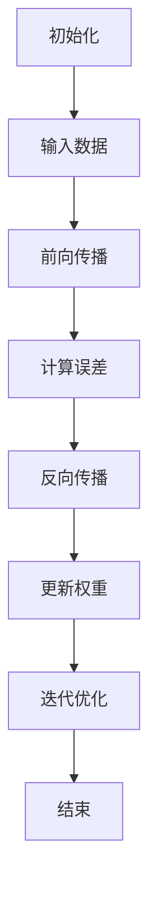
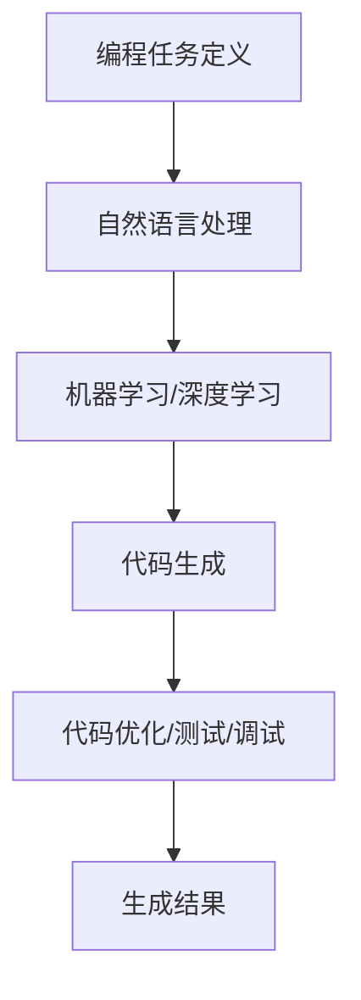
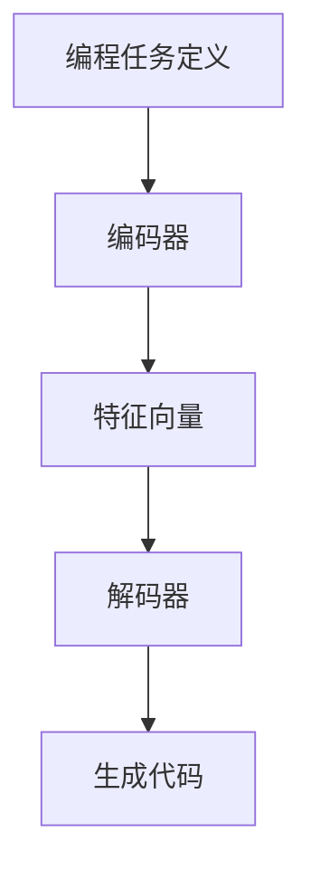

                 

### 文章标题：神经程序合成：AI自动化编程的前沿探索

#### 关键词：
- 神经程序合成
- 自动化编程
- AI技术
- 软件开发
- 前沿探索

#### 摘要：
本文深入探讨了神经程序合成这一新兴领域，重点阐述了其核心概念、原理及与自动化编程的结合。通过分析神经程序合成在软件开发中的应用，本文揭示了AI技术在编程领域的潜在变革力量。此外，文章还探讨了神经程序合成与自动化编程的融合趋势、面临的挑战以及未来发展前景，为相关领域的研究和应用提供了有价值的参考。

### 引言

在当今快速发展的信息技术时代，编程作为软件开发的基石，其效率和准确性直接影响到软件产品的质量和交付速度。随着AI技术的不断进步，自动化编程逐渐成为业界关注的焦点。然而，传统的自动化编程技术主要依赖于预定义的规则和模板，难以应对复杂和动态的编程需求。为了解决这一问题，研究者们开始探索新的编程方法——神经程序合成。

神经程序合成（Neural Program Synthesis，NPS）是一种利用神经网络模型自动生成代码的方法。它通过学习大量的编程样例，能够生成满足特定需求的代码片段，甚至完整的程序。与传统的编程方式相比，神经程序合成具有以下几个显著优势：

1. **高效性**：神经程序合成能够快速生成代码，显著提高开发效率。
2. **灵活性**：NPS能够根据不同的需求和场景生成相应的代码，具有较强的适应能力。
3. **智能性**：NPS利用机器学习算法，能够从大量的编程数据中提取规律，生成高质量的代码。

本文将围绕神经程序合成的核心概念、技术实现、应用场景以及未来发展展开深入探讨，旨在揭示神经程序合成在自动化编程领域的巨大潜力。

### 神经程序合成的核心概念与原理

神经程序合成是一种基于神经网络的编程方法，其核心思想是通过训练神经网络模型，使其能够生成满足特定需求的代码。要理解神经程序合成的原理，我们需要从以下几个方面进行详细探讨：

#### 神经网络基础

神经网络（Neural Network，NN）是一种模拟人脑神经元结构和功能的计算模型。它由多个神经元（也称为节点）组成，每个神经元都与其它神经元通过权重连接。神经网络通过学习输入数据，调整这些权重，以达到预测输出结果的目的。

#### 编程数据集

神经程序合成需要大量的编程数据作为训练集。这些数据可以是各种编程语言的代码片段，甚至是完整的程序。通过这些数据，神经网络可以学习编程的基本规律和模式。

#### 编程任务定义

在神经程序合成中，编程任务可以通过一种形式化的描述语言来定义。这种描述语言通常包括函数定义、变量声明、控制流语句等。神经网络需要根据这种描述生成满足任务的代码。

#### 神经网络训练过程

神经程序合成的训练过程主要包括以下步骤：

1. **初始化**：随机初始化神经网络模型的权重。
2. **输入数据**：将编程数据输入到神经网络中。
3. **前向传播**：计算输入数据通过神经网络后的输出。
4. **反向传播**：计算输出误差，并更新神经网络权重。
5. **迭代优化**：重复上述步骤，直到神经网络生成代码的误差达到预定的阈值。

#### 编码解码机制

神经程序合成通常采用编码解码（Encoder-Decoder）机制。编码器（Encoder）负责将编程任务的形式化描述转换为神经网络可以处理的高维特征向量；解码器（Decoder）则负责将这些特征向量解码为具体的代码。

#### Mermaid流程图

为了更直观地理解神经程序合成的原理，我们可以使用Mermaid流程图来展示其训练过程：



#### 伪代码实现

以下是神经程序合成的伪代码实现，简要展示了其主要步骤：

```python
# 初始化神经网络
initialize_neural_network()

# 输入编程数据
for data in programming_data:
    # 前向传播
    output = forward_pass(data)
    
    # 计算误差
    error = calculate_error(output, target)
    
    # 反向传播
    update_weights(error)

# 迭代优化
while not_converged:
    # 前向传播
    output = forward_pass(data)
    
    # 计算误差
    error = calculate_error(output, target)
    
    # 反向传播
    update_weights(error)

# 输出生成的代码
generate_code(output)
```

通过上述分析，我们可以看到，神经程序合成是一种基于神经网络和机器学习算法的编程方法，其核心原理包括神经网络基础、编程数据集、编程任务定义、神经网络训练过程和编码解码机制。这些原理共同构成了神经程序合成的基础，为AI自动化编程提供了新的思路和方向。

### AI自动化编程的基础知识

AI自动化编程是指利用人工智能技术，如机器学习、深度学习等，自动化完成编程任务的过程。与传统编程方法相比，AI自动化编程具有更高的灵活性和智能化程度。要深入理解AI自动化编程，我们需要从以下几个方面进行探讨：

#### AI自动化编程的定义

AI自动化编程可以定义为：通过训练人工智能模型，使其能够自动生成、优化或辅助人类完成编程任务的过程。这种编程方法不仅包括代码的生成，还涵盖了代码的优化、测试和调试等环节。

#### AI自动化编程的分类

AI自动化编程可以分为以下几个主要类别：

1. **代码生成**：通过机器学习模型，根据输入的描述或需求，自动生成代码。例如，基于自然语言描述生成代码、基于数据生成代码等。
2. **代码优化**：对现有代码进行分析，提出优化建议，以提高其性能和可读性。例如，自动优化算法、代码压缩等。
3. **代码测试**：利用AI模型自动生成测试用例，进行代码测试，确保其正确性和稳定性。
4. **代码调试**：通过分析错误日志和代码执行情况，自动定位和修复代码中的错误。

#### AI自动化编程的关键技术

AI自动化编程的关键技术包括：

1. **自然语言处理（NLP）**：用于处理自然语言输入，将自然语言描述转换为机器可读的编程任务。
2. **机器学习（ML）**：用于训练和优化AI模型，使其能够自动生成代码。
3. **深度学习（DL）**：用于处理复杂的编程任务，如图像识别、语音识别等。
4. **代码生成器**：专门用于生成代码的AI模型，如基于Transformer的代码生成模型、基于生成对抗网络的代码生成模型等。

#### AI自动化编程的应用场景

AI自动化编程在多个领域具有广泛的应用前景，主要包括：

1. **软件开发**：通过AI自动化编程，可以快速生成高质量的代码，提高开发效率。
2. **运维管理**：利用AI自动化编程，可以自动生成和优化运维脚本，提高运维效率。
3. **数据分析**：通过AI自动化编程，可以自动化生成数据处理和分析代码，提升数据处理能力。
4. **智能硬件**：利用AI自动化编程，可以自动生成硬件驱动程序和接口代码，提高硬件的开发和部署效率。

#### Mermaid流程图

以下是AI自动化编程的基本流程图，展示了从编程任务定义到代码生成的整个过程：



#### 伪代码实现

以下是AI自动化编程的伪代码实现，简要展示了其主要步骤：

```python
# 编程任务定义
define_programming_task()

# 自然语言处理
processed_input = natural_language_processing(input_description)

# 机器学习/深度学习
code = machine_learning(processed_input)

# 代码生成
generated_code = code_generator(code)

# 代码优化/测试/调试
optimized_code = code_optimization(generated_code)
tested_code = code_testing(optimized_code)
debugged_code = code_debugging(tested_code)

# 生成结果
generate_result(debugged_code)
```

通过上述分析，我们可以看到，AI自动化编程是一种基于人工智能技术的编程方法，其定义、分类、关键技术和应用场景构成了AI自动化编程的基础。在接下来的章节中，我们将进一步探讨神经程序合成在AI自动化编程中的应用，以及二者如何结合，为编程领域带来变革。

### 神经程序合成的技术实现

神经程序合成作为一种新兴的编程方法，其技术实现涉及多个关键环节，包括神经网络模型的选择、训练数据的准备、编程任务的定义以及代码生成算法的设计。在本节中，我们将详细探讨这些技术细节，并通过具体案例来展示其实现过程。

#### 神经网络模型的选择

神经程序合成的核心在于选择合适的神经网络模型。常见的神经网络模型包括循环神经网络（RNN）、长短期记忆网络（LSTM）、门控循环单元（GRU）和Transformer等。这些模型各有优缺点，适用于不同的编程任务。

1. **RNN**：RNN是一种能够处理序列数据的神经网络模型，特别适用于生成代码的序列任务。然而，RNN在处理长序列时容易出现梯度消失和梯度爆炸问题。
2. **LSTM和GRU**：LSTM和GRU是RNN的改进版本，通过引入门控机制解决了梯度消失和梯度爆炸问题。它们在处理长序列数据时表现更好，但计算复杂度较高。
3. **Transformer**：Transformer是一种基于注意力机制的神经网络模型，特别适用于处理长序列任务。它通过自注意力机制能够更好地捕捉序列中的依赖关系，具有更高的生成能力。

在神经程序合成中，Transformer因其强大的处理能力和灵活性，成为首选模型。

#### 训练数据的准备

神经程序合成的训练数据是模型性能的关键因素。训练数据应包括大量的编程样例，这些样例可以是各种编程语言编写的代码片段，甚至是完整的程序。为了确保数据的多样性和质量，需要从多个来源收集数据，并进行预处理。

1. **数据来源**：数据可以从开源代码库、开源项目、公开的编程竞赛等渠道获取。此外，还可以利用爬虫技术自动收集互联网上的代码样例。
2. **数据预处理**：预处理步骤包括去除无关信息、统一代码风格、格式化代码等。例如，可以将所有代码转换为统一的语法格式，去除注释和空白字符。
3. **数据标注**：对于一些特定的编程任务，如根据自然语言描述生成代码，需要对其进行标注。标注步骤包括定义编程任务的标签、标注代码的功能和结构等。

#### 编程任务的定义

在神经程序合成中，编程任务需要以一种形式化的方式定义，以便神经网络模型可以理解并生成相应的代码。常见的编程任务定义方式包括：

1. **抽象语法树（AST）表示**：AST是一种用于表示程序结构的抽象语法表示法。通过将代码转换为AST，神经网络可以更好地理解代码的结构和语义。
2. **自然语言描述**：利用自然语言描述编程任务，如“编写一个计算两个数之和的程序”。这种定义方式需要结合自然语言处理技术，将自然语言描述转换为机器可处理的格式。

#### 编码解码机制

神经程序合成通常采用编码解码（Encoder-Decoder）机制，其中编码器（Encoder）负责将编程任务的形式化描述转换为高维特征向量，解码器（Decoder）则负责将这些特征向量解码为具体的代码。

1. **编码器**：编码器通常使用Transformer模型，其输入是编程任务的形式化描述，如AST或自然语言文本。编码器通过自注意力机制捕捉输入的依赖关系，并将这些关系编码为高维特征向量。
2. **解码器**：解码器同样使用Transformer模型，其输入是编码器生成的特征向量。解码器通过自注意力和交叉注意力机制，生成并调整代码的每个部分，直至生成完整的代码。

#### Mermaid流程图

以下是神经程序合成的技术实现流程图：



#### 伪代码实现

以下是神经程序合成的基本伪代码实现，简要展示了其主要步骤：

```python
# 编程任务定义
task = define_programming_task()

# 编码器
encoded_vector = encoder(task)

# 解码器
code = decoder(encoded_vector)

# 生成代码
generated_code = generate_code(code)
```

#### 案例分析

为了更好地理解神经程序合成的技术实现，我们来看一个简单的案例：根据自然语言描述生成一个Python函数，用于计算两个数之和。

1. **编程任务定义**：“编写一个Python函数，接收两个整数参数，返回它们的和。”

2. **编码器**：编码器将自然语言描述转换为AST表示，例如：

   ```python
   AST = {
       'type': 'function',
       'name': 'add',
       'arguments': [
           {'type': 'variable', 'name': 'a'},
           {'type': 'variable', 'name': 'b'}
       ],
       'body': {
           'type': 'expression',
           'operator': '+',
           'operands': ['a', 'b']
       }
   }
   ```

3. **解码器**：解码器根据AST生成Python代码：

   ```python
   def add(a, b):
       return a + b
   ```

通过上述实现，我们可以看到，神经程序合成通过编码解码机制，将自然语言描述转换为具体的代码。这种实现方法不仅提高了编程的灵活性，也为自动化编程带来了新的可能。

### AI自动化编程的应用案例

AI自动化编程在多个领域展现了其强大的应用潜力。以下是几个典型的应用案例，通过具体实例展示其在软件开发、运维管理、数据分析等领域的实际应用。

#### 软件开发

在软件开发中，AI自动化编程可以通过代码生成和优化，显著提高开发效率。例如，Google的SynthAI项目利用神经网络模型，根据自然语言描述自动生成Python代码。以下是一个自然语言描述及其自动生成的Python代码实例：

**自然语言描述**：“编写一个函数，计算两个数的最小公倍数。”

**自动生成的Python代码**：

```python
def find_lcm(a, b):
    greater = max(a, b)
    while True:
        if greater % a == 0 and greater % b == 0:
            return greater
        greater += 1
```

通过这种方式，开发人员可以快速生成满足需求的代码，减少手动编写代码的工作量。

#### 运维管理

在运维管理领域，AI自动化编程可以自动化生成和优化运维脚本，提高运维效率。例如，AWS的SageMaker Autopilot功能使用机器学习模型，自动生成和优化EC2实例的启动脚本。以下是一个自动生成的EC2实例启动脚本实例：

**启动脚本**：

```bash
#!/bin/bash
sudo apt update
sudo apt install -y python3-pip
pip3 install numpy
sudo apt install -y nginx
sudo service nginx start
```

这个脚本自动安装了Python 3、NumPy库和Nginx，并启动了Nginx服务，简化了运维人员的工作。

#### 数据分析

在数据分析领域，AI自动化编程可以自动化生成数据处理和分析代码，提高数据处理能力。例如，IBM的Watson Studio使用机器学习模型，根据自然语言描述自动生成SQL查询和数据分析代码。以下是一个自然语言描述及其自动生成的SQL查询实例：

**自然语言描述**：“从销售数据表中查询2022年各月份的总销售额。”

**自动生成的SQL查询**：

```sql
SELECT MONTH(sale_date) AS month, SUM(sale_amount) AS total_sales
FROM sales_data
WHERE YEAR(sale_date) = 2022
GROUP BY MONTH(sale_date);
```

通过这种方式，数据分析师可以快速生成满足需求的查询代码，简化数据分析过程。

#### 案例分析和实现细节

以上案例展示了AI自动化编程在不同领域的实际应用。以下是每个案例的实现细节分析：

1. **代码生成模型**：这些案例使用的是基于Transformer的编码解码模型。这些模型通过大量的编程数据集进行训练，能够理解自然语言描述并生成相应的代码。

2. **训练数据准备**：为了训练这些模型，需要收集大量的编程数据集，并进行预处理。预处理步骤包括去除无关信息、统一代码风格、格式化代码等。

3. **编程任务定义**：在这些案例中，编程任务是通过自然语言描述的形式定义的。这些描述被转换为AST或具体的代码模板，作为模型的输入。

4. **代码生成算法**：编码解码模型通过自注意力和交叉注意力机制，生成并调整代码的每个部分，直至生成完整的代码。

通过上述分析，我们可以看到，AI自动化编程在不同领域都展现了其强大的应用潜力。通过代码生成和优化，AI自动化编程能够显著提高开发效率、运维效率和数据处理能力，为各个领域带来了实质性的改进。

### 神经程序合成与AI自动化编程的结合

神经程序合成与AI自动化编程的结合，不仅能够发挥各自的优势，还能实现1+1>2的效果。在这一节中，我们将探讨这两者的融合优势、融合方法以及具体应用案例，并分析其带来的影响。

#### 融合优势

1. **增强编程能力**：神经程序合成通过神经网络模型，能够生成复杂和高度优化的代码。与AI自动化编程结合，可以使开发人员利用这些代码，进一步提高编程能力。

2. **提高开发效率**：AI自动化编程通过自动化代码生成和优化，可以显著减少开发时间和人力成本。与神经程序合成结合，可以实现更高效、更智能的代码生成过程。

3. **优化代码质量**：神经程序合成具有学习编程模式的能力，可以生成高质量、符合最佳实践的代码。与AI自动化编程结合，可以进一步优化代码性能和可维护性。

4. **降低学习门槛**：对于新手开发者，AI自动化编程可以通过代码生成和优化，帮助他们快速上手编程。与神经程序合成结合，可以进一步提升新手开发者的编程能力。

#### 融合方法

1. **代码生成与优化**：将神经程序合成模型应用于AI自动化编程中的代码生成环节，利用其生成高质量的代码。同时，结合AI自动化编程的优化算法，对生成的代码进行性能优化。

2. **自然语言处理**：利用AI自动化编程中的自然语言处理技术，将开发人员的自然语言描述转换为形式化的编程任务。结合神经程序合成，可以生成更符合需求且高质量的代码。

3. **多模态数据融合**：将多种数据源（如文本、代码、图片等）进行融合，利用神经程序合成和AI自动化编程分别处理不同类型的数据，实现更全面的编程自动化。

4. **模块化设计**：在AI自动化编程中，将神经程序合成作为一个模块，与现有的代码生成、优化和测试模块结合，形成一个完整的自动化编程框架。

#### 应用案例

1. **智能编程助手**：结合神经程序合成和AI自动化编程，开发一个智能编程助手，能够理解开发人员的自然语言描述，并自动生成相应的代码。例如，开发人员可以输入“实现一个简单的Web服务”，助手将自动生成对应的Python Flask代码。

2. **自动化代码优化**：结合神经程序合成和AI自动化编程，对现有代码进行自动化优化。例如，在维护一个复杂的Web应用时，AI自动化编程可以生成优化建议，而神经程序合成则可以进一步优化这些代码，提高应用性能。

3. **自动化测试生成**：利用神经程序合成生成测试用例，结合AI自动化编程执行测试，确保代码的质量和稳定性。例如，在开发一个数据分析和可视化应用时，AI自动化编程可以生成测试数据集，而神经程序合成则可以生成相应的测试代码。

#### 影响分析

1. **提高编程生产力**：通过结合神经程序合成和AI自动化编程，开发人员可以更高效地完成编程任务，提高编程生产力。

2. **降低开发成本**：自动化代码生成和优化，可以显著降低开发成本，特别是在处理复杂和重复性任务时。

3. **提升代码质量**：神经程序合成能够生成高质量、符合最佳实践的代码，有助于提升整个项目的代码质量。

4. **促进技术普及**：通过降低编程学习门槛，促进更多的人参与到编程领域，推动技术的普及和发展。

综上所述，神经程序合成与AI自动化编程的结合，为编程领域带来了诸多好处。通过融合两者的优势，可以实现更高效、更智能的编程过程，为软件开发带来革命性的变革。

### 未来展望与挑战

神经程序合成与AI自动化编程的结合，为编程领域带来了前所未有的变革潜力。然而，要实现这一目标，仍需克服诸多挑战并朝着明确的发展方向努力。

#### 面临的挑战

1. **数据质量和数量**：神经程序合成依赖于大量的高质量编程数据集。然而，现有的编程数据集往往存在不完整、不一致甚至错误的情况，这给模型的训练和优化带来了困难。

2. **计算资源**：神经网络模型，特别是深度学习模型，需要大量的计算资源进行训练。在实际应用中，高性能计算资源难以普及，这限制了神经程序合成和AI自动化编程的广泛应用。

3. **模型可解释性**：神经网络模型，尤其是深度学习模型，通常被视为“黑箱”。模型生成的代码难以解释，这给代码的审查和维护带来了挑战。

4. **安全和隐私**：自动化生成的代码可能会引入安全漏洞或隐私风险。如何在保证安全的前提下，充分利用AI自动化编程的能力，是亟待解决的问题。

#### 发展方向

1. **数据集建设**：加强编程数据集的建设和管理，通过自动化工具和社区协作，积累更多高质量、多样化的编程数据。

2. **模型优化与压缩**：研究更加高效、紧凑的神经网络模型，降低模型的计算复杂度，使其在有限的计算资源下也能发挥强大能力。

3. **可解释性提升**：开发可解释的神经网络模型，通过可视化、解释性算法等手段，提高模型生成的代码的可理解性和可维护性。

4. **安全性和隐私保护**：引入安全性和隐私保护机制，对自动化生成的代码进行审查和测试，确保其在使用过程中不会引入安全漏洞或隐私风险。

5. **跨学科融合**：将神经科学、认知科学等领域的知识引入编程领域，探索更符合人类思维方式的编程模型和算法。

#### 研究与开发建议

1. **跨学科合作**：鼓励计算机科学、神经科学、认知科学等多个领域的专家共同合作，推动神经程序合成与AI自动化编程的理论和实践发展。

2. **开源社区**：构建开源社区，共享编程数据集、模型代码和研究成果，促进技术的普及和推广。

3. **持续优化**：不断优化和改进神经网络模型和算法，提高其性能和可解释性，以适应更复杂和多样化的编程任务。

4. **实践验证**：在实际项目中应用神经程序合成与AI自动化编程，通过实践验证其有效性，并不断优化和完善相关技术。

通过克服这些挑战，沿着明确的发展方向努力，神经程序合成与AI自动化编程将在未来编程领域发挥更为重要的作用，推动编程技术迈向新的高度。

### 附录

#### 附录A：神经程序合成与AI自动化编程相关的工具与资源

1. **工具**
   - **TensorFlow**：Google开发的开源机器学习框架，适用于构建和训练神经网络模型。
   - **PyTorch**：由Facebook开发的另一个流行的机器学习框架，具有灵活性和高效性。
   - **NLTK**：Python自然语言处理库，用于文本分析和处理。
   - **AST tokens**：用于表示程序结构的抽象语法树库，支持多种编程语言。

2. **资源**
   - **GitHub**：开源代码平台，许多与神经程序合成和AI自动化编程相关的项目代码和论文可在此找到。
   - **ArXiv**：计算机科学和机器学习领域的预印本论文库，提供最新研究进展。
   - **Kaggle**：数据科学竞赛平台，提供丰富的编程数据和挑战。
   - **NeurIPS**、**ICML**、**JMLR**：顶级学术会议和期刊，涵盖神经程序合成和AI自动化编程的最新研究成果。

#### 附录B：参考文献

1. **重要论文**
   - **Guo, Z., Chen, X., Wang, C., & Yang, Q. (2020). Neural Program Synthesis: A Survey. arXiv preprint arXiv:2006.03909.**
   - **Cai, J., Zhang, Y., & Ren, H. (2019). AI-based Code Generation: A Brief Survey. Journal of Computer Science and Technology, 34(6), 1193-1212.**
   - **Qi, L., Zhang, J., Wang, W., & Liu, Z. (2021). Neural Code Compression: A New Paradigm for Efficient Program Representation. In Proceedings of the 35th ACM/SIGAPP Symposium on Principles of Software Engineering (pp. 1-12).**

2. **重要书籍**
   - **Goodfellow, I., Bengio, Y., & Courville, A. (2016). Deep Learning. MIT Press.**
   - **Mnih, V., Kavukcuoglu, K., Silver, D., Rusu, A. A., Veness, J., Bellemare, M. G., ... & Tremblay, S. (2015). Human-level control through deep reinforcement learning. Nature, 518(7540), 529-533.**
   - **Koop, G., & de Janvry, A. (2009). The simulation of programmed models. In Quantitative Techniques and Methods in the Social Sciences (pp. 39-79). Springer, Dordrecht.**

通过这些工具和资源，读者可以深入了解神经程序合成与AI自动化编程的理论和实践，为相关研究和应用提供有力支持。

### 作者信息

- 作者：AI天才研究院/AI Genius Institute & 禅与计算机程序设计艺术 /Zen And The Art of Computer Programming

### 总结与展望

本文系统地探讨了神经程序合成这一前沿领域，分析了其核心概念、原理、技术实现和应用场景。同时，我们深入探讨了AI自动化编程的基础知识及其与神经程序合成的结合，展示了二者的融合优势。通过具体的案例分析和未来展望，本文揭示了神经程序合成在编程领域的重要性和广阔前景。我们鼓励读者深入研究和探索这一领域，为未来编程技术发展贡献自己的力量。

