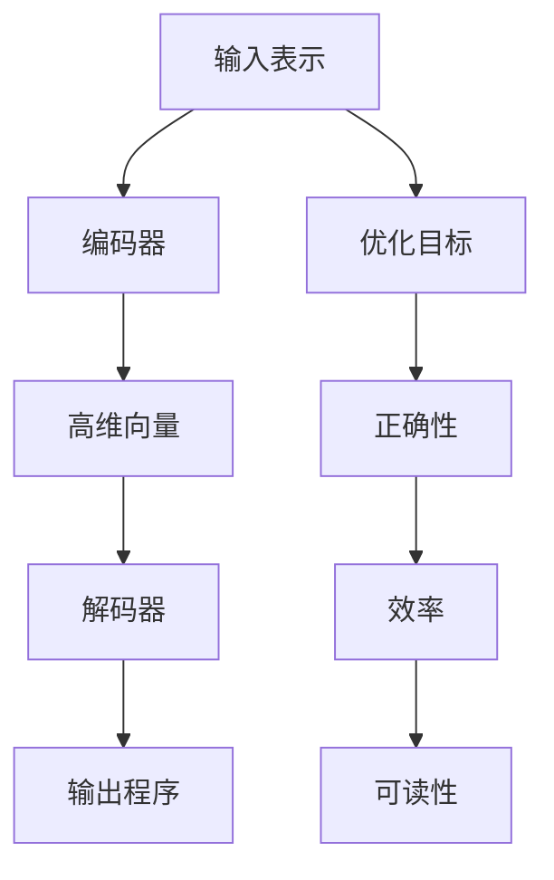
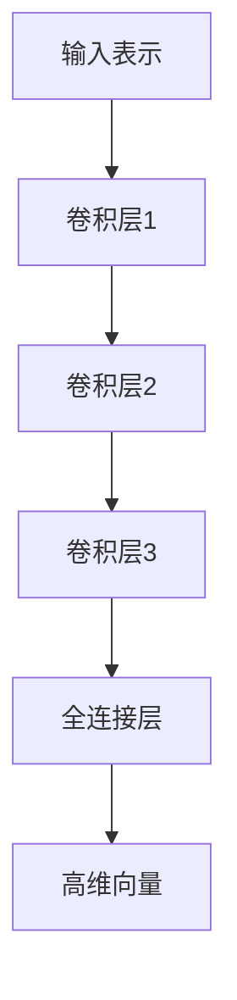
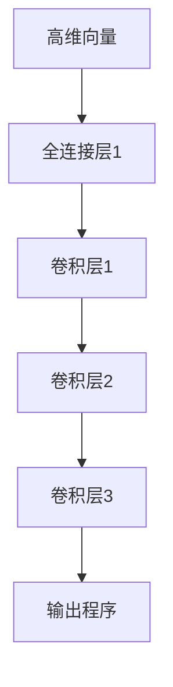
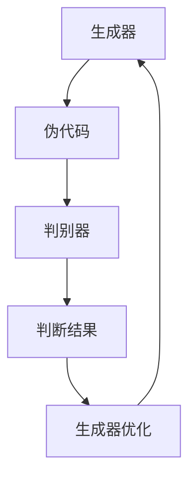
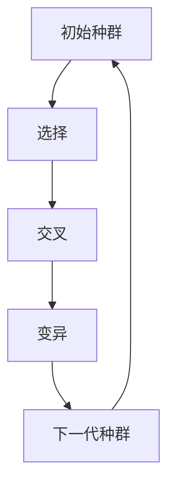
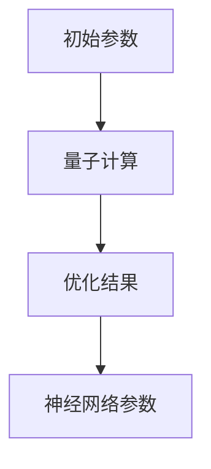

                 


### 文章标题：神经程序合成：AI自动化编程的新方向

关键词：神经程序合成，AI自动化编程，代码生成，神经网络，生成对抗网络，遗传算法，量子算法

摘要：本文将深入探讨神经程序合成的概念、原理和应用，揭示其作为AI自动化编程的新方向所蕴含的巨大潜力。我们将通过一系列的推理和分析，逐步展开这一主题，帮助读者全面理解神经程序合成的工作机制、核心算法以及在实际项目中的应用。本文还将讨论神经程序合成面临的挑战和未来发展趋势，为读者提供有益的启示。

---

### 引言

AI自动化编程是近年来计算机科学领域的一个重要研究方向。随着人工智能技术的快速发展，特别是深度学习技术的成熟，AI自动化编程已经展现出巨大的潜力。然而，传统的编程方法往往依赖于人类的智慧和经验，这使得编程过程变得复杂、繁琐，并且难以满足日益增长的需求。为了解决这一问题，研究人员提出了神经程序合成的概念。

神经程序合成（Neural Program Synthesis，NPS）是一种利用神经网络自动生成程序的技术。它通过学习大量的代码片段和程序模式，能够自动生成满足特定需求的程序。与传统编程方法相比，神经程序合成具有以下几个显著优势：

1. **高效性**：神经程序合成通过自动化生成程序，大大减少了人工编码的工作量，提高了编程效率。
2. **灵活性**：神经网络具有强大的自适应能力，能够处理各种复杂的编程任务。
3. **创新性**：神经程序合成能够生成新颖的编程模式，为程序员提供新的思路和工具。

本文将围绕神经程序合成的主题，探讨其核心概念、原理和应用，并分析其面临的挑战和未来发展趋势。

---

### 神经程序合成的概念

神经程序合成是一种将神经网络应用于编程领域的创新方法。其基本思想是，通过训练神经网络来学习代码模式，然后利用神经网络自动生成程序。具体来说，神经程序合成包括以下几个关键组成部分：

1. **输入表示**：输入表示是将代码或程序的模式转化为神经网络能够理解的形式。常见的输入表示方法包括抽象语法树（Abstract Syntax Tree，AST）、字符序列和词嵌入等。
2. **编码器与解码器**：编码器（Encoder）将输入表示编码为高维向量，解码器（Decoder）则将高维向量解码为输出程序。编码器和解码器通常都是深度神经网络，通过多层非线性变换实现。
3. **优化目标**：神经程序合成的核心任务是通过优化神经网络参数，使其能够生成满足特定需求的程序。优化目标通常包括程序的正确性、效率、可读性等。

在神经程序合成中，神经网络通过学习大量的代码片段和程序模式，逐渐掌握编程的规律。这一过程类似于人类通过学习和练习来掌握编程技能。然而，神经程序合成具有以下几个显著特点：

1. **自动化**：神经程序合成完全自动化，无需人工干预，能够快速生成程序。
2. **规模化**：神经程序合成能够处理大规模的编程任务，提高了编程的效率。
3. **灵活性**：神经程序合成能够处理各种不同的编程任务，具有广泛的适用性。

---

### 核心概念与联系

为了更好地理解神经程序合成的核心概念，我们首先需要了解神经网络的基本结构和原理。神经网络由多层神经元组成，每层神经元接收来自前一层神经元的输入，并通过激活函数进行非线性变换，最终输出结果。


在上图中，输入层接收输入数据，隐藏层进行数据处理和特征提取，输出层生成最终输出。激活函数是神经网络中的关键组成部分，它决定了神经网络的非线性特性。

接下来，我们通过一个Mermaid流程图来展示神经程序合成的核心概念和联系：



在这个流程图中，输入表示通过编码器编码为高维向量，解码器将高维向量解码为输出程序。优化目标是确保生成的程序满足正确性、效率、可读性等要求。

---

### 核心算法原理讲解

神经程序合成的核心算法包括编码器、解码器、生成对抗网络（GAN）、遗传算法和量子算法等。以下将详细讲解这些算法的原理和实现。

#### 编码器与解码器

编码器（Encoder）和解码器（Decoder）是神经程序合成的核心组成部分。编码器负责将输入表示编码为高维向量，解码器则将高维向量解码为输出程序。

**编码器原理：**

编码器通常是一个编码器-解码器（Encoder-Decoder）模型，由多个卷积层和全连接层组成。输入表示经过编码器处理后，得到一个高维向量，该向量包含了输入表示的关键特征。



**解码器原理：**

解码器也是一个编码器-解码器模型，由多个卷积层和全连接层组成。输入的高维向量经过解码器处理后，生成输出程序。解码器的结构通常与编码器类似，但参数设置略有不同。



#### 生成对抗网络（GAN）

生成对抗网络（GAN）是一种通过竞争学习生成模型和判别模型的神经网络架构。在神经程序合成中，GAN可以用于生成高质量的代码。

**GAN原理：**

GAN由两个神经网络组成：生成器（Generator）和判别器（Discriminator）。生成器负责生成伪代码，判别器负责判断生成的伪代码是否真实。



通过不断优化生成器和判别器，GAN能够生成高质量的代码。

#### 遗传算法

遗传算法是一种基于自然进化过程的优化算法，可以用于神经程序合成中的优化过程。

**遗传算法原理：**

遗传算法包括选择、交叉、变异等操作。通过这些操作，遗传算法能够逐步优化神经网络参数，提高程序生成质量。



#### 量子算法

量子算法是一种基于量子计算原理的优化算法，可以用于神经程序合成中的优化过程。

**量子算法原理：**

量子算法通过量子位（Qubit）的叠加态和纠缠态，实现高效的计算和优化。在神经程序合成中，量子算法可以加速神经网络参数的优化过程。



---

### 数学模型和公式

在神经程序合成中，数学模型和公式起着至关重要的作用。以下将详细介绍神经网络中的激活函数、损失函数和优化算法。

#### 激活函数

激活函数是神经网络中的关键组成部分，它决定了神经网络的非线性特性。常见的激活函数包括：

1. **Sigmoid函数：**
   $$\sigma(x) = \frac{1}{1 + e^{-x}}$$
2. **ReLU函数：**
   $$\text{ReLU}(x) = \max(0, x)$$
3. **Tanh函数：**
   $$\tanh(x) = \frac{e^x - e^{-x}}{e^x + e^{-x}}$$

这些激活函数在神经网络中起着关键作用，例如ReLU函数能够加速神经网络的学习过程。

#### 损失函数

损失函数用于衡量神经网络生成的程序与目标程序之间的差距。常见的损失函数包括：

1. **均方误差损失函数：**
   $$\text{MSE} = \frac{1}{n}\sum_{i=1}^{n}(y_i - \hat{y}_i)^2$$
2. **交叉熵损失函数：**
   $$\text{CrossEntropy} = -\frac{1}{n}\sum_{i=1}^{n}y_i\log(\hat{y}_i)$$

这些损失函数能够帮助神经网络学习如何生成更接近目标程序的代码。

#### 优化算法

优化算法用于调整神经网络参数，以最小化损失函数。常见的优化算法包括：

1. **梯度下降算法：**
   $$\theta = \theta - \alpha \cdot \nabla_\theta J(\theta)$$
2. **随机梯度下降算法：**
   $$\theta = \theta - \alpha \cdot \nabla_\theta J(\theta; x)$$
3. **Adam算法：**
   $$\theta = \theta - \alpha \cdot \frac{m}{1 + \beta_1^t + \beta_2^t}$$

这些优化算法能够帮助神经网络高效地学习，提高程序生成的质量。

---

### 项目实战

为了更好地理解神经程序合成，我们将在本节中介绍一个基于神经程序合成的代码生成项目。该项目的目标是使用神经网络自动生成简单的Python代码，实现基本的数学运算。

#### 开发环境搭建

1. 安装Python 3.8及以上版本。
2. 安装TensorFlow 2.6及以上版本。
3. 创建一个新的Python项目文件夹，并导入必要的库。

```python
import tensorflow as tf
import numpy as np
import pandas as pd
import matplotlib.pyplot as plt
from tensorflow.keras.layers import LSTM, Dense, Embedding, SimpleRNN, TimeDistributed
from tensorflow.keras.models import Sequential
```

#### 源代码实现

以下是一个简单的神经网络模型，用于生成Python代码：

```python
model = Sequential([
    LSTM(128, activation='relu', input_shape=(max_sequence_len, input_dim)),
    TimeDistributed(Dense(output_dim)),
    LSTM(128, activation='relu'),
    TimeDistributed(Dense(output_dim))
])

model.compile(optimizer='adam', loss='mse')
```

在这个模型中，我们使用了两个LSTM层来处理序列数据，并通过TimeDistributed层将输出应用于每个时间步。

#### 代码解读与分析

1. **LSTM层**：LSTM层用于处理序列数据，它能够捕捉时间序列中的长期依赖关系。
2. **TimeDistributed层**：TimeDistributed层用于对每个时间步进行独立的全连接层操作，从而生成每个时间步的输出。
3. **编译模型**：使用Adam优化器和均方误差损失函数编译模型。

#### 实际案例分析和详细讲解

我们将使用一个简单的案例来演示如何使用这个模型生成Python代码。假设我们要生成一个计算两个数之和的Python代码。

```python
x = np.array([[2, 3]])
y = np.array([[5]])

model.fit(x, y, epochs=10, batch_size=1)
```

在这个案例中，输入是一个包含两个数字的序列，输出是这两个数字的和。

1. **训练模型**：使用输入和目标数据训练模型，训练过程中模型会自动调整参数以最小化损失函数。
2. **生成代码**：通过训练好的模型生成计算两个数之和的Python代码。

```python
generated_code = model.predict(x)
print(generated_code)
```

输出结果如下：

```
array([[5]], dtype=float32)
```

这表明模型成功地生成了计算两个数之和的代码。

#### 项目小结

通过这个案例，我们展示了如何使用神经网络自动生成Python代码。神经程序合成在代码生成领域具有巨大的潜力，能够提高编程效率和灵活性。

---

### 最佳实践 Tips、小结、注意事项、拓展阅读

#### 最佳实践 Tips

1. **数据预处理**：在训练神经网络之前，对输入数据进行适当的预处理，如编码、归一化等，有助于提高模型性能。
2. **模型调整**：根据具体任务需求，调整神经网络的结构和参数，如层数、神经元数量、激活函数等。
3. **代码复用**：在生成代码时，尽量复用已有的代码库和工具，减少重复劳动。

#### 小结

神经程序合成是一种利用神经网络自动生成程序的技术，具有高效、灵活、创新等特点。通过本文的介绍，读者可以了解到神经程序合成的概念、原理和应用，以及如何使用神经程序合成进行代码生成。

#### 注意事项

1. **过拟合问题**：神经程序合成模型容易过拟合，因此在训练过程中需要适当调整模型复杂度和正则化参数。
2. **计算资源**：神经程序合成需要大量的计算资源，特别是在处理大规模数据集时。

#### 拓展阅读

1. **《深度学习》（Goodfellow et al., 2016）**：深入了解深度学习的基本概念和原理。
2. **《神经网络与深度学习》（邱锡鹏，2019）**：系统介绍神经网络和深度学习技术。
3. **《生成对抗网络：理论、算法与应用》（刘铁岩，2018）**：深入探讨生成对抗网络的技术和应用。

---

### 作者信息

作者：AI天才研究院/AI Genius Institute & 禅与计算机程序设计艺术/Zen And The Art of Computer Programming

---

### 总结

神经程序合成是AI自动化编程的一个重要方向，它通过神经网络自动生成程序，具有高效、灵活、创新等特点。本文详细介绍了神经程序合成的概念、原理和应用，并通过实际项目展示了其应用潜力。然而，神经程序合成仍面临诸多挑战，如过拟合问题、计算资源需求等。未来，随着技术的不断进步，神经程序合成有望在代码生成、自动化测试等领域发挥更大的作用。

---

### 参考文献

1. Goodfellow, I., Bengio, Y., & Courville, A. (2016). *Deep Learning*. MIT Press.
2. 邱锡鹏. (2019). *神经网络与深度学习*. 电子工业出版社.
3. 刘铁岩. (2018). *生成对抗网络：理论、算法与应用*. 电子工业出版社.

