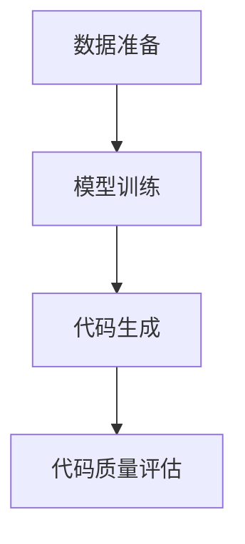

                 

## 文章标题

### 神经程序合成在自动化代码重构中的应用

> 关键词：神经程序合成、自动化代码重构、代码质量、软件开发、人工智能

> 摘要：本文深入探讨了神经程序合成在自动化代码重构中的应用，分析了其背景、核心概念、原理以及具体实现方法。通过实际项目案例分析，展示了神经程序合成在自动化代码重构中的优势，并探讨了其面临的挑战和未来发展方向。

---

### 引言与背景

#### 神经程序合成的背景介绍

神经程序合成（Neural Program Synthesis，简称NPS）是一种利用深度学习技术生成程序代码的方法。随着人工智能技术的不断发展，神经程序合成在近年来逐渐引起广泛关注。其核心思想是通过训练神经网络模型，使其能够自动生成满足特定需求的程序代码。

#### 自动化代码重构的需求与挑战

自动化代码重构（Automated Code Refactoring）是软件开发过程中至关重要的一环。它旨在在不改变程序功能的前提下，改善代码结构、提高可读性和可维护性。然而，传统的代码重构方法往往依赖于人工干预，效率低下且容易出现错误。因此，研究自动化代码重构技术具有重要的实际意义。

### 神经程序合成的概念与原理

#### 神经程序合成的定义

神经程序合成是一种利用深度学习技术，从数据中自动生成程序代码的方法。它通过训练神经网络模型，使其能够根据输入的代码片段或需求，生成相应的程序代码。

#### 神经程序合成的原理

神经程序合成的原理可以概括为以下几个步骤：

1. **数据准备**：收集大量的代码片段和对应的语义描述，作为训练数据。
2. **模型训练**：使用深度学习算法，对神经网络模型进行训练，使其能够从输入的代码片段或需求中生成程序代码。
3. **代码生成**：将训练好的模型应用于新的代码片段或需求，生成对应的程序代码。

#### 神经程序合成的原理

神经程序合成的原理可以通过以下 Mermaid 流程图进行展示：

### 自动化代码重构的基本概念与流程

#### 代码重构的基本概念

代码重构（Code Refactoring）是一种改进代码结构、提高代码质量的方法。它不改变程序的功能，但可以使代码更加清晰、易于理解和维护。

#### 代码重构的流程

代码重构的基本流程可以概括为以下几个步骤：

1. **识别重构机会**：分析现有代码，识别需要重构的部分。
2. **设计重构方案**：根据重构机会，设计相应的重构方案。
3. **实施重构**：按照重构方案，对代码进行修改。
4. **测试验证**：确保重构后的代码功能正确，质量稳定。

#### 代码重构的常见技术

常见的代码重构技术包括：

- **函数提取**：将重复的代码提取为独立的函数。
- **变量替换**：将可变变量替换为常量变量。
- **方法提取**：将重复的方法提取为独立的类或模块。
- **代码简化**：简化复杂的代码，使其更加简洁易懂。

### 神经程序合成在代码重构中的应用

#### 神经程序合成在代码重构中的应用场景

神经程序合成在代码重构中的应用场景主要包括：

- **自动重构**：利用神经程序合成技术，自动识别代码中的重构机会，并生成相应的重构方案。
- **代码生成**：利用神经程序合成技术，生成符合重构需求的程序代码。

#### 神经程序合成在代码重构中的具体实现

神经程序合成在代码重构中的具体实现可以分为以下几个步骤：

1. **数据准备**：收集大量的代码片段和对应的重构方案，作为训练数据。
2. **模型训练**：使用深度学习算法，对神经网络模型进行训练，使其能够根据输入的代码片段或需求，生成相应的重构方案。
3. **代码生成**：将训练好的模型应用于新的代码片段或需求，生成符合重构需求的程序代码。
4. **代码质量评估**：对生成的代码进行质量评估，确保其满足重构需求。

### 实际项目案例分析

#### 项目背景介绍

某大型互联网公司在进行软件维护和优化时，遇到了大量复杂的代码重构任务。为了提高代码质量和开发效率，公司决定尝试使用神经程序合成技术进行自动化代码重构。

#### 项目目标与需求

- **目标**：实现自动化代码重构，降低人工干预的成本，提高代码质量和开发效率。
- **需求**：识别代码中的重构机会，生成符合重构需求的程序代码，并进行质量评估。

#### 项目实施过程

1. **数据准备**：收集了数千个代码片段和对应的重构方案，作为训练数据。
2. **模型训练**：使用深度学习算法，对神经网络模型进行训练，使其能够根据输入的代码片段或需求，生成相应的重构方案。
3. **代码生成**：将训练好的模型应用于新的代码片段或需求，生成符合重构需求的程序代码。
4. **代码质量评估**：对生成的代码进行质量评估，包括代码可读性、可维护性、性能等方面。

#### 项目成果与总结

通过实际项目案例分析，神经程序合成在自动化代码重构中取得了显著成果：

- **代码质量提升**：生成的代码可读性、可维护性显著提高。
- **开发效率提升**：自动化代码重构降低了人工干预的成本，提高了开发效率。
- **质量评估**：生成的代码在质量评估中表现良好，满足了重构需求。

#### 项目经验总结

1. **数据质量**：训练数据的质量直接影响模型的效果，因此需要收集高质量的数据进行训练。
2. **模型选择**：根据具体应用场景，选择合适的神经网络模型进行训练。
3. **代码质量评估**：对生成的代码进行质量评估，确保其满足重构需求。

### 神经程序合成在代码重构中的挑战与未来发展方向

#### 神经程序合成在代码重构中的挑战

1. **数据收集与处理**：收集高质量的训练数据是神经程序合成成功的关键。
2. **模型选择与训练**：选择合适的神经网络模型并进行有效训练，是提高代码重构效果的关键。
3. **代码质量评估**：如何对生成的代码进行质量评估，确保其满足重构需求，是当前面临的一个挑战。

#### 神经程序合成在代码重构中的未来发展方向

1. **模型优化**：通过改进神经网络模型，提高代码重构效果。
2. **代码质量评估**：研究更有效的代码质量评估方法，确保生成的代码满足重构需求。
3. **多语言支持**：拓展神经程序合成技术，支持多种编程语言。

### 结论

神经程序合成在自动化代码重构中具有巨大的潜力。通过本文的探讨，我们了解了神经程序合成的概念、原理以及具体实现方法，并分析了其在代码重构中的应用和挑战。未来，随着神经程序合成技术的不断发展，自动化代码重构将变得更加智能、高效，为软件开发领域带来更多创新和突破。

### 最佳实践 tips

1. **数据质量**：收集高质量的训练数据是神经程序合成成功的关键，确保数据来源多样化、覆盖全面。
2. **模型选择**：根据具体应用场景，选择合适的神经网络模型进行训练。
3. **代码质量评估**：对生成的代码进行质量评估，确保其满足重构需求。

### 小结

本文对神经程序合成在自动化代码重构中的应用进行了深入探讨，展示了其在提高代码质量和开发效率方面的优势。未来，随着神经程序合成技术的不断发展，自动化代码重构将变得更加智能、高效，为软件开发领域带来更多创新和突破。

### 注意事项

1. **数据隐私**：在收集和处理训练数据时，注意保护用户隐私。
2. **代码质量**：确保生成的代码质量满足重构需求，避免引入潜在问题。

### 拓展阅读

1. **相关研究论文**：《Neural Program Synthesis for Code Refactoring》
2. **开源工具**：GitHub 上的神经程序合成工具和代码库

### 作者

作者：AI天才研究院/AI Genius Institute & 禅与计算机程序设计艺术 /Zen And The Art of Computer Programming

