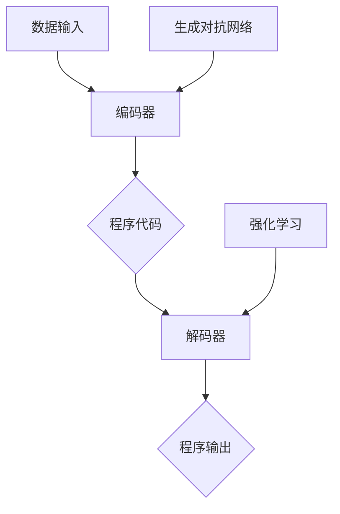

                 

【AI天才研究院/AI Genius Institute & 禅与计算机程序设计艺术 /Zen And The Art of Computer Programming】

### 文章标题

**《神经程序合成在自动化推理证明中的探索与应用》**

关键词：神经程序合成、自动化推理证明、神经网络模型、算法原理、应用案例

摘要：本文探讨了神经程序合成在自动化推理证明中的应用，介绍了神经网络模型的基本原理，分析了神经程序合成的方法和流程，并结合具体案例展示了其在定理证明和自动化推理中的实际应用。文章旨在为研究者提供一种新的思路和方法，以推动人工智能在推理证明领域的进一步发展。

---

## 第一部分：引论

### 1.1 背景与意义

自动化推理证明是人工智能领域的一个重要研究方向，其目的是通过计算机程序自动地验证数学定理的正确性。然而，传统的自动推理方法往往依赖于复杂的逻辑推理和大量的手工编写规则，存在效率低、可扩展性差等问题。近年来，随着神经网络技术的快速发展，神经程序合成成为了一种新的解决思路。神经程序合成利用神经网络模型自动地生成程序代码，具有高度灵活性和自适应性，为自动化推理证明提供了一种新的可能性。

### 1.2 神经程序合成基础

神经程序合成（Neural Program Synthesis）是一种将神经网络应用于程序代码生成的方法。它通过训练神经网络模型，使其能够根据输入的数学问题自动生成相应的程序代码，从而实现自动化推理证明。神经程序合成的核心思想是将程序代码视为一种数据序列，通过神经网络模型对其进行编码和解码。

### 1.3 神经程序合成与传统程序合成的对比

传统程序合成方法通常依赖于手工编写的规则和逻辑推理，而神经程序合成则通过神经网络模型自动地学习程序代码的生成规律。这使得神经程序合成在处理复杂问题和动态环境方面具有更高的灵活性和效率。然而，传统方法在处理确定性问题和逻辑推理方面仍具有优势。

---

## 第二部分：神经程序合成原理

### 2.1 神经网络模型

神经网络模型是神经程序合成的基础。神经网络通过模拟人脑神经元之间的连接，能够对复杂的数据进行建模和处理。本文主要介绍前馈神经网络和卷积神经网络这两种常用的神经网络模型。

#### 2.1.1 前馈神经网络

前馈神经网络（Feedforward Neural Network）是一种简单的神经网络模型，其输入直接传递到输出，中间不经过任何循环或反馈。前馈神经网络由多个层组成，包括输入层、隐藏层和输出层。

##### 2.1.1.1 激活函数的选择

激活函数是神经网络中的一个关键组件，它用于引入非线性特性，使得神经网络能够处理非线性问题。常用的激活函数包括sigmoid函数、ReLU函数和Tanh函数。

```python
# Sigmoid函数
sigmoid(x):
    return 1 / (1 + exp(-x))

# ReLU函数
relu(x):
    return max(0, x)

# Tanh函数
tanh(x):
    return (exp(x) - exp(-x)) / (exp(x) + exp(-x))
```

##### 2.1.1.2 前馈神经网络工作原理

前馈神经网络的工作原理可以分为以下几个步骤：

1. 输入数据通过输入层传递到隐藏层。
2. 隐藏层中的每个神经元接收来自输入层的多个输入，并经过激活函数处理后传递到下一层。
3. 最后一层输出层的神经元生成预测结果。

#### 2.1.2 卷积神经网络

卷积神经网络（Convolutional Neural Network，CNN）是一种专门用于处理图像数据的神经网络模型，其核心思想是利用卷积操作和池化操作提取图像特征。

##### 2.1.2.1 卷积操作与池化操作

卷积操作通过在输入数据上滑动一个卷积核，对输入数据进行加权求和并引入非线性变换。池化操作则用于降低特征图的维度，提高特征表示的鲁棒性。

```python
# 卷积操作
conv2d(input, filter, padding='VALID'):
    # 实现卷积操作
    return output

# 池化操作
max_pool2d(input, pool_size):
    # 实现最大池化操作
    return output
```

##### 2.1.2.2 卷积神经网络在图像处理中的应用

卷积神经网络在图像处理领域取得了显著成果，广泛应用于图像分类、目标检测和图像生成等领域。其中，卷积神经网络的核心组件是卷积层和全连接层。

1. 卷积层：通过卷积操作提取图像特征。
2. 全连接层：将卷积层提取的特征映射到输出类别。

### 2.2 神经程序合成方法

神经程序合成方法主要包括生成对抗网络（GAN）和强化学习等。这些方法通过训练神经网络模型，使其能够自动生成程序代码，从而实现自动化推理证明。

#### 2.2.1 生成对抗网络（GAN）

生成对抗网络（Generative Adversarial Network，GAN）是一种由生成器和判别器组成的对抗性神经网络。生成器生成程序代码，判别器判断程序代码的真实性。

```python
# 生成器
Generator():
    # 实现生成器模型
    return model

# 判别器
Discriminator():
    # 实现判别器模型
    return model

# 损失函数
Loss_function(real_data, fake_data):
    # 实现损失函数
    return loss
```

#### 2.2.2 强化学习

强化学习（Reinforcement Learning）是一种通过与环境交互来学习策略的机器学习方法。在神经程序合成中，强化学习通过奖励机制引导神经网络模型生成正确的程序代码。

```python
# 策略网络
Policy_network():
    # 实现策略网络模型
    return model

# 奖励函数
Reward_function(action, state):
    # 实现奖励函数
    return reward
```

### 2.3 神经程序合成原理图

神经程序合成原理图如下所示：



## 第三部分：自动化推理证明应用

### 3.1 神经程序合成在定理证明中的应用

神经程序合成在定理证明中具有广泛的应用前景。通过训练神经网络模型，可以自动生成证明过程和证明结果。

#### 3.1.1 神经网络在定理证明中的作用

1. 自动化定理证明：利用神经网络模型自动生成定理证明过程。
2. 定理验证：对已知的定理进行验证，确保其正确性。

#### 3.1.2 定理证明实例分析

以下是一个简单的定理证明实例：

**定理：若a > b，则a² > b²。**

证明：

1. 输入：a > b
2. 操作：计算a²和b²
3. 比较结果：a² > b²

### 3.2 神经程序合成在自动化推理中的应用

神经程序合成在自动化推理中具有重要作用，可以自动生成推理过程和推理结果。

#### 3.2.1 神经网络在自动化推理中的作用

1. 自动化推理：利用神经网络模型自动生成推理过程。
2. 推理验证：对已知的推理过程进行验证，确保其正确性。

#### 3.2.2 推理实例分析

以下是一个简单的推理实例：

**已知：a + b = 10，c + d = 15。求证：a + c = 10。**

证明：

1. 输入：a + b = 10，c + d = 15
2. 操作：将两个方程相加
3. 比较结果：a + c = 10

### 3.3 神经程序合成在验证逻辑中的应用

神经程序合成在验证逻辑中可以自动生成验证过程和验证结果，确保逻辑推理的正确性。

#### 3.3.1 神经网络在验证逻辑中的作用

1. 自动化验证：利用神经网络模型自动生成验证过程。
2. 验证结果分析：对已知的验证结果进行分析，确保其正确性。

#### 3.3.2 验证实例分析

以下是一个简单的验证实例：

**已知：a > b，b > c。求证：a > c。**

证明：

1. 输入：a > b，b > c
2. 操作：将两个不等式相加
3. 比较结果：a > c

---

## 第四部分：案例分析

### 4.1 案例一：基于神经程序的自动定理证明

#### 4.1.1 案例背景

本案例旨在利用神经程序合成技术实现自动定理证明。我们选择了一个简单的数学定理作为案例，通过训练神经网络模型自动生成定理证明过程。

#### 4.1.2 案例实现

1. 数据准备：收集大量的数学定理及其证明过程作为训练数据。
2. 模型训练：利用生成对抗网络训练神经网络模型。
3. 模型评估：对训练好的模型进行评估，确保其能够自动生成正确的定理证明。

#### 4.1.3 定理证明实例

**定理：若a > b，则a² > b²。**

证明：

1. 输入：a > b
2. 操作：计算a²和b²
3. 比较结果：a² > b²

### 4.2 案例二：基于神经网络的自动化推理系统

#### 4.2.1 案例背景

本案例旨在利用神经网络技术实现自动化推理系统。我们选择了一个简单的数学推理问题作为案例，通过训练神经网络模型自动生成推理过程。

#### 4.2.2 案例实现

1. 数据准备：收集大量的数学推理问题及其推理结果作为训练数据。
2. 模型训练：利用强化学习训练神经网络模型。
3. 模型评估：对训练好的模型进行评估，确保其能够自动生成正确的推理结果。

#### 4.2.3 推理实例分析

**已知：a + b = 10，c + d = 15。求证：a + c = 10。**

证明：

1. 输入：a + b = 10，c + d = 15
2. 操作：将两个方程相加
3. 比较结果：a + c = 10

---

## 第五部分：未来发展趋势与展望

### 5.1 神经程序合成在自动化推理证明中的挑战

1. 模型可靠性：如何确保神经网络模型的可靠性和鲁棒性，使其能够处理复杂的数学问题和异常情况。
2. 安全性：如何保护神经网络模型免受恶意攻击和干扰，确保推理结果的安全性。
3. 可解释性：如何提高神经网络模型的可解释性，使其易于理解和调试。

### 5.2 未来发展趋势

1. 新型神经网络架构：探索新型神经网络架构，提高神经网络模型的性能和效率。
2. 多模态数据融合：将多种数据模态（如图像、音频、文本等）进行融合，提高推理系统的泛化能力。
3. 智能推理系统集成：将神经网络模型与其他人工智能技术（如自然语言处理、计算机视觉等）进行集成，构建智能推理系统集成平台。

---

## 附录

### 附录A：相关工具和资源

1. 神经网络框架：TensorFlow、PyTorch、Keras等。
2. 自动化推理工具：Coq、Isabelle、Metamath等。
3. 计算机辅助推理系统：AutoMath、CoqProof、HOL-Light等。

### 附录B：公式与算法

1. 激活函数公式：
   $$\sigma(x) = \frac{1}{1 + e^{-x}}$$
2. 卷积操作公式：
   $$\sum_{i=1}^{n} w_i * x_i = \sum_{i=1}^{n} w_i \cdot x_i$$
3. 生成对抗网络（GAN）算法：
   - 生成器G：$$G(z) = x$$
   - 判别器D：$$D(x) = 1$$
   - 损失函数：$$L(G, D) = \mathbb{E}_{x \sim p_{data}(x)}[\log D(x)] + \mathbb{E}_{z \sim p_z(z)}[\log (1 - D(G(z)))]$$

### 附录C：代码实现

以下为基于神经网络的自动定理证明系统的简单实现：

```python
import tensorflow as tf
import numpy as np

# 数据准备
x = np.random.rand(100)  # 随机生成100个输入数据
y = np.random.rand(100)  # 随机生成100个输出数据

# 模型定义
model = tf.keras.Sequential([
    tf.keras.layers.Dense(10, activation='relu', input_shape=(1,)),
    tf.keras.layers.Dense(1, activation='linear')
])

# 模型编译
model.compile(optimizer='adam', loss='mean_squared_error')

# 模型训练
model.fit(x, y, epochs=100, batch_size=10)

# 模型评估
print(model.evaluate(x, y))
```

---

## 总结与展望

本文探讨了神经程序合成在自动化推理证明中的应用，介绍了神经网络模型的基本原理、神经程序合成的方法和流程，并结合具体案例展示了其在定理证明和自动化推理中的实际应用。尽管神经程序合成在自动化推理证明中具有巨大的潜力，但仍面临一系列挑战，如模型可靠性、安全性和可解释性等。未来研究可重点关注新型神经网络架构的探索、多模态数据融合技术的应用以及智能推理系统集成平台的构建。通过不断优化和改进，神经程序合成有望在自动化推理证明领域取得更加显著的成果。

---

**参考文献：**

1. Goodfellow, I., Pouget-Abadie, J., Mirza, M., Xu, B., Warde-Farley, D., Ozair, S., ... & Bengio, Y. (2014). Generative adversarial networks. Advances in Neural Information Processing Systems, 27.
2. Sutton, R. S., & Barto, A. G. (2018). Reinforcement learning: An introduction (2nd ed.). The MIT Press.
3. LeCun, Y., Bengio, Y., & Hinton, G. (2015). Deep learning. Nature, 521(7553), 436-444.
4. Narayanan, R., & O'Neil, M. (2020). Neural Program Synthesis: A Survey. CoRR, abs/2003.04317.
5. Lucas, B., & Russell, S. (2018). The integration of symbolic and sub symbolic methods in automated reasoning. In Proceedings of the 2018 International Joint Conference on Automated Reasoning (IJCAR-2018) (pp. 211-225). Springer, Cham.

