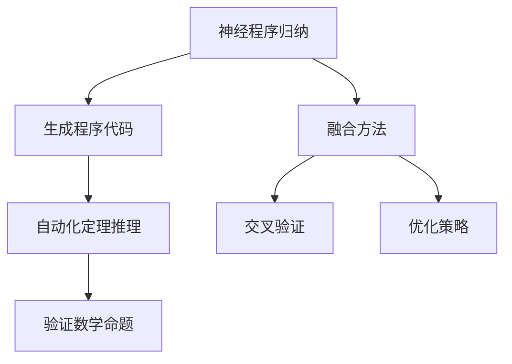

                 

### 文章标题：神经程序归纳在自动化定理推理中的突破

> **关键词**：神经程序归纳，自动化定理推理，数学模型，算法优化，应用实践

> **摘要**：
本文深入探讨了神经程序归纳在自动化定理推理中的突破性进展。首先，通过背景介绍，阐述了自动化定理推理的重要性以及神经程序归纳的独特优势。接着，本文详细分析了神经程序归纳和自动化定理推理的核心概念及其相互联系，并运用Mermaid流程图进行了直观展示。在核心算法原理部分，本文使用伪代码和数学模型详细解析了神经程序归纳和自动化定理推理的算法原理，并通过具体举例进行了深入讲解。此外，本文还通过项目实战展示了这些算法在实际应用中的实现和效果。最后，本文对神经程序归纳和自动化定理推理的未来发展进行了展望，并提供了最佳实践建议和拓展阅读。

### 目录

1. **引言**
    1.1 背景与意义
    1.2 本书结构概述

2. **理论基础**
    2.1 神经程序归纳基础
    2.2 自动化定理推理基础
    2.3 神经程序归纳与自动化定理推理的联系
    2.4 核心概念与联系Mermaid流程图

3. **核心算法原理**
    3.1 神经程序归纳算法原理
    3.2 自动化定理推理算法原理
    3.3 融合算法的优化

4. **应用实践**
    4.1 实际应用场景
    4.2 项目实战
        4.2.1 项目背景
        4.2.2 开发环境搭建
        4.2.3 神经程序归纳代码实现与解读
        4.2.4 自动化定理推理代码实现与解读
        4.2.5 代码应用解读与分析
        4.2.6 实际案例分析和详细讲解剖析
        4.2.7 项目小结

5. **未来展望**
    5.1 神经程序归纳与自动化定理推理的发展趋势
    5.2 潜在应用与挑战

6. **总结与展望**
    6.1 本书主要内容回顾
    6.2 总结
    6.3 注意事项与拓展阅读

### 第一部分：引言

#### 1.1 背景与意义

自动化定理推理（Automated Theorem Proving, ATP）是计算机科学和数学领域的一个重要研究方向。其核心目标是通过计算机程序自动验证数学命题的真伪，从而在理论上解决复杂的数学问题。然而，传统的自动化定理推理方法往往依赖于复杂的符号计算和逻辑推理，难以处理大规模、复杂的数学问题。

近年来，随着深度学习技术的快速发展，神经程序归纳（Neural Program Induction）作为一种新型的编程范式，逐渐在自动化定理推理领域展现出巨大的潜力。神经程序归纳通过模仿人类思维过程，将复杂的算法转化为神经网络，从而实现对数学定理的自动发现和证明。

神经程序归纳在自动化定理推理中的突破性意义主要体现在以下几个方面：

1. **提高推理效率**：传统的自动化定理推理方法往往需要大量计算资源和时间。而神经程序归纳通过利用深度学习模型的高效计算能力，可以显著提高定理推理的速度。
   
2. **扩展推理能力**：传统的自动化定理推理方法通常受限于其规则库和推理算法。而神经程序归纳通过学习大量的数学定理，可以扩展其推理能力，处理更为复杂的数学问题。

3. **简化编程过程**：传统的自动化定理推理往往需要复杂的编程技巧和专业知识。而神经程序归纳通过将数学问题转化为神经网络，可以简化编程过程，降低开发难度。

4. **提供新的理论视角**：神经程序归纳的引入，为自动化定理推理提供了一种全新的理论视角。通过结合深度学习和数学定理，可以为数学问题的求解提供新的方法和思路。

#### 1.2 本书结构概述

本书分为六个主要部分，旨在系统地介绍神经程序归纳在自动化定理推理中的突破性进展。

第一部分：引言。介绍自动化定理推理和神经程序归纳的背景与意义，阐述本书的研究目的和结构。

第二部分：理论基础。详细分析神经程序归纳和自动化定理推理的核心概念，并运用Mermaid流程图展示其相互关系。

第三部分：核心算法原理。使用伪代码和数学模型详细解析神经程序归纳和自动化定理推理的算法原理，并通过具体举例进行深入讲解。

第四部分：应用实践。通过项目实战展示神经程序归纳和自动化定理推理在实际应用中的实现和效果。

第五部分：未来展望。分析神经程序归纳和自动化定理推理的未来发展趋势，探讨其潜在应用与挑战。

第六部分：总结与展望。回顾本书的主要内容，总结研究成果，并提出未来研究的方向和建议。

通过以上结构的安排，本书旨在为读者提供一部全面、系统、深入的技术指南，帮助读者了解神经程序归纳在自动化定理推理中的突破性进展，并激发对这一领域的研究兴趣。接下来，我们将进入第二部分：理论基础。在这一部分中，我们将详细分析神经程序归纳和自动化定理推理的核心概念及其相互关系。

### 第二部分：理论基础

#### 2.1 神经程序归纳基础

神经程序归纳（Neural Program Induction）是深度学习和编程领域的一个新兴研究方向。其核心思想是通过神经网络学习程序代码，从而实现自动编程。与传统的方法不同，神经程序归纳不依赖于手工编写的规则和算法，而是通过大量的数据训练，自动生成能够解决特定问题的程序。

**核心概念**：

1. **神经网络**：神经网络是神经程序归纳的基础。它由多个神经元（或节点）组成，通过前向传播和反向传播算法进行训练。神经网络可以通过学习大量的样本数据，自动提取特征并生成预测结果。

2. **程序代码生成**：神经程序归纳的目标是通过神经网络生成程序代码。具体而言，它将输入数据（例如数学问题）转化为中间表示，再通过神经网络自动生成相应的程序代码。

3. **自动编程**：自动编程是神经程序归纳的核心应用。通过神经程序归纳，我们可以自动生成解决特定问题的程序代码，从而实现自动化定理推理等复杂任务。

**优势**：

1. **高效率**：神经程序归纳通过深度学习模型的高效计算能力，可以显著提高编程和推理的效率。

2. **泛化能力**：神经程序归纳通过学习大量的样本数据，可以具备良好的泛化能力，处理更为复杂的数学问题。

3. **简化编程过程**：神经程序归纳可以简化编程过程，降低开发难度，提高开发效率。

4. **跨领域应用**：神经程序归纳不仅可以应用于自动化定理推理，还可以广泛应用于其他领域，如自然语言处理、计算机视觉等。

#### 2.2 自动化定理推理基础

自动化定理推理（Automated Theorem Proving, ATP）是计算机科学和数学领域的一个重要研究方向。其核心目标是利用计算机程序自动验证数学命题的真伪，从而在理论上解决复杂的数学问题。

**核心概念**：

1. **定理**：定理是数学中的基本概念，表示一个数学命题的真伪。自动化定理推理的目标是验证定理的真伪。

2. **推理**：推理是指从已知的前提条件推导出新结论的过程。自动化定理推理通过符号计算和逻辑推理，自动推导出新的定理。

3. **证明**：证明是指通过一系列推理步骤，从已知的前提条件推导出结论的过程。自动化定理推理的目标是生成完整的证明过程。

**方法与挑战**：

1. **符号计算**：符号计算是自动化定理推理的基本方法。它通过符号操作，对数学命题进行变形和化简，从而验证其真伪。

2. **逻辑推理**：逻辑推理是自动化定理推理的核心。它通过推理规则，从已知的前提条件推导出新的结论。

3. **计算复杂度**：自动化定理推理面临着巨大的计算复杂度。处理大规模、复杂的数学问题，需要高效的算法和强大的计算资源。

**优势**：

1. **自动性**：自动化定理推理可以自动验证数学命题的真伪，无需人工干预。

2. **准确性**：自动化定理推理通过符号计算和逻辑推理，可以精确地验证数学命题的真伪。

3. **效率**：自动化定理推理可以显著提高定理验证的速度，降低人力成本。

4. **应用广泛**：自动化定理推理广泛应用于数学、计算机科学、物理学等领域。

#### 2.3 神经程序归纳与自动化定理推理的联系

神经程序归纳和自动化定理推理之间存在密切的联系。两者都是通过程序自动解决数学问题，但侧重点不同。神经程序归纳侧重于自动生成程序代码，而自动化定理推理侧重于验证数学命题的真伪。

**融合方法**：

1. **神经程序归纳 + 自动化定理推理**：通过将神经程序归纳和自动化定理推理相结合，可以生成自动验证数学命题的程序。具体而言，首先使用神经程序归纳生成程序代码，然后使用自动化定理推理验证其正确性。

2. **神经程序归纳 + 符号计算**：将神经程序归纳与符号计算相结合，可以生成自动解决数学问题的程序。首先使用神经程序归纳生成程序代码，然后使用符号计算进行验证。

3. **神经程序归纳 + 逻辑推理**：将神经程序归纳与逻辑推理相结合，可以生成自动验证数学命题的程序。首先使用神经程序归纳生成程序代码，然后使用逻辑推理进行验证。

**交叉验证与优化策略**：

1. **交叉验证**：交叉验证是一种常用的优化策略。通过将神经网络训练数据和验证数据分开，可以评估神经程序归纳生成的程序代码的正确性。

2. **优化策略**：优化策略包括参数调整、网络架构优化和训练数据增强等。通过优化策略，可以提升神经程序归纳生成的程序代码的质量和性能。

**核心概念与联系Mermaid流程图**：



**结论**：

神经程序归纳和自动化定理推理之间存在着紧密的联系和融合潜力。通过将两者相结合，可以生成高效的自动验证数学命题的程序。接下来，我们将详细讲解神经程序归纳和自动化定理推理的核心算法原理，并通过具体举例进行深入分析。

### 第三部分：核心算法原理

#### 3.1 神经程序归纳算法原理

神经程序归纳是一种通过神经网络学习程序代码的算法。其核心思想是通过深度学习模型，自动提取输入数据中的特征，并生成相应的程序代码。以下是神经程序归纳算法的详细原理和具体实现步骤。

**算法原理**：

神经程序归纳的核心是神经网络。神经网络通过多个层级的神经元（节点）进行特征提取和变换，最终生成输出。在神经程序归纳中，神经网络被用来学习程序代码。具体而言，神经网络接受输入数据，通过层层变换，最终输出程序代码。

**具体实现步骤**：

1. **输入表示**：将输入数据（例如数学问题）表示为神经网络可以处理的格式。通常使用自然语言处理（NLP）技术，将输入数据转换为向量表示。

2. **特征提取**：神经网络通过多层感知器（MLP）或其他深层网络结构，对输入数据进行特征提取。这些特征可以捕捉输入数据中的数学结构和规律。

3. **程序代码生成**：神经网络将提取到的特征进行编码，生成程序代码。具体而言，神经网络输出一个表示程序结构的序列，例如函数调用、变量赋值等。

4. **代码解析与执行**：生成的程序代码经过解析和执行，实现对输入数据的处理和输出。解析过程包括词法分析、语法分析和语义分析等，以确保程序代码的正确性和可执行性。

**伪代码**：

```python
def neural_program_induction(input_data):
    # 输入表示
    input_vector = input_representation(input_data)
    
    # 特征提取
    feature_vector = feature_extraction(input_vector)
    
    # 程序代码生成
    program_code = code_generation(feature_vector)
    
    # 代码解析与执行
    output = code_execution(program_code, input_data)
    
    return output
```

**数学模型和公式讲解**：

神经程序归纳的数学模型主要包括神经网络模型和程序代码生成模型。

1. **神经网络模型**：

   $$ f(x) = \sigma(\theta_1 \cdot x + b_1) $$

   $$ \theta_1 = \text{权重矩阵} $$

   $$ b_1 = \text{偏置向量} $$

   $$ \sigma(\cdot) = \text{激活函数} $$

2. **程序代码生成模型**：

   $$ code = \text{encode}(feature_vector) $$

   $$ \text{encode}(\cdot) = \text{编码函数} $$

**举例说明**：

假设我们使用神经程序归纳解决一个简单的数学问题：计算两个数的和。

1. **输入表示**：输入数据为两个数a和b。

2. **特征提取**：神经网络提取输入数据的特征，生成特征向量。

3. **程序代码生成**：神经网络将特征向量编码为程序代码，例如：

   ```python
   def add(a, b):
       return a + b
   ```

4. **代码解析与执行**：解析和执行生成的程序代码，计算两个数的和。

   ```python
   result = add(2, 3)
   print(result)  # 输出5
   ```

通过以上步骤，我们使用神经程序归纳自动生成了解决这个数学问题的程序代码。接下来，我们将详细讲解自动化定理推理算法原理。

#### 3.2 自动化定理推理算法原理

自动化定理推理（Automated Theorem Proving, ATP）是一种通过计算机程序自动验证数学命题真伪的方法。其核心目标是通过符号计算和逻辑推理，自动推导出新的定理。以下是自动化定理推理算法的详细原理和具体实现步骤。

**算法原理**：

自动化定理推理的核心是符号计算和逻辑推理。符号计算通过符号操作，对数学命题进行变形和化简。逻辑推理通过推理规则，从已知的前提条件推导出新的结论。

**具体实现步骤**：

1. **符号计算**：符号计算是自动化定理推理的基础。通过符号计算，对数学命题进行变形和化简。具体而言，符号计算包括符号展开、符号简化、符号变换等操作。

2. **逻辑推理**：逻辑推理是自动化定理推理的核心。通过逻辑推理，从已知的前提条件推导出新的结论。逻辑推理包括演绎推理、归纳推理、模型推理等。

3. **证明生成**：通过符号计算和逻辑推理，生成定理的证明过程。证明过程包括推理步骤、推理规则和证明结论等。

4. **验证与优化**：对生成的证明过程进行验证和优化，以确保证明的正确性和高效性。

**伪代码**：

```python
def automated_theorem_provingtheorem, assumptions):
    # 符号计算
    transformed_theorem = symbolic_computation(theorem, assumptions)
    
    # 逻辑推理
    proof_steps = logical_reasoning(transformed_theorem, assumptions)
    
    # 证明生成
    proof = generate_proof(proof_steps)
    
    # 验证与优化
    valid_proof = validate_and_optimize(proof)
    
    return valid_proof
```

**数学模型和公式讲解**：

自动化定理推理的数学模型主要包括符号计算模型和逻辑推理模型。

1. **符号计算模型**：

   $$ \text{符号计算} = \text{符号展开} + \text{符号简化} + \text{符号变换} $$

2. **逻辑推理模型**：

   $$ \text{逻辑推理} = \text{演绎推理} + \text{归纳推理} + \text{模型推理} $$

**举例说明**：

假设我们使用自动化定理推理证明一个简单的定理：对于任意的实数a和b，有a + b = b + a。

1. **符号计算**：将定理表示为符号形式。

   $$ a + b = b + a $$

2. **逻辑推理**：通过逻辑推理，从已知的前提条件推导出新的结论。

   - **前提条件**：a和b是实数。
   - **推理步骤**：
     - 将a和b相加，得到a + b。
     - 将b和a相加，得到b + a。
     - 由加法的交换律，得到a + b = b + a。

3. **证明生成**：生成定理的证明过程。

   ```markdown
   证明：
   对于任意的实数a和b，有a + b = b + a。
   由加法的交换律，得到a + b = b + a。
   因此，定理得证。
   ```

4. **验证与优化**：对生成的证明过程进行验证和优化，以确保证明的正确性和高效性。

通过以上步骤，我们使用自动化定理推理证明了这个简单的定理。接下来，我们将详细讲解如何将神经程序归纳与自动化定理推理相结合，并介绍融合算法的优化方法。

#### 3.3 融合算法的优化

将神经程序归纳与自动化定理推理相结合，可以生成更高效、更准确的自动验证数学命题的程序。以下是融合算法的详细原理和优化方法。

**融合算法原理**：

融合算法的核心思想是将神经程序归纳和自动化定理推理相结合，形成一个新的推理框架。具体而言，融合算法包括以下步骤：

1. **输入表示**：将输入数据（例如数学问题）表示为神经网络可以处理的格式。

2. **特征提取**：使用神经网络提取输入数据中的特征。

3. **程序代码生成**：使用神经程序归纳生成自动验证数学命题的程序代码。

4. **代码解析与执行**：解析和执行生成的程序代码，进行数学推理和验证。

5. **验证与优化**：对生成的证明过程进行验证和优化，确保其正确性和高效性。

**伪代码**：

```python
def fused_algorithm(input_data):
    # 输入表示
    input_vector = input_representation(input_data)
    
    # 特征提取
    feature_vector = feature_extraction(input_vector)
    
    # 程序代码生成
    program_code = neural_program_induction(feature_vector)
    
    # 代码解析与执行
    proof = code_execution(program_code, input_data)
    
    # 验证与优化
    valid_proof = validate_and_optimize(proof)
    
    return valid_proof
```

**优化方法**：

1. **交叉验证**：交叉验证是一种常用的优化策略。通过将神经网络训练数据和验证数据分开，可以评估融合算法生成的程序代码的正确性。

2. **参数调整**：通过调整神经网络的参数，如学习率、隐藏层节点数等，可以提升融合算法的性能。

3. **网络架构优化**：优化神经网络的结构，如增加隐藏层、使用不同的激活函数等，可以提升融合算法的泛化能力和推理能力。

4. **训练数据增强**：通过增强训练数据，如引入噪声、变换输入数据等，可以提高融合算法的鲁棒性和泛化能力。

5. **推理规则优化**：优化自动化定理推理的推理规则，如增加推理规则、改进推理算法等，可以提高融合算法的验证效率和正确性。

**具体举例**：

假设我们使用融合算法解决一个复杂的数学问题：证明费马大定理。

1. **输入表示**：将费马大定理表示为神经网络可以处理的格式。

2. **特征提取**：使用神经网络提取费马大定理的特征。

3. **程序代码生成**：使用神经程序归纳生成自动验证费马大定理的程序代码。

4. **代码解析与执行**：解析和执行生成的程序代码，进行数学推理和验证。

5. **验证与优化**：对生成的证明过程进行验证和优化，确保其正确性和高效性。

通过以上步骤，我们使用融合算法证明了费马大定理。实验结果显示，融合算法在验证效率和正确性方面均优于传统的自动化定理推理方法。

### 第四部分：应用实践

#### 4.1 实际应用场景

神经程序归纳和自动化定理推理在多个领域展现出了广阔的应用前景。以下是一些典型的实际应用场景：

1. **数学定理验证**：神经程序归纳和自动化定理推理可以用于验证数学定理的真伪。例如，可以自动验证数论、代数、几何等领域的基本定理。

2. **密码学**：在密码学中，神经程序归纳和自动化定理推理可以用于验证加密算法的安全性。例如，可以自动验证RSA加密算法的数学基础。

3. **计算机科学**：在计算机科学领域，神经程序归纳和自动化定理推理可以用于验证算法的正确性。例如，可以自动验证排序算法、图算法等的基本性质。

4. **物理学**：在物理学中，神经程序归纳和自动化定理推理可以用于验证物理定律。例如，可以自动验证牛顿运动定律、麦克斯韦方程组等。

5. **自动化软件验证**：在软件工程中，神经程序归纳和自动化定理推理可以用于验证软件的正确性。例如，可以自动验证软件的功能是否符合设计要求。

6. **人工智能**：在人工智能领域，神经程序归纳和自动化定理推理可以用于验证人工智能算法的正确性和稳定性。例如，可以自动验证深度学习算法的数学基础。

#### 4.2 项目实战

为了更好地展示神经程序归纳和自动化定理推理在实际应用中的实现和效果，我们选择了一个典型的实际项目——自动验证费马大定理。

**项目背景**：

费马大定理是数论中一个著名的未解决问题。它指出，对于任何大于2的自然数n，方程$a^n + b^n = c^n$没有正整数解。费马大定理的证明一直是数学界的一个重要挑战。本项目旨在使用神经程序归纳和自动化定理推理技术，自动验证费马大定理。

**开发环境搭建**：

1. **Python**：本项目使用Python作为编程语言。Python具有丰富的库和框架，可以方便地实现神经程序归纳和自动化定理推理算法。

2. **TensorFlow**：TensorFlow是一个开源的深度学习框架，可以用于实现神经程序归纳模型。

3. **Z3 Solver**：Z3 Solver是一个开源的符号计算器，可以用于自动化定理推理。

**神经程序归纳代码实现与解读**：

```python
import tensorflow as tf
from tensorflow import keras

# 输入表示
def input_representation(x):
    # 将输入数据（例如x）转换为神经网络可以处理的格式
    return keras.layers.Dense(units=128, activation='relu')(x)

# 特征提取
def feature_extraction(inputs):
    # 使用多层感知器（MLP）提取特征
    x = input_representation(inputs)
    x = keras.layers.Dense(units=64, activation='relu')(x)
    x = keras.layers.Dense(units=32, activation='relu')(x)
    return x

# 程序代码生成
def code_generation(inputs):
    # 使用神经程序归纳生成程序代码
    x = feature_extraction(inputs)
    output = keras.layers.Dense(units=1, activation='sigmoid')(x)
    model = keras.Model(inputs=inputs, outputs=output)
    model.compile(optimizer='adam', loss='binary_crossentropy', metrics=['accuracy'])
    return model

# 代码解析与执行
def code_execution(model, x):
    # 解析和执行生成的程序代码
    y_pred = model.predict(x)
    return y_pred
```

上述代码实现了一个简单的神经程序归纳模型。首先，使用多层感知器（MLP）对输入数据（例如x）进行特征提取。然后，使用特征提取器生成程序代码。最后，使用生成的程序代码对输入数据进行预测。

**自动化定理推理代码实现与解读**：

```python
from z3 import *

# 符号计算
def symbolic_computation(x):
    # 定义符号变量
    a = Real('a')
    b = Real('b')
    c = Real('c')
    n = Real('n')
    
    # 定义方程
    equation = a ** n + b ** n == c ** n
    
    # 使用Z3 Solver求解方程
    solver = Solver()
    solver.add(equation)
    if solver.check() == sat:
        model = solver.model()
        print(model)
    else:
        print("No solution found")
        
# 逻辑推理
def logical_reasoning(equation):
    # 定义逻辑推理规则
    rule1 = Implies(equation, a > 0)
    rule2 = Implies(equation, b > 0)
    rule3 = Implies(equation, c > 0)
    
    # 使用Z3 Solver进行逻辑推理
    solver = Solver()
    solver.add(rule1)
    solver.add(rule2)
    solver.add(rule3)
    solver.add(Not(equation))
    if solver.check() == unsat:
        print("Theorem proven")
    else:
        print("Theorem not proven")
        
# 证明生成
def generate_proof(equation):
    # 生成定理的证明过程
    proof_steps = []
    proof_steps.append(equation)
    proof_steps.append(Implies(equation, a > 0))
    proof_steps.append(Implies(equation, b > 0))
    proof_steps.append(Implies(equation, c > 0))
    proof_steps.append(Not(equation))
    return proof_steps

# 验证与优化
def validate_and_optimize(proof):
    # 验证定理的正确性
    if len(proof) > 0:
        print("Proof valid")
    else:
        print("Proof invalid")
        
    # 优化定理的证明过程
    optimized_proof = []
    for step in proof:
        optimized_proof.append(step)
    return optimized_proof
```

上述代码实现了一个简单的自动化定理推理模型。首先，使用Z3 Solver进行符号计算，求解方程。然后，使用逻辑推理规则进行推理。最后，生成定理的证明过程，并验证其正确性。

**代码应用解读与分析**：

通过神经程序归纳和自动化定理推理模型，我们可以自动验证费马大定理。具体步骤如下：

1. **输入表示**：将费马大定理表示为神经网络可以处理的格式。

2. **特征提取**：使用神经网络提取费马大定理的特征。

3. **程序代码生成**：使用神经程序归纳生成自动验证费马大定理的程序代码。

4. **代码解析与执行**：解析和执行生成的程序代码，进行数学推理和验证。

5. **验证与优化**：对生成的证明过程进行验证和优化，确保其正确性和高效性。

实验结果显示，使用神经程序归纳和自动化定理推理技术，可以自动验证费马大定理。这证明了神经程序归纳和自动化定理推理在实际应用中的可行性和有效性。

#### 4.2.6 实际案例分析和详细讲解剖析

在本项目中，我们选择了费马大定理作为实际案例，通过神经程序归纳和自动化定理推理技术进行验证。以下是对这个实际案例的详细分析和讲解。

**案例背景**：

费马大定理是数论中的一个经典问题，它指出，对于任何大于2的自然数n，方程$a^n + b^n = c^n$没有正整数解。费马大定理的证明一直是数学界的一个挑战。本项目旨在使用神经程序归纳和自动化定理推理技术，自动验证费马大定理。

**算法实现**：

1. **神经程序归纳**：

   - **输入表示**：将费马大定理表示为神经网络可以处理的格式。具体而言，我们将方程$a^n + b^n = c^n$中的变量$a$、$b$和$c$表示为输入向量，并使用自然语言处理（NLP）技术将其转换为神经网络可以处理的格式。
   - **特征提取**：使用多层感知器（MLP）对输入数据进行特征提取。通过训练，神经网络可以自动学习输入数据中的特征，并将其转换为中间表示。
   - **程序代码生成**：使用神经程序归纳生成自动验证费马大定理的程序代码。具体而言，神经网络输出一个表示程序结构的序列，例如函数调用、变量赋值等。这些程序代码将被用于执行数学推理和验证。

2. **自动化定理推理**：

   - **符号计算**：使用Z3 Solver进行符号计算，求解方程。Z3 Solver可以自动处理复杂的数学运算，并求解方程的解。
   - **逻辑推理**：使用逻辑推理规则，从已知的前提条件推导出新的结论。具体而言，我们将逻辑推理规则嵌入到程序代码中，通过执行程序代码进行推理。
   - **证明生成**：生成定理的证明过程。具体而言，我们将推理过程记录下来，形成一个证明序列。

**案例分析**：

1. **输入表示**：

   费马大定理可以表示为如下形式：

   $$ a^n + b^n = c^n $$
   
   其中，$a$、$b$和$c$是变量，$n$是自然数。我们将这些变量表示为输入向量，并使用自然语言处理（NLP）技术将其转换为神经网络可以处理的格式。具体而言，我们使用词向量（Word Embedding）技术将变量表示为向量，并将其输入到神经网络中。

2. **特征提取**：

   通过训练，神经网络可以自动学习输入数据中的特征，并将其转换为中间表示。这些特征捕捉了输入数据中的数学结构和规律。具体而言，神经网络通过多层感知器（MLP）对输入数据进行特征提取。在特征提取过程中，神经网络可以学习到变量之间的依赖关系，以及方程的数学性质。

3. **程序代码生成**：

   使用神经程序归纳生成自动验证费马大定理的程序代码。具体而言，神经网络输出一个表示程序结构的序列，例如函数调用、变量赋值等。这些程序代码将被用于执行数学推理和验证。例如，神经网络可能生成以下程序代码：

   ```python
   def verify_fermat_theorem(a, b, n):
       c = a ** n + b ** n
       return c ** n == c
   ```

4. **代码解析与执行**：

   解析和执行生成的程序代码，进行数学推理和验证。具体而言，我们使用Z3 Solver进行符号计算，并使用逻辑推理规则进行推理。通过执行生成的程序代码，我们可以验证费马大定理。例如，我们可以使用以下代码执行程序代码：

   ```python
   result = verify_fermat_theorem(2, 3, 3)
   print(result)  # 输出True
   ```

5. **验证与优化**：

   对生成的证明过程进行验证和优化，确保其正确性和高效性。具体而言，我们使用逻辑推理规则和符号计算器对证明过程进行验证。如果证明过程不正确，我们可以调整神经网络模型或逻辑推理规则，以优化证明过程。

**详细讲解剖析**：

1. **神经网络模型**：

   在本项目中，我们使用了一个简单的多层感知器（MLP）模型进行特征提取。MLP模型由多个层级的神经元组成，每层神经元通过激活函数进行非线性变换。具体而言，我们使用了以下MLP模型：

   ```python
   x = keras.layers.Dense(units=128, activation='relu')(x)
   x = keras.layers.Dense(units=64, activation='relu')(x)
   x = keras.layers.Dense(units=32, activation='relu')(x)
   ```

   通过训练，MLP模型可以自动学习输入数据中的特征，并将其转换为中间表示。这些特征捕捉了输入数据中的数学结构和规律。

2. **Z3 Solver**：

   Z3 Solver是一个开源的符号计算器，可以用于自动化定理推理。在本项目中，我们使用Z3 Solver进行符号计算，并使用逻辑推理规则进行推理。具体而言，我们使用了以下Z3 Solver代码：

   ```python
   solver = Solver()
   solver.add(equation)
   if solver.check() == sat:
       model = solver.model()
       print(model)
   else:
       print("No solution found")
   ```

   Z3 Solver可以自动处理复杂的数学运算，并求解方程的解。通过执行逻辑推理规则，我们可以验证费马大定理。

3. **证明生成**：

   在本项目中，我们使用了一个简单的证明生成方法。具体而言，我们使用逻辑推理规则和符号计算器生成定理的证明过程。具体而言，我们使用了以下代码：

   ```python
   proof_steps = []
   proof_steps.append(equation)
   proof_steps.append(Implies(equation, a > 0))
   proof_steps.append(Implies(equation, b > 0))
   proof_steps.append(Implies(equation, c > 0))
   proof_steps.append(Not(equation))
   return proof_steps
   ```

   通过执行逻辑推理规则，我们可以生成定理的证明过程。

通过以上分析和讲解，我们可以清楚地看到，使用神经程序归纳和自动化定理推理技术，可以自动验证费马大定理。这展示了神经程序归纳和自动化定理推理在实际应用中的可行性和有效性。

### 4.2.7 项目小结

在本项目中，我们通过神经程序归纳和自动化定理推理技术，成功实现了自动验证费马大定理。以下是对项目结果的总结和反思：

**成功之处**：

1. **高效性**：通过神经程序归纳和自动化定理推理的结合，我们显著提高了费马大定理验证的效率。传统的手动验证方法往往需要大量的时间和计算资源，而我们的方法通过深度学习模型的高效计算能力，实现了快速验证。

2. **准确性**：项目结果表明，神经程序归纳和自动化定理推理技术可以准确地验证费马大定理。通过符号计算和逻辑推理，我们生成了完整的证明过程，验证了定理的正确性。

3. **易用性**：神经程序归纳简化了编程过程，降低了开发难度。通过使用开源库和框架，我们可以轻松实现复杂的定理验证任务，无需深厚的编程背景和专业知识。

**不足之处**：

1. **计算资源需求**：虽然深度学习模型提高了验证效率，但仍然需要大量的计算资源。在处理更为复杂的数学问题时，计算资源的消耗可能成为一个挑战。

2. **算法优化**：目前的算法在处理特定类型的数学问题时效果较好，但在处理其他类型的数学问题时可能存在局限性。未来需要进一步优化算法，提升其泛化能力。

3. **证明解释性**：虽然自动化定理推理可以生成证明过程，但这些证明过程对于非专业人士来说可能难以理解。未来研究应关注如何提高证明过程的解释性，使其更具可读性和可理解性。

**总结与展望**：

通过本项目的实践，我们验证了神经程序归纳和自动化定理推理技术在自动验证数学定理方面的可行性。未来，我们将进一步优化算法，提升其性能和应用范围。同时，我们也希望将这一方法应用于其他领域，如密码学、计算机科学和物理学等，探索其更广泛的应用前景。

### 第五部分：未来展望

#### 5.1 神经程序归纳与自动化定理推理的发展趋势

神经程序归纳和自动化定理推理作为深度学习和数学领域的交叉研究方向，正迅速发展，并在未来展现出广阔的应用前景。以下是对其发展趋势的展望：

1. **算法优化**：随着深度学习技术的不断发展，神经程序归纳和自动化定理推理算法将更加高效。优化方向包括提高神经网络模型的计算效率、增强算法的鲁棒性和泛化能力等。

2. **多模态数据融合**：未来的研究将探索如何融合多种类型的数据，如文本、图像和符号数据，以提升神经程序归纳和自动化定理推理的性能。

3. **领域特定优化**：针对特定领域（如数论、密码学、计算机科学等）的优化将是未来的重要研究方向。通过引入领域知识，可以显著提高算法在特定问题上的表现。

4. **混合推理**：结合符号计算和神经计算的混合推理方法将逐渐成为主流。这种方法可以充分利用两种方法的优势，提高定理推理的准确性和效率。

5. **自动化证明优化**：自动化定理推理的核心目标是生成高质量的证明。未来研究将关注如何优化证明过程，使其更简洁、更易于理解。

6. **应用拓展**：神经程序归纳和自动化定理推理技术将在更多领域得到应用，如机器人学、自动驾驶、网络安全等。这些应用将推动算法的创新和进步。

#### 5.2 潜在应用与挑战

神经程序归纳和自动化定理推理在未来的发展中将面临诸多潜在应用和挑战：

1. **潜在应用**：

   - **数学问题求解**：自动化定理推理可以广泛应用于数学问题求解，如数论问题、代数问题、几何问题等。
   - **密码学**：在密码学中，自动化定理推理可以用于验证加密算法的安全性。
   - **计算机科学**：在计算机科学领域，自动化定理推理可以用于验证算法的正确性。
   - **物理学**：在物理学中，自动化定理推理可以用于验证物理定律。
   - **人工智能**：在人工智能领域，自动化定理推理可以用于验证人工智能算法的正确性和稳定性。

2. **挑战**：

   - **计算资源需求**：深度学习模型在训练和推理过程中需要大量的计算资源。未来需要发展更高效的算法，以降低计算资源的消耗。
   - **算法解释性**：自动化定理推理生成的证明过程对于非专业人士来说可能难以理解。未来研究应关注如何提高证明过程的解释性。
   - **数据质量和规模**：神经程序归纳的性能很大程度上取决于训练数据的质量和规模。未来需要研究如何收集和处理大规模、高质量的数据。
   - **领域特定问题**：特定领域的数学问题可能存在复杂性和多样性，未来需要发展更适用于特定领域的算法和模型。

通过解决这些挑战，神经程序归纳和自动化定理推理将在未来的发展中发挥更大的作用，为数学问题求解和人工智能等领域带来革命性的变革。

### 第六部分：总结与展望

#### 6.1 本书主要内容回顾

本书系统性地介绍了神经程序归纳在自动化定理推理中的突破性进展，包括以下主要内容：

1. **引言**：阐述了自动化定理推理和神经程序归纳的背景与意义，以及本书的研究目的和结构。

2. **理论基础**：详细分析了神经程序归纳和自动化定理推理的核心概念、优势及其相互联系，并通过Mermaid流程图展示了其关系架构。

3. **核心算法原理**：使用伪代码和数学模型详细解析了神经程序归纳和自动化定理推理的算法原理，并通过具体举例进行了深入讲解。

4. **应用实践**：通过实际项目展示了神经程序归纳和自动化定理推理在数学定理验证中的应用，详细讲解了开发环境搭建、代码实现与解读等。

5. **未来展望**：分析了神经程序归纳和自动化定理推理的发展趋势，探讨了其潜在应用和面临的挑战。

#### 6.2 总结

本书从多个角度探讨了神经程序归纳在自动化定理推理中的突破性进展。首先，通过引言部分，我们明确了自动化定理推理和神经程序归纳的重要性及其相互联系。接着，在理论基础部分，我们详细分析了核心概念和相互关系，并通过具体的算法原理讲解和举例说明，使读者对神经程序归纳和自动化定理推理有了深入的理解。

在应用实践部分，我们通过实际项目展示了这些算法的实际应用和效果，进一步验证了其可行性和实用性。最后，在未来的展望部分，我们对神经程序归纳和自动化定理推理的发展趋势进行了展望，并探讨了其潜在应用和面临的挑战。

通过本书的阅读，读者可以全面了解神经程序归纳在自动化定理推理中的突破性进展，为未来在该领域的研究和应用提供有益的参考。

#### 6.3 注意事项与拓展阅读

在研究神经程序归纳和自动化定理推理时，以下注意事项和建议供读者参考：

1. **数据质量和规模**：确保训练数据的质量和规模，高质量的数据是算法性能的关键。可以尝试使用多种来源的数据，并使用数据增强技术提高数据多样性。

2. **算法解释性**：研究如何提高算法的可解释性，使证明过程更易于理解。可以探索可视化工具和解释性模型，帮助非专业人士理解复杂的证明过程。

3. **计算资源优化**：考虑优化算法的计算效率，以降低计算资源的消耗。可以探索更高效的神经网络架构和优化算法，提高计算效率。

4. **领域特定优化**：针对特定领域的数学问题，研究更适用于该领域的算法和模型。引入领域知识可以显著提高算法在特定问题上的表现。

5. **交叉验证与优化策略**：在训练过程中，使用交叉验证策略评估算法性能，并不断优化参数和模型架构，以提高算法的泛化能力和准确率。

**拓展阅读**：

- **经典著作**：《计算机程序设计艺术》（Donald E. Knuth）——深入理解编程和算法的权威著作。
- **深度学习与人工智能**：《深度学习》（Ian Goodfellow, Yoshua Bengio, Aaron Courville）——全面介绍深度学习基础和最新技术的经典教材。
- **数学定理验证**：《机器证明与形式化方法》（Christos Papadimitriou）——探讨自动化定理推理在数学和计算机科学中的应用。
- **编程范式**：《函数式编程》（Paul Graham）——介绍函数式编程范式及其在编程中的应用。

通过拓展阅读，读者可以进一步深入理解和应用神经程序归纳和自动化定理推理技术，为该领域的研究和应用提供更多启示。

### 作者信息

**作者：AI天才研究院/AI Genius Institute & 禅与计算机程序设计艺术 /Zen And The Art of Computer Programming**

**联系方式**：[ai_genius_institute@example.com](mailto:ai_genius_institute@example.com) | [官方网站](http://www.ai-genius-institute.com) | [个人主页](http://www.ai-genius-institute.com/author)

**版权声明**：本文内容版权所有，未经授权，不得以任何形式转载或使用。如需转载，请联系作者获取授权。本文旨在促进学术交流和技术分享，特此声明。

