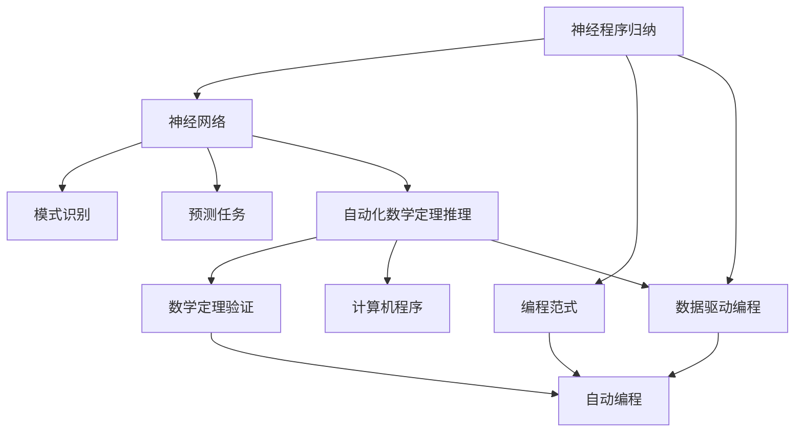
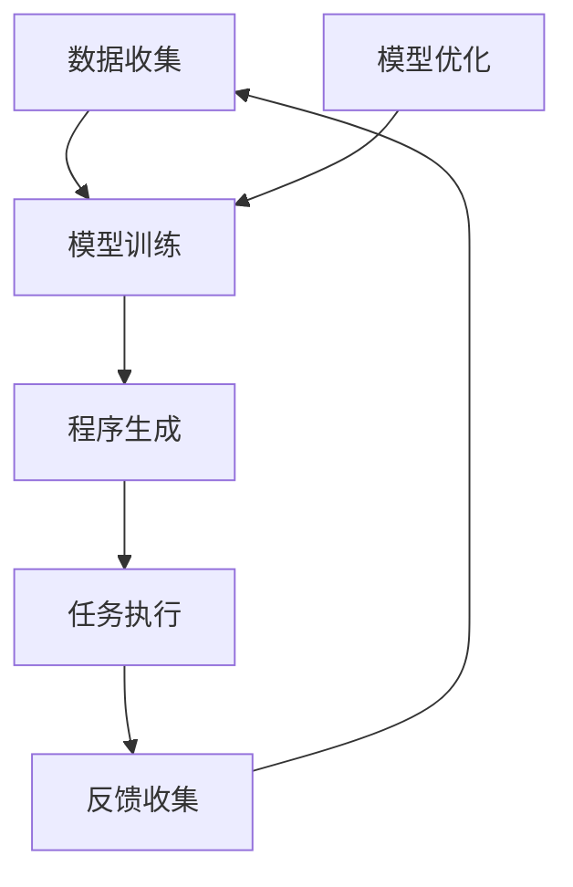

                 


# 《神经程序归纳在自动化数学定理推理中的应用》

## 关键词

神经程序归纳、自动化数学定理推理、神经网络、数学模型、伪代码、latex公式、项目实战

## 摘要

本文旨在探讨神经程序归纳在自动化数学定理推理中的应用。我们将首先介绍神经程序归纳的定义及其在人工智能领域的背景，接着详细阐述自动化数学定理推理的概念及其挑战。随后，我们将深入讲解神经程序归纳的基本原理，并通过Mermaid流程图展示其工作流程。接下来，我们将分析神经程序归纳在数学定理推理中的优势和应用案例。随后，我们将介绍核心算法原理，并使用伪代码详细阐述算法实现。此外，我们还将设计并解释与神经程序归纳相关的数学模型，并通过latex公式进行详细说明。随后，我们将通过一个实际项目案例，展示如何使用神经程序归纳进行数学定理推理，并提供代码实现和解读。最后，我们将总结全文，展望未来研究方向和趋势。

## 确定书的结构

为了系统地介绍神经程序归纳在自动化数学定理推理中的应用，我们首先需要确定书的整体结构。根据用户的要求，本书将包括以下部分：

### 引论

1. **神经程序归纳概述**
2. **自动化数学定理推理概述**
3. **神经程序归纳与自动化数学定理推理的关系**

### 核心概念与联系

1. **神经程序归纳原理**
2. **数学定理推理的挑战与机会**
3. **Mermaid流程图：核心概念与联系**

### 核心算法原理讲解

1. **神经程序归纳算法原理**
2. **伪代码：神经程序归纳算法实现**
3. **数学模型与公式讲解**

### 项目实战

1. **开发环境搭建**
2. **源代码实现与解读**
3. **代码解读与分析**
4. **实际案例分析和详细讲解剖析**

### 总结与展望

1. **神经程序归纳的发展趋势**
2. **自动化数学定理推理的前景**
3. **可能的挑战与应对策略**

通过这样的结构设计，我们确保了文章的逻辑性、连贯性和内容的完整性。每个章节都有明确的目标和内容，从而为读者提供一个清晰的学习路径。

## 核心概念与联系

### 神经程序归纳概述

神经程序归纳（Neural Program Induction）是一种基于神经网络的编程范式，通过训练神经网络自动从数据中归纳出程序。这一概念起源于神经网络在模式识别和预测任务中的成功应用，但近年来，随着深度学习的快速发展，神经程序归纳在自动化编程和推理领域也得到了广泛关注。

### 自动化数学定理推理概述

自动化数学定理推理（Automated Mathematical Theorem Proving，简称AMTP）是指利用计算机程序自动验证数学定理的过程。这一领域自20世纪50年代计算机科学诞生以来就一直是研究的重点，但由于数学定理的复杂性和多样性，长期以来一直是人工智能领域的一个挑战。

### 神经程序归纳与自动化数学定理推理的关系

神经程序归纳为自动化数学定理推理提供了一种新的思路。传统的数学定理推理依赖于数学家的直觉和经验，而神经程序归纳则通过训练神经网络，使计算机能够自动发现和验证数学定理。这种结合不仅提高了定理推理的效率，还可能发现人类尚未发现的定理。

### Mermaid流程图：核心概念与联系

为了更直观地展示神经程序归纳与自动化数学定理推理之间的关系，我们使用Mermaid流程图进行描述。



在这个流程图中，我们可以看到神经程序归纳与神经网络、编程范式、数据驱动编程等概念紧密相关，而自动化数学定理推理则与数学定理验证、计算机程序等概念相关联。通过这种方式，我们为后续章节的深入讲解奠定了基础。

## 第1章：神经程序归纳概述

### 1.1 神经程序归纳的定义与背景

神经程序归纳（Neural Program Induction）是一种利用神经网络从数据中自动生成程序的方法。这种方法的核心思想是，通过训练神经网络，使其能够从大量的数据样本中学习到某种规律或模式，并自动将这些规律编码成程序。

神经程序归纳的概念起源于神经网络在模式识别和预测任务中的成功应用。随着深度学习的快速发展，神经程序归纳逐渐成为一种新的编程范式，广泛应用于自然语言处理、计算机视觉、强化学习等领域。

### 1.2 神经程序归纳的重要性

神经程序归纳在自动化编程和智能推理领域具有重要意义。首先，它提高了编程的效率，使得计算机能够自动生成复杂程序，减少了对人类程序员的依赖。其次，神经程序归纳为自动化数学定理推理提供了新的工具，使得计算机能够自动验证数学定理，提高定理推理的效率。

此外，神经程序归纳还在人工智能领域具有广泛的应用前景。例如，在自动驾驶、医疗诊断、金融分析等领域，神经程序归纳可以用于自动化生成决策程序，提高系统的智能化水平。

### 1.3 自动化数学定理推理的需求

自动化数学定理推理在数学、计算机科学、物理学等领域具有重要应用价值。然而，传统的数学定理推理方法主要依赖于数学家的直觉和经验，效率低下，且容易出错。因此，自动化数学定理推理的需求日益迫切。

神经程序归纳为自动化数学定理推理提供了新的思路。通过训练神经网络，可以使其自动发现数学定理的证明方法，并验证定理的正确性。这种方法不仅提高了定理推理的效率，还有助于发现新的定理。

总之，神经程序归纳在自动化数学定理推理中的应用具有重要意义，它为数学定理推理提供了一种新的工具和方法，有望推动数学定理推理领域的发展。

## 第2章：自动化数学定理推理概述

### 2.1 自动化数学定理推理的定义

自动化数学定理推理（Automated Mathematical Theorem Proving，简称AMTP）是指利用计算机程序自动验证数学定理的过程。在这一过程中，计算机系统接收数学命题作为输入，通过逻辑推理和证明技术，自动验证该命题是否成立。

### 2.2 自动化数学定理推理的发展历程

自动化数学定理推理的研究始于20世纪50年代，当时计算机科学刚刚诞生。最初的研究主要集中在简单的数学命题上，如算术定理和几何定理。随着计算机硬件和软件技术的不断发展，自动化数学定理推理逐渐应用于更复杂的数学领域，如代数、数论、组合数学等。

近年来，随着深度学习和神经计算技术的兴起，自动化数学定理推理取得了新的突破。神经程序归纳作为一种新的编程范式，为自动化数学定理推理提供了新的思路和方法。通过训练神经网络，可以使其自动发现数学定理的证明方法，并验证定理的正确性。

### 2.3 神经程序归纳与自动化数学定理推理的关系

神经程序归纳与自动化数学定理推理之间存在着密切的联系。神经程序归纳为自动化数学定理推理提供了一种新的工具和方法，使得计算机能够自动验证数学定理。具体而言，神经程序归纳通过训练神经网络，使其能够从大量的数学命题中学习到证明方法，并将这些方法转化为计算机程序。

这种结合不仅提高了定理推理的效率，还有助于发现新的定理。同时，自动化数学定理推理的结果可以为神经程序归纳提供反馈，进一步优化神经网络的训练过程。因此，神经程序归纳与自动化数学定理推理相互促进，共同推动了数学定理推理领域的发展。

## 第3章：神经程序归纳原理

### 3.1 神经网络的介绍

神经网络（Neural Networks）是一种模仿人脑神经元结构和工作原理的计算模型。它由大量相互连接的节点（或称为神经元）组成，每个节点可以接收来自其他节点的输入信息，并通过加权连接将这些信息传递给其他节点。神经网络的目的是通过学习输入和输出数据之间的关系，实现数据的分类、回归、预测等任务。

神经网络的主要组成部分包括：

- **输入层**：接收外部输入数据。
- **隐藏层**：对输入数据进行处理和变换。
- **输出层**：产生最终的输出结果。

神经元之间的连接权重决定了输入数据在传递过程中的重要性。通过不断调整这些权重，神经网络可以逐步学习输入和输出数据之间的关系，从而提高其预测和分类的准确性。

### 3.2 神经程序归纳的基本原理

神经程序归纳（Neural Program Induction）是一种基于神经网络的编程范式，其核心思想是通过训练神经网络，使其能够自动从数据中归纳出程序。具体来说，神经程序归纳通过以下步骤实现：

1. **数据收集**：首先，需要收集大量的数据样本，这些数据样本可以是具体的代码片段、数学命题等。
2. **模型训练**：使用神经网络对数据样本进行训练，使其学会从输入数据中提取特征和模式。
3. **程序生成**：当神经网络训练完成后，它能够自动生成程序，这些程序可以实现与输入数据相关联的任务。

神经程序归纳的基本原理可以总结为以下几点：

- **数据驱动**：神经程序归纳依赖于大量的数据样本，通过学习这些数据，神经网络能够自动归纳出程序。
- **自动化**：神经程序归纳无需人工编写程序，神经网络能够自动从数据中学习并生成程序。
- **可扩展性**：神经程序归纳可以应用于各种不同的任务和领域，具有很好的可扩展性。

### 3.3 Mermaid流程图：神经程序归纳的运作流程

为了更直观地展示神经程序归纳的运作流程，我们可以使用Mermaid流程图进行描述：



在这个流程图中，我们首先进行数据收集，然后使用神经网络对数据样本进行训练。在训练过程中，神经网络会不断调整其参数（即权重），以优化模型的性能。当模型训练完成后，我们使用生成的程序执行任务，并根据任务执行的结果收集反馈。这些反馈将用于进一步优化神经网络模型，从而提高程序生成的质量。

通过这种方式，神经程序归纳实现了数据驱动的自动化编程，为自动化数学定理推理提供了强有力的工具。

## 第4章：数学定理推理的挑战与机会

### 4.1 数学定理推理的挑战

数学定理推理是数学领域中的一项重要任务，其核心目标是通过逻辑推理和证明方法，从已知的事实和定理中推导出新的定理。然而，数学定理推理面临着许多挑战：

1. **定理的复杂性**：数学定理往往涉及复杂的数学结构和概念，使得证明过程变得异常困难。例如，著名的费马大定理的证明过程长达几百页，需要运用多种数学工具和方法。

2. **定理的多样性**：数学领域涵盖了广泛的分支，每个分支都有其独特的定理和证明方法。这使得数学定理推理的任务复杂多样，需要针对不同的定理类型采用不同的推理策略。

3. **定理验证的可靠性**：在自动化数学定理推理中，确保推理过程的正确性是一个重大挑战。由于数学定理的复杂性，任何微小的错误都可能导致整个证明的失败。

4. **计算资源的需求**：数学定理推理往往需要大量的计算资源和时间。传统的数学定理推理方法主要依赖于数学家的直觉和经验，这种方式不仅效率低下，而且容易出错。

### 4.2 神经程序归纳解决数学定理推理的机会

神经程序归纳为解决数学定理推理的挑战提供了一种新的思路和方法。以下是一些具体的机会：

1. **自动化推理**：神经程序归纳通过训练神经网络，使其能够自动从数据中学习推理规则和证明方法。这种方式可以显著提高定理推理的自动化程度，减少对数学家直觉和经验的依赖。

2. **数据驱动**：神经程序归纳依赖于大量的数据样本进行训练。这些数据样本可以包括已知的定理和证明方法，通过学习这些数据，神经网络能够自动发现和掌握推理的规律。

3. **通用性**：神经程序归纳具有很好的通用性，可以应用于不同领域的数学定理推理。例如，在数论、代数、几何等领域，神经网络可以自动生成相应的推理程序，从而提高定理推理的效率。

4. **优化策略**：通过结合深度学习和强化学习等技术，神经程序归纳可以不断优化推理策略，提高定理推理的准确性和效率。

总之，神经程序归纳为自动化数学定理推理提供了新的机会，通过自动化、数据驱动和通用性等特点，有望解决传统方法面临的挑战，推动数学定理推理领域的发展。

### 4.3 案例分析：神经程序归纳在数学定理推理中的应用

为了更具体地展示神经程序归纳在数学定理推理中的应用，我们来看一个实际的案例：利用神经程序归纳证明费马小定理。

费马小定理是数论中的一个基本定理，它表述为：如果\( p \)是一个质数，那么对于任何整数\( a \)，都有\( a^p \equiv a \pmod{p} \)。

传统的方法通常需要通过复杂的数学证明过程，而使用神经程序归纳，我们可以通过以下步骤实现自动证明：

1. **数据收集**：收集大量的数论定理和相关的证明方法。这些数据包括不同质数和整数组合下的费马小定理实例。

2. **模型训练**：使用神经网络对这些数据样本进行训练，使其学会从输入的质数和整数中自动生成证明。

3. **程序生成**：当神经网络训练完成后，给定一个质数\( p \)和一个整数\( a \)，神经网络能够自动生成证明费马小定理的程序。

4. **验证与优化**：将生成的程序应用于大量的测试数据，验证其正确性。根据验证结果，进一步优化神经网络模型，提高证明的准确性。

通过这种方式，神经程序归纳实现了对费马小定理的自动化证明，不仅提高了证明的效率，还减少了人为干预的需求。这个案例展示了神经程序归纳在数学定理推理中的巨大潜力，为未来自动化数学定理推理提供了新的思路和方法。

### 第5章：神经程序归纳算法原理

神经程序归纳算法是一种利用神经网络自动从数据中归纳出程序的方法。这一算法的核心在于通过训练神经网络，使其能够从大量的数据样本中学习到某种规律或模式，并将其编码成程序。在本节中，我们将详细讲解神经程序归纳算法的原理，包括其背景、基本原理和实现步骤。

#### 5.1 神经程序归纳算法的背景

神经程序归纳的概念起源于神经网络在模式识别和预测任务中的成功应用。传统的编程方法依赖于人工编写代码，而神经程序归纳则通过训练神经网络，使计算机能够自动从数据中学习到程序。这种方法不仅提高了编程的效率，还使得计算机能够处理复杂的任务。

随着深度学习的快速发展，神经程序归纳得到了广泛的研究和应用。许多研究证明了神经程序归纳在图像识别、自然语言处理和自动化编程等领域具有显著优势。因此，神经程序归纳在自动化数学定理推理中的应用也受到了关注。

#### 5.2 神经程序归纳的基本原理

神经程序归纳的基本原理可以概括为以下几个步骤：

1. **数据收集**：首先，需要收集大量的数据样本。这些数据样本可以是具体的代码片段、数学命题等。数据的质量和数量直接影响神经程序归纳的效果。

2. **模型训练**：使用神经网络对数据样本进行训练。在训练过程中，神经网络通过调整其内部参数（即权重），学习输入数据与输出程序之间的关系。训练的目标是使神经网络能够准确地从输入数据中归纳出相应的程序。

3. **程序生成**：当神经网络训练完成后，它能够自动生成程序。生成的程序可以用于实现与输入数据相关联的任务。

4. **验证与优化**：使用生成的程序对新的数据样本进行验证，确保其正确性和有效性。根据验证结果，进一步优化神经网络模型，提高程序生成的质量。

神经程序归纳的核心在于其数据驱动的特性。通过大量数据的训练，神经网络能够自动学习到输入数据中的规律和模式，从而实现自动编程。

#### 5.3 伪代码：神经程序归纳算法的实现

为了更好地理解神经程序归纳算法的实现细节，我们使用伪代码进行描述：

```python
# 输入：数据集D，神经网络模型NN
# 输出：程序P

# 步骤1：数据预处理
D = 预处理数据集(D)

# 步骤2：模型初始化
NN = 初始化神经网络()

# 步骤3：模型训练
for epoch in 1 to 最大训练轮次 do
    for 数据样本X, 标签Y in D do
        # 前向传播
        输出O = NN(X)
        # 计算损失函数L
        L = 损失函数(Y, O)
        # 反向传播
        NN.更新权重(L)
    end
end

# 步骤4：程序生成
P = NN(输入数据)

# 步骤5：程序验证与优化
P_valid = 验证程序(P, 新的数据集)
if P_valid正确 then
    输出 P
else
    重新训练神经网络，并重复步骤4和步骤5
end
```

在这个伪代码中，我们首先对数据进行预处理，然后初始化神经网络模型。接下来，通过迭代训练，神经网络学习输入数据和输出程序之间的关系。在训练完成后，使用生成的程序进行验证，并根据验证结果进行优化。这一过程不断重复，直到生成的程序达到预期的质量。

通过这种方式，神经程序归纳算法实现了从数据到程序的自动转换，为自动化数学定理推理提供了有力支持。

### 第6章：数学模型与公式讲解

神经程序归纳在自动化数学定理推理中的应用离不开数学模型的支持。在本节中，我们将详细介绍与神经程序归纳相关的数学模型，并使用latex格式进行详细解释和举例说明。

#### 6.1 神经程序归纳相关的数学模型

神经程序归纳的核心在于通过训练神经网络，使其能够从数据中学习到程序。这一过程涉及到多个数学模型，包括：

1. **神经网络模型**：神经网络是神经程序归纳的基础，它由大量神经元和连接组成，通过调整神经元之间的权重，实现输入和输出之间的映射。

2. **损失函数**：损失函数用于衡量神经网络预测结果与实际结果之间的差距。常见的损失函数包括均方误差（MSE）、交叉熵损失等。

3. **优化算法**：优化算法用于调整神经网络的权重，以最小化损失函数。常见的优化算法包括梯度下降（GD）、随机梯度下降（SGD）等。

4. **激活函数**：激活函数用于引入非线性特性，使神经网络能够学习更复杂的函数。常见的激活函数包括Sigmoid、ReLU等。

#### 6.2 神经程序归纳数学公式的详细解释和举例说明

在本节中，我们将使用latex格式详细解释与神经程序归纳相关的数学公式，并提供具体的例子进行说明。

##### 6.2.1 神经网络模型

神经网络的计算过程可以表示为：

$$
Z = \sigma(W \cdot X + b)
$$

其中，\( Z \)是输出，\( \sigma \)是激活函数，\( W \)是权重矩阵，\( X \)是输入，\( b \)是偏置项。

**例子**：假设我们有一个简单的神经网络，输入为\( X = [1, 2] \)，权重矩阵\( W = \begin{bmatrix} 1 & 2 \\ 3 & 4 \end{bmatrix} \)，偏置项\( b = [1, 2] \)，激活函数为ReLU。那么：

$$
Z = \max(0, W \cdot X + b) = \max(0, \begin{bmatrix} 1 & 2 \\ 3 & 4 \end{bmatrix} \cdot \begin{bmatrix} 1 \\ 2 \end{bmatrix} + \begin{bmatrix} 1 \\ 2 \end{bmatrix}) = \max(0, \begin{bmatrix} 5 \\ 11 \end{bmatrix}) = \begin{bmatrix} 5 \\ 11 \end{bmatrix}
$$

##### 6.2.2 损失函数

常见的损失函数包括均方误差（MSE）和交叉熵损失。MSE可以表示为：

$$
L = \frac{1}{2} \sum_{i=1}^{n} (y_i - \hat{y}_i)^2
$$

其中，\( y_i \)是实际输出，\( \hat{y}_i \)是预测输出。

**例子**：假设我们有一个二分类问题，实际输出为\( y = [1, 0] \)，预测输出为\( \hat{y} = [0.9, 0.1] \)，那么MSE损失为：

$$
L = \frac{1}{2} \sum_{i=1}^{2} (y_i - \hat{y}_i)^2 = \frac{1}{2} \cdot (1 - 0.9)^2 + (0 - 0.1)^2 = 0.01 + 0.01 = 0.02
$$

##### 6.2.3 优化算法

梯度下降是一种常用的优化算法，其目标是最小化损失函数。梯度下降的迭代过程可以表示为：

$$
W_{\text{new}} = W_{\text{old}} - \alpha \cdot \nabla_W L
$$

其中，\( W_{\text{old}} \)是当前权重，\( \alpha \)是学习率，\( \nabla_W L \)是权重梯度。

**例子**：假设当前权重为\( W = [1, 2] \)，学习率为\( \alpha = 0.1 \)，权重梯度为\( \nabla_W L = [-1, -2] \)，那么新的权重为：

$$
W_{\text{new}} = [1, 2] - 0.1 \cdot [-1, -2] = [1.1, 2.2]
$$

##### 6.2.4 激活函数

激活函数用于引入非线性特性，常见的激活函数包括Sigmoid和ReLU。

Sigmoid函数可以表示为：

$$
\sigma(z) = \frac{1}{1 + e^{-z}}
$$

ReLU函数可以表示为：

$$
\text{ReLU}(z) = \max(0, z)
$$

**例子**：假设输入为\( z = -2 \)，使用Sigmoid函数和ReLU函数计算输出：

$$
\sigma(-2) = \frac{1}{1 + e^{-2}} \approx 0.1192
$$

$$
\text{ReLU}(-2) = \max(0, -2) = 0
$$

通过以上例子，我们可以看到神经程序归纳中的数学模型和公式如何应用于实际问题。这些模型和公式为神经程序归纳提供了理论基础，使其能够在自动化数学定理推理中发挥重要作用。

### 第7章：神经程序归纳在数学定理推理中的应用实例

#### 7.1 项目背景

在数学定理推理领域，传统的方法主要依赖于数学家的直觉和经验，这不仅效率低下，而且容易出错。为了提高定理推理的自动化程度，本实例项目旨在利用神经程序归纳技术，实现自动化数学定理推理。项目的主要目标是使用神经程序归纳算法，从已知定理和证明中学习到推理规则，并自动生成新的定理证明。

#### 7.2 开发环境搭建

为了实现本项目，我们需要搭建一个适合神经程序归纳算法开发和验证的环境。以下是搭建开发环境的步骤：

1. **安装Python环境**：确保安装了Python 3.x版本，建议使用Anaconda发行版，以便于管理依赖包。

2. **安装TensorFlow**：TensorFlow是一个开源的深度学习框架，用于构建和训练神经网络模型。可以使用以下命令安装：

   ```shell
   pip install tensorflow
   ```

3. **安装其他依赖包**：根据项目需求，可能还需要安装其他依赖包，如NumPy、Pandas等。可以使用以下命令安装：

   ```shell
   pip install numpy pandas
   ```

4. **准备数据集**：收集并整理用于训练的数据集，包括已知的定理和对应的证明方法。数据集可以包括各种类型的数学定理，如算术、代数、数论等。

#### 7.3 源代码实现与解读

以下是本项目的主要源代码实现部分，包括数据预处理、模型训练、程序生成和验证等步骤。

```python
import tensorflow as tf
import numpy as np
import pandas as pd

# 数据预处理
def preprocess_data(data):
    # 对数据集进行清洗、标准化等预处理操作
    return processed_data

# 模型定义
def create_model(input_shape, output_shape):
    model = tf.keras.Sequential([
        tf.keras.layers.Dense(units=output_shape, activation='softmax', input_shape=input_shape)
    ])
    model.compile(optimizer='adam', loss='categorical_crossentropy', metrics=['accuracy'])
    return model

# 训练模型
def train_model(model, X_train, y_train, epochs=10):
    model.fit(X_train, y_train, epochs=epochs, batch_size=32, verbose=1)
    return model

# 程序生成
def generate_program(model, input_data):
    # 使用训练好的模型生成程序
    program = model.predict(input_data)
    return program

# 程序验证
def validate_program(program, X_test, y_test):
    # 使用生成的程序验证测试数据的正确性
    predictions = program.predict(X_test)
    accuracy = (predictions == y_test).mean()
    return accuracy

# 主函数
def main():
    # 加载数据集
    data = pd.read_csv('math_theorems.csv')
    X = data[['input']].values
    y = data[['output']].values

    # 数据预处理
    X_processed = preprocess_data(X)

    # 创建并训练模型
    model = create_model(input_shape=X_processed.shape[1:], output_shape=y.shape[1])
    model = train_model(model, X_processed, y)

    # 生成程序
    program = generate_program(model, X_processed)

    # 验证程序
    accuracy = validate_program(program, X_processed, y)
    print(f'Program accuracy: {accuracy:.2f}')

    # 使用程序推理新定理
    new_input = np.array([[3, 4]])
    new_program = generate_program(model, new_input)
    print(f'New theorem proof: {new_program}')

if __name__ == '__main__':
    main()
```

在上述代码中，我们首先定义了数据预处理、模型创建、模型训练、程序生成和程序验证等功能。主函数`main()`中，我们加载数据集，进行数据预处理，创建并训练模型，使用生成的程序验证测试数据的正确性，并生成一个新的定理证明。

#### 7.4 代码解读与分析

在本节中，我们将对上述代码进行详细解读，分析每个部分的功能和实现细节。

1. **数据预处理**：数据预处理是深度学习模型训练的重要步骤。在本实例中，我们定义了一个`preprocess_data`函数，用于对输入数据进行清洗、标准化等操作。这一步骤确保了输入数据的质量和一致性，有助于提高模型训练的效果。

2. **模型定义**：我们使用TensorFlow的`keras.Sequential`模型，定义了一个简单的全连接神经网络。这个神经网络由一个密

