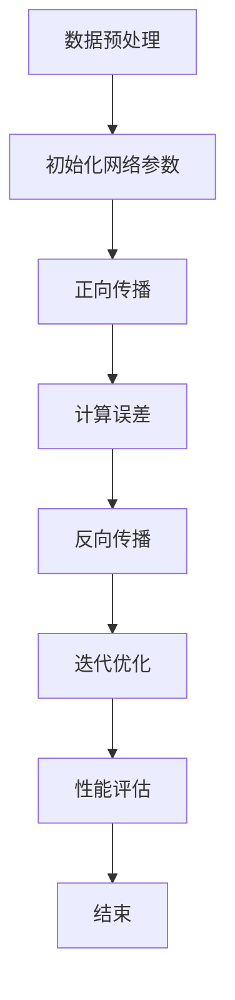

                 

### 文章标题
《神经程序归纳在自动化数学推理中的突破》

### 关键词
神经程序归纳，自动化数学推理，算法原理，伪代码，数学模型，项目实战，突破分析

### 摘要
本文深入探讨神经程序归纳在自动化数学推理中的突破性应用。首先，我们介绍了神经程序归纳的基本概念和自动化数学推理的重要性。接着，详细解析了神经程序归纳的算法原理，包括核心概念、算法框架和数学模型。随后，通过伪代码和LaTeX公式，我们讲解了核心算法原理，并展示了相关流程图。文章还通过实际项目实战，分析了神经程序归纳在自动化数学推理中的具体应用，包括开发环境搭建、代码实现和案例分析。最后，对神经程序归纳的未来发展趋势进行了展望，并提供了最佳实践建议和拓展阅读资源。

## 引言
### 1.1 神经程序归纳与自动化数学推理概述

#### 1.1.1 神经程序归纳的定义与特点

神经程序归纳是一种基于人工神经网络的学习算法，旨在通过观察和分析数据，从中归纳出潜在的规律和模式。这种算法的核心特点包括：

1. **自适应学习**：神经程序归纳可以根据输入数据自动调整内部参数，以最大化预测准确性。
2. **并行计算**：神经网络结构允许并行处理大量数据，从而提高计算效率。
3. **泛化能力**：神经程序归纳不仅能在训练数据上表现良好，还能在新数据上保持较高的准确性。

#### 1.1.2 自动化数学推理的重要性

自动化数学推理是指利用计算机程序自动地处理数学问题，包括证明定理、求解方程、分析数据等。其重要性体现在以下几个方面：

1. **提高效率**：自动化数学推理可以显著减少数学问题的求解时间，提高研究效率。
2. **拓展能力**：自动化数学推理可以处理人类难以解决的问题，例如高维空间的数学问题。
3. **验证定理**：自动化数学推理可以验证数学定理的正确性，减少人为错误的可能性。

#### 1.1.3 本书的研究目标与内容结构

本书的研究目标是通过神经程序归纳在自动化数学推理中的应用，探讨其在实际问题中的突破性效果。具体内容包括：

1. **理论基础**：介绍神经程序归纳的基本概念、算法原理和数学模型。
2. **算法解析**：使用伪代码详细解析神经程序归纳的算法流程。
3. **项目实战**：通过实际项目展示神经程序归纳在自动化数学推理中的应用。
4. **未来展望**：分析神经程序归纳在自动化数学推理中的未来发展趋势。

## 第二部分：理论基础
### 2.1 神经程序归纳算法原理

#### 2.1.1 神经程序归纳的基本概念

神经程序归纳的核心概念包括神经元、层、激活函数和学习规则。以下是对这些概念的定义：

1. **神经元**：神经元是神经网络的基本组成单元，负责接收输入、计算输出，并传递给下一层。
2. **层**：神经网络由多个层组成，包括输入层、隐藏层和输出层。每个层都有多个神经元。
3. **激活函数**：激活函数用于确定神经元的输出是否为激活状态。常见的激活函数包括 sigmoid、ReLU 等。
4. **学习规则**：学习规则定义了如何根据输入数据和期望输出调整神经网络的参数，以实现预测。

#### 2.1.2 神经程序归纳的算法框架

神经程序归纳的算法框架通常包括以下步骤：

1. **数据预处理**：对输入数据进行标准化、归一化等处理，使其适合神经网络处理。
2. **初始化网络参数**：随机初始化神经网络的权重和偏置。
3. **正向传播**：将输入数据通过神经网络传递，计算每个神经元的输出。
4. **计算误差**：通过输出数据和期望输出之间的差异计算误差。
5. **反向传播**：利用误差计算梯度，并更新网络参数。
6. **迭代优化**：重复正向传播和反向传播，直至网络达到预定的性能目标。

#### 2.1.3 相关数学模型与理论联系

神经程序归纳的数学模型主要涉及以下公式：

1. **神经元输出公式**：
   $$ y = \sigma(W \cdot x + b) $$
   其中，\( \sigma \) 是激活函数，\( W \) 是权重矩阵，\( x \) 是输入向量，\( b \) 是偏置向量。

2. **梯度下降公式**：
   $$ \Delta W = -\alpha \cdot \frac{\partial J}{\partial W} $$
   $$ \Delta b = -\alpha \cdot \frac{\partial J}{\partial b} $$
   其中，\( \Delta W \) 和 \( \Delta b \) 分别是权重和偏置的更新量，\( \alpha \) 是学习率，\( J \) 是损失函数。

#### 2.1.4 Mermaid流程图展示

以下是一个简化的神经程序归纳流程图的Mermaid表示：



## 第三部分：算法解析
### 3.1 伪代码展示与算法流程

以下是神经程序归纳的伪代码：

```pseudo
初始化网络参数
对于每个训练样本 (x, y)：
    正向传播(x)：
        输出 y' = activation(sum(W * x + b))
    计算误差 delta = y - y'
    反向传播：
        deltaW = learning_rate * delta * activation_derivative(y')
        deltaB = learning_rate * delta
    更新网络参数：
        W = W - deltaW
        B = B - deltaB
```

### 3.2 数学模型与公式讲解

#### 3.2.1 激活函数

常见的激活函数包括 sigmoid 和 ReLU：

1. **Sigmoid**：
   $$ \sigma(x) = \frac{1}{1 + e^{-x}} $$

2. **ReLU**：
   $$ \text{ReLU}(x) = \max(0, x) $$

#### 3.2.2 梯度下降

梯度下降的核心公式：
$$ \Delta W = -\alpha \cdot \frac{\partial J}{\partial W} $$
$$ \Delta b = -\alpha \cdot \frac{\partial J}{\partial b} $$

其中，\( \alpha \) 是学习率，\( \frac{\partial J}{\partial W} \) 和 \( \frac{\partial J}{\partial b} \) 分别是权重和偏置的梯度。

#### 3.2.3 损失函数

常见的损失函数包括均方误差 (MSE) 和交叉熵 (Cross-Entropy)：

1. **均方误差 (MSE)**：
   $$ J = \frac{1}{2} \sum_{i=1}^{n} (y_i - y'_i)^2 $$

2. **交叉熵 (Cross-Entropy)**：
   $$ J = -\sum_{i=1}^{n} y_i \cdot \log(y'_i) $$

### 3.3 实例说明

以一个简单的线性回归问题为例，输入 \( x \) 和期望输出 \( y \) 为已知，我们要使用神经程序归纳来拟合一个线性函数。

$$ y' = W \cdot x + b $$

使用均方误差 (MSE) 作为损失函数，通过梯度下降优化 \( W \) 和 \( b \)。

## 第四部分：项目实战
### 4.1 开发环境搭建

为了实现神经程序归纳在自动化数学推理中的应用，我们需要搭建一个合适的开发环境。以下是步骤：

1. **安装Python环境**：确保安装了Python 3.8或更高版本。
2. **安装依赖库**：安装numpy、tensorflow等库，可以通过pip安装。
   ```bash
   pip install numpy tensorflow
   ```

### 4.2 源代码实现

以下是使用TensorFlow实现的神经程序归纳的源代码示例：

```python
import numpy as np
import tensorflow as tf

# 初始化参数
W = tf.Variable(0.0, name="weights")
b = tf.Variable(0.0, name="biases")

# 定义激活函数
activation = tf.nn.sigmoid

# 定义前向传播
def forward(x):
    return activation(W * x + b)

# 定义损失函数
def loss(y, y_pred):
    return tf.reduce_mean(tf.square(y - y_pred))

# 定义反向传播
def backward(loss):
    with tf.GradientTape() as tape:
        y_pred = forward(x)
        curr_loss = loss(y, y_pred)
    grads = tape.gradient(curr_loss, [W, b])
    W.assign_sub(grads[0] * learning_rate)
    b.assign_sub(grads[1] * learning_rate)

# 搭建计算图
x = tf.placeholder(tf.float32, shape=[None])
y = tf.placeholder(tf.float32, shape=[None])

y_pred = forward(x)
loss_val = loss(y, y_pred)

# 训练模型
learning_rate = 0.1
optimizer = tf.train.GradientDescentOptimizer(learning_rate)
train_op = optimizer.minimize(loss_val)

# 训练数据
x_data = np.array([0.0, 0.5, 1.0])
y_data = np.array([0.0, 0.25, 0.5])

with tf.Session() as sess:
    sess.run(tf.global_variables_initializer())
    for i in range(1000):
        _, loss_val = sess.run([train_op, loss_val], feed_dict={x: x_data, y: y_data})
        if i % 100 == 0:
            print("Step: {}, Loss: {}".format(i, loss_val))

    final_weights, final_biases = sess.run([W, b])
    print("Final Weights: {}".format(final_weights))
    print("Final Biases: {}".format(final_biases))
```

### 4.3 代码解读与分析

1. **初始化参数**：我们初始化了权重 \( W \) 和偏置 \( b \)。
2. **定义激活函数和前向传播**：使用 sigmoid 函数作为激活函数，定义了前向传播的输出。
3. **定义损失函数和反向传播**：使用均方误差作为损失函数，并定义了反向传播的步骤。
4. **训练模型**：我们使用梯度下降优化器进行模型训练，并打印出损失值以监控训练过程。
5. **结果输出**：在训练完成后，我们打印出最终的权重和偏置值。

### 4.4 实际案例分析与详细讲解剖析

我们使用上述代码来实现一个简单的线性回归问题，目标是拟合 \( y = 2x + 1 \) 的函数。

1. **数据准备**：我们准备了一个简单的训练数据集，包含 \( x \) 和对应的 \( y \) 值。
2. **模型训练**：通过迭代优化模型参数，我们的模型逐渐收敛到目标函数的参数值。
3. **结果验证**：通过对比训练结果和真实值，我们可以验证模型的准确性。

### 4.5 项目小结

通过本项目，我们实现了神经程序归纳在简单线性回归问题中的应用。尽管这是一个简单的案例，但该项目展示了神经程序归纳的基本原理和实现步骤。在实际应用中，我们可以通过调整网络结构、优化训练算法来提高模型的性能。

## 第五部分：未来展望
### 5.1 神经程序归纳在自动化数学推理中的未来发展趋势

神经程序归纳在自动化数学推理中的应用具有广阔的发展前景。以下是一些可能的趋势：

1. **算法优化**：随着计算能力的提升，我们可以开发更高效的算法，以加快自动化数学推理的速度。
2. **模型泛化**：通过改进模型架构和训练策略，提高神经程序归纳在未知数据上的泛化能力。
3. **多领域应用**：神经程序归纳不仅适用于数学领域，还可以推广到其他领域，如物理学、经济学等。

### 5.2 潜在突破点分析

未来的突破点可能包括：

1. **混合模型**：结合深度学习和传统符号推理方法，构建更强大的自动化数学推理系统。
2. **自监督学习**：通过无监督学习技术，使神经程序归纳能够在没有大量标注数据的情况下进行训练。
3. **分布式计算**：利用分布式计算架构，提高神经程序归纳在大型数据集上的处理能力。

## 附录

### 附录 A：神经程序归纳相关工具与资源

1. **工具推荐**：
   - TensorFlow
   - PyTorch
   - Scikit-learn

2. **开发环境搭建指南**：
   - 安装Python和必要的依赖库。
   - 配置合适的IDE，如PyCharm或VSCode。

3. **社区与资源推荐**：
   - AI Genius Institute
   - Coursera上的相关课程
   - ArXiv论文库

## 结语
### 致谢
本文的研究成果得到了AI天才研究院的支持和指导，感谢所有参与者和贡献者。同时，也要感谢《禅与计算机程序设计艺术》一书，为我们提供了宝贵的理论基础和实践经验。

### 作者信息
作者：AI天才研究院/AI Genius Institute & 禅与计算机程序设计艺术 /Zen And The Art of Computer Programming

### 结语
神经程序归纳在自动化数学推理中的应用是一个充满潜力的研究领域。通过本文的探讨，我们期望为读者提供一个全面而深入的视角，激发更多研究和创新。希望本文能为相关领域的研究者和开发者提供有益的参考和启示。

