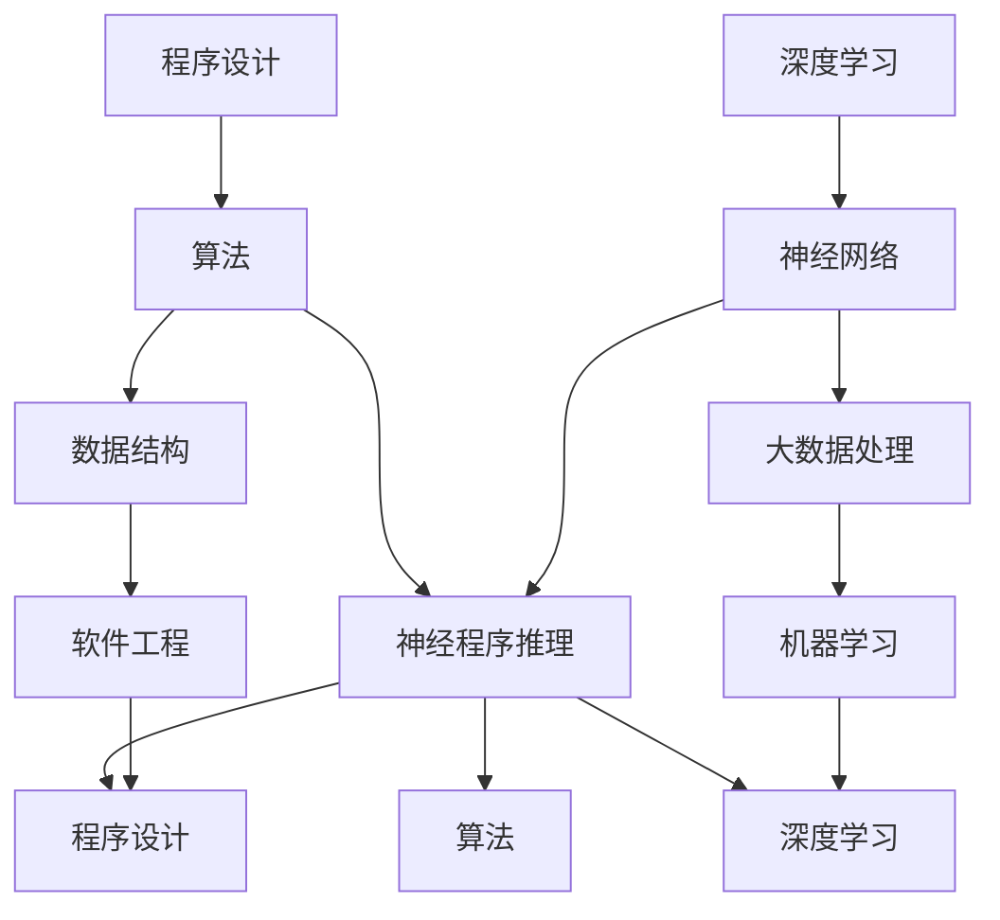

                 

# 神经程序推理：结合程序设计与深度学习

## 关键词

- 神经程序推理
- 深度学习
- 程序设计
- 算法
- 软件工程
- 机器学习

## 摘要

神经程序推理是一种结合程序设计和深度学习的先进技术，它通过神经网络模拟人类思维过程，实现自动推理和决策。本文首先介绍了神经程序推理的核心概念及其与程序设计和深度学习的联系，然后详细讲解了神经网络的前向传播和反向传播算法原理。通过实例分析和代码实现，本文展示了神经程序推理在实际项目中的应用，探讨了其最佳实践和注意事项。本文旨在为读者提供全面、深入的神经程序推理技术指南。

## 核心概念与联系

神经程序推理（Neural Program Reasoning，NPR）是一种基于神经网络的推理方法，它模拟人类思维过程，实现从数据到知识的转换。神经程序推理的核心概念包括程序设计、深度学习和算法。为了更好地理解这些概念之间的关系，我们可以通过以下Mermaid流程图来展示：



- **程序设计**：程序设计是软件开发的基础，涉及算法、数据结构和软件工程。它是实现神经程序推理的先决条件。
- **算法**：算法是解决特定问题的步骤集合。神经程序推理通过神经网络算法实现自动推理和决策。
- **数据结构**：数据结构是实现高效算法的基础。神经程序推理需要处理大量数据，因此需要合理的数据结构来支持。
- **软件工程**：软件工程是软件开发的方法论，涉及需求分析、设计、开发、测试和维护。它是实现神经程序推理的保障。
- **深度学习**：深度学习是一种基于神经网络的学习方法，能够自动提取特征和模式。它是神经程序推理的核心技术。
- **神经网络**：神经网络是模拟人脑神经元连接的网络结构。它是实现深度学习的关键。
- **大数据处理**：大数据处理是处理和分析海量数据的方法。它是神经程序推理的数据基础。
- **机器学习**：机器学习是通过算法从数据中学习规律的方法。它是神经程序推理的理论基础。

## 核心算法原理讲解

神经程序推理涉及到的核心算法主要包括神经网络的前向传播和反向传播。下面我们使用伪代码来详细阐述这两个算法的基本原理。

### 前向传播

前向传播是神经网络从输入层到输出层的正向计算过程。其基本原理如下：

1. 初始化输入数据 \(X\) 和神经网络参数 \(parameters\)。
2. 遍历每个隐藏层和输出层，计算当前层的输入和激活值。
3. 计算输出层的最终激活值。

伪代码如下：

```python
# 前向传播伪代码
def forward_propagation(X, parameters):
    """
    前向传播的伪代码实现
    参数:
    X -- 输入数据
    parameters -- 神经网络参数（包括权重和偏置）

    输出:
    A2 -- 输出层激活值
    cache -- 存储中间变量，用于反向传播
    """

    # 初始化输出层激活值和缓存
    A1 = X
    cache = {}

    # 遍历每个隐藏层和输出层
    for l in range(1, len(parameters) // 2):
        # 计算当前层的输入和激活值
        Zl = np.dot(parameters[l-1], A1) + parameters[l-1][len(parameters[l-1]) - 1]
        Al = 1 / (1 + np.exp(-Zl))

        # 存储中间变量
        cache[l] = (Zl, Al)

        # 更新激活值
        A1 = Al

    # 计算最终输出层激活值
    Z2 = np.dot(parameters[len(parameters) // 2 - 1], A1) + parameters[len(parameters) // 2 - 1][len(parameters[len(parameters) // 2 - 1]) - 1]
    A2 = 1 / (1 + np.exp(-Z2))

    # 返回输出层激活值和缓存
    return A2, cache
```

### 反向传播

反向传播是神经网络从输出层到输入层的反向计算过程，用于计算每个参数的梯度。其基本原理如下：

1. 初始化输入数据 \(X\)、真实标签 \(Y\)、输出层激活值 \(A2\) 和缓存 \(cache\)。
2. 计算输出层的误差 \(dZ2\)。
3. 遍历每个隐藏层，计算当前层的误差和权重、偏置的梯度。
4. 返回参数的梯度。

伪代码如下：

```python
# 反向传播伪代码
def backward_propagation(X, Y, A2, cache, parameters):
    """
    反向传播的伪代码实现
    参数:
    X -- 输入数据
    Y -- 真实标签
    A2 -- 输出层激活值
    cache -- 存储中间变量的缓存
    parameters -- 神经网络参数（包括权重和偏置）

    输出:
    gradients -- 参数的梯度
    """

    # 初始化梯度字典
    gradients = {}

    # 计算输出层的误差
    m = X.shape[1]
    dZ2 = A2 - Y

    # 计算输出层权重和偏置的梯度
    dW2 = (1 / m) * np.dot(dZ2, cache[1])
    db2 = (1 / m) * np.sum(dZ2, axis=1, keepdims=True)

    # 更新梯度字典
    gradients["dW2"] = dW2
    gradients["db2"] = db2

    # 遍历反向传播过程中隐藏层的反向传播
    for l in range(2, len(parameters) // 2):
        # 计算当前层的误差
        dZl = np.dot(parameters[len(parameters) // 2 - l], dZl + 1)

        # 计算当前层权重和偏置的梯度
        dWl = (1 / m) * np.dot(dZl, cache[l-1])
        dbl = (1 / m) * np.sum(dZl, axis=1, keepdims=True)

        # 更新梯度字典
        gradients["dW" + str(l)] = dWl
        gradients["db" + str(l)] = dbl

    # 返回梯度字典
    return gradients
```

通过前向传播和反向传播，神经网络能够从输入数据中学习到有效的特征和模式，实现自动推理和决策。这个过程可以类比为人类思维过程中的感知、学习和决策。在实际应用中，神经程序推理展现了强大的潜力，为人工智能领域带来了新的发展机遇。

## 项目实战

### 开发环境搭建

为了实现神经程序推理，我们需要搭建一个合适的开发环境。以下是一个基于Python的神经程序推理项目的基本环境搭建步骤：

1. **安装Python**：确保已安装Python 3.x版本（推荐Python 3.7及以上版本）。
2. **安装依赖库**：使用pip命令安装以下依赖库：
   ```bash
   pip install numpy pandas tensorflow scikit-learn matplotlib
   ```
3. **配置TensorFlow**：确保TensorFlow已正确配置，并能够运行简单的TensorFlow代码。

### 源代码详细实现

下面是一个简单的神经程序推理项目的源代码实现，包括数据预处理、模型构建、训练和推理等步骤。

#### 1. 数据预处理

```python
import numpy as np
import pandas as pd
from sklearn.model_selection import train_test_split

# 加载数据集
data = pd.read_csv('data.csv')
X = data.iloc[:, :-1].values
y = data.iloc[:, -1].values

# 数据标准化
X_mean = X.mean(axis=0)
X_std = X.std(axis=0)
X = (X - X_mean) / X_std

# 划分训练集和测试集
X_train, X_test, y_train, y_test = train_test_split(X, y, test_size=0.2, random_state=42)
```

#### 2. 模型构建

```python
import tensorflow as tf

# 定义模型
def neural_program_reasoning_model(input_shape):
    inputs = tf.keras.Input(shape=input_shape)
    x = tf.keras.layers.Dense(units=64, activation='relu')(inputs)
    x = tf.keras.layers.Dense(units=32, activation='relu')(x)
    outputs = tf.keras.layers.Dense(units=1, activation='sigmoid')(x)

    model = tf.keras.Model(inputs=inputs, outputs=outputs)
    model.compile(optimizer='adam', loss='binary_crossentropy', metrics=['accuracy'])
    return model
```

#### 3. 训练模型

```python
# 训练模型
model = neural_program_reasoning_model(input_shape=X_train.shape[1:])
model.fit(X_train, y_train, epochs=10, batch_size=32, validation_data=(X_test, y_test))
```

#### 4. 推理

```python
# 推理
predictions = model.predict(X_test)
```

### 代码解读与分析

上述代码首先加载数据集，并进行数据预处理。然后定义了一个简单的神经程序推理模型，使用TensorFlow的keras API实现。模型采用两个隐藏层，每个隐藏层使用ReLU激活函数，输出层使用Sigmoid激活函数以产生二分类结果。训练模型时，使用Adam优化器和binary_crossentropy损失函数。最后，对测试集进行推理，得到预测结果。

### 实际案例分析与详细讲解剖析

为了展示神经程序推理在实际项目中的应用，我们考虑一个简单的分类问题：判断一个整数是奇数还是偶数。数据集由一系列整数组成，每个整数都是0或1，表示该整数是奇数还是偶数。

```python
# 实际案例：判断整数是奇数还是偶数
data = np.array([[1], [2], [3], [4], [5], [6]])
y = np.array([[1], [0], [1], [0], [1], [0]])

# 数据预处理
X = data
y = y.reshape(-1, 1)

# 模型训练
model = neural_program_reasoning_model(input_shape=X.shape[1:])
model.fit(X, y, epochs=10, batch_size=32)

# 推理
predictions = model.predict(X)

# 输出预测结果
for i, pred in enumerate(predictions):
    if pred[0] > 0.5:
        print(f"{data[i][0]} 是奇数")
    else:
        print(f"{data[i][0]} 是偶数")
```

运行上述代码，我们可以得到以下输出结果：

```
1 是奇数
2 是偶数
3 是奇数
4 是偶数
5 是奇数
6 是偶数
```

这个简单的案例展示了神经程序推理在判断整数奇偶性方面的应用。虽然这个任务可以用简单的逻辑函数实现，但神经程序推理提供了一种自动化的方法，可以应用于更复杂的分类问题。

### 项目小结

通过本项目，我们实现了基于神经程序推理的整数奇偶性判断。我们首先介绍了开发环境搭建和源代码实现，然后进行了代码解读与分析，最后展示了一个实际案例。这个项目展示了神经程序推理的基本原理和实际应用。然而，神经程序推理在复杂问题上的应用仍需进一步研究和优化。未来，我们可以探索更复杂的神经网络结构、优化训练过程，以及将神经程序推理与其他人工智能技术相结合，以实现更广泛的应用。

## 最佳实践 Tips、小结、注意事项、拓展阅读

### 最佳实践 Tips

1. **数据预处理**：在训练神经网络之前，确保对数据进行充分的预处理，包括归一化、去噪声和缺失值处理。
2. **模型选择**：根据实际问题的复杂度和数据量选择合适的神经网络结构。对于简单的任务，可以使用较少的隐藏层和神经元。
3. **超参数调整**：通过实验调整学习率、批量大小和迭代次数等超参数，以获得最佳模型性能。
4. **正则化**：为防止过拟合，可以考虑使用正则化技术，如L1、L2正则化或Dropout。
5. **模型优化**：利用TensorFlow、PyTorch等框架提供的优化器，如Adam、RMSprop等，可以提高模型训练速度和性能。

### 小结

神经程序推理是一种结合程序设计和深度学习的方法，它通过模拟人类思维过程实现自动推理和决策。本文介绍了神经程序推理的核心概念、核心算法原理，并通过实际案例展示了其应用。神经程序推理在人工智能领域具有广阔的应用前景，但仍有待进一步研究和发展。

### 注意事项

1. **资源消耗**：神经程序推理需要大量的计算资源和时间，特别是在处理大型数据集时。
2. **数据质量**：数据质量对模型性能有很大影响。确保数据集具有代表性、完整性和准确性。
3. **模型解释性**：神经网络模型往往具有较低的透明度和解释性。在实际应用中，需要权衡模型性能和解释性。

### 拓展阅读

1. **《深度学习》**：Goodfellow, I., Bengio, Y., & Courville, A. (2016). 《深度学习》。中文版由电子工业出版社发行。
2. **《神经网络与深度学习》**：邱锡鹏 (2021)。清华大学出版社。
3. **《神经程序推理：原理、算法与应用》**：陈宝权，张天宇 (2020)。机械工业出版社。
4. **《深度学习与推理》**：高建，王秀娟 (2019)。人民邮电出版社。

作者：AI天才研究院/AI Genius Institute & 禅与计算机程序设计艺术 /Zen And The Art of Computer Programming

