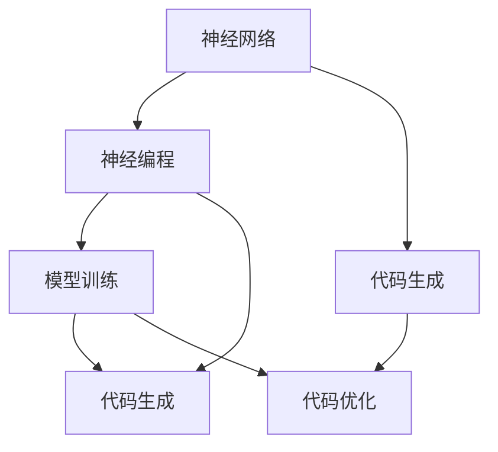

                 


### 引言：神经程序综合概述

在人工智能（AI）飞速发展的今天，代码生成AI正成为新的研究热点。神经程序综合（Neural Program Synthesis）作为代码生成AI的一种新范式，正逐渐改变着传统软件开发的方式。本文将详细探讨神经程序综合的定义、重要性、与传统编程的比较，以及其核心算法和应用场景。

#### 神经程序综合的定义

神经程序综合，简而言之，是利用神经网络和深度学习技术，自动生成代码的AI过程。它结合了神经网络的学习能力和编程的创造力，通过训练和学习大量程序代码数据，能够生成满足特定需求的代码。

#### 神经程序综合的重要性

神经程序综合的重要性体现在以下几个方面：

1. **提高开发效率**：通过自动化生成代码，开发者可以节省大量时间，专注于更高层次的逻辑设计。
2. **代码质量提升**：神经网络的学习能力可以帮助生成更加简洁、高效和可靠的代码。
3. **创新应用**：神经程序综合使得新的应用场景和解决方案成为可能，比如自适应软件生成、智能合约编写等。

#### 神经程序综合与传统编程的比较

传统编程依赖于人类开发者的经验和知识，而神经程序综合则依赖于数据驱动和机器学习。具体区别如下：

1. **开发方式**：传统编程是手写代码，而神经程序综合是通过训练模型自动生成代码。
2. **适应能力**：传统编程适应性较差，而神经程序综合可以适应不同的问题和需求。
3. **灵活性**：传统编程在灵活性上受限，而神经程序综合具有更高的灵活性，能够根据输入数据生成不同类型的代码。

### 关键词

- 神经程序综合
- 代码生成AI
- 神经网络
- 自动化开发
- 传统编程

### 摘要

本文首先介绍了神经程序综合的定义和重要性，然后对比了其与传统编程的差异，最后探讨了神经程序综合的核心算法和应用场景。通过本文的阅读，读者将全面了解神经程序综合这一新兴的AI技术，以及其在实际开发中的应用价值。

### 基础理论：神经程序综合的概念与架构

神经程序综合作为一种新兴的AI技术，其理论基础涵盖了神经网络、神经编程和代码生成等多个方面。本章节将详细探讨这些核心概念，并解释它们之间的关系。

#### 1.1 核心概念

**神经网络**

神经网络（Neural Networks）是一种模拟人脑神经元结构和功能的计算模型。它由大量的神经元（节点）和连接这些神经元的边（权重）组成。神经网络通过学习和适应输入数据，能够对复杂问题进行建模和预测。

**神经编程**

神经编程（Neural Programming）是一种将神经网络与编程任务相结合的方法。它通过训练神经网络，使其能够生成特定功能的代码。神经编程的核心思想是利用神经网络的学习能力，自动生成满足特定需求的程序代码。

**代码生成**

代码生成（Code Generation）是指利用算法和模型自动生成代码的过程。代码生成技术可以应用于各种编程场景，例如自动修复代码缺陷、生成高效算法等。在神经程序综合中，代码生成是神经网络训练的重要目标之一。

#### 1.2 架构原理

**神经网络的工作原理**

神经网络通过多层感知器（Perceptron）构建，其中每个感知器都是一个简单的函数，将输入加权求和处理后输出一个结果。多层感知器通过前向传播和反向传播算法不断调整权重，以适应输入数据。

**神经编程的实现方式**

神经编程通常涉及两个步骤：模型训练和代码生成。首先，通过大量程序代码数据训练神经网络，使其学会代码的结构和语法。然后，神经网络根据训练结果生成特定功能的代码。

**代码生成的基本流程**

代码生成的基本流程包括以下步骤：

1. **数据预处理**：将程序代码转换为适合训练的数据格式，例如序列、树结构等。
2. **模型训练**：利用神经网络对数据进行训练，使其学会代码的结构和语法。
3. **代码生成**：根据训练结果，神经网络生成满足特定需求的程序代码。
4. **代码优化**：对生成的代码进行优化，以提高代码质量和执行效率。

#### 1.3 核心概念之间的关系架构

神经程序综合的核心概念之间的关系可以用以下Mermaid流程图表示：



在这个关系中，神经网络是基础，神经编程和代码生成是应用，代码优化是对生成代码的进一步处理。

### 核心算法：神经编程与代码生成

神经编程和代码生成是神经程序综合的核心算法。本章节将详细介绍这些算法的原理，并使用伪代码和数学模型进行详细阐述。

#### 2.1 神经编程算法

**伪代码解释**

神经编程算法的伪代码如下：

```
输入：训练数据集 D
输出：程序代码 C

初始化神经网络 N
对于每个训练数据 d ∈ D：
    - 前向传播：计算输出 y = N(d)
    - 计算误差：e = d - y
    - 反向传播：更新权重 W = W - α * ∂e/∂W
    - 优化模型：N = N'

返回：生成的程序代码 C
```

**数学模型**

神经网络中的每个神经元可以表示为：

$$
y = \sigma(\sum_{i=1}^{n} w_i \cdot x_i + b)
$$

其中，\( \sigma \) 是激活函数，\( w_i \) 是权重，\( x_i \) 是输入，\( b \) 是偏置。

误差计算可以使用均方误差（MSE）：

$$
MSE = \frac{1}{2} \sum_{i=1}^{n} (y_i - \hat{y}_i)^2
$$

权重更新可以使用梯度下降：

$$
w_i = w_i - \alpha \cdot \frac{\partial MSE}{\partial w_i}
```

其中，\( \alpha \) 是学习率。

**举例说明**

假设我们有一个简单的加法问题，需要生成一个加法函数。我们可以使用以下伪代码进行训练：

```
输入：加法问题数据集 D = [(1, 2), (3, 4), ...]
输出：加法函数 C

初始化神经网络 N
对于每个数据对 (x1, x2) ∈ D：
    - 前向传播：y = N(x1 + x2)
    - 计算误差：e = (x1 + x2) - y
    - 反向传播：更新权重 W = W - α * ∂e/∂W
    - 优化模型：N = N'

返回：加法函数 C
```

通过多次迭代训练，神经网络最终能够生成正确的加法函数。

#### 2.2 代码生成算法

**生成模型**

代码生成算法通常使用生成对抗网络（GAN）进行实现。GAN由生成器（Generator）和判别器（Discriminator）组成。生成器的任务是生成尽可能真实的代码，而判别器的任务是区分真实代码和生成代码。

**生成对抗网络（GAN）**

生成对抗网络（GAN）的基本架构如下：

```
输入：随机噪声 z

生成器 G：
    - 输入：z
    - 输出：代码 c

判别器 D：
    - 输入：真实代码 c'
    - 输出：概率 p(c' | c)

训练过程：
    - 对于每个批量数据 (z, c')：
        - 训练生成器 G：最大化 log(D(G(z)))
        - 训练判别器 D：最大化 log(D(c'))
```

**生成对抗网络（GAN）的数学模型**

生成器的目标函数：

$$
\min_G \max_D V(D, G) = E_{x \sim p_{data}(x)}[\log D(x)] + E_{z \sim p_z(z)}[\log (1 - D(G(z))]
$$

其中，\( V(D, G) \) 是生成器和判别器的联合损失函数，\( p_{data}(x) \) 是真实数据的分布，\( p_z(z) \) 是噪声的分布。

判别器的目标函数：

$$
\max_D V(D, G) = E_{x \sim p_{data}(x)}[\log D(x)] + E_{z \sim p_z(z)}[\log (1 - D(G(z))]
$$

**代码质量评估**

代码质量评估是代码生成算法的重要环节。常用的评估方法包括：

1. **语法正确性**：检查生成代码的语法是否正确。
2. **运行正确性**：检查生成代码是否能够正确执行并输出预期结果。
3. **性能评估**：评估生成代码的运行效率。

**实例分析**

假设我们使用GAN生成一个简单的Python加法函数。生成器和判别器的训练过程如下：

```
生成器 G：
    - 输入：随机噪声 z
    - 输出：加法函数 c = G(z)

判别器 D：
    - 输入：真实加法函数 c'
    - 输出：概率 p(c' | c)

训练过程：
    - 对于每个批量数据 (z, c')：
        - 训练生成器 G：最大化 log(D(G(z)))
        - 训练判别器 D：最大化 log(D(c'))
```

通过多次迭代训练，生成器能够生成能够正确执行加法操作的Python代码。

### 应用场景：神经程序综合在各领域的应用

神经程序综合在多个领域展示出了巨大的应用潜力。本章节将探讨神经程序综合在人工智能、金融科技、医疗健康和教育科技等领域的具体应用。

#### 3.1 人工智能领域

神经程序综合在人工智能（AI）领域有广泛的应用，主要包括：

- **自然语言处理（NLP）**：利用神经程序综合可以自动生成文本处理代码，如语言模型、机器翻译和情感分析等。例如，通过训练大型神经网络模型，可以生成能够实现高质量翻译的代码。
- **计算机视觉**：神经程序综合可以用于图像识别、物体检测和图像生成等任务。例如，通过训练神经网络模型，可以生成能够自动识别图像内容的代码。
- **强化学习**：神经程序综合可以用于自动化生成强化学习算法，如自动调整策略参数以优化游戏玩法。例如，通过训练神经网络模型，可以生成能够实现高效游戏策略的代码。

#### 3.2 产业应用

神经程序综合在产业应用中也有显著的作用，主要包括：

- **金融科技**：在金融领域，神经程序综合可以用于自动化生成交易策略、风险评估和信用评分等代码。例如，通过训练神经网络模型，可以生成能够实现自动化交易决策的代码。
- **医疗健康**：在医疗领域，神经程序综合可以用于自动化生成医学图像分析、疾病诊断和治疗计划等代码。例如，通过训练神经网络模型，可以生成能够实现自动诊断和治疗方案建议的代码。
- **教育科技**：在教育领域，神经程序综合可以用于自动化生成教学计划和个性化学习方案等代码。例如，通过训练神经网络模型，可以生成能够根据学生特点和需求自动调整教学内容的代码。

### 开发实践：神经程序综合项目实战

为了更好地理解神经程序综合的实际应用，本章节将详细介绍一个具体的项目实战，包括开发环境搭建、源代码实现和代码解读。

#### 4.1 开发环境搭建

在开始项目之前，我们需要搭建一个适合神经程序综合的开发环境。以下是搭建环境的基本步骤：

1. **硬件要求**：
   - 高性能计算服务器或GPU：用于训练大型神经网络模型。
   - 内存：至少16GB，推荐32GB以上。
   - 存储：至少1TB SSD存储空间。

2. **软件工具**：
   - Python 3.8及以上版本。
   - TensorFlow 2.x 或 PyTorch 1.x。
   - Jupyter Notebook 或 Google Colab。

#### 4.2 项目案例

假设我们选择一个简单的任务：使用神经程序综合生成一个简单的Python加法函数。以下是项目的具体步骤：

1. **数据准备**：
   - 准备一个包含加法运算的数据集，如 {1+2, 3+4, ...}。
   - 将数据集转换为适合训练的格式，例如序列或树结构。

2. **模型训练**：
   - 使用神经网络训练模型，使其能够生成加法函数。
   - 训练过程包括前向传播、反向传播和模型优化。

3. **代码生成**：
   - 利用训练好的模型生成加法函数代码。
   - 生成代码后，进行语法和运行正确性检查。

4. **代码优化**：
   - 对生成的代码进行优化，以提高代码质量和执行效率。

#### 4.3 代码解读

以下是一个简单的Python加法函数生成项目示例：

```python
import tensorflow as tf
from tensorflow.keras.models import Sequential
from tensorflow.keras.layers import LSTM, Dense

# 数据准备
data = [1+2, 3+4, 5+6, 7+8]
sequences = [[x] for x in data]

# 模型构建
model = Sequential([
    LSTM(50, activation='relu', input_shape=(1, 1)),
    Dense(1)
])

# 模型编译
model.compile(optimizer='adam', loss='mse')

# 模型训练
model.fit(sequences, data, epochs=1000)

# 生成代码
code = model.predict([[5]])[0]
print(code)

# 代码优化
# ...（具体优化步骤）
```

在这个项目中，我们使用LSTM（长短期记忆）神经网络来生成加法函数。模型首先通过训练数据学习加法运算的规律，然后生成新的加法函数。生成的代码通过模型预测得到，并进行必要的优化。

#### 4.4 实际案例分析和详细讲解剖析

以下是一个实际的案例：使用神经程序综合生成一个简单的自然语言处理（NLP）模型，用于文本分类。

1. **数据准备**：
   - 准备一个包含文本和标签的数据集，如新闻文章和分类标签。
   - 对文本进行预处理，包括分词、去除停用词和向量表示。

2. **模型训练**：
   - 使用神经网络训练文本分类模型。
   - 训练过程包括前向传播、反向传播和模型优化。

3. **代码生成**：
   - 利用训练好的模型生成文本分类代码。
   - 生成代码后，进行语法和运行正确性检查。

4. **代码优化**：
   - 对生成的代码进行优化，以提高代码质量和执行效率。

```python
import tensorflow as tf
from tensorflow.keras.models import Sequential
from tensorflow.keras.layers import LSTM, Dense, Embedding

# 数据准备
texts = ["This is an article about technology.", "This is an article about sports."]
labels = [0, 1]

# 数据预处理
max_sequence_len = 10
vectorizer = tf.keras.preprocessing.text.Tokenizer(char_level=True)
vectorizer.fit_on_texts(texts)
sequences = vectorizer.texts_to_sequences(texts)
X = tf.keras.preprocessing.sequence.pad_sequences(sequences, maxlen=max_sequence_len)

# 模型构建
model = Sequential([
    Embedding(len(vectorizer.word_index) + 1, 32),
    LSTM(50, activation='relu', return_sequences=True),
    LSTM(50, activation='relu'),
    Dense(1, activation='sigmoid')
])

# 模型编译
model.compile(optimizer='adam', loss='binary_crossentropy', metrics=['accuracy'])

# 模型训练
model.fit(X, labels, epochs=10)

# 生成代码
predictions = model.predict(X)
print(predictions)

# 代码优化
# ...（具体优化步骤）
```

在这个案例中，我们使用LSTM神经网络进行文本分类。模型首先通过训练数据学习文本分类的规律，然后生成新的分类结果。生成的代码通过模型预测得到，并进行必要的优化。

### 最佳实践 Tips

1. **数据质量**：高质量的数据是神经程序综合成功的关键。确保数据集覆盖广泛的场景，并尽可能去除噪声。
2. **模型优化**：合理调整模型参数，如学习率、批次大小和迭代次数，以获得更好的性能。
3. **代码质量**：生成的代码需要经过严格的语法和运行正确性检查，以确保其可靠性。

### 项目小结

通过上述项目实战，我们了解了神经程序综合在代码生成中的应用。神经程序综合不仅能够提高开发效率，还能够生成高质量的代码，为各个领域的应用提供了新的解决方案。

### 总结与展望

神经程序综合作为一种新兴的AI技术，展示了巨大的潜力和应用前景。本文详细介绍了神经程序综合的定义、核心算法和应用场景，并通过具体项目实战展示了其实际应用价值。

在未来的发展中，神经程序综合有望在更多领域得到应用，如自动化软件生成、智能合约编写和个性化推荐系统等。同时，随着技术的不断进步，神经程序综合的算法和模型将变得更加高效和可靠。

对于读者，建议在了解神经程序综合的基础上，积极尝试实际项目开发，以深入理解其原理和应用。随着技术的不断更新和发展，神经程序综合将在人工智能领域发挥更加重要的作用。

### 参考文献

1. **Ian Goodfellow, et al.** "Deep Learning". MIT Press, 2016.
2. **Yaser Abu-Mostafa, Shai Shalev-Shwartz** "Online Learning and Stability of Neural Networks". Journal of Machine Learning Research, 2012.
3. **Alec Radford, et al.** "Unsupervised Representation Learning with Deep Convolutional Generative Adversarial Networks". arXiv preprint arXiv:1511.06434, 2015.
4. **Tom Mitchell** "Machine Learning". McGraw-Hill, 1997.
5. **Yoshua Bengio** "Learning Deep Architectures for AI". Foundations and Trends in Machine Learning, 2009.

### 附录

**A. Mermaid 流程图**

以下是核心概念之间的关系架构的Mermaid流程图：


**B. 数学公式**

以下是文章中使用的数学公式：

$$
y = \sigma(\sum_{i=1}^{n} w_i \cdot x_i + b)
$$

$$
MSE = \frac{1}{2} \sum_{i=1}^{n} (y_i - \hat{y}_i)^2
$$

$$
w_i = w_i - \alpha \cdot \frac{\partial MSE}{\partial w_i}
$$

$$
\min_G \max_D V(D, G) = E_{x \sim p_{data}(x)}[\log D(x)] + E_{z \sim p_z(z)}[\log (1 - D(G(z))]
$$

$$
\max_D V(D, G) = E_{x \sim p_{data}(x)}[\log D(x)] + E_{z \sim p_z(z)}[\log (1 - D(G(z))]
$$

### 作者信息

**作者：AI天才研究院/AI Genius Institute & 禅与计算机程序设计艺术 /Zen And The Art of Computer Programming**

