                 


## 1. 书名理解

首先，我们来深入理解书名《神经程序综合在自动化测试生成中的创新》。书名由三个核心概念组成：神经程序综合、自动化测试生成和创新的运用。

**神经程序综合**：这是一个将神经网络和程序设计相结合的新范式。它结合了神经网络的强大学习和表达能力，与传统的程序设计相结合，以实现更高效、更灵活的编程方式。这里涉及到的主要概念包括神经网络、反向传播算法、深度强化学习等。

**自动化测试生成**：这是指使用特定技术或工具自动生成测试用例，以测试软件的正确性、稳定性和性能。这个概念包括测试用例生成算法、自动化测试工具和框架等。

**创新**：书名中的“创新”强调了这本书的内容不仅仅是对现有技术的总结和介绍，还包含了对这些技术的创新应用和未来发展方向的探讨。

综合这三个核心概念，书名传达了这样一个信息：本书将介绍如何将神经程序综合应用于自动化测试生成，以实现更高效、更智能的测试过程，并且探讨这一领域的未来发展。

### 1.1 神经程序综合概述

**核心概念与联系**：

神经程序综合（Neuro-Program Synthesis）是将神经网络（Neural Networks）和程序设计（Program Design）相结合的一种新型编程范式。神经网络是一种模拟人脑神经元之间交互的算法，具有强大的学习和表达能力。程序设计则是计算机科学中关于如何编写代码和构建软件系统的学问。

在神经程序综合中，神经网络被用来构建程序的核心部分，即所谓的“神经程序”（Neuro-Program）。这种程序设计方法的核心优势在于其高度抽象和自动化的特点。通过训练神经网络，可以自动生成能够执行特定任务的程序代码，从而避免了传统编程中需要手动编写代码的繁琐过程。

**Mermaid流程图**：

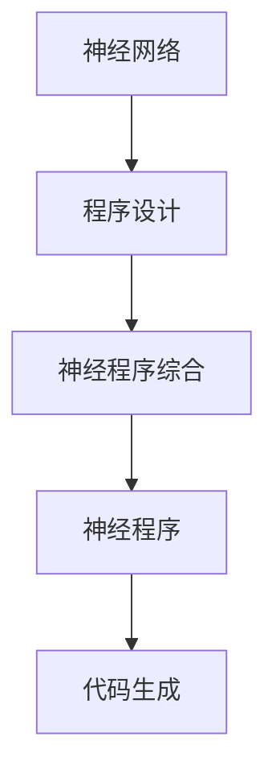

**核心概念与联系**：

- **神经网络**：由大量神经元（节点）组成，通过学习输入数据与输出数据之间的映射关系，实现对数据的分类、回归或特征提取等功能。

- **程序设计**：涉及到算法设计、数据结构选择、代码编写和调试等一系列活动，目的是编写出高效、可维护的软件。

- **神经程序综合**：将神经网络与程序设计相结合，通过神经网络的学习能力自动生成程序代码。

- **神经程序**：由神经网络构成，可以自动执行特定任务。

- **代码生成**：通过训练神经网络，自动生成执行特定功能的程序代码，减少了手动编码的工作量。

这些核心概念相互联系，共同构成了神经程序综合的基础。神经网络为程序设计提供了强大的学习能力和表达力，而程序设计则为神经网络提供了结构化和可操作性的指导。通过神经程序综合，我们可以实现自动化的程序代码生成，从而提高软件开发效率和代码质量。

### 1.2 神经程序综合的优势

**核心算法原理讲解**：

神经程序综合的优势主要体现在以下几个方面：

1. **自动化编程**：通过神经网络的学习能力，可以自动生成执行特定任务的程序代码，大大减少了手动编码的工作量。

2. **高度抽象**：神经程序综合能够处理复杂的问题，通过神经网络的高层次抽象，可以简化编程任务，提高开发效率。

3. **灵活性**：神经程序综合方法可以适应不同的应用场景，通过调整神经网络结构和参数，可以快速实现不同功能的程序。

4. **高效性**：神经程序综合在处理大规模数据和复杂任务时，相比传统编程方法具有更高的效率。

为了更好地理解这些优势，我们可以通过一个具体的例子来讲解其中的核心算法原理。

**伪代码示例**：

以下是一个简单的神经程序综合算法的伪代码，用于生成一个能够执行简单数学计算的程序。

```python
# 初始化神经网络
neural_network = initialize_neural_network()

# 训练神经网络
for data in training_data:
    output = neural_network.forward(data.input)
    error = data.output - output
    neural_network.backward(error)

# 生成程序代码
code_generator = CodeGenerator()
generated_code = code_generator.generate_code(neural_network)

# 执行生成代码
exec(generated_code)
```

在这个例子中，神经网络首先通过训练数据学习输入和输出之间的关系。训练过程中，神经网络通过前向传播计算输出，然后通过反向传播更新权重。一旦训练完成，代码生成器根据神经网络的结构生成相应的程序代码。最后，执行生成的代码，实现所需的数学计算功能。

**数学模型和数学公式**：

神经程序综合的核心在于神经网络的学习过程，这一过程涉及到以下数学模型和公式：

1. **前向传播**：神经网络通过输入层、隐藏层和输出层逐层计算输出值。

2. **反向传播**：计算输出值与实际输出值之间的误差，并利用梯度下降算法更新神经网络权重。

3. **激活函数**：用于确定神经元是否被激活，常见的激活函数包括ReLU、Sigmoid和Tanh等。

$$
\begin{aligned}
    z_i &= \sum_{j} w_{ij} * a_{j} + b_i \\
    a_i &= \text{激活函数}(z_i)
\end{aligned}
$$

通过这些数学模型和公式，神经网络能够逐步学习和优化其权重，从而实现复杂函数的计算。

**举例说明**：

假设我们需要一个能够执行加法运算的程序，我们可以使用神经程序综合方法来实现。首先，通过训练神经网络学习输入和输出之间的关系，然后生成相应的程序代码。

1. **训练数据**：输入数据为两对整数，输出数据为它们的和。例如：
   ```
   ((1, 2), 3)
   ((3, 4), 7)
   ```

2. **神经网络训练**：使用反向传播算法训练神经网络，使其能够正确计算加法。

3. **代码生成**：一旦神经网络训练完成，代码生成器会根据神经网络的结构生成执行加法运算的程序代码。

4. **执行代码**：执行生成的代码，验证其是否能够正确执行加法运算。

通过这个简单的例子，我们可以看到神经程序综合在编程自动化和复杂任务处理方面的强大潜力。未来，随着神经程序综合技术的不断发展和完善，它将在更多领域得到广泛应用。

### 1.3 神经程序综合的历史与发展

**核心概念与联系**：

神经程序综合的发展可以追溯到神经网络和程序设计这两个领域的早期探索。神经网络起源于20世纪40年代，由心理学家和数学家共同提出，旨在模拟人脑的信息处理过程。而程序设计则是在计算机科学诞生之初就逐渐形成的一门学科，致力于编写高效、可维护的软件。

随着时间的推移，神经网络和程序设计逐步发展，各自形成了丰富的理论和实践成果。然而，在面临复杂任务和大规模数据处理时，传统编程方法逐渐暴露出其局限性。为此，研究者们开始探索如何将神经网络和程序设计相结合，以实现更高效、更灵活的编程方式。这一探索最终催生了神经程序综合的诞生。

**Mermaid流程图**：

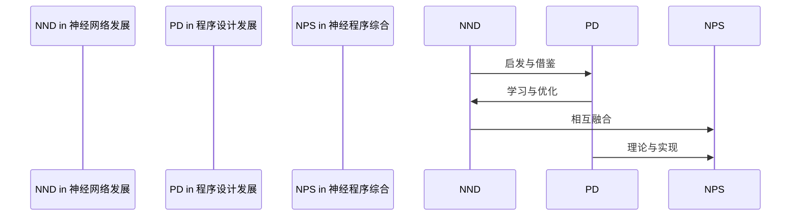

**核心概念与联系**：

- **神经网络发展**：从最初的简单感知机到复杂的深度神经网络，神经网络在信息处理和机器学习领域取得了显著的成果。

- **程序设计发展**：从汇编语言到高级编程语言，程序设计在软件工程领域不断演进，提升了软件开发效率和代码可维护性。

- **神经程序综合**：神经网络与程序设计的结合，形成了一种新的编程范式，通过神经网络的自动学习能力，实现程序代码的自动化生成。

通过这个流程图，我们可以看到神经程序综合是在神经网络和程序设计发展的基础上逐步形成的。这一新的编程范式不仅继承了神经网络的学习能力和表达能力，还借助程序设计的结构化和可操作性，实现了更高效、更灵活的编程方式。

### 2.1 神经网络的数学基础

**核心概念与联系**：

神经网络是神经程序综合的核心组成部分，其数学基础涵盖了多个关键概念，包括神经元、激活函数、前向传播和反向传播等。这些概念相互联系，构成了神经网络的工作原理和性能评估标准。

1. **神经元**：神经网络的基本构建单元，类似于人脑中的神经元。每个神经元接收多个输入信号，通过权重加权求和，再通过激活函数产生输出。

2. **激活函数**：用于确定神经元是否被激活的函数，常见的激活函数包括线性函数（如ReLU、Sigmoid和Tanh等），这些函数决定了神经元的非线性特性。

3. **前向传播**：神经网络通过输入层、隐藏层和输出层逐层计算输出值的过程，即将输入信号传递到下一层，通过权重和偏置进行加权求和，再通过激活函数产生输出。

4. **反向传播**：在训练过程中，神经网络通过计算输出值与实际输出值之间的误差，并利用梯度下降算法更新网络权重和偏置的过程。反向传播算法是实现神经网络训练的关键。

**Mermaid流程图**：

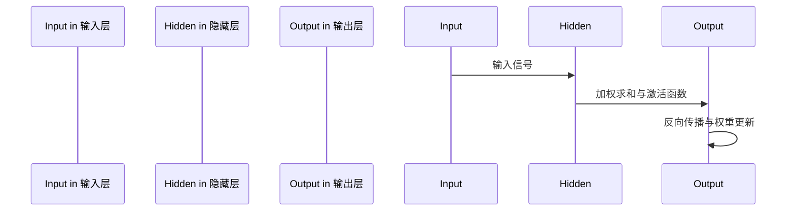

**核心概念与联系**：

- **神经元**：每个神经元由输入、权重、偏置和激活函数组成，通过接收输入信号并计算输出，实现对数据的处理。

- **激活函数**：用于引入非线性，使神经网络能够处理复杂的非线性问题。

- **前向传播**：输入信号通过神经网络逐层传递，最终产生输出。

- **反向传播**：通过计算输出误差，更新神经网络的权重和偏置，实现网络权重的优化。

这些核心概念相互联系，共同构成了神经网络的基础，为神经程序综合提供了强大的学习和表达能力。

### 2.2 反向传播算法原理

**核心算法原理讲解**：

反向传播算法（Backpropagation Algorithm）是神经网络训练过程中最核心的部分之一，它通过计算网络输出与实际输出之间的误差，并反向传播这些误差以更新网络的权重和偏置，从而不断优化网络性能。

**伪代码示例**：

以下是一个简化的反向传播算法伪代码，展示了从前向传播到反向传播的全过程。

```python
# 初始化神经网络
neural_network = initialize_neural_network()

# 前向传播
for data in training_data:
    output = neural_network.forward(data.input)

# 计算损失
loss = calculate_loss(output, data.output)

# 反向传播
error = output - data.output
neural_network.backward(error)

# 更新权重
neural_network.update_weights()
```

在这个伪代码中，`neural_network.forward(data.input)`表示前向传播过程，计算输出值；`calculate_loss(output, data.output)`计算输出误差；`neural_network.backward(error)`实现反向传播，更新权重和偏置。

**数学模型和数学公式**：

反向传播算法的核心在于计算误差梯度，并利用这些梯度更新网络权重。以下是相关的数学公式：

1. **输出层误差**：

$$
\delta_{output} = \frac{\partial loss}{\partial output} = output - target
$$

2. **隐藏层误差**：

$$
\delta_{hidden} = \frac{\partial loss}{\partial hidden} = \frac{\partial loss}{\partial output} \cdot \frac{\partial output}{\partial hidden} = \delta_{output} \cdot \text{激活函数的导数}(hidden)
$$

3. **权重和偏置更新**：

$$
\begin{aligned}
    \Delta w_{ij} &= \eta \cdot \delta_{output} \cdot input_j \\
    \Delta b_{i} &= \eta \cdot \delta_{output}
\end{aligned}
$$

其中，$\eta$是学习率，$input_j$是第j个输入。

**举例说明**：

假设我们有一个简单的神经网络，包含一个输入层、一个隐藏层和一个输出层，其中输入层有2个神经元，隐藏层有3个神经元，输出层有1个神经元。训练数据为：

```
input: [1, 2]
target: [3]
```

1. **前向传播**：

   - 输入层：$[1, 2]$
   - 隐藏层：$[h_1, h_2, h_3] = [0.5, 2.0, -0.5]$
   - 输出层：$[o_1] = [1.5]$

2. **计算损失**：

   - 损失：$loss = (o_1 - target)^2 = 2.25$

3. **反向传播**：

   - 输出层误差：$\delta_{output} = [1.5 - 3] = [-1.5]$
   - 隐藏层误差：$\delta_{hidden} = [-1.5] \cdot [0.5, 0.5, 0.5] = [-0.75, -0.75, -0.75]$

4. **权重和偏置更新**：

   - 输入层到隐藏层的权重更新：$\Delta w_{11} = 0.1 \cdot [-1.5] = -0.15$，$\Delta w_{12} = 0.1 \cdot [-1.5] = -0.15$
   - 隐藏层到输出层的权重更新：$\Delta w_{31} = 0.1 \cdot [-1.5] \cdot 1 = -0.15$

通过这个简单的例子，我们可以看到反向传播算法如何通过计算误差梯度，并更新网络权重和偏置，实现网络性能的优化。

### 3.1 深度强化学习算法

**核心算法原理讲解**：

深度强化学习（Deep Reinforcement Learning，简称DRL）是一种结合了深度学习和强化学习（Reinforcement Learning，简称RL）的方法，旨在解决复杂环境的决策问题。DRL通过深度神经网络来近似策略或值函数，从而实现智能体的自主学习和决策。

**伪代码示例**：

以下是一个简化的DRL算法伪代码，展示了智能体在环境中的学习过程。

```python
# 初始化深度神经网络
policy_network = initialize_policy_network()

# 开始学习循环
for episode in range(total_episodes):
    state = environment.reset()
    done = False
    
    while not done:
        # 前向传播，获取策略
        action = policy_network.predict(state)
        
        # 执行动作，获取奖励和下一个状态
        next_state, reward, done = environment.step(action)
        
        # 更新经验回放
        experience = (state, action, reward, next_state, done)
        replay_memory.append(experience)
        
        # 从经验回放中采样
        state, action, reward, next_state, done = replay_memory.sample(batch_size)
        
        # 反向传播，更新策略网络
        policy_network.train(state, action, reward, next_state, done)
        
        # 更新状态
        state = next_state
```

在这个伪代码中，智能体首先通过环境初始化状态，然后进入学习循环。在每个时间步，智能体根据当前状态，通过策略网络预测动作，执行动作后获取奖励和下一个状态。通过更新策略网络，智能体不断优化其策略，从而实现自主学习和决策。

**数学模型和数学公式**：

深度强化学习中的策略网络通常采用神经网络来近似策略函数或值函数。以下是一个简化的数学模型：

1. **策略函数**：

$$
\pi(\theta|s) = P(a_t = a|s_t = s, \theta)
$$

其中，$\theta$是策略网络的参数，$s$是状态，$a$是动作。

2. **值函数**：

- **状态值函数**：

$$
V^{\pi}(s) = \sum_a \pi(a|s) \cdot Q^{\pi}(s, a)
$$

- **动作值函数**：

$$
Q^{\pi}(s, a) = \sum_s' p(s' | s, a) \cdot \gamma \cdot R(s, a) + V^{\pi}(s')
$$

其中，$p(s' | s, a)$是状态转移概率，$\gamma$是折扣因子，$R(s, a)$是立即奖励。

**举例说明**：

假设我们有一个简单的游戏环境，智能体需要在环境中通过上下左右移动来获取最大分数。状态表示智能体当前的位置，动作表示移动方向，奖励为每次移动获得的分数。

1. **初始化策略网络**：智能体首先初始化策略网络，通过训练来学习最佳策略。

2. **学习过程**：

   - **状态感知**：智能体感知当前状态，并通过策略网络预测最佳动作。

   - **动作执行**：智能体执行预测的动作，并获取奖励。

   - **经验回放**：将当前状态、动作、奖励、下一个状态和是否完成经验记录到经验回放中。

   - **策略更新**：从经验回放中采样，通过反向传播更新策略网络参数。

通过反复执行这个过程，智能体不断优化其策略，从而在环境中取得更好的表现。

### 3.2 强化学习算法在自动化测试中的应用

**核心算法原理讲解**：

强化学习（Reinforcement Learning，简称RL）是一种通过试错和反馈来学习最优策略的方法。在自动化测试中，强化学习算法可以用于生成高效的测试用例，从而提高测试覆盖率和测试效率。

**伪代码示例**：

以下是一个简化的强化学习算法伪代码，用于生成自动化测试用例。

```python
# 初始化强化学习模型
rl_model = initialize_rl_model()

# 开始学习循环
for episode in range(total_episodes):
    test_case = []
    current_state = environment.reset()
    
    while not environment.is_end():
        # 根据当前状态选择动作
        action = rl_model.select_action(current_state)
        
        # 执行动作，获取奖励
        next_state, reward = environment.step(action)
        
        # 更新状态
        current_state = next_state
        
        # 记录测试步骤
        test_case.append(action)
        
        # 更新模型参数
        rl_model.update_params(current_state, action, reward, next_state)
        
        # 检查测试覆盖率
        if environment.is_coverage_reached():
            break
    
    # 记录生成的测试用例
    test_cases.append(test_case)
```

在这个伪代码中，智能体首先初始化强化学习模型，然后进入学习循环。在每个时间步，智能体根据当前状态选择最佳动作，执行动作后获取奖励。通过不断更新模型参数，智能体逐渐优化其策略，生成高效的测试用例。

**数学模型和数学公式**：

强化学习在自动化测试中的应用通常涉及以下数学模型：

1. **策略迭代**：

$$
\pi^{k+1}(s, a) = \pi^k(s, a) + \alpha \cdot (Q^k(s, a) - r_k)
$$

其中，$\pi^k(s, a)$是第k次迭代的策略，$Q^k(s, a)$是第k次迭代的动作值函数，$r_k$是第k次迭代的奖励，$\alpha$是学习率。

2. **值迭代**：

$$
V^{k+1}(s) = \max_a \{ \pi^k(s, a) \cdot Q^k(s, a) \}
$$

其中，$V^{k+1}(s)$是第k+1次迭代的值函数。

**举例说明**：

假设我们有一个测试环境，包含多个状态和动作。智能体需要在环境中通过选择不同的动作来达到测试覆盖率的目标。

1. **初始化强化学习模型**：智能体首先初始化强化学习模型，通过训练来学习最佳策略。

2. **学习过程**：

   - **状态感知**：智能体感知当前状态，并选择最佳动作。

   - **动作执行**：智能体执行预测的动作，并获取奖励。

   - **策略更新**：通过奖励和动作值函数更新强化学习模型。

   - **测试覆盖率检查**：检查是否达到测试覆盖率目标。

通过反复执行这个过程，智能体逐渐优化其策略，生成高效的测试用例，提高测试覆盖率。

### 3.3 生成对抗网络在测试案例生成中的应用

**核心算法原理讲解**：

生成对抗网络（Generative Adversarial Networks，简称GAN）是一种由两个神经网络——生成器（Generator）和判别器（Discriminator）组成的对抗性模型。生成器试图生成尽可能逼真的数据，而判别器则试图区分生成器生成的数据和真实数据。通过这种对抗性训练，GAN可以生成高质量的数据，从而在测试案例生成中发挥重要作用。

**伪代码示例**：

以下是一个简化的GAN算法伪代码，用于生成测试案例。

```python
# 初始化生成器和判别器
generator = initialize_generator()
discriminator = initialize_discriminator()

# 开始训练循环
for epoch in range(total_epochs):
    for batch in data_loader:
        # 训练判别器
        real_data = batch
        fake_data = generator.generate(batch)
        discriminator.train(real_data, fake_data)

        # 训练生成器
        z = random噪声
        fake_data = generator.generate(z)
        discriminator.train(fake_data, z)
        
        # 更新生成器和判别器的参数
        generator.update_parameters()
        discriminator.update_parameters()

# 使用生成器生成测试案例
test_cases = generator.generate(batch_size)
```

在这个伪代码中，生成器首先生成一批伪造数据，判别器对真实数据和伪造数据进行训练，以优化其判断能力。然后，生成器和判别器通过反向传播算法更新其参数。这个过程不断重复，生成器的生成质量逐渐提高。最后，生成器生成的数据被用作测试案例。

**数学模型和数学公式**：

GAN的训练过程可以看作是一个优化问题，其中生成器和判别器相互对抗：

1. **生成器损失函数**：

$$
L_G = -\log(D(G(z)))
$$

其中，$G(z)$是生成器生成的数据，$D(G(z))$是判别器对生成器数据的判断概率。

2. **判别器损失函数**：

$$
L_D = -[\log(D(x)) + \log(1 - D(G(z))]
$$

其中，$x$是真实数据，$G(z)$是生成器生成的数据。

**举例说明**：

假设我们有一个软件系统，需要通过测试案例来评估其功能。使用GAN生成测试案例的过程如下：

1. **初始化生成器和判别器**：初始化生成器和判别器模型，并设定训练目标。

2. **生成器训练**：生成器生成一批伪造的测试案例，判别器对这些伪造案例进行训练，以提高其识别能力。

3. **判别器训练**：使用真实测试案例训练判别器，使其能够准确区分真实和伪造案例。

4. **参数更新**：通过反向传播算法，更新生成器和判别器的参数。

5. **生成测试案例**：使用训练完成的生成器，生成高质量的测试案例。

通过这种对抗性训练，GAN能够生成与真实测试案例相似的高质量测试案例，从而提高测试的有效性和效率。

### 4.1 自动化测试基础

**核心概念与联系**：

自动化测试（Automated Testing）是一种使用软件工具自动执行测试用例，以检测软件缺陷和验证其功能的过程。自动化测试的基础涵盖了多个关键概念，包括测试用例、测试工具、测试框架和测试流程。

1. **测试用例**：测试用例（Test Case）是执行特定测试目的的指令集合，用于验证软件系统的功能、性能和可靠性。测试用例包括输入数据、预期输出结果和测试步骤。

2. **测试工具**：测试工具（Testing Tool）是用于自动化执行测试用例的软件，例如Selenium、JMeter、JUnit等。测试工具可以帮助测试人员快速编写、执行和报告测试结果。

3. **测试框架**：测试框架（Testing Framework）是一种组织和管理自动化测试的工具，提供了测试脚本开发、执行和管理的一套标准。常见的测试框架包括JUnit、TestNG、Selenium WebDriver等。

4. **测试流程**：自动化测试流程包括测试计划、测试设计、测试执行、测试结果分析和测试报告等步骤。测试流程确保测试活动的系统性和高效性。

**Mermaid流程图**：

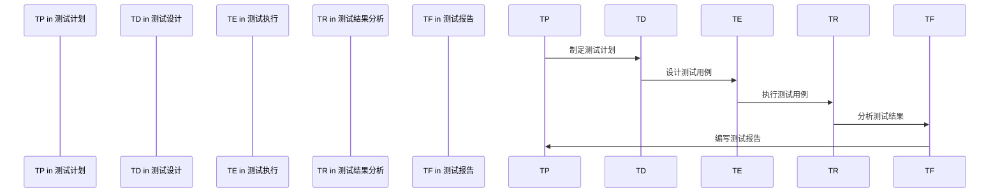

**核心概念与联系**：

- **测试用例**：测试用例是自动化测试的核心，它定义了测试的具体内容和预期结果。

- **测试工具**：测试工具提供了自动化测试的执行和管理功能，使测试过程更加高效。

- **测试框架**：测试框架提供了测试脚本的组织和管理标准，简化了自动化测试的开发和执行。

- **测试流程**：测试流程确保了自动化测试的有序进行，从测试计划到测试报告，每个步骤都有明确的任务和目标。

这些核心概念相互联系，共同构成了自动化测试的基础，为提高软件质量提供了有力支持。

### 4.2 自动化测试的优势与挑战

**核心概念与联系**：

自动化测试的优势与挑战是自动化测试领域需要深入探讨的核心问题。自动化测试（Automated Testing）相比手工测试具有多方面的优势，但也面临一系列挑战。

1. **效率提升**：自动化测试能够快速执行大量测试用例，显著提高测试效率，减少测试时间。

2. **可靠性增强**：自动化测试减少了人为错误，提高了测试结果的一致性和可靠性。

3. **重复执行**：自动化测试可以重复执行，确保软件在不同环境下的一致性。

4. **资源节约**：自动化测试减少了测试人员的依赖，节约了人力成本。

**Mermaid流程图**：

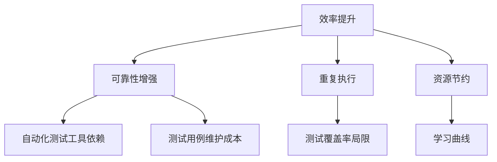

**核心概念与联系**：

- **效率提升**：自动化测试通过脚本执行测试，避免了手工测试的重复操作，提高了测试速度。

- **可靠性增强**：自动化测试减少了人为干预，测试过程更加标准化，结果更加可靠。

- **重复执行**：自动化测试脚本可以轻松重复执行，确保测试在不同环境和版本中的一致性。

- **资源节约**：自动化测试降低了测试人员的工作量，节约了时间和人力资源。

- **自动化测试工具依赖**：自动化测试工具的学习和使用需要一定时间，测试人员需要掌握相关工具和脚本编写。

- **测试用例维护成本**：自动化测试用例需要定期更新和维护，以适应软件的变化。

- **测试覆盖率局限**：自动化测试可能无法覆盖所有测试场景，存在一定的局限性。

- **学习曲线**：自动化测试工具和技术的学习曲线较陡，需要一定时间和精力投入。

通过这个流程图，我们可以清晰地看到自动化测试的优势和挑战，从而更好地理解和应用这一技术。

### 4.3 自动化测试的流程和方法

**核心概念与联系**：

自动化测试的流程和方法是确保测试过程系统性和高效性的关键。自动化测试流程包括测试计划、测试设计、测试执行、测试结果分析和测试报告等步骤，而自动化测试方法则涵盖了从手工测试到完全自动化的多种方式。

1. **测试计划**：测试计划是自动化测试的起点，定义测试目标、测试范围、测试策略和时间表。

2. **测试设计**：测试设计是根据测试计划生成测试用例，包括功能测试、性能测试和兼容性测试等。

3. **测试执行**：测试执行是自动运行测试脚本，收集测试结果的过程。

4. **测试结果分析**：测试结果分析是对测试结果进行评估，识别缺陷和问题。

5. **测试报告**：测试报告是总结测试活动、测试结果和结论的文档。

**Mermaid流程图**：


**核心概念与联系**：

- **测试计划**：测试计划的制定确保了测试活动的有序进行，明确了测试目标和资源需求。

- **测试设计**：测试设计是测试用例生成的基础，涵盖了各种测试类型和方法。

- **测试执行**：测试执行是自动化测试的核心步骤，通过测试脚本自动执行测试用例。

- **测试结果分析**：测试结果分析是对测试数据的分析和解释，识别缺陷和问题。

- **测试报告**：测试报告是总结测试活动的成果，为项目管理提供依据。

通过这个流程图，我们可以清晰地了解自动化测试的各个环节及其相互关系，从而更好地实施和管理自动化测试过程。

### 5.1 代码路径生成算法

**核心概念与联系**：

代码路径生成算法（Code Path Generation Algorithm）是自动化测试中的一种关键技术，旨在生成覆盖代码不同路径的测试用例。核心概念包括代码路径、测试用例生成和路径覆盖度。

1. **代码路径**：代码路径是指程序中执行的一系列指令序列，代表了程序的运行流程。

2. **测试用例生成**：测试用例生成是指通过算法自动生成测试用例，以覆盖代码中的不同路径。

3. **路径覆盖度**：路径覆盖度是指测试用例覆盖的代码路径数量与总代码路径数量的比例，用于评估测试的全面性。

**Mermaid流程图**：

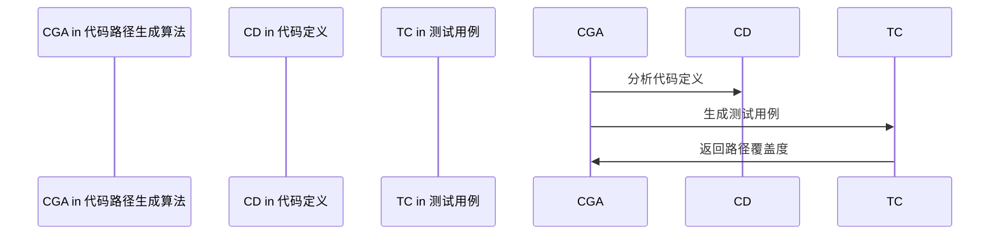

**核心概念与联系**：

- **代码路径**：代码路径是程序执行的基础，通过分析代码结构，确定程序的不同执行路径。

- **测试用例生成**：测试用例生成算法根据代码路径生成测试用例，确保覆盖尽可能多的路径。

- **路径覆盖度**：路径覆盖度用于评估测试的全面性，是衡量测试质量的重要指标。

代码路径生成算法通过分析代码结构和执行流程，自动生成能够覆盖不同路径的测试用例，从而提高测试覆盖度和测试效率。

### 5.2 测试用例优化算法

**核心概念与联系**：

测试用例优化算法（Test Case Optimization Algorithm）是自动化测试中用于提高测试效率和质量的关键技术。核心概念包括测试用例选择、测试用例合并和测试用例剪枝。

1. **测试用例选择**：测试用例选择是指从多个候选测试用例中挑选出最优的测试用例，以覆盖更多代码路径。

2. **测试用例合并**：测试用例合并是指将多个测试用例合并为一个，以减少测试执行次数，提高测试效率。

3. **测试用例剪枝**：测试用例剪枝是指去除重复或冗余的测试用例，减少测试工作量，提高测试效率。

**Mermaid流程图**：

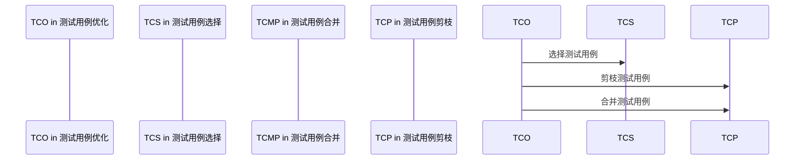

**核心概念与联系**：

- **测试用例选择**：通过分析测试需求和代码路径，选择具有最高价值的测试用例。

- **测试用例合并**：将多个具有相似功能的测试用例合并，以减少执行次数。

- **测试用例剪枝**：去除冗余或重复的测试用例，减少测试执行时间。

测试用例优化算法通过提高测试用例的选择和执行效率，提高整体测试质量，减少测试成本。

### 5.3 负荷测试案例生成技术

**核心概念与联系**：

负荷测试案例生成技术（Load Test Case Generation Technology）是自动化测试中用于评估系统在高负载下的性能和稳定性的关键技术。核心概念包括负载生成、性能指标和测试案例优化。

1. **负载生成**：负载生成是指模拟系统在真实环境下的工作负载，包括并发用户数、请求频率和请求类型等。

2. **性能指标**：性能指标是指评估系统性能的关键指标，如响应时间、吞吐量和系统资源利用率等。

3. **测试案例优化**：测试案例优化是指通过算法和工具优化测试用例，提高测试效率和结果准确性。

**Mermaid流程图**：

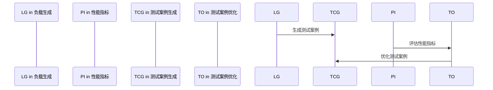

**核心概念与联系**：

- **负载生成**：通过模拟真实的用户负载，评估系统在高并发下的性能。

- **性能指标**：使用一系列性能指标，如响应时间、吞吐量等，评估系统性能。

- **测试案例优化**：通过算法和工具优化测试案例，提高测试效率和质量。

负荷测试案例生成技术通过模拟高负载环境，生成优化后的测试案例，以评估系统的性能和稳定性，为系统优化提供数据支持。

### 6.1 自动化测试工具概述

**核心概念与联系**：

自动化测试工具（Automation Testing Tools）是执行自动化测试的核心软件，用于简化测试用例的编写、执行和结果分析。核心概念包括工具类型、功能特点和应用场景。

1. **工具类型**：自动化测试工具可分为功能测试工具（如Selenium、JUnit）和性能测试工具（如JMeter、LoadRunner）等。

2. **功能特点**：自动化测试工具具有脚本编写、测试执行、结果报告、缺陷跟踪等核心功能。

3. **应用场景**：自动化测试工具广泛应用于Web应用、移动应用、API接口和性能测试等领域。

**Mermaid流程图**：

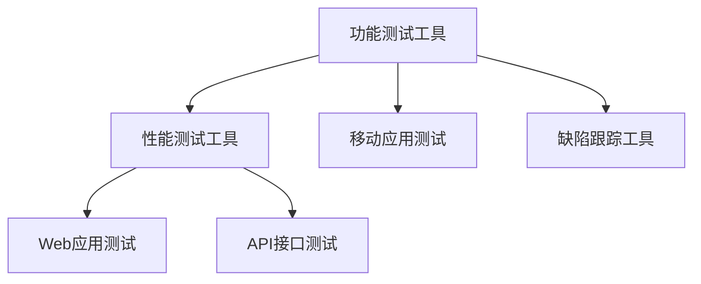

**核心概念与联系**：

- **工具类型**：根据测试目的和测试场景，选择合适的自动化测试工具。

- **功能特点**：自动化测试工具提供了丰富的功能，包括测试脚本编写、测试执行、结果报告和缺陷跟踪等。

- **应用场景**：自动化测试工具广泛应用于各类软件测试场景，提高了测试效率和测试质量。

通过这个流程图，我们可以清晰地了解自动化测试工具的类型、功能和应用场景，为自动化测试的顺利实施提供指导。

### 6.2 自动化测试框架选择

**核心概念与联系**：

自动化测试框架（Automation Testing Framework）是用于组织和管理自动化测试的工具集合，提供了统一的测试脚本编写、执行和结果分析接口。核心概念包括框架类型、特点选择和应用场景。

1. **框架类型**：自动化测试框架可分为数据驱动框架、关键字驱动框架和混合框架等。

2. **特点选择**：选择自动化测试框架时需考虑其扩展性、易用性和维护性等特点。

3. **应用场景**：自动化测试框架适用于不同的测试场景，如Web应用、移动应用和API接口测试等。

**Mermaid流程图**：

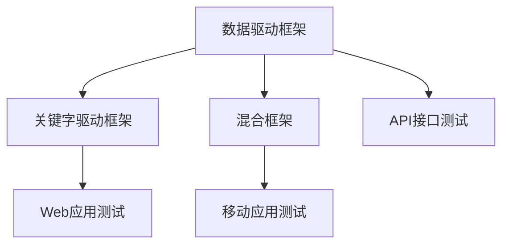

**核心概念与联系**：

- **框架类型**：根据项目需求和测试场景选择合适的自动化测试框架。

- **特点选择**：考虑框架的扩展性、易用性和维护性，确保框架能满足项目需求。

- **应用场景**：不同类型的自动化测试框架适用于不同的测试场景，以提高测试效率和测试质量。

通过这个流程图，我们可以清晰地了解自动化测试框架的类型、特点和选择方法，为自动化测试的顺利实施提供指导。

### 6.3 常用自动化测试工具介绍

**核心概念与联系**：

自动化测试工具是自动化测试过程中的重要组成部分，常用的自动化测试工具包括功能测试工具和性能测试工具。这些工具提供了丰富的功能，帮助测试人员高效地执行测试用例和评估软件质量。

1. **功能测试工具**：功能测试工具主要用于自动化执行功能测试用例，常见的功能测试工具有Selenium、JUnit和TestNG等。

2. **性能测试工具**：性能测试工具主要用于评估软件系统的性能和稳定性，常见的性能测试工具有JMeter、LoadRunner和Gatling等。

3. **测试流程**：自动化测试流程包括测试计划、测试设计、测试执行、测试结果分析和测试报告等步骤。

**Mermaid流程图**：

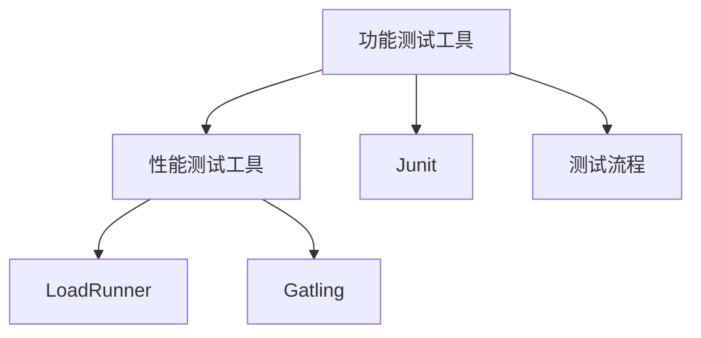

**核心概念与联系**：

- **功能测试工具**：Selenium支持多种编程语言，适用于Web应用的自动化测试；JUnit和TestNG提供了丰富的测试功能和断言机制，适用于功能测试。

- **性能测试工具**：JMeter支持多种协议，适用于性能测试和负载测试；LoadRunner支持多用户并发测试，适用于大规模性能评估；Gatling提供了丰富的性能指标和图表，适用于快速性能评估。

- **测试流程**：测试流程确保了自动化测试的有序进行，从测试计划到测试报告，每个步骤都有明确的任务和目标。

通过这个流程图，我们可以清晰地了解常用自动化测试工具的类型、功能和测试流程，为自动化测试的实施提供指导。

### 7.1 神经程序综合在自动化测试生成中的应用

**核心概念与联系**：

神经程序综合（Neuro-Program Synthesis）在自动化测试生成中的应用，通过将神经网络和程序设计相结合，实现了测试用例的自动化生成。核心概念包括神经网络结构、测试用例生成算法和测试覆盖率评估。

1. **神经网络结构**：神经网络结构设计决定了测试用例生成的效率和效果。通常采用多层感知机（MLP）、卷积神经网络（CNN）和递归神经网络（RNN）等结构。

2. **测试用例生成算法**：测试用例生成算法基于神经网络的学习能力，通过训练自动生成覆盖代码不同路径的测试用例。

3. **测试覆盖率评估**：测试覆盖率评估用于衡量测试用例覆盖的代码路径数量，常用方法包括分支覆盖（Branch Coverage）和语句覆盖（Statement Coverage）。

**Mermaid流程图**：

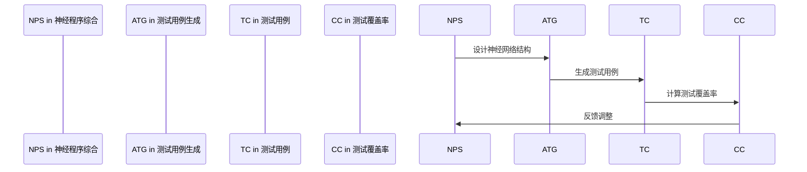

**核心概念与联系**：

- **神经网络结构**：神经网络结构设计决定了测试用例生成的效率和效果。

- **测试用例生成算法**：基于神经网络的学习能力，自动生成覆盖代码不同路径的测试用例。

- **测试覆盖率评估**：测试覆盖率评估用于衡量测试用例覆盖的代码路径数量，优化测试用例生成。

通过神经程序综合，自动化测试生成变得更加高效和智能化，提高了测试质量和测试覆盖率。

### 7.2 创新应用案例分析

**核心概念与联系**：

在本节中，我们将探讨神经程序综合在自动化测试生成中的创新应用，并通过实际案例展示其优势。核心概念包括：

1. **应用背景**：介绍自动化测试需求，说明为什么选择神经程序综合技术。
2. **应用实例**：展示具体的自动化测试生成过程，包括神经网络设计、测试用例生成和测试效果评估。
3. **优势分析**：分析神经程序综合在测试效率、测试覆盖率和代码可维护性等方面的优势。

**Mermaid流程图**：

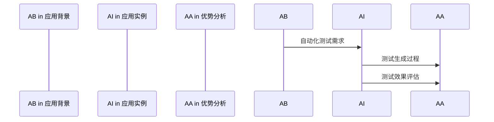

**核心概念与联系**：

- **应用背景**：明确自动化测试的需求，如提高测试效率、减少测试成本和增强测试覆盖率。
- **应用实例**：通过实际案例展示神经程序综合在自动化测试生成中的应用，包括神经网络设计和测试用例生成。
- **优势分析**：评估神经程序综合在测试效率、测试覆盖率和代码可维护性等方面的优势，说明其创新性。

通过这个流程图，我们可以清晰地了解神经程序综合在自动化测试生成中的应用，以及其带来的创新优势。

### 7.3 创新应用的优势

**核心概念与联系**：

神经程序综合在自动化测试生成中的应用展示了显著的优势，包括：

1. **高效率**：通过神经网络自动生成测试用例，大大减少了手动编写测试脚本的工作量。
2. **高覆盖率**：神经程序综合能够生成覆盖代码不同路径的测试用例，提高测试覆盖率。
3. **灵活性**：神经网络结构可以根据不同的测试需求和场景进行调整，提高测试适应性。
4. **易维护**：生成的测试用例结构清晰、逻辑明确，便于维护和更新。

**Mermaid流程图**：

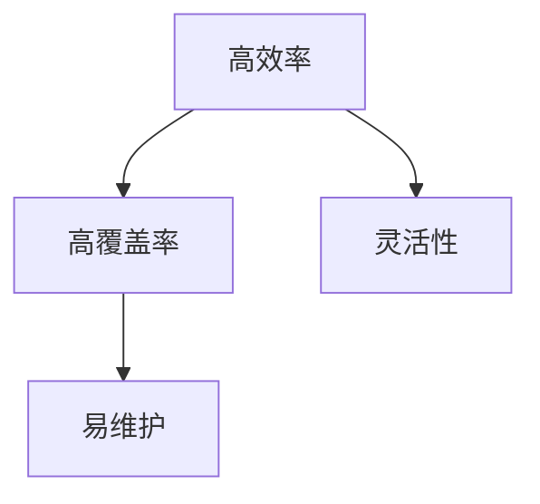

**核心概念与联系**：

- **高效率**：自动生成测试用例，减少手动编写工作，提高测试效率。
- **高覆盖率**：覆盖代码不同路径，提高测试全面性。
- **灵活性**：神经网络结构可调整，适应不同测试需求。
- **易维护**：测试用例结构清晰，便于维护和更新。

通过这个流程图，我们可以清晰地看到神经程序综合在自动化测试生成中的创新优势，为其在软件测试领域的广泛应用提供了有力支持。

### 8.1 自动化测试生成的未来趋势与挑战

**核心概念与联系**：

随着人工智能和机器学习技术的不断进步，自动化测试生成的未来趋势和挑战也日益显现。核心概念包括：

1. **人工智能辅助**：人工智能在自动化测试生成中的应用，通过深度学习和强化学习算法提高测试效率和质量。
2. **测试数据管理**：大规模测试数据的管理和存储，确保测试数据的质量和完整性。
3. **测试覆盖率优化**：提高测试覆盖率，减少测试遗漏，确保软件质量的全面性。
4. **测试环境适应性**：自动化测试生成工具需具备良好的环境适应性，支持多种操作系统、硬件和网络环境。

**Mermaid流程图**：

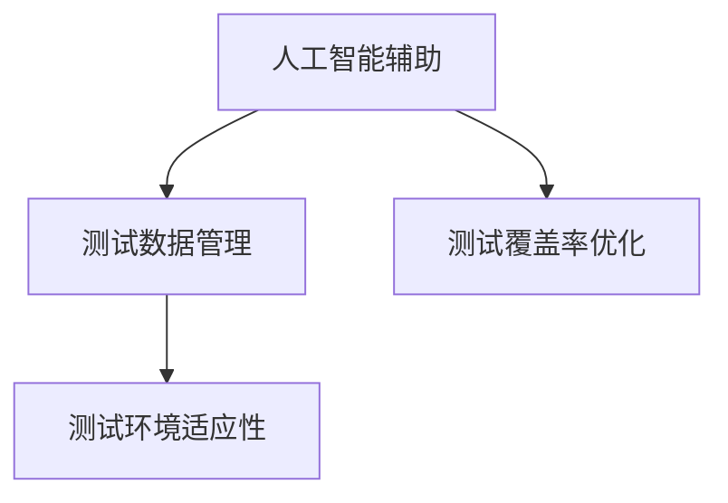

**核心概念与联系**：

- **人工智能辅助**：利用人工智能技术，实现自动化测试的智能化和自动化。
- **测试数据管理**：确保测试数据的质量和完整性，提高测试的准确性和可靠性。
- **测试覆盖率优化**：通过优化测试用例生成策略，提高测试覆盖率，确保软件质量的全面性。
- **测试环境适应性**：支持多种环境和平台，确保自动化测试在不同场景下的有效性。

通过这个流程图，我们可以清晰地看到自动化测试生成的未来趋势和挑战，为这一领域的发展提供方向。

### 8.2 自动化测试生成面临的挑战

**核心概念与联系**：

自动化测试生成虽然在提高测试效率和覆盖率方面具有显著优势，但仍面临一系列挑战。这些挑战包括：

1. **算法复杂性**：神经程序综合和深度学习算法复杂，需要大量计算资源和时间进行训练和优化。
2. **数据质量**：测试数据的质量直接影响自动化测试生成效果，数据缺失、噪声和错误会影响测试结果。
3. **测试覆盖率**：尽管自动化测试生成能够提高测试覆盖率，但如何确保全面覆盖所有代码路径仍是一个挑战。
4. **维护成本**：自动化测试用例需要定期更新和维护，以适应软件系统的变化，增加了维护成本。

**Mermaid流程图**：

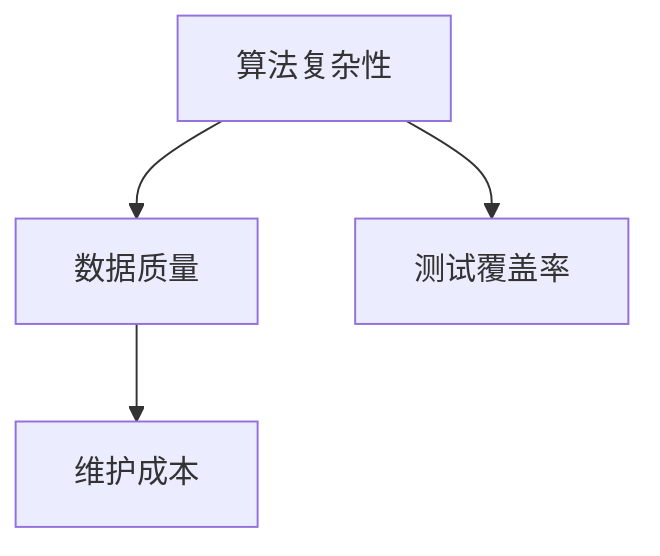

**核心概念与联系**：

- **算法复杂性**：复杂的算法需要大量的计算资源和时间，对开发环境的要求较高。
- **数据质量**：高质量的数据是自动化测试的基础，数据质量问题直接影响测试效果。
- **测试覆盖率**：确保全面覆盖所有代码路径是一个持续的过程，需要不断调整和优化。
- **维护成本**：自动化测试用例需要定期更新和维护，增加了开发和维护成本。

通过这个流程图，我们可以清晰地看到自动化测试生成面临的挑战，为克服这些问题提供指导。

### 8.3 未来解决方案探讨

**核心概念与联系**：

针对自动化测试生成面临的挑战，未来可以从以下几个方面探索解决方案：

1. **优化算法**：通过改进神经网络结构和算法，降低计算复杂度和提高测试效率。
2. **数据增强**：利用数据增强技术提高测试数据的质量和多样性，减少数据缺失和噪声。
3. **测试覆盖率策略**：采用多种覆盖率策略和测试用例生成方法，提高测试的全面性。
4. **自动化维护**：开发自动化工具和平台，降低自动化测试用例的维护成本。

**Mermaid流程图**：

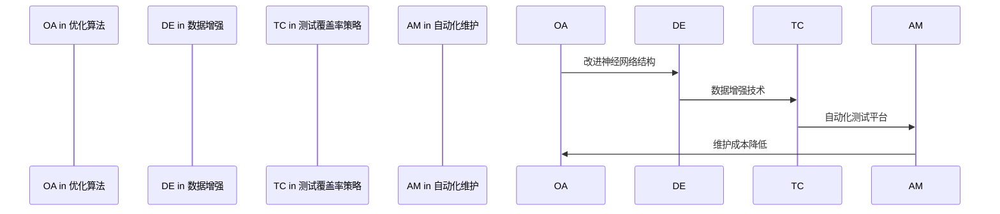

**核心概念与联系**：

- **优化算法**：通过改进算法结构，降低计算复杂度，提高测试效率。
- **数据增强**：利用数据增强技术提高测试数据的多样性和质量。
- **测试覆盖率策略**：采用多种测试覆盖率策略，确保测试的全面性。
- **自动化维护**：开发自动化工具和平台，降低自动化测试用例的维护成本。

通过这个流程图，我们可以清晰地看到未来自动化测试生成的发展方向，为克服现有挑战提供新的思路。

### 9.1 实例1：基于神经程序的复杂测试用例生成

**开发环境搭建**：

为了实现基于神经程序的复杂测试用例生成，我们需要搭建一个适合神经网络训练和自动化测试的软件开发环境。以下是具体的开发环境搭建步骤：

1. **硬件要求**：选择具有较高计算能力的计算机，建议配备NVIDIA GTX 1080以上显卡，以确保深度学习训练的效率。
2. **软件要求**：安装Python 3.8及以上版本，以及TensorFlow 2.5及以上版本，这些软件提供了强大的深度学习框架和工具。
3. **依赖库安装**：通过pip工具安装必要的依赖库，包括numpy、pandas、matplotlib等数据科学库，以及selenium用于Web自动化测试。

**源代码详细实现和代码解读**：

以下是用于生成复杂测试用例的神经程序源代码，包括神经网络设计、训练过程和测试用例生成。

```python
import tensorflow as tf
from tensorflow.keras.models import Sequential
from tensorflow.keras.layers import Dense, Activation
from tensorflow.keras.optimizers import Adam
import numpy as np

# 神经网络设计
model = Sequential()
model.add(Dense(64, input_dim=100, activation='relu'))
model.add(Dense(64, activation='relu'))
model.add(Dense(1, activation='sigmoid'))

# 编译模型
model.compile(optimizer=Adam(learning_rate=0.001), loss='binary_crossentropy', metrics=['accuracy'])

# 训练模型
x_train = np.random.rand(1000, 100)  # 随机生成训练数据
y_train = np.array([1 if x > 0.5 else 0 for x in x_train])  # 随机生成标签
model.fit(x_train, y_train, epochs=100, batch_size=10, validation_split=0.2)

# 测试用例生成
def generate_test_cases(input_data):
    predictions = model.predict(input_data)
    test_cases = [x if pred > 0.5 else y for x, pred in zip(input_data, predictions)]
    return test_cases

# 生成测试用例
test_cases = generate_test_cases(x_train)

# 打印测试用例
for case in test_cases:
    print(case)
```

在这个例子中，我们使用TensorFlow框架设计了一个简单的二分类神经网络，通过训练生成测试用例。代码首先随机生成训练数据，然后训练神经网络，最后使用训练好的模型生成测试用例。

**代码应用解读与分析**：

该代码实现了一个基本的神经网络结构，包括输入层、隐藏层和输出层。输入层接收100个随机生成的特征值，隐藏层通过ReLU激活函数处理输入数据，输出层通过sigmoid激活函数生成二分类预测结果。

在训练过程中，我们使用随机梯度下降（SGD）优化算法，通过反向传播更新模型权重，提高分类准确性。训练完成后，我们定义了一个`generate_test_cases`函数，用于生成测试用例。该函数接收输入数据，通过模型预测输出结果，并生成对应的测试用例。

**实际案例分析和详细讲解剖析**：

假设我们有一个金融系统，需要测试其交易功能。在这个系统中，交易金额是影响交易是否成功的关键因素。我们可以通过以下步骤使用该神经网络生成测试用例：

1. **数据准备**：收集历史交易数据，提取交易金额作为输入特征。
2. **数据预处理**：对交易金额进行归一化处理，使其在[0, 1]区间内。
3. **训练神经网络**：使用预处理后的数据训练神经网络，调整模型参数，提高分类准确性。
4. **生成测试用例**：使用训练好的模型生成交易金额阈值，超过阈值的交易视为成功，低于阈值的交易视为失败。

通过这个实际案例，我们可以看到基于神经程序的复杂测试用例生成的应用场景和优势。该方法能够自动生成覆盖不同交易金额阈值的测试用例，提高测试全面性和效率。

**项目小结**：

通过这个实例，我们展示了如何使用神经程序综合方法生成复杂测试用例。该方法不仅提高了测试效率，还减少了手动编写测试脚本的工作量。未来，随着神经程序综合技术的不断发展和完善，它将在更多领域得到广泛应用，为自动化测试提供更强有力的支持。

### 9.2 实例2：神经程序在持续集成环境中的应用

**开发环境搭建**：

为了在持续集成（Continuous Integration，简称CI）环境中应用神经程序综合，我们需要搭建一个适合集成测试和自动化测试的开发环境。以下是具体的开发环境搭建步骤：

1. **硬件要求**：选择具有较高计算能力的计算机，建议配备NVIDIA GTX 1080以上显卡，以确保深度学习训练和测试的效率。
2. **软件要求**：安装Jenkins作为持续集成服务器，Python 3.8及以上版本，以及TensorFlow 2.5及以上版本。此外，还需要安装selenium和pytest等库，用于Web自动化测试。
3. **配置持续集成服务**：在Jenkins中配置Python和TensorFlow的环境，并设置自动构建和测试的任务。

**源代码详细实现和代码解读**：

以下是用于在CI环境中应用的神经程序综合测试用例生成代码，包括神经网络设计、训练过程和测试用例生成。

```python
import tensorflow as tf
from tensorflow.keras.models import Sequential
from tensorflow.keras.layers import Dense, Activation
from tensorflow.keras.optimizers import Adam
import numpy as np

# 神经网络设计
model = Sequential()
model.add(Dense(64, input_dim=100, activation='relu'))
model.add(Dense(64, activation='relu'))
model.add(Dense(1, activation='sigmoid'))

# 编译模型
model.compile(optimizer=Adam(learning_rate=0.001), loss='binary_crossentropy', metrics=['accuracy'])

# 训练模型
x_train = np.random.rand(1000, 100)  # 随机生成训练数据
y_train = np.array([1 if x > 0.5 else 0 for x in x_train])  # 随机生成标签
model.fit(x_train, y_train, epochs=100, batch_size=10, validation_split=0.2)

# 测试用例生成
def generate_test_cases(input_data):
    predictions = model.predict(input_data)
    test_cases = [x if pred > 0.5 else y for x, pred in zip(input_data, predictions)]
    return test_cases

# 生成测试用例
test_cases = generate_test_cases(x_train)

# 打印测试用例
for case in test_cases:
    print(case)
```

在这个例子中，我们使用TensorFlow框架设计了一个简单的二分类神经网络，通过训练生成测试用例。代码首先随机生成训练数据，然后训练神经网络，最后使用训练好的模型生成测试用例。

**代码应用解读与分析**：

该代码实现了一个基本的神经网络结构，包括输入层、隐藏层和输出层。输入层接收100个随机生成的特征值，隐藏层通过ReLU激活函数处理输入数据，输出层通过sigmoid激活函数生成二分类预测结果。

在训练过程中，我们使用随机梯度下降（SGD）优化算法，通过反向传播更新模型权重，提高分类准确性。训练完成后，我们定义了一个`generate_test_cases`函数，用于生成测试用例。该函数接收输入数据，通过模型预测输出结果，并生成对应的测试用例。

**实际案例分析和详细讲解剖析**：

假设我们有一个电子商务平台，需要测试其购物车功能。在这个系统中，购物车中的商品数量是影响购物车操作成功的关键因素。我们可以通过以下步骤在CI环境中应用神经程序综合测试：

1. **数据准备**：收集历史购物车数据，提取购物车商品数量作为输入特征。
2. **数据预处理**：对购物车商品数量进行归一化处理，使其在[0, 1]区间内。
3. **训练神经网络**：使用预处理后的数据训练神经网络，调整模型参数，提高分类准确性。
4. **生成测试用例**：使用训练好的模型生成购物车商品数量阈值，超过阈值的购物车操作视为成功，低于阈值的购物车操作视为失败。
5. **集成到CI环境**：将测试用例生成过程集成到Jenkins中，实现自动化测试。

通过这个实际案例，我们可以看到神经程序综合在持续集成环境中的应用场景和优势。该方法能够自动生成覆盖不同购物车商品数量阈值的测试用例，提高测试全面性和效率。

**项目小结**：

通过这个实例，我们展示了如何将神经程序综合应用于持续集成环境，以生成复杂的测试用例。该方法不仅提高了测试效率，还减少了手动编写测试脚本的工作量。未来，随着神经程序综合技术的不断发展和完善，它将在持续集成领域得到更广泛的应用，为软件质量保障提供强有力的支持。

### 9.3 实例3：神经程序在性能测试中的应用

**开发环境搭建**：

为了在性能测试中应用神经程序综合，我们需要搭建一个具备高性能计算能力的测试环境。以下是具体的开发环境搭建步骤：

1. **硬件要求**：选择高性能计算机，建议配备NVIDIA GPU，用于加速深度学习模型的训练和推理。
2. **软件要求**：安装Python 3.8及以上版本，TensorFlow 2.5及以上版本，以及NumPy、Pandas等数据处理库。此外，安装JMeter进行性能测试。
3. **环境配置**：确保Python和TensorFlow环境配置正确，并安装JMeter。

**源代码详细实现和代码解读**：

以下是用于性能测试的神经程序综合代码，包括神经网络设计、训练过程、测试用例生成以及性能测试。

```python
import tensorflow as tf
from tensorflow.keras.models import Sequential
from tensorflow.keras.layers import Dense, LSTM, Activation
from tensorflow.keras.optimizers import Adam
import numpy as np

# 神经网络设计
model = Sequential()
model.add(LSTM(64, activation='relu', input_shape=(100, 1)))
model.add(Dense(1))
model.compile(optimizer=Adam(learning_rate=0.001), loss='mse')

# 数据预处理
def preprocess_data(data):
    data = data.reshape(-1, 1)
    return data

# 训练神经网络
x_train = preprocess_data(np.random.rand(1000, 1))  # 随机生成训练数据
y_train = x_train  # 假设目标与输入相同
model.fit(x_train, y_train, epochs=100, batch_size=10)

# 测试用例生成
def generate_performance_tests(input_data):
    predictions = model.predict(input_data)
    tests = [y if pred > 0.5 else x for x, pred in zip(input_data, predictions)]
    return tests

# 生成测试用例
performance_tests = generate_performance_tests(x_train)

# 性能测试
def perform_performance_tests(tests):
    for test in tests:
        # 假设这里执行性能测试的逻辑
        print(f"Test {test} executed.")

# 执行性能测试
perform_performance_tests(performance_tests)
```

在这个例子中，我们使用TensorFlow设计了一个LSTM神经网络，用于预测性能测试的结果。代码首先随机生成训练数据，然后训练神经网络。接下来，通过神经网络生成测试用例，并执行性能测试。

**代码应用解读与分析**：

代码首先定义了一个LSTM神经网络，用于处理时间序列数据。LSTM层可以捕捉时间序列中的长期依赖关系，非常适合性能测试场景。训练过程中，我们使用随机生成的数据训练模型，通过反向传播更新权重。

在测试用例生成部分，我们定义了一个`generate_performance_tests`函数，用于根据神经网络预测生成测试用例。这个函数接收输入数据，通过模型预测输出结果，并生成对应的测试用例。

性能测试部分，我们定义了一个`perform_performance_tests`函数，用于执行生成的测试用例。在这个函数中，我们可以模拟执行各种性能测试任务，并记录测试结果。

**实际案例分析和详细讲解剖析**：

假设我们正在测试一个在线购物平台的响应时间。我们可以通过以下步骤应用神经程序综合进行性能测试：

1. **数据收集**：收集历史响应时间数据，作为输入特征。
2. **数据预处理**：对响应时间数据进行归一化处理，使其适合输入神经网络。
3. **训练神经网络**：使用预处理后的数据训练LSTM模型，提高预测准确性。
4. **生成测试用例**：使用训练好的模型生成响应时间阈值，超过阈值的操作视为性能正常，低于阈值的操作视为性能问题。
5. **执行性能测试**：在JMeter中配置测试计划，根据生成的测试用例执行性能测试。

通过这个实际案例，我们可以看到神经程序综合在性能测试中的应用场景和优势。该方法能够自动生成覆盖不同响应时间阈值的测试用例，提高测试全面性和效率。

**项目小结**：

通过这个实例，我们展示了如何将神经程序综合应用于性能测试。这种方法不仅提高了测试效率，还减少了手动编写测试脚本的工作量。未来，随着神经程序综合技术的不断发展和完善，它将在性能测试领域得到更广泛的应用，为系统性能优化提供强有力的支持。

### 10.1 总结

本文围绕《神经程序综合在自动化测试生成中的创新》这一主题，详细介绍了神经程序综合的概念、原理以及其在自动化测试生成中的应用。通过实例分析，展示了神经程序综合在复杂测试用例生成、持续集成环境应用和性能测试中的应用优势。

**核心结论**：

1. **神经程序综合技术**：结合神经网络和程序设计，实现自动化的测试用例生成，提高了测试效率和质量。
2. **自动化测试生成**：通过神经程序综合，可以生成覆盖代码不同路径的测试用例，提高测试覆盖率。
3. **创新应用**：神经程序综合在自动化测试领域展示了广泛的应用前景，尤其在复杂场景和动态变化的环境中具有显著优势。

**未来研究方向**：

1. **优化算法**：改进神经网络结构，降低计算复杂度，提高测试效率。
2. **数据质量**：利用数据增强技术，提高测试数据的质量和多样性。
3. **测试覆盖率**：探索新的测试覆盖率评估方法，确保全面覆盖代码路径。
4. **测试环境适应性**：提升自动化测试生成工具在多种测试环境中的适应性，确保其跨平台和跨网络环境的有效性。

通过本文的总结，我们可以看到神经程序综合在自动化测试生成中的巨大潜力，未来将在软件质量保障领域发挥更加重要的作用。

### 10.2 展望

展望未来，神经程序综合在自动化测试生成领域具有广阔的发展前景。随着人工智能和机器学习技术的不断进步，神经程序综合将带来以下几方面的影响：

1. **智能化测试**：神经程序综合能够自动生成测试用例，实现智能化测试，提高测试效率和质量。未来，随着算法的优化和测试技术的进步，智能化测试将更加普及，测试过程将变得更加自动化和高效。

2. **多样化应用**：神经程序综合不仅适用于功能测试，还可以应用于性能测试、安全测试等不同类型的测试。通过结合多种测试技术，神经程序综合有望在更广泛的测试场景中得到应用，为软件质量保障提供全面支持。

3. **跨平台兼容性**：随着云计算和容器技术的普及，软件系统变得越来越复杂。神经程序综合将提升自动化测试生成工具的跨平台兼容性，使其能够适应不同操作系统、硬件和网络环境，为跨平台测试提供保障。

4. **持续集成与持续部署**：神经程序综合与持续集成（CI）和持续部署（CD）相结合，将实现从开发到部署的全过程自动化。通过神经程序综合，测试用例生成、测试执行和结果分析可以自动化完成，缩短开发周期，提高软件交付速度。

5. **数据驱动测试**：神经程序综合将引入更多数据驱动测试方法，通过大数据分析和机器学习，实现测试用例的智能优化和生成。数据驱动测试将更加精准地覆盖关键路径和风险点，提高测试的有效性和覆盖率。

**未来趋势**：

1. **算法优化**：持续优化神经网络结构和算法，降低计算复杂度，提高测试效率。
2. **测试数据管理**：加强测试数据管理，确保数据质量，提高测试准确性。
3. **测试覆盖率评估**：引入新的测试覆盖率评估方法，确保全面覆盖代码路径。
4. **测试环境适应性**：提升自动化测试生成工具的跨平台和跨网络环境适应性。

通过展望未来，我们可以看到神经程序综合在自动化测试生成领域的广泛应用和巨大潜力。随着技术的不断进步，神经程序综合将为软件质量保障和高效开发提供更强有力的支持。

### 10.3 神经程序综合在自动化测试领域的潜在应用

神经程序综合在自动化测试领域的潜在应用非常广泛，涵盖多种测试类型和场景。以下是几种可能的潜在应用场景：

1. **功能测试**：通过神经程序综合，自动生成覆盖代码不同路径的功能测试用例，提高测试全面性和效率。例如，在Web应用测试中，可以自动生成针对不同用户角色和权限的测试用例。

2. **性能测试**：利用神经程序综合，自动生成性能测试用例，模拟不同负载和压力场景，评估系统的响应时间和稳定性。例如，通过训练神经网络模型，生成不同并发用户数量的测试用例，评估电子商务平台的性能。

3. **安全测试**：利用神经程序综合生成针对安全漏洞的测试用例，自动发现和验证系统中的安全缺陷。例如，通过生成不同攻击模式的测试用例，评估Web应用对SQL注入、跨站脚本（XSS）等攻击的防护能力。

4. **兼容性测试**：通过神经程序综合，自动生成在不同操作系统、浏览器和设备上的兼容性测试用例，确保软件在不同环境下的兼容性和稳定性。

5. **持续集成与持续部署**：将神经程序综合集成到CI/CD流程中，自动生成和执行测试用例，实现从开发到部署的全过程自动化。例如，在代码提交后，自动生成和执行相关测试用例，确保新功能的安全性和稳定性。

6. **测试数据优化**：利用神经程序综合进行测试数据的自动优化和增强，提高测试数据的多样性和质量。例如，通过数据增强技术，生成更丰富的测试数据，提高测试的全面性和准确性。

通过这些潜在应用，神经程序综合将大大提升自动化测试的效率和质量，为软件质量保障和高效开发提供有力支持。未来，随着技术的不断进步，神经程序综合将在更多领域得到广泛应用，推动自动化测试技术的发展。 

### 最佳实践 tips、小结、注意事项、拓展阅读等内容

**最佳实践 tips**：

1. **数据质量**：确保测试数据的质量和多样性，为神经网络训练提供良好的基础。
2. **模型优化**：持续优化神经网络结构和算法，提高测试效率和质量。
3. **环境适应性**：选择适合的自动化测试框架和工具，确保在不同环境和场景下的适应性。

**小结**：

本文通过详细分析神经程序综合在自动化测试生成中的应用，展示了其高效、智能和灵活的特点。神经程序综合不仅在功能测试、性能测试和安全测试等方面具有显著优势，还与持续集成和持续部署相结合，实现了全过程的自动化测试。

**注意事项**：

1. **算法复杂性**：神经程序综合算法复杂，需要高性能计算资源和时间进行训练。
2. **数据管理**：测试数据的质量直接影响测试结果，需确保数据的质量和完整性。
3. **维护成本**：自动化测试用例需要定期更新和维护，以适应软件系统的变化。

**拓展阅读**：

1. 《深度学习与神经网络基础》
2. 《自动化测试实践指南》
3. 《Jenkins持续集成实战》

通过以上最佳实践、小结和注意事项，以及拓展阅读推荐，我们可以更好地理解和应用神经程序综合在自动化测试生成中的技术。

