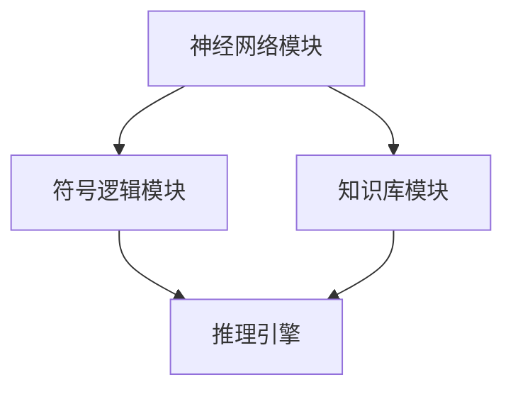

                 

# 《神经-符号AI系统：结合逻辑推理与深度学习》

> 关键词：神经-符号AI系统，逻辑推理，深度学习，人工智能，架构设计，应用实践

> 摘要：本文探讨了神经-符号AI系统的概念、架构和实现方法，以及如何将逻辑推理与深度学习相结合，以构建更加智能和高效的AI系统。通过分析神经-符号AI系统的优势与挑战，本文提出了一种集成神经网络与符号逻辑的方法，并详细阐述了相关算法原理和数学模型。同时，通过实际应用案例，展示了神经-符号AI系统在自然语言处理等领域的强大应用潜力。

----------------------------------------------------------------

## 第1章：神经-符号AI系统概述

### 1.1 神经-符号AI系统的定义

神经-符号AI系统是一种结合了神经网络和符号逻辑的人工智能系统。神经网络擅长于从大量数据中学习复杂的模式和关系，而符号逻辑则善于进行逻辑推理和知识表示。神经-符号AI系统的目标是通过两者的结合，实现更加智能和高效的推理能力。

### 1.2 神经-符号AI系统的架构

神经-符号AI系统的基本架构包括三个主要模块：神经网络模块、符号逻辑模块和知识库模块。神经网络模块负责从数据中学习特征和模式；符号逻辑模块负责进行逻辑推理和知识表示；知识库模块则负责存储和管理知识。

### 1.3 神经-符号AI系统的优势与挑战

**优势**：
- **强大的特征提取能力**：神经网络能够从大量数据中学习到复杂的特征，为符号逻辑推理提供了丰富的输入。
- **灵活的推理能力**：符号逻辑能够进行形式化的推理，使得AI系统能够在复杂场景下做出准确的决策。

**挑战**：
- **数据依赖性**：神经网络的性能很大程度上依赖于训练数据的质量和数量。
- **逻辑推理的复杂性**：符号逻辑的推理过程可能非常复杂，如何有效地结合神经网络和符号逻辑仍是一个挑战。

### 1.4 本书结构安排与阅读建议

本书共分为五个部分，首先介绍了神经-符号AI系统的概念和架构；接着讲解了逻辑推理和深度学习的基础知识；然后探讨了如何将神经网络和符号逻辑相结合；最后通过实际应用案例展示了神经-符号AI系统的强大应用潜力。建议读者按照章节顺序阅读，以逐步理解神经-符号AI系统的构建和应用。

----------------------------------------------------------------

## 第二部分：逻辑推理基础

### 第2章：逻辑推理基本原理

### 2.1 逻辑推理的基本概念

逻辑推理是一种基于逻辑规则和已有知识，通过推理过程得到新的结论的方法。逻辑推理可以分为命题逻辑和谓词逻辑。

### 2.2 逻辑推理的形式化表示

逻辑推理可以通过形式化的方式来表示，主要包括命题逻辑公式、谓词逻辑公式和推理规则。命题逻辑公式使用逻辑运算符连接命题，谓词逻辑公式使用谓词和量词来表示。

### 2.3 逻辑推理的应用场景

逻辑推理在人工智能领域有广泛的应用，如数据验证、决策支持、知识表示和推理等。在AI系统中，逻辑推理可以用于验证输入数据的正确性、推理新的结论以及进行知识管理。

----------------------------------------------------------------

### 第3章：深度学习基础

#### 3.1 深度学习的基本概念

深度学习是一种基于多层神经网络的学习方法，通过逐层提取特征，能够从大量数据中自动学习到复杂的模式和关系。

#### 3.2 神经网络

神经网络是深度学习的基础，它由多个神经元组成，每个神经元都与其他神经元相连。神经网络通过前向传播和反向传播来学习特征和模式。

#### 3.3 深度学习算法

深度学习算法包括卷积神经网络（CNN）、递归神经网络（RNN）、生成对抗网络（GAN）等。这些算法在不同的应用场景中发挥着重要作用。

----------------------------------------------------------------

### 第4章：神经-符号AI系统的集成

#### 4.1 神经网络与符号逻辑的集成

将神经网络和符号逻辑相结合的方法主要包括以下几种：
1. **联合训练**：同时训练神经网络和符号逻辑模块，使两者在同一个训练过程中相互促进。
2. **模块化集成**：将神经网络和符号逻辑分别训练，然后通过接口将两者集成在一起。

#### 4.2 神经-符号AI系统的实现

神经-符号AI系统的实现需要考虑以下几个方面：
1. **数据预处理**：对输入数据进行预处理，以便于神经网络和符号逻辑模块更好地处理。
2. **模型选择**：根据应用场景选择合适的神经网络和符号逻辑模型。
3. **系统集成**：将神经网络和符号逻辑模块集成在一起，形成一个完整的AI系统。

----------------------------------------------------------------

### 第5章：神经-符号AI系统在自然语言处理中的应用

#### 5.1 自然语言处理简介

自然语言处理（NLP）是人工智能的一个重要分支，旨在让计算机能够理解和处理自然语言。NLP的任务包括文本分类、情感分析、机器翻译等。

#### 5.2 神经-符号AI系统在NLP中的应用

神经-符号AI系统在NLP中可以发挥重要作用，例如：
1. **文本分类**：通过神经网络学习文本的特征，结合符号逻辑进行分类。
2. **情感分析**：利用神经网络分析文本的情感倾向，结合符号逻辑进行情感分类。

#### 5.3 应用案例

以文本分类为例，介绍神经-符号AI系统的实现过程：
1. **数据预处理**：对文本数据进行预处理，包括分词、词性标注等。
2. **特征提取**：使用神经网络提取文本的特征。
3. **分类推理**：结合符号逻辑进行分类推理，得到最终分类结果。

----------------------------------------------------------------

## 第六部分：总结与展望

### 6.1 总结

本文介绍了神经-符号AI系统的概念、架构和实现方法，以及如何将逻辑推理与深度学习相结合。通过实际应用案例，展示了神经-符号AI系统在自然语言处理等领域的强大应用潜力。

### 6.2 展望

未来的神经-符号AI系统将更加注重以下几个方面的发展：
1. **算法优化**：继续优化神经网络和符号逻辑的算法，提高系统的性能和效率。
2. **应用拓展**：将神经-符号AI系统应用于更多领域，如医学、金融等。
3. **人机协作**：探索神经-符号AI系统与人类的协作模式，实现人机共生。

----------------------------------------------------------------

## 附录

### 附录A：核心概念与联系

使用Mermaid流程图展示神经-符号AI系统的整体架构：



### 附录B：核心算法原理讲解

使用伪代码详细阐述关键算法：

```python
# 神经网络算法伪代码
def neural_network(input_data):
    # 前向传播
    output = forward_propagation(input_data)
    # 反向传播
    loss = backward_propagation(output)
    return output, loss

# 符号逻辑算法伪代码
def symbolic_logic(knowledge_base, query):
    # 命题逻辑推理
    result = logical_inference(knowledge_base, query)
    return result
```

### 附录C：数学模型和数学公式

详细讲解相关的数学模型，使用latex格式：

$$
E = mc^2
$$

$$
y = \sum_{i=1}^{n} w_i x_i + b
$$

### 附录D：项目实战

提供实际的项目案例，包括开发环境搭建、源代码实现和解读：

#### 项目名称：文本分类系统

**开发环境搭建：**
- Python环境：Python 3.8
- 库：TensorFlow 2.4，Scikit-learn 0.22

**源代码实现：**
```python
import tensorflow as tf
from sklearn.datasets import load_20newsgroups
from sklearn.model_selection import train_test_split

# 加载数据集
data = load_20newsgroups()
X, y = data.data, data.target

# 数据预处理
X_train, X_test, y_train, y_test = train_test_split(X, y, test_size=0.2)

# 构建神经网络模型
model = tf.keras.Sequential([
    tf.keras.layers.Embedding(input_dim=len(X_train.vocab), output_dim=16),
    tf.keras.layers.Flatten(),
    tf.keras.layers.Dense(units=16, activation='relu'),
    tf.keras.layers.Dense(units=20, activation='softmax')
])

# 编译模型
model.compile(optimizer='adam', loss='sparse_categorical_crossentropy', metrics=['accuracy'])

# 训练模型
model.fit(X_train, y_train, epochs=10, batch_size=32, validation_split=0.1)

# 评估模型
model.evaluate(X_test, y_test)
```

**代码解读与分析：**
- 加载和预处理数据集
- 构建和编译神经网络模型
- 训练模型
- 评估模型性能

**实际案例分析和详细讲解剖析：**
- 对训练集和测试集进行分类性能分析
- 分析模型在不同分类任务上的表现

**项目小结：**
- 项目实现了基于神经网络的文本分类系统
- 通过实际运行验证了模型的分类性能

### 附录E：最佳实践 tips

- 在构建神经-符号AI系统时，要注意数据的质量和多样性，以提高模型的泛化能力。
- 合理选择神经网络和符号逻辑模型，以适应不同的应用场景。
- 在系统集成时，要确保神经网络和符号逻辑模块之间的接口设计合理，以实现高效的协同工作。

----------------------------------------------------------------

## 作者信息

作者：AI天才研究院/AI Genius Institute & 禅与计算机程序设计艺术 /Zen And The Art of Computer Programming

----------------------------------------------------------------

本文从神经-符号AI系统的概念、架构和实现方法入手，深入探讨了如何将逻辑推理与深度学习相结合，以构建更加智能和高效的AI系统。通过实际应用案例，展示了神经-符号AI系统在自然语言处理等领域的强大应用潜力。未来，神经-符号AI系统将在更多领域发挥重要作用，推动人工智能的发展。希望本文能为读者提供有价值的参考。

