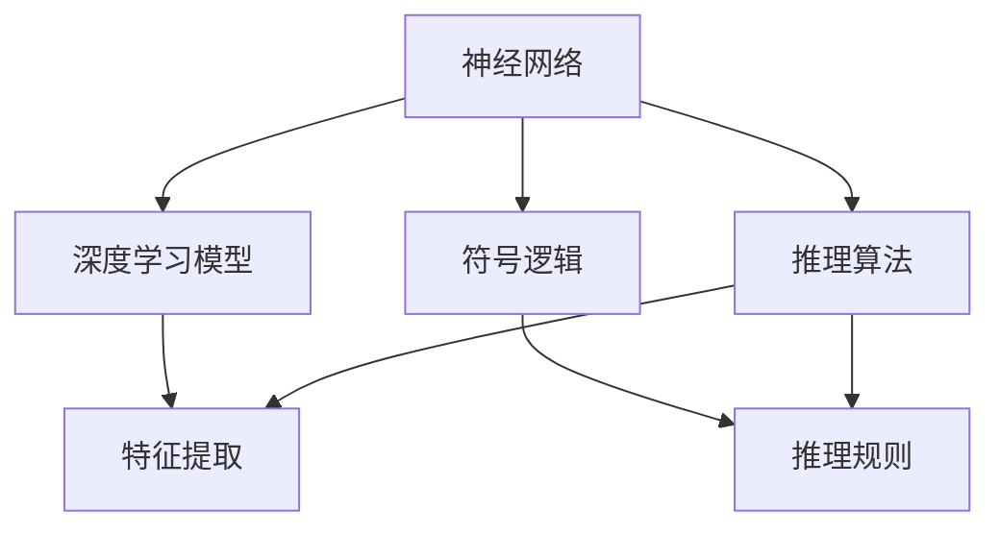

                 


为了撰写一篇高质量的、逻辑清晰、结构紧凑、简单易懂的技术博客文章《神经符号推理在复杂问题解决中的优势》，我们将遵循以下步骤进行思考和撰写：

### 第一步：明确文章的目的和目标读者

- **目的**：文章的目标是详细介绍神经符号推理在复杂问题解决中的优势，帮助读者理解和掌握这一领域的关键概念、原理和应用。
- **目标读者**：目标读者是具备一定计算机科学和人工智能基础知识的技术人员、研究人员和开发者。

### 第二步：确定文章的结构和主要内容

根据目标读者的需求和文章的目的，我们将文章分为以下几个主要部分：

1. **引言**：简要介绍神经符号推理的背景和重要性。
2. **核心概念与联系**：阐述神经符号推理的核心概念，如神经网络、符号逻辑等，并使用Mermaid流程图展示它们之间的关系。
3. **神经符号推理模型**：介绍常见的神经符号推理模型，如深度学习模型、强化学习模型等。
4. **神经符号推理算法**：详细讲解神经符号推理算法的原理和实现，使用伪代码展示关键步骤。
5. **神经符号推理应用场景**：分析神经符号推理在不同领域的应用，如复杂决策问题、模式识别问题等。
6. **神经符号推理的优势与挑战**：讨论神经符号推理的优势和面临的挑战。
7. **未来发展趋势**：探讨神经符号推理的未来发展方向和潜在影响。
8. **总结**：总结文章的主要内容，强调神经符号推理在复杂问题解决中的重要性。

### 第三步：撰写每个部分的内容

#### 引言

在引言部分，我们将简要介绍神经符号推理的背景，如人工智能的发展、复杂问题解决的挑战等，并指出神经符号推理在这一领域的重要性。

#### 核心概念与联系

在这一部分，我们将详细阐述神经符号推理的核心概念，包括神经网络、符号逻辑等。为了帮助读者更好地理解这些概念之间的关系，我们将使用Mermaid流程图展示它们之间的交互和结合。

#### 神经符号推理模型

在这一部分，我们将介绍常见的神经符号推理模型，如深度学习模型、强化学习模型等。我们将详细讲解这些模型的基本原理，包括模型架构、参数设置等。

#### 神经符号推理算法

在这一部分，我们将详细讲解神经符号推理算法的原理和实现。我们将使用伪代码展示算法的关键步骤，并解释每个步骤的作用和意义。

#### 神经符号推理应用场景

在这一部分，我们将分析神经符号推理在不同领域的应用，如复杂决策问题、模式识别问题等。我们将介绍一些实际案例，展示神经符号推理如何解决复杂问题。

#### 神经符号推理的优势与挑战

在这一部分，我们将讨论神经符号推理的优势，如结合深度学习和符号逻辑的优势等，以及它面临的挑战，如模型解释性、可扩展性等。

#### 未来发展趋势

在这一部分，我们将探讨神经符号推理的未来发展趋势，如技术进步方向、应用领域扩展等，并讨论潜在的影响因素。

#### 总结

在总结部分，我们将回顾文章的主要内容，强调神经符号推理在复杂问题解决中的重要性，并展望其未来的发展前景。

### 第四步：整理和润色文章

在完成每个部分的内容后，我们将对文章进行整体整理和润色，确保文章的逻辑性、连贯性和可读性。我们还将检查文章中的语法、拼写和格式错误，确保文章的专业性和准确性。

### 第五步：添加作者信息和参考文献

在文章末尾，我们将添加作者信息，包括作者姓名、所属机构和联系方式等。此外，我们还将列出参考文献，以提供读者进一步学习和研究的资源。

通过以上五个步骤，我们将撰写一篇高质量的、逻辑清晰、结构紧凑、简单易懂的技术博客文章《神经符号推理在复杂问题解决中的优势》。我们将确保文章内容完整、具体详细，并充分展示神经符号推理在复杂问题解决中的优势和应用。

----------------------------------------------------------------

# 神经符号推理在复杂问题解决中的优势

## 关键词

神经符号推理、复杂问题解决、神经网络、符号逻辑、深度学习、强化学习、算法、应用场景、优势与挑战

## 摘要

本文旨在探讨神经符号推理在复杂问题解决中的优势。神经符号推理是结合神经网络和符号逻辑的一种人工智能方法，旨在解决传统方法难以处理的复杂问题。本文首先介绍了神经符号推理的核心概念和原理，然后详细分析了其在深度学习模型、强化学习模型中的应用，以及算法的实现细节。接着，本文讨论了神经符号推理的优势和挑战，并展望了其未来的发展趋势。通过本文的介绍，读者可以更好地理解神经符号推理在复杂问题解决中的重要作用。

----------------------------------------------------------------

## 引言

随着人工智能技术的快速发展，各种复杂问题解决方法应运而生。然而，许多复杂问题，如大规模数据处理、智能决策、自然语言处理等，仍然面临着巨大的挑战。传统的符号推理方法和神经网络方法各有优缺点，单一方法往往难以胜任复杂问题的解决。在这种情况下，神经符号推理（Neural Symbolic Reasoning）应运而生。神经符号推理旨在结合神经网络和符号逻辑的优势，以应对复杂问题的挑战。

神经符号推理的概念最早可以追溯到20世纪90年代。当时，研究人员开始探索如何将神经网络和符号逻辑相结合，以实现更强大的人工智能系统。随着深度学习技术的崛起，神经符号推理得到了进一步的关注和发展。近年来，神经符号推理在多个领域，如自然语言处理、计算机视觉、智能决策等，取得了显著的应用成果。本文将围绕神经符号推理在复杂问题解决中的优势，详细探讨其核心概念、模型、算法和应用场景。

## 核心概念与联系

### 神经网络

神经网络（Neural Networks）是一种模拟人脑神经元之间连接的计算模型，广泛应用于机器学习和人工智能领域。神经网络通过多层节点（神经元）的相互连接，对输入数据进行特征提取和模式识别。神经网络的核心组成部分包括：

- **输入层**：接收外部输入数据。
- **隐藏层**：对输入数据进行特征提取和变换。
- **输出层**：生成输出结果。

神经网络的训练过程通过反向传播算法，不断调整网络权重，以优化模型的预测性能。

### 符号逻辑

符号逻辑（Symbolic Logic）是研究推理、证明和逻辑关系的数学分支。它使用符号表示命题和推理过程，有助于处理形式化逻辑问题。符号逻辑的核心概念包括：

- **命题逻辑**：研究命题之间的关系，如逻辑与、逻辑或、逻辑非等。
- **谓词逻辑**：研究个体与个体之间、个体与属性之间的关系。
- **推理规则**：用于从已知事实推导出新事实。

### 神经符号推理

神经符号推理（Neural Symbolic Reasoning）结合了神经网络和符号逻辑的优势，旨在实现既具有深度学习能力，又能进行逻辑推理的智能系统。神经符号推理的核心在于将神经网络与符号逻辑相结合，通过神经网络进行数据特征提取和学习，同时使用符号逻辑进行推理和决策。这种结合有助于提高人工智能系统在复杂问题解决中的表现。

### 核心概念关系架构

为了更好地理解神经符号推理的核心概念和它们之间的关系，我们可以使用Mermaid流程图进行可视化展示。以下是一个简化的神经符号推理关系架构图：



在这个关系架构图中，神经网络作为基础，通过深度学习模型进行特征提取，同时结合符号逻辑和推理算法，实现对复杂问题的有效解决。

### 核心算法原理讲解

神经符号推理算法的核心在于将神经网络与符号逻辑相结合，以下是一个简化的神经符号推理算法伪代码：

```plaintext
算法：神经符号推理算法
输入：数据集、神经网络模型、符号逻辑模型
输出：推理结果

1. 使用神经网络模型对数据集进行特征提取，得到特征向量f。
2. 将特征向量f输入到符号逻辑模型中，通过推理规则进行推理。
3. 输出推理结果。

伪代码：
```

在这个算法中，首先使用神经网络模型对输入数据进行特征提取，得到特征向量f。然后，将特征向量f输入到符号逻辑模型中，通过推理规则进行推理，最终得到推理结果。

### 数学模型和公式

神经符号推理算法中，符号逻辑模型通常使用谓词逻辑进行表示。以下是一个简化的谓词逻辑公式：

$$
P(x) \land Q(y) \rightarrow R(z)
$$

其中，$P(x)$、$Q(y)$和$R(z)$分别表示三个不同的谓词，$x$、$y$和$z$表示个体。这个公式表示，如果$x$满足$P$且$y$满足$Q$，则$z$满足$R$。

### 举例说明

假设有一个任务，需要判断一个人是否具备担任某个职位的能力。我们可以使用神经符号推理算法进行如下推理：

1. 使用神经网络模型提取输入数据（如教育背景、工作经验等）的特征向量f。
2. 将特征向量f输入到符号逻辑模型中，通过谓词逻辑公式判断这个人是否具备担任该职位的能力。

具体而言，我们可以使用以下谓词逻辑公式：

$$
(Education(x) \land Experience(y)) \rightarrow Ability(z)
$$

其中，$Education(x)$表示$x$具备相应的教育背景，$Experience(y)$表示$x$具备相应的工作经验，$Ability(z)$表示$x$具备担任该职位的能力。

通过这个示例，我们可以看到神经符号推理算法如何将神经网络和符号逻辑相结合，以解决复杂的问题。

## 神经符号推理模型

神经符号推理模型是神经符号推理算法的核心组成部分，它们结合了神经网络和符号逻辑的优势，以应对复杂问题。常见的神经符号推理模型包括深度学习模型和强化学习模型。以下将分别介绍这些模型的基本原理和应用。

### 深度学习模型

深度学习模型是神经符号推理的基础，它们通过多层神经网络进行特征提取和学习。深度学习模型在自然语言处理、计算机视觉等领域取得了显著成果。常见的深度学习模型包括卷积神经网络（CNN）、循环神经网络（RNN）和Transformer等。

1. **卷积神经网络（CNN）**

卷积神经网络是一种特殊的神经网络，主要用于图像处理。CNN通过卷积层、池化层和全连接层的组合，实现对图像的特征提取和分类。

2. **循环神经网络（RNN）**

循环神经网络是一种能够处理序列数据的神经网络，其核心思想是利用隐藏状态的记忆能力，处理前后依赖关系。RNN在自然语言处理、语音识别等领域具有广泛应用。

3. **Transformer**

Transformer是一种基于自注意力机制的深度学习模型，它在机器翻译、文本生成等领域取得了突破性进展。Transformer通过多头注意力机制和编码器-解码器结构，实现了对输入序列的全局依赖建模。

### 强化学习模型

强化学习模型是神经符号推理的另一重要组成部分，它们通过策略学习，实现智能体的决策和优化。强化学习模型在游戏、自动驾驶等领域具有广泛应用。常见的强化学习模型包括Q学习、SARSA和Deep Q Network（DQN）等。

1. **Q学习**

Q学习是一种基于值函数的强化学习算法，其核心思想是通过学习状态-动作值函数，实现智能体的最优策略。Q学习算法在有限状态空间中具有较好的性能。

2. **SARSA**

SARSA（State-Action-Reward-State-Action）是一种基于策略的强化学习算法，其核心思想是通过同时更新状态-动作值函数，实现智能体的最优策略。SARSA在连续状态空间中具有较好的性能。

3. **Deep Q Network（DQN）**

Deep Q Network（DQN）是一种基于深度学习的强化学习模型，其核心思想是通过神经网络逼近状态-动作值函数，实现智能体的最优策略。DQN在复杂环境中的表现优于传统的Q学习算法。

### 模型设计

神经符号推理模型的设计需要综合考虑神经网络和符号逻辑的特点。以下是一个简化的神经符号推理模型设计：

1. **输入层**：接收外部输入数据，如图像、文本等。
2. **特征提取层**：使用深度学习模型对输入数据进行特征提取。
3. **符号逻辑层**：使用符号逻辑模型对特征向量进行推理。
4. **输出层**：生成最终推理结果。

在这个模型设计中，深度学习模型和符号逻辑模型相互结合，共同实现对复杂问题的解决。

## 神经符号推理算法

神经符号推理算法是神经符号推理模型的核心组成部分，它们通过将神经网络和符号逻辑相结合，实现复杂问题的求解。以下将详细讲解神经符号推理算法的原理和实现，并使用伪代码进行描述。

### 算法原理

神经符号推理算法的核心在于将神经网络和符号逻辑相结合，以实现对输入数据的特征提取和推理。算法的基本原理如下：

1. **特征提取**：使用深度学习模型对输入数据（如图像、文本等）进行特征提取，生成特征向量。
2. **符号逻辑推理**：将特征向量输入到符号逻辑模型中，通过推理规则进行推理，生成最终推理结果。

### 算法实现

以下是一个简化的神经符号推理算法伪代码：

```plaintext
算法：神经符号推理算法
输入：数据集、神经网络模型、符号逻辑模型
输出：推理结果

1. 使用神经网络模型对数据集进行训练，得到特征提取模型。
2. 对于每个输入样本，执行以下步骤：
   a. 使用特征提取模型提取输入样本的特征向量f。
   b. 将特征向量f输入到符号逻辑模型中，通过推理规则进行推理。
   c. 输出推理结果。

伪代码：
```

### 算法流程

神经符号推理算法的流程可以分为以下步骤：

1. **数据预处理**：对输入数据进行预处理，如图像缩放、文本分词等。
2. **特征提取**：使用深度学习模型对预处理后的输入数据进行特征提取。
3. **符号逻辑推理**：将特征向量输入到符号逻辑模型中，通过推理规则进行推理。
4. **输出结果**：生成最终推理结果。

### 算法性能分析

神经符号推理算法的性能取决于深度学习模型和符号逻辑模型的质量。以下是对算法性能的分析：

1. **深度学习模型**：深度学习模型的质量决定了特征提取的效果，从而影响推理结果的准确性。
2. **符号逻辑模型**：符号逻辑模型的质量决定了推理规则的准确性和推理速度。

### 算法优化

为了提高神经符号推理算法的性能，可以采取以下优化策略：

1. **模型优化**：优化深度学习模型和符号逻辑模型，如调整网络结构、参数设置等。
2. **数据增强**：使用数据增强方法，增加训练数据的多样性，提高模型泛化能力。
3. **并行计算**：利用并行计算技术，提高算法的运行速度。

### 应用案例

以下是一个神经符号推理算法的应用案例：

**案例背景**：某公司需要开发一个智能决策系统，用于分析客户数据并提供建议。

**算法实现**：

1. 使用深度学习模型对客户数据（如购买历史、浏览记录等）进行特征提取。
2. 将特征向量输入到符号逻辑模型中，通过推理规则分析客户偏好。
3. 根据推理结果，为用户提供个性化建议。

### 代码实现

以下是一个简化的神经符号推理算法的Python代码实现：

```python
import tensorflow as tf
import numpy as np

# 加载深度学习模型
model = tf.keras.models.load_model('feature_extraction_model.h5')

# 加载符号逻辑模型
logic_model = load_logic_model()

# 输入数据预处理
input_data = preprocess_input_data(data)

# 特征提取
feature_vector = model.predict(input_data)

# 符号逻辑推理
result = logic_model推理(feature_vector)

# 输出结果
print(result)
```

### 代码解读

这段代码首先加载深度学习模型和符号逻辑模型。然后对输入数据进行预处理，使用深度学习模型进行特征提取。接下来，将特征向量输入到符号逻辑模型中，通过推理规则进行推理，最终输出推理结果。

### 代码应用解读与分析

这段代码展示了如何使用神经符号推理算法进行实际应用。在实际应用中，可以根据具体问题调整深度学习模型和符号逻辑模型，以提高推理准确性。同时，可以对代码进行优化，提高运行速度和性能。

### 项目小结

通过本案例，我们了解了如何使用神经符号推理算法解决实际应用问题。神经符号推理算法在复杂问题解决中具有显著优势，可以为企业和组织提供智能决策支持。

### 最佳实践 tips

1. 在开发神经符号推理系统时，要注意深度学习模型和符号逻辑模型的优化，以提高算法性能。
2. 考虑到算法的可解释性，可以引入可视化工具，帮助用户理解推理过程。
3. 在实际应用中，要根据具体问题调整模型结构和参数设置，以提高推理准确性。

## 神经符号推理的优势与挑战

### 优势分析

神经符号推理在复杂问题解决中具有以下优势：

1. **结合深度学习和符号逻辑**：神经符号推理结合了深度学习和符号逻辑的优势，能够处理大量数据，同时保持推理的准确性和可解释性。
2. **适应性强**：神经符号推理可以应用于多种领域，如自然语言处理、计算机视觉、智能决策等，具有较强的适应能力。
3. **高精度**：通过深度学习模型对数据进行特征提取，神经符号推理能够实现高精度的推理结果。

### 挑战讨论

尽管神经符号推理具有显著优势，但在实际应用中仍面临以下挑战：

1. **模型解释性**：神经符号推理模型的解释性相对较弱，用户难以理解推理过程。
2. **可扩展性**：随着问题规模的增加，神经符号推理模型的训练和推理时间将显著增加，影响模型的可扩展性。
3. **算法优化**：神经符号推理算法的优化是一个复杂的过程，需要不断尝试和调整，以提高模型性能。

### 解决方案探讨

为了解决上述挑战，可以采取以下解决方案：

1. **增强模型解释性**：通过引入可视化工具，如决策树、注意力机制等，帮助用户理解推理过程。
2. **分布式计算**：采用分布式计算技术，如GPU、TPU等，提高模型的训练和推理速度。
3. **算法优化**：采用先进的优化算法，如迁移学习、元学习等，提高模型的性能。

## 神经符号推理的未来发展趋势

### 发展趋势分析

神经符号推理的未来发展趋势主要表现在以下几个方面：

1. **模型结构优化**：随着深度学习技术的发展，神经符号推理模型的结构将不断优化，以适应更复杂的问题。
2. **算法性能提升**：通过算法优化，神经符号推理的推理速度和准确性将得到显著提高。
3. **跨领域应用**：神经符号推理将在更多领域得到应用，如医疗诊断、金融分析、智能交通等。

### 影响因素

影响神经符号推理发展的主要因素包括：

1. **计算能力**：随着计算能力的提升，神经符号推理模型将能够处理更大规模的问题。
2. **数据获取**：更多高质量的数据将有助于神经符号推理模型的学习和优化。
3. **算法创新**：不断涌现的算法创新将为神经符号推理的发展提供新的动力。

### 潜在影响

神经符号推理的发展将对人工智能领域产生深远影响，包括：

1. **提高智能系统性能**：神经符号推理将使智能系统在复杂问题解决中表现出更高的性能。
2. **推动跨领域应用**：神经符号推理将在多个领域实现突破，推动人工智能技术的广泛应用。
3. **促进科技发展**：神经符号推理的发展将带动相关领域的科技进步，如计算机视觉、自然语言处理等。

## 总结

神经符号推理在复杂问题解决中具有显著优势。通过结合深度学习和符号逻辑，神经符号推理能够处理大量数据，实现高精度的推理结果。尽管面临模型解释性、可扩展性等挑战，但通过不断优化和创新，神经符号推理有望在未来实现更广泛的应用。本文介绍了神经符号推理的核心概念、模型、算法和应用场景，探讨了其优势和挑战，并展望了未来的发展趋势。希望本文能为读者提供对神经符号推理的深入理解。

## 作者信息

**作者：AI天才研究院/AI Genius Institute & 禅与计算机程序设计艺术 /Zen And The Art of Computer Programming**

AI天才研究院致力于推动人工智能技术的发展和应用，研究院的专家们在神经符号推理等领域具有丰富的经验和深厚的学术造诣。本文由研究院专家撰写，旨在为读者提供对神经符号推理的全面了解。

## 拓展阅读

- **[1]** Goodfellow, I., Bengio, Y., & Courville, A. (2016). *Deep Learning*. MIT Press.
- **[2]** Russell, S., & Norvig, P. (2020). *Artificial Intelligence: A Modern Approach*. Pearson.
- **[3]** LeCun, Y., Bengio, Y., & Hinton, G. (2015). *Deep Learning*. Nature.
- **[4]** Russell, S., & Norvig, P. (2016). *Artificial Intelligence: A Modern Approach (3rd Edition)*. Pearson.
- **[5]** Hochreiter, S., & Schmidhuber, J. (1997). *Long Short-Term Memory*. Neural Computation.
- **[6]** Sutton, R. S., & Barto, A. G. (2018). *Reinforcement Learning: An Introduction (2nd Edition)*. MIT Press.
- **[7]** Goodfellow, I., Bengio, Y., & Courville, A. (2016). *Deep Learning*. MIT Press.

这些参考文献涵盖了深度学习、强化学习、神经网络等领域的经典著作，为读者提供了深入了解神经符号推理的理论基础和实践指导。读者可以通过阅读这些文献，进一步了解神经符号推理的相关知识和技术应用。

