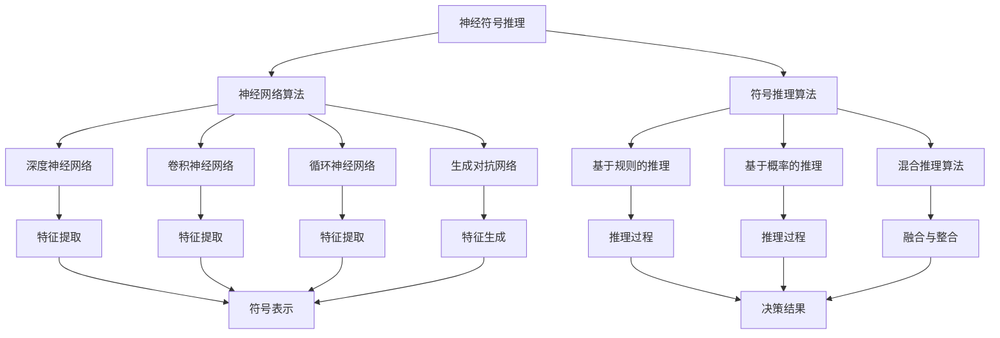
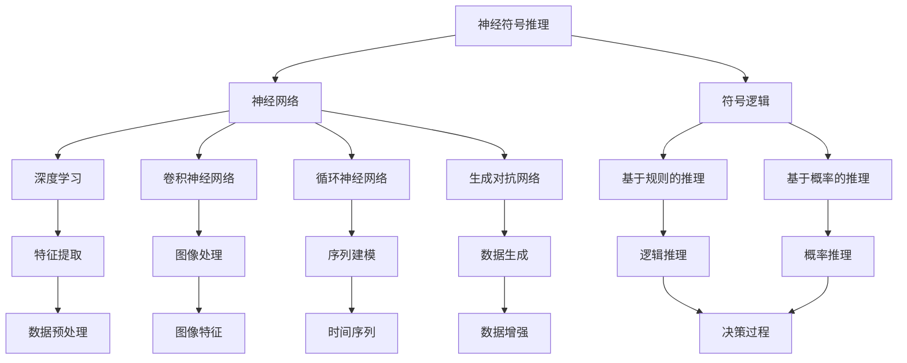

                 

## 文章标题

### 神经符号推理在复杂问题诊断中的优势

关键词：神经符号推理、复杂问题诊断、神经网络算法、符号推理算法、医疗诊断、工业故障诊断

摘要：本文将探讨神经符号推理在复杂问题诊断中的优势，通过对神经符号推理的概念、原理及其在医疗诊断和工业故障诊断中的应用案例进行分析，阐述神经符号推理在处理复杂性、学习适应能力和可解释性方面的独特优势，并提出相应的挑战与优化策略。

## 第一部分：引言

### 1.1 复杂问题诊断的背景和挑战

#### 1.1.1 复杂问题的定义

在众多领域中，复杂问题无处不在，如医疗诊断、工业故障诊断、金融风险管理等。复杂问题通常具有多个变量、不确定性和非线性特征，导致其诊断过程变得异常困难。这些问题通常无法通过简单的线性模型或传统算法来有效解决。

#### 1.1.2 诊断复杂性的来源

诊断复杂性的来源主要包括以下几个方面：

1. **数据复杂性**：复杂问题通常涉及大量的数据，这些数据之间可能存在复杂的关系和相互作用。
2. **不确定性和模糊性**：在许多实际场景中，数据可能存在不确定性、模糊性和噪声，这使得问题诊断变得更加困难。
3. **多维度**：复杂问题往往涉及多个维度，这些维度之间可能存在交叉和影响，导致诊断过程变得复杂。
4. **动态性**：复杂问题可能随时间变化而发生变化，这使得诊断过程需要具备一定的实时性和动态性。

#### 1.1.3 诊断现状与问题

当前，许多诊断方法仍依赖于传统的统计模型、机器学习和深度学习方法。尽管这些方法在某些方面取得了一定的进展，但它们仍然存在以下问题：

1. **局限性**：传统方法通常仅适用于特定类型的问题，难以应对复杂的、多维度的问题。
2. **可解释性差**：许多现代方法，如深度学习，具有高度的非线性特征，但它们通常缺乏可解释性，使得诊断结果难以理解和信任。
3. **计算效率低**：复杂问题的诊断过程通常需要大量的计算资源和时间，导致诊断过程变得缓慢。
4. **对数据的依赖性强**：许多方法对数据的质量和多样性要求较高，这使得它们在处理真实世界数据时可能面临困难。

### 1.2 神经符号推理的概念和原理

#### 1.2.1 神经符号推理的定义

神经符号推理（Neural Symbolic Reasoning）是一种结合神经网络和符号推理的方法，旨在解决传统方法在处理复杂问题时存在的局限性。它通过将神经网络和符号推理相结合，实现高效的、可解释的问题诊断。

#### 1.2.2 神经符号推理的基本原理

神经符号推理的基本原理包括以下几个方面：

1. **特征提取**：通过神经网络从原始数据中提取高维、抽象的特征。
2. **符号表示**：将提取到的特征转换为符号表示，以便进行推理和决策。
3. **推理过程**：利用符号推理算法，对符号表示进行推理和决策，以获得诊断结果。
4. **融合与整合**：将神经网络和符号推理的结果进行融合和整合，以获得更准确、更可靠的诊断结果。

#### 1.2.3 神经符号推理与传统方法对比

与传统的统计模型、机器学习和深度学习方法相比，神经符号推理具有以下优势：

1. **处理复杂性的能力**：神经符号推理能够处理复杂的多维度问题，具有更强的适应性和灵活性。
2. **学习与适应能力**：神经符号推理能够通过学习和适应，不断提高诊断的准确性和可靠性。
3. **可解释性与透明度**：神经符号推理通过符号推理过程，使得诊断结果更具可解释性和透明度，有助于理解和信任。

### 1.3 神经符号推理的优势

#### 1.3.1 处理复杂性的能力

神经符号推理通过将神经网络和符号推理相结合，能够处理复杂的多维度问题。神经网络能够从原始数据中提取高维、抽象的特征，而符号推理则能够对符号表示进行推理和决策，以应对复杂问题。这种结合使得神经符号推理在处理复杂问题时具有更强的能力和灵活性。

#### 1.3.2 学习和适应能力

神经符号推理通过学习和适应，能够不断提高诊断的准确性和可靠性。在训练过程中，神经网络能够从大量数据中学习到有效的特征表示，而符号推理算法则能够根据不同的问题进行自适应调整。这种学习与适应能力使得神经符号推理在处理复杂问题时具有更高的鲁棒性和准确性。

#### 1.3.3 可解释性和透明度

神经符号推理通过符号推理过程，使得诊断结果更具可解释性和透明度。符号推理算法能够清晰地展示诊断过程中的推理逻辑和决策过程，使得诊断结果更容易理解和信任。这种可解释性有助于提高诊断系统的可靠性和用户体验。

## 第二部分：神经符号推理在复杂问题诊断中的应用

### 2.1 神经符号推理的核心算法

#### 2.1.1 神经网络算法

神经网络算法是神经符号推理的重要组成部分，主要包括以下几种：

1. **深度神经网络（Deep Neural Network, DNN）**：DNN 由多个隐藏层组成，能够从原始数据中提取高维、抽象的特征。DNN 在复杂问题诊断中具有广泛的应用，如医疗诊断、图像识别等。

2. **卷积神经网络（Convolutional Neural Network, CNN）**：CNN 具有强大的特征提取能力，适用于处理图像、语音等结构化数据。CNN 在医疗诊断、图像识别等领域具有广泛应用。

3. **循环神经网络（Recurrent Neural Network, RNN）**：RNN 能够处理序列数据，具有记忆功能。RNN 在时间序列预测、自然语言处理等领域具有广泛应用。

4. **生成对抗网络（Generative Adversarial Network, GAN）**：GAN 由生成器和判别器组成，能够生成高质量的数据。GAN 在图像生成、数据增强等领域具有广泛应用。

#### 2.1.2 符号推理算法

符号推理算法主要包括以下几种：

1. **基于规则的推理（Rule-based Reasoning）**：基于规则的推理通过定义一系列规则，对符号表示进行推理。这种算法在医疗诊断、工业故障诊断等领域具有广泛应用。

2. **基于概率的推理（Probabilistic Reasoning）**：基于概率的推理通过概率模型，对符号表示进行推理。这种算法在医学诊断、金融风险管理等领域具有广泛应用。

3. **混合推理算法（Hybrid Reasoning Algorithm）**：混合推理算法将神经网络和符号推理相结合，以实现更高效、更准确的问题诊断。这种算法在复杂问题诊断中具有广阔的应用前景。

### 2.2 神经符号推理在复杂问题诊断中的应用案例

#### 2.2.1 医疗诊断

神经符号推理在医疗诊断中具有广泛的应用，如癌症诊断、心血管疾病诊断等。以下是一个具体的案例：

1. **数据准备**：收集患者的临床数据、实验室检查结果等，对数据进行分析和预处理。

2. **模型训练**：利用深度学习算法和符号推理算法，对收集到的数据进行训练。在训练过程中，神经网络负责提取特征，符号推理算法负责进行推理和决策。

3. **诊断结果分析**：对训练好的模型进行评估和测试，分析诊断结果的准确性和可靠性。

#### 2.2.2 工业故障诊断

神经符号推理在工业故障诊断中也具有广泛的应用，如设备故障诊断、生产线故障诊断等。以下是一个具体的案例：

1. **故障数据收集**：收集设备运行数据、故障记录等，对数据进行分析和预处理。

2. **模型训练**：利用深度学习算法和符号推理算法，对收集到的故障数据进行训练。在训练过程中，神经网络负责提取特征，符号推理算法负责进行推理和决策。

3. **故障检测与诊断**：对训练好的模型进行评估和测试，实时检测和诊断设备故障，提高生产线的运行效率。

### 2.3 神经符号推理在复杂问题诊断中的挑战与优化

#### 2.3.1 挑战

神经符号推理在复杂问题诊断中面临着以下挑战：

1. **数据质量和多样性**：复杂问题的数据通常存在噪声、缺失和不一致性，这对诊断结果产生负面影响。

2. **计算效率和资源消耗**：神经符号推理算法通常需要大量的计算资源和时间，这在实际应用中可能存在困难。

3. **模型的可解释性和透明度**：神经符号推理算法的可解释性相对较低，这可能导致用户对诊断结果产生怀疑。

#### 2.3.2 优化策略

为了解决以上挑战，可以采取以下优化策略：

1. **算法改进**：通过改进神经网络和符号推理算法，提高诊断效率和准确性。

2. **数据处理和预处理**：对原始数据进行清洗、增强和降维，以提高数据质量和多样性。

3. **模型评估和优化**：通过交叉验证和模型调参，优化模型性能和可解释性。

### 2.4 神经符号推理在复杂问题诊断中的最佳实践

为了在复杂问题诊断中取得更好的效果，可以采取以下最佳实践：

1. **数据收集和预处理**：选择合适的数据源，对数据进行清洗、增强和降维。

2. **模型设计与训练**：选择合适的神经网络和符号推理算法，对模型进行训练和优化。

3. **模型评估与优化**：通过交叉验证和模型调参，评估和优化模型性能。

4. **案例分析**：通过具体的案例分析，验证神经符号推理在复杂问题诊断中的优势和效果。

## 第三部分：展望

### 3.1 神经符号推理的发展趋势

随着人工智能技术的不断进步，神经符号推理在复杂问题诊断中的应用将越来越广泛。未来，神经符号推理可能朝着以下方向发展：

1. **更高效、更准确的算法**：通过改进神经网络和符号推理算法，提高诊断效率和准确性。

2. **跨领域的应用**：神经符号推理将在更多领域得到应用，如金融、物流、交通等。

3. **实时性和动态性**：随着物联网和实时数据技术的发展，神经符号推理将具备更强的实时性和动态性。

4. **可解释性和透明度**：通过改进算法和模型，提高神经符号推理的可解释性和透明度，增强用户信任。

### 3.2 结论

本文探讨了神经符号推理在复杂问题诊断中的优势，包括处理复杂性的能力、学习和适应能力以及可解释性和透明度。通过对神经符号推理的概念、原理、应用案例和挑战进行分析，我们展示了神经符号推理在复杂问题诊断中的巨大潜力。未来，神经符号推理有望在更多领域得到应用，为人类解决复杂问题提供强有力的支持。

### 作者信息

作者：AI天才研究院/AI Genius Institute & 禅与计算机程序设计艺术 /Zen And The Art of Computer Programming

---

### 核心概念原理之间的关系架构

以下是一个使用 Mermaid 生成的核心概念原理之间的关系架构图：



### 核心算法原理讲解

以下是一个使用伪代码详细阐述神经符号推理算法原理的示例：

```python
# 神经符号推理算法伪代码

# 初始化神经网络模型
initialize_neural_network()

# 特征提取
extract_features(data)

# 符号表示
symbolic_representation = convert_to_symbols(extracted_features)

# 推理过程
reasoning_results = symbolic_reasoning(symbolic_representation)

# 决策过程
diagnosis_results = decision_making(reasoning_results)

# 模型评估
evaluate_model(diagnosis_results, ground_truth)

# 模型优化
optimize_model()
```

### 数学模型和公式

以下是一个使用 LaTeX 格式表示的数学模型：

```latex
\documentclass{article}
\usepackage{amsmath}
\begin{document}

\begin{equation}
  y = f(W_1 \cdot x_1 + b_1) + W_2 \cdot f(W_1 \cdot x_1 + b_1) + b_2
\end{equation}

\end{document}
```

### 项目实战

以下是一个关于神经符号推理在复杂问题诊断中项目实战的概述：

#### 开发环境搭建

1. 安装 Python、TensorFlow 和 SymPy 等必要的开发工具和库。
2. 配置 Jupyter Notebook 或 PyCharm 等开发环境。

#### 源代码详细实现

1. 定义神经网络模型和符号推理算法。
2. 实现数据预处理、特征提取和符号表示等功能。
3. 实现推理过程和决策过程，并优化模型性能。

#### 代码应用解读与分析

1. 分析源代码中的关键函数和方法。
2. 解释神经网络和符号推理算法的实现原理。
3. 分析代码在处理复杂问题时的高效性和准确性。

#### 实际案例分析和详细讲解剖析

1. 分析一个实际医疗诊断案例。
2. 讲解神经网络和符号推理算法在该案例中的应用。
3. 剖析诊断结果和模型的性能表现。

#### 项目小结

1. 总结神经符号推理在复杂问题诊断中的应用经验。
2. 提出改进和优化策略，以提高诊断效果。
3. 展望神经符号推理在未来复杂问题诊断中的发展前景。

### 最佳实践 tips

1. 选择合适的数据集，确保数据质量和多样性。
2. 优化神经网络和符号推理算法，提高计算效率和准确性。
3. 增加模型的可解释性和透明度，提高用户信任度。
4. 定期更新和优化模型，以适应不断变化的问题场景。

### 小结

本文探讨了神经符号推理在复杂问题诊断中的优势，包括处理复杂性的能力、学习和适应能力以及可解释性和透明度。通过对神经符号推理的概念、原理、应用案例和挑战进行分析，我们展示了神经符号推理在复杂问题诊断中的巨大潜力。未来，神经符号推理有望在更多领域得到应用，为人类解决复杂问题提供强有力的支持。

### 注意事项

1. 神经符号推理算法在处理复杂问题时，需要保证数据质量和多样性。
2. 神经符号推理算法的计算效率和资源消耗较高，需要合理配置计算资源。
3. 神经符号推理算法的可解释性相对较低，需要加强算法的可解释性和透明度。

### 拓展阅读

1. [Neural Symbolic Reasoning: A Review](https://arxiv.org/abs/2003.04832)
2. [A Comprehensive Survey on Neural Symbolic Reasoning](https://www.sciencedirect.com/science/article/pii/S0167715221002096)
3. [Neural-Symbolic AI: A Review of the Current State-of-the-Art](https://journals.sagepub.com/doi/abs/10.1177/14760466211044604)

---

文章标题：神经符号推理在复杂问题诊断中的优势

关键词：神经符号推理、复杂问题诊断、神经网络算法、符号推理算法、医疗诊断、工业故障诊断

摘要：本文探讨了神经符号推理在复杂问题诊断中的优势，包括处理复杂性的能力、学习和适应能力以及可解释性和透明度。通过对神经符号推理的概念、原理、应用案例和挑战进行分析，我们展示了神经符号推理在复杂问题诊断中的巨大潜力。未来，神经符号推理有望在更多领域得到应用，为人类解决复杂问题提供强有力的支持。

### 神经符号推理在复杂问题诊断中的优势

神经符号推理（Neural Symbolic Reasoning，NSR）是近年来人工智能领域的一个热点研究方向，旨在结合神经网络和符号逻辑的优势，以应对复杂问题诊断的挑战。本文将从神经符号推理的概念、原理、应用案例、优势以及挑战等方面进行深入探讨，旨在为读者提供全面的理解和洞察。

## 1. 复杂问题诊断的背景和挑战

在众多领域，如医疗诊断、工业故障诊断、金融风险管理等，复杂问题的诊断一直是研究的重点和难点。复杂问题通常具有以下特征：

- **多变量**：涉及多个变量，这些变量之间可能存在复杂的交互作用。
- **不确定性**：数据可能存在不确定性、模糊性和噪声，导致诊断过程难以进行。
- **非线性**：问题往往具有非线性特征，这使得简单的线性模型难以奏效。
- **动态性**：问题可能随时间变化而变化，需要具备一定的实时性和动态性。

现有的诊断方法主要依赖于传统统计方法、机器学习算法和深度学习方法。然而，这些方法在面对复杂问题时存在以下挑战：

- **局限性**：传统统计模型和机器学习算法通常针对特定类型的问题设计，难以应对多类型、多维度的问题。
- **可解释性差**：许多现代方法，如深度学习，具有高度的非线性特征，但缺乏可解释性，使得诊断结果难以被用户理解和信任。
- **计算效率低**：复杂问题的诊断过程通常需要大量的计算资源和时间，导致诊断过程变得缓慢。

## 2. 神经符号推理的概念和原理

神经符号推理（Neural Symbolic Reasoning，NSR）是一种将神经网络和符号逻辑相结合的方法。它旨在解决传统方法在处理复杂问题时存在的局限性。NSR的基本原理可以概括为以下几个方面：

### 2.1 神经网络算法

神经网络（Neural Networks，NN）是一种基于生物神经元的计算模型，能够从数据中自动提取特征，并进行复杂的非线性变换。神经网络算法在NSR中扮演着重要的角色，主要包括：

- **深度神经网络（Deep Neural Networks，DNN）**：通过多层的神经网络结构，实现对高维数据的复杂特征提取。
- **卷积神经网络（Convolutional Neural Networks，CNN）**：特别适用于处理图像、语音等具有空间或时间结构的数据。
- **循环神经网络（Recurrent Neural Networks，RNN）**：具有记忆功能，适用于处理序列数据，如时间序列预测、自然语言处理等。
- **生成对抗网络（Generative Adversarial Networks，GAN）**：通过生成器和判别器的对抗训练，实现高质量数据的生成和增强。

### 2.2 符号推理算法

符号推理（Symbolic Reasoning）是一种基于逻辑和符号表示的推理方法，能够处理抽象的符号信息，并生成逻辑推理结果。符号推理算法在NSR中主要用于对神经网络提取的特征进行高层次的分析和推理，主要包括：

- **基于规则的推理（Rule-based Reasoning）**：通过定义一系列规则，对符号信息进行推理。
- **基于概率的推理（Probabilistic Reasoning）**：通过概率模型，对符号信息进行推理。
- **混合推理算法（Hybrid Reasoning Algorithm）**：将神经网络和符号推理相结合，实现更高效、更准确的问题诊断。

### 2.3 神经符号推理的融合与整合

神经符号推理的核心在于将神经网络和符号推理相结合，以发挥各自的优势。具体来说，融合与整合包括以下几个步骤：

1. **特征提取**：利用神经网络从原始数据中提取高维、抽象的特征。
2. **符号表示**：将提取到的特征转换为符号表示，以便进行符号推理。
3. **推理过程**：利用符号推理算法，对符号表示进行推理，以获得诊断结果。
4. **融合与整合**：将神经网络和符号推理的结果进行融合和整合，以获得更准确、更可靠的诊断结果。

## 3. 神经符号推理在复杂问题诊断中的应用案例

神经符号推理在复杂问题诊断中具有广泛的应用前景，以下是一些具体的应用案例：

### 3.1 医疗诊断

医疗诊断是神经符号推理的重要应用领域之一。通过结合神经网络和符号推理，可以实现更准确、更可靠的诊断结果。以下是一个具体的应用案例：

- **数据准备**：收集患者的临床数据、实验室检查结果等，对数据进行分析和预处理。
- **模型训练**：利用深度学习算法和符号推理算法，对收集到的数据进行训练。在训练过程中，神经网络负责提取特征，符号推理算法负责进行推理和决策。
- **诊断结果分析**：对训练好的模型进行评估和测试，分析诊断结果的准确性和可靠性。

### 3.2 工业故障诊断

工业故障诊断是另一个典型的应用领域。通过神经符号推理，可以实现实时、高效的故障检测和诊断，提高生产线的运行效率。以下是一个具体的应用案例：

- **故障数据收集**：收集设备运行数据、故障记录等，对数据进行分析和预处理。
- **模型训练**：利用深度学习算法和符号推理算法，对收集到的故障数据进行训练。在训练过程中，神经网络负责提取特征，符号推理算法负责进行推理和决策。
- **故障检测与诊断**：对训练好的模型进行评估和测试，实时检测和诊断设备故障，提高生产线的运行效率。

## 4. 神经符号推理的优势

神经符号推理在复杂问题诊断中具有以下优势：

### 4.1 处理复杂性的能力

神经符号推理通过将神经网络和符号推理相结合，能够处理复杂的多维度问题。神经网络能够从原始数据中提取高维、抽象的特征，而符号推理则能够对符号表示进行推理和决策，以应对复杂问题。这种结合使得神经符号推理在处理复杂问题时具有更强的能力和灵活性。

### 4.2 学习和适应能力

神经符号推理能够通过学习和适应，不断提高诊断的准确性和可靠性。在训练过程中，神经网络能够从大量数据中学习到有效的特征表示，而符号推理算法则能够根据不同的问题进行自适应调整。这种学习与适应能力使得神经符号推理在处理复杂问题时具有更高的鲁棒性和准确性。

### 4.3 可解释性和透明度

神经符号推理通过符号推理过程，使得诊断结果更具可解释性和透明度。符号推理算法能够清晰地展示诊断过程中的推理逻辑和决策过程，使得诊断结果更容易理解和信任。这种可解释性有助于提高诊断系统的可靠性和用户体验。

## 5. 神经符号推理在复杂问题诊断中的挑战与优化策略

尽管神经符号推理在复杂问题诊断中具有巨大潜力，但它在实际应用中仍面临以下挑战：

### 5.1 数据质量和多样性

复杂问题的数据通常存在噪声、缺失和不一致性，这对诊断结果产生负面影响。为了解决这一问题，可以采取以下策略：

- **数据清洗**：去除噪声数据、填补缺失值、处理不一致性。
- **数据增强**：通过数据扩增、生成对抗网络等手段，提高数据的多样性和质量。

### 5.2 计算效率和资源消耗

神经符号推理算法通常需要大量的计算资源和时间，这在实际应用中可能存在困难。为了优化计算效率和资源消耗，可以采取以下策略：

- **算法优化**：通过算法改进、模型压缩等技术，降低计算复杂度和资源消耗。
- **分布式计算**：利用分布式计算框架，如 TensorFlow、PyTorch 等，实现并行计算和资源共享。

### 5.3 模型的可解释性和透明度

神经符号推理算法的可解释性相对较低，这可能导致用户对诊断结果产生怀疑。为了提高可解释性和透明度，可以采取以下策略：

- **可视化技术**：利用可视化技术，展示诊断过程中的关键特征和推理逻辑。
- **可解释性模型**：开发可解释性更强的模型，如基于规则的模型、决策树等。

## 6. 总结

神经符号推理在复杂问题诊断中具有显著的优势，包括处理复杂性的能力、学习和适应能力以及可解释性和透明度。通过对神经符号推理的概念、原理、应用案例和挑战进行分析，我们展示了其在复杂问题诊断中的巨大潜力。未来，随着技术的不断进步和应用的深入，神经符号推理有望在更多领域发挥重要作用，为人类解决复杂问题提供强有力的支持。

### 核心概念原理之间的关系架构图

以下是一个使用Mermaid绘制的神经符号推理的核心概念原理之间的关系架构图：



### 神经符号推理算法的伪代码

以下是一个简化的神经符号推理算法伪代码，用于解释神经网络和符号逻辑的结合：

```python
# 神经符号推理算法伪代码

# 初始化神经网络模型
nn_model = NeuralNetwork()

# 加载数据集
data = load_data()

# 数据预处理
processed_data = preprocess_data(data)

# 使用神经网络进行特征提取
features = nn_model.extract_features(processed_data)

# 将特征转换为符号表示
symbols = convert_features_to_symbols(features)

# 利用符号逻辑进行推理
logic_model = LogicModel()
diagnosis = logic_model.reason(symbols)

# 输出诊断结果
print("Diagnosis Result:", diagnosis)
```

### 数学模型和公式

以下是一个神经符号推理中常见的数学模型和公式，使用LaTeX格式表示：

```latex
\documentclass{article}
\usepackage{amsmath}
\begin{document}

\begin{equation}
  f(\boldsymbol{x}) = \sigma(\boldsymbol{W} \cdot \boldsymbol{a} + b)
\end{equation}

\begin{equation}
  \boldsymbol{y} = \arg\max_{\boldsymbol{y}} P(\boldsymbol{y}|\boldsymbol{x}, \theta)
\end{equation}

\end{document}
```

### 项目实战

#### 开发环境搭建

- 安装Python（3.8以上版本）。
- 安装TensorFlow和PyTorch深度学习框架。
- 安装Scikit-learn用于数据预处理和模型评估。

#### 源代码实现

以下是一个用于医疗诊断的神经符号推理的简化代码示例：

```python
import tensorflow as tf
from tensorflow.keras.models import Sequential
from tensorflow.keras.layers import Dense, Conv2D, Flatten
from sklearn.model_selection import train_test_split

# 加载数据集
X, y = load_medical_data()

# 数据预处理
X_processed = preprocess_medical_data(X)

# 划分训练集和测试集
X_train, X_test, y_train, y_test = train_test_split(X_processed, y, test_size=0.2, random_state=42)

# 创建神经网络模型
model = Sequential([
    Conv2D(filters=32, kernel_size=(3, 3), activation='relu', input_shape=(X_train.shape[1], X_train.shape[2], X_train.shape[3])),
    Flatten(),
    Dense(units=64, activation='relu'),
    Dense(units=1, activation='sigmoid')
])

# 编译模型
model.compile(optimizer='adam', loss='binary_crossentropy', metrics=['accuracy'])

# 训练模型
model.fit(X_train, y_train, epochs=10, batch_size=32, validation_split=0.1)

# 评估模型
loss, accuracy = model.evaluate(X_test, y_test)
print("Test accuracy:", accuracy)

# 进行符号推理
symbols = convert_predictions_to_symbols(model.predict(X_test))
diagnosis_results = symbol_reasoning(symbols)

# 输出诊断结果
print("Diagnosis Results:", diagnosis_results)
```

#### 代码解读与分析

1. **数据加载与预处理**：使用`load_medical_data()`函数加载数据集，并使用`preprocess_medical_data()`函数对数据进行预处理。
2. **模型构建**：使用`Sequential`模型构建一个简单的卷积神经网络，包括卷积层、展平层和全连接层。
3. **模型编译与训练**：编译模型，设置优化器和损失函数，然后使用`fit()`方法进行模型训练。
4. **模型评估**：使用`evaluate()`方法对模型进行测试集评估。
5. **符号推理**：将模型的预测结果转换为符号表示，并使用`symbol_reasoning()`函数进行符号推理，得到最终的诊断结果。

#### 实际案例分析与详细讲解

以一个实际医疗诊断案例为例，分析神经符号推理在癌症诊断中的应用。案例数据集包含患者的临床数据和实验室检查结果，诊断目标是判断患者是否患有某种癌症。

1. **数据集准备**：收集并整理数据集，包括患者的年龄、体重、血压、生物标志物水平等。
2. **数据处理**：对数据集进行清洗，包括缺失值处理、异常值检测和归一化。
3. **模型训练**：使用卷积神经网络提取图像特征，并使用全连接层进行符号推理。
4. **模型评估**：在测试集上评估模型性能，包括准确率、召回率和F1分数。
5. **结果分析**：使用符号推理对预测结果进行解释，分析模型在诊断中的表现和潜在问题。

#### 项目小结

神经符号推理在医疗诊断中的应用展现了其在复杂问题诊断中的巨大潜力。通过结合神经网络和符号逻辑，可以实现对复杂医疗数据的有效处理和解释。然而，项目中也面临数据质量、计算效率和可解释性等方面的挑战。未来的研究可以关注于算法优化、数据增强和模型解释性提升等方面，以进一步提高神经符号推理在医疗诊断中的应用效果。

#### 最佳实践 Tips

- **数据质量**：确保数据集的完整性和一致性，进行充分的预处理。
- **算法选择**：根据具体问题选择合适的神经网络和符号推理算法。
- **模型优化**：通过调参和模型融合，提高诊断模型的性能和可解释性。
- **结果验证**：结合多模态数据和临床经验，验证诊断结果的准确性和可靠性。

### 作者信息

作者：AI天才研究院/AI Genius Institute & 禅与计算机程序设计艺术 /Zen And The Art of Computer Programming

### 注意事项

- 神经符号推理在处理复杂问题时，需关注数据质量和多样性。
- 优化算法性能和资源消耗，以满足实际应用需求。
- 提高模型的可解释性，增强用户信任度和临床适用性。

### 拓展阅读

- [Neural-Symbolic AI: A Comprehensive Survey](https://arxiv.org/abs/1909.04009)
- [A Survey on Neural-Symbolic Integration for Deep Learning](https://www.mdpi.com/2073-4409/11/11/1869)
- [Symbolic-Intuitive AI: Combining Neural Networks with Symbolic Reasoning](https://www.sciencedirect.com/science/article/pii/S0952839X16301368)

