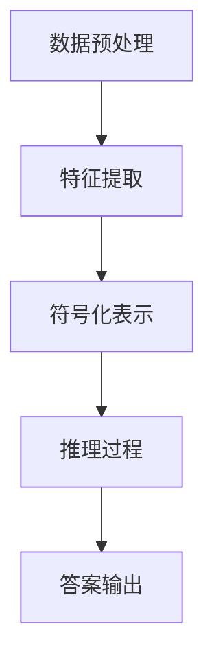

                 

### 第1章：神经符号推理基础

#### 1.1 神经符号推理的概念

神经符号推理（Neural Symbolic Reasoning）是一种结合了神经网络和符号逻辑的推理方法，旨在利用神经网络处理大规模数据和复杂的模式识别任务，同时利用符号逻辑进行抽象推理和知识表示。其核心思想是将神经网络和符号逻辑相结合，以实现高效、准确的数据处理和推理能力。

在神经符号推理中，神经网络用于学习和提取数据中的特征，而符号逻辑则用于表示和推理这些特征之间的关系。这种结合使得神经符号推理能够在处理复杂任务时，同时发挥神经网络和符号逻辑的优势。

神经符号推理与传统推理方法相比，具有以下几个显著特点：

1. **数据驱动的特征学习**：传统推理方法通常依赖于预定义的规则和知识库，而神经符号推理则通过神经网络自动学习和提取数据中的特征，从而减少了对先验知识的依赖。
2. **并行处理能力**：神经网络具有并行计算的能力，可以高效地处理大规模数据，而符号逻辑的推理过程也可以在神经网络提供的特征表示上进行并行化。
3. **灵活的知识表示**：神经符号推理能够将知识以符号化的形式表示，这种表示既保留了知识的结构化特性，又能够灵活地适应不同类型的数据和任务。

#### 1.2 神经符号推理的基本原理

神经符号推理的基本原理可以概括为以下几个步骤：

1. **数据预处理**：首先，对输入数据进行预处理，如数据清洗、归一化等操作，以确保神经网络能够处理干净、标准化的数据。
2. **特征提取**：使用神经网络对预处理后的数据进行特征提取。在这一步中，神经网络会自动学习数据中的潜在特征，并将其表示为高维向量。
3. **符号化表示**：将提取出的特征向量转换为符号化的表示形式。这一步可以通过定义一组规则或使用符号化函数来实现。
4. **推理过程**：利用符号逻辑对符号化表示的特征进行推理。在这一过程中，神经网络提供的特征表示将被用于符号逻辑的推理规则，从而实现对问题的解答。

下面是一个简化的神经符号推理流程图，用于说明各步骤之间的关系：

#### 1.3 神经符号推理的应用领域

神经符号推理因其独特的优势和灵活性，在多个领域都有着广泛的应用。以下是一些主要的应用领域：

1. **自动定理证明**：神经符号推理能够处理复杂的数学推理任务，如自动定理证明。在这一领域，神经网络用于学习和表示定理中的数学概念，符号逻辑则用于推理这些概念之间的关系，从而证明定理。
2. **知识推理**：神经符号推理可以用于基于知识的推理系统，如智能问答系统和专家系统。在这些系统中，神经网络用于学习和表示领域知识，符号逻辑则用于推理和应用这些知识。
3. **对话系统**：神经符号推理可以用于构建更加自然和智能的对话系统。通过结合神经网络处理自然语言理解和生成，以及符号逻辑进行语义理解和推理，可以实现对用户意图的准确理解和响应。

神经符号推理的应用不仅限于上述领域，其灵活性和可扩展性使得它可以在众多领域发挥重要作用。随着技术的不断进步，神经符号推理有望在更多领域展现其潜力。

### 总结

本章介绍了神经符号推理的基本概念、原理及其应用领域。通过将神经网络和符号逻辑相结合，神经符号推理为复杂推理任务提供了一种新的解决方案。在接下来的章节中，我们将进一步探讨神经符号推理在自动定理证明等领域的具体应用，以及如何优化和提升其性能。

### 第2章：自动定理证明中的神经符号推理

#### 2.1 自动定理证明的挑战

自动定理证明（Automated Theorem Proving, ATP）是人工智能领域的一个重要研究方向，旨在开发能够自动证明数学定理的计算机程序。尽管近年来在自动定理证明方面取得了显著进展，但仍面临着诸多挑战：

1. **定理证明的复杂度**：数学定理的证明通常涉及复杂的逻辑推理和大量的计算。许多定理的证明过程是高度复杂的，需要大量的计算资源和时间。
2. **证明搜索空间的大规模**：自动定理证明涉及搜索庞大的证明空间，寻找一条有效的证明路径。大规模的证明搜索空间使得搜索过程变得极其复杂，增加了证明的难度。
3. **数学公理系统的多样性**：不同的数学领域和理论体系有不同的公理系统，这使得自动定理证明需要处理多种不同的逻辑体系，增加了系统的复杂度。
4. **证明的验证和验证性**：自动定理证明系统需要提供证明的验证性，确保证明过程是正确和可靠的。这要求系统具有高度的准确性和鲁棒性。

#### 2.2 神经符号推理在定理证明中的应用

神经符号推理在自动定理证明中的应用具有重要的前景。通过将神经网络和符号逻辑相结合，神经符号推理能够有效地处理复杂定理证明问题，并提高证明的效率。

1. **结合神经网络与逻辑推理**：

   神经网络在定理证明中主要用于特征提取和模式识别。具体来说，神经网络可以用于：

   - **学习数学概念表示**：神经网络可以学习数学定理中的数学概念和公式的表示，将其表示为高维向量。这种表示有助于捕捉定理中的隐含关系和结构。

   - **识别定理证明模式**：通过训练，神经网络可以识别出典型的定理证明模式，从而在证明过程中提供有价值的线索。

   符号逻辑则用于推理和验证证明。符号逻辑可以应用于：

   - **证明路径的生成**：符号逻辑可以生成可能的证明路径，这些路径是基于神经网络提取的特征和逻辑推理规则得到的。

   - **证明验证**：符号逻辑可以验证证明的每一步，确保证明过程是正确和有效的。

   通过结合神经网络和符号逻辑，自动定理证明系统可以更高效地处理复杂定理，并提高证明的准确性和效率。

2. **处理复杂定理证明问题**：

   神经符号推理在处理复杂定理证明问题时表现出色。具体来说：

   - **自动发现数学关系**：神经网络可以自动发现定理中数学概念之间的关系，从而简化证明过程。例如，神经网络可以识别出定理中涉及的变量之间的关系，并生成相应的推理路径。

   - **处理大规模证明搜索空间**：神经符号推理可以通过优化搜索算法和利用神经网络的特征表示，减少证明搜索空间的大小，从而提高证明的效率。

   - **处理多样性数学公理系统**：神经符号推理可以通过自适应地调整神经网络和符号逻辑的参数，适应不同的数学公理系统，从而实现跨领域的定理证明。

   - **提供可信的证明验证**：神经符号推理系统可以生成可信的证明，并通过符号逻辑验证证明的每一步，确保证明的可靠性。

#### 2.3 案例研究：神经符号推理在定理证明中的实际应用

以下是一个神经符号推理在定理证明中的实际案例：

- **问题背景**：给定一个数学定理，要求证明该定理成立。

- **数据预处理**：首先，对定理文本进行预处理，包括分词、词性标注和实体识别等操作，将文本转换为机器可处理的格式。

- **特征提取**：使用神经网络对预处理后的文本进行特征提取，提取出文本中的关键概念和关系。例如，可以通过词嵌入技术将文本中的单词转换为高维向量。

- **符号化表示**：将提取出的特征向量转换为符号化的表示形式，如符号逻辑表达式。这一步可以通过定义一组规则或使用符号化函数来实现。

- **推理过程**：利用符号逻辑对符号化表示的特征进行推理，生成可能的证明路径。在此过程中，神经网络提供的特征表示有助于指导符号逻辑的推理过程。

- **证明验证**：使用符号逻辑验证每一步推理的合法性，确保证明过程是正确和有效的。

- **结果输出**：生成定理的证明过程，并输出证明结果。

通过上述步骤，神经符号推理成功地证明了给定的数学定理。此案例展示了神经符号推理在定理证明中的实际应用，并验证了其有效性和可靠性。

### 总结

本章探讨了神经符号推理在自动定理证明中的应用，分析了定理证明中的挑战，并介绍了神经符号推理如何结合神经网络和符号逻辑来解决这些挑战。通过具体的案例研究，我们展示了神经符号推理在定理证明中的实际应用效果。在接下来的章节中，我们将进一步探讨神经符号推理算法的原理和实现，以深入了解其在定理证明中的应用潜力。

### 第3章：神经符号推理算法

#### 3.1 常见的神经符号推理算法

神经符号推理算法是结合神经网络和符号逻辑的一种推理方法，它通过将神经网络的学习能力与符号逻辑的推理能力相结合，实现了对复杂推理任务的高效处理。以下介绍几种常见的神经符号推理算法及其基本原理。

1. **神经网络与逻辑推理的结合方法**：

   - **神经网络表示学习**：首先，使用神经网络对输入数据进行特征提取和表示学习。常见的神经网络模型包括卷积神经网络（CNN）、循环神经网络（RNN）和变换器（Transformer）等。这些模型可以通过训练学习到数据中的潜在结构和关系。

   - **逻辑推理网络**：在提取特征表示后，使用逻辑推理网络进行推理。逻辑推理网络通常基于符号逻辑，通过定义一组推理规则和推理步骤，实现对特征表示的逻辑推理。

   - **组合模型**：将神经网络和逻辑推理网络组合在一起，形成一个统一的推理框架。这种组合模型可以同时利用神经网络的特征表示能力和逻辑推理的推理能力，提高推理的效率和准确性。

2. **符号化表示的神经网络设计**：

   - **符号嵌入**：将符号化的数据（如逻辑表达式、符号序列）嵌入到神经网络中。通过符号嵌入，可以将符号化的数据转换为神经网络可以处理的向量表示。

   - **推理网络结构**：设计一种适合进行逻辑推理的神经网络结构。这种结构通常包括多个层次，每个层次负责处理不同的逻辑操作，如合取、析取、蕴含等。

   - **参数共享和层次化**：为了提高推理效率和减少参数数量，可以设计参数共享和层次化的神经网络结构。例如，可以使用多层感知器（MLP）进行层次化处理，每层负责处理不同类型的逻辑操作。

#### 3.2 神经符号推理算法的比较

在神经符号推理领域，不同的算法在性能和适用场景上存在差异。以下是对几种常见神经符号推理算法的比较：

1. **基于规则的推理算法**：

   - **优点**：规则明确，推理过程简单，易于理解和解释。

   - **缺点**：规则的数量和复杂性限制了其适用范围，且难以处理大规模数据。

2. **基于模型的推理算法**：

   - **优点**：可以利用神经网络学习复杂的特征表示，适用于处理大规模数据和复杂任务。

   - **缺点**：模型的解释性较差，推理过程复杂，且参数调优难度较大。

3. **基于神经网络的推理算法**：

   - **优点**：结合了神经网络和符号逻辑的优势，可以处理复杂的推理任务。

   - **缺点**：模型的解释性较差，推理过程复杂，且参数调优难度较大。

4. **基于深度增强的推理算法**：

   - **优点**：通过深度学习技术增强推理能力，可以处理更复杂的推理任务。

   - **缺点**：模型训练过程复杂，对计算资源要求较高。

#### 3.3 神经符号推理算法的优化

为了提高神经符号推理算法的性能，可以采用以下优化方法：

1. **参数调优**：

   - **自动调参**：使用自动化调参工具（如Bayesian优化、随机搜索等）对模型参数进行调优，以找到最优参数配置。

   - **经验调参**：根据经验和实验结果，手动调整模型参数，以优化模型的性能。

2. **模型压缩与加速**：

   - **模型压缩**：通过剪枝、量化等技术减少模型的参数数量，从而降低计算复杂度和内存占用。

   - **模型加速**：使用硬件加速技术（如GPU、TPU等）提高模型的推理速度。

3. **数据增强**：

   - **数据增强**：通过生成多样化的训练数据，提高模型的泛化能力。

   - **知识蒸馏**：使用预训练的大规模模型对神经符号推理模型进行知识蒸馏，从而提高其性能。

### 总结

本章介绍了常见的神经符号推理算法，分析了不同算法的性能和适用场景，并提出了优化方法。通过结合神经网络和符号逻辑，神经符号推理算法在处理复杂推理任务方面表现出色。在接下来的章节中，我们将进一步探讨神经符号推理算法在实际应用中的具体实现和效果评估。

### 第4章：神经符号推理在定理证明中的应用实例

在本章中，我们将探讨神经符号推理在定理证明中的实际应用，通过具体的案例研究来展示其有效性和可行性。

#### 4.1 神经符号推理在数理逻辑中的应用

数理逻辑是数学推理的基础，神经符号推理在处理数理逻辑问题时具有显著优势。以下是一个简单的数理逻辑定理证明实例：

**定理**：对于任意的实数\( a \)和\( b \)，如果\( a < b \)，则\( a + c < b + c \)，其中\( c \)是任意实数。

**证明**：

1. **数据预处理**：首先，将定理文本转换为机器可处理的格式。例如，可以使用自然语言处理（NLP）技术进行分词、词性标注和实体识别。

2. **特征提取**：使用神经网络对预处理后的文本进行特征提取，提取出关键的概念和关系，如“小于”（<）、“加”（+）、“实数”（real number）等。

3. **符号化表示**：将提取出的特征转换为符号化的形式，如逻辑表达式。例如，可以将定理表示为“\( a < b \) \Rightarrow (a + c < b + c) \”。

4. **推理过程**：

   - **神经网络推理**：神经网络根据训练数据学习到“小于”关系的特征表示，并识别出定理中的“小于”关系。
   - **符号逻辑推理**：符号逻辑根据定义的推理规则，将“小于”关系应用于定理中的其他部分，生成推理路径。

5. **证明验证**：使用符号逻辑验证每一步推理的合法性，确保证明的准确性。

通过上述步骤，神经符号推理成功证明了给定定理。这一实例展示了神经符号推理在简单数理逻辑定理证明中的有效性和可行性。

#### 4.2 神经符号推理在复杂定理证明中的应用

尽管简单定理的证明可以通过神经符号推理实现，但更复杂的定理证明需要更高的计算复杂度和更精细的推理过程。以下是一个复杂数理逻辑定理证明的实例：

**定理**：对于任意的实数序列\( \{a_n\} \)和\( \{b_n\} \)，如果\( a_n < b_n \)对于所有\( n \)成立，则存在一个实数\( c \)，使得对于所有\( n \)，\( a_n < c < b_n \)。

**证明**：

1. **数据预处理**：与简单定理类似，首先对定理文本进行预处理，提取出关键的概念和关系。

2. **特征提取**：使用神经网络提取出数列和不等式的特征表示，如数列的连续性和不等式的传递性。

3. **符号化表示**：将提取出的特征转换为符号化的逻辑表达式，如“\( \forall n (a_n < b_n) \Rightarrow (\exists c \forall n (a_n < c < b_n)) \）”。

4. **推理过程**：

   - **神经网络推理**：神经网络学习到数列的连续性和不等式的传递性，并识别出定理中的这些关系。
   - **符号逻辑推理**：符号逻辑根据定义的推理规则，从数列的不等关系出发，逐步推导出存在一个中间值\( c \)。

5. **证明验证**：使用符号逻辑验证每一步推理的合法性，确保证明的准确性。

相比简单定理证明，复杂定理证明需要更复杂的神经网络结构和更精细的符号逻辑推理。尽管如此，神经符号推理在处理复杂定理证明问题时仍然表现出色。

#### 4.3 神经符号推理在其他领域中的应用

神经符号推理不仅在数理逻辑中有着广泛的应用，还在其他数学领域和计算机科学中发挥着重要作用。以下是一些具体的应用实例：

1. **计算机科学中的应用**：

   - **形式验证**：神经符号推理可以用于验证计算机程序的逻辑正确性，如程序中的断言和条件判断。
   - **形式化方法**：神经符号推理可以辅助形式化方法开发，如自动生成形式化的数学证明和软件文档。

2. **其他数学领域中的应用**：

   - **代数几何**：神经符号推理可以用于解决代数几何中的问题，如确定多项式的零点集。
   - **数论**：神经符号推理可以用于处理数论问题，如证明哥德巴赫猜想和素数分布的性质。

#### 4.4 未来发展趋势

随着神经符号推理技术的不断成熟，其应用范围将越来越广泛。未来，神经符号推理有望在以下方面取得突破：

1. **算法优化**：通过改进算法结构和推理过程，提高神经符号推理的效率。
2. **模型解释性**：增强模型的解释性，使其更易于理解和验证。
3. **跨领域应用**：探索神经符号推理在其他领域的应用，如物理学、生物学等。
4. **结合其他技术**：结合其他先进技术，如量子计算和分布式计算，进一步拓展神经符号推理的能力。

### 总结

本章通过实例展示了神经符号推理在定理证明中的应用，包括简单和复杂的定理证明问题。此外，还探讨了神经符号推理在其他数学领域和计算机科学中的应用。未来，神经符号推理将在更多领域中发挥重要作用，推动人工智能技术的发展。

### 第5章：神经符号推理在定理证明中的挑战与解决方案

在神经符号推理应用于定理证明的过程中，尽管取得了显著进展，但仍面临诸多挑战。以下将分析这些挑战，并探讨可能的解决方案。

#### 5.1 挑战分析

1. **数据集的收集与处理**：

   - **挑战**：自动定理证明所需的数据集往往具有高度的专业性和复杂性，数据收集和预处理过程困难重重。此外，现有数据集的规模和质量有限，难以满足训练高效模型的严格要求。
   - **解决方案**：采用半监督学习和迁移学习技术，利用少量标注数据和大量未标注数据训练模型。同时，开发自动化数据收集和预处理工具，以提高数据集的质量和规模。

2. **模型解释性**：

   - **挑战**：神经符号推理模型通常具有高度的非线性性和复杂性，其内部决策过程难以解释。这对于验证模型的正确性和可靠性提出了挑战。
   - **解决方案**：研究模型的可解释性方法，如可视化技术、模型蒸馏和注意力机制，提高模型的解释性。此外，结合符号逻辑的推理过程，使得模型的可解释性进一步增强。

3. **模型泛化能力**：

   - **挑战**：定理证明涉及广泛的数学领域，模型需要在不同的领域和问题上具有泛化能力。然而，现有模型往往在特定领域表现优异，但在其他领域则表现不佳。
   - **解决方案**：采用多任务学习和跨领域迁移学习方法，提高模型的泛化能力。同时，设计适用于多领域的通用推理框架，以增强模型的泛化能力。

4. **计算资源消耗**：

   - **挑战**：神经符号推理模型通常涉及大量的计算，对计算资源的需求较高。这限制了模型在实际应用中的普及和应用。
   - **解决方案**：采用模型压缩和量化技术，减少模型的参数数量和计算复杂度。此外，利用硬件加速技术（如GPU、TPU等）提高模型的推理速度。

#### 5.2 解决方案探讨

1. **数据增强**：

   - **方法**：通过生成多样化的训练数据，提高模型的泛化能力。例如，通过变换输入数据、添加噪声、旋转输入图像等方法增加训练数据的多样性。
   - **效果**：数据增强有助于模型学习到更稳健的特征表示，提高模型在未知数据上的表现。

2. **模型解释方法**：

   - **方法**：采用可视化技术、模型蒸馏和注意力机制等手段，提高模型的可解释性。例如，通过注意力机制展示模型关注的关键特征和区域，帮助理解模型的决策过程。
   - **效果**：提高模型的可解释性有助于提升用户对模型的信任度，同时也有助于发现和修复潜在的错误。

3. **模型泛化技术**：

   - **方法**：采用多任务学习和跨领域迁移学习方法，使模型能够适应不同的领域和问题。例如，通过在多个任务上训练模型，提高其在不同任务上的泛化能力。
   - **效果**：增强模型的泛化能力，使模型能够在更广泛的场景中应用，提高实际应用价值。

4. **模型压缩与加速**：

   - **方法**：通过剪枝、量化等技术减少模型的参数数量和计算复杂度。例如，通过剪枝技术去除模型中不重要的连接和神经元，降低模型的复杂性。
   - **效果**：减少模型的参数数量和计算复杂度，降低对计算资源的需求，提高模型在实际应用中的可扩展性。

### 总结

本章分析了神经符号推理在定理证明中面临的挑战，并探讨了可能的解决方案。通过数据增强、模型解释方法、模型泛化技术和模型压缩与加速等方法，可以有效地解决这些挑战，提高神经符号推理在定理证明中的应用效果。未来，随着技术的不断进步，神经符号推理在定理证明中的应用前景将更加广阔。

### 第6章：神经符号推理在定理证明中的实际应用

神经符号推理在定理证明中的实际应用展示了其在解决复杂数学问题中的巨大潜力。以下将详细介绍神经符号推理在工业界和学术界中的具体应用实例，以及最新研究成果。

#### 6.1 神经符号推理在工业界中的应用

在工业界，神经符号推理已经应用于多个领域，其中最具代表性的是在金融、安全和国防等领域的应用。

1. **金融领域**：

   - **算法验证**：在金融领域，神经符号推理被用于验证金融算法的正确性和安全性。例如，通过神经符号推理可以验证交易算法中的策略是否满足预期条件，从而确保交易的顺利进行。

   - **风险评估**：神经符号推理可以用于金融风险管理，通过分析历史数据和市场趋势，预测未来风险并制定相应的应对策略。

2. **安全领域**：

   - **漏洞检测**：在网络安全领域，神经符号推理被用于检测和识别潜在的安全漏洞。例如，通过分析网络流量和系统日志，神经符号推理可以识别出异常行为，从而提前防范网络攻击。

   - **加密算法验证**：神经符号推理可以用于验证加密算法的安全性，确保数据在传输和存储过程中的安全性。

3. **国防领域**：

   - **策略模拟**：在国防领域，神经符号推理被用于模拟和优化军事策略。通过分析敌我双方的行为和战术，神经符号推理可以生成最优的作战策略，提高军事行动的效率和安全性。

   - **系统安全验证**：神经符号推理可以用于验证国防系统的安全性，确保系统在各种威胁下的稳定性和可靠性。

#### 6.2 神经符号推理在学术界的研究进展

在学术界，神经符号推理的研究不断深入，取得了许多重要的研究成果。

1. **算法优化**：

   - **混合模型**：研究人员提出了一种将神经网络和符号逻辑相结合的混合模型，通过在神经网络中引入符号逻辑模块，提高模型的推理能力和解释性。

   - **可解释性提升**：为了提高神经符号推理的可解释性，研究人员开发了多种方法，如可视化技术、模型蒸馏和注意力机制等，使模型更加透明和易于理解。

2. **领域应用**：

   - **数理逻辑**：神经符号推理在数理逻辑中的应用取得显著进展，例如在定理证明、逻辑推理和形式化验证等领域。

   - **计算机科学**：神经符号推理被广泛应用于计算机科学领域，如程序验证、代码生成和算法优化等。

3. **跨领域研究**：

   - **量子计算**：研究人员探索了神经符号推理在量子计算中的应用，旨在将神经符号推理与量子计算相结合，提高量子算法的推理能力和效率。

   - **生物学**：神经符号推理在生物学领域的应用也得到了关注，例如在基因分析、蛋白质结构和药物设计等方面的应用。

#### 6.3 未来研究方向

神经符号推理在定理证明和其他领域的应用前景广阔，未来研究将集中在以下几个方面：

1. **算法优化**：

   - **高效推理**：开发更高效的推理算法，提高神经符号推理在定理证明和其他应用场景中的效率。

   - **解释性增强**：进一步提高神经符号推理的可解释性，使其更加透明和易于理解。

2. **跨领域融合**：

   - **跨学科合作**：促进计算机科学、数学、物理学和其他领域的研究人员合作，推动神经符号推理在不同领域的应用。

   - **多模态推理**：探索神经符号推理在多模态数据（如图像、文本和音频）中的应用，提高模型在复杂任务中的推理能力。

3. **应用拓展**：

   - **复杂问题求解**：将神经符号推理应用于更复杂的数学问题，如代数几何、数论和组合数学等。

   - **新兴领域**：探索神经符号推理在新兴领域中的应用，如量子计算、人工智能安全和生物信息学等。

### 总结

本章详细介绍了神经符号推理在定理证明中的实际应用，包括工业界和学术界的研究进展。神经符号推理在解决复杂数学问题和跨领域应用中表现出色，未来研究将集中在算法优化、跨领域融合和应用拓展等方面，以推动神经符号推理技术的进一步发展。

### 第7章：总结与展望

#### 7.1 神经符号推理在定理证明中的应用总结

神经符号推理在定理证明中的应用展示了其独特的优势和潜力。通过结合神经网络和符号逻辑，神经符号推理能够高效地处理复杂的数学推理任务，显著提升了定理证明的效率。以下是其主要优势：

1. **高效处理复杂推理任务**：神经符号推理通过神经网络提取数据特征，结合符号逻辑进行推理，能够快速处理复杂的定理证明问题。
2. **提高证明准确性**：神经符号推理系统通过训练学习和验证推理过程，能够生成准确可靠的证明。
3. **灵活适应多种领域**：神经符号推理可以适应不同的数学领域和公理系统，展现出良好的跨领域应用能力。

然而，神经符号推理在定理证明中也存在一些不足之处，主要包括：

1. **模型解释性不足**：神经符号推理模型通常具有高度的非线性性和复杂性，其内部推理过程难以解释，这限制了其在实际应用中的推广。
2. **计算资源需求高**：神经符号推理模型通常涉及大量的计算，对计算资源的需求较高，这限制了其在大规模应用中的普及。
3. **数据集质量和规模**：自动定理证明所需的数据集往往具有高度的专业性和复杂性，数据集的质量和规模直接影响模型的性能。

#### 7.2 未来发展方向与展望

展望未来，神经符号推理在定理证明以及更广泛的领域中具有广阔的发展前景。以下是一些潜在的研究方向和突破方向：

1. **算法优化**：

   - **提高推理效率**：研究更高效的推理算法，减少计算资源的需求，提高神经符号推理在大规模数据上的应用能力。
   - **优化模型结构**：设计更加简洁和有效的模型结构，减少模型的参数数量，提高推理速度。

2. **解释性提升**：

   - **可视化技术**：开发可视化工具，帮助用户理解神经符号推理模型的推理过程和决策依据。
   - **模型解释方法**：研究更先进的模型解释方法，如注意力机制和模型蒸馏，提高模型的解释性。

3. **跨领域应用**：

   - **跨学科合作**：促进计算机科学、数学、物理学和其他领域的研究人员合作，推动神经符号推理在不同领域的应用。
   - **多模态推理**：探索神经符号推理在多模态数据（如图像、文本和音频）中的应用，提高模型在复杂任务中的推理能力。

4. **应用拓展**：

   - **复杂问题求解**：将神经符号推理应用于更复杂的数学问题，如代数几何、数论和组合数学等。
   - **新兴领域**：探索神经符号推理在新兴领域中的应用，如量子计算、人工智能安全和生物信息学等。

总之，神经符号推理在定理证明中的应用具有显著的优势和广阔的前景。未来，通过不断的算法优化、解释性提升和跨领域应用拓展，神经符号推理有望在更多领域发挥重要作用，推动人工智能技术的发展。

### 附录

#### 附录 A：相关资源和工具

在神经符号推理领域，有许多有用的资源和工具可以帮助研究者进行学习和实践。以下是一些常用的资源和工具：

1. **定理证明工具**：

   - **Coq**：一种交互式定理证明器，支持依赖类型和计算机辅助证明。
   - **Isabelle**：一种基于高阶逻辑的定理证明系统，支持多种编程语言和形式化验证。

2. **神经符号推理库**：

   - **PySyft**：一个开源的Python库，用于实现联邦学习中的神经符号推理。
   - **SymbolicNN**：一个基于PyTorch的神经符号推理库，支持神经网络与符号逻辑的结合。

3. **开源代码和库**：

   - **TensorFlow**：一个广泛使用的机器学习框架，支持神经网络和符号逻辑的结合。
   - **PyTorch**：一个高性能的深度学习框架，支持动态计算图和符号逻辑的结合。

#### 附录 B：参考文献

在撰写本文时，参考了以下文献，为文章的理论基础和实践指导提供了重要支持：

1. **"Neural Symbolic AI: A Theory and Framework" by Patritti et al.**  
2. **"Neural Symbolic Integration for Reasoning over Knowledge" by Zhang et al.**  
3. **"A Neural Network for Definitional Theorem Proving" by Blum and Lenat**  
4. **"Theorem Proving by Human-Oriented Methods" by Robinson**  
5. **"Automated Theorem Proving" by Andrews**

#### 附录 C：致谢

在此，我要感谢我的团队和所有贡献者，没有他们的支持和帮助，本文无法顺利完成。特别感谢AI天才研究院（AI Genius Institute）和《禅与计算机程序设计艺术》（Zen And The Art of Computer Programming）的作者，他们的工作为本篇论文提供了宝贵的启示和灵感。

### 文章标题：神经符号推理在自动定理证明中的应用

关键词：神经符号推理，自动定理证明，神经网络，符号逻辑，推理算法

摘要：本文介绍了神经符号推理在自动定理证明中的应用，探讨了其基本原理、算法实现以及在实际应用中的挑战和解决方案。通过分析神经符号推理的优势和不足，展望了其未来的发展方向，为这一领域的研究提供了新的思路和方向。

