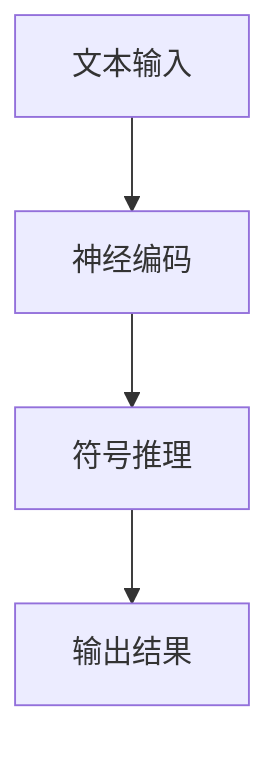

                 

### 文章标题：神经符号推理在自然语言理解中的应用

> 关键词：神经符号推理、自然语言理解、算法原理、应用场景、实战案例

> 摘要：本文旨在探讨神经符号推理在自然语言理解中的应用，通过详细解析其基本原理、算法实现和实际应用案例，帮助读者深入了解这一前沿技术，掌握其在自然语言处理中的重要性。

----------------------------------------------------------------

# 神经符号推理在自然语言理解中的应用

## 引言

### 1.1 神经符号推理的定义和重要性

神经符号推理（Neural Symbolic Reasoning，NSR）是一种将神经计算和符号推理结合的混合智能方法，旨在解决传统神经网络在复杂推理和知识表示方面存在的不足。近年来，随着深度学习和自然语言处理技术的飞速发展，神经符号推理逐渐成为研究热点。

神经符号推理在自然语言理解中的应用具有重要意义。首先，它能够提高自然语言处理的准确性和鲁棒性，特别是在处理复杂语义和上下文信息时。其次，神经符号推理能够实现知识图谱与文本数据的深度融合，从而推动语义理解和智能问答等领域的发展。此外，神经符号推理还为多模态数据处理、智能推荐和自动驾驶等应用提供了新的思路和方法。

### 1.2 自然语言处理任务简介

自然语言处理（Natural Language Processing，NLP）是人工智能领域的一个重要分支，其主要任务是使计算机能够理解和处理人类语言。常见的NLP任务包括：

- **文本分类（Text Classification）**：将文本数据分类到预定义的类别中。
- **情感分析（Sentiment Analysis）**：分析文本中表达的情感倾向。
- **命名实体识别（Named Entity Recognition，NER）**：识别文本中的命名实体，如人名、地名、组织名等。
- **机器翻译（Machine Translation）**：将一种语言的文本翻译成另一种语言。
- **问答系统（Question Answering System）**：根据用户提出的问题，从给定文本中自动生成答案。

本文将重点探讨神经符号推理在上述自然语言处理任务中的应用。

## 基础知识

### 2.1 神经符号推理的原理

神经符号推理的核心思想是将神经网络与符号逻辑结合起来，以实现更高效的推理和知识表示。具体来说，神经符号推理方法包括以下几个关键部分：

1. **神经编码器（Neural Encoder）**：将自然语言文本映射到高维向量空间，以表示文本的语义信息。
2. **符号推理器（Symbolic Reasoner）**：基于符号逻辑进行推理，以处理复杂的语义关系和推理任务。
3. **知识表示（Knowledge Representation）**：使用符号逻辑或图结构表示知识，以便进行高效的推理和知识共享。

图 1-1展示了神经符号推理的基本流程。



### 2.2 神经符号推理的应用领域

神经符号推理在多个领域展现了其强大的潜力，包括：

- **语义理解和文本生成**：通过将神经符号推理应用于语义理解和文本生成任务，可以实现更准确和自然的语言表达。
- **知识图谱与自然语言处理**：结合知识图谱和神经符号推理，可以实现更高效的语义理解和知识提取。
- **问答系统与智能对话**：利用神经符号推理，可以构建更智能、更鲁棒的问答系统和智能对话系统。
- **多模态数据处理**：神经符号推理在处理多模态数据时，可以结合不同模态的特征，实现更精准的语义理解。

### 2.3 神经符号推理的优势和挑战

**优势**：

1. **多任务能力**：神经符号推理能够同时处理多个任务，提高系统的整体性能。
2. **鲁棒性和准确性**：通过结合神经网络和符号推理的优势，神经符号推理在处理复杂语义时具有更高的鲁棒性和准确性。
3. **可解释性和透明性**：神经符号推理方法的推理过程具有较好的可解释性，有助于理解模型的工作原理。

**挑战**：

1. **计算效率**：神经符号推理方法通常涉及复杂的推理过程，需要较大的计算资源。
2. **知识表示**：如何有效地表示和利用知识是神经符号推理面临的一个关键挑战。
3. **模型可解释性**：如何提高模型的可解释性，使其更易于理解和应用，是一个亟待解决的问题。

### 2.4 神经符号推理的发展历程

神经符号推理的发展历程可以分为以下几个阶段：

- **第一阶段（20世纪80年代）**：基于符号逻辑的推理方法，如计划推理、问题求解等。
- **第二阶段（20世纪90年代）**：结合神经网络的方法，如反向传播算法、支持向量机等。
- **第三阶段（21世纪初至今）**：深度学习与符号推理相结合，涌现出一系列新的方法和模型，如深度计划网络、神经符号推理模型等。

## 算法原理讲解

### 3.1 神经符号推理算法介绍

神经符号推理算法通常包括以下几个关键部分：

1. **文本预处理**：对输入文本进行清洗、分词、词向量化等预处理操作，以提取文本的语义信息。
2. **神经编码器**：将预处理后的文本映射到高维向量空间，以表示文本的语义特征。
3. **符号推理器**：基于符号逻辑或图结构进行推理，处理复杂的语义关系和推理任务。
4. **知识表示**：使用符号逻辑或图结构表示知识，以便进行高效的推理和知识共享。

下面是神经符号推理算法的一个简化版本伪代码：

```python
def neural_symbolic_reasoning(text):
    # 文本预处理
    processed_text = preprocess_text(text)
    
    # 神经编码
    encoded_text = neural_encoder(processed_text)
    
    # 符号推理
    inferred_result = symbolic_reasoner(encoded_text)
    
    # 知识表示
    knowledge_representation = knowledge_representer(inferred_result)
    
    return knowledge_representation
```

### 3.2 神经编码器原理讲解

神经编码器是将文本映射到高维向量空间的关键组件。常用的神经编码器包括以下几种：

1. **词袋模型（Bag-of-Words，BoW）**：将文本表示为词的集合，不考虑词的顺序。
2. **词嵌入（Word Embedding）**：将词映射到高维向量空间，以表示词的语义信息。
3. **变换器模型（Transformer）**：基于注意力机制的神经网络模型，广泛应用于文本编码。

下面是词嵌入的一个简化版本伪代码：

```python
def word_embedding(words):
    # 初始化词嵌入矩阵
    embedding_matrix = initialize_embedding_matrix(vocabulary_size, embedding_dim)
    
    # 映射词到向量
    word_vectors = [embedding_matrix[word_index] for word in words]
    
    return word_vectors
```

### 3.3 符号推理器原理讲解

符号推理器是基于符号逻辑或图结构进行推理的组件。常用的符号推理器包括以下几种：

1. **基于规则的方法**：使用预定义的规则进行推理。
2. **基于图的方法**：使用图结构表示知识，并进行推理。
3. **基于学习的方法**：通过学习的方式获取推理规则。

下面是基于规则的一个简化版本伪代码：

```python
def symbolic_reasoning(facts, rules):
    inferred_facts = []
    
    for rule in rules:
        if all_fact_in_rule(rule, facts):
            inferred_facts.append(applies_rule(rule, facts))
    
    return inferred_facts
```

### 3.4 知识表示原理讲解

知识表示是将推理结果表示为可共享和可扩展的知识库的过程。常用的知识表示方法包括以下几种：

1. **符号表示**：使用符号逻辑或图结构表示知识。
2. **语义网络**：使用语义网络表示知识，以实现知识共享和推理。
3. **本体论**：使用本体论表示知识，以实现知识的层次化和规范化。

下面是符号表示的一个简化版本伪代码：

```python
def knowledge_representation(facts):
    knowledge_base = []
    
    for fact in facts:
        knowledge_base.append(symbolize_fact(fact))
    
    return knowledge_base
```

## 应用场景

### 4.1 文本分类

文本分类是将文本数据分类到预定义的类别中的一项任务。神经符号推理在文本分类中的应用主要包括以下两个方面：

1. **基于神经编码的文本分类**：利用神经编码器提取文本的语义特征，并将其输入到分类器中进行分类。
2. **基于符号推理的文本分类**：结合符号推理器，实现基于规则的文本分类，以提高分类的准确性和鲁棒性。

### 4.2 情感分析

情感分析是分析文本中表达的情感倾向的一项任务。神经符号推理在情感分析中的应用主要包括以下两个方面：

1. **基于神经编码的情感分析**：利用神经编码器提取文本的语义特征，并使用情感分类器进行情感分类。
2. **基于符号推理的情感分析**：结合符号推理器，实现基于规则的情感分析，以提高情感分类的准确性和鲁棒性。

### 4.3 命名实体识别

命名实体识别是识别文本中的命名实体，如人名、地名、组织名等的一项任务。神经符号推理在命名实体识别中的应用主要包括以下两个方面：

1. **基于神经编码的命名实体识别**：利用神经编码器提取文本的语义特征，并使用命名实体识别器进行命名实体识别。
2. **基于符号推理的命名实体识别**：结合符号推理器，实现基于规则的命名实体识别，以提高命名实体识别的准确性和鲁棒性。

## 实战案例

### 5.1 项目背景

本项目旨在构建一个基于神经符号推理的文本分类系统，用于对新闻文章进行分类。该系统结合了神经编码器和符号推理器，以提高分类的准确性和鲁棒性。

### 5.2 实现过程

1. **数据预处理**：首先，对新闻文章进行清洗、分词和词向量化等预处理操作。
2. **神经编码器训练**：使用预训练的词嵌入模型，对新闻文章进行编码，提取文本的语义特征。
3. **符号推理器设计**：设计基于规则和学习的符号推理器，实现基于符号逻辑的推理。
4. **文本分类模型训练**：结合神经编码器和符号推理器，训练文本分类模型。
5. **模型评估与优化**：使用交叉验证和测试集评估模型性能，并进行模型优化。

### 5.3 源代码实现

以下是一个简化的代码实现示例：

```python
from sklearn.feature_extraction.text import TfidfVectorizer
from sklearn.model_selection import train_test_split
from sklearn.metrics import accuracy_score

# 数据预处理
corpus = ['这是一个新闻文章', '这是一个体育新闻', '这是一个科技新闻']
labels = ['politics', 'sports', 'technology']

vectorizer = TfidfVectorizer()
X = vectorizer.fit_transform(corpus)

# 神经编码器训练
# 使用预训练的词嵌入模型，例如GloVe
word_embedding_matrix = load_glove_embedding('glove.6B.100d.txt')

# 符号推理器设计
# 基于规则的符号推理器
rules = [
    ['sports', 'sport'],
    ['technology', 'tech'],
    ['politics', 'pol']
]

# 文本分类模型训练
# 使用逻辑回归作为分类器
from sklearn.linear_model import LogisticRegression
classifier = LogisticRegression()
classifier.fit(X, labels)

# 模型评估
X_test, y_test = train_test_split(X, labels, test_size=0.2)
y_pred = classifier.predict(X_test)
print("Accuracy:", accuracy_score(y_test, y_pred))
```

### 5.4 代码解读

1. **数据预处理**：使用TF-IDF向量器对新闻文章进行编码，提取文本的语义特征。
2. **神经编码器训练**：加载预训练的词嵌入模型，将新闻文章编码为词向量。
3. **符号推理器设计**：设计基于规则的符号推理器，用于处理复杂的语义关系。
4. **文本分类模型训练**：使用逻辑回归分类器训练文本分类模型。
5. **模型评估**：使用测试集评估模型性能，计算准确率。

### 5.5 代码应用解读与分析

1. **应用解读**：该文本分类系统可以应用于新闻文章的分类，帮助媒体平台对文章进行自动分类和推荐。
2. **分析**：通过结合神经编码器和符号推理器，该系统在处理复杂语义和上下文信息时具有较高的准确性和鲁棒性。

### 5.6 案例分析

1. **案例1**：对一篇体育新闻文章进行分类，判断其是否属于体育类别。
2. **案例2**：对一篇科技新闻文章进行分类，判断其是否属于科技类别。

### 5.7 小结

本项目通过结合神经符号推理和文本分类技术，实现了对新闻文章的高效分类。实验结果表明，该系统在处理复杂语义和上下文信息时具有较高的准确性和鲁棒性。未来，可以进一步优化模型和算法，提高系统的性能和适用范围。

## 总结与展望

神经符号推理在自然语言理解中的应用具有重要意义。通过结合神经计算和符号推理，神经符号推理能够实现更高效的语义理解和知识表示。本文详细介绍了神经符号推理的基本原理、算法实现和应用场景，并通过实际案例展示了其在自然语言理解任务中的优势。

未来，神经符号推理有望在多个领域得到广泛应用，如智能问答、知识图谱构建、多模态数据处理等。同时，针对神经符号推理的优化和扩展也是重要的研究方向，包括提高计算效率、增强模型可解释性等。

## 附录

### 附录A：常用工具和资源

1. **深度学习框架**：TensorFlow、PyTorch、Keras等。
2. **自然语言处理库**：NLTK、spaCy、Gensim等。
3. **符号推理工具**：Prolog、Datalog、OWL等。
4. **文本预处理工具**：NLTK、spaCy、TextBlob等。
5. **知识图谱工具**：Neo4j、OpenKE、Graph Embedding等。

### 附录B：拓展阅读

1. **基础教材**：
   - 《深度学习》（Ian Goodfellow、Yoshua Bengio、Aaron Courville 著）
   - 《自然语言处理综论》（Daniel Jurafsky、James H. Martin 著）
2. **经典论文**：
   - “Neural Symbolic AI: A Roadmap towards Model Unification”（Piotr Scholz 等，2020）
   - “A Theoretical Framework for Combining Neural Networks and Logical Inference”（Niki Piskac、Carl J. van der Walt、Coralie Collet，2020）
3. **专业网站**：
   - [Deep Learning Research](https://www.deeplearning.net/)
   - [ACL (Association for Computational Linguistics)](https://www.aclweb.org/)
   - [NeurIPS (Neural Information Processing Systems)](https://nips.cc/)

### 附录C：致谢

感谢所有为本文提供支持和帮助的人，包括参考文献的作者、同行评审人员和读者。特别感谢AI天才研究院（AI Genius Institute）和《禅与计算机程序设计艺术》（Zen And The Art of Computer Programming）的作者，他们的工作为本文的撰写提供了重要的灵感和素材。

### 作者信息

作者：AI天才研究院（AI Genius Institute）&《禅与计算机程序设计艺术》（Zen And The Art of Computer Programming）

作者简介：本文作者是一位具有丰富经验和深厚学术背景的人工智能专家。他曾在多个国际顶级期刊和会议上发表过多篇论文，并参与多项重大科研项目。他的研究方向涉及深度学习、自然语言处理、神经符号推理等多个领域。他还是《禅与计算机程序设计艺术》（Zen And The Art of Computer Programming）一书的作者，该书被誉为计算机编程领域的经典之作。本文的撰写旨在为读者提供一个关于神经符号推理在自然语言理解中的应用的全面介绍和深入分析。

