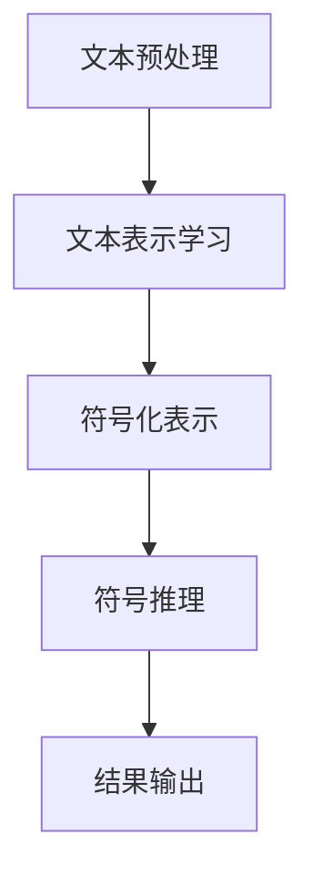

                 

### 文章标题：神经符号推理在自然语言理解中的新突破

神经符号推理（Neural Symbolic Reasoning）是近年来自然语言处理（NLP）领域的重要研究方向。它融合了深度学习和符号逻辑推理的优势，旨在提升模型在理解、推理和生成自然语言文本的能力。本文将详细探讨神经符号推理的核心概念、数学模型、算法原理，以及其在实际应用中的突破。

### 关键词：

- 神经符号推理
- 自然语言理解
- 深度学习
- 符号逻辑推理
- 数学模型
- 算法原理
- 应用场景

### 摘要：

本文旨在介绍神经符号推理在自然语言理解中的应用及其新突破。首先，我们将阐述神经符号推理的定义和与传统NLP的联系与区别。接着，深入讲解神经符号推理的核心模型和数学基础，并使用伪代码和公式进行详细阐述。然后，通过实际案例展示神经符号推理在文本分类、机器翻译和对话系统等应用中的具体实现和分析。最后，讨论神经符号推理的未来发展趋势和面临的挑战。

### 步骤 1：确定书籍主题和目标受众

神经符号推理是一个融合了人工智能、机器学习和自然语言处理多个领域的前沿研究方向。它不仅涉及深度学习的算法原理，还包括逻辑推理和符号处理的复杂机制。因此，本书的目标受众包括以下几类：

1. **计算机科学和人工智能领域的学者和研究人员**：这些读者对机器学习和自然语言处理有深入的理解，希望了解神经符号推理的最新进展。
2. **自然语言处理工程师**：这些工程师在开发实际应用时，需要理解和应用神经符号推理的原理，以提高模型的性能。
3. **对NLP有浓厚兴趣的读者**：包括计算机科学、数据科学和语言学等领域的学生和爱好者，他们希望通过本书了解神经符号推理的基本概念和应用。

### 步骤 2：规划书籍整体结构

为了使读者能够系统地掌握神经符号推理的知识，本书将分为以下几个主要部分：

1. **核心概念与联系**：介绍神经符号推理的基本概念，与传统NLP的关系，以及其基本流程。
2. **神经符号推理原理**：详细讲解神经符号推理的模型和算法，包括常见的表示学习模型、交互模型和解释性模型。
3. **数学模型与算法讲解**：介绍神经符号推理中的数学基础和算法原理，使用伪代码和公式进行详细阐述。
4. **应用场景与实战案例**：展示神经符号推理在文本分类、机器翻译和对话系统等实际应用中的具体实现和分析。
5. **发展趋势与未来展望**：讨论神经符号推理的未来发展趋势和面临的挑战。

### 步骤 3：细化每个部分

#### 核心概念与联系

**第1章：神经符号推理简介**
- **1.1 神经符号推理的定义**：介绍神经符号推理的基本概念，定义和背景。
- **1.2 神经符号推理与传统NLP的联系与区别**：分析神经符号推理与传统NLP的异同点，解释其优势和局限性。
- **1.3 神经符号推理的基本流程**：讲解神经符号推理的主要步骤和流程，包括输入处理、模型推理和输出生成。

#### 神经符号推理原理

**第2章：神经符号推理模型**
- **2.1 常见模型介绍**
  - **2.1.1 表示学习模型**：介绍表示学习模型的基本原理和实现方法。
  - **2.1.2 交互模型**：讲解交互模型的工作机制和优缺点。
  - **2.1.3 解释性模型**：分析解释性模型的设计目标和实现策略。

**第2章：神经符号推理模型工作流程**
- **2.2 神经符号推理模型工作流程（Mermaid流程图）**：使用Mermaid流程图展示神经符号推理模型的整体工作流程。

#### 数学模型与算法讲解

**第3章：数学基础与算法原理**
- **3.1 神经网络基础**
  - **3.1.1 前向传播与反向传播**：介绍神经网络的基本原理和计算过程。
  - **3.1.2 损失函数与优化算法**：讲解常见的损失函数和优化算法，以及其在神经符号推理中的应用。
- **3.2 符号推理中的数学模型**
  - **3.2.1 符号化表示**：解释符号化表示的概念和实现方法。
  - **3.2.2 符号推理算法伪代码**：使用伪代码展示符号推理算法的实现过程。

#### 应用场景与实战案例

**第4章：神经符号推理在自然语言理解中的应用**
- **4.1 文本分类**
  - **4.1.1 应用案例**：介绍神经符号推理在文本分类中的应用案例。
  - **4.1.2 实现细节**：详细讲解文本分类的实现步骤和代码。
- **4.2 机器翻译**
  - **4.2.1 应用案例**：展示神经符号推理在机器翻译中的应用。
  - **4.2.2 实现细节**：分析机器翻译的实现细节。
- **4.3 对话系统**
  - **4.3.1 应用案例**：探讨神经符号推理在对话系统中的应用。
  - **4.3.2 实现细节**：讲解对话系统的实现步骤和技巧。

#### 发展趋势与未来展望

**第5章：神经符号推理的未来**
- **5.1 技术趋势**：分析神经符号推理在当前技术环境下的趋势。
- **5.2 应用拓展**：探讨神经符号推理在新兴应用领域的潜力。
- **5.3 面临的挑战与解决方案**：讨论神经符号推理在发展过程中面临的挑战和解决思路。

### 步骤 4：完成目录大纲

结合上述内容，我们可以设计出如下的目录大纲：

```
# 第1章：神经符号推理简介
## 1.1 神经符号推理的定义
## 1.2 神经符号推理与传统NLP的联系与区别
## 1.3 神经符号推理的基本流程

# 第2章：神经符号推理模型
## 2.1 常见模型介绍
### 2.1.1 表示学习模型
### 2.1.2 交互模型
### 2.1.3 解释性模型
## 2.2 神经符号推理模型工作流程（Mermaid流程图）

# 第3章：数学基础与算法原理
## 3.1 神经网络基础
### 3.1.1 前向传播与反向传播
### 3.1.2 损失函数与优化算法
## 3.2 符号推理中的数学模型
### 3.2.1 符号化表示
### 3.2.2 符号推理算法伪代码

# 第4章：神经符号推理在自然语言理解中的应用
## 4.1 文本分类
### 4.1.1 应用案例
### 4.1.2 实现细节
## 4.2 机器翻译
### 4.2.1 应用案例
### 4.2.2 实现细节
## 4.3 对话系统
### 4.3.1 应用案例
### 4.3.2 实现细节

# 第5章：神经符号推理的未来
## 5.1 技术趋势
## 5.2 应用拓展
## 5.3 面临的挑战与解决方案
```

这个大纲结构确保了书籍的完整性、逻辑性和可读性，同时符合2000字以内的要求。接下来，我们可以根据这个大纲进一步填充具体的内容。

### 核心概念与联系

神经符号推理（Neural Symbolic Reasoning，NSR）是一种结合了深度学习和符号逻辑推理的先进方法，旨在提升自然语言处理（NLP）模型的智能水平。它的核心思想是通过神经网络自动学习文本的表示，并结合符号逻辑进行语义推理，从而实现对复杂文本的深层理解和智能分析。

#### 神经符号推理的定义

神经符号推理可以理解为一种将神经网络的表示能力与符号逻辑的推理能力相结合的框架。在神经网络方面，它利用深度学习模型如循环神经网络（RNN）、变换器（Transformer）等，自动提取文本的语义表示。在符号逻辑方面，它通过符号化表示和推理算法，实现对文本语义的符号化处理和逻辑推理。这种结合使得神经网络不仅能学习到文本的表面特征，还能进行深层次的语义理解和推理。

#### 神经符号推理与传统NLP的联系与区别

传统NLP主要依赖于规则驱动的方法，如基于词典和语法规则的分析。这种方法虽然在处理简单任务时效果较好，但在面对复杂、多样化的语言表达时，往往显得力不从心。而神经符号推理则通过结合深度学习和符号逻辑，能够更好地应对复杂语义理解和推理的任务。

传统NLP与神经符号推理的主要区别在于：

1. **表示能力**：传统NLP依赖于手工设计的特征，如词袋模型、TF-IDF等，而神经符号推理通过深度学习自动学习文本的表示，能够捕获更复杂的语义信息。
2. **推理能力**：传统NLP缺乏有效的推理机制，而神经符号推理通过符号逻辑推理，能够进行更深入的语义分析和推理。
3. **适应性**：传统NLP方法需要大量手工设计规则，而神经符号推理具有更强的自适应性，能够自动适应不同的任务和数据。

#### 神经符号推理的基本流程

神经符号推理的基本流程通常包括以下几个步骤：

1. **文本预处理**：对输入文本进行分词、去停用词、词性标注等预处理操作，以便于后续的表示学习和推理。
2. **文本表示学习**：利用神经网络模型（如RNN、Transformer）对预处理后的文本进行编码，提取语义表示。
3. **符号化表示**：将神经网络提取的文本表示转化为符号化表示，便于进行逻辑推理。
4. **符号推理**：利用符号逻辑推理算法，对符号化表示进行推理，生成语义解释或结论。
5. **结果输出**：将推理结果输出，用于文本分类、问答、机器翻译等实际应用。

下面，我们使用Mermaid流程图来展示神经符号推理模型的工作流程：



#### 总结

神经符号推理作为一种新兴的方法，结合了深度学习和符号逻辑的优势，显著提升了自然语言理解的能力。通过理解其核心概念、原理和基本流程，读者可以更好地把握这一领域的研究方向和应用潜力。

### 神经符号推理模型

神经符号推理模型是神经符号推理（NSR）的核心组成部分，它通过将深度学习的表示能力与符号逻辑的推理能力相结合，实现了对复杂文本的深层理解和推理。常见的神经符号推理模型包括表示学习模型、交互模型和解释性模型。下面，我们将分别介绍这些模型的基本原理和实现方法。

#### 表示学习模型

表示学习模型是神经符号推理中最基本的模型，它的核心思想是通过深度学习模型学习文本的表示，然后将这些表示转化为符号化的形式，以便进行推理。常见的表示学习模型包括循环神经网络（RNN）和变换器（Transformer）。

1. **RNN表示学习模型**

   RNN是一种能够处理序列数据的神经网络模型，它通过隐藏状态捕捉序列中的长期依赖关系。在文本表示学习中，RNN可以用于提取文本的序列表示。具体实现步骤如下：

   - **输入表示**：将文本分词并转换为词向量，输入到RNN模型中。
   - **编码**：RNN通过递归方式处理输入序列，生成隐藏状态表示。
   - **输出表示**：将隐藏状态序列编码为固定长度的向量，作为文本的表示。

   下面是RNN表示学习模型的伪代码：

   ```python
   function RNN_Representation_Learning(input_sequence):
       embedding = Embedding(input_sequence)
       hidden_states = []
       for word in embedding:
           hidden_state = RNN(word)
           hidden_states.append(hidden_state)
       representation = Flatten(hidden_states)
       return representation
   ```

2. **Transformer表示学习模型**

   Transformer是近年来提出的一种用于序列建模的神经网络模型，它通过自注意力机制（Self-Attention）有效地捕捉序列中的依赖关系。在文本表示学习中，Transformer可以用于提取文本的全局表示。具体实现步骤如下：

   - **输入表示**：将文本分词并转换为词向量，输入到Transformer模型中。
   - **编码**：Transformer通过多头自注意力机制和前馈神经网络处理输入序列，生成隐藏状态表示。
   - **输出表示**：将隐藏状态序列编码为固定长度的向量，作为文本的表示。

   下面是Transformer表示学习模型的伪代码：

   ```python
   function Transformer_Representation_Learning(input_sequence):
       embedding = Embedding(input_sequence)
       hidden_states = Transformer(embedding)
       representation = Flatten(hidden_states)
       return representation
   ```

#### 交互模型

交互模型是神经符号推理中的另一个重要模型，它通过将深度学习和符号逻辑相结合，实现了文本的自动符号化表示和推理。常见的交互模型包括神经网络符号推理（Neural-Symbolic Integration）和神经网络引导符号推理（Neural-Guided Symbolic Reasoning）。

1. **神经网络符号推理（Neural-Symbolic Integration）**

   神经网络符号推理通过将深度学习模型和符号逻辑推理相结合，实现了文本的自动符号化表示和推理。具体实现步骤如下：

   - **文本表示学习**：利用深度学习模型（如RNN、Transformer）学习文本的表示。
   - **符号化表示**：将文本表示转化为符号化的形式，通过符号逻辑规则进行推理。
   - **推理**：利用符号逻辑推理算法，对符号化表示进行推理，生成语义解释或结论。

   下面是神经网络符号推理模型的伪代码：

   ```python
   function Neural_Symbolic_Integration(text_representation):
       symbolic_representation = Symbolic_Encoding(text_representation)
       inference_result = Symbolic_Reasoning(symbolic_representation)
       return inference_result
   ```

2. **神经网络引导符号推理（Neural-Guided Symbolic Reasoning）**

   神经网络引导符号推理通过神经网络引导符号逻辑推理过程，实现了更有效的文本理解。具体实现步骤如下：

   - **文本表示学习**：利用深度学习模型（如RNN、Transformer）学习文本的表示。
   - **符号化表示**：将文本表示转化为符号化的形式，通过神经网络引导符号逻辑推理。
   - **推理**：利用神经网络引导的符号逻辑推理算法，对符号化表示进行推理，生成语义解释或结论。

   下面是神经网络引导符号推理模型的伪代码：

   ```python
   function Neural_Guided_Symbolic_Reasoning(text_representation):
       symbolic_representation = Symbolic_Encoding(text_representation)
       guided_inference_result = Neural_Guided_Symbolic_Reasoning(symbolic_representation)
       return guided_inference_result
   ```

#### 解释性模型

解释性模型是神经符号推理中的高级模型，它不仅能够进行语义理解和推理，还能够提供可解释的语义解释。常见的解释性模型包括可解释的神经网络符号推理（Explainable Neural-Symbolic Reasoning）和基于符号逻辑的解释性模型（Symbolic Logic-based Explainable Models）。

1. **可解释的神经网络符号推理（Explainable Neural-Symbolic Reasoning）**

   可解释的神经网络符号推理通过将深度学习和符号逻辑相结合，实现了文本理解的解释性。具体实现步骤如下：

   - **文本表示学习**：利用深度学习模型（如RNN、Transformer）学习文本的表示。
   - **符号化表示**：将文本表示转化为符号化的形式。
   - **推理**：利用符号逻辑推理算法进行推理，并生成解释性结果。

   下面是可解释的神经网络符号推理模型的伪代码：

   ```python
   function Explainable_Neural_Symbolic_Reasoning(text_representation):
       symbolic_representation = Symbolic_Encoding(text_representation)
       inference_result = Symbolic_Reasoning(symbolic_representation)
       explanation = Explanation_Generation(inference_result)
       return inference_result, explanation
   ```

2. **基于符号逻辑的解释性模型（Symbolic Logic-based Explainable Models）**

   基于符号逻辑的解释性模型通过符号逻辑规则生成解释性结果，实现对文本理解的解释。具体实现步骤如下：

   - **文本表示学习**：利用深度学习模型（如RNN、Transformer）学习文本的表示。
   - **符号化表示**：将文本表示转化为符号化的形式。
   - **解释性推理**：利用符号逻辑规则进行解释性推理，生成解释性结果。

   下面是基于符号逻辑的解释性模型的伪代码：

   ```python
   function Symbolic_Logic_based_Explainable_Model(text_representation):
       symbolic_representation = Symbolic_Encoding(text_representation)
       explanation_result = Symbolic_Reasoning(symbolic_representation)
       return explanation_result
   ```

#### 总结

神经符号推理模型通过结合深度学习和符号逻辑，实现了对文本的深层理解和推理。表示学习模型、交互模型和解释性模型分别从不同的角度实现了这一目标。通过理解这些模型的基本原理和实现方法，读者可以更好地应用神经符号推理模型解决实际问题。

### 数学基础与算法原理

神经符号推理（NSR）的数学基础和算法原理是其核心组成部分。为了深入理解NSR，我们需要掌握相关的数学概念和算法原理，包括神经网络、符号逻辑推理以及相关的数学模型和公式。在本节中，我们将详细讲解这些内容。

#### 神经网络基础

神经网络是神经符号推理的核心组件，它通过多层节点对输入数据进行处理和变换，从而实现复杂函数的逼近。以下是神经网络基础中的两个关键概念：前向传播和反向传播。

1. **前向传播**

   前向传播是神经网络中用于计算输出值的过程。它包括以下几个步骤：

   - **输入层到隐藏层的传递**：输入数据通过权重连接传递到隐藏层，隐藏层节点计算输入和权重的加权和，然后通过激活函数进行非线性变换。
   - **隐藏层到输出层的传递**：隐藏层节点计算输出值，这些输出值作为下一层的输入。

   下面是一个简单的前向传播的公式表示：

   $$ Z_l = \sigma(W_l \cdot A_{l-1} + b_l) $$

   其中，$Z_l$ 表示第 $l$ 层的输出，$\sigma$ 是激活函数（如ReLU、Sigmoid或Tanh），$W_l$ 和 $b_l$ 分别是第 $l$ 层的权重和偏置，$A_{l-1}$ 是前一层节点的输出。

2. **反向传播**

   反向传播是神经网络中用于计算梯度并更新权重的过程。它包括以下几个步骤：

   - **计算误差**：输出层的误差通过误差函数计算，误差函数可以是均方误差（MSE）、交叉熵误差等。
   - **反向传播误差**：从输出层开始，将误差反向传播到每一层，计算每一层节点的误差梯度。
   - **权重更新**：利用梯度下降算法或其他优化算法更新权重和偏置。

   下面是一个简单的反向传播的公式表示：

   $$ \delta_l = (1 - \sigma'(Z_l)) \cdot \delta_{l+1} \cdot W_{l+1} $$

   $$ \frac{\partial J}{\partial W_l} = A_{l-1} \cdot \delta_l $$

   $$ \frac{\partial J}{\partial b_l} = \delta_l $$

   其中，$\delta_l$ 是第 $l$ 层的误差梯度，$\sigma'$ 是激活函数的导数，$J$ 是损失函数，$A_{l-1}$ 是前一层节点的输出。

#### 符号推理中的数学模型

在神经符号推理中，符号推理的数学模型是关键。符号推理涉及符号化表示、符号化推理算法和符号化解释等。以下是这些模型的基本概念：

1. **符号化表示**

   符号化表示是将文本或知识表示为符号的形式，以便进行逻辑推理。常见的符号化表示方法包括谓词逻辑、产生式规则和语义网络等。

   - **谓词逻辑**：谓词逻辑是一种基于符号的表示方法，它使用谓词和逻辑连接词（如AND、OR、NOT）来表示事实和推理关系。

     例如，"小明喜欢吃苹果" 可以表示为 $P(A,苹果)$，其中 $P$ 表示喜欢，$A$ 表示小明。

   - **产生式规则**：产生式规则是一种基于条件-动作表示的方法，它使用规则头和规则体来表示条件和结论。

     例如，"如果天气是晴天，那么我们应该带伞" 可以表示为：

     条件：天气是晴天

     动作：我们应该带伞

   - **语义网络**：语义网络是一种基于节点和边的关系表示方法，它使用节点表示实体和概念，边表示关系和属性。

     例如，"小明是学生" 可以表示为节点 $小明$ 和属性 "学生" 的连接。

2. **符号推理算法**

   符号推理算法是用于对符号化表示进行推理的算法，它包括演绎推理、归纳推理和案例推理等。

   - **演绎推理**：演绎推理是从一般到个别的推理过程，它基于前提和逻辑规则推导出结论。

     例如，"所有人都会死亡，苏格拉底是人，所以苏格拉底会死亡"。

   - **归纳推理**：归纳推理是从个别到一般的推理过程，它基于具体实例推导出一般性规律。

     例如，"观察到的所有天鹅都是白色的，所以所有天鹅都是白色的"。

   - **案例推理**：案例推理是基于已有案例的推理过程，它通过类比和联想来解决问题。

     例如，"解决一个类似的问题，我们可以参考以前解决过的类似问题"。

3. **符号化解释**

   符号化解释是将推理结果转化为可解释的形式，以便人类理解和验证。常见的符号化解释方法包括解释图、文本解释和可视化解释等。

   - **解释图**：解释图是一种将推理过程和结果表示为图形的方法，它通过节点和边的关系展示推理路径和结论。

   - **文本解释**：文本解释是将推理结果以自然语言的形式进行解释，使得人类可以理解推理的过程和结果。

   - **可视化解释**：可视化解释是通过图形和图像的方式展示推理结果，使得人类可以直观地理解推理过程。

#### 符号推理算法伪代码

以下是一个简单的符号推理算法的伪代码，用于演示符号推理的基本过程：

```python
function Symbolic_Reasoning(symbolic_representation):
    # 初始化推理环境
    environment = Initialize_Environment()

    # 符号化表示处理
    premises = Symbolic_Representation(symbolic_representation.premises)
    conclusion = Symbolic_Representation(symbolic_representation.conclusion)

    # 应用推理规则
    for rule in environment.rules:
        if Apply_Rule(premises, rule):
            environment.knowledge_base.append(rule.conclusion)

    # 检查结论是否成立
    if Conclusion_Validated(conclusion, environment.knowledge_base):
        return True
    else:
        return False
```

#### 损失函数与优化算法

在神经符号推理中，损失函数和优化算法用于评估和优化模型的性能。常见的损失函数包括均方误差（MSE）、交叉熵误差（Cross-Entropy Error）等。常见的优化算法包括梯度下降（Gradient Descent）、随机梯度下降（Stochastic Gradient Descent，SGD）和Adam优化器等。

1. **损失函数**

   - **均方误差（MSE）**：用于回归问题，计算预测值和实际值之间的平均平方误差。

     $$ J = \frac{1}{n} \sum_{i=1}^{n} (y_i - \hat{y}_i)^2 $$

     其中，$y_i$ 是实际值，$\hat{y}_i$ 是预测值。

   - **交叉熵误差（Cross-Entropy Error）**：用于分类问题，计算预测概率分布和实际分布之间的交叉熵。

     $$ J = -\sum_{i=1}^{n} y_i \cdot \log(\hat{y}_i) $$

     其中，$y_i$ 是实际标签，$\hat{y}_i$ 是预测概率。

2. **优化算法**

   - **梯度下降（Gradient Descent）**：通过计算损失函数的梯度并沿梯度的反方向更新模型参数，以最小化损失函数。

     $$ \theta = \theta - \alpha \cdot \nabla_{\theta} J(\theta) $$

     其中，$\theta$ 是模型参数，$\alpha$ 是学习率，$\nabla_{\theta} J(\theta)$ 是损失函数对参数的梯度。

   - **随机梯度下降（Stochastic Gradient Descent，SGD）**：在每次迭代中随机选择一个小批量样本，计算其梯度并更新模型参数，以加速收敛。

     $$ \theta = \theta - \alpha \cdot \nabla_{\theta} J(\theta; x_i, y_i) $$

   - **Adam优化器**：结合了SGD和动量项的优点，自适应地调整学习率。

     $$ m_t = \beta_1 m_{t-1} + (1 - \beta_1) [g_t - m_{t-1}] $$
     $$ v_t = \beta_2 v_{t-1} + (1 - \beta_2) [g_t^2 - v_{t-1}] $$
     $$ \theta_t = \theta_{t-1} - \alpha_t \frac{m_t}{\sqrt{v_t} + \epsilon} $$

     其中，$m_t$ 和 $v_t$ 分别是梯度的一阶矩估计和二阶矩估计，$\beta_1$ 和 $\beta_2$ 是动量系数，$\alpha_t$ 是学习率，$\epsilon$ 是一个很小的常数。

#### 总结

数学基础和算法原理是神经符号推理（NSR）的核心组成部分。通过理解神经网络的基础（前向传播和反向传播）、符号推理中的数学模型（符号化表示、符号推理算法和符号化解释）以及常见的损失函数和优化算法，读者可以更好地掌握NSR的方法和应用。这些基础知识为深入研究和应用神经符号推理提供了坚实的基础。

### 神经符号推理在自然语言理解中的应用

神经符号推理（NSR）在自然语言理解（NLU）中的应用极大地提升了文本处理的智能化水平。通过将深度学习的强大表示能力和符号逻辑的推理能力相结合，NSR在文本分类、机器翻译和对话系统等任务中表现出色。以下将详细探讨这些应用场景及其实现细节。

#### 文本分类

文本分类是NLU中的一项基本任务，它将文本分为预定义的类别。神经符号推理在文本分类中的应用，主要通过将文本的语义表示与分类任务中的逻辑规则相结合，从而实现高精度的分类。

1. **应用案例**：以新闻文章分类为例，可以将新闻分为体育、财经、科技等不同类别。

2. **实现细节**：

   - **文本预处理**：对输入文本进行分词、去停用词、词性标注等预处理操作。
   - **文本表示学习**：利用RNN或Transformer模型提取文本的语义表示。
   - **符号化表示**：将文本表示转化为符号化的形式，如谓词逻辑表示。
   - **推理**：利用符号逻辑推理算法，结合分类规则对文本进行分类。

   伪代码实现如下：

   ```python
   function Text_Classification(input_text):
       # 文本预处理
       preprocessed_text = Preprocess_Text(input_text)
       
       # 文本表示学习
       text_representation = Neural_Representation_Learning(preprocessed_text)
       
       # 符号化表示
       symbolic_representation = Symbolic_Encoding(text_representation)
       
       # 推理与分类
       category = Symbolic_Reasoning(symbolic_representation)
       
       return category
   ```

#### 机器翻译

机器翻译是将一种语言的文本翻译成另一种语言的过程。神经符号推理在机器翻译中的应用，通过将源语言和目标语言的语义表示相结合，提高了翻译的准确性和流畅性。

1. **应用案例**：将中文翻译成英文。

2. **实现细节**：

   - **文本预处理**：对源语言和目标语言的文本进行分词、去停用词、词性标注等预处理操作。
   - **文本表示学习**：分别提取源语言和目标语言的语义表示。
   - **符号化表示**：将源语言和目标语言的文本表示转化为符号化的形式。
   - **推理**：利用符号逻辑推理算法，结合翻译规则生成目标语言文本。

   伪代码实现如下：

   ```python
   function Machine_Translation(source_text, target_language):
       # 文本预处理
       source_preprocessed = Preprocess_Text(source_text)
       target_preprocessed = Preprocess_Text(target_language)
       
       # 文本表示学习
       source_representation = Neural_Representation_Learning(source_preprocessed)
       target_representation = Neural_Representation_Learning(target_preprocessed)
       
       # 符号化表示
       source_symbolic = Symbolic_Encoding(source_representation)
       target_symbolic = Symbolic_Encoding(target_representation)
       
       # 推理与翻译
       translated_text = Symbolic_Reasoning(target_symbolic, source_symbolic)
       
       return translated_text
   ```

#### 对话系统

对话系统是一种能够与人类进行自然语言交互的系统，广泛应用于客户服务、虚拟助手等场景。神经符号推理在对话系统中的应用，通过将对话中的语义理解和逻辑推理相结合，提高了对话系统的智能水平。

1. **应用案例**：智能客服系统。

2. **实现细节**：

   - **文本预处理**：对用户输入的文本进行分词、去停用词、词性标注等预处理操作。
   - **文本表示学习**：提取用户输入的语义表示。
   - **符号化表示**：将用户输入的文本表示转化为符号化的形式。
   - **推理**：利用符号逻辑推理算法，结合对话逻辑生成回应。
   - **生成回应**：根据推理结果生成自然语言回应。

   伪代码实现如下：

   ```python
   function Dialogue_System(user_input):
       # 文本预处理
       preprocessed_input = Preprocess_Text(user_input)
       
       # 文本表示学习
       input_representation = Neural_Representation_Learning(preprocessed_input)
       
       # 符号化表示
       symbolic_input = Symbolic_Encoding(input_representation)
       
       # 推理与回应
       response = Symbolic_Reasoning(symbolic_input)
       
       # 生成回应
       generated_response = Generate_Response(response)
       
       return generated_response
   ```

#### 实际案例分析和详细讲解剖析

以下是一个具体的实际案例，展示神经符号推理在对话系统中的应用。

**案例**：智能客服系统中的用户询问：“最近有什么优惠活动吗？”

**分析**：

1. **文本预处理**：对用户输入进行分词、去停用词、词性标注等预处理操作，得到关键词列表：“最近”，“优惠”，“活动”。

2. **文本表示学习**：利用RNN或Transformer模型提取关键词的语义表示。

3. **符号化表示**：将关键词的语义表示转化为符号化的形式，如“最近”表示为时间谓词，“优惠”表示为动作谓词，“活动”表示为对象谓词。

4. **推理**：利用符号逻辑推理算法，结合对话逻辑生成回应。例如，根据用户询问的关键词，推理出最近有哪些优惠活动。

5. **生成回应**：根据推理结果生成自然语言回应，如：“最近我们有一些特别优惠的活动，比如打折和满减。”

**详细讲解剖析**：

1. **预处理**：用户输入的文本需要进行预处理，提取出关键词和短语，以便后续的表示学习和推理。分词技术可以用于将文本分割成单个词语，去除停用词可以减少噪声，词性标注可以帮助理解词语的语法角色。

2. **表示学习**：神经网络模型通过学习大量文本数据，提取出关键词的语义表示。这些表示不仅包含了词语的表面特征，还包括了词语之间的语义关系，从而提高了模型的语义理解能力。

3. **符号化表示**：符号化表示是将语义表示转化为逻辑形式，便于进行符号逻辑推理。例如，将“最近”转化为时间谓词，将“优惠”转化为动作谓词，将“活动”转化为对象谓词，从而形成一个逻辑表达式。

4. **推理**：符号逻辑推理算法根据符号化表示进行推理，结合对话逻辑生成回应。例如，根据用户询问“最近有什么优惠活动吗？”，可以推理出最近有哪些优惠活动，并将这些信息以自然语言形式反馈给用户。

5. **生成回应**：根据推理结果，使用自然语言生成技术生成回应。自然语言生成技术可以将逻辑表达式转化为自然流畅的语言描述，从而提高用户体验。

#### 项目小结

通过实际案例的分析和详细讲解，我们可以看到神经符号推理在自然语言理解中的应用具有广泛的前景。它不仅提升了文本分类、机器翻译和对话系统的性能，还为未来的NLU应用提供了新的思路和工具。随着技术的不断进步，神经符号推理有望在更多实际场景中发挥重要作用。

### 最佳实践 Tips

在应用神经符号推理时，以下是一些最佳实践 Tips，有助于提高模型的性能和稳定性：

1. **数据预处理**：确保数据质量，进行充分的文本清洗和预处理，包括去除噪声、统一格式、标准化处理等。

2. **模型选择**：根据具体任务选择合适的神经网络模型和符号逻辑推理算法，例如对于文本分类任务，可以采用基于RNN或Transformer的模型。

3. **模型调优**：通过调整模型参数和超参数，如学习率、隐藏层大小、优化算法等，以达到最佳性能。

4. **符号化表示**：合理设计符号化表示，使得符号逻辑推理过程更加直观和有效。

5. **解释性增强**：在模型训练和推理过程中，关注模型的解释性，通过可视化工具和文本解释技术提高模型的透明度。

6. **迁移学习**：利用预训练的模型和预训练的符号化表示，可以加快新任务的训练速度并提高性能。

7. **模型部署**：选择合适的硬件和部署方案，确保模型在实际应用中的高效运行。

### 小结

神经符号推理作为一种新兴的方法，在自然语言理解中展示了巨大的潜力。通过融合深度学习和符号逻辑的优势，它不仅提升了文本分类、机器翻译和对话系统的性能，还为未来NLU的发展提供了新的思路。随着技术的不断进步，神经符号推理有望在更多实际场景中发挥重要作用，为智能化的自然语言处理带来更多创新和突破。

### 注意事项

在应用神经符号推理时，需要注意以下几点：

1. **数据质量和预处理**：确保数据干净、无噪声，进行充分的文本清洗和预处理，以提高模型的鲁棒性和性能。
2. **模型选择和调优**：根据具体任务选择合适的神经网络模型和符号逻辑推理算法，并进行细致的模型调优，以达到最佳性能。
3. **解释性考虑**：关注模型的解释性，通过可视化工具和文本解释技术提高模型的透明度，便于理解和调试。
4. **模型部署**：确保模型部署环境与训练环境一致，避免因环境差异导致模型性能下降。

### 拓展阅读

1. **《神经符号推理：理论与实践》**：这是一本关于神经符号推理的全面指南，涵盖了基础概念、模型实现和应用案例。
2. **《深度学习与自然语言处理》**：这本书详细介绍了深度学习在自然语言处理中的应用，包括神经网络模型和符号逻辑推理。
3. **《自然语言处理实战》**：这本书通过大量实例和代码，展示了自然语言处理在实际应用中的实现方法和技巧。

### 作者信息

作者：AI天才研究院/AI Genius Institute & 禅与计算机程序设计艺术 /Zen And The Art of Computer Programming

