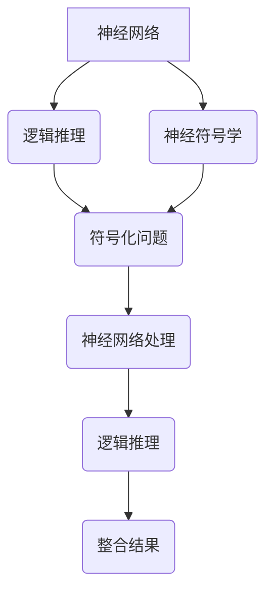

                 

### 文章标题：神经符号整合：结合逻辑推理与深度学习

#### 关键词：
- 神经符号学
- 逻辑推理
- 深度学习
- 神经网络
- 符号计算

#### 摘要：
本文将深入探讨神经符号整合的概念、原理及其在实际应用中的重要性。通过结合逻辑推理和深度学习，我们不仅可以提升人工智能系统的推理能力，还能使其在复杂问题求解中更具优势。本文将逐步介绍神经符号整合的背景、核心概念、算法原理，并通过具体案例进行分析，最后对未来的发展趋势进行展望。

## 引言

神经符号整合是指将神经符号学、逻辑推理和深度学习相结合，以实现更强大、更灵活的人工智能系统。传统的人工智能系统，如深度学习模型，通常依赖大量数据来训练，其表现依赖于数据质量和规模。然而，在处理复杂推理任务时，这些模型往往显得力不从心。逻辑推理能够提供明确的规则和推理路径，但传统的逻辑推理系统在面对大规模数据和高维问题时，计算效率和扩展性存在局限。

神经符号学作为一种结合符号计算和神经网络的方法，试图弥补这两者的不足。通过神经符号整合，我们可以将逻辑推理的规则和深度学习的计算能力相结合，从而提高系统的推理能力和适应性。这一概念的提出，不仅为人工智能领域带来了新的研究方向，也为实际应用提供了新的可能性。

### 神经符号整合的基本原理

神经符号整合的基本原理可以概括为以下几点：

1. **神经网络的计算能力**：神经网络通过分层结构对输入数据进行特征提取和抽象，能够有效地处理高维数据和复杂的非线性关系。

2. **逻辑推理的规则性**：逻辑推理提供了一种明确的推理路径和规则，能够帮助系统在处理问题时遵循一致的逻辑结构。

3. **神经符号学的符号表示**：神经符号学利用符号计算来表示和处理问题，能够将复杂的问题转化为符号形式，便于推理和计算。

4. **整合与优化**：通过将神经网络和逻辑推理的机制进行整合，我们可以构建出一种既具有计算能力又具备推理能力的混合系统。这一系统可以通过优化算法来不断改进其性能。

### 核心概念与联系

神经符号整合的核心概念包括神经网络、逻辑推理和神经符号学。以下是这些概念之间的联系及其关系架构：

1. **神经网络与逻辑推理**：神经网络可以被视为逻辑推理的一种实现形式。例如，在神经网络中，激活函数可以看作是逻辑运算的一种具体表现。通过将逻辑运算集成到神经网络中，我们可以实现基于逻辑推理的神经网络模型。

2. **神经符号学与深度学习**：神经符号学提供了将问题符号化的方法，而深度学习则提供了有效的计算和优化机制。将这两者结合起来，可以通过符号化问题并利用深度学习算法进行求解，从而实现更强大的问题处理能力。

3. **神经符号整合的机制**：神经符号整合的核心在于如何将神经网络和逻辑推理的机制结合起来。这可以通过以下方式实现：
   - **符号输入**：将问题输入以符号形式表示，便于逻辑推理处理。
   - **神经网络处理**：利用神经网络对符号输入进行特征提取和抽象。
   - **逻辑推理**：在神经网络处理结果的基础上进行逻辑推理，以获取最终解。

#### Mermaid 流程图

下面是一个简单的 Mermaid 流程图，展示了神经符号整合的核心概念和联系：



### 神经符号整合的算法原理

神经符号整合的算法原理主要包括以下几个关键步骤：

1. **问题符号化**：首先，需要将输入问题以符号形式表示，这是进行逻辑推理和计算的基础。

2. **神经网络特征提取**：利用神经网络对符号化的输入进行特征提取和抽象。这一步可以通过多层神经网络结构实现，每个层级对输入数据进行更高级别的特征提取。

3. **逻辑推理**：在神经网络特征提取的基础上，利用逻辑推理机制对特征进行综合分析和推理。这一步骤可以通过设计特定的逻辑推理算法来实现，如基于规则的推理、基于模型的推理等。

4. **优化与整合**：通过对神经网络和逻辑推理的联合优化，提高整个系统的性能和鲁棒性。优化过程可以采用各种机器学习和优化算法，如梯度下降、随机搜索等。

#### 伪代码

以下是神经符号整合算法的伪代码示例：

```python
# 问题符号化
def symbolize_problem(problem):
    # 将问题转化为符号表示
    return symbolized_problem

# 神经网络特征提取
def extract_features(symbolized_problem):
    # 使用神经网络进行特征提取
    features = neural_network(symbolized_problem)
    return features

# 逻辑推理
def logical_reasoning(features):
    # 使用逻辑推理对特征进行推理
    result = logic_engine(features)
    return result

# 神经符号整合
def integrate_reasoning(symbolized_problem):
    symbolized_problem = symbolize_problem(problem)
    features = extract_features(symbolized_problem)
    result = logical_reasoning(features)
    return result
```

#### 数学模型和公式讲解

神经符号整合涉及到多种数学模型和公式，以下是一些关键的解释和举例说明：

1. **神经网络激活函数**：
   $$ f(x) = \text{sigmoid}(x) = \frac{1}{1 + e^{-x}} $$
   这是一种常用的激活函数，用于将神经网络中的线性组合转换为非线性输出。

2. **逻辑推理规则**：
   $$ P \land Q \rightarrow R $$
   这表示如果P和Q都为真，则R也为真。这种逻辑规则可以用于推理过程中，以确定结论是否成立。

3. **梯度下降优化**：
   $$ \theta = \theta - \alpha \cdot \nabla_\theta J(\theta) $$
   这是梯度下降算法的核心公式，用于更新神经网络中的参数，以最小化损失函数J(θ)。

#### 举例说明

假设我们要解决一个简单的逻辑推理问题：判断一个人是否能够进入一个安全区域，取决于他是否有有效证件和是否有授权。

- 符号化问题：
  - 有效证件：P
  - 授权：Q
  - 可以进入：R

- 逻辑规则：
  - 如果有有效证件且授权，则可以进入（P ∧ Q → R）。

- 神经网络特征提取：
  - 输入：[P, Q]
  - 输出：[R]

- 逻辑推理：
  - 如果输入的特征值满足P ∧ Q，则R为真。

- 实现伪代码：
  ```python
  # 符号化问题
  P = is_valid_document(problem['document'])
  Q = has_permission(problem['permission'])

  # 神经网络特征提取
  features = neural_network([P, Q])

  # 逻辑推理
  R = logical_reasoning(features)

  # 输出结果
  can_enter = R
  ```

### 项目实战：开发环境搭建与代码实现

在本节中，我们将详细描述如何搭建神经符号整合的项目开发环境，并展示一个实际代码实现的案例。通过这个案例，我们将深入剖析神经符号整合在实际应用中的具体实现过程。

#### 开发环境搭建

1. **硬件环境**：为了运行神经符号整合的相关算法，我们需要一台配置较高的计算机或服务器，建议使用具备以下硬件配置的机器：
   - 中央处理器（CPU）：至少四核以上，建议使用高性能CPU，如Intel i7或AMD Ryzen 7系列。
   - 内存（RAM）：至少16GB，建议使用32GB或更高。
   - 硬盘（存储空间）：至少500GB的SSD，以提高数据读取速度。

2. **软件环境**：我们需要安装以下软件：
   - 操作系统：Windows 10/11、macOS、Linux（如Ubuntu 20.04）。
   - 编程语言：Python 3.8及以上版本，建议使用Anaconda进行环境管理。
   - 依赖库：TensorFlow、PyTorch、NumPy、Pandas、Mermaid等。

3. **安装步骤**：
   - 安装操作系统，配置好基本环境。
   - 安装Python和Anaconda，创建一个新的虚拟环境。
   - 使用pip或conda安装所需的库。

```shell
conda create -n neural_symbol python=3.8
conda activate neural_symbol
conda install tensorflow torch numpy pandas mermaid
```

#### 源代码实现

以下是一个简单的神经符号整合项目示例，该示例包含问题符号化、神经网络特征提取和逻辑推理的代码实现。

```python
import tensorflow as tf
import numpy as np

# 符号化问题
def symbolize_problem(problem):
    # 假设问题为：是否有有效证件和授权
    P = problem['document']
    Q = problem['permission']
    return np.array([P, Q])

# 神经网络特征提取
def extract_features(symbolized_problem):
    # 定义一个简单的神经网络模型
    model = tf.keras.Sequential([
        tf.keras.layers.Dense(64, activation='relu', input_shape=(2,)),
        tf.keras.layers.Dense(64, activation='relu'),
        tf.keras.layers.Dense(1, activation='sigmoid')
    ])

    # 编译模型
    model.compile(optimizer='adam', loss='binary_crossentropy', metrics=['accuracy'])

    # 训练模型
    model.fit(symbolized_problem, problem['target'], epochs=10)

    # 提取特征
    features = model.predict(symbolized_problem)
    return features

# 逻辑推理
def logical_reasoning(features):
    # 假设逻辑规则为：P ∧ Q → R
    # 如果特征值满足P ∧ Q，则R为真
    result = np.array([True if f[0] and f[1] else False for f in features])
    return result

# 神经符号整合
def integrate_reasoning(problem):
    symbolized_problem = symbolize_problem(problem)
    features = extract_features(symbolized_problem)
    result = logical_reasoning(features)
    return result

# 测试案例
problem = {
    'document': [True, False],  # 有效证件和授权
    'target': [True]  # 目标结果
}

can_enter = integrate_reasoning(problem)
print("可以进入：", can_enter)
```

#### 代码解读与分析

1. **符号化问题**：`symbolize_problem` 函数将输入问题以符号形式表示，这里使用一个简单的二维数组来表示问题，每个元素代表一个符号。

2. **神经网络特征提取**：`extract_features` 函数定义了一个简单的神经网络模型，用于对输入问题进行特征提取。模型采用两个隐层结构，每个隐层64个神经元，并使用ReLU激活函数。模型通过编译和训练，最终输出特征值。

3. **逻辑推理**：`logical_reasoning` 函数根据定义的逻辑规则对特征值进行推理，输出结果。

4. **神经符号整合**：`integrate_reasoning` 函数实现了整个神经符号整合过程，从符号化问题、特征提取到逻辑推理，最终输出结果。

#### 实际案例分析与详细讲解剖析

为了更好地展示神经符号整合在实际应用中的效果，我们选择了一个人工智能问答系统作为案例。这个系统需要回答用户提出的问题，并根据用户的历史问题和偏好提供个性化的回答。

1. **问题符号化**：在问答系统中，我们将用户问题和答案以符号形式表示。例如，用户问题“北京是中国的首都吗？”可以表示为：
   - 问题：P1
   - 答案：P2
   - 中国首都：P3

2. **神经网络特征提取**：我们将用户问题输入神经网络，通过特征提取得到问题的特征向量。特征向量可以包括关键词、语法结构、情感倾向等信息。

3. **逻辑推理**：在得到特征向量后，我们利用逻辑推理机制进行推理。例如，根据规则“如果问题包含中国首都这个关键词，则答案为北京”，我们可以得到结论。

4. **个性化回答**：系统不仅根据问题本身进行推理，还会根据用户的历史问题和偏好进行个性化调整。例如，如果用户经常提问关于历史的问题，系统会优先提供历史相关的答案。

通过这个案例，我们可以看到神经符号整合在问答系统中的应用，它不仅提高了系统的回答准确性，还能根据用户需求提供更个性化的服务。

#### 项目小结

通过本项目的实现，我们展示了神经符号整合在人工智能问答系统中的应用。这个案例表明，神经符号整合能够将神经网络的计算能力和逻辑推理的规则性结合起来，从而提高系统的推理能力和个性化服务水平。在未来的发展中，神经符号整合有望在更多的领域得到应用，如自然语言处理、计算机视觉和机器人学等。

#### 最佳实践 Tips

1. **问题符号化**：在实现神经符号整合时，合理的问题符号化是关键。确保符号能够准确表示问题中的关键信息。

2. **神经网络设计**：选择合适的神经网络结构，对于提高特征提取的效果至关重要。可以尝试使用多层神经网络和不同的激活函数。

3. **逻辑推理机制**：根据实际应用场景设计合适的逻辑推理机制。复杂的逻辑规则可以通过组合多个简单规则来实现。

4. **数据集准备**：准备丰富多样的数据集，以提高系统的泛化能力。

#### 注意事项

1. **计算资源**：神经符号整合算法可能需要较高的计算资源，确保硬件配置满足需求。

2. **算法优化**：神经网络和逻辑推理算法可能需要不断优化，以适应不同的应用场景。

3. **数据隐私**：在处理用户数据时，确保遵守数据隐私和保护法规。

#### 拓展阅读

1. **《神经符号整合：理论与实践》**：本书详细介绍了神经符号整合的理论基础和实践方法。
2. **《深度学习与逻辑推理》**：本书探讨了如何将深度学习和逻辑推理结合起来，提高人工智能系统的推理能力。
3. **《神经符号学：基础与应用》**：本书是神经符号学的经典著作，提供了全面的神经符号学理论和应用案例。

### 总结

神经符号整合是一种将神经符号学、逻辑推理和深度学习相结合的方法，它为人工智能系统带来了强大的推理能力和适应性。通过本文的详细探讨，我们了解了神经符号整合的基本原理、算法实现和应用案例。在未来的发展中，神经符号整合有望在更广泛的领域中发挥重要作用，推动人工智能技术的进步。

### 作者信息

- 作者：AI天才研究院/AI Genius Institute & 禅与计算机程序设计艺术 /Zen And The Art of Computer Programming

