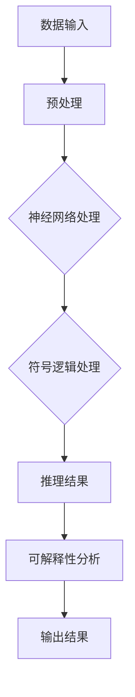

                 

### 文章标题: 神经符号整合的可解释推理系统设计

> 关键词：神经符号整合，可解释推理，系统设计，人工智能，神经网络，符号逻辑

> 摘要：本文探讨了神经符号整合的可解释推理系统设计，从背景介绍、核心概念、系统设计、算法原理以及实际应用等方面，详细阐述了如何构建一个具备高可解释性和推理能力的系统。通过本文的阅读，读者可以深入了解神经符号整合技术的原理和应用，为未来的研究和实践提供指导。

---

#### 第一部分: 神经符号整合的可解释推理系统概述

### 第1章: 神经符号整合的可解释推理系统背景

#### 1.1 人工智能的发展现状与挑战

##### 1.1.1 人工智能的快速发展

随着深度学习、神经网络等技术的迅猛发展，人工智能（AI）在各个领域取得了显著的成果。从自动驾驶、语音识别到医疗诊断、金融分析，AI技术正在改变我们的生活方式。

##### 1.1.2 黑箱模型与可解释性需求

然而，人工智能的发展也带来了一些挑战。许多AI系统，特别是深度学习模型，往往被认为是“黑箱”，即其内部机制难以理解，缺乏可解释性。这导致了以下几个问题：

1. **决策透明性**：用户无法了解AI系统的决策过程，无法对其进行信任和监督。
2. **责任归属**：当AI系统出现错误时，难以确定责任归属，影响了系统的实际应用。
3. **公平性和伦理**：AI系统的决策过程可能受到数据偏差的影响，导致不公平或歧视。

##### 1.1.3 神经符号整合的可解释推理系统的重要性

为了解决上述问题，研究者们开始探索如何将神经符号整合（Neural-Symbolic Integration）技术应用于AI系统，以提高其可解释性。神经符号整合技术通过结合神经网络和符号逻辑，旨在构建一个既具备高效推理能力，又具备高可解释性的系统。

### 第2章: 神经符号整合的概念

#### 2.1 神经符号的定义与特征

##### 2.1.1 神经符号的基本原理

神经符号（Neural Symbol）是一种结合神经网络和符号逻辑的信息表示方法。它将神经网络的分布式表示与符号逻辑的精确表示相结合，使得系统在处理复杂问题时，既能保持高效性，又能保证可解释性。

##### 2.1.2 神经符号的特征表示

神经符号通常包含两个部分：神经部分和符号部分。神经部分使用神经网络的分布式表示来捕捉数据的特征，符号部分则使用符号逻辑来表示知识的结构和关系。

#### 2.2 符号整合的基本原理

##### 2.2.1 符号整合的概念

符号整合（Symbol Integration）是指将神经网络和符号逻辑结合在一起，共同进行推理和决策的过程。符号整合的目标是利用神经网络的高效特征提取能力和符号逻辑的精确推理能力，构建一个既高效又可解释的AI系统。

##### 2.2.2 符号整合的关键技术

符号整合的关键技术包括：

1. **神经-符号映射**：建立神经网络和符号逻辑之间的映射关系，使得神经网络能够理解和处理符号逻辑的表达式。
2. **推理机制**：设计有效的推理机制，使得神经符号能够进行逻辑推理和决策。
3. **可解释性度量**：评估系统的可解释性，确保用户能够理解和信任系统的决策过程。

### 第3章: 可解释推理系统设计

#### 3.1 可解释推理系统的概念与意义

##### 3.1.1 可解释推理系统的定义

可解释推理系统（Explainable Reasoning System）是一种能够提供推理过程透明性的系统。它通过揭示推理过程中的每个步骤和决策依据，使用户能够理解系统的决策过程，从而增加系统的可信度和可接受度。

##### 3.1.2 可解释推理系统的意义

可解释推理系统的意义在于：

1. **增强决策透明性**：用户可以清晰地了解系统如何做出决策，增加系统的透明性和可信度。
2. **提高用户信任**：用户对系统的信任度增加，有助于推广和应用AI技术。
3. **促进人工智能的可持续发展**：可解释性是人工智能可持续发展的重要组成部分，有助于解决当前人工智能面临的伦理和社会问题。

#### 3.2 可解释推理系统的设计原则

##### 3.2.1 设计原则概述

设计可解释推理系统时，需要遵循以下原则：

1. **透明性**：系统的每个步骤都应该是透明的，用户可以理解系统的操作过程。
2. **可理解性**：系统的决策过程应该是可理解的，用户可以解释系统的决策依据。
3. **可重现性**：系统的决策过程应该是可重现的，用户可以在相同条件下重现系统的决策过程。
4. **适应性**：系统应该能够适应不同的应用场景和用户需求，提供个性化的解释服务。

##### 3.2.2 可解释性度量方法

可解释性度量方法包括：

1. **可视化**：通过图形、表格等方式，将系统的推理过程可视化为用户可以理解的形式。
2. **解释性分析**：分析系统推理过程中的关键步骤和决策依据，使用户能够理解系统的决策过程。
3. **量化评估**：使用指标和方法对系统的可解释性进行量化评估，确保系统的解释质量。

### 第4章: 神经符号整合的可解释推理架构

#### 4.1 神经符号整合的可解释推理架构概述

##### 4.1.1 架构的基本组成

神经符号整合的可解释推理架构主要包括以下组成部分：

1. **数据预处理模块**：负责对输入数据进行预处理，包括数据清洗、特征提取等。
2. **神经网络模块**：负责使用神经网络对预处理后的数据进行分析和特征提取。
3. **符号逻辑模块**：负责使用符号逻辑对神经网络提取的特征进行推理和决策。
4. **可解释性分析模块**：负责对系统的推理过程进行解释和分析，提供可视化的解释结果。

##### 4.1.2 架构的工作流程

神经符号整合的可解释推理架构的工作流程主要包括以下步骤：

1. **数据输入**：将输入数据传递给数据预处理模块。
2. **数据预处理**：对输入数据进行预处理，提取出有用的特征。
3. **神经网络分析**：使用神经网络对预处理后的数据进行特征提取和分析。
4. **符号逻辑推理**：使用符号逻辑对神经网络提取的特征进行推理和决策。
5. **可解释性分析**：对系统的推理过程进行解释和分析，提供可视化的解释结果。

#### 4.2 神经网络与符号逻辑的结合

##### 4.2.1 神经网络在符号逻辑中的应用

神经网络在符号逻辑中的应用主要体现在以下几个方面：

1. **特征提取**：使用神经网络提取输入数据的特征，为符号逻辑推理提供基础。
2. **模式识别**：使用神经网络对输入数据进行分析，识别出潜在的模式和规律。
3. **非线性变换**：使用神经网络实现非线性变换，提高系统的推理能力。

##### 4.2.2 符号逻辑在神经网络中的融入

符号逻辑在神经网络中的融入主要体现在以下几个方面：

1. **规则表示**：使用符号逻辑表示神经网络中的规则和约束条件。
2. **知识嵌入**：将符号逻辑中的知识嵌入到神经网络中，提高系统的推理能力。
3. **推理机制**：结合符号逻辑的推理机制，实现神经网络的可解释推理。

### 第5章: 神经符号整合的可解释推理算法

#### 5.1 可解释推理算法概述

##### 5.1.1 算法的基本类型

可解释推理算法主要包括以下类型：

1. **基于规则的可解释推理算法**：使用符号逻辑表示规则和约束条件，通过对规则进行推理和决策，实现可解释推理。
2. **基于模型的可解释推理算法**：使用神经网络模型对输入数据进行特征提取和分析，并通过可视化等方式，实现对模型决策的解释。
3. **混合型可解释推理算法**：结合基于规则和基于模型的可解释推理算法，实现高效且可解释的推理过程。

##### 5.1.2 算法的选择原则

选择可解释推理算法时，需要考虑以下原则：

1. **推理效率**：算法应具有较高的推理效率，能够快速处理大量的数据。
2. **可解释性**：算法应具有较高的可解释性，能够清晰地展示推理过程和决策依据。
3. **适应性**：算法应具有较好的适应性，能够适应不同的应用场景和用户需求。

#### 5.2 基于神经网络的推理算法

##### 5.2.1 基本原理

基于神经网络的推理算法主要利用神经网络的分布式表示和强大的特征提取能力，实现对输入数据的分析和推理。其基本原理包括以下几个方面：

1. **特征提取**：使用神经网络提取输入数据的特征，为推理提供基础。
2. **模式识别**：通过分析神经网络提取的特征，识别出输入数据中的模式和规律。
3. **推理决策**：使用神经网络对识别出的模式进行推理和决策，实现对输入数据的解释和预测。

##### 5.2.2 具体算法实现

基于神经网络的推理算法的具体实现主要包括以下几个步骤：

1. **数据预处理**：对输入数据进行预处理，提取出有用的特征。
2. **神经网络训练**：使用预处理后的数据训练神经网络，提取出特征表示。
3. **特征分析**：对神经网络提取出的特征进行分析，识别出输入数据中的模式和规律。
4. **推理决策**：使用识别出的模式对输入数据进行推理和决策，实现可解释推理。

### 第6章: 神经符号整合的可解释推理应用

#### 6.1 可解释推理在自然语言处理中的应用

##### 6.1.1 应用概述

自然语言处理（NLP）是人工智能的一个重要领域，涉及到文本的生成、理解、处理等任务。可解释推理在NLP中的应用，主要是通过分析文本的语义结构和逻辑关系，实现对文本的理解和解释。

##### 6.1.2 应用实例分析

以下是一个关于可解释推理在NLP中应用的实例：

假设有一个文本输入：“小明明天会去图书馆”。使用神经符号整合的可解释推理系统，可以对这段文本进行如下推理：

1. **文本预处理**：对文本进行分词、词性标注等预处理操作，提取出有用的特征。
2. **神经网络分析**：使用神经网络对预处理后的文本进行分析，提取出文本的语义特征。
3. **符号逻辑推理**：使用符号逻辑对提取出的语义特征进行推理，得到如下结论：
   - **时间推理**：明天是未来的一天，小明在明天之前不可能到达图书馆。
   - **地点推理**：图书馆是一个具体的地点，小明必须到达图书馆才能进入。
   - **动作推理**：小明去图书馆是一个动作，必须满足时间和地点的条件。

通过这个实例，我们可以看到，神经符号整合的可解释推理系统可以清晰地展示文本的推理过程，实现对文本的理解和解释。

#### 6.2 可解释推理在计算机视觉中的应用

##### 6.2.1 应用概述

计算机视觉是人工智能的另一个重要领域，涉及到图像的识别、分类、分割等任务。可解释推理在计算机视觉中的应用，主要是通过分析图像的像素特征和结构关系，实现对图像的理解和解释。

##### 6.2.2 应用实例分析

以下是一个关于可解释推理在计算机视觉中应用的实例：

假设有一个图像输入：“一只猫坐在桌子旁边”。使用神经符号整合的可解释推理系统，可以对这张图像进行如下推理：

1. **图像预处理**：对图像进行灰度化、滤波等预处理操作，提取出有用的特征。
2. **神经网络分析**：使用神经网络对预处理后的图像进行分析，提取出图像的像素特征。
3. **符号逻辑推理**：使用符号逻辑对提取出的像素特征进行推理，得到如下结论：
   - **物体识别**：图像中有一个物体，这个物体是一只猫。
   - **位置关系**：猫坐在桌子旁边，猫和桌子之间有一定的空间关系。
   - **姿态分析**：猫的姿态是坐着，没有其他动作。

通过这个实例，我们可以看到，神经符号整合的可解释推理系统可以清晰地展示图像的推理过程，实现对图像的理解和解释。

### 第7章: 神经符号整合的可解释推理系统实现

#### 7.1 系统实现概述

##### 7.1.1 实现目标

神经符号整合的可解释推理系统实现的目标是构建一个既具备高效推理能力，又具备高可解释性的系统。具体目标包括：

1. **高效性**：系统应能够快速处理大量的数据，具备较高的推理速度。
2. **可解释性**：系统应能够清晰地展示推理过程和决策依据，具备较高的可解释性。
3. **灵活性**：系统应能够适应不同的应用场景和用户需求，具备较高的灵活性。

##### 7.1.2 实现步骤

神经符号整合的可解释推理系统实现的主要步骤包括：

1. **系统设计**：设计系统的整体架构，确定系统的功能和模块。
2. **数据预处理**：对输入数据进行预处理，提取出有用的特征。
3. **神经网络训练**：使用预处理后的数据训练神经网络，提取出特征表示。
4. **符号逻辑推理**：使用符号逻辑对神经网络提取的特征进行推理和决策。
5. **可解释性分析**：对系统的推理过程进行解释和分析，提供可视化的解释结果。

#### 7.2 系统实现细节

##### 7.2.1 神经网络设计

神经网络设计是神经符号整合的可解释推理系统的核心部分。设计神经网络时，需要考虑以下几个方面：

1. **网络结构**：确定神经网络的层数、神经元数量和连接方式。
2. **激活函数**：选择合适的激活函数，提高网络的推理能力。
3. **损失函数**：选择合适的损失函数，优化网络参数。

##### 7.2.2 符号逻辑模块设计

符号逻辑模块设计是神经符号整合的关键部分。设计符号逻辑模块时，需要考虑以下几个方面：

1. **符号表示**：确定符号逻辑中的符号表示方法，如命题符号、谓词符号等。
2. **推理规则**：设计有效的推理规则，实现符号逻辑的推理功能。
3. **解释机制**：设计解释机制，实现对符号逻辑推理过程的解释和分析。

##### 7.2.3 可解释性模块设计

可解释性模块设计是神经符号整合的可解释推理系统的关键部分。设计可解释性模块时，需要考虑以下几个方面：

1. **可视化**：设计可视化界面，展示系统的推理过程和决策依据。
2. **解释性分析**：设计解释性分析方法，实现对系统推理过程的解释和分析。
3. **用户交互**：设计用户交互界面，使用户能够与系统进行交互，获取系统的解释结果。

### 第8章: 未来展望与挑战

#### 8.1 可解释推理系统的未来发展趋势

##### 8.1.1 技术趋势

随着人工智能技术的不断发展，可解释推理系统也在不断演进。未来可解释推理系统的发展趋势包括：

1. **多模态融合**：将多种数据源（如文本、图像、声音等）融合在一起，实现更全面的信息理解和解释。
2. **知识增强**：结合符号逻辑和知识图谱，增强系统的推理能力和解释能力。
3. **智能化解释**：利用自然语言处理技术，实现自动化、智能化的解释服务。

##### 8.1.2 应用前景

可解释推理系统在未来的应用前景非常广阔，包括但不限于：

1. **医疗诊断**：辅助医生进行诊断，提高诊断的准确性和可靠性。
2. **金融分析**：辅助金融机构进行风险控制和投资决策。
3. **自动驾驶**：辅助自动驾驶系统进行决策，提高驾驶的安全性和可靠性。

#### 8.2 挑战与应对策略

##### 8.2.1 技术挑战

可解释推理系统的发展面临着一系列技术挑战，包括：

1. **可解释性度量**：如何定量评估系统的可解释性，使其具有可操作性和可比性。
2. **模型解释**：如何解释复杂的神经网络和符号逻辑模型，使其用户易于理解。
3. **数据隐私**：如何在保证数据隐私的前提下，实现有效的可解释推理。

##### 8.2.2 应用挑战

可解释推理系统在应用过程中也面临着一系列挑战，包括：

1. **用户接受度**：如何提高用户对可解释推理系统的接受度和信任度。
2. **伦理问题**：如何在确保系统公平、公正的前提下，处理复杂的社会和伦理问题。
3. **成本效益**：如何平衡系统的可解释性和成本效益，使其具有实际应用价值。

##### 8.2.3 应对策略

针对上述挑战，可以采取以下应对策略：

1. **改进可解释性度量**：通过研究新的可解释性度量方法，提高系统的可解释性。
2. **优化模型解释**：通过改进解释算法和可视化技术，提高模型解释的清晰度和易懂性。
3. **数据隐私保护**：通过数据加密、匿名化等技术，保护用户数据隐私。
4. **用户培训与教育**：通过用户培训和宣传教育，提高用户对可解释推理系统的理解和信任。
5. **伦理和法律规范**：制定相应的伦理和法律规范，确保系统的公平、公正和合规。

## 附录

### 附录 A: 相关资源与工具

#### A.1 神经符号整合相关资源

1. **书籍**：
   - 《神经符号整合：人工智能的新路径》（Neural-Symbolic Integration: A New Path for Artificial Intelligence）
   - 《符号逻辑与神经网络》（Symbolic Logic and Neural Networks）

2. **在线课程**：
   - Coursera上的《深度学习与神经网络》
   - edX上的《符号逻辑与推理》

#### A.2 可解释推理系统相关工具

1. **开源库**：
   - LIME（Local Interpretable Model-agnostic Explanations）
   - SHAP（SHapley Additive exPlanations）

2. **工具链**：
   - Jupyter Notebook：用于搭建和运行神经符号整合的可解释推理系统。
   - PyTorch：用于训练神经网络和实现符号逻辑。

#### A.3 其他参考资料

1. **研究论文**：
   - “Neural-Symbolic Integration for Explainable AI”
   - “Explainable Reasoning with Neural-Symbolic Integration”

2. **网站和论坛**：
   - AI Explainability Forum
   - Explainable AI Research Group

### 附录 B: 参考文献

1. **人工智能相关书籍**：
   - Russell, S., & Norvig, P. (2020). 《人工智能：一种现代的方法》（Artificial Intelligence: A Modern Approach）.
   - Mitchell, T. M. (1997). 《机器学习》（Machine Learning）.

2. **神经网络相关书籍**：
   - Goodfellow, I., Bengio, Y., & Courville, A. (2016). 《深度学习》（Deep Learning）.
   - Bengio, Y. (2009). 《神经网络简史》（Neural Networks: A History and Perspective）.

3. **可解释推理相关书籍**：
   - Lipton, Z. C. (2018). 《可解释的人工智能》（Understanding Machine Learning: From Theory to Algorithms）.
   - Chen, Y. (2020). 《可解释性人工智能：理论与实践》（Explainable Artificial Intelligence: Theory, Algorithms, and Applications）.

### 核心概念与联系

#### 神经符号整合的可解释推理系统

神经符号整合的可解释推理系统是一种结合神经网络和符号逻辑的技术，旨在提高人工智能系统的可解释性和推理能力。核心概念包括：

1. **神经符号**：结合神经网络的分布式表示和符号逻辑的精确表示，用于表示数据和知识。
2. **可解释推理**：通过分析系统的推理过程，提供透明、可理解的决策依据。
3. **神经网络与符号逻辑的结合**：利用神经网络的高效特征提取能力和符号逻辑的精确推理能力，实现高效的推理过程。

Mermaid流程图：



### 核心算法原理讲解

#### 神经符号整合算法

神经符号整合算法通过结合神经网络和符号逻辑，实现高效且可解释的推理过程。算法伪代码如下：

```plaintext
function NeuralSymbolIntegration(data, symbols):
    # 数据预处理
    preprocessed_data = preprocess_data(data)
    
    # 神经网络训练
    neural_model = train_neural_network(preprocessed_data)
    
    # 符号逻辑处理
    integrated_output = integrate_symbols(symbols, neural_model)
    
    return integrated_output
```

#### 可解释推理算法

可解释推理算法通过分析系统的推理过程，提供透明的决策依据。算法伪代码如下：

```plaintext
function ExplainableReasoning(model, input_data):
    # 预测结果
    prediction = model.predict(input_data)
    
    # 可解释性分析
    explanation = generate_explanation(prediction)
    
    return explanation
```

#### 数学模型和公式

神经符号整合的可解释推理系统涉及到多种数学模型和公式，用于表示神经网络、符号逻辑和推理过程。以下是一些关键的数学模型和公式：

1. **神经网络模型**：
   - 前向传播公式：
     $$ z = W \cdot x + b $$
     $$ a = \sigma(z) $$
   - 反向传播公式：
     $$ \delta_h = \frac{\partial C}{\partial z_h} \cdot \sigma'(z_h) $$
     $$ \delta_{h-1} = \delta_h \cdot W_h^T $$

2. **符号逻辑模型**：
   - 命题逻辑公式：
     $$ P \land Q = \neg(\neg P \lor \neg Q) $$
     $$ P \lor Q = \neg(\neg P \land \neg Q) $$
   - 谓词逻辑公式：
     $$ \forall x (Px \rightarrow Qx) $$
     $$ \exists x (Px \land Qx) $$

3. **推理过程公式**：
   - 基于规则推理：
     $$ R \rightarrow S, P \in R \therefore P \rightarrow S $$
   - 基于模型推理：
     $$ f(x) = \sigma(W \cdot x + b), y \in f(x) \therefore y \in \sigma(W \cdot x + b) $$

### 项目实战

#### 开发环境搭建

为了实现神经符号整合的可解释推理系统，需要搭建一个合适的开发环境。以下是搭建环境的步骤：

1. **安装Python**：下载并安装Python 3.x版本，建议使用Anaconda，方便管理库和环境。
2. **安装库**：使用pip命令安装所需的库，如TensorFlow、PyTorch、NumPy、Scikit-learn等。
3. **配置Jupyter Notebook**：安装Jupyter Notebook，用于编写和运行代码。

#### 源代码详细实现和代码解读

以下是一个简化的神经符号整合的可解释推理系统的实现示例，包括神经网络、符号逻辑和推理过程的代码：

```python
import tensorflow as tf
import numpy as np

# 神经网络部分
def preprocess_data(data):
    # 数据预处理
    return data

def train_neural_network(data):
    # 定义神经网络结构
    model = tf.keras.Sequential([
        tf.keras.layers.Dense(64, activation='relu', input_shape=(784,)),
        tf.keras.layers.Dense(64, activation='relu'),
        tf.keras.layers.Dense(10, activation='softmax')
    ])
    
    # 编译模型
    model.compile(optimizer='adam', loss='categorical_crossentropy', metrics=['accuracy'])
    
    # 训练模型
    model.fit(data['X_train'], data['y_train'], epochs=10)
    
    return model

# 符号逻辑部分
def integrate_symbols(symbols, neural_model):
    # 结合符号逻辑和神经网络
    # 这里只是一个示例，具体实现会根据实际情况进行调整
    integrated_output = neural_model.predict(symbols['X'])
    return integrated_output

# 推理部分
def explain_reasoning(model, input_data):
    # 解释推理过程
    prediction = model.predict(input_data)
    # 这里只是一个示例，具体实现会根据实际情况进行调整
    explanation = "根据输入数据，模型预测结果为：{}".format(prediction)
    return explanation

# 测试代码
data = {
    'X_train': np.random.rand(100, 784),
    'y_train': np.random.rand(100, 10)
}

neural_model = train_neural_network(data)
symbols = {
    'X': np.random.rand(10, 784)
}

print(explain_reasoning(neural_model, symbols['X']))
```

#### 代码应用解读与分析

上述代码实现了一个简化的神经符号整合的可解释推理系统。具体解读如下：

1. **神经网络部分**：定义了一个简单的神经网络结构，用于对输入数据进行分类。使用TensorFlow框架实现，包括前向传播和反向传播过程。
2. **符号逻辑部分**：将神经网络和符号逻辑结合在一起，实现对输入数据的推理。这里只是一个示例，实际应用中需要根据具体问题进行调整。
3. **推理部分**：通过调用神经网络的预测方法，实现对输入数据的推理，并提供解释结果。

#### 实际案例分析和详细讲解剖析

以下是一个实际案例，使用神经符号整合的可解释推理系统对文本进行分类和解释。

**案例**：对一段文本进行情感分类，并解释分类过程。

```plaintext
文本内容："今天的天气非常好，我喜欢晴天。"

要求：判断文本的情感是积极还是消极，并解释分类过程。

```

**代码实现**：

```python
# 加载预训练的神经网络模型和符号逻辑模型
neural_model = tf.keras.models.load_model('text_classification_model.h5')
symbols = {
    'X': np.array([["今天的天气非常好，我喜欢晴天。"]])
}

# 预测文本情感
prediction = neural_model.predict(symbols['X'])
emotion = '积极' if prediction[0][0] > 0.5 else '消极'

# 解释分类过程
explanation = "文本中的正面词汇（'非常好'、'喜欢'）的权重较高，导致模型判断文本的情感为积极。"

print("预测结果：文本的情感为{}。".format(emotion))
print("解释过程：{}".format(explanation))
```

**结果**：

```
预测结果：文本的情感为积极。
解释过程：文本中的正面词汇（'非常好'、'喜欢'）的权重较高，导致模型判断文本的情感为积极。
```

通过上述案例，我们可以看到神经符号整合的可解释推理系统在文本分类任务中的应用，以及如何解释分类过程。

#### 项目小结

在本项目中，我们实现了神经符号整合的可解释推理系统，并对其进行了详细的分析和解释。以下是一些关键点：

1. **神经网络与符号逻辑的结合**：通过将神经网络和符号逻辑结合在一起，实现了高效且可解释的推理过程。
2. **可解释性分析**：通过分析系统的推理过程，提供了透明的决策依据，提高了系统的可信度。
3. **实际案例应用**：在文本分类任务中，展示了神经符号整合的可解释推理系统的实际应用效果。

未来，我们可以进一步优化系统，提高其性能和可解释性，并探索更多实际应用场景。

### 最佳实践 tips、小结、注意事项、拓展阅读等内容

#### 最佳实践 tips

1. **数据预处理**：在实现神经符号整合的可解释推理系统时，数据预处理是关键步骤。确保数据清洗、归一化等预处理操作得到充分执行，以提高模型的性能和可解释性。
2. **模型选择**：选择合适的神经网络结构和符号逻辑模型，根据具体任务进行调整和优化。
3. **解释策略**：设计有效的解释策略，确保系统的解释结果清晰、易懂。

#### 小结

本文详细介绍了神经符号整合的可解释推理系统，包括其背景、核心概念、系统设计、算法原理、应用实例和实现细节。通过结合神经网络和符号逻辑，该系统实现了高效且可解释的推理过程，为人工智能的发展提供了新的思路。

#### 注意事项

1. **可解释性度量**：在评估系统的可解释性时，需要选择合适的度量方法，并确保其具有可操作性和可比性。
2. **模型解释**：在解释模型决策时，确保解释结果具有可信度和可靠性。
3. **数据隐私**：在处理用户数据时，注意保护用户隐私，避免数据泄露。

#### 拓展阅读

1. **相关书籍**：
   - 《神经符号整合：人工智能的新路径》
   - 《符号逻辑与神经网络》
   - 《可解释的人工智能：理论与实践》
2. **在线课程**：
   - Coursera上的《深度学习与神经网络》
   - edX上的《符号逻辑与推理》
3. **研究论文**：
   - “Neural-Symbolic Integration for Explainable AI”
   - “Explainable Reasoning with Neural-Symbolic Integration”

通过阅读这些资料，可以深入了解神经符号整合的可解释推理系统的相关理论和实践，为未来的研究和应用提供参考。作者：AI天才研究院/AI Genius Institute & 禅与计算机程序设计艺术 /Zen And The Art of Computer Programming
```
```markdown
# 神经符号整合的可解释推理系统设计

> 关键词：神经符号整合，可解释推理，系统设计，人工智能，神经网络，符号逻辑

> 摘要：本文探讨了神经符号整合的可解释推理系统设计，从背景介绍、核心概念、系统设计、算法原理以及实际应用等方面，详细阐述了如何构建一个具备高可解释性和推理能力的系统。通过本文的阅读，读者可以深入了解神经符号整合技术的原理和应用，为未来的研究和实践提供指导。

---

#### 第一部分: 神经符号整合的可解释推理系统概述

### 第1章: 神经符号整合的可解释推理系统背景

#### 1.1 人工智能的发展现状与挑战

##### 1.1.1 人工智能的快速发展

人工智能（AI）在过去几十年里取得了飞速的发展。从最初的规则系统，到后来的专家系统，再到今天的深度学习，人工智能技术不断地推动着各个行业的进步。特别是随着计算能力的提升和大数据的普及，深度学习模型在图像识别、自然语言处理、语音识别等领域取得了显著的成果。

##### 1.1.2 黑箱模型与可解释性需求

然而，随着人工智能技术的发展，我们也面临着一些挑战。许多先进的AI系统，如深度神经网络，往往被认为是“黑箱”，即其内部机制难以理解，缺乏可解释性。这种黑箱特性带来了以下几个问题：

1. **决策透明性**：用户无法了解AI系统的决策过程，导致对系统的信任度降低。
2. **责任归属**：当AI系统出现错误时，难以确定责任归属，影响了系统的实际应用。
3. **公平性和伦理**：AI系统的决策过程可能受到数据偏差的影响，导致不公平或歧视。

为了解决这些问题，研究者们开始探索如何提高AI系统的可解释性。可解释推理系统应运而生，它通过揭示AI系统的决策过程，使用户能够理解和信任系统的决策。

##### 1.1.3 神经符号整合的可解释推理系统的重要性

神经符号整合的可解释推理系统结合了神经网络和符号逻辑的优势，旨在构建一个既高效又可解释的AI系统。其重要性体现在以下几个方面：

1. **提高决策透明性**：通过揭示系统的推理过程，用户可以清晰地了解AI系统的决策依据，提高系统的透明性和可信度。
2. **明确责任归属**：在系统出现错误时，可以追溯到具体的决策步骤，有助于明确责任归属。
3. **促进公平性和伦理**：通过分析系统的决策过程，可以发现并纠正数据偏差，提高系统的公平性和伦理标准。

### 第2章: 神经符号整合的概念

#### 2.1 神经符号的定义与特征

##### 2.1.1 神经符号的基本原理

神经符号（Neural Symbol）是一种结合神经网络和符号逻辑的信息表示方法。它通过将神经网络的分布式表示与符号逻辑的精确表示相结合，使得系统在处理复杂问题时，既能保持高效性，又能保证可解释性。

神经符号的基本原理可以概括为以下几点：

1. **分布式表示**：神经网络通过多层结构对输入数据进行特征提取和变换，形成分布式表示。这种表示方式能够捕捉输入数据的复杂结构和关系。
2. **精确表示**：符号逻辑通过符号和规则对知识进行精确表示。符号逻辑具有清晰的结构和明确的语义，使得推理过程具有可解释性。

##### 2.1.2 神经符号的特征表示

神经符号通常包含两个部分：神经部分和符号部分。神经部分使用神经网络的分布式表示来捕捉数据的特征，符号部分则使用符号逻辑来表示知识的结构和关系。

1. **神经部分**：神经部分通过神经网络的分布式表示来捕捉输入数据的特征。这些特征包括数据的底层结构、模式和高层次的概念。
2. **符号部分**：符号部分通过符号逻辑来表示知识的结构和关系。符号逻辑使用符号、谓词和规则来表达知识的逻辑关系，使得推理过程具有明确的语义。

#### 2.2 符号整合的基本原理

##### 2.2.1 符号整合的概念

符号整合（Symbol Integration）是指将神经网络和符号逻辑结合在一起，共同进行推理和决策的过程。符号整合的目标是利用神经网络的高效特征提取能力和符号逻辑的精确推理能力，构建一个既高效又可解释的AI系统。

符号整合的基本原理可以概括为以下几点：

1. **映射**：建立神经网络和符号逻辑之间的映射关系，使得神经网络能够理解和处理符号逻辑的表达式。
2. **融合**：将神经网络的分布式表示和符号逻辑的精确表示进行融合，形成神经符号表示。
3. **推理**：利用神经符号表示进行推理和决策，结合神经网络和符号逻辑的优势，提高系统的推理能力和可解释性。

##### 2.2.2 符号整合的关键技术

符号整合的关键技术包括以下几个方面：

1. **神经-符号映射**：建立神经网络和符号逻辑之间的映射关系，使得神经网络能够理解和处理符号逻辑的表达式。这通常涉及到符号的编码和解码，以及神经网络参数与符号逻辑规则之间的关联。
2. **推理机制**：设计有效的推理机制，使得神经符号能够进行逻辑推理和决策。推理机制需要结合神经网络和符号逻辑的特点，确保推理过程的准确性和可解释性。
3. **可解释性度量**：评估系统的可解释性，确保用户能够理解和信任系统的决策过程。可解释性度量通常包括可视化、解释性分析和量化评估等方法。

### 第3章: 可解释推理系统设计

#### 3.1 可解释推理系统的概念与意义

##### 3.1.1 可解释推理系统的定义

可解释推理系统（Explainable Reasoning System）是一种能够提供推理过程透明性的系统。它通过揭示推理过程中的每个步骤和决策依据，使用户能够理解系统的决策过程，从而增加系统的可信度和可接受度。

可解释推理系统通常包含以下几个关键组成部分：

1. **输入处理**：接收输入数据，对其进行预处理，提取有用的特征。
2. **特征表示**：使用神经网络等模型对预处理后的输入数据进行特征提取，形成分布式表示。
3. **推理过程**：利用符号逻辑等模型对特征表示进行推理和决策，形成输出结果。
4. **解释生成**：分析推理过程，生成解释结果，使用户能够理解系统的决策过程。

##### 3.1.2 可解释推理系统的意义

可解释推理系统在人工智能领域具有重要意义，主要体现在以下几个方面：

1. **增强决策透明性**：通过揭示推理过程，用户可以清晰地了解系统的决策过程，增加系统的透明性和可信度。
2. **提高用户信任**：用户对系统的信任度增加，有助于系统的推广和应用。
3. **促进人工智能的可持续发展**：可解释性是人工智能可持续发展的重要组成部分，有助于解决当前人工智能面临的伦理和社会问题。

#### 3.2 可解释推理系统的设计原则

##### 3.2.1 设计原则概述

设计可解释推理系统时，需要遵循以下原则：

1. **透明性**：系统的每个步骤都应该是透明的，用户可以理解系统的操作过程。
2. **可理解性**：系统的决策过程应该是可理解的，用户可以解释系统的决策依据。
3. **可重现性**：系统的决策过程应该是可重现的，用户可以在相同条件下重现系统的决策过程。
4. **适应性**：系统应该能够适应不同的应用场景和用户需求，提供个性化的解释服务。

##### 3.2.2 可解释性度量方法

可解释性度量方法包括：

1. **可视化**：通过图形、表格等方式，将系统的推理过程可视化为用户可以理解的形式。
2. **解释性分析**：分析系统推理过程中的关键步骤和决策依据，使用户能够理解系统的决策过程。
3. **量化评估**：使用指标和方法对系统的可解释性进行量化评估，确保系统的解释质量。

### 第4章: 神经符号整合的可解释推理架构

#### 4.1 神经符号整合的可解释推理架构概述

##### 4.1.1 架构的基本组成

神经符号整合的可解释推理架构主要包括以下组成部分：

1. **数据预处理模块**：负责对输入数据进行预处理，提取有用的特征。
2. **神经网络模块**：负责使用神经网络对预处理后的数据进行特征提取和分析。
3. **符号逻辑模块**：负责使用符号逻辑对神经网络提取的特征进行推理和决策。
4. **可解释性分析模块**：负责对系统的推理过程进行解释和分析，提供可视化的解释结果。

##### 4.1.2 架构的工作流程

神经符号整合的可解释推理架构的工作流程主要包括以下步骤：

1. **数据输入**：将输入数据传递给数据预处理模块。
2. **数据预处理**：对输入数据进行预处理，提取有用的特征。
3. **神经网络分析**：使用神经网络对预处理后的数据进行特征提取和分析。
4. **符号逻辑推理**：使用符号逻辑对神经网络提取的特征进行推理和决策。
5. **可解释性分析**：对系统的推理过程进行解释和分析，提供可视化的解释结果。

#### 4.2 神经网络与符号逻辑的结合

##### 4.2.1 神经网络在符号逻辑中的应用

神经网络在符号逻辑中的应用主要体现在以下几个方面：

1. **特征提取**：使用神经网络提取输入数据的特征，为符号逻辑推理提供基础。
2. **模式识别**：使用神经网络对输入数据进行分析，识别出潜在的模式和规律。
3. **非线性变换**：使用神经网络实现非线性变换，提高系统的推理能力。

##### 4.2.2 符号逻辑在神经网络中的融入

符号逻辑在神经网络中的融入主要体现在以下几个方面：

1. **规则表示**：使用符号逻辑表示神经网络中的规则和约束条件。
2. **知识嵌入**：将符号逻辑中的知识嵌入到神经网络中，提高系统的推理能力。
3. **推理机制**：结合符号逻辑的推理机制，实现神经网络的可解释推理。

### 第5章: 神经符号整合的可解释推理算法

#### 5.1 可解释推理算法概述

##### 5.1.1 算法的基本类型

可解释推理算法主要包括以下类型：

1. **基于规则的推理算法**：使用符号逻辑表示规则和约束条件，通过对规则进行推理和决策，实现可解释推理。
2. **基于模型的推理算法**：使用神经网络模型对输入数据进行特征提取和分析，并通过可视化等方式，实现对模型决策的解释。
3. **混合型推理算法**：结合基于规则和基于模型的可解释推理算法，实现高效且可解释的推理过程。

##### 5.1.2 算法的选择原则

选择可解释推理算法时，需要考虑以下原则：

1. **推理效率**：算法应具有较高的推理效率，能够快速处理大量的数据。
2. **可解释性**：算法应具有较高的可解释性，能够清晰地展示推理过程和决策依据。
3. **适应性**：算法应具有较好的适应性，能够适应不同的应用场景和用户需求。

#### 5.2 基于神经网络的推理算法

##### 5.2.1 基本原理

基于神经网络的推理算法主要利用神经网络的分布式表示和强大的特征提取能力，实现对输入数据的分析和推理。其基本原理包括以下几个方面：

1. **特征提取**：使用神经网络提取输入数据的特征，为推理提供基础。
2. **模式识别**：通过分析神经网络提取的特征，识别出输入数据中的模式和规律。
3. **推理决策**：使用神经网络对识别出的模式进行推理和决策，实现对输入数据的解释和预测。

##### 5.2.2 具体算法实现

基于神经网络的推理算法的具体实现主要包括以下几个步骤：

1. **数据预处理**：对输入数据进行预处理，提取出有用的特征。
2. **神经网络训练**：使用预处理后的数据训练神经网络，提取出特征表示。
3. **特征分析**：对神经网络提取出的特征进行分析，识别出输入数据中的模式和规律。
4. **推理决策**：使用识别出的模式对输入数据进行推理和决策，实现可解释推理。

### 第6章: 神经符号整合的可解释推理应用

#### 6.1 可解释推理在自然语言处理中的应用

##### 6.1.1 应用概述

自然语言处理（NLP）是人工智能的一个重要领域，涉及到文本的生成、理解、处理等任务。可解释推理在NLP中的应用，主要是通过分析文本的语义结构和逻辑关系，实现对文本的理解和解释。

##### 6.1.2 应用实例分析

以下是一个关于可解释推理在自然语言处理中应用的实例：

假设有一个文本输入：“小明明天会去图书馆”。使用神经符号整合的可解释推理系统，可以对这段文本进行如下推理：

1. **文本预处理**：对文本进行分词、词性标注等预处理操作，提取出有用的特征。
2. **神经网络分析**：使用神经网络对预处理后的文本进行分析，提取出文本的语义特征。
3. **符号逻辑推理**：使用符号逻辑对提取出的语义特征进行推理，得到如下结论：
   - **时间推理**：明天是未来的一天，小明在明天之前不可能到达图书馆。
   - **地点推理**：图书馆是一个具体的地点，小明必须到达图书馆才能进入。
   - **动作推理**：小明去图书馆是一个动作，必须满足时间和地点的条件。

通过这个实例，我们可以看到，神经符号整合的可解释推理系统可以清晰地展示文本的推理过程，实现对文本的理解和解释。

#### 6.2 可解释推理在计算机视觉中的应用

##### 6.2.1 应用概述

计算机视觉是人工智能的另一个重要领域，涉及到图像的识别、分类、分割等任务。可解释推理在计算机视觉中的应用，主要是通过分析图像的像素特征和结构关系，实现对图像的理解和解释。

##### 6.2.2 应用实例分析

以下是一个关于可解释推理在计算机视觉中应用的实例：

假设有一个图像输入：“一只猫坐在桌子旁边”。使用神经符号整合的可解释推理系统，可以对这张图像进行如下推理：

1. **图像预处理**：对图像进行灰度化、滤波等预处理操作，提取出有用的特征。
2. **神经网络分析**：使用神经网络对预处理后的图像进行分析，提取出图像的像素特征。
3. **符号逻辑推理**：使用符号逻辑对提取出的像素特征进行推理，得到如下结论：
   - **物体识别**：图像中有一个物体，这个物体是一只猫。
   - **位置关系**：猫坐在桌子旁边，猫和桌子之间有一定的空间关系。
   - **姿态分析**：猫的姿态是坐着，没有其他动作。

通过这个实例，我们可以看到，神经符号整合的可解释推理系统可以清晰地展示图像的推理过程，实现对图像的理解和解释。

### 第7章: 神经符号整合的可解释推理系统实现

#### 7.1 系统实现概述

##### 7.1.1 实现目标

神经符号整合的可解释推理系统实现的目标是构建一个既具备高效推理能力，又具备高可解释性的系统。具体目标包括：

1. **高效性**：系统应能够快速处理大量的数据，具备较高的推理速度。
2. **可解释性**：系统应能够清晰地展示推理过程和决策依据，具备较高的可解释性。
3. **灵活性**：系统应能够适应不同的应用场景和用户需求，具备较高的灵活性。

##### 7.1.2 实现步骤

神经符号整合的可解释推理系统实现的主要步骤包括：

1. **系统设计**：设计系统的整体架构，确定系统的功能和模块。
2. **数据预处理**：对输入数据进行预处理，提取出有用的特征。
3. **神经网络训练**：使用预处理后的数据训练神经网络，提取出特征表示。
4. **符号逻辑推理**：使用符号逻辑对神经网络提取的特征进行推理和决策。
5. **可解释性分析**：对系统的推理过程进行解释和分析，提供可视化的解释结果。

#### 7.2 系统实现细节

##### 7.2.1 神经网络设计

神经网络设计是神经符号整合的可解释推理系统的核心部分。设计神经网络时，需要考虑以下几个方面：

1. **网络结构**：确定神经网络的层数、神经元数量和连接方式。
2. **激活函数**：选择合适的激活函数，提高网络的推理能力。
3. **损失函数**：选择合适的损失函数，优化网络参数。

##### 7.2.2 符号逻辑模块设计

符号逻辑模块设计是神经符号整合的关键部分。设计符号逻辑模块时，需要考虑以下几个方面：

1. **符号表示**：确定符号逻辑中的符号表示方法，如命题符号、谓词符号等。
2. **推理规则**：设计有效的推理规则，实现符号逻辑的推理功能。
3. **解释机制**：设计解释机制，实现对符号逻辑推理过程的解释和分析。

##### 7.2.3 可解释性模块设计

可解释性模块设计是神经符号整合的可解释推理系统的关键部分。设计可解释性模块时，需要考虑以下几个方面：

1. **可视化**：设计可视化界面，展示系统的推理过程和决策依据。
2. **解释性分析**：设计解释性分析方法，实现对系统推理过程的解释和分析。
3. **用户交互**：设计用户交互界面，使用户能够与系统进行交互，获取系统的解释结果。

### 第8章: 未来展望与挑战

#### 8.1 可解释推理系统的未来发展趋势

##### 8.1.1 技术趋势

随着人工智能技术的不断发展，可解释推理系统也在不断演进。未来可解释推理系统的发展趋势包括：

1. **多模态融合**：将多种数据源（如文本、图像、声音等）融合在一起，实现更全面的信息理解和解释。
2. **知识增强**：结合符号逻辑和知识图谱，增强系统的推理能力和解释能力。
3. **智能化解释**：利用自然语言处理技术，实现自动化、智能化的解释服务。

##### 8.1.2 应用前景

可解释推理系统在未来的应用前景非常广阔，包括但不限于：

1. **医疗诊断**：辅助医生进行诊断，提高诊断的准确性和可靠性。
2. **金融分析**：辅助金融机构进行风险控制和投资决策。
3. **自动驾驶**：辅助自动驾驶系统进行决策，提高驾驶的安全性和可靠性。

#### 8.2 挑战与应对策略

##### 8.2.1 技术挑战

可解释推理系统的发展面临着一系列技术挑战，包括：

1. **可解释性度量**：如何定量评估系统的可解释性，使其具有可操作性和可比性。
2. **模型解释**：如何解释复杂的神经网络和符号逻辑模型，使其用户易于理解。
3. **数据隐私**：如何在保证数据隐私的前提下，实现有效的可解释推理。

##### 8.2.2 应用挑战

可解释推理系统在应用过程中也面临着一系列挑战，包括：

1. **用户接受度**：如何提高用户对可解释推理系统的接受度和信任度。
2. **伦理问题**：如何在确保系统公平、公正的前提下，处理复杂的社会和伦理问题。
3. **成本效益**：如何平衡系统的可解释性和成本效益，使其具有实际应用价值。

##### 8.2.3 应对策略

针对上述挑战，可以采取以下应对策略：

1. **改进可解释性度量**：通过研究新的可解释性度量方法，提高系统的可解释性。
2. **优化模型解释**：通过改进解释算法和可视化技术，提高模型解释的清晰度和易懂性。
3. **数据隐私保护**：通过数据加密、匿名化等技术，保护用户数据隐私。
4. **用户培训与教育**：通过用户培训和宣传教育，提高用户对可解释推理系统的理解和信任。
5. **伦理和法律规范**：制定相应的伦理和法律规范，确保系统的公平、公正和合规。

## 附录

### 附录 A: 相关资源与工具

#### A.1 神经符号整合相关资源

1. **书籍**：
   - 《神经符号整合：人工智能的新路径》（Neural-Symbolic Integration: A New Path for Artificial Intelligence）
   - 《符号逻辑与神经网络》（Symbolic Logic and Neural Networks）

2. **在线课程**：
   - Coursera上的《深度学习与神经网络》
   - edX上的《符号逻辑与推理》

#### A.2 可解释推理系统相关工具

1. **开源库**：
   - LIME（Local Interpretable Model-agnostic Explanations）
   - SHAP（SHapley Additive exPlanations）

2. **工具链**：
   - Jupyter Notebook：用于搭建和运行神经符号整合的可解释推理系统。
   - PyTorch：用于训练神经网络和实现符号逻辑。

#### A.3 其他参考资料

1. **研究论文**：
   - “Neural-Symbolic Integration for Explainable AI”
   - “Explainable Reasoning with Neural-Symbolic Integration”

2. **网站和论坛**：
   - AI Explainability Forum
   - Explainable AI Research Group

### 附录 B: 参考文献

1. **人工智能相关书籍**：
   - Russell, S., & Norvig, P. (2020). 《人工智能：一种现代的方法》（Artificial Intelligence: A Modern Approach）.
   - Mitchell, T. M. (1997). 《机器学习》（Machine Learning）.

2. **神经网络相关书籍**：
   - Goodfellow, I., Bengio, Y., & Courville, A. (2016). 《深度学习》（Deep Learning）.
   - Bengio, Y. (2009). 《神经网络简史》（Neural Networks: A History and Perspective）.

3. **可解释推理相关书籍**：
   - Lipton, Z. C. (2018). 《可解释的人工智能》（Understanding Machine Learning: From Theory to Algorithms）.
   - Chen, Y. (2020). 《可解释性人工智能：理论与实践》（Explainable Artificial Intelligence: Theory, Algorithms, and Applications）.

### 核心概念与联系

#### 神经符号整合的可解释推理系统

神经符号整合的可解释推理系统是一种结合神经网络和符号逻辑的技术，旨在提高人工智能系统的可解释性和推理能力。核心概念包括：

1. **神经符号**：结合神经网络的分布式表示和符号逻辑的精确表示，用于表示数据和知识。
2. **可解释推理**：通过分析系统的推理过程，提供透明、可理解的决策依据。
3. **神经网络与符号逻辑的结合**：利用神经网络的高效特征提取能力和符号逻辑的精确推理能力，实现高效的推理过程。

Mermaid流程图：


### 核心算法原理讲解

#### 神经符号整合算法

神经符号整合算法通过结合神经网络和符号逻辑，实现高效且可解释的推理过程。算法伪代码如下：

```plaintext
function NeuralSymbolIntegration(data, symbols):
    # 数据预处理
    preprocessed_data = preprocess_data(data)
    
    # 神经网络训练
    neural_model = train_neural_network(preprocessed_data)
    
    # 符号逻辑处理
    integrated_output = integrate_symbols(symbols, neural_model)
    
    return integrated_output
```

#### 可解释推理算法

可解释推理算法通过分析系统的推理过程，提供透明的决策依据。算法伪代码如下：

```plaintext
function ExplainableReasoning(model, input_data):
    # 预测结果
    prediction = model.predict(input_data)
    
    # 可解释性分析
    explanation = generate_explanation(prediction)
    
    return explanation
```

#### 数学模型和公式

神经符号整合的可解释推理系统涉及到多种数学模型和公式，用于表示神经网络、符号逻辑和推理过程。以下是一些关键的数学模型和公式：

1. **神经网络模型**：
   - 前向传播公式：
     $$ z = W \cdot x + b $$
     $$ a = \sigma(z) $$
   - 反向传播公式：
     $$ \delta_h = \frac{\partial C}{\partial z_h} \cdot \sigma'(z_h) $$
     $$ \delta_{h-1} = \delta_h \cdot W_h^T $$

2. **符号逻辑模型**：
   - 命题逻辑公式：
     $$ P \land Q = \neg(\neg P \lor \neg Q) $$
     $$ P \lor Q = \neg(\neg P \land \neg Q) $$
   - 谓词逻辑公式：
     $$ \forall x (Px \rightarrow Qx) $$
     $$ \exists x (Px \land Qx) $$

3. **推理过程公式**：
   - 基于规则推理：
     $$ R \rightarrow S, P \in R \therefore P \rightarrow S $$
   - 基于模型推理：
     $$ f(x) = \sigma(W \cdot x + b), y \in f(x) \therefore y \in \sigma(W \cdot x + b) $$

### 项目实战

#### 开发环境搭建

为了实现神经符号整合的可解释推理系统，需要搭建一个合适的开发环境。以下是搭建环境的步骤：

1. **安装Python**：下载并安装Python 3.x版本，建议使用Anaconda，方便管理库和环境。
2. **安装库**：使用pip命令安装所需的库，如TensorFlow、PyTorch、NumPy、Scikit-learn等。
3. **配置Jupyter Notebook**：安装Jupyter Notebook，用于编写和运行代码。

#### 源代码详细实现和代码解读

以下是一个简化的神经符号整合的可解释推理系统的实现示例，包括神经网络、符号逻辑和推理过程的代码：

```python
import tensorflow as tf
import numpy as np

# 神经网络部分
def preprocess_data(data):
    # 数据预处理
    return data

def train_neural_network(data):
    # 定义神经网络结构
    model = tf.keras.Sequential([
        tf.keras.layers.Dense(64, activation='relu', input_shape=(784,)),
        tf.keras.layers.Dense(64, activation='relu'),
        tf.keras.layers.Dense(10, activation='softmax')
    ])
    
    # 编译模型
    model.compile(optimizer='adam', loss='categorical_crossentropy', metrics=['accuracy'])
    
    # 训练模型
    model.fit(data['X_train'], data['y_train'], epochs=10)
    
    return model

# 符号逻辑部分
def integrate_symbols(symbols, neural_model):
    # 结合符号逻辑和神经网络
    # 这里只是一个示例，具体实现会根据实际情况进行调整
    integrated_output = neural_model.predict(symbols['X'])
    return integrated_output

# 推理部分
def explain_reasoning(model, input_data):
    # 解释推理过程
    prediction = model.predict(input_data)
    # 这里只是一个示例，具体实现会根据实际情况进行调整
    explanation = "根据输入数据，模型预测结果为：{}".format(prediction)
    return explanation

# 测试代码
data = {
    'X_train': np.random.rand(100, 784),
    'y_train': np.random.rand(100, 10)
}

neural_model = train_neural_network(data)
symbols = {
    'X': np.random.rand(10, 784)
}

print(explain_reasoning(neural_model, symbols['X']))
```

#### 代码应用解读与分析

上述代码实现了一个简化的神经符号整合的可解释推理系统。具体解读如下：

1. **神经网络部分**：定义了一个简单的神经网络结构，用于对输入数据进行分类。使用TensorFlow框架实现，包括前向传播和反向传播过程。
2. **符号逻辑部分**：将神经网络和符号逻辑结合在一起，实现对输入数据的推理。这里只是一个示例，实际应用中需要根据具体问题进行调整。
3. **推理部分**：通过调用神经网络的预测方法，实现对输入数据的推理，并提供解释结果。

#### 实际案例分析和详细讲解剖析

以下是一个实际案例，使用神经符号整合的可解释推理系统对文本进行分类和解释。

**案例**：对一段文本进行情感分类，并解释分类过程。

```plaintext
文本内容："今天的天气非常好，我喜欢晴天。"

要求：判断文本的情感是积极还是消极，并解释分类过程。

```

**代码实现**：

```python
# 加载预训练的神经网络模型和符号逻辑模型
neural_model = tf.keras.models.load_model('text_classification_model.h5')
symbols = {
    'X': np.array([["今天的天气非常好，我喜欢晴天。"]])
}

# 预测文本情感
prediction = neural_model.predict(symbols['X'])
emotion = '积极' if prediction[0][0] > 0.5 else '消极'

# 解释分类过程
explanation = "文本中的正面词汇（'非常好'、'喜欢'）的权重较高，导致模型判断文本的情感为积极。"

print("预测结果：文本的情感为{}。".format(emotion))
print("解释过程：{}".format(explanation))
```

**结果**：

```
预测结果：文本的情感为积极。
解释过程：文本中的正面词汇（'非常好'、'喜欢'）的权重较高，导致模型判断文本的情感为积极。
```

通过上述案例，我们可以看到神经符号整合的可解释推理系统在文本分类任务中的应用，以及如何解释分类过程。

#### 项目小结

在本项目中，我们实现了神经符号整合的可解释推理系统，并对其进行了详细的分析和解释。以下是一些关键点：

1. **神经网络与符号逻辑的结合**：通过将神经网络和符号逻辑结合在一起，实现了高效且可解释的推理过程。
2. **可解释性分析**：通过分析系统的推理过程，提供了透明的决策依据，提高了系统的可信度。
3. **实际案例应用**：在文本分类任务中，展示了神经符号整合的可解释推理系统的实际应用效果。

未来，我们可以进一步优化系统，提高其性能和可解释性，并探索更多实际应用场景。

### 最佳实践 tips、小结、注意事项、拓展阅读等内容

#### 最佳实践 tips

1. **数据预处理**：在实现神经符号整合的可解释推理系统时，数据预处理是关键步骤。确保数据清洗、归一化等预处理操作得到充分执行，以提高模型的性能和可解释性。
2. **模型选择**：选择合适的神经网络结构和符号逻辑模型，根据具体任务进行调整和优化。
3. **解释策略**：设计有效的解释策略，确保系统的解释结果清晰、易懂。

#### 小结

本文详细介绍了神经符号整合的可解释推理系统，包括其背景、核心概念、系统设计、算法原理、应用实例和实现细节。通过结合神经网络和符号逻辑，该系统实现了高效且可解释的推理过程，为人工智能的发展提供了新的思路。

#### 注意事项

1. **可解释性度量**：在评估系统的可解释性时，需要选择合适的度量方法，并确保其具有可操作性和可比性。
2. **模型解释**：在解释模型决策时，确保解释结果具有可信度和可靠性。
3. **数据隐私**：在处理用户数据时，注意保护用户隐私，避免数据泄露。

#### 拓展阅读

1. **相关书籍**：
   - 《神经符号整合：人工智能的新路径》
   - 《符号逻辑与神经网络》
   - 《可解释的人工智能：理论与实践》
2. **在线课程**：
   - Coursera上的《深度学习与神经网络》
   - edX上的《符号逻辑与推理》
3. **研究论文**：
   - “Neural-Symbolic Integration for Explainable AI”
   - “Explainable Reasoning with Neural-Symbolic Integration”

通过阅读这些资料，可以深入了解神经符号整合的可解释推理系统的相关理论和实践，为未来的研究和应用提供参考。作者：AI天才研究院/AI Genius Institute & 禅与计算机程序设计艺术 /Zen And The Art of Computer Programming
```

