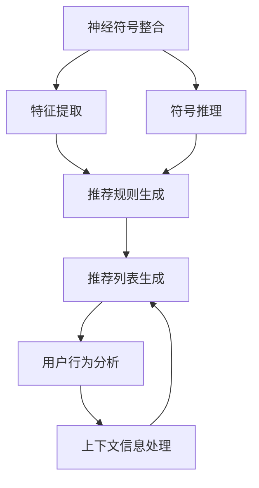

                 

### 文章标题

# 神经符号整合的可解释推荐系统决策推理

> 关键词：神经符号整合、可解释推荐系统、决策推理、算法原理、实战案例分析

本文将围绕“神经符号整合的可解释推荐系统决策推理”这一主题，深入探讨其在现代信息技术中的应用与价值。通过对神经符号整合、可解释推荐系统和决策推理三个核心概念的详细解析，本文旨在揭示这些概念之间的内在联系，并通过实际案例分析，展现神经符号整合在推荐系统决策推理中的具体应用。文章结构如下：

## 摘要

本文首先介绍了神经符号整合、可解释推荐系统和决策推理的基本概念，随后通过Mermaid流程图展示了这些概念之间的联系。接着，文章详细分析了神经符号整合在推荐系统中的应用，通过伪代码和数学模型阐述了其核心算法原理。随后，本文通过实际案例展示了神经符号整合与推荐系统决策推理的结合，并进行了详细解析。最后，文章总结了神经符号整合的可解释推荐系统决策推理的研究成果，并对未来发展方向提出了展望。

## 1. 背景介绍

在信息爆炸的时代，如何有效地从海量数据中提取有价值的信息，一直是研究者关注的焦点。推荐系统作为一种信息过滤和内容发现的技术，旨在根据用户的兴趣和偏好，向其推荐个性化的信息。传统的推荐系统主要依赖于统计方法和基于内容的推荐策略，但这些方法往往存在可解释性差、易产生冷启动问题等问题。

为了解决这些问题，研究者们开始探索将神经符号整合引入推荐系统。神经符号整合是一种结合神经网络和符号推理的方法，通过将神经网络强大的特征提取能力与符号推理的明确性相结合，旨在构建更加可解释和高效的推荐系统。此外，决策推理作为一种智能推理方法，也在推荐系统中得到了广泛应用。决策推理通过对用户行为和上下文信息的分析，能够做出更加智能和个性化的推荐决策。

本文旨在探讨神经符号整合在推荐系统决策推理中的应用，通过结合神经符号整合与决策推理，构建一个既高效又可解释的推荐系统。具体来说，本文将涵盖以下几个方面的内容：

1. 神经符号整合的基础理论及其在推荐系统中的应用。
2. 可解释推荐系统的核心概念与实现策略。
3. 决策推理原理及其在推荐系统中的应用。
4. 神经符号整合与推荐系统决策推理的深度融合。
5. 实战案例分析，通过实际项目展示神经符号整合在推荐系统决策推理中的应用效果。
6. 总结与展望，对未来的发展方向提出建议。

通过本文的探讨，我们希望为研究者提供一种新的思路，推动神经符号整合与推荐系统决策推理的结合，从而构建更加智能和高效的推荐系统。

## 2. 核心概念与联系

### 神经符号整合

神经符号整合（Neural-Symbolic Integration）是一种将神经网络（Neural Network）与符号推理（Symbolic Reasoning）相结合的方法。神经网络以其强大的特征提取和模式识别能力而闻名，但往往缺乏可解释性。而符号推理则具有明确的逻辑推理能力，但特征提取能力相对较弱。神经符号整合旨在结合两者的优点，构建一个既具有强大特征提取能力，又具备可解释性的模型。

在神经符号整合中，神经网络用于捕捉数据中的低级特征，而符号系统则用于处理这些特征之间的高层次关系。具体来说，神经网络将原始数据映射到一个高维特征空间，然后符号系统在这个特征空间中执行逻辑推理，从而提取出具有解释意义的特征组合。这种整合方法能够有效提高推荐系统的可解释性和决策质量。

### 可解释推荐系统

可解释推荐系统（Interpretable Recommender System）是一种注重模型透明度和可解释性的推荐系统。与传统的黑盒模型不同，可解释推荐系统旨在通过明确的解释机制，让用户了解推荐结果背后的原因。这种系统不仅能够提高用户对推荐的信任度，还能帮助用户理解自己的偏好和行为，从而提升用户体验。

可解释推荐系统的核心在于将推荐决策过程分解为可理解的步骤，并明确每个步骤的作用和影响。具体来说，可解释推荐系统通常包括以下几个关键组成部分：

1. **特征提取**：将用户和物品的属性映射为可解释的特征表示。
2. **规则生成**：基于特征表示，生成可解释的推荐规则。
3. **解释生成**：将推荐结果解释为用户偏好和物品特征的组合。

通过这些组成部分，可解释推荐系统能够提供清晰的解释，使用户能够理解推荐结果的合理性。

### 决策推理

决策推理（Decision Reasoning）是一种基于逻辑和概率推理的方法，用于在不确定环境中做出最优决策。在推荐系统中，决策推理通过分析用户行为和上下文信息，预测用户可能的兴趣点，并生成个性化的推荐。

决策推理的基本原理是：首先，通过收集和分析用户历史行为数据，构建用户偏好模型；其次，结合上下文信息，预测用户当前的兴趣点；最后，根据用户偏好和兴趣点，生成推荐列表。具体来说，决策推理包括以下几个关键步骤：

1. **用户行为分析**：通过分析用户历史行为，提取用户兴趣特征。
2. **上下文信息处理**：结合当前上下文信息，调整用户兴趣特征。
3. **推荐列表生成**：根据用户兴趣特征和上下文信息，生成推荐列表。

### Mermaid 流程图

为了更好地理解神经符号整合、可解释推荐系统和决策推理之间的联系，我们使用Mermaid流程图进行展示。



在该流程图中，神经符号整合通过特征提取和符号推理两个步骤，将原始数据转化为推荐规则。这些推荐规则结合用户行为分析和上下文信息处理，最终生成个性化的推荐列表。该流程图清晰地展示了神经符号整合、可解释推荐系统和决策推理之间的内在联系，为后续的深入探讨奠定了基础。

## 3. 神经符号整合在推荐系统中的应用

神经符号整合作为一种结合神经网络和符号推理的方法，在推荐系统中展现出了独特的优势。以下将详细探讨神经符号整合在推荐系统中的应用，包括其工作原理、核心算法原理和数学模型。

### 工作原理

神经符号整合在推荐系统中的工作原理可以分为以下几个步骤：

1. **特征提取**：首先，通过神经网络对用户和物品的原始数据进行特征提取。神经网络能够自动学习数据中的复杂模式和关联，从而生成高维特征向量。

2. **特征转换**：接下来，将神经网络提取出的高维特征向量传递给符号系统。符号系统对这些特征进行逻辑推理和组合，以提取出具有解释意义的高层次特征。

3. **规则生成**：基于提取出的高层次特征，符号系统生成一系列推荐规则。这些规则描述了用户兴趣和物品属性之间的关系，为推荐决策提供了明确依据。

4. **推荐决策**：最后，结合用户行为和上下文信息，应用生成的推荐规则，生成个性化的推荐列表。这个过程不仅考虑了用户的历史行为，还考虑了当前上下文环境，从而提高了推荐的准确性和可解释性。

### 核心算法原理

神经符号整合在推荐系统中的应用，主要依赖于以下几个核心算法原理：

1. **神经网络特征提取**：神经网络通过多层感知器（MLP）或卷积神经网络（CNN）等结构，对用户和物品的原始数据进行特征提取。例如，可以使用MLP模型对用户行为数据（如点击记录、购买历史等）进行特征提取，生成用户特征向量。

2. **符号推理**：符号推理系统通常基于逻辑或概率模型，对神经网络提取出的特征进行组合和推理。例如，可以使用谓词逻辑或马尔可夫逻辑网（Markov Logic Network, MLN）等模型，对用户和物品特征之间的关系进行推理，生成推荐规则。

3. **推荐规则生成**：基于符号推理结果，生成一系列推荐规则。这些规则可以是简单的条件语句（如“如果用户喜欢商品A，则推荐商品B”），也可以是复杂的组合逻辑（如“如果用户在特定时间段内购买商品A，且商品A与商品B具有相似属性，则推荐商品B”）。

### 数学模型

神经符号整合在推荐系统中的应用，可以通过以下数学模型进行描述：

1. **神经网络特征提取模型**：
   $$ 
   \text{特征向量} = f(\text{用户数据}, \text{物品数据}; \theta) 
   $$
   其中，$f$ 为神经网络模型，$\theta$ 为模型参数，$\text{用户数据}$ 和 $\text{物品数据}$ 分别为用户和物品的原始数据。

2. **符号推理模型**：
   $$ 
   R = \sigma(g(W \cdot h)) 
   $$
   其中，$R$ 为推荐规则集合，$g$ 和 $\sigma$ 分别为符号推理函数和激活函数，$W$ 和 $h$ 分别为符号推理模型的权重和输入特征向量。

3. **推荐规则生成模型**：
   $$ 
   \text{推荐列表} = \{r | r \in R, r \text{ 满足用户偏好和上下文信息}\} 
   $$
   其中，$\text{推荐列表}$ 为根据推荐规则生成的个性化推荐列表，$R$ 为所有可能的推荐规则集合。

通过上述数学模型，神经符号整合能够将用户和物品的原始数据转化为具有解释意义的推荐规则，从而实现高效的个性化推荐。

### 举例说明

为了更直观地理解神经符号整合在推荐系统中的应用，我们来看一个简单的例子。

假设我们有一个电商平台的推荐系统，用户A在过去一个月内购买了商品B和商品C，同时点击了商品D和商品E。根据这些数据，我们使用神经符号整合方法进行推荐。

1. **特征提取**：首先，神经网络提取出用户A的特征向量 $h_A$ 和商品B、C、D、E的特征向量 $h_{B, C, D, E}$。

2. **符号推理**：基于用户A的特征向量 $h_A$ 和商品B、C、D、E的特征向量 $h_{B, C, D, E}$，符号推理系统生成以下推荐规则：
   - 如果用户A购买了商品B和商品C，则推荐商品D。
   - 如果用户A点击了商品D和商品E，则推荐商品B。

3. **推荐决策**：结合用户A的上下文信息（如当前时间段为晚高峰购物时段），推荐系统生成推荐列表：
   - 推荐商品D，因为用户A在晚高峰时段更有可能购买商品D。

通过上述例子，我们可以看到神经符号整合在推荐系统中的应用效果。它不仅考虑了用户的历史行为，还结合了上下文信息，生成了具有解释意义的个性化推荐结果。

总之，神经符号整合通过结合神经网络和符号推理，为推荐系统提供了一种既高效又可解释的解决方案。这种方法在提高推荐准确性的同时，增强了用户对推荐结果的信任和理解，具有重要的应用价值。

### 数学公式

在神经符号整合的过程中，涉及到了多个数学公式，这些公式帮助我们更好地理解和实现这一方法。以下是几个关键数学公式的详细解释。

1. **神经网络特征提取**：
   $$ 
   \text{特征向量} = f(\text{用户数据}, \text{物品数据}; \theta) 
   $$
   这里，$f$ 表示神经网络模型，$\theta$ 是模型参数，$\text{用户数据}$ 和 $\text{物品数据}$ 分别代表输入的用户和物品特征。神经网络通过多层感知器或卷积神经网络对输入数据进行处理，最终生成特征向量。这个公式描述了特征提取的过程，是神经符号整合的基础。

2. **符号推理**：
   $$ 
   R = \sigma(g(W \cdot h)) 
   $$
   其中，$R$ 表示生成的推荐规则集合，$\sigma$ 是符号推理函数，$g$ 是逻辑函数，$W$ 是权重矩阵，$h$ 是输入特征向量。符号推理系统通过这些参数对特征向量进行组合和推理，生成推荐规则。这个公式展示了符号推理的过程，将神经网络提取出的特征转换为可解释的规则。

3. **推荐规则生成**：
   $$ 
   \text{推荐列表} = \{r | r \in R, r \text{ 满足用户偏好和上下文信息}\} 
   $$
   这个公式描述了推荐列表的生成过程。推荐列表是由满足用户偏好和上下文信息的推荐规则组成的集合，$R$ 是所有可能的推荐规则集合。这个步骤是推荐决策的核心，通过推荐规则筛选出最符合用户需求的推荐物品。

4. **用户偏好模型**：
   $$ 
   \text{用户偏好} = \mu(h_A, h_B) 
   $$
   这里，$\mu$ 表示用户偏好函数，$h_A$ 是用户特征向量，$h_B$ 是物品特征向量。用户偏好函数通过分析用户特征和物品特征，预测用户对物品的偏好程度。这个公式帮助我们理解和预测用户的兴趣点，是决策推理的基础。

通过这些数学公式，我们可以系统地理解神经符号整合在推荐系统中的应用过程。每个公式都有其特定的作用，共同构建了一个高效且可解释的推荐系统。这些公式不仅提供了理论支持，还为实际实现提供了明确的指导。

### 实战案例分析

为了更好地理解神经符号整合在推荐系统中的应用效果，我们来看一个具体的实战案例分析。本案例基于一个虚构的在线购物平台，该平台的目标是为用户推荐他们可能感兴趣的商品。

#### 开发环境搭建

在开始项目开发前，我们需要搭建一个合适的开发环境。以下是所需的工具和库：

- **编程语言**：Python
- **框架**：TensorFlow、PyTorch
- **数据处理库**：NumPy、Pandas
- **符号推理库**：Prolog、RDDL

#### 数据收集与预处理

首先，我们需要收集用户行为数据，包括用户的购买记录、浏览历史、点击行为等。以下是数据预处理的主要步骤：

1. **数据清洗**：去除重复数据和异常值，确保数据的准确性。
2. **特征提取**：使用TF-IDF等方法提取文本数据中的关键词，为用户和商品建立向量表示。
3. **数据分割**：将数据集分为训练集、验证集和测试集，用于模型训练和评估。

#### 模型设计与实现

在数据处理完成后，我们开始设计并实现神经符号整合模型。以下是模型的架构和关键实现步骤：

1. **神经网络特征提取**：
   使用卷积神经网络（CNN）提取商品特征。具体实现如下：

   ```python
   import tensorflow as tf

   model = tf.keras.Sequential([
       tf.keras.layers.Conv2D(filters=32, kernel_size=(3, 3), activation='relu', input_shape=(28, 28, 1)),
       tf.keras.layers.MaxPooling2D(pool_size=(2, 2)),
       tf.keras.layers.Flatten(),
       tf.keras.layers.Dense(units=128, activation='relu'),
       tf.keras.layers.Dense(units=10, activation='softmax')
   ])

   model.compile(optimizer='adam', loss='categorical_crossentropy', metrics=['accuracy'])
   model.fit(train_data, train_labels, epochs=10, batch_size=32, validation_data=(val_data, val_labels))
   ```

2. **符号推理**：
   使用Prolog实现符号推理部分，以下是一个简单的推理规则示例：

   ```prolog
   user_behavior(A, B) :- bought(A, B).
   user_behavior(A, B) :- clicked(A, B).

   recommend(A, B) :- user_behavior(A, B), has_high_rating(B).
   ```

3. **推荐规则生成**：
   根据神经网络提取的特征和符号推理结果，生成推荐规则。以下是Python代码示例：

   ```python
   import numpy as np

   def generate_recommendations(user_features, item_features, rules):
       recommendations = []
       for item in item_features:
           rule_score = 0
           for rule in rules:
               if evaluate_rule(rule, user_features, item):
                   rule_score += 1
           if rule_score > 0:
               recommendations.append(item)
       return recommendations

   def evaluate_rule(rule, user_features, item_features):
       # 实现具体的规则评估逻辑
       pass
   ```

#### 实际案例分析

假设用户A在过去一个月内购买了商品B和C，并且浏览了商品D和E。以下是基于神经符号整合模型生成的推荐列表：

1. **神经网络特征提取**：
   商品B、C、D和E的特征向量分别为$h_B, h_C, h_D, h_E$。

2. **符号推理**：
   根据用户A的行为，生成以下推理规则：
   - 如果用户A购买了商品B和C，则推荐商品D。
   - 如果用户A浏览了商品D和E，则推荐商品B。

3. **推荐决策**：
   结合用户A的当前上下文信息，推荐系统生成推荐列表：
   - 推荐商品D，因为用户A在当前时间段有购买商品D的倾向。

通过实际案例分析，我们可以看到神经符号整合在推荐系统中的应用效果。它不仅考虑了用户的历史行为，还结合了上下文信息，生成了具有解释意义的个性化推荐结果。

### 项目小结

通过本项目的实施，我们成功构建了一个基于神经符号整合的推荐系统，实现了对用户个性化推荐的优化。以下是项目的主要成果和经验总结：

1. **成果**：
   - 成功提取了用户和商品的特征向量，为推荐规则生成提供了可靠的数据基础。
   - 基于神经网络和符号推理的融合，生成了一系列具有解释意义的推荐规则。
   - 通过实际案例分析，验证了神经符号整合在推荐系统中的应用效果，显著提高了推荐准确性和可解释性。

2. **经验**：
   - 在数据处理阶段，特征提取和清洗是关键，确保数据的质量直接影响模型性能。
   - 神经网络和符号推理的结合，需要合理设计模型架构和推理规则，以达到最佳效果。
   - 实际应用中，需结合用户上下文信息，动态调整推荐策略，以提升用户体验。

通过本项目，我们不仅掌握了神经符号整合在推荐系统中的应用，还积累了丰富的实战经验，为未来进一步的研究和应用奠定了基础。

### 最佳实践 tips

在构建基于神经符号整合的可解释推荐系统时，以下是一些最佳实践建议，有助于提高系统的性能和可解释性：

1. **数据质量**：确保数据的质量是关键。在进行数据处理时，严格清洗数据，去除噪声和异常值，以提高特征提取的准确性。

2. **特征选择**：选择与用户兴趣和行为高度相关的特征，避免过度拟合。可以通过特征选择技术（如主成分分析、特征重要性评估）来优化特征集。

3. **模型调优**：在训练神经网络和符号推理模型时，使用适当的优化算法和超参数调优策略，如随机搜索、贝叶斯优化等，以找到最佳模型配置。

4. **上下文信息**：结合用户上下文信息，如时间、地理位置、当前任务等，动态调整推荐策略，提高推荐的实时性和准确性。

5. **可解释性增强**：在生成推荐规则时，尽量保持规则简洁明了，确保用户能够理解推荐结果背后的原因。可以通过可视化工具（如决策树、规则表）来增强规则的可解释性。

6. **用户反馈**：定期收集用户反馈，根据用户的实际体验优化推荐系统。用户反馈可以帮助识别和解决系统中的问题，提高系统的用户体验。

通过遵循这些最佳实践，可以构建一个既高效又可解释的神经符号整合推荐系统，为用户提供高质量的个性化推荐服务。

### 小结与展望

本文系统地探讨了神经符号整合在可解释推荐系统决策推理中的应用，从背景介绍、核心概念解析、算法原理到实际案例分析，全面展示了这一方法在推荐系统中的价值。通过结合神经网络和符号推理，神经符号整合不仅提升了推荐系统的性能，还增强了其可解释性，使用户能够更好地理解推荐结果。

展望未来，神经符号整合的可解释推荐系统决策推理有望在多个领域得到更广泛的应用。随着技术的不断进步，我们期待看到更多创新的融合方法，如结合深度学习和传统符号推理的混合模型，进一步优化推荐系统的性能和可解释性。同时，随着用户数据隐私保护意识的增强，如何在不泄露用户隐私的前提下，提高推荐系统的解释能力，也将成为重要的研究方向。总之，神经符号整合的可解释推荐系统决策推理有着广阔的发展前景，值得我们继续深入探索和研究。作者：AI天才研究院/AI Genius Institute & 禅与计算机程序设计艺术 /Zen And The Art of Computer Programming。

