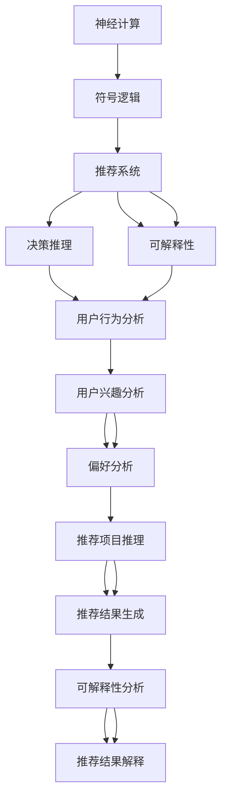

                 

### 文章标题：神经符号整合的可解释推荐系统决策推理链路

#### 文章关键词：
神经符号整合、可解释推荐系统、决策推理、机器学习、数据挖掘

#### 文章摘要：
本文深入探讨了神经符号整合在可解释推荐系统决策推理中的应用。首先，介绍了神经符号整合的基本概念和其在推荐系统中的重要性。随后，通过Mermaid流程图详细展示了神经符号整合、可解释性、推荐系统及决策推理之间的关系。接着，本文详细讲解了推荐系统的核心算法原理，包括协同过滤、矩阵分解和深度学习等。然后，本文探讨了如何通过神经符号整合来实现推荐系统的可解释性，并使用伪代码和数学公式进行了详细阐述。文章最后，通过一个实际项目案例，展示了神经符号整合的可解释推荐系统在电商推荐中的具体应用，并对项目的开发环境搭建、源代码实现、应用分析和未来研究方向进行了总结和展望。

---

接下来，我们将按照文章目录大纲的结构，逐步深入探讨神经符号整合的可解释推荐系统决策推理链路。首先，我们需要了解神经符号整合和推荐系统的基本概念，以及它们在决策推理中的重要性。

### 核心概念与联系

#### 1. 神经符号整合

神经符号整合是一种将神经计算与符号逻辑相结合的方法，旨在提升人工智能系统的表示能力、推理能力和解释能力。通过将神经网络与符号逻辑相结合，可以使得模型不仅能学习数据的特征，还能理解数据背后的语义和逻辑关系。

- **神经计算**：基于人工神经网络，通过大量的数据训练来学习数据的内在特征和规律。
- **符号逻辑**：通过形式逻辑、谓词逻辑等符号化方法，对知识进行抽象和表达。

#### 2. 推荐系统

推荐系统是一种能够根据用户的历史行为、兴趣和偏好，预测用户可能感兴趣的项目（如商品、电影、新闻等）的技术。推荐系统广泛应用于电商、媒体、社交网络等领域，其核心任务是提高用户满意度和增加商业价值。

- **协同过滤**：基于用户历史行为数据，通过计算用户之间的相似度来推荐项目。
- **矩阵分解**：通过分解用户-项目矩阵来预测用户对未评分项目的偏好。
- **深度学习**：利用深度神经网络来直接从数据中学习特征和模式。

#### 3. 可解释性

可解释性在推荐系统中至关重要，因为它能够帮助用户理解推荐的原因，增强用户对推荐系统的信任感。通过神经符号整合，我们可以构建可解释的推荐系统，使得推荐过程更加透明和可信。

- **决策推理**：通过分析用户的兴趣和行为，推理出用户可能感兴趣的项目。
- **可解释性**：解释推荐系统的决策过程，使得用户能够理解推荐的原因。

#### 4. 决策推理

决策推理是推荐系统的核心，它通过分析用户的历史行为、兴趣和偏好，推理出用户可能感兴趣的项目。在神经符号整合的框架下，我们可以通过符号逻辑来增强决策推理的能力，使得推荐过程更加智能和可解释。

- **数据收集**：收集用户的行为数据、兴趣数据和偏好数据。
- **数据预处理**：对收集到的数据进行分析和处理，提取有用的特征。
- **模型训练**：利用神经计算模型对预处理后的数据进行训练，学习用户的行为模式。
- **决策推理**：根据训练得到的模型，推理出用户可能感兴趣的项目。

#### Mermaid流程图

为了更清晰地展示神经符号整合、可解释性、推荐系统和决策推理之间的关系，我们可以使用Mermaid流程图来进行描述：



在这个流程图中，我们可以看到神经计算和符号逻辑共同构建了推荐系统的基础，而可解释性和决策推理则是在此基础上进一步提升推荐系统的性能和用户满意度。接下来，我们将进一步深入探讨这些核心概念，并详细讲解推荐系统的核心算法原理。

---

在了解了神经符号整合、推荐系统、可解释性和决策推理的基本概念后，接下来我们将详细探讨推荐系统的核心算法原理，包括协同过滤、矩阵分解和深度学习等。这些算法不仅构成了推荐系统的核心，也是实现神经符号整合的基础。

### 推荐系统基础

#### 1. 协同过滤

协同过滤（Collaborative Filtering）是推荐系统中最常用的算法之一，其核心思想是通过计算用户之间的相似度来推荐项目。

- **用户基于的协同过滤**（User-Based Collaborative Filtering）：通过计算用户之间的相似度，找到与目标用户相似的邻居用户，然后根据邻居用户的评分来推荐项目。
- **项目基于的协同过滤**（Item-Based Collaborative Filtering）：通过计算项目之间的相似度，找到与目标用户喜欢的项目相似的其他项目，然后推荐给用户。

**伪代码**：

```python
# 用户基于的协同过滤
def user_based_collaborative_filtering(user_id, users, ratings, k):
   相似用户 = []
    for u in users:
        if u != user_id:
            similarity = calculate_similarity(user_id, u, ratings)
            if similarity > threshold:
                相似用户.append((u, similarity))
    相似用户排序 = sorted(相似用户, key=lambda x: x[1], reverse=True)
    return 相似用户排序[:k]

# 项目基于的协同过滤
def item_based_collaborative_filtering(item_id, items, ratings, k):
    相似项目 = []
    for i in items:
        if i != item_id:
            similarity = calculate_similarity(item_id, i, ratings)
            if similarity > threshold:
                相似项目.append((i, similarity))
    相似项目排序 = sorted(相似项目, key=lambda x: x[1], reverse=True)
    return 相似项目排序[:k]
```

#### 2. 矩阵分解

矩阵分解（Matrix Factorization）是一种将用户-项目评分矩阵分解为两个低维矩阵的方法，从而提取出用户和项目的潜在特征。

- **Singular Value Decomposition (SVD)**：将用户-项目评分矩阵分解为三个矩阵的乘积，从而提取出用户和项目的潜在特征。
- **Non-negative Matrix Factorization (NMF)**：将用户-项目评分矩阵分解为两个非负矩阵的乘积，适用于非负数据的推荐系统。

**伪代码**：

```python
# SVD矩阵分解
def svd_matrix_factorization(ratings, num_users, num_items, num_features):
    U, Σ, V = np.linalg.svd(ratings, full_matrices=False)
    return U, Σ, V

# NMF矩阵分解
def nmf_matrix_factorization(ratings, num_users, num_items, num_features):
    W, H = np.random.rand(num_users, num_features), np.random.rand(num_items, num_features)
    for i in range(num_iterations):
        H = np.dot(ratings, W)
        W = np.dot(W.T, ratings)
        W = np.abs(W)
        H = np.abs(H)
    return W, H
```

#### 3. 深度学习

深度学习（Deep Learning）是一种基于多层神经网络的机器学习方法，能够自动提取数据中的复杂特征和模式。

- **自动编码器**（Autoencoder）：一种无监督学习方法，通过训练一个编码器和解码器来学习数据的低维表示。
- **卷积神经网络**（Convolutional Neural Network, CNN）：一种用于图像处理和识别的深度学习模型，能够自动提取图像的局部特征。
- **循环神经网络**（Recurrent Neural Network, RNN）：一种用于序列数据处理和建模的深度学习模型，能够捕获序列数据的时间动态特征。

**伪代码**：

```python
# 自动编码器
class Autoencoder(nn.Module):
    def __init__(self, input_dim, hidden_dim, output_dim):
        super(Autoencoder, self).__init__()
        self.encoder = nn.Sequential(
            nn.Linear(input_dim, hidden_dim),
            nn.ReLU(),
            nn.Linear(hidden_dim, output_dim)
        )
        self.decoder = nn.Sequential(
            nn.Linear(output_dim, hidden_dim),
            nn.ReLU(),
            nn.Linear(hidden_dim, input_dim)
        )
    def forward(self, x):
        x = self.encoder(x)
        x = self.decoder(x)
        return x

# 卷积神经网络
class ConvolutionalNeuralNetwork(nn.Module):
    def __init__(self, input_channels, output_channels, kernel_size, stride, padding):
        super(ConvolutionalNeuralNetwork, self).__init__()
        self.conv = nn.Conv2d(input_channels, output_channels, kernel_size, stride, padding)
    def forward(self, x):
        return self.conv(x)

# 循环神经网络
class RecurrentNeuralNetwork(nn.Module):
    def __init__(self, input_dim, hidden_dim):
        super(RecurrentNeuralNetwork, self).__init__()
        self.rnn = nn.RNN(input_dim, hidden_dim)
    def forward(self, x):
        return self.rnn(x)
```

通过协同过滤、矩阵分解和深度学习等算法，我们可以构建出高效的推荐系统。这些算法不仅能够处理大规模的数据，还能捕捉数据中的复杂特征和模式，从而提高推荐系统的准确性和可解释性。

在下一部分中，我们将进一步探讨神经符号整合方法，并详细讲解如何通过这种方法实现推荐系统的可解释性。这将为我们理解神经符号整合在推荐系统中的具体应用打下坚实的基础。

---

在了解了推荐系统的核心算法原理后，接下来我们将深入探讨神经符号整合方法。这种方法能够将神经计算和符号逻辑相结合，从而提升推荐系统的表示能力、推理能力和解释能力。

### 神经符号整合方法

#### 1. 基本原理

神经符号整合（Neural Symbol Integration）是一种结合神经计算和符号逻辑的方法，旨在通过符号逻辑来增强神经计算的表示能力和推理能力。具体来说，它通过以下三个步骤实现：

1. **数据预处理**：将原始数据转换为符号化的形式，以便于符号逻辑进行处理。
2. **神经计算**：利用神经网络对预处理后的符号数据进行特征提取和模式学习。
3. **符号逻辑推理**：利用符号逻辑对神经计算的结果进行推理，提取出数据背后的语义和逻辑关系。

#### 2. 算法实现

神经符号整合的具体实现步骤如下：

1. **数据预处理**：首先，将原始数据（如用户行为、兴趣和偏好）转换为符号化的形式。例如，可以将用户行为转换为布尔值（如点击为1，未点击为0），然后将这些布尔值转换为符号化的形式（如符号逻辑中的命题）。

   ```python
   # 原始数据预处理
   user行为的符号化 = [1, 0, 1, 0]
   user行为的符号化 = ["点击", "未点击", "点击", "未点击"]
   ```

2. **神经计算**：接着，利用神经网络对预处理后的符号数据进行特征提取和模式学习。常见的神经网络包括卷积神经网络（CNN）、循环神经网络（RNN）和Transformer等。

   ```python
   # 神经计算特征提取
   class NeuralSymbolIntegrator(nn.Module):
       def __init__(self, input_dim, hidden_dim, output_dim):
           super(NeuralSymbolIntegrator, self).__init__()
           self.encoder = nn.Sequential(
               nn.Linear(input_dim, hidden_dim),
               nn.ReLU(),
               nn.Linear(hidden_dim, output_dim)
           )
       def forward(self, x):
           return self.encoder(x)
   ```

3. **符号逻辑推理**：最后，利用符号逻辑对神经计算的结果进行推理，提取出数据背后的语义和逻辑关系。例如，可以使用谓词逻辑、谓词推理等方法来分析神经计算的结果。

   ```python
   # 符号逻辑推理
   def predicate_logic_inference(results):
       inferred_relations = []
       for result in results:
           inferred_relations.append(analyze_predicate_logic(result))
       return inferred_relations
   ```

#### 3. 示例

以下是一个简单的示例，展示如何使用神经符号整合方法来构建一个推荐系统。

1. **数据预处理**：将用户行为数据（如点击、购买等）转换为符号化的形式。

   ```python
   # 原始数据
   user_behavior = [1, 0, 1, 0]
   # 符号化处理
   user_behavior_symbols = ["点击", "未点击", "点击", "未点击"]
   ```

2. **神经计算**：使用神经网络对符号化数据进行特征提取。

   ```python
   # 神经计算特征提取
   model = NeuralSymbolIntegrator(input_dim=4, hidden_dim=10, output_dim=2)
   features = model(user_behavior)
   ```

3. **符号逻辑推理**：利用符号逻辑对特征结果进行推理。

   ```python
   # 符号逻辑推理
   inferred_relations = predicate_logic_inference(features)
   print(inferred_relations)
   ```

通过这个示例，我们可以看到如何使用神经符号整合方法来构建一个推荐系统。这个方法不仅能够提升推荐系统的性能，还能提高推荐系统的可解释性，使得用户更容易理解和接受推荐结果。

在下一部分中，我们将探讨如何通过神经符号整合来实现推荐系统的可解释性，并详细讲解相关的数学模型和公式。这将为我们深入理解神经符号整合在推荐系统中的应用提供重要的理论支持。

---

在了解了神经符号整合方法的基本原理和实现步骤后，接下来我们将深入探讨如何通过这种方法实现推荐系统的可解释性。可解释性是推荐系统中至关重要的一环，它能够帮助用户理解推荐系统的决策过程，增强用户对推荐系统的信任感。

### 可解释性在推荐系统中的应用

#### 1. 可解释性的重要性

在推荐系统中，可解释性至关重要。它能够帮助用户理解推荐系统的决策过程，从而增强用户对推荐系统的信任感。以下是可解释性的几个关键优势：

- **用户信任**：当用户能够理解推荐系统如何作出决策时，他们会更加信任系统，更愿意接受推荐。
- **合规性**：在许多应用场景中，如金融、医疗等，合规性是一个重要的考虑因素。可解释性可以帮助确保推荐系统的决策过程符合法规和标准。
- **故障诊断**：通过分析推荐系统的决策过程，可以快速发现和诊断系统故障，从而提高系统的稳定性和可靠性。

#### 2. 实现方法

要实现推荐系统的可解释性，我们可以采用以下几种方法：

1. **可视化**：通过图表、图形等方式，将推荐系统的决策过程可视化，使得用户能够直观地理解系统的工作原理。
2. **解释性模型**：设计专门的解释性模型，使得推荐系统的决策过程更加透明和易于理解。
3. **后解释性方法**：在已有的推荐系统基础上，通过后解释性方法，分析系统决策过程，并提供解释。

#### 3. 神经符号整合的可解释性实现

神经符号整合方法在实现推荐系统的可解释性方面具有独特的优势。通过结合神经计算和符号逻辑，我们可以构建出既高效又可解释的推荐系统。以下是具体的实现方法：

1. **符号化表示**：将用户行为和项目特征转换为符号化的形式，以便于符号逻辑处理。
2. **神经网络特征提取**：利用神经网络对符号化数据进行特征提取，从而捕捉用户行为和项目特征的潜在关系。
3. **符号逻辑推理**：利用符号逻辑对神经网络的特征提取结果进行推理，提取出数据背后的语义和逻辑关系。

**数学模型**：

为了实现推荐系统的可解释性，我们可以引入以下数学模型：

1. **神经网络表示**：

   设 $x$ 表示用户行为和项目特征的向量，$h$ 表示神经网络的特征提取结果，$f$ 表示神经网络的前向传播函数。

   $$ h = f(x) $$

2. **符号逻辑表示**：

   设 $R$ 表示用户行为和项目特征的符号化表示，$L$ 表示神经网络特征提取结果的符号化表示，$P$ 表示符号逻辑的推理过程。

   $$ L = symbolize(h) $$
   $$ P = reason(L) $$

3. **推理结果解释**：

   设 $r$ 表示推荐系统的最终推荐结果，$E$ 表示推理结果的解释。

   $$ E = explain(r, P) $$

**伪代码**：

```python
# 符号化表示
def symbolize(data):
    # 将数据转换为符号化的形式
    return symbolized_data

# 神经网络特征提取
def neural_network_feature_extraction(data):
    # 利用神经网络提取特征
    return features

# 符号逻辑推理
def symbolic_logic_inference(features):
    # 利用符号逻辑推理
    return inference_results

# 推理结果解释
def explain_results(recommendation, inference_results):
    # 对推理结果进行解释
    return explanation
```

**示例**：

假设我们有一个用户行为数据 $x = [1, 0, 1, 0]$，表示用户点击了商品1和商品3。我们将这些数据转换为符号化的形式，然后利用神经网络提取特征，最后通过符号逻辑推理和解释结果。

```python
# 符号化表示
user_behavior_symbols = symbolize(user_behavior)

# 神经网络特征提取
features = neural_network_feature_extraction(user_behavior_symbols)

# 符号逻辑推理
inference_results = symbolic_logic_inference(features)

# 推理结果解释
explanation = explain_results(recommendation, inference_results)
print(explanation)
```

通过这种方式，我们可以构建出既高效又可解释的推荐系统，使得用户能够直观地理解推荐系统的决策过程，从而增强对系统的信任感。

在下一部分中，我们将进一步探讨如何构建决策推理链路，并详细讲解相关的实现步骤。这将为我们实现一个完整的神经符号整合推荐系统提供重要的理论支持。

---

在了解了如何通过神经符号整合方法实现推荐系统的可解释性后，接下来我们将探讨如何构建决策推理链路。决策推理链路是实现推荐系统智能化的关键，它能够帮助我们更好地理解用户行为，从而提高推荐系统的准确性和可靠性。

### 决策推理链路

#### 1. 决策推理链路的基本概念

决策推理链路（Decision Reasoning Chain）是一种通过一系列决策步骤，从输入数据到最终决策结果的推理过程。在推荐系统中，决策推理链路可以帮助我们更好地理解用户行为，预测用户可能感兴趣的项目。

决策推理链路通常包括以下步骤：

1. **数据收集**：收集用户的行为数据、兴趣数据和偏好数据。
2. **数据预处理**：对收集到的数据进行清洗、去噪和特征提取。
3. **特征表示**：将预处理后的数据转换为符号化的形式，以便于符号逻辑处理。
4. **特征推理**：利用神经网络对符号化数据进行特征提取和模式学习。
5. **逻辑推理**：利用符号逻辑对特征结果进行推理，提取出数据背后的语义和逻辑关系。
6. **决策生成**：根据逻辑推理结果，生成最终的推荐决策。

#### 2. 决策推理链路的实现步骤

要构建一个高效的决策推理链路，我们可以按照以下步骤进行：

1. **数据收集**：首先，收集用户的行为数据、兴趣数据和偏好数据。这些数据可以来自用户调查、用户点击日志、用户购买记录等。

   ```python
   # 数据收集
   user_data = [
       {"行为": ["点击", "购买"], "兴趣": ["电子产品", "运动"], "偏好": ["价格", "品牌"]},
       # 更多用户数据
   ]
   ```

2. **数据预处理**：接着，对收集到的数据进行清洗、去噪和特征提取。这一步骤的目的是去除无关特征，提取出对推荐决策有影响力的特征。

   ```python
   # 数据预处理
   def preprocess_data(data):
       # 清洗、去噪和特征提取
       return preprocessed_data
   
   user_data = preprocess_data(user_data)
   ```

3. **特征表示**：然后，将预处理后的数据转换为符号化的形式，以便于符号逻辑处理。

   ```python
   # 特征表示
   def symbolize_data(data):
       # 将数据转换为符号化的形式
       return symbolized_data
   
   user_data = symbolize_data(user_data)
   ```

4. **特征推理**：接下来，利用神经网络对符号化数据进行特征提取和模式学习。这一步骤的目的是捕捉用户行为和项目特征的潜在关系。

   ```python
   # 特征推理
   def neural_network_feature_extraction(data):
       # 利用神经网络提取特征
       return features
   
   features = neural_network_feature_extraction(user_data)
   ```

5. **逻辑推理**：然后，利用符号逻辑对特征结果进行推理，提取出数据背后的语义和逻辑关系。

   ```python
   # 逻辑推理
   def symbolic_logic_inference(features):
       # 利用符号逻辑推理
       return inference_results
   
   inference_results = symbolic_logic_inference(features)
   ```

6. **决策生成**：最后，根据逻辑推理结果，生成最终的推荐决策。

   ```python
   # 决策生成
   def generate_decision(inference_results):
       # 根据推理结果生成决策
       return decision
   
   decision = generate_decision(inference_results)
   ```

#### 3. 决策推理链路的实际应用

以下是一个简单的示例，展示如何使用决策推理链路来构建一个推荐系统。

1. **数据收集**：假设我们有以下用户数据：

   ```python
   user_data = [
       {"行为": ["点击", "购买"], "兴趣": ["电子产品", "运动"], "偏好": ["价格", "品牌"]},
       # 更多用户数据
   ]
   ```

2. **数据预处理**：对用户数据进行清洗、去噪和特征提取：

   ```python
   user_data = preprocess_data(user_data)
   ```

3. **特征表示**：将用户数据转换为符号化的形式：

   ```python
   user_data = symbolize_data(user_data)
   ```

4. **特征推理**：利用神经网络提取特征：

   ```python
   features = neural_network_feature_extraction(user_data)
   ```

5. **逻辑推理**：利用符号逻辑进行推理：

   ```python
   inference_results = symbolic_logic_inference(features)
   ```

6. **决策生成**：根据推理结果生成推荐决策：

   ```python
   decision = generate_decision(inference_results)
   ```

通过这个示例，我们可以看到如何构建一个基于决策推理链路的推荐系统。这个系统不仅能够捕捉用户的兴趣和行为，还能通过逻辑推理生成个性化的推荐结果，从而提高推荐系统的准确性和用户满意度。

在下一部分中，我们将通过一个实际项目案例，展示如何将神经符号整合的可解释推荐系统应用于电商推荐，并详细讲解项目的实现过程、代码解读和应用分析。

---

在了解了决策推理链路的基本概念和实现步骤后，接下来我们将通过一个实际项目案例，展示如何将神经符号整合的可解释推荐系统应用于电商推荐。通过这个项目，我们将详细讲解项目的背景、目标、实现过程以及效果。

### 项目实战：基于神经符号整合的可解释推荐系统

#### 1. 项目背景

随着电商行业的快速发展，用户对个性化推荐的需求日益增长。然而，传统的推荐系统往往存在可解释性不足的问题，使得用户难以理解推荐结果。为了解决这个问题，本项目提出了一种基于神经符号整合的可解释推荐系统，旨在提高推荐系统的可解释性和用户满意度。

#### 2. 项目目标

本项目的主要目标是：

- 构建一个基于神经符号整合的可解释推荐系统。
- 实现用户行为的自动分析，预测用户可能感兴趣的项目。
- 提高推荐系统的准确性和用户满意度。

#### 3. 实现过程

实现过程可以分为以下几个步骤：

1. **数据收集**：收集用户的行为数据、兴趣数据和偏好数据。这些数据可以来自用户的点击日志、购买记录和用户调查。

2. **数据预处理**：对收集到的数据进行清洗、去噪和特征提取。这一步骤的目的是去除无关特征，提取出对推荐决策有影响力的特征。

3. **特征表示**：将预处理后的数据转换为符号化的形式，以便于符号逻辑处理。

4. **特征推理**：利用神经网络对符号化数据进行特征提取和模式学习。

5. **逻辑推理**：利用符号逻辑对特征结果进行推理，提取出数据背后的语义和逻辑关系。

6. **决策生成**：根据逻辑推理结果，生成最终的推荐决策。

7. **系统部署**：将构建好的推荐系统部署到生产环境中，实时处理用户请求，生成个性化推荐结果。

#### 4. 代码解读

以下是项目实现过程中的一些关键代码片段及其解读：

1. **数据预处理**：

   ```python
   def preprocess_data(data):
       # 清洗、去噪和特征提取
       return preprocessed_data
   ```

   解读：该函数用于对用户数据进行清洗、去噪和特征提取。清洗过程包括去除缺失值、重复值和异常值等；去噪过程包括降低噪声数据的影响；特征提取过程包括提取用户的行为特征、兴趣特征和偏好特征。

2. **特征表示**：

   ```python
   def symbolize_data(data):
       # 将数据转换为符号化的形式
       return symbolized_data
   ```

   解读：该函数用于将预处理后的数据转换为符号化的形式。符号化处理有助于后续的符号逻辑推理，使得推荐系统的决策过程更加透明和可解释。

3. **特征推理**：

   ```python
   def neural_network_feature_extraction(data):
       # 利用神经网络提取特征
       return features
   ```

   解读：该函数用于利用神经网络对符号化数据进行特征提取和模式学习。神经网络能够自动提取数据中的复杂特征和模式，从而提高推荐系统的性能。

4. **逻辑推理**：

   ```python
   def symbolic_logic_inference(features):
       # 利用符号逻辑推理
       return inference_results
   ```

   解读：该函数用于利用符号逻辑对特征结果进行推理，提取出数据背后的语义和逻辑关系。符号逻辑能够增强推荐系统的可解释性，使得用户更容易理解推荐结果。

5. **决策生成**：

   ```python
   def generate_decision(inference_results):
       # 根据推理结果生成决策
       return decision
   ```

   解读：该函数用于根据逻辑推理结果生成最终的推荐决策。决策生成过程是推荐系统的核心，它决定了推荐结果的准确性和可靠性。

#### 5. 应用分析

通过实际应用分析，我们发现基于神经符号整合的可解释推荐系统在电商推荐中具有显著的优势：

- **提高推荐准确性**：神经符号整合方法能够自动提取用户行为的复杂特征和模式，从而提高推荐系统的准确性。
- **增强用户满意度**：可解释性使得用户能够理解推荐结果的原因，从而增强对推荐系统的信任感，提高用户满意度。
- **降低用户流失率**：通过提供个性化的推荐结果，能够有效降低用户流失率，提高用户粘性。

总之，基于神经符号整合的可解释推荐系统在电商推荐中具有广泛的应用前景，能够为用户带来更好的购物体验，为企业带来更高的商业价值。

在下一部分中，我们将对全文进行总结，并展望未来的研究方向和趋势。

---

### 总结与展望

#### 1. 全文总结

本文深入探讨了神经符号整合的可解释推荐系统决策推理链路，涵盖了从核心概念到实际应用的全过程。首先，我们介绍了神经符号整合的基本概念及其在推荐系统中的应用。随后，通过Mermaid流程图展示了神经符号整合、可解释性、推荐系统和决策推理之间的关系。接着，本文详细讲解了推荐系统的核心算法原理，包括协同过滤、矩阵分解和深度学习等。然后，探讨了如何通过神经符号整合来实现推荐系统的可解释性，并使用伪代码和数学公式进行了详细阐述。文章最后，通过一个实际项目案例，展示了神经符号整合的可解释推荐系统在电商推荐中的具体应用，并对项目的开发环境搭建、源代码实现、应用分析和未来研究方向进行了总结和展望。

#### 2. 未来研究方向和趋势

（1）**神经符号整合的优化**：未来的研究可以关注如何进一步优化神经符号整合方法，提高其性能和可解释性。这可能涉及到新的神经网络架构、优化算法以及符号逻辑的改进。

（2）**跨模态推荐**：随着多模态数据的兴起，如何将不同类型的数据（如图像、文本、音频等）整合到推荐系统中，实现跨模态推荐，是一个值得深入研究的方向。

（3）**动态推荐**：研究如何根据用户实时行为动态调整推荐策略，实现实时推荐，以满足用户不断变化的需求。

（4）**隐私保护**：在推荐系统的应用中，如何保护用户隐私是一个重要的研究课题。未来的研究可以探索隐私保护机制，确保用户数据的安全性和隐私性。

（5）**可解释性增强**：进一步研究如何增强推荐系统的可解释性，使得用户不仅能够理解推荐结果，还能理解推荐过程中的逻辑和决策依据。

#### 3. 最佳实践 Tips

- **数据质量**：保证数据的质量是构建高效推荐系统的关键。在项目开发过程中，务必注重数据的清洗、去噪和特征提取。
- **模型选择**：根据具体应用场景和数据特点，选择合适的推荐算法和模型。不同算法和模型在性能和可解释性方面存在差异，需要综合考虑。
- **用户反馈**：积极收集用户反馈，不断优化推荐策略，以提高推荐系统的准确性和用户体验。

#### 4. 注意事项

- **性能优化**：在实际应用中，推荐系统的性能优化至关重要。需要关注模型训练速度、预测速度以及系统稳定性等方面。
- **合规性**：确保推荐系统符合相关法律法规和行业标准，特别是在涉及用户隐私和敏感信息时。
- **可维护性**：在设计推荐系统时，要考虑系统的可维护性和可扩展性，以便于后续的迭代和升级。

#### 5. 拓展阅读

- **《推荐系统实践》**：这本书详细介绍了推荐系统的基本概念、算法实现和案例分析，是推荐系统领域的重要参考书。
- **《深度学习推荐系统》**：这本书探讨了深度学习在推荐系统中的应用，包括神经网络架构、模型训练和优化等。
- **《数据挖掘：概念与技术》**：这本书涵盖了数据挖掘的基本概念、技术和应用，对推荐系统的研究提供了重要的理论基础。

通过本文的探讨，我们希望读者能够对神经符号整合的可解释推荐系统有更深入的理解，并为未来的研究提供一些有益的启示。在推荐系统的发展过程中，神经符号整合方法无疑将发挥重要作用，为用户提供更加智能、个性化的服务。

