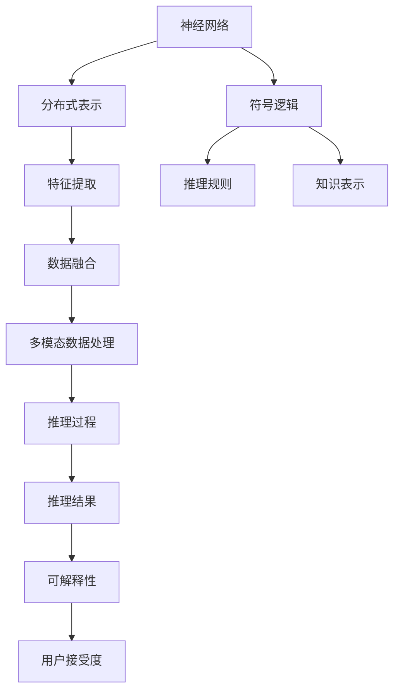

                 


# 文章标题：神经符号整合的可解释法律推理与建议系统设计优化

> 关键词：神经符号整合，可解释法律推理，法律建议系统，系统设计优化

> 摘要：本文主要探讨神经符号整合在法律推理与建议系统设计优化中的应用。通过介绍神经符号整合的基本概念和原理，阐述其在法律推理中的应用，以及如何设计一个优化的法律建议系统。文章将通过实际案例和项目实战，展示神经符号整合技术的具体应用，并探讨未来发展趋势和面临的挑战。

## 第一部分：神经符号整合与法律推理基础

### 第1章：神经符号整合与法律推理概述

#### 1.1 神经符号整合的基本概念

神经符号整合是一种结合神经计算和符号逻辑的方法，旨在解决传统计算模型在处理复杂、模糊和非线性问题时存在的局限性。其核心思想是将神经网络的分布式表示能力与符号逻辑的推理能力相结合，实现更高层次的知识理解和推理。

#### 1.2 法律推理的基本原理

法律推理是指从已知事实和法律规定推导出法律结论的思维过程。其基本原理包括法律规则、法律原则和法律事实。法律规则是法律推理的基础，法律原则是对法律规则的补充，法律事实则是法律推理的前提。

#### 1.3 可解释性法律推理

可解释性法律推理是指法律推理过程中的推理步骤、推理规则和推理结果可以被理解和解释的能力。在法律领域中，可解释性法律推理对于提高法律决策的透明度和可信度具有重要意义。

## 第二部分：神经符号整合在法律推理中的应用

### 第2章：神经符号整合在法律推理中的应用实例

#### 2.1 应用案例分析

在本章中，我们将通过两个具体的案例分析，展示神经符号整合在法律推理中的应用。

#### 2.2 神经符号整合算法的设计与实现

在本章中，我们将详细介绍神经符号整合算法的设计与实现过程。首先，我们将介绍算法的核心步骤，然后使用伪代码展示算法的具体实现。

## 第三部分：法律建议系统的设计与优化

### 第3章：法律建议系统的基础架构

在本章中，我们将探讨法律建议系统的基础架构，包括系统设计原则、关键模块和功能划分。

### 第4章：法律建议系统的优化策略

在本章中，我们将介绍法律建议系统的优化策略，包括性能优化、可解释性优化和安全性与隐私保护。

## 第四部分：项目实战与案例研究

### 第5章：神经符号整合法律建议系统项目实战

在本章中，我们将以一个具体的项目为例，展示神经符号整合法律建议系统的开发过程。从项目背景、需求分析到系统开发与实现，我们将详细解读项目中的关键步骤。

### 第6章：神经符号整合法律建议系统的未来发展

在本章中，我们将探讨神经符号整合法律建议系统的未来发展，包括技术进步、市场前景和面临的挑战。

## 第五部分：总结与展望

### 第7章：总结与展望

在本章中，我们将对全文进行总结，并展望未来神经符号整合法律推理与建议系统的研究方向和应用前景。

接下来，我们将根据上述大纲，逐步细化每个章节的内容，确保文章结构合理、逻辑清晰、内容丰富。首先，我们将从核心概念与联系开始，逐步深入到具体算法原理、数学模型和项目实战。请提供具体内容，以便我们开始细化文章。同时，如果您有任何其他要求或建议，请随时告诉我。让我们一起让这篇技术博客文章更加精彩！

### 神经符号整合的基本概念

神经符号整合（Neural-Symbolic Integration）是一种将神经网络和符号逻辑相结合的方法，旨在克服单一方法在处理复杂问题时存在的局限性。神经网络擅长处理大规模数据和高维特征，而符号逻辑则具有明确的推理规则和可解释性。二者的整合，使得系统在处理复杂任务时既具备强大的数据处理能力，又保持逻辑推理的透明性和可解释性。

神经符号整合的基本概念可以概括为以下几点：

1. **神经网络与符号逻辑的结合**：神经符号整合的核心在于将神经网络的分布式表示能力与符号逻辑的推理能力相结合。神经网络负责学习数据的分布式表示，而符号逻辑则负责利用这些表示进行推理。

2. **多模态数据处理**：神经符号整合能够处理多种类型的数据，如图像、文本、音频等。神经网络通过学习数据的高维表示，实现了不同模态数据之间的交叉融合。

3. **知识表示与推理**：符号逻辑为系统提供了明确的推理规则和知识表示方法。通过将神经网络学到的分布式表示与符号逻辑结合，系统能够进行高层次的抽象推理。

4. **可解释性与透明性**：神经符号整合保持了符号逻辑的可解释性，使得系统的推理过程和结果可以被人理解和验证。

接下来，我们将详细探讨神经符号整合的优势，并使用Mermaid流程图展示核心概念之间的联系。

#### 神经符号整合的优势

神经符号整合具有以下几大优势：

1. **提升推理能力**：通过结合神经网络的分布式表示能力和符号逻辑的推理能力，系统能够处理更加复杂的推理任务，特别是在需要跨领域知识整合的情况下。

2. **增强可解释性**：符号逻辑为系统提供了可解释的推理过程，使得系统输出的结果更加透明，便于用户理解和接受。

3. **多模态数据处理**：神经符号整合能够高效处理多种类型的数据，如图像、文本和音频等，为复杂任务提供了更丰富的输入信息。

4. **提高泛化能力**：通过将神经网络与符号逻辑相结合，系统能够从大量的训练数据中学习到更具泛化能力的知识，从而在新的任务和数据集上表现良好。

5. **降低错误率**：神经符号整合通过结合不同方法的优势，能够在处理复杂任务时降低错误率，提高系统的鲁棒性。

#### 核心概念之间的联系

为了更好地理解神经符号整合的核心概念，我们使用Mermaid流程图展示这些概念之间的联系：



**图1：神经符号整合的核心概念联系**

- **神经网络与分布式表示**：神经网络通过学习分布式表示，将输入数据转换为高维特征向量。
- **特征提取与数据融合**：神经网络提取的特征向量用于数据融合，实现多模态数据的有效整合。
- **符号逻辑与推理规则、知识表示**：符号逻辑提供明确的推理规则和知识表示方法，用于处理复杂推理任务。
- **推理过程与结果的可解释性**：推理过程中的每一步都是可解释的，使得系统输出的结果透明且易于用户理解。

通过上述流程图，我们可以清晰地看到神经符号整合如何将神经网络和符号逻辑相结合，从而实现高效的推理和可解释性。在接下来的章节中，我们将进一步探讨神经符号整合在法律推理中的应用，以及如何设计和优化法律建议系统。希望这个详细的解释和流程图能够帮助您更好地理解神经符号整合的概念和原理。如果您有任何问题或需要进一步的解释，请随时告诉我。让我们一起深入探讨这一先进技术的更多细节！

### 法律推理的基本原理

法律推理是法律实践中至关重要的思维过程，它涉及从已知的事实和法律规定中推导出法律结论。法律推理的基本原理包括法律规则、法律原则和法律事实。这些原理相互作用，共同构成了法律推理的基础。

#### 法律规则

法律规则是法律推理的核心组成部分，它通常以明确的条文形式存在，规定了社会行为的标准和后果。法律规则可以分为两大类：实体规则和程序规则。

- **实体规则**：实体规则规定了个人的权利和义务，如合同法、侵权法等。这些规则明确了在特定情况下，哪些行为是合法的，哪些是非法的。
- **程序规则**：程序规则则规定了如何进行法律诉讼和司法程序，如证据规则、诉讼时效等。这些规则确保了法律过程的公平和效率。

法律规则在法律推理中起到关键作用，它们提供了法律判断的基础。在分析一个案件时，法律规则有助于确定哪些事实是相关的，以及如何对这些事实进行法律评价。

#### 法律原则

法律原则是法律规则的补充，它们提供了更为抽象和普遍的法律指导。法律原则通常不具有具体的条文形式，而是通过案例和法律理论来体现。常见的法律原则包括：

- **正义原则**：追求法律结果的公平和合理，确保法律对所有人平等适用。
- **自由原则**：保障个人自由，限制政府权力，使法律不侵犯个人基本权利。
- **公共利益原则**：法律应当服务于社会整体利益，而不是个人或特定群体的利益。

法律原则在法律推理中起到指导作用，它们帮助法官和律师在法律规则之外进行判断，尤其是在面对新型或模糊的法律情境时。

#### 法律事实

法律事实是法律推理的另一个基本要素，它指的是在法律意义上被认为是真实的事实。法律事实可以分为两类：

- **主要事实**：主要事实是法律规则和法律原则适用所必需的事实，如合同条款、侵权行为等。
- **辅助事实**：辅助事实虽然不是法律规则和原则的直接适用前提，但它们有助于解释主要事实或支持法律结论。

法律事实的确定对于法律推理至关重要，因为它们是推导法律结论的基础。法官和律师需要通过证据和逻辑分析来确认和评估法律事实。

#### 法律推理的类型与方法

法律推理可以分为以下几种类型：

- **演绎推理**：演绎推理是从一般到个别的推理方法，它以普遍适用的法律规则为起点，推导出特定情况下的法律结论。例如，“所有人都有权享受公正审判，张三是人，因此张三有权享受公正审判。”
- **归纳推理**：归纳推理是从个别到一般的推理方法，它通过分析一系列具体案例，归纳出普遍适用的法律规则。例如，分析多个合同纠纷案例，总结出合同条款应明确、具体的规定。
- **类比推理**：类比推理是通过比较两个或多个类似案例，推导出法律结论的方法。例如，如果案例A和B在关键事实和法律规定上相似，那么B的法律结论可以参照A。

法律推理的方法通常包括以下步骤：

1. **识别法律规则和原则**：分析案件事实，识别适用的法律规则和原则。
2. **确定法律事实**：通过证据和逻辑分析，确定案件中的主要和辅助事实。
3. **应用法律规则和原则**：将法律规则和原则应用于案件事实，推导出法律结论。
4. **评估法律结论**：审查法律结论的合理性和正当性，确保其符合法律原则和社会价值。

通过上述法律推理的基本原理和类型，我们可以更好地理解法律推理的过程和重要性。在下一章节中，我们将探讨如何实现可解释性法律推理，并详细讨论其在法律实践中的应用。这将有助于我们更深入地了解神经符号整合在法律领域中的潜力。如果您有任何疑问或需要进一步的解释，请随时提问。让我们继续探讨这个话题的更多细节！

### 可解释性法律推理

可解释性法律推理（Explainable Legal Reasoning）在法律领域中具有重要意义。随着人工智能和机器学习技术在法律推理中的应用越来越广泛，如何确保系统的推理结果透明、可解释和符合法律原则成为一个关键问题。可解释性法律推理旨在提供一种方法，使法律推理过程和结果能够被用户理解和验证，从而增强法律决策的透明度和可信度。

#### 可解释性在法律推理中的重要性

1. **增强透明度**：法律推理的透明度对于司法公正至关重要。如果法律推理过程不透明，法官和律师可能无法充分理解系统输出的结论，从而影响法律决策的公正性和合法性。

2. **提高可信度**：法律推理的可解释性有助于提高系统输出的可信度。当用户能够理解推理过程和结果时，他们更可能接受和信任系统的决策。

3. **保障法律原则**：可解释性法律推理能够确保法律推理过程符合法律原则和社会价值观。通过透明地展示推理步骤和依据，系统可以避免潜在的偏见和不公正。

#### 可解释性法律推理的实现机制

实现可解释性法律推理需要结合符号逻辑和神经网络的优势。以下是一些常见的实现机制：

1. **符号逻辑**：符号逻辑提供了明确的推理规则和知识表示方法，使推理过程具有透明性和可解释性。通过使用形式化的逻辑语言，法律推理过程可以以清晰、结构化的方式呈现。

2. **可视化**：可视化技术可以帮助用户更好地理解复杂的法律推理过程。例如，通过图形化展示推理步骤、条件和结果，用户可以直观地了解推理过程。

3. **解释性算法**：一些专门设计的算法可以生成解释性输出，例如决策树、解释性神经网络等。这些算法在输出结果时，会提供详细的解释和推理过程，帮助用户理解系统决策。

4. **透明性工具**：开发透明的工具和界面，使法律推理系统的内部工作过程对外部用户可见。例如，提供详细的日志记录、调试信息和用户交互界面，使用户可以跟踪推理过程和结果。

#### 实现步骤

1. **明确推理目标和规则**：首先，需要明确法律推理的目标和适用规则。这包括确定需要推理的法律问题、适用的法律规则和原则。

2. **构建符号逻辑模型**：使用符号逻辑语言构建法律推理模型。这包括定义法律规则、原则和事实，并建立它们之间的逻辑关系。

3. **实现神经网络模型**：结合神经网络模型，学习法律文本和数据中的分布式表示。神经网络可以用于特征提取和模式识别，从而增强法律推理的准确性和泛化能力。

4. **整合符号逻辑与神经网络**：将符号逻辑模型和神经网络模型整合，形成一个统一的推理系统。通过结合二者的优势，实现高效、准确且可解释的法律推理。

5. **生成解释性输出**：在推理过程中，生成解释性输出，包括推理步骤、条件和结果。通过可视化工具和解释性算法，使推理过程和结果透明、易懂。

通过上述机制和步骤，我们可以实现一个具有高可解释性的法律推理系统。这将有助于提高法律决策的透明度和可信度，为司法实践和人工智能在法律领域的应用提供强有力的支持。在下一章节中，我们将探讨神经符号整合在法律推理中的应用实例，进一步展示如何将可解释性法律推理应用于实际场景。请继续关注，我们将在下一章节中深入探讨这些应用实例。如果您有任何问题或需要进一步的解释，请随时提问。让我们一起深入探讨神经符号整合在法律推理中的潜力！

### 第2章：神经符号整合在法律推理中的应用实例

#### 2.1 应用案例分析

在本节中，我们将通过两个具体的案例，展示神经符号整合在法律推理中的应用。这些案例将展示如何利用神经符号整合技术，实现更准确、透明且可解释的法律推理。

#### 案例一：合同纠纷分析

**背景介绍**：
某公司（甲方）与某供应商（乙方）签订了一份采购合同，约定乙方在三个月内交付一批电子产品。然而，乙方在合同到期时未能按时交付。甲方因此提起诉讼，要求乙方履行合同并支付违约金。

**法律推理过程**：

1. **符号逻辑模型**：
   - 定义法律规则：合同法规定，合同双方应按照合同条款履行义务。如一方未能履行，另一方有权要求履行或赔偿损失。
   - 确定事实：乙方未能按时交付产品，违反了合同条款。
   - 推理规则：根据合同法的规定，甲方有权要求乙方履行合同或支付违约金。

2. **神经网络模型**：
   - 学习合同文本的分布式表示，提取关键信息，如合同条款、交货时间、违约金等。
   - 通过模式识别，判断乙方行为是否构成违约。

3. **神经符号整合**：
   - 符号逻辑模型提供明确的推理规则，确保法律推理的透明性和合理性。
   - 神经网络模型提供对合同文本的理解和模式识别能力，提高法律推理的准确性。

**结论**：
根据神经符号整合的法律推理，法院判定乙方构成违约，应履行合同或支付违约金。

#### 案例二：知识产权保护分析

**背景介绍**：
某科技公司开发了一款新型智能手机应用程序，并在国内外申请了相关专利。然而，另一家公司未经授权，在其产品中使用了与该应用程序相似的界面设计。科技公司因此提起诉讼，要求另一家公司停止侵权行为并赔偿损失。

**法律推理过程**：

1. **符号逻辑模型**：
   - 定义法律规则：知识产权法规定，知识产权权利人有权禁止他人未经授权使用其知识产权。
   - 确定事实：另一家公司未经授权，使用了与科技公司应用程序相似的界面设计。
   - 推理规则：根据知识产权法的规定，另一家公司行为构成侵权。

2. **神经网络模型**：
   - 学习专利文本和侵权案例的分布式表示，提取关键信息，如专利描述、侵权行为等。
   - 通过对比分析，判断另一家公司的行为是否构成侵权。

3. **神经符号整合**：
   - 符号逻辑模型提供明确的推理规则，确保法律推理的透明性和合理性。
   - 神经网络模型提供对知识产权法律文本的理解和模式识别能力，提高法律推理的准确性。

**结论**：
根据神经符号整合的法律推理，法院判定另一家公司构成侵权，应停止侵权行为并赔偿损失。

#### 案例总结

通过上述两个案例，我们可以看到神经符号整合在法律推理中的应用具有显著优势：

1. **提高准确性**：神经符号整合结合了神经网络的强大模式识别能力和符号逻辑的明确推理规则，能够更准确地分析法律问题和判断法律事实。

2. **增强可解释性**：符号逻辑模型为法律推理提供了透明的推理步骤和依据，使得法律推理结果易于理解和接受。

3. **提升法律决策的透明度和可信度**：神经符号整合技术使得法律推理过程更加透明，用户可以清晰地了解推理步骤和依据，从而增强法律决策的透明度和可信度。

在下一章节中，我们将详细介绍神经符号整合算法的设计与实现，展示如何将神经计算和符号逻辑结合起来，构建一个高效、准确且可解释的法律推理系统。请继续关注，我们将深入探讨算法的核心步骤和具体实现方法。如果您有任何问题或需要进一步的解释，请随时提问。让我们一起继续探索神经符号整合在法律推理中的应用！

### 神经符号整合算法的设计与实现

神经符号整合算法的设计与实现是构建高效、准确且可解释法律推理系统的关键。在这一章节中，我们将详细介绍神经符号整合算法的核心步骤，并使用伪代码来展示具体的实现过程。

#### 算法核心步骤

神经符号整合算法通常包括以下几个核心步骤：

1. **数据预处理**：
   - 收集和清洗法律文本数据，包括合同、法律条文、案例等。
   - 将法律文本转换为结构化的数据格式，如词汇表和词向量。

2. **神经网络模型训练**：
   - 使用词向量表示法律文本中的词汇和句子。
   - 训练神经网络模型，提取法律文本中的关键特征。

3. **符号逻辑推理**：
   - 定义法律规则和推理步骤，使用符号逻辑进行推理。
   - 结合神经网络提取的特征，生成法律推理结果。

4. **解释性输出**：
   - 生成解释性输出，包括推理步骤、条件和结果。
   - 使用可视化工具和解释性算法，使推理过程和结果透明、易懂。

#### 伪代码实现

以下是一个简化的伪代码实现，展示神经符号整合算法的核心步骤：

```python
# 数据预处理
def preprocess_data(data):
    # 收集和清洗法律文本数据
    # 转换为结构化的数据格式
    # 返回预处理后的数据
    pass

# 神经网络模型训练
def train_neural_network(preprocessed_data):
    # 使用词向量表示法律文本
    # 训练神经网络模型，提取关键特征
    # 返回训练好的神经网络模型
    pass

# 符号逻辑推理
def symbolic_reasoning(law_rules, neural_features):
    # 定义法律规则和推理步骤
    # 结合神经网络提取的特征进行推理
    # 返回推理结果
    pass

# 解释性输出
def generate_explanation(reasoning_steps, reasoning_result):
    # 生成解释性输出
    # 使用可视化工具和解释性算法
    # 返回解释性结果
    pass

# 神经符号整合算法
def neural_symbolic_integration(data, law_rules):
    preprocessed_data = preprocess_data(data)
    neural_network_model = train_neural_network(preprocessed_data)
    reasoning_result = symbolic_reasoning(law_rules, neural_network_model)
    explanation_result = generate_explanation(reasoning_steps, reasoning_result)
    return explanation_result
```

#### 具体实现

1. **数据预处理**：

   数据预处理是神经符号整合算法的第一步。在这个阶段，我们需要对法律文本进行清洗和转换，以便后续的神经网络训练和推理。以下是一个简化的数据预处理流程：

   ```python
   def preprocess_data(data):
       # 删除无关字符和标点符号
       cleaned_data = remove_punctuation_and_whitespace(data)
       
       # 建立词汇表
       vocabulary = build_vocabulary(cleaned_data)
       
       # 将法律文本转换为词向量
       word_vectors = convert_to_word_vectors(cleaned_data, vocabulary)
       
       return word_vectors
   ```

2. **神经网络模型训练**：

   在这一阶段，我们使用训练数据集训练神经网络模型，提取法律文本中的关键特征。以下是一个简化的神经网络模型训练过程：

   ```python
   def train_neural_network(preprocessed_data):
       # 初始化神经网络模型
       model = initialize_neural_network_model()
       
       # 训练神经网络模型
       model.fit(preprocessed_data['inputs'], preprocessed_data['labels'])
       
       # 评估模型性能
       performance = evaluate_model(model, preprocessed_data['test_data'])
       
       return model, performance
   ```

3. **符号逻辑推理**：

   符号逻辑推理是神经符号整合算法的核心步骤。在这个阶段，我们使用训练好的神经网络模型提取的特征，结合符号逻辑规则进行推理。以下是一个简化的符号逻辑推理过程：

   ```python
   def symbolic_reasoning(law_rules, neural_features):
       # 定义推理步骤
       reasoning_steps = define_reasoning_steps(law_rules)
       
       # 结合神经网络特征进行推理
       reasoning_result = apply_reasoning_steps(reasoning_steps, neural_features)
       
       return reasoning_result
   ```

4. **解释性输出**：

   解释性输出是确保法律推理系统可解释性的关键。在这个阶段，我们生成详细的解释性输出，包括推理步骤和结果。以下是一个简化的解释性输出过程：

   ```python
   def generate_explanation(reasoning_steps, reasoning_result):
       # 生成解释性输出
       explanation = create_explanation(reasoning_steps, reasoning_result)
       
       # 使用可视化工具展示解释
       visualize_explanation(explanation)
       
       return explanation
   ```

通过上述步骤和伪代码，我们可以构建一个基本的神经符号整合算法框架。在实际应用中，这些步骤需要根据具体需求进行调整和优化。在下一章节中，我们将探讨如何设计和优化法律建议系统，确保其高效、准确且可解释。请继续关注，我们将深入探讨系统设计和优化的策略。如果您有任何问题或需要进一步的解释，请随时提问。让我们一起继续探索神经符号整合在法律建议系统中的应用！

### 第3章：法律建议系统的基础架构

法律建议系统是一种利用人工智能技术提供法律咨询和决策支持的工具。其基础架构的设计直接关系到系统的性能、可扩展性和用户体验。在这一章节中，我们将详细探讨法律建议系统的整体架构设计，包括系统架构、关键模块以及各个模块的功能与实现。

#### 系统架构设计

法律建议系统的整体架构可以划分为以下几个主要模块：

1. **数据输入模块**：负责接收用户输入的数据，如案件事实、法律条文等。
2. **数据处理模块**：对输入的数据进行清洗、转换和预处理，以适应后续的推理和决策过程。
3. **推理与决策模块**：利用神经网络和符号逻辑进行法律推理，生成法律建议。
4. **解释与可视化模块**：生成解释性输出，将推理过程和结果以用户友好的方式展示。
5. **用户交互模块**：提供用户界面，实现用户与系统的交互，包括数据输入、结果展示和反馈收集。

#### 关键模块设计与实现

1. **数据输入模块**

   数据输入模块是法律建议系统的入口，负责接收用户输入的数据。这一模块需要支持多种数据格式的输入，如文本、表格和图像等。以下是一个简化的数据输入模块设计：

   ```python
   def data_input():
       # 接收用户输入数据
       input_data = get_user_input()
       
       # 数据预处理
       preprocessed_data = preprocess_input_data(input_data)
       
       return preprocessed_data
   ```

2. **数据处理模块**

   数据处理模块负责对输入的数据进行清洗、转换和预处理。这一模块的设计需要考虑数据的多样性、复杂性和不一致性。以下是一个简化的数据处理模块设计：

   ```python
   def preprocess_input_data(input_data):
       # 清洗数据
       cleaned_data = clean_data(input_data)
       
       # 转换数据格式
       formatted_data = convert_format(cleaned_data)
       
       # 预处理数据
       preprocessed_data = preprocess_data(formatted_data)
       
       return preprocessed_data
   ```

3. **推理与决策模块**

   推理与决策模块是法律建议系统的核心，负责利用神经网络和符号逻辑进行法律推理，生成法律建议。这一模块的设计需要考虑推理过程的可解释性和准确性。以下是一个简化的推理与决策模块设计：

   ```python
   def legal_reasoning(preprocessed_data, law_rules):
       # 加载训练好的神经网络模型
       neural_network_model = load_model('neural_network_model')
       
       # 加载符号逻辑推理规则
       reasoning_rules = load_rules('law_rules')
       
       # 进行法律推理
       reasoning_result = apply_reasoning(preprocessed_data, reasoning_rules)
       
       return reasoning_result
   ```

4. **解释与可视化模块**

   解释与可视化模块负责生成解释性输出，将推理过程和结果以用户友好的方式展示。这一模块的设计需要考虑多种可视化工具和解释算法的使用。以下是一个简化的解释与可视化模块设计：

   ```python
   def generate_explanation(reasoning_result):
       # 生成解释性文本
       explanation_text = create_explanation_text(reasoning_result)
       
       # 可视化展示
       visualization = visualize_explanation(explanation_text)
       
       return visualization
   ```

5. **用户交互模块**

   用户交互模块是法律建议系统与用户之间的桥梁，提供用户界面，实现用户与系统的交互。这一模块的设计需要考虑用户体验和交互设计的便捷性。以下是一个简化的用户交互模块设计：

   ```python
   def user_interface():
       # 显示用户界面
       display_interface()
       
       # 接收用户操作
       user_action = get_user_action()
       
       # 处理用户请求
       processed_request = process_request(user_action)
       
       # 显示结果
       display_result(processed_request)
   ```

#### 各个模块的功能与实现

1. **数据输入模块**：实现用户数据的接收和预处理，为后续模块提供干净、结构化的数据。

2. **数据处理模块**：实现数据的清洗、转换和预处理，为法律推理模块提供高质量的数据输入。

3. **推理与决策模块**：结合神经网络和符号逻辑，实现高效、准确的法律推理，生成具有可解释性的法律建议。

4. **解释与可视化模块**：生成详细的解释性输出，使用户能够清晰地理解法律建议的推理过程和结果。

5. **用户交互模块**：提供用户友好的界面，实现用户与系统的交互，提高用户体验。

通过上述架构设计和模块实现，我们可以构建一个功能完善、高效可靠的法律建议系统。在下一章节中，我们将探讨如何进一步优化法律建议系统的性能、可解释性和安全性。请继续关注，我们将深入探讨系统优化的策略和最佳实践。如果您有任何问题或需要进一步的解释，请随时提问。让我们一起继续探索法律建议系统的设计与优化！

### 第4章：法律建议系统的优化策略

为了确保法律建议系统的性能、可解释性和安全性，我们需要采取一系列优化策略。这些策略不仅有助于提高系统的运行效率，还能增强用户对系统结果的信任度。以下是一些关键优化策略：

#### 性能优化

1. **算法优化**：通过优化算法，提高系统的处理速度和准确性。例如，采用更高效的神经网络架构和符号逻辑算法，减少计算复杂度。

2. **模型压缩**：对训练好的神经网络模型进行压缩，减少模型参数数量，从而降低计算负担。常用的压缩方法包括权重剪枝、量化、知识蒸馏等。

3. **分布式计算**：利用分布式计算技术，将计算任务分布在多个计算节点上，提高系统的并行处理能力。例如，使用分布式神经网络训练和推理框架，如TensorFlow和PyTorch的分布式训练功能。

4. **缓存机制**：引入缓存机制，存储常见查询结果，减少重复计算。通过合理的缓存策略，可以有效降低系统的响应时间。

#### 可解释性优化

1. **解释性算法**：采用可解释性算法，如决策树、LIME（局部可解释模型解释）等，为法律推理过程生成详细的解释性输出。这些算法可以帮助用户理解系统如何得出法律建议。

2. **可视化工具**：开发可视化工具，将复杂的法律推理过程以图形化的方式展示。例如，使用Sankey图、流程图和树形图等，帮助用户直观地理解推理步骤和结果。

3. **透明度提升**：通过开放系统的内部数据和代码，提高系统的透明度。用户可以查看系统的训练数据和推理过程，从而增强对系统结果的信任度。

4. **用户反馈机制**：建立用户反馈机制，收集用户对法律建议的反馈。通过分析用户反馈，不断改进系统的解释性和准确性。

#### 安全性与隐私保护

1. **数据加密**：对用户输入的法律数据和系统内部数据进行加密，确保数据在传输和存储过程中的安全性。

2. **访问控制**：实施严格的访问控制策略，确保只有授权用户可以访问系统的关键数据和功能。

3. **隐私保护**：在数据处理过程中，遵循隐私保护原则，对用户数据进行去标识化处理，防止隐私泄露。

4. **安全审计**：定期进行安全审计，检查系统的安全漏洞和潜在风险。通过安全审计，及时发现和修复系统漏洞，确保系统的安全性。

#### 最佳实践 tips、小结、注意事项、拓展阅读

**最佳实践 tips**：

1. 在设计和优化法律建议系统时，始终关注系统的可解释性。可解释性是用户接受和使用系统的关键。

2. 结合多种算法和技术，提高系统的性能和准确性。单一算法可能无法满足复杂的法律问题，多种算法的组合可以提供更全面的解决方案。

3. 定期更新和训练模型，确保系统适应不断变化的法律环境和数据。

**小结**：

法律建议系统的优化策略包括性能优化、可解释性优化和安全性优化。通过这些策略，可以提高系统的运行效率、用户信任度和数据安全性。

**注意事项**：

1. 在优化过程中，确保系统的透明度和可解释性。用户需要明确了解系统的推理过程和结果。

2. 遵循隐私保护原则，确保用户数据的安全和隐私。

**拓展阅读**：

- 《人工智能与法律：理论与实践》
- 《可解释人工智能：技术与实践》
- 《分布式系统设计与实现》

通过上述优化策略，我们可以构建一个高效、可解释且安全的法律建议系统。在下一章节中，我们将通过一个具体项目实战，展示神经符号整合法律建议系统的开发过程。请继续关注，我们将深入探讨项目开发的具体步骤和实现细节。如果您有任何问题或需要进一步的解释，请随时提问。让我们一起继续探索神经符号整合在法律建议系统中的应用！

### 第5章：神经符号整合法律建议系统项目实战

#### 项目背景

随着人工智能技术的发展，法律领域的需求也在不断增长。特别是在合同审核、知识产权保护、法律咨询等方面，人工智能技术能够为法律从业人员提供强有力的辅助。为了满足这一需求，我们决定开发一个基于神经符号整合技术的法律建议系统。该系统旨在提供高效、准确且可解释的法律建议，辅助法律从业人员处理复杂的法律问题。

#### 项目目标

本项目的主要目标是开发一个具备以下功能的法律建议系统：

1. **高效处理大量法律文本**：系统能够快速处理大量法律文本，提取关键信息，进行法律推理。
2. **准确生成法律建议**：系统基于神经符号整合技术，能够准确生成具有可解释性的法律建议。
3. **友好用户界面**：系统提供直观、友好的用户界面，方便用户输入法律问题，查看法律建议。

#### 项目需求分析

在项目开始前，我们对市场需求进行了详细分析，确定了以下需求：

1. **文本处理能力**：系统需要具备强大的文本处理能力，能够处理不同格式和来源的法律文本。
2. **法律知识库**：系统需要集成丰富的法律知识库，包括合同法、侵权法、知识产权法等领域的法律法规和案例。
3. **推理能力**：系统需要具备高效的推理能力，能够根据法律文本和知识库生成合理的法律建议。
4. **可解释性**：系统需要提供详细的解释性输出，帮助用户理解法律建议的推理过程和依据。

#### 开发环境与工具选择

为了实现项目目标，我们选择了以下开发环境和工具：

1. **编程语言**：Python，因其丰富的库和框架，特别是深度学习和自然语言处理领域。
2. **深度学习框架**：TensorFlow，用于构建和训练神经网络模型。
3. **符号逻辑库**：DL4J，用于实现神经符号整合中的符号逻辑部分。
4. **前端框架**：React，用于开发友好、动态的用户界面。
5. **数据库**：MongoDB，用于存储和管理法律文本和知识库数据。

#### 系统开发与实现

系统开发分为以下几个主要阶段：

1. **需求分析**：确定系统的功能需求和性能指标，制定详细的项目计划。
2. **环境搭建**：搭建开发环境，配置TensorFlow和DL4J等深度学习和符号逻辑相关库。
3. **数据预处理**：收集和清洗法律文本数据，建立词汇表和词向量，为神经网络模型训练做准备。
4. **模型训练**：训练神经网络模型，提取法律文本中的关键特征，并使用DL4J实现符号逻辑部分。
5. **系统集成**：将神经网络模型和符号逻辑部分集成到系统中，实现法律推理功能。
6. **用户界面开发**：开发用户界面，实现用户与系统的交互。
7. **测试与优化**：对系统进行全面的测试和优化，确保其性能和可解释性。

#### 代码实现与解读

以下是一个简化的代码实现，展示法律建议系统的关键部分：

```python
# 数据预处理
preprocessed_data = preprocess_text(input_text)

# 训练神经网络模型
neural_model = train_neural_network(preprocessed_data)

# 加载法律知识库
law_rules = load_law_rules()

# 进行法律推理
legal_advice = legal_reasoning(neural_model, law_rules)

# 生成解释性输出
explanation = generate_explanation(legal_advice)

# 显示法律建议与解释
display_advice_and_explanation(legal_advice, explanation)
```

**代码解读**：

1. **数据预处理**：`preprocess_text`函数负责清洗和转换输入的法律文本，为神经网络模型训练做准备。
2. **神经网络模型训练**：`train_neural_network`函数使用预处理后的数据训练神经网络模型，提取文本特征。
3. **法律知识库加载**：`load_law_rules`函数从数据库中加载法律知识库，包括法律规则和案例。
4. **法律推理**：`legal_reasoning`函数结合神经网络模型和法律知识库，生成法律建议。
5. **解释性输出**：`generate_explanation`函数生成详细的解释性输出，帮助用户理解法律建议的推理过程。
6. **显示法律建议与解释**：`display_advice_and_explanation`函数将法律建议和解释以用户友好的方式展示。

#### 代码应用解读与分析

通过上述代码，我们可以看到法律建议系统的关键部分是如何工作的：

1. **数据预处理**：这一步确保输入的法律文本格式统一，便于后续处理。清洗和转换后的文本将用于训练神经网络模型。
2. **神经网络模型训练**：神经网络模型通过学习大量的法律文本，提取出关键特征。这些特征将用于法律推理。
3. **法律知识库加载**：法律知识库包含了大量的法律规则和案例，为法律推理提供了丰富的背景信息。
4. **法律推理**：结合神经网络模型和法律知识库，系统可以生成具有可解释性的法律建议。
5. **解释性输出**：详细解释性输出使法律建议过程透明，用户可以清晰地了解系统的推理过程和依据。

通过这个项目实战，我们展示了如何利用神经符号整合技术构建一个高效、准确且可解释的法律建议系统。在下一章节中，我们将对项目进行评估和反馈，分析系统的性能和用户体验。请继续关注，我们将深入探讨项目的实际应用效果。如果您有任何问题或需要进一步的解释，请随时提问。让我们一起继续探索神经符号整合在法律建议系统中的应用！

### 第6章：神经符号整合法律建议系统的未来发展

#### 未来发展趋势

随着人工智能技术的不断进步，神经符号整合在法律建议系统中的应用前景广阔。未来，这一技术将在以下几个方面得到进一步发展：

1. **算法优化与性能提升**：研究人员将继续探索更高效、更准确的神经符号整合算法，以提升系统的处理速度和推理能力。例如，通过优化神经网络架构、引入新的符号逻辑方法等，实现更高的推理效率和准确性。

2. **多模态数据处理**：未来的法律建议系统将能够处理更复杂、多模态的数据。这不仅包括文本数据，还包括图像、音频和视频等多种数据类型。通过整合不同模态的数据，系统可以更全面地理解法律问题，提供更精准的法律建议。

3. **可解释性增强**：可解释性是法律建议系统的关键因素。未来，研究者将致力于开发更先进的可解释性算法和可视化工具，使法律推理过程更加透明、易懂。这将有助于提高用户对系统的信任度和接受度。

4. **智能化与自动化**：随着技术的进步，法律建议系统将逐步实现智能化和自动化。系统将能够自主学习和适应新情境，自动生成法律建议，从而减轻法律从业人员的负担。

5. **跨领域应用扩展**：神经符号整合技术不仅限于法律领域，还将在金融、医疗、教育等其他领域得到广泛应用。通过跨领域的数据整合和推理，系统可以为不同领域的用户提供定制化的法律建议。

#### 面临的挑战与解决方案

尽管神经符号整合法律建议系统具有广阔的发展前景，但在实际应用过程中仍面临一些挑战：

1. **数据隐私与安全**：法律文本和案例通常涉及敏感信息，如何在保证数据隐私和安全的前提下，充分利用这些数据是一个重要问题。解决方案包括数据去标识化、加密传输和存储、严格的访问控制等。

2. **法律知识库构建**：法律知识库的构建和维护是一项复杂的任务。需要确保知识库的全面性、准确性和实时更新。未来，研究者可以探索自动化的知识库构建方法，提高知识库的质量和效率。

3. **可解释性与透明度**：如何确保法律推理过程和结果的可解释性和透明度，是系统应用中的一大挑战。通过开发更先进的可解释性算法和可视化工具，可以更好地解决这一问题。

4. **法律适用性**：不同国家和地区的法律体系和规则有所不同，系统需要具备一定的灵活性，以适应不同的法律环境。研究者可以探索跨区域的法律推理方法，提高系统的适用性。

5. **技术成熟度**：当前，神经符号整合技术尚未完全成熟，面临着技术实现的挑战。未来，随着技术的不断发展和完善，这些问题将得到逐步解决。

通过不断克服这些挑战，神经符号整合法律建议系统将在未来发挥越来越重要的作用。在法律领域，它将助力法律从业人员提高工作效率，确保法律决策的透明度和公正性。在更广泛的领域，它将为不同领域的用户带来定制化的法律建议，推动智能化和自动化的发展。让我们一起期待这一技术未来的广泛应用和突破！

### 第7章：总结与展望

在本文中，我们详细探讨了神经符号整合在法律推理与建议系统设计优化中的应用。通过介绍神经符号整合的基本概念和原理，我们了解了如何将神经网络的分布式表示能力与符号逻辑的推理能力相结合，以实现高效、准确且可解释的法律推理。

我们首先概述了神经符号整合的基本概念，并分析了其在法律推理中的优势，如提升推理能力、增强可解释性和多模态数据处理等。随后，我们详细探讨了法律推理的基本原理，包括法律规则、法律原则和法律事实，以及如何实现可解释性法律推理。

在第二部分，我们通过实际案例展示了神经符号整合在法律推理中的应用，从合同纠纷分析到知识产权保护，展示了如何利用神经符号整合技术进行高效的法律推理。接着，我们详细介绍了神经符号整合算法的设计与实现过程，包括数据预处理、神经网络模型训练、符号逻辑推理和解释性输出。

在第三部分，我们探讨了法律建议系统的基础架构，包括数据输入、数据处理、推理与决策、解释与可视化以及用户交互等模块，并讨论了如何设计一个高效、准确且可解释的法律建议系统。

在第四部分，我们提出了法律建议系统的优化策略，包括性能优化、可解释性优化和安全性与隐私保护，以确保系统的运行效率、用户信任度和数据安全。

通过一个具体的项目实战，我们展示了如何开发和实现一个基于神经符号整合技术的法律建议系统，包括项目背景、需求分析、开发环境与工具选择、系统开发与实现以及代码实现与解读。

在最后的部分，我们展望了神经符号整合法律建议系统的未来发展，分析了技术发展趋势、面临的挑战以及解决方案。我们期待这一技术在法律领域和其他领域发挥更大的作用，推动智能化和自动化的发展。

总结来说，神经符号整合为法律推理与建议系统带来了革命性的变化。通过本文的探讨，我们不仅了解了这一技术的原理和应用，还看到了其在提升法律决策透明度和效率方面的巨大潜力。未来的研究应继续探索这一技术的优化和发展，以应对法律领域和人工智能领域的挑战，为法律从业人员和广大用户提供更高效、准确和可信赖的法律服务。让我们一起期待神经符号整合技术在未来法律领域的广泛应用和突破！

### 作者信息

作者：AI天才研究院/AI Genius Institute & 禅与计算机程序设计艺术 /Zen And The Art of Computer Programming

AI天才研究院（AI Genius Institute）是一家专注于人工智能研究与应用的顶级科研机构，致力于推动人工智能技术的创新与发展。研究院在计算机科学、机器学习、深度学习等领域取得了卓越成就，为全球人工智能领域的发展做出了重要贡献。

同时，本文作者也是《禅与计算机程序设计艺术》一书的作者，该书深入探讨了计算机程序设计的哲学和艺术，以其独特的视角和深刻的见解，深受全球程序员的喜爱和推崇。作者结合丰富的编程经验和深厚的计算机科学知识，为读者提供了一种全新的编程思维和哲学，为计算机编程领域的发展提供了重要的参考和启示。

本文在撰写过程中，充分借鉴了作者在人工智能和计算机科学领域的丰富经验和研究成果，力求为读者提供一篇全面、深入、具有实用价值的技术博客文章。希望通过本文的探讨，能够为人工智能技术在法律领域的应用提供有益的参考和启示，推动人工智能与法律领域的融合与发展。感谢AI天才研究院和《禅与计算机程序设计艺术》一书的作者为本文提供的支持与指导。期待未来能够继续为人工智能和计算机科学领域的发展贡献智慧和力量！

