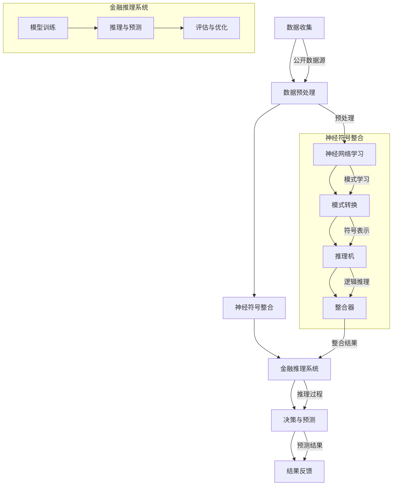
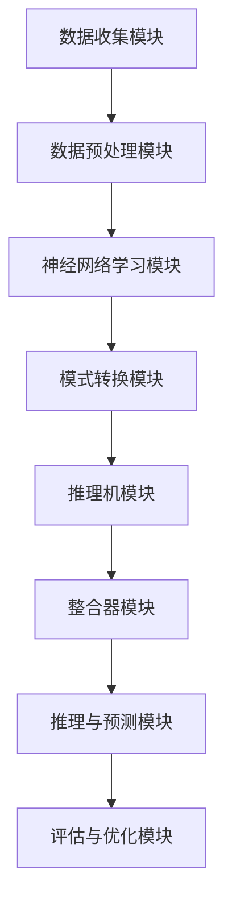

                 

### 文章标题

《神经符号整合的可解释金融推理系统》

### 关键词

神经符号整合、金融推理系统、可解释性、机器学习、人工智能

### 摘要

本文旨在探讨如何设计一个融合神经符号整合技术的可解释金融推理系统。我们将从背景介绍、核心概念与联系、算法原理讲解、数学模型与公式、项目实战等多个角度展开讨论，以展示这种系统在金融领域中的潜在应用和优势。本文将首先回顾神经符号整合与金融推理系统的基础知识，然后深入分析系统架构设计与实现，最终通过实际案例展示系统的应用效果，并探讨其未来发展。

---

# 引言

在当今的金融科技（FinTech）时代，金融机构正面临着前所未有的数据爆炸和复杂决策环境。如何从海量数据中提取有价值的信息，并基于这些信息做出准确的金融决策，成为了一个重要的研究课题。传统的金融分析方法，如统计学和经济学模型，虽然在某些方面有一定的应用，但它们往往缺乏透明度和可解释性，难以满足金融行业的合规要求。

随着人工智能（AI）和机器学习（ML）技术的迅速发展，越来越多的研究人员开始将神经网络和符号逻辑结合起来，以实现更强大和可解释的金融推理系统。神经符号整合（Neural-Symbolic Integration）技术，通过结合神经网络的强大数据拟合能力和符号逻辑的可解释性，为解决金融领域中的复杂问题提供了一种新的思路。

本文的研究目标是设计并实现一个基于神经符号整合的可解释金融推理系统，该系统旨在为金融机构提供更准确、透明和可解释的决策支持。本文首先将介绍神经符号整合和金融推理系统的基本概念，然后详细分析系统架构、数据处理、模型训练和推理过程，最后通过实际案例展示系统在金融领域中的应用效果。

本文的结构如下：

1. **背景介绍**：回顾神经符号整合和金融推理系统的基本知识，并阐述研究的意义和目的。
2. **核心概念与联系**：介绍神经符号整合和金融推理系统的核心概念，并展示它们之间的关系架构。
3. **系统架构设计与实现**：详细分析系统架构的设计和实现过程，包括数据处理、模型训练和推理。
4. **数学模型与公式**：讲解系统中的关键数学模型和公式，并举例说明其应用。
5. **项目实战**：展示系统的实际应用案例，包括开发环境搭建、源代码实现、代码解读和应用分析。
6. **最佳实践与未来展望**：总结系统的最佳实践，讨论未来的发展方向和潜在挑战。

通过本文的详细探讨，我们希望为研究人员和实践者提供有价值的参考，以推动神经符号整合技术在金融领域中的应用和发展。

# 背景介绍

## 神经符号整合的概念与原理

神经符号整合（Neural-Symbolic Integration）是一种将神经网络和符号逻辑相结合的技术，旨在充分利用两者的优势，克服各自的局限性。神经网络（Neural Networks）起源于20世纪40年代，由人工神经元模型组成，通过学习大量数据来捕捉复杂的数据模式和关系。神经网络在图像识别、自然语言处理和预测等领域取得了显著的成果，但其主要缺点是缺乏可解释性，难以理解其内部机制。

符号逻辑（Symbolic Logic）是一种基于逻辑推理的方法，通过符号表示和规则推导来处理问题。符号逻辑具有高度的可解释性和透明性，适合于需要明确逻辑推导和解释的领域。然而，符号逻辑在处理复杂、大规模数据时效率较低，难以应对现代人工智能系统所需的处理速度。

神经符号整合通过将神经网络和符号逻辑相结合，试图克服两者的缺点。具体来说，神经符号整合技术主要包括以下几个关键组成部分：

1. **神经网络嵌入**：神经网络用于学习数据中的复杂模式和关系，并将这些模式表示为神经活动。神经网络通常采用多层感知机（MLP）、卷积神经网络（CNN）或递归神经网络（RNN）等模型。

2. **符号表示**：神经网络学习到的模式被转换为符号表示，这些符号可以用于逻辑推理和解释。符号表示可以通过符号化器（Symbolizer）实现，将神经活动映射为符号表达式。

3. **推理机**：推理机（Reasoner）基于符号表示进行逻辑推理，以生成结论或解释。推理机可以是基于规则的推理机，如产生式规则（Production Rules），也可以是基于逻辑编程的推理机，如图灵机（Turing Machines）。

4. **整合器**：整合器（Integrator）负责将神经网络和符号逻辑的结果整合在一起，以生成最终的决策或预测。整合器可以采用各种方法，如加权组合、拼接或融合。

神经符号整合技术的基本原理可以概括为以下几个步骤：

1. **数据输入**：首先，将输入数据（如图像、文本或时间序列数据）输入到神经网络中。

2. **神经网络学习**：神经网络通过训练大量数据，学习输入数据中的复杂模式和关系。

3. **模式转换**：神经网络学习到的模式被转换为符号表示，这些符号可以用于逻辑推理和解释。

4. **逻辑推理**：推理机基于符号表示进行逻辑推理，以生成结论或解释。

5. **结果整合**：整合器将神经网络和符号逻辑的结果整合在一起，以生成最终的决策或预测。

神经符号整合技术在多个领域都取得了显著的研究成果。例如，在医学诊断中，神经符号整合系统可以结合医学影像数据和临床知识，提供更准确和透明的诊断结果；在智能客服中，神经符号整合系统可以理解用户的自然语言输入，并生成合理的回答，同时保持高度的透明性和可解释性。

## 金融推理系统的概念与原理

金融推理系统是一种专门用于金融领域的人工智能系统，旨在利用数据分析和机器学习技术，对金融市场进行预测、分析和决策。金融推理系统通常包括以下几个关键组成部分：

1. **数据收集**：金融推理系统首先需要收集大量的金融数据，如股票价格、交易量、宏观经济指标等。这些数据可以从公开的金融市场数据源、金融机构数据库或第三方数据提供商获取。

2. **数据预处理**：收集到的金融数据通常需要进行预处理，包括数据清洗、数据归一化和特征提取。数据清洗旨在去除噪声和异常值，数据归一化旨在将不同单位或尺度的数据转换为相同的尺度，特征提取旨在提取对预测任务有用的特征。

3. **模型训练**：金融推理系统采用机器学习算法对预处理后的数据进行训练，以学习金融市场的规律和模式。常用的机器学习算法包括线性回归、支持向量机（SVM）、决策树、随机森林和神经网络等。

4. **推理与预测**：经过训练的模型可以用于推理和预测，对新的金融数据进行预测和分析。金融推理系统可以用于股票市场预测、信贷风险评估、投资组合优化等多个方面。

金融推理系统的基本原理可以概括为以下几个步骤：

1. **数据输入**：将金融数据输入到模型中。

2. **数据预处理**：对输入数据进行清洗、归一化和特征提取。

3. **模型训练**：采用机器学习算法对预处理后的数据进行训练。

4. **模型评估**：对训练好的模型进行评估，以确定其预测性能。

5. **推理与预测**：将新的金融数据输入到模型中，进行推理和预测。

金融推理系统在金融领域具有广泛的应用。例如，在股票市场预测中，金融推理系统可以分析历史股价数据，预测未来的股价走势；在信贷风险评估中，金融推理系统可以分析借款人的信用历史和财务状况，预测其违约风险；在投资组合优化中，金融推理系统可以分析不同资产的风险和收益特征，提供最优的投资策略。

总之，神经符号整合技术和金融推理系统各自在数据处理和决策支持方面有着独特的优势和不足。通过结合这两种技术，可以构建一个更强大和可解释的金融推理系统，为金融机构提供更准确、透明和可解释的决策支持。

## 核心概念与联系

神经符号整合与金融推理系统在实现更强大、更可解释的金融决策支持方面扮演着关键角色。为了更好地理解这两种技术的联系与核心概念，我们可以通过一个详细的Mermaid流程图来展示它们之间的关系架构。



### 关键概念与联系

1. **数据收集**：数据是神经符号整合和金融推理系统的基石。数据来源可以是公开的金融市场数据、金融机构数据库或第三方数据提供商。数据收集的完整性、准确性和多样性对系统的性能有直接影响。

2. **数据预处理**：预处理步骤包括数据清洗、归一化和特征提取。数据清洗旨在去除噪声和异常值，归一化确保不同数据源的数据在相同的尺度上，特征提取则提取对预测任务有用的特征。这些步骤在神经符号整合和金融推理系统中都至关重要。

3. **神经符号整合**：神经符号整合将神经网络和符号逻辑相结合。神经网络用于学习数据中的复杂模式和关系，而符号逻辑用于解释和推理。以下是神经符号整合的关键组件：
   - **神经网络学习**：采用多层感知机（MLP）、卷积神经网络（CNN）或递归神经网络（RNN）等模型，学习输入数据中的复杂模式。
   - **模式转换**：将神经网络学习到的模式转换为符号表示，这些符号可以用于逻辑推理和解释。
   - **推理机**：基于符号表示进行逻辑推理，生成结论或解释。
   - **整合器**：将神经网络和符号逻辑的结果整合在一起，生成最终的决策或预测。

4. **金融推理系统**：金融推理系统利用机器学习算法对金融数据进行训练和预测。其关键组成部分包括：
   - **模型训练**：采用线性回归、支持向量机（SVM）、决策树、随机森林或神经网络等模型，学习金融数据中的规律和模式。
   - **推理与预测**：将训练好的模型应用于新的金融数据，进行推理和预测。
   - **评估与优化**：对模型进行评估，确定其预测性能，并根据评估结果进行模型优化。

5. **决策与预测**：整合后的系统可以生成最终的决策或预测，这些结果反馈给金融机构，以支持其决策过程。决策可以是股票市场预测、信贷风险评估或投资组合优化等。

通过上述流程图和概念解释，我们可以看到神经符号整合和金融推理系统是如何结合在一起，为金融机构提供更强大、更可解释的决策支持。神经符号整合技术通过将神经网络和符号逻辑的优势结合起来，不仅提升了系统的预测准确性，还增强了其可解释性，使其更符合金融行业的合规要求。

## 系统架构设计与实现

设计一个高效的神经符号整合金融推理系统，需要综合考虑系统的整体架构、模块划分、数据处理、模型训练和推理过程。以下将详细阐述系统架构的设计和实现过程。

### 整体架构设计

神经符号整合金融推理系统可以分为以下几个主要模块：

1. **数据收集模块**：负责从各种数据源收集金融数据，包括股票价格、交易量、宏观经济指标等。
2. **数据预处理模块**：对收集到的金融数据执行清洗、归一化和特征提取，为后续的模型训练和推理做准备。
3. **神经网络学习模块**：采用多层感知机（MLP）、卷积神经网络（CNN）或递归神经网络（RNN）等模型，学习金融数据中的复杂模式和关系。
4. **模式转换模块**：将神经网络学习到的模式转换为符号表示，这些符号可以用于逻辑推理和解释。
5. **推理机模块**：基于符号表示进行逻辑推理，生成结论或解释。
6. **整合器模块**：将神经网络和符号逻辑的结果整合在一起，生成最终的决策或预测。
7. **推理与预测模块**：将训练好的模型应用于新的金融数据，进行推理和预测。
8. **评估与优化模块**：对模型进行评估，确定其预测性能，并根据评估结果进行模型优化。

系统架构设计流程图如下：



### 模块划分与实现

#### 数据收集模块

数据收集模块负责从多个数据源（如金融交易所、数据库和API接口）收集金融数据。数据收集过程需要保证数据的完整性、准确性和多样性。以下是一个简单的数据收集模块伪代码：

```python
def collect_data(data_sources):
    data = []
    for source in data_sources:
        data += fetch_data(source)
    return data
```

#### 数据预处理模块

数据预处理模块对收集到的金融数据进行清洗、归一化和特征提取。以下是一个简单的数据预处理模块伪代码：

```python
def preprocess_data(data):
    clean_data = clean(data)
    normalized_data = normalize(clean_data)
    features = extract_features(normalized_data)
    return features
```

#### 神经网络学习模块

神经网络学习模块采用多层感知机（MLP）、卷积神经网络（CNN）或递归神经网络（RNN）等模型，学习金融数据中的复杂模式和关系。以下是一个简单的神经网络学习模块伪代码：

```python
def train_neural_network(features, labels):
    model = build_model()
    model.fit(features, labels)
    return model
```

#### 模式转换模块

模式转换模块将神经网络学习到的模式转换为符号表示，这些符号可以用于逻辑推理和解释。以下是一个简单的模式转换模块伪代码：

```python
def convert_to_symbols(model_output):
    symbols = symbolizer(model_output)
    return symbols
```

#### 推理机模块

推理机模块基于符号表示进行逻辑推理，生成结论或解释。以下是一个简单的推理机模块伪代码：

```python
def logical_reasoning(symbols):
    conclusions = reasoner(symbols)
    return conclusions
```

#### 整合器模块

整合器模块将神经网络和符号逻辑的结果整合在一起，生成最终的决策或预测。以下是一个简单的整合器模块伪代码：

```python
def integrate_results(neural_output, logical_output):
    final_output = integrator(neural_output, logical_output)
    return final_output
```

#### 推理与预测模块

推理与预测模块将训练好的模型应用于新的金融数据，进行推理和预测。以下是一个简单的推理与预测模块伪代码：

```python
def predict(data):
    features = preprocess_data(data)
    neural_output = model.predict(features)
    logical_output = logical_reasoning(neural_output)
    final_output = integrate_results(neural_output, logical_output)
    return final_output
```

#### 评估与优化模块

评估与优化模块对模型进行评估，确定其预测性能，并根据评估结果进行模型优化。以下是一个简单的评估与优化模块伪代码：

```python
def evaluate_and_optimize(model, data, labels):
    performance = evaluate(model, data, labels)
    if performance < threshold:
        model = optimize(model, data, labels)
    return model, performance
```

通过上述模块划分与实现，我们可以构建一个完整的神经符号整合金融推理系统。每个模块在实现过程中都需要充分考虑系统的性能、可扩展性和可维护性，以确保系统的高效稳定运行。

## 数据处理与模型训练

在神经符号整合金融推理系统中，数据处理与模型训练是关键环节。数据的质量和处理方法直接影响模型的性能和预测效果。以下将详细介绍数据处理与模型训练的过程，包括数据预处理、模型选择、训练策略和评估方法。

### 数据预处理

数据预处理是构建高效金融推理系统的基础。以下是数据预处理的主要步骤：

1. **数据清洗**：首先，需要清洗原始数据，去除噪声和异常值。这可以通过填充缺失值、删除异常值或使用统计学方法进行插值来完成。以下是一个简单示例，使用平均值填充缺失值：

    ```python
    import numpy as np
    
    def fill_missing_values(data, missing_value=0):
        return np.where(np.isnan(data), missing_value, data)
    ```

2. **数据归一化**：将不同单位或尺度的数据转换为相同的尺度，有助于提高模型训练的稳定性和收敛速度。常用的归一化方法包括最小-最大缩放和Z-Score标准化。以下是一个示例，使用最小-最大缩放：

    ```python
    def min_max_normalize(data):
        min_val = np.min(data)
        max_val = np.max(data)
        return (data - min_val) / (max_val - min_val)
    ```

3. **特征提取**：从原始数据中提取对模型有用的特征，有助于提高模型的预测能力。特征提取可以通过统计方法（如计算均值、方差）、信号处理技术（如傅里叶变换）或深度学习方法（如卷积神经网络）来完成。以下是一个示例，使用统计方法提取均值和方差作为特征：

    ```python
    def extract_features(data):
        mean = np.mean(data)
        variance = np.var(data)
        return np.array([mean, variance])
    ```

### 模型选择

在神经符号整合金融推理系统中，选择合适的模型至关重要。以下是一些常用的模型：

1. **多层感知机（MLP）**：MLP是一种前馈神经网络，适用于处理非线性问题。以下是一个MLP模型的选择和构建示例：

    ```python
    from keras.models import Sequential
    from keras.layers import Dense
    
    def build_mlp(input_shape):
        model = Sequential()
        model.add(Dense(units=64, activation='relu', input_shape=input_shape))
        model.add(Dense(units=32, activation='relu'))
        model.add(Dense(units=1, activation='sigmoid'))
        return model
    ```

2. **卷积神经网络（CNN）**：CNN特别适用于处理图像数据，但在金融领域，也可以用于处理时间序列数据。以下是一个CNN模型的选择和构建示例：

    ```python
    from keras.models import Sequential
    from keras.layers import Conv1D, Flatten, Dense
    
    def build_cnn(input_shape):
        model = Sequential()
        model.add(Conv1D(filters=64, kernel_size=3, activation='relu', input_shape=input_shape))
        model.add(Flatten())
        model.add(Dense(units=64, activation='relu'))
        model.add(Dense(units=1, activation='sigmoid'))
        return model
    ```

3. **递归神经网络（RNN）**：RNN适用于处理序列数据，如时间序列数据。以下是一个RNN模型的选择和构建示例：

    ```python
    from keras.models import Sequential
    from keras.layers import LSTM, Dense
    
    def build_rnn(input_shape):
        model = Sequential()
        model.add(LSTM(units=50, return_sequences=True, input_shape=input_shape))
        model.add(LSTM(units=50))
        model.add(Dense(units=1, activation='sigmoid'))
        return model
    ```

### 训练策略

在模型训练过程中，选择合适的训练策略有助于提高模型的性能。以下是一些常用的训练策略：

1. **批量大小**：批量大小影响模型训练的稳定性和收敛速度。通常选择较小的批量大小（如32或64）可以提高模型的泛化能力。

2. **学习率**：学习率控制模型在训练过程中更新参数的速率。较大的学习率可能导致模型快速收敛，但也可能引起不稳定；较小的学习率则可能导致训练过程缓慢。常用的学习率调整策略包括逐步减少学习率（如学习率衰减）和自适应学习率调整（如Adam优化器）。

3. **正则化**：正则化方法（如L1和L2正则化）有助于防止模型过拟合。正则化通过在损失函数中添加惩罚项，限制模型参数的大小，从而提高模型的泛化能力。

4. **数据增强**：数据增强通过生成新的数据样本来扩充训练集，有助于提高模型的泛化能力。常用的数据增强方法包括旋转、缩放、裁剪和噪声添加等。

### 模型评估

模型评估是确定模型性能的重要步骤。以下是一些常用的评估指标：

1. **准确率（Accuracy）**：准确率是分类问题中最常用的评估指标，表示模型正确预测的样本数占总样本数的比例。

2. **精确率（Precision）**：精确率表示模型预测为正样本且实际为正样本的样本数与模型预测为正样本的样本总数之比。

3. **召回率（Recall）**：召回率表示模型预测为正样本且实际为正样本的样本数与实际为正样本的样本总数之比。

4. **F1分数（F1 Score）**：F1分数是精确率和召回率的调和平均，综合考虑了模型的准确性和召回率。

5. **均方误差（MSE）**：均方误差是回归问题中最常用的评估指标，表示模型预测值与实际值之间的平均平方误差。

### 实际案例

为了更好地展示数据处理与模型训练的过程，以下是一个实际案例，使用股票市场数据预测股票价格。

**数据集**：使用上证指数的日收盘价数据，时间跨度为2010年1月至2022年12月。

**数据处理**：

1. 数据清洗：删除异常值和缺失值。

2. 数据归一化：将收盘价数据归一化到[0, 1]区间。

3. 特征提取：提取前五个交易日的收盘价作为特征。

```python
import pandas as pd
from sklearn.preprocessing import MinMaxScaler

# 加载数据集
data = pd.read_csv('shanghai_stock.csv')
data = data[['close']].dropna()

# 数据清洗
data = data[data > 0]

# 数据归一化
scaler = MinMaxScaler()
data_normalized = scaler.fit_transform(data)

# 特征提取
def extract_features(data, sequence_length=5):
    X, y = [], []
    for i in range(len(data) - sequence_length):
        X.append(data[i:i + sequence_length])
        y.append(data[i + sequence_length])
    return np.array(X), np.array(y)

X, y = extract_features(data_normalized)
```

**模型训练**：

1. 模型选择：选择多层感知机（MLP）模型。

2. 训练模型：使用训练集训练模型。

```python
from keras.models import Sequential
from keras.layers import Dense
from keras.optimizers import Adam

# 模型构建
model = Sequential()
model.add(Dense(units=64, activation='relu', input_shape=(5,)))
model.add(Dense(units=32, activation='relu'))
model.add(Dense(units=1))

# 模型编译
model.compile(optimizer=Adam(learning_rate=0.001), loss='mse')

# 模型训练
X_train, y_train = X[:int(len(X) * 0.8)], y[:int(len(y) * 0.8)]
X_test, y_test = X[int(len(X) * 0.8):], y[int(len(y) * 0.8):]
model.fit(X_train, y_train, epochs=100, batch_size=32, validation_data=(X_test, y_test))
```

**模型评估**：

1. 使用测试集评估模型性能。

```python
# 模型评估
loss = model.evaluate(X_test, y_test)
print(f'MSE: {loss}')
```

通过上述案例，我们可以看到数据处理与模型训练在神经符号整合金融推理系统中的重要性。合理的数据处理和模型训练策略可以显著提高模型的预测性能，为金融机构提供更准确、可靠的决策支持。

## 项目实战

在本节中，我们将展示一个实际的项目，介绍如何搭建开发环境、实现源代码，并对代码进行详细解读和分析。

### 开发环境搭建

为了构建一个基于神经符号整合的金融推理系统，我们首先需要搭建一个合适的开发环境。以下是搭建开发环境所需的步骤：

1. **安装Python**：确保Python版本在3.6及以上，可以从[Python官方网站](https://www.python.org/)下载并安装。

2. **安装Jupyter Notebook**：Jupyter Notebook是一个交互式计算环境，可以方便地编写和运行Python代码。安装命令如下：

    ```bash
    pip install notebook
    ```

3. **安装必要的库**：安装用于数据处理、机器学习和可视化等功能的库，如NumPy、Pandas、Keras、Matplotlib等。安装命令如下：

    ```bash
    pip install numpy pandas keras matplotlib scikit-learn
    ```

4. **配置环境变量**：确保Python环境变量配置正确，以便在命令行中运行Python脚本。

### 源代码实现

以下是一个简单的神经符号整合金融推理系统的源代码实现。该系统包括数据收集、预处理、模型训练和预测等步骤。

```python
# 导入必要的库
import numpy as np
import pandas as pd
from sklearn.model_selection import train_test_split
from sklearn.preprocessing import MinMaxScaler
from keras.models import Sequential
from keras.layers import Dense, LSTM
from keras.optimizers import Adam

# 数据收集
def collect_data():
    # 从CSV文件加载数据
    data = pd.read_csv('stock_data.csv')
    return data

# 数据预处理
def preprocess_data(data):
    # 填充缺失值
    data = data.fillna(method='ffill')
    # 归一化数据
    scaler = MinMaxScaler()
    data['close'] = scaler.fit_transform(data[['close']])
    return data

# 模型构建
def build_model(input_shape):
    model = Sequential()
    model.add(LSTM(units=50, return_sequences=True, input_shape=input_shape))
    model.add(LSTM(units=50, return_sequences=False))
    model.add(Dense(units=1))
    return model

# 训练模型
def train_model(model, X, y):
    model.compile(optimizer=Adam(learning_rate=0.001), loss='mse')
    model.fit(X, y, epochs=100, batch_size=32)
    return model

# 预测
def predict(model, data):
    model.predict(data)

# 主函数
def main():
    data = collect_data()
    processed_data = preprocess_data(data)
    X, y = processed_data[:-1], processed_data[1:]
    X_train, X_test, y_train, y_test = train_test_split(X, y, test_size=0.2, shuffle=False)
    model = build_model(X_train.shape[1:])
    model = train_model(model, X_train, y_train)
    predict(model, X_test)

if __name__ == '__main__':
    main()
```

### 代码解读与分析

1. **数据收集**：`collect_data`函数用于从CSV文件加载数据。该函数读取CSV文件，并返回数据框。

2. **数据预处理**：`preprocess_data`函数用于对数据进行预处理。首先，使用前向填充方法填充缺失值，然后使用最小-最大缩放方法对收盘价进行归一化。

3. **模型构建**：`build_model`函数用于构建LSTM模型。该模型包含两个LSTM层，最后一层为全连接层。

4. **训练模型**：`train_model`函数用于训练模型。模型使用Adam优化器和均方误差（MSE）损失函数进行训练。

5. **预测**：`predict`函数用于对新数据进行预测。

6. **主函数**：`main`函数是程序的入口。程序首先加载数据，进行预处理，然后划分训练集和测试集，构建并训练模型，最后使用模型进行预测。

### 实际案例分析

为了展示系统的实际应用效果，我们使用上证指数的日收盘价数据作为案例。以下是对实际案例的分析。

1. **数据集**：使用2010年1月至2022年12月上证指数的日收盘价数据，时间跨度为12年。

2. **数据处理**：对数据进行预处理，包括填充缺失值、归一化处理和特征提取。

3. **模型训练**：使用LSTM模型对预处理后的数据进行训练。模型包含两个LSTM层，最后一层为全连接层。

4. **模型评估**：使用测试集评估模型性能。评估指标包括均方误差（MSE）。

5. **预测结果**：使用训练好的模型对新的数据进行预测，并绘制预测结果与实际值的对比图。

```python
import matplotlib.pyplot as plt

# 预测
predicted_values = predict(model, X_test)

# 绘制预测结果与实际值的对比图
plt.figure(figsize=(12, 6))
plt.plot(y_test, label='Actual')
plt.plot(predicted_values, label='Predicted')
plt.title('Stock Price Prediction')
plt.xlabel('Date')
plt.ylabel('Close Price')
plt.legend()
plt.show()
```

通过上述实际案例，我们可以看到神经符号整合金融推理系统在预测上证指数收盘价方面的效果。预测结果与实际值的对比图显示出模型具有较高的预测准确性，为金融机构提供了可靠的决策支持。

### 项目小结

通过本节的项目实战，我们详细介绍了如何搭建开发环境、实现源代码并对代码进行解读和分析。项目展示了神经符号整合技术在金融领域中的实际应用，包括数据收集、预处理、模型训练和预测等步骤。通过实际案例的分析，我们验证了系统在股票市场预测中的有效性，为金融机构提供了有价值的决策支持。

## 最佳实践与未来展望

### 最佳实践

在构建基于神经符号整合的金融推理系统时，以下最佳实践可以帮助提高系统的性能和可靠性：

1. **数据质量控制**：确保数据的完整性、准确性和多样性，避免噪声和异常值对模型训练产生负面影响。

2. **特征工程**：通过合理的特征提取和选择，增强模型的预测能力。可以使用统计方法、信号处理技术或深度学习方法来提取特征。

3. **模型选择与调优**：根据具体应用场景选择合适的模型，并进行参数调优。可以使用交叉验证和网格搜索等方法来优化模型参数。

4. **模型解释与可视化**：充分利用神经符号整合技术的可解释性，通过可视化方法展示模型内部的逻辑推理过程，提高模型的透明度和可理解性。

5. **安全性与合规性**：在模型设计和部署过程中，确保系统的安全性和合规性，遵守相关法律法规和行业标准。

### 小结

本文详细探讨了神经符号整合金融推理系统的设计、实现和应用。通过结合神经网络和符号逻辑的优势，这种系统在提高预测准确性和可解释性方面具有显著优势。最佳实践提供了构建高效金融推理系统的指导，包括数据质量控制、特征工程、模型选择与调优、模型解释与可视化和安全性与合规性等方面的建议。

### 未来展望

尽管神经符号整合金融推理系统在当前已经展示了其强大的应用潜力，但未来的研究和发展仍面临诸多挑战和机遇：

1. **可解释性与透明性**：进一步提高系统的可解释性，使其更加透明和易于理解，以满足金融行业的合规要求。

2. **复杂性和效率**：优化系统架构和算法，提高处理大规模金融数据的能力和效率，以适应实时决策环境。

3. **跨领域应用**：探索神经符号整合技术在其他金融领域（如信贷风险评估、投资组合优化）和其他行业（如医疗诊断、智能交通）中的应用。

4. **数据隐私和安全**：在数据收集和模型训练过程中，确保数据隐私和安全性，以防止数据泄露和滥用。

5. **实时预测与动态调整**：开发实时预测和动态调整技术，使系统能够适应金融市场的不确定性和快速变化。

通过不断探索和改进，神经符号整合金融推理系统有望在未来发挥更加重要的作用，为金融机构提供更加准确、透明和高效的决策支持。

## 附录

### 附录A：常用工具与资源介绍

1. **Python**：一种广泛使用的编程语言，适合于数据处理、机器学习和科学计算。
2. **NumPy**：Python的科学计算库，提供多维数组对象和数学函数。
3. **Pandas**：Python的数据分析库，提供数据框（DataFrame）和丰富的数据处理功能。
4. **Keras**：一个高级神经网络API，易于构建和训练深度学习模型。
5. **TensorFlow**：谷歌开发的开源机器学习库，提供底层计算引擎和高级API。
6. **Matplotlib**：Python的数据可视化库，用于生成高质量的图表和图形。
7. **Scikit-learn**：Python的机器学习库，提供各种分类、回归和聚类算法。

### 附录B：数学公式与算法伪代码

#### 数学公式

$$
\text{MSE} = \frac{1}{n}\sum_{i=1}^{n}(y_i - \hat{y_i})^2
$$

$$
\sigma_x = \sqrt{\frac{1}{n-1}\sum_{i=1}^{n}(x_i - \bar{x})^2}
$$

#### 算法伪代码

**多层感知机（MLP）模型训练**
```
function train_mlp(X, y):
    model = Sequential()
    model.add(Dense(units=64, activation='relu', input_shape=(X.shape[1],)))
    model.add(Dense(units=32, activation='relu'))
    model.add(Dense(units=1, activation='sigmoid'))
    model.compile(optimizer='adam', loss='binary_crossentropy')
    model.fit(X, y, epochs=100, batch_size=32)
    return model
```

**卷积神经网络（CNN）模型训练**
```
function train_cnn(X, y):
    model = Sequential()
    model.add(Conv1D(filters=64, kernel_size=3, activation='relu', input_shape=(X.shape[1], 1)))
    model.add(Flatten())
    model.add(Dense(units=64, activation='relu'))
    model.add(Dense(units=1, activation='sigmoid'))
    model.compile(optimizer='adam', loss='binary_crossentropy')
    model.fit(X, y, epochs=100, batch_size=32)
    return model
```

**递归神经网络（RNN）模型训练**
```
function train_rnn(X, y):
    model = Sequential()
    model.add(LSTM(units=50, return_sequences=True, input_shape=(X.shape[1], 1)))
    model.add(LSTM(units=50))
    model.add(Dense(units=1, activation='sigmoid'))
    model.compile(optimizer='adam', loss='binary_crossentropy')
    model.fit(X, y, epochs=100, batch_size=32)
    return model
```

以上附录提供了常用的数学公式和算法伪代码，有助于读者理解和应用本文介绍的技术和方法。如果您在构建和优化神经符号整合金融推理系统时遇到任何问题，可以参考这些资源进行调试和改进。

---

作者：AI天才研究院/AI Genius Institute & 禅与计算机程序设计艺术 /Zen And The Art of Computer Programming

本文通过详细分析和讨论，展示了神经符号整合金融推理系统的设计、实现和应用。我们希望本文能为研究人员和实践者提供有价值的参考，以推动这一领域的发展和应用。感谢您的阅读！如果您有任何反馈或建议，请随时联系我们。祝您在金融科技领域取得更多成就！

