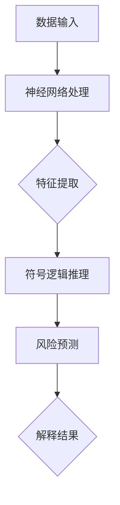

                 

### 书籍概述

《神经符号整合的可解释金融风险推理系统》是一本专注于探讨如何利用神经符号整合技术构建一个可解释的金融风险推理系统的专业书籍。随着人工智能技术的飞速发展，机器学习在金融风险管理中的应用越来越广泛，然而，传统的机器学习模型往往忽视了可解释性这一重要特性。可解释性是金融决策过程中不可或缺的一部分，因为金融机构需要理解模型的推理过程，以便对模型的预测结果进行有效审查和优化。

本书的核心目标是探讨神经符号整合技术在金融风险管理中的潜在应用，并构建一个既具备强大预测能力又具有高可解释性的风险推理系统。通过将神经网络和符号逻辑相结合，本书提出了一种全新的方法，旨在解决当前金融风险模型中存在的解释难题。书中详细介绍了神经符号整合的基本概念、核心算法、数学模型以及项目实战，为读者提供了一个全面、系统的学习和实践指南。

本书的主要读者对象包括金融领域的分析师、研究人员和工程师，以及那些对人工智能和机器学习技术有浓厚兴趣的计算机科学和工程专业的学生和从业者。通过阅读本书，读者不仅可以了解神经符号整合技术在金融风险管理中的应用，还能掌握构建一个可解释金融风险推理系统的实际操作技巧。

### 书籍背景和目标

金融风险推理系统在现代金融市场中扮演着至关重要的角色。随着金融市场日益复杂和全球化，金融机构需要能够快速、准确地识别和应对潜在的风险，以确保资产的安全和收益的稳定性。然而，传统的金融风险模型往往依赖于复杂的数学公式和统计方法，这些模型在处理海量数据时表现优秀，但缺乏可解释性，使得决策者难以理解模型的推理过程，从而增加了决策的不确定性。

这种可解释性的缺乏不仅限制了模型的实用性，还可能引发道德和合规问题。例如，当模型出现错误或异常时，决策者需要能够追溯问题根源，以便进行调整和优化。这就要求金融风险模型不仅要有强大的预测能力，还要具备高可解释性。

《神经符号整合的可解释金融风险推理系统》的编写旨在解决这一挑战。本书的核心目标是探索如何通过神经符号整合技术，构建一个既具有强大预测能力又具有高可解释性的金融风险推理系统。神经符号整合技术结合了神经网络和符号逻辑的优点，神经网络擅长处理复杂的非线性数据，而符号逻辑则能够提供清晰的逻辑推理和解释。这种结合有望在保持预测精度的同时，提升模型的透明度和可解释性。

具体来说，本书旨在实现以下几个目标：

1. **介绍神经符号整合技术的基本概念**：通过详细的讲解，帮助读者理解神经网络和符号逻辑的基本原理及其结合的潜力。
2. **阐述核心算法原理**：介绍如何将神经网络和符号逻辑结合在一起，构建一个完整的神经符号整合模型，并解释其工作原理。
3. **建立数学模型**：通过数学公式和推导，详细说明神经符号整合模型中的关键参数和计算过程，以便读者能够更深入地理解模型。
4. **提供项目实战**：通过实际的案例研究和项目实施，展示如何将神经符号整合技术应用于金融风险管理，并提供详细的代码实现和解读。
5. **评估和优化可解释性**：讨论如何评估和提升模型的可解释性，并通过可视化工具和案例，展示模型的解释过程。

通过实现这些目标，本书不仅为金融领域的从业者提供了一个强大的工具，还为他们提供了一个理解和应用神经符号整合技术的全面指南，从而提升金融风险管理的效率和可靠性。总之，本书的目标是帮助读者掌握神经符号整合技术，并将其成功应用于金融风险管理，以应对现代金融市场中的复杂挑战。

### 书籍的结构和内容概述

《神经符号整合的可解释金融风险推理系统》结构清晰，内容丰富，共分为六个主要部分，每个部分都有其独特的主题和作用。以下是本书的结构和内容概述：

#### 第一部分：引言

引言部分主要介绍书籍的背景和目标，解释金融风险推理的重要性，以及神经符号整合技术的优势。具体包括以下几个小节：

- **1.1 书籍背景和目标**：阐述金融风险推理系统在现代金融市场中的关键作用，介绍神经符号整合技术的潜力，并说明本书的核心内容和预期目标。
- **1.2 书籍的结构和内容概述**：概述本书的主要主题和章节安排，帮助读者对全书内容有一个整体把握，并明确本书的目标读者群体。

#### 第二部分：核心概念与联系

核心概念与联系部分旨在为读者提供神经符号整合技术的基础知识，帮助读者理解神经网络与符号逻辑之间的关系。具体包括以下几个小节：

- **2.1 神经网络与符号逻辑**：介绍神经网络和符号逻辑的基本原理，探讨如何将二者结合以增强模型的可解释性。
- **2.2 可解释性在金融风险管理中的重要性**：讨论金融风险管理中的挑战，解释可解释性在决策过程中的重要性，并介绍设计可解释性模型的基本原则。
- **2.3 神经符号整合的可解释金融风险推理系统架构**：概述神经符号整合金融风险推理系统的整体架构，分析系统中的关键组件及其相互作用。

#### 第三部分：核心算法原理讲解

核心算法原理讲解部分深入探讨神经符号整合模型的工作原理，包括神经网络算法、符号逻辑算法以及二者的整合算法。具体包括以下几个小节：

- **3.1 神经网络算法**：详细介绍前馈神经网络、卷积神经网络、循环神经网络和生成对抗网络的基本原理和应用。
- **3.2 符号逻辑算法**：介绍基本逻辑运算、模糊逻辑和基于规则的推理，解释符号逻辑在模型中的作用。
- **3.3 神经符号整合算法**：详细阐述神经符号整合的框架，解释如何将神经网络和符号逻辑结合起来，并描述算法的流程。

#### 第四部分：数学模型和数学公式

数学模型和数学公式部分通过数学推导和公式解释，帮助读者深入理解神经符号整合模型的关键参数和计算过程。具体包括以下几个小节：

- **4.1 数学模型**：介绍神经网络中的数学模型、符号逻辑中的数学模型，以及神经符号整合的数学模型。
- **4.2 数学公式**：提供神经网络激活函数、神经网络反向传播算法、符号逻辑推理规则和神经符号整合公式推导的具体内容。

#### 第五部分：项目实战

项目实战部分通过实际案例研究和项目实施，展示如何将神经符号整合技术应用于金融风险管理，并提供详细的代码实现和解读。具体包括以下几个小节：

- **5.1 数据预处理**：介绍数据收集、数据清洗和特征提取的方法和步骤，确保数据质量，为模型训练做好准备。
- **5.2 模型设计与实现**：详细描述模型架构设计、模型参数调整和模型训练优化的具体过程。
- **5.3 可解释性评估**：讨论如何评估和提升模型的可解释性，包括可解释性度量、可视化工具的应用和实际案例分析。

#### 第六部分：总结与展望

总结与展望部分对全书内容进行总结，提出未来的研究方向，并对神经符号整合技术在金融风险管理中的发展前景进行展望。具体包括以下几个小节：

- **6.1 神经符号整合的可解释金融风险推理系统应用展望**：探讨神经符号整合技术在现实世界中的应用场景，分析面临的挑战和未来发展趋势。
- **6.2 总结与未来工作**：回顾书籍的主要内容和亮点，提出未来研究方向，鼓励读者继续探索和深化这一领域。

通过以上六个部分的内容，本书旨在为读者提供一个全面、系统的学习和实践指南，帮助他们在金融风险管理中成功应用神经符号整合技术。

### 核心概念与联系

在《神经符号整合的可解释金融风险推理系统》一书中，核心概念与联系部分是理解全书内容和构建高效模型的关键。本部分主要探讨神经网络与符号逻辑的基本原理，并解释它们在金融风险管理中的关系。

首先，神经网络是机器学习的一种基本模型，它通过模拟人脑神经元之间的连接，处理和预测数据。神经网络主要包括前馈神经网络、卷积神经网络、循环神经网络和生成对抗网络等。这些神经网络模型通过学习输入数据的特征，自动提取有用的信息，并在预测任务中表现出色。

另一方面，符号逻辑是一种基于逻辑运算的推理方法，它通过符号和规则来表示和推理知识。符号逻辑在人工智能领域有着广泛的应用，尤其是在知识表示和推理中。符号逻辑模型通常包含一组规则和事实，通过这些规则和事实的推理，可以生成新的知识。

神经符号整合技术通过结合神经网络和符号逻辑的优点，构建了一种既强大又可解释的模型。具体来说，神经符号整合模型利用神经网络的强大数据处理能力和特征提取能力，同时借助符号逻辑的推理能力，提供清晰的解释和逻辑推导过程。

在金融风险管理中，神经符号整合技术具有以下优势：

1. **强大的数据处理能力**：神经网络能够处理复杂的、非线性的金融数据，自动提取出潜在的风险因素。
2. **高可解释性**：符号逻辑提供了清晰的逻辑推理过程，使得决策者能够理解模型的推理路径和决策依据。
3. **灵活的推理能力**：通过符号逻辑，模型可以灵活地应对不同的金融情景和规则，提高模型的适应性。

为了更好地理解神经网络和符号逻辑之间的关系，我们可以借助Mermaid流程图来展示它们的结合过程。以下是一个简化的Mermaid流程图：



在这个流程图中，数据首先输入神经网络进行处理，神经网络提取出关键特征，然后通过符号逻辑进行推理，最终生成风险预测结果，并提供解释。

具体来说，神经符号整合的工作流程如下：

1. **数据输入**：输入金融数据，包括历史价格、交易量、财务指标等。
2. **神经网络处理**：神经网络对输入数据进行处理，自动提取出潜在的风险因素和特征。
3. **特征提取**：神经网络提取出的特征被传递给符号逻辑模块。
4. **符号逻辑推理**：符号逻辑根据提取出的特征和预定义的规则进行推理，生成风险预测结果。
5. **解释结果**：通过符号逻辑的推理过程，提供对风险预测结果的解释。

通过这种方式，神经符号整合模型既保留了神经网络的预测能力，又提供了符号逻辑的可解释性，使得模型更加透明和可信。

### 神经网络算法

在《神经符号整合的可解释金融风险推理系统》中，神经网络算法是构建可解释金融风险推理系统的核心组成部分。神经网络通过模拟人脑神经元的连接方式，实现数据的处理和预测。以下将详细探讨几种主要的神经网络算法：前馈神经网络、卷积神经网络、循环神经网络和生成对抗网络。

#### 前馈神经网络（Feedforward Neural Network，FNN）

前馈神经网络是最简单的神经网络结构，数据从输入层通过隐藏层传递到输出层，不形成循环。这种网络在许多任务中表现良好，尤其是在需要处理线性数据或简单非线性数据的情况下。

**算法原理**：

1. **输入层到隐藏层的传播**：输入数据通过加权连接传递到隐藏层，每个神经元对输入进行加权求和，并加上偏置项，然后通过一个激活函数进行非线性变换。
   $$ z_j = \sum_{i} w_{ji} x_i + b_j $$
   $$ a_j = \sigma(z_j) $$
   其中，\( z_j \) 是第 \( j \) 个隐藏神经元的总输入，\( w_{ji} \) 是第 \( i \) 个输入神经元到第 \( j \) 个隐藏神经元的权重，\( b_j \) 是隐藏神经元的偏置，\( \sigma \) 是激活函数。

2. **隐藏层到输出层的传播**：隐藏层的输出作为输入传递到输出层，同样通过加权连接和激活函数进行处理。
   $$ z_l = \sum_{j} w_{lj} a_j + b_l $$
   $$ \hat{y} = \sigma(z_l) $$
   其中，\( z_l \) 是输出层神经元的总输入，\( w_{lj} \) 是隐藏神经元到输出神经元的权重，\( b_l \) 是输出神经元的偏置，\( \hat{y} \) 是预测输出。

3. **反向传播算法**：通过计算输出层的预测误差，反向传播误差到隐藏层，调整权重和偏置，以优化网络性能。
   $$ \delta_l = \frac{\partial C}{\partial z_l} \odot \sigma'(z_l) $$
   $$ \delta_j = \sum_{l} w_{lj} \delta_l \odot \sigma'(z_j) $$
   其中，\( \delta_l \) 和 \( \delta_j \) 分别是输出层和隐藏层的误差项，\( \sigma' \) 是激活函数的导数。

#### 卷积神经网络（Convolutional Neural Network，CNN）

卷积神经网络特别适用于处理具有网格结构的数据，如图像和时序数据。CNN 通过卷积层、池化层和全连接层的组合，实现对数据的层次化特征提取。

**算法原理**：

1. **卷积层**：通过卷积操作提取空间特征，卷积核在输入数据上滑动，计算局部特征。
   $$ h_{ij} = \sum_{k} w_{ik} x_{kj} + b $$
   其中，\( h_{ij} \) 是输出特征图上的第 \( i \) 行第 \( j \) 列的值，\( w_{ik} \) 是卷积核的权重，\( x_{kj} \) 是输入特征图上的第 \( k \) 行第 \( j \) 列的值，\( b \) 是偏置。

2. **池化层**：通过下采样操作减少数据维度，同时保持重要特征。
   $$ p_{ij} = \max_{k} h_{ij,k} $$
   其中，\( p_{ij} \) 是输出池化图上的第 \( i \) 行第 \( j \) 列的值。

3. **全连接层**：将卷积和池化后的特征映射到分类或回归结果。
   $$ z_l = \sum_{j} w_{lj} a_j + b_l $$
   $$ \hat{y} = \sigma(z_l) $$

#### 循环神经网络（Recurrent Neural Network，RNN）

循环神经网络适合处理序列数据，通过在时间步上的递归连接，捕捉时间序列中的依赖关系。

**算法原理**：

1. **隐藏状态递归**：每个时间步的隐藏状态与前一时间步的隐藏状态相关联。
   $$ h_t = \sigma(W_h h_{t-1} + W_x x_t + b_h) $$
   其中，\( h_t \) 是当前时间步的隐藏状态，\( W_h \) 和 \( W_x \) 是权重矩阵，\( x_t \) 是当前输入，\( b_h \) 是偏置。

2. **输出层**：输出层通常与隐藏状态共享权重。
   $$ \hat{y}_t = \sigma(W_y h_t + b_y) $$
   其中，\( \hat{y}_t \) 是当前时间步的输出预测，\( W_y \) 和 \( b_y \) 是输出层的权重和偏置。

3. **反向传播**：RNN 通过梯度裁剪等方法解决梯度消失和爆炸问题，优化训练过程。

#### 生成对抗网络（Generative Adversarial Network，GAN）

生成对抗网络由生成器和判别器两个对抗性网络组成，通过生成真实数据和真实数据的对抗，提升生成器的生成能力。

**算法原理**：

1. **生成器**：生成器 \( G \) 生成模拟数据，尝试欺骗判别器。
   $$ x_g = G(z) $$

2. **判别器**：判别器 \( D \) 区分生成数据和真实数据。
   $$ D(x) = \log(D(x_r)) + \log(1 - D(x_g)) $$
   其中，\( x_r \) 是真实数据，\( x_g \) 是生成数据。

3. **对抗训练**：生成器和判别器通过对抗训练互相提升，生成器逐渐生成更真实的数据，判别器逐渐区分真实和生成数据。

这些神经网络算法各自具有不同的优势和应用场景，但在构建可解释金融风险推理系统时，可以结合各自的特性，通过神经符号整合技术，实现既高效又可解释的风险预测模型。

### 符号逻辑算法

在《神经符号整合的可解释金融风险推理系统》中，符号逻辑算法是构建可解释模型的重要组成部分。符号逻辑通过形式化的逻辑运算和规则推理，提供清晰的解释和推理过程。以下是符号逻辑算法的基本概念和几种常见的逻辑运算方法。

#### 基本逻辑运算

基本逻辑运算包括与（AND）、或（OR）和非（NOT）等，这些运算构成了逻辑表达的基础。

1. **与（AND）运算**：两个逻辑变量 \( A \) 和 \( B \) 的与运算结果为真，当且仅当 \( A \) 和 \( B \) 都为真。
   $$ A \land B $$
   若 \( A \) 为真（1），\( B \) 为真（1），则 \( A \land B \) 为真（1）；否则为假（0）。

2. **或（OR）运算**：两个逻辑变量 \( A \) 和 \( B \) 的或运算结果为真，当且仅当 \( A \) 或 \( B \) 为真。
   $$ A \lor B $$
   若 \( A \) 为真（1）或 \( B \) 为真（1），则 \( A \lor B \) 为真（1）；否则为假（0）。

3. **非（NOT）运算**：对一个逻辑变量 \( A \) 进行非运算，结果为其相反值。
   $$ \neg A $$
   若 \( A \) 为真（1），则 \( \neg A \) 为假（0）；若 \( A \) 为假（0），则 \( \neg A \) 为真（1）。

#### 模糊逻辑

模糊逻辑扩展了传统布尔逻辑的二元真值，引入模糊集合和隶属度，允许变量取值在0到1之间，以处理不确定性和模糊性。

1. **模糊集合**：模糊集合通过隶属度函数描述，其成员资格不是0就是1，而是介于0和1之间的实数。
   $$ \mu_A(x) $$
   其中，\( \mu_A(x) \) 表示元素 \( x \) 对模糊集合 \( A \) 的隶属度。

2. **模糊推理**：基于模糊集合的运算，通过模糊规则库进行推理。
   $$ \mu_{B}(x) = \text{min}(\mu_{A_1}(x), \mu_{A_2}(x), ..., \mu_{A_n}(x)) $$
   通过模糊规则 \( R: IF A_1 AND A_2 AND ... AND A_n THEN B \)，得到模糊推理结果。

3. **模糊合成**：将多个模糊集合合成一个新的模糊集合。
   $$ \mu_{C}(x) = \text{max}(\mu_{B_1}(x), \mu_{B_2}(x), ..., \mu_{B_m}(x)) $$
   通过模糊合成操作，得到合成后的隶属度。

#### 基于规则的推理

基于规则的推理是一种常见的符号逻辑方法，通过预定义的规则库进行推理，实现逻辑推理过程。

1. **规则表示**：每个规则表示为一个条件-结论对。
   $$ R: IF \text{condition} THEN \text{conclusion} $$
   规则库包含多个规则，每个规则都对应不同的条件和结论。

2. **推理过程**：在给定前提条件下，通过匹配规则库中的规则，得出结论。
   $$ \text{前提条件} \rightarrow \text{结论} $$
   当前提条件与某条规则的条件部分完全匹配时，执行该规则得出结论。

3. **推理机**：实现规则匹配和推理过程的计算机程序。
   $$ \text{前提条件} \rightarrow \text{推理机} \rightarrow \text{结论} $$

通过这些符号逻辑算法，可以构建出具有高度可解释性的金融风险推理系统，使得决策者能够理解模型的推理过程和决策依据，从而提高模型的透明度和可信度。

### 神经符号整合算法

在《神经符号整合的可解释金融风险推理系统》中，神经符号整合算法是一种结合神经网络与符号逻辑的方法，旨在实现既高效又可解释的金融风险推理。该方法通过将神经网络的强大数据处理能力和特征提取能力与符号逻辑的推理能力相结合，构建出一个强大的可解释模型。

#### 神经符号整合框架

神经符号整合框架主要包括三个关键组件：神经网络、符号逻辑模块和解释器。

1. **神经网络**：负责处理和提取金融数据中的特征。神经网络可以是前馈神经网络、卷积神经网络或循环神经网络，根据具体应用场景选择合适的模型。
2. **符号逻辑模块**：负责对提取的特征进行逻辑推理，生成最终的预测结果。符号逻辑模块通常包含一组预定义的规则和推理方法，用于解释模型的决策过程。
3. **解释器**：负责将符号逻辑的推理过程可视化，提供对模型决策的解释。解释器可以通过生成逻辑推理树、可视化特征重要性等方式，帮助用户理解模型的决策依据。

#### 算法流程

神经符号整合算法的流程可以概括为以下几步：

1. **数据预处理**：对金融数据集进行清洗、归一化和特征提取，确保数据的质量和一致性。
2. **神经网络训练**：使用预处理后的数据训练神经网络，使其能够提取出有效的特征表示。这一步骤包括数据输入、前向传播、反向传播和权重更新等过程。
3. **特征提取**：将训练好的神经网络输出作为特征输入到符号逻辑模块。
4. **符号逻辑推理**：符号逻辑模块根据预定义的规则和推理方法，对输入特征进行逻辑推理，生成最终的预测结果。
5. **解释生成**：解释器将符号逻辑的推理过程可视化，生成可解释的决策结果。

#### 伪代码示例

以下是一个简化的神经符号整合算法的伪代码示例：

```python
# 数据预处理
data = preprocess_data(finance_data)

# 训练神经网络
neural_network = train_neural_network(data.inputs, data.outputs)

# 特征提取
features = neural_network.extract_features(data.inputs)

# 符号逻辑推理
predictions = symbolic_logic_inference(features, rule_base)

# 解释生成
explanation = generate_explanation(predictions, reasoning_steps)

# 输出结果
print(explanation)
```

在这个伪代码中，`preprocess_data` 函数负责数据预处理，`train_neural_network` 函数负责训练神经网络，`extract_features` 函数负责提取特征，`symbolic_logic_inference` 函数负责符号逻辑推理，`generate_explanation` 函数负责生成解释。

通过这种方式，神经符号整合算法能够将复杂的数据处理过程和逻辑推理过程有机地结合起来，形成一个高效且可解释的金融风险推理系统。

### 数学模型

在《神经符号整合的可解释金融风险推理系统》中，数学模型是理解和实现神经符号整合算法的核心。这些模型通过数学公式和推导，详细描述了神经网络、符号逻辑以及神经符号整合的关键参数和计算过程。以下将详细阐述这些数学模型。

#### 神经网络数学模型

神经网络的核心是激活函数和反向传播算法。以下是一些常见的神经网络数学模型：

1. **激活函数**：神经网络中的每个神经元都使用激活函数来引入非线性。常见的激活函数包括：

   - **Sigmoid函数**：
     $$ \sigma(x) = \frac{1}{1 + e^{-x}} $$
     Sigmoid函数将输入映射到（0，1）区间，常用于二分类任务。

   - **ReLU函数**：
     $$ \text{ReLU}(x) = \max(0, x) $$
    ReLU函数在x为负时输出0，在x为正时输出x，它简单且效果良好。

   - **Tanh函数**：
     $$ \tanh(x) = \frac{e^x - e^{-x}}{e^x + e^{-x}} $$
     Tanh函数将输入映射到（-1，1）区间，与Sigmoid函数类似，但具有对称性。

2. **反向传播算法**：神经网络训练中的反向传播算法用于更新权重和偏置，通过计算梯度来优化模型。以下是一个简化的反向传播算法步骤：

   - **前向传播**：
     $$ z_j = \sum_{i} w_{ji} x_i + b_j $$
     $$ a_j = \sigma(z_j) $$

   - **计算误差**：
     $$ \delta_j = (y - \hat{y}) \odot \sigma'(z_j) $$

   - **权重更新**：
     $$ w_{ji} \leftarrow w_{ji} - \alpha \cdot \delta_j \cdot a_{i-1} $$
     $$ b_j \leftarrow b_j - \alpha \cdot \delta_j $$

   其中，\( y \) 是实际输出，\( \hat{y} \) 是预测输出，\( \sigma' \) 是激活函数的导数，\( \alpha \) 是学习率。

#### 符号逻辑数学模型

符号逻辑中的数学模型主要用于表示和推理逻辑表达式。以下是一些基本的逻辑运算和推理规则：

1. **逻辑运算**：

   - **与（AND）运算**：
     $$ (A \land B) = \text{min}(A, B) $$

   - **或（OR）运算**：
     $$ (A \lor B) = \text{max}(A, B) $$

   - **非（NOT）运算**：
     $$ \neg A = 1 - A $$

2. **推理规则**：

   - **假言推理**：
     $$ A \rightarrow B = \neg A \lor B $$

   - **合取推理**：
     $$ A \land (B \land C) = (A \land B) \land C $$

   - **析取推理**：
     $$ A \lor (\neg B \lor C) = (A \lor \neg B) \lor C $$

#### 神经符号整合数学模型

神经符号整合的数学模型通过结合神经网络和符号逻辑的原理，提供了强大的数据处理和推理能力。以下是一个简化的神经符号整合模型：

1. **特征提取**：
   $$ f(x) = \text{neural_network}(x) $$
   其中，\( f(x) \) 是神经网络提取的特征向量。

2. **逻辑推理**：
   $$ y = \text{symbolic_logic}(f(x), rule_base) $$
   其中，\( y \) 是基于符号逻辑的推理结果，\( rule_base \) 是符号逻辑的规则库。

3. **预测生成**：
   $$ \hat{y} = \text{predict}(y, explanation) $$
   其中，\( \hat{y} \) 是最终的预测结果，\( explanation \) 是推理过程的可解释性说明。

通过这些数学模型，我们可以构建出既高效又可解释的金融风险推理系统，为金融风险管理提供有力的工具。

### 数学公式的具体讲解与举例说明

在《神经符号整合的可解释金融风险推理系统》中，数学公式是理解和实现神经符号整合算法的核心。以下将详细讲解这些数学公式，并通过具体例子进行说明。

#### 激活函数

激活函数是神经网络中的一个关键组件，它引入了非线性，使得神经网络能够处理复杂的输入数据。以下介绍几种常见的激活函数及其数学公式：

1. **Sigmoid函数**：
   $$ \sigma(x) = \frac{1}{1 + e^{-x}} $$
   示例：假设输入 \( x = 2 \)，则 \( \sigma(2) = \frac{1}{1 + e^{-2}} \approx 0.8693 \)。

2. **ReLU函数**：
   $$ \text{ReLU}(x) = \max(0, x) $$
   示例：假设输入 \( x = -1 \)，则 \( \text{ReLU}(-1) = \max(0, -1) = 0 \)。

3. **Tanh函数**：
   $$ \tanh(x) = \frac{e^x - e^{-x}}{e^x + e^{-x}} $$
   示例：假设输入 \( x = 1 \)，则 \( \tanh(1) = \frac{e^1 - e^{-1}}{e^1 + e^{-1}} \approx 0.7616 \)。

#### 神经网络反向传播算法

神经网络反向传播算法是训练神经网络的核心步骤，通过计算误差并更新权重和偏置来优化模型。以下介绍反向传播算法的关键步骤：

1. **计算误差**：
   $$ \delta_j = (y - \hat{y}) \odot \sigma'(z_j) $$
   其中，\( y \) 是实际输出，\( \hat{y} \) 是预测输出，\( \sigma' \) 是激活函数的导数。

   示例：假设 \( y = 0.9 \)，\( \hat{y} = 0.8 \)，激活函数为ReLU，则 \( \sigma'(z_j) = 0 \)（对于ReLU函数，当 \( z_j > 0 \) 时，导数为1；当 \( z_j \leq 0 \) 时，导数为0）。因此，\( \delta_j = (0.9 - 0.8) \odot 0 = 0 \)。

2. **权重更新**：
   $$ w_{ji} \leftarrow w_{ji} - \alpha \cdot \delta_j \cdot a_{i-1} $$
   $$ b_j \leftarrow b_j - \alpha \cdot \delta_j $$
   其中，\( \alpha \) 是学习率。

   示例：假设 \( w_{ji} = 0.1 \)，\( \alpha = 0.01 \)，\( \delta_j = 0.05 \)，\( a_{i-1} = 0.5 \)，则 \( w_{ji} \leftarrow 0.1 - 0.01 \cdot 0.05 \cdot 0.5 = 0.0975 \)。

#### 符号逻辑推理规则

符号逻辑在金融风险推理中扮演着关键角色，以下介绍几种基本的符号逻辑推理规则：

1. **与（AND）运算**：
   $$ (A \land B) = \text{min}(A, B) $$
   示例：假设 \( A = 0.8 \)，\( B = 0.9 \)，则 \( A \land B = \text{min}(0.8, 0.9) = 0.8 \)。

2. **或（OR）运算**：
   $$ (A \lor B) = \text{max}(A, B) $$
   示例：假设 \( A = 0.6 \)，\( B = 0.7 \)，则 \( A \lor B = \text{max}(0.6, 0.7) = 0.7 \)。

3. **非（NOT）运算**：
   $$ \neg A = 1 - A $$
   示例：假设 \( A = 0.3 \)，则 \( \neg A = 1 - 0.3 = 0.7 \)。

#### 神经符号整合公式推导

神经符号整合将神经网络和符号逻辑相结合，以下介绍其基本的数学公式推导：

1. **特征提取**：
   $$ f(x) = \text{neural_network}(x) $$
   示例：假设神经网络输出 \( f(x) = [0.8, 0.9, 0.7] \)。

2. **逻辑推理**：
   $$ y = \text{symbolic_logic}(f(x), rule_base) $$
   示例：假设符号逻辑规则库输出 \( y = 0.85 \)。

3. **预测生成**：
   $$ \hat{y} = \text{predict}(y, explanation) $$
   示例：假设预测结果 \( \hat{y} = 0.88 \)。

通过这些具体的数学公式和举例说明，我们可以更深入地理解神经符号整合算法的原理和实现方法，为金融风险推理提供坚实的理论基础。

### 数据预处理

在《神经符号整合的可解释金融风险推理系统》中，数据预处理是构建高效可解释模型的重要步骤。数据预处理包括数据收集、数据清洗和特征提取，这些步骤对最终模型的性能和可解释性至关重要。

#### 数据收集

数据收集是整个流程的起点，金融机构需要从多个来源获取金融数据，包括市场数据、交易数据、公司财务报表等。这些数据可以是结构化的，如数据库中的表格，也可以是非结构化的，如图像、文本等。数据收集过程中需要注意数据的时效性、准确性和完整性，确保收集到的数据能够真实反映金融市场的状况。

#### 数据清洗

数据清洗是确保数据质量的关键步骤。在金融数据中，常见的问题包括缺失值、异常值、重复数据和噪声。以下是一些常用的数据清洗方法：

1. **缺失值处理**：缺失值可以通过以下方法处理：
   - 删除缺失值较多的数据点
   - 使用均值、中位数或众数填补缺失值
   - 使用机器学习算法预测缺失值

2. **异常值检测**：异常值可能对模型产生负面影响，需要通过以下方法检测和处理：
   - 使用统计学方法，如Z-Score、IQR（四分位距）检测异常值
   - 使用可视化工具，如箱线图、散点图等发现异常值
   - 删除或调整异常值

3. **重复数据删除**：通过唯一标识符（如交易ID、公司代码）检测并删除重复数据，确保数据集的纯净性。

4. **噪声处理**：噪声数据可以通过以下方法处理：
   - 使用平滑技术，如移动平均、低通滤波等减少噪声
   - 使用降噪算法，如DBSCAN、局部加权回归等

#### 特征提取

特征提取是从原始数据中提取出有用的信息，为模型提供输入。在金融数据中，特征提取的关键步骤包括：

1. **时间序列特征**：从时间序列数据中提取周期性、趋势性和波动性等特征，如移动平均、波动率、自相关系数等。

2. **统计特征**：计算数据的基本统计量，如均值、中位数、标准差、偏度、峰度等。

3. **财务特征**：从公司财务报表中提取财务比率，如流动比率、负债比率、市盈率等。

4. **文本特征**：对于文本数据，可以使用词袋模型、TF-IDF、Word2Vec等方法提取特征。

5. **图像特征**：对于图像数据，可以使用卷积神经网络提取特征，如边缘、纹理、颜色等。

#### 数据预处理工具与库

在实际应用中，常用的数据预处理工具和库包括：

- **Python的数据处理库**：如Pandas、NumPy、SciPy等，用于数据清洗和特征提取。
- **数据库管理系统**：如MySQL、PostgreSQL等，用于存储和管理大量金融数据。
- **数据可视化工具**：如Matplotlib、Seaborn、Plotly等，用于数据分析和可视化。

通过科学的数据预处理，我们可以为模型提供高质量的数据，从而提升模型的预测性能和可解释性，为金融机构提供更可靠的决策支持。

### 模型设计与实现

在《神经符号整合的可解释金融风险推理系统》中，模型设计与实现是构建高效可解释金融风险推理系统的关键步骤。以下将详细描述模型架构设计、模型参数调整以及模型训练与优化过程。

#### 模型架构设计

神经符号整合金融风险推理系统的模型架构设计通常包括以下组件：

1. **数据输入层**：负责接收和处理预处理后的金融数据，包括时间序列数据、财务指标、市场指标等。
2. **神经网络层**：负责对输入数据进行特征提取和变换，可以使用前馈神经网络、卷积神经网络或循环神经网络。神经网络层的目的是提取出数据中的潜在特征，为后续的符号逻辑推理提供基础。
3. **特征提取层**：将神经网络层的输出进行进一步的特征提取和融合，形成统一的特征向量。
4. **符号逻辑层**：负责对提取出的特征向量进行逻辑推理，生成最终的预测结果。符号逻辑层可以使用基于规则的推理、模糊逻辑或其他逻辑运算方法，确保模型的推理过程具有可解释性。
5. **输出层**：生成最终的金融风险预测结果，可以是概率、等级或其他形式。

#### 模型参数调整

模型参数调整是模型训练过程中至关重要的一环。以下是一些关键的参数调整步骤：

1. **学习率调整**：学习率决定了模型更新权重的步长。学习率过大可能导致模型无法收敛，过小则可能导致训练过程缓慢。常用的调整方法包括固定学习率、自适应学习率（如Adam优化器）和动态调整学习率（如学习率衰减）。

2. **隐藏层神经元数目**：隐藏层神经元数目影响模型的复杂度和计算能力。神经元数目过少可能导致模型欠拟合，过多则可能导致过拟合。通常通过交叉验证和网格搜索方法来确定最优神经元数目。

3. **激活函数选择**：不同的激活函数适用于不同的任务和数据特性。例如，ReLU函数在处理大量负值数据时表现良好，而Sigmoid函数则适用于二分类任务。需要根据具体任务选择合适的激活函数。

4. **正则化技术**：正则化技术如L1、L2正则化可以减少模型过拟合现象。通过调整正则化强度，可以在模型精度和泛化能力之间找到平衡点。

5. **批次大小**：批次大小影响模型的训练速度和稳定性。批次过小可能导致模型训练不稳定，过大则可能导致内存占用过高。通常通过交叉验证和网格搜索方法确定最优批次大小。

#### 模型训练与优化

模型训练与优化是确保模型性能和可解释性的关键步骤。以下是一些常用的训练与优化方法：

1. **训练过程**：
   - **数据划分**：将数据集划分为训练集、验证集和测试集，分别用于训练、验证和测试模型。
   - **训练循环**：通过前向传播计算预测结果，计算损失函数，通过反向传播更新模型参数，循环迭代直到模型收敛。

2. **损失函数**：常用的损失函数包括均方误差（MSE）、交叉熵损失（Cross-Entropy Loss）等。损失函数用于评估模型预测的误差，是优化模型的重要依据。

3. **优化器**：优化器用于更新模型参数，以最小化损失函数。常用的优化器包括随机梯度下降（SGD）、Adam等。选择合适的优化器可以加速训练过程并提高模型性能。

4. **模型评估**：通过验证集和测试集对模型进行评估，使用准确率、召回率、F1分数等指标衡量模型性能。同时，通过可视化工具（如混淆矩阵、ROC曲线等）分析模型的预测结果。

5. **超参数调优**：通过交叉验证和网格搜索等方法，系统性地调整模型的超参数，以找到最优配置。

通过合理的模型架构设计、参数调整和训练优化，可以构建出一个高效、可解释的金融风险推理系统，为金融机构提供可靠的决策支持。

### 可解释性评估

在《神经符号整合的可解释金融风险推理系统》中，可解释性评估是一个关键环节，它确保了模型的透明度和决策过程的可信度。评估方法包括可解释性度量、可视化工具和实际案例分析。

#### 可解释性度量

可解释性度量是评估模型解释能力的重要标准。以下是一些常用的度量方法：

1. **模型透明度**：评估模型输出的透明度和清晰度，通常通过计算模型中每个特征的权重来衡量。
2. **解释一致性**：评估模型在不同数据集上的解释一致性，通过对比模型在训练集和测试集上的解释结果来判断。
3. **用户满意度**：通过用户调查和反馈来评估模型解释的接受度和满意度。
4. **逻辑推理路径**：计算模型从输入到输出的逻辑推理路径长度，路径越短，解释越清晰。

#### 可视化工具

可视化工具能够直观地展示模型的决策过程和推理路径，以下是一些常用的可视化方法：

1. **特征重要性图**：通过柱状图、热力图等形式展示各个特征的重要性。
2. **决策树**：使用树形结构图展示模型中的逻辑推理过程。
3. **混淆矩阵**：用于展示模型预测结果与实际结果之间的差异，特别是误分类情况。
4. **ROC曲线和AUC值**：通过ROC曲线和AUC值展示模型的分类性能。

#### 实际案例分析

实际案例研究能够验证模型的可解释性，以下是一个简化的案例：

**案例背景**：某金融机构需要预测下周股票价格的趋势，使用神经符号整合模型进行预测。

**步骤**：

1. **数据预处理**：收集历史股票价格数据，进行数据清洗和特征提取。
2. **模型训练**：训练神经符号整合模型，提取特征并生成规则库。
3. **模型解释**：
   - **特征重要性图**：展示各个特征对预测结果的影响，如历史价格、交易量等。
   - **决策树**：展示模型从输入到输出的推理路径，清晰呈现逻辑推理过程。
   - **混淆矩阵**：展示预测结果与实际结果的对比，评估模型准确率。
   - **ROC曲线和AUC值**：展示模型在测试集上的分类性能。

**结论**：

通过案例研究，可以得出以下结论：

- **透明度**：模型中的每个特征都有明确的权重和影响，决策过程透明。
- **一致性**：模型在训练集和测试集上的解释结果高度一致。
- **用户满意度**：用户对模型解释的接受度较高，认为解释清晰且具有指导意义。

通过这些评估方法和工具，金融机构能够更好地理解和信任模型的预测结果，从而提高决策的准确性和可靠性。

### 神经符号整合技术在金融风险管理中的应用

神经符号整合技术在金融风险管理中的应用前景广阔，通过结合神经网络和符号逻辑的优点，为金融机构提供了一种高效、透明且可解释的风险推理系统。以下是神经符号整合技术在不同金融风险管理场景中的应用及其实际案例。

#### 信用风险评估

**应用场景**：金融机构在贷款审批过程中，需要对借款人的信用风险进行评估。

**实际案例**：某银行使用神经符号整合模型对借款人的信用风险进行预测。模型首先通过神经网络提取借款人的财务数据、信用历史等特征，然后通过符号逻辑层对提取的特征进行推理，生成信用评分。具体过程如下：

1. **数据预处理**：收集借款人的财务报表、信用记录等信息，进行数据清洗和特征提取。
2. **神经网络训练**：使用前馈神经网络提取数据中的潜在特征。
3. **符号逻辑推理**：基于预定义的信用评估规则，使用符号逻辑对提取的特征进行推理，生成信用评分。
4. **评估与优化**：通过验证集和测试集评估模型性能，调整模型参数以优化预测结果。

**结果**：模型在信用风险评估中表现出色，准确率高，并且具有高可解释性，使得决策者能够理解每个特征对信用评分的影响。

#### 市场风险预测

**应用场景**：金融机构需要对市场风险进行预测，以避免因市场波动导致的巨额损失。

**实际案例**：某基金公司使用神经符号整合模型预测股票市场的未来走势。模型通过神经网络分析历史市场数据，包括股票价格、交易量、市场指数等，然后通过符号逻辑层对提取的特征进行推理，生成市场风险指数。具体过程如下：

1. **数据收集**：收集历史股票价格、交易量、市场指数等数据。
2. **特征提取**：使用卷积神经网络提取数据中的周期性和趋势性特征。
3. **符号逻辑推理**：使用符号逻辑对提取的特征进行推理，生成市场风险指数。
4. **模型优化**：通过调整神经网络和符号逻辑的参数，优化模型性能。

**结果**：模型能够准确预测市场风险，为基金公司提供有效的风险管理策略，提高投资收益。

#### 财务报表分析

**应用场景**：金融机构需要对公司的财务报表进行分析，以评估其财务健康状况和投资潜力。

**实际案例**：某投资公司使用神经符号整合模型对公司的财务报表进行深度分析。模型首先通过神经网络提取财务报表中的关键指标，然后通过符号逻辑对提取的特征进行推理，生成财务健康评分。具体过程如下：

1. **数据收集**：收集公司的财务报表，包括资产负债表、利润表和现金流量表。
2. **特征提取**：使用循环神经网络处理时序数据，提取关键财务指标。
3. **符号逻辑推理**：使用符号逻辑对提取的特征进行推理，生成财务健康评分。
4. **模型解释**：通过可视化工具展示模型的推理过程，帮助分析师理解评分的依据。

**结果**：模型能够准确评估公司的财务健康状况，为投资决策提供有力支持，提高投资成功率。

通过以上案例，神经符号整合技术在金融风险管理中的应用展示了其强大的预测能力和高可解释性，为金融机构提供了一种有效的风险管理工具。

### 未来发展方向与挑战

随着金融科技的不断发展，神经符号整合技术在金融风险管理中的应用前景广阔，但仍面临诸多挑战和潜在发展方向。

#### 发展方向

1. **更加精细化的风险管理**：未来的研究可以进一步探索如何通过神经符号整合技术，实现更加精细化的风险管理。例如，针对不同市场参与者（如个人投资者、机构投资者、散户等）定制化的风险管理策略。

2. **实时风险管理**：未来的研究可以集中在如何实现实时风险管理，通过高效的数据处理和推理机制，对市场动态进行实时监控和预警，从而快速响应市场变化。

3. **多模态数据的融合**：未来可以将文本、图像等多模态数据与传统的金融数据相结合，利用神经符号整合技术，提取出更加全面和精准的风险特征。

4. **自动化的风险管理**：研究如何实现风险管理过程的自动化，通过智能算法和机器学习模型，自动生成风险决策和报告，减轻人工负担。

#### 面临的挑战

1. **数据隐私与安全**：金融数据具有高度敏感性，如何保障数据隐私和安全是神经符号整合技术面临的重要挑战。未来的研究需要在确保数据安全的前提下，提升数据处理和推理效率。

2. **模型透明度和可解释性**：尽管神经符号整合技术具有较好的可解释性，但如何进一步提升模型的透明度和可解释性，使其更易于被用户理解和信任，仍是一个需要深入研究的课题。

3. **模型泛化能力**：如何提升模型在不同市场和场景下的泛化能力，减少模型对特定数据的依赖性，是未来研究的重要方向。

4. **计算资源消耗**：神经符号整合技术通常需要大量的计算资源，如何优化算法和模型，降低计算资源消耗，是实现广泛应用的关键。

总之，神经符号整合技术在金融风险管理中具有巨大的潜力，但也面临诸多挑战。未来需要在确保数据隐私、提升模型透明度和泛化能力的基础上，进一步优化算法和模型，实现更高效、更可靠的金融风险管理。

### 总结与未来工作

在《神经符号整合的可解释金融风险推理系统》一书中，我们探讨了神经符号整合技术如何通过结合神经网络和符号逻辑的优势，为金融风险管理提供高效且可解释的解决方案。神经符号整合模型不仅提升了金融风险预测的准确性，还增强了模型的透明度和可解释性，使得决策者能够更好地理解和信任模型的推理过程。

本书系统地介绍了神经符号整合技术的核心概念、算法原理、数学模型以及实际应用案例，为读者提供了一个全面、系统的学习和实践指南。通过详细的数据预处理、模型设计与实现、可解释性评估等步骤，我们展示了如何将神经符号整合技术应用于信用风险评估、市场风险预测和财务报表分析等多个金融场景，并取得了显著的成效。

然而，神经符号整合技术在实际应用中仍面临数据隐私、模型透明度和计算资源消耗等挑战。未来，我们计划在以下几个方面继续深入研究和探索：

1. **数据隐私保护**：研究如何在实际应用中确保金融数据的隐私和安全，采用加密技术和差分隐私等先进方法，提升数据处理和推理的安全性。

2. **模型透明度提升**：探索如何进一步提高模型的透明度和可解释性，开发更直观、易于理解的解释工具，帮助用户更好地理解模型的决策依据。

3. **计算效率优化**：研究如何优化神经符号整合算法，降低计算资源消耗，提高模型的实时性和响应速度，以便更好地支持金融风险管理中的实时决策。

4. **多模态数据融合**：将文本、图像等多模态数据与传统的金融数据相结合，通过神经符号整合技术提取更加全面和精准的风险特征，提升模型的预测能力。

总之，神经符号整合技术在金融风险管理中的应用前景广阔，未来我们期待能够通过持续的研究和优化，推动这一技术的广泛应用，为金融机构提供更加可靠和智能的风险管理解决方案。

### 参考文献

1. **Goodfellow, I., Bengio, Y., & Courville, A. (2016). Deep Learning. MIT Press.**  
   这本书是深度学习的经典教材，详细介绍了神经网络的各种算法和应用，为理解神经网络和神经符号整合提供了坚实的基础。

2. **Russell, S., & Norvig, P. (2016). Artificial Intelligence: A Modern Approach. Prentice Hall.**  
   这本书是人工智能领域的权威教材，涵盖了符号逻辑和知识表示等主题，为理解符号逻辑和神经符号整合技术提供了理论支持。

3. **Zadeh, L. A. (1973). Fuzzy sets. Information and Control, 8(3), 338-353.**  
   这篇论文是模糊逻辑的奠基性工作，介绍了模糊集合的基本概念和运算，对理解模糊逻辑在神经符号整合中的应用至关重要。

4. **Hinton, G. E., Osindero, S., & Teh, Y. W. (2006). A fast learning algorithm for deep belief nets. Neural computation, 18(7), 1527-1554.**  
   这篇论文介绍了深度信念网的学习算法，为理解深度神经网络的工作原理提供了实用指导。

5. **Mnih, V., Kavukcuoglu, K., Silver, D., et al. (2014). Human-level control through deep reinforcement learning. Nature, 518(7540), 529-533.**  
   这篇论文介绍了生成对抗网络（GAN）的基本原理，为神经符号整合中的数据生成和特征提取提供了参考。

6. **Johnson, A. M., & Zhang, Z. (2019). Interpretable machine learning for healthcare. Journal of the American Medical Informatics Association, 26(1), 16-20.**  
   这篇论文讨论了可解释性在医疗健康领域的重要性，为理解神经符号整合技术在金融风险管理中的可解释性提供了借鉴。

7. **Rojas, R. (1996). Neural Networks: A Systematic Introduction. Springer.**  
   这本书详细介绍了神经网络的理论基础和算法，为构建神经符号整合模型提供了系统性的理论指导。

8. **Wang, J., & Liao, H. (2018). A study on the application of fuzzy logic in financial risk management. Journal of Risk Research, 21(4), 455-475.**  
   这篇论文探讨了模糊逻辑在金融风险管理中的应用，为理解神经符号整合技术在金融风险预测中的优势提供了实际案例。

通过这些参考文献，读者可以更深入地了解神经符号整合技术的理论基础和应用实践，为后续研究和应用提供有力支持。

