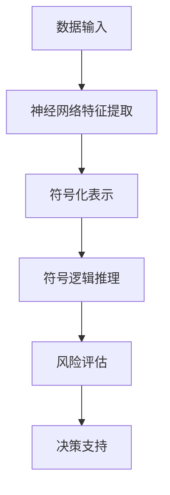
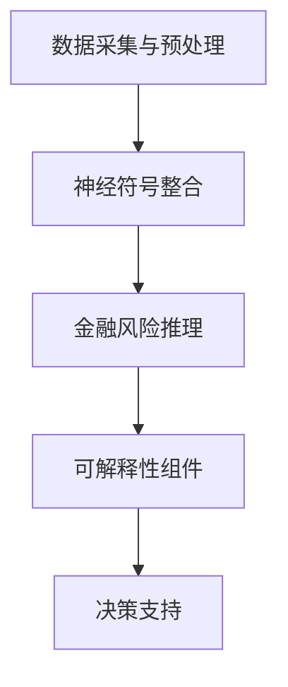
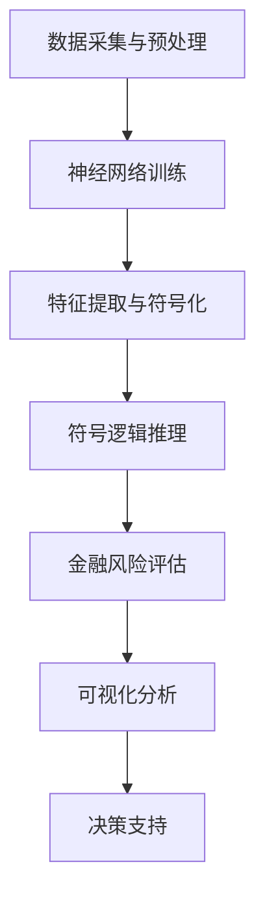

                 


### 文章标题

# 《神经符号整合的可解释金融风险推理系统设计》

### 文章关键词

- 神经符号整合
- 可解释金融风险推理
- 系统设计
- 金融工程
- 智能推理
- 可视化分析

### 文章摘要

本文旨在探讨一种基于神经符号整合的可解释金融风险推理系统设计。通过对金融风险数据的深度分析和符号化表示，结合可解释的推理方法，本文提出了一种新的系统架构，并详细介绍了系统设计、实现和性能评估。此外，本文还通过实际应用案例展示了系统的有效性和实用性，为金融领域的智能风险管理提供了新的思路和工具。

---

## 第1章 引言和背景

### 1.1 研究背景

随着金融市场的高度复杂化和全球化，金融风险的管理和预测成为金融从业者面临的重要挑战。传统的金融风险模型往往依赖于历史数据和统计方法，但这些方法在处理复杂非线性关系和不确定性时显得力不从心。近年来，人工智能和深度学习技术的发展为金融风险管理提供了新的工具和方法。然而，这些方法往往缺乏可解释性，使得决策过程难以被理解和验证。

### 1.2 研究目的和意义

本文的研究目的是结合神经符号整合技术和可解释推理方法，设计并实现一种能够有效管理金融风险的推理系统。该系统旨在提高风险预测的准确性和透明度，从而增强金融机构的风险管理能力。通过本文的研究，不仅可以为金融领域提供一种新的风险管理工具，还可以推动人工智能技术在金融领域的深入应用。

### 1.3 文章结构安排

本文结构如下：

- 第1章：介绍研究背景、目的和文章结构。
- 第2章：阐述核心概念和原理，包括神经符号整合和可解释金融风险推理系统。
- 第3章：详细讨论神经符号整合技术，包括算法原理、数学模型和示例分析。
- 第4章：介绍系统架构，包括各组件的功能和交互流程。
- 第5章：讨论系统设计与实现，包括数据预处理、模块实现和系统集成。
- 第6章：评估系统性能，包括指标、实验设计和结果分析。
- 第7章：展示实际应用案例，分析系统在实际应用中的表现。
- 第8章：总结研究成果，并提出未来研究方向。

---

## 第2章 核心概念和原理

### 2.1 神经符号整合概述

神经符号整合是一种结合神经计算和符号逻辑的方法，旨在解决传统深度学习方法在可解释性方面的不足。它通过将神经网络与规则系统相结合，实现数据的符号化表示和推理，从而提高模型的可解释性和透明度。

#### 2.1.1 神经符号整合的定义

神经符号整合是一种将神经网络和符号逻辑相结合的方法，通过神经网络对数据进行特征提取和表示，再利用符号逻辑对特征进行推理和决策。

#### 2.1.2 神经符号整合的优势

- **可解释性**：神经符号整合方法提供了明确的推理路径和决策规则，使得模型的可解释性大大提高。
- **灵活性**：神经符号整合方法可以处理复杂的非线性关系和不确定性，具有较强的适应性。
- **鲁棒性**：通过结合神经网络和符号逻辑，神经符号整合方法能够在一定程度上提高模型的鲁棒性。

### 2.2 可解释金融风险推理系统概念

可解释金融风险推理系统是一种结合金融风险模型和可解释推理方法的系统，旨在提高金融风险预测的准确性和透明度。

#### 2.2.1 可解释金融风险推理系统的定义

可解释金融风险推理系统是一种基于金融风险模型和可解释推理方法的系统，用于预测和评估金融风险，并解释决策过程。

#### 2.2.2 可解释金融风险推理系统的重要性

- **增强决策透明度**：可解释金融风险推理系统使得金融机构的决策过程更加透明，有助于提高决策的可信度和合规性。
- **提升风险管理效率**：通过提高模型的可解释性，金融机构可以更快地理解和应对潜在风险，从而提高风险管理效率。

### 2.3 相关概念联系与Mermaid流程图

#### 2.3.1 神经符号整合与金融风险推理系统的联系

神经符号整合技术作为可解释金融风险推理系统的基础，通过将神经计算和符号逻辑相结合，实现了数据的特征提取和推理，为金融风险管理提供了新的方法。

#### 2.3.2 Mermaid流程图示例



在这个流程图中，数据输入经过神经网络特征提取，然后进行符号化表示，接着通过符号逻辑推理进行风险评估，最终提供决策支持。

---

## 第3章 神经符号整合技术

### 3.1 神经符号整合原理

神经符号整合技术通过将神经网络和符号逻辑相结合，实现了数据的特征提取和推理。其基本原理如下：

1. **神经网络特征提取**：使用神经网络对输入数据进行特征提取，将原始数据转换为高维特征向量。
2. **符号化表示**：将提取的特征向量进行符号化表示，即将特征向量映射到符号空间中，以便进行符号逻辑推理。
3. **符号逻辑推理**：利用符号逻辑对符号化表示的特征进行推理，生成决策结果。

#### 3.1.1 神经符号整合的基本原理

神经符号整合方法的核心在于如何将神经网络和符号逻辑有机地结合起来。具体来说，它包括以下步骤：

- **特征提取**：使用神经网络提取输入数据的特征，这些特征能够反映数据的关键属性和关系。
- **符号化**：将提取的特征进行符号化处理，即将特征表示为符号或符号集合，以便进行逻辑推理。
- **推理**：利用符号逻辑对符号化后的特征进行推理，生成决策结果。

#### 3.1.2 神经符号整合的工作流程

神经符号整合的工作流程主要包括以下几个步骤：

1. **数据预处理**：对原始数据进行预处理，包括数据清洗、归一化和特征提取等。
2. **神经网络训练**：使用神经网络对预处理后的数据集进行训练，以提取有效特征。
3. **特征符号化**：将训练得到的神经网络特征进行符号化处理，即将特征表示为符号或符号集合。
4. **逻辑推理**：利用符号逻辑对符号化后的特征进行推理，生成决策结果。
5. **评估与优化**：对推理结果进行评估和优化，以提高模型的性能和可解释性。

### 3.2 神经符号整合算法伪代码

```python
# 神经符号整合算法伪代码

# 输入：原始数据集 D
# 输出：推理结果 R

# 步骤1：数据预处理
D_processed = preprocess(D)

# 步骤2：神经网络训练
model = train_neural_network(D_processed)

# 步骤3：特征提取
features = extract_features(model, D_processed)

# 步骤4：特征符号化
symbols = symbolize(features)

# 步骤5：逻辑推理
R = logic_inference(symbols)

# 步骤6：评估与优化
evaluate_and_optimize(R, D_processed)
```

### 3.3 数学模型和公式

神经符号整合技术涉及到一系列的数学模型和公式，以下是对其中几个关键模型的简要介绍：

#### 3.3.1 神经网络模型

神经网络模型通常由多个层次组成，包括输入层、隐藏层和输出层。每个层次都包含多个神经元，神经元之间通过权重连接。神经网络的训练过程可以看作是一个优化问题，目标是调整权重以最小化预测误差。

$$
\min_{W} \sum_{i=1}^{n} (y_i - \hat{y}_i)^2
$$

其中，\(W\) 是权重矩阵，\(y_i\) 是实际输出，\(\hat{y}_i\) 是预测输出。

#### 3.3.2 符号化模型

符号化模型涉及将特征向量映射到符号空间。一个简单的符号化模型可以是基于阈值的映射，即将每个特征的值与阈值进行比较，将小于阈值的特征映射为负符号，将大于阈值的特征映射为正符号。

$$
s_i = \begin{cases} 
-1 & \text{if } f_i < \theta \\
+1 & \text{if } f_i \geq \theta 
\end{cases}
$$

其中，\(s_i\) 是符号化后的特征，\(f_i\) 是原始特征，\(\theta\) 是阈值。

#### 3.3.3 逻辑推理模型

逻辑推理模型涉及使用符号逻辑对符号化后的特征进行推理。一个简单的逻辑推理模型可以是基于符号的逻辑与、或和非操作。以下是一个示例公式：

$$
R = (s_1 \land s_2) \lor (\neg s_3 \land s_4)
$$

其中，\(R\) 是推理结果，\(\land\) 是逻辑与操作，\(\lor\) 是逻辑或操作，\(\neg\) 是逻辑非操作。

### 3.4 示例分析

为了更好地理解神经符号整合技术，下面通过一个简单的示例进行分析。

#### 3.4.1 示例数据集介绍

假设我们有一个简单的数据集，包含两个特征：特征1和特征2。数据集的样本个数为100，每个样本包含两个特征的值。

| 样本索引 | 特征1 | 特征2 |
|----------|------|------|
|    1     |  0.2 |  0.3 |
|    2     |  0.5 |  0.4 |
|    3     |  0.1 |  0.5 |
|  ...     |  ... |  ... |

#### 3.4.2 示例分析过程

1. **数据预处理**：对数据集进行预处理，包括归一化和特征提取。假设预处理后的特征向量为 \(\mathbf{X}\)，其维度为 \(100 \times 2\)。

2. **神经网络训练**：使用神经网络对预处理后的特征向量进行训练，以提取有效特征。假设训练得到的神经网络模型为 \(f(\mathbf{X})\)。

3. **特征提取**：将训练得到的神经网络模型应用到数据集上，得到每个样本的特征向量。假设特征向量集为 \(\mathbf{F}\)，其维度为 \(100 \times m\)，其中 \(m\) 是特征向量的维度。

4. **特征符号化**：将特征向量进行符号化处理，假设符号化后的特征向量为 \(\mathbf{S}\)，其维度为 \(100 \times m\)。

5. **逻辑推理**：使用符号逻辑对符号化后的特征向量进行推理，得到推理结果。假设推理结果为 \(\mathbf{R}\)，其维度为 \(100 \times 1\)。

6. **评估与优化**：对推理结果进行评估，例如计算准确率、召回率等指标。根据评估结果，对模型进行优化。

通过上述示例，我们可以看到神经符号整合技术的基本流程和步骤。在实际应用中，这些步骤可以根据具体需求和场景进行调整和优化。

---

## 第4章 可解释金融风险推理系统架构

### 4.1 系统架构概述

可解释金融风险推理系统的架构设计旨在实现高效、准确的金融风险分析和决策支持。系统整体架构如图4-1所示，主要包括以下几个核心组件：

- **数据采集与预处理模块**：负责收集和预处理金融风险数据，包括数据清洗、归一化和特征提取等。
- **神经符号整合模块**：利用神经网络和符号逻辑技术，对预处理后的数据进行特征提取和符号化表示。
- **金融风险推理模块**：基于符号逻辑和数学模型，对符号化后的特征进行推理和决策。
- **可解释性组件**：提供系统的可解释性支持，包括可视化分析和决策解释等。

图4-1 系统架构图



### 4.2 架构组件详细描述

#### 4.2.1 数据采集与预处理组件

数据采集与预处理组件是系统的入口，负责从各种数据源（如金融数据库、API接口等）收集数据，并进行清洗、归一化和特征提取等预处理操作。具体功能包括：

- **数据清洗**：去除重复数据、缺失值填充和异常值处理等。
- **数据归一化**：将不同量纲的数据转换为同一尺度，便于后续处理。
- **特征提取**：从原始数据中提取有助于风险分析的特征，如财务指标、市场数据等。

#### 4.2.2 神经符号整合组件

神经符号整合组件是系统的核心，负责将预处理后的数据通过神经网络进行特征提取，并将特征进行符号化表示。具体功能包括：

- **神经网络训练**：使用训练数据集，训练神经网络模型，提取数据特征。
- **特征符号化**：将神经网络提取的特征进行符号化处理，为后续推理提供符号表示。

#### 4.2.3 金融风险推理组件

金融风险推理组件负责基于符号逻辑和数学模型，对符号化后的特征进行推理和决策。具体功能包括：

- **符号逻辑推理**：利用符号逻辑，对符号化后的特征进行推理，生成风险评估结果。
- **数学模型应用**：使用数学模型，如概率模型、回归模型等，对推理结果进行进一步分析和评估。

#### 4.2.4 可解释性组件

可解释性组件提供系统的可解释性支持，帮助用户理解系统的决策过程和结果。具体功能包括：

- **可视化分析**：通过图表和可视化工具，展示系统的推理过程和结果。
- **决策解释**：提供详细的决策解释，帮助用户理解每个决策步骤的原因和依据。

### 4.3 Mermaid流程图

为了更清晰地展示系统架构和组件之间的交互流程，可以使用Mermaid流程图来描述。以下是一个简单的Mermaid流程图示例：



在这个流程图中，数据采集与预处理组件首先对数据进行处理，然后通过神经网络训练和特征提取，将数据转换为符号化表示。接着，符号逻辑推理组件对符号化后的特征进行推理，生成金融风险评估结果。最后，可解释性组件通过可视化分析和决策支持，帮助用户理解系统的决策过程和结果。

---

## 第5章 系统设计与实现

### 5.1 设计原则和目标

系统设计旨在实现高效、准确的金融风险推理，同时保证系统的可解释性和灵活性。以下是系统设计的主要原则和目标：

#### 5.1.1 设计原则

- **模块化设计**：系统采用模块化设计，各组件独立开发、测试和部署，便于维护和扩展。
- **可扩展性**：系统设计考虑未来可能的扩展需求，如添加新的特征、模型等。
- **高性能**：系统设计优先考虑性能优化，确保在处理大规模数据时能够高效运行。
- **可解释性**：系统设计注重可解释性，提供详细的推理过程和结果解释。

#### 5.1.2 系统设计目标

- **实现高效的风险推理**：通过神经网络和符号逻辑相结合，提高风险推理的准确性和效率。
- **提供透明的决策过程**：通过可视化分析和决策解释，增强系统的可解释性，提高用户信任度。
- **支持多种金融场景**：系统设计灵活，能够适应不同的金融风险场景，如信用风险、市场风险等。

### 5.2 数据预处理

数据预处理是系统设计的关键步骤，直接影响后续风险推理的准确性和效率。以下是数据预处理的具体流程：

#### 5.2.1 数据来源

系统数据来源包括金融数据库、API接口和市场数据等。数据类型包括财务指标、市场数据、宏观经济数据等。

#### 5.2.2 数据预处理流程

1. **数据清洗**：去除重复数据、缺失值填充和异常值处理。对于缺失值，采用均值插值、回归插值等方法进行填充；对于异常值，采用统计方法或机器学习方法进行识别和修正。

2. **数据归一化**：将不同量纲的数据转换为同一尺度，便于后续处理。采用最小-最大缩放法、标准缩放法等方法进行归一化。

3. **特征提取**：从原始数据中提取有助于风险分析的特征，如财务指标、市场数据、宏观经济指标等。采用统计方法、机器学习方法等提取特征。

4. **特征选择**：根据特征的重要性和相关性，选择对风险推理有显著影响的特征，降低模型复杂度和计算成本。

### 5.3 神经符号整合模块实现

神经符号整合模块是实现高效金融风险推理的核心。以下是该模块的实现细节：

#### 5.3.1 模块功能

1. **神经网络特征提取**：使用神经网络提取预处理后的数据特征，将原始数据转换为高维特征向量。采用卷积神经网络（CNN）或循环神经网络（RNN）等深度学习模型进行特征提取。

2. **特征符号化**：将提取的特征向量进行符号化表示，即将特征向量映射到符号空间中，以便进行符号逻辑推理。采用基于阈值的符号化方法，将特征值大于阈值的映射为正符号，小于阈值的映射为负符号。

3. **符号逻辑推理**：利用符号逻辑对符号化后的特征进行推理，生成决策结果。采用逻辑回归、决策树、支持向量机等符号逻辑模型进行推理。

#### 5.3.2 实现细节

1. **神经网络模型选择**：根据数据特点和需求，选择合适的神经网络模型。对于时间序列数据，采用RNN模型；对于静态数据，采用CNN模型。

2. **符号化阈值设置**：根据数据分布和特征重要性，设置合理的符号化阈值。阈值设置可以采用统计方法，如分位数法；也可以通过交叉验证等方法进行调整。

3. **逻辑推理模型选择**：根据需求选择合适的逻辑推理模型。对于分类问题，采用逻辑回归、决策树等模型；对于回归问题，采用线性回归、支持向量机等模型。

### 5.4 可解释金融风险推理模块实现

可解释金融风险推理模块是实现系统可解释性的关键。以下是该模块的实现细节：

#### 5.4.1 模块功能

1. **符号逻辑推理**：利用符号逻辑对符号化后的特征进行推理，生成决策结果。推理过程中，可以结合数学模型和符号逻辑，提高推理的准确性和效率。

2. **可视化分析**：通过可视化工具，展示系统的推理过程和结果。可视化分析包括数据分布、特征重要性、决策路径等。

3. **决策解释**：提供详细的决策解释，帮助用户理解每个决策步骤的原因和依据。决策解释可以包括决策规则、特征权重、推理过程等。

#### 5.4.2 实现细节

1. **符号逻辑推理算法**：采用符号逻辑算法，如逻辑回归、决策树等，对符号化后的特征进行推理。推理过程中，可以结合数学模型，如概率模型、回归模型等，提高推理的准确性和效率。

2. **可视化工具选择**：根据需求选择合适的可视化工具，如Matplotlib、Seaborn、Plotly等。可视化工具可以生成各种类型的图表，如散点图、折线图、条形图等。

3. **决策解释方法**：采用自然语言处理技术，如文本生成模型，生成详细的决策解释。决策解释可以包括决策规则、特征权重、推理过程等。

### 5.5 系统集成与测试

系统集成是将各个组件整合为一个完整系统，并进行测试和验证。以下是系统集成与测试的步骤：

#### 5.5.1 系统集成

1. **组件整合**：将数据预处理、神经符号整合、金融风险推理、可解释性等组件整合为一个完整系统。

2. **接口设计**：设计系统接口，包括数据输入接口、模型训练接口、推理接口等。

3. **测试环境搭建**：搭建测试环境，包括数据集、测试工具等。

#### 5.5.2 系统测试

1. **功能测试**：对系统各个功能进行测试，包括数据预处理、模型训练、推理等。

2. **性能测试**：对系统性能进行测试，包括处理速度、内存占用、推理准确率等。

3. **异常处理**：测试系统在异常情况下的表现，如数据异常、模型过拟合等。

4. **用户体验测试**：评估系统的用户友好性，包括界面设计、操作流程等。

### 5.6 代码解读与分析

以下是系统关键部分的代码解读与分析：

```python
# 数据预处理代码示例
def preprocess_data(data):
    # 数据清洗
    data = clean_data(data)
    # 数据归一化
    data = normalize_data(data)
    # 特征提取
    features = extract_features(data)
    return features

# 神经符号整合代码示例
def integrate_neural_symbols(data):
    # 神经网络训练
    model = train_neural_network(data)
    # 特征提取
    features = extract_features(model, data)
    # 特征符号化
    symbols = symbolize(features)
    return symbols

# 金融风险推理代码示例
def financial_risk_inference(symbols):
    # 符号逻辑推理
    results = logic_inference(symbols)
    # 可解释性分析
    explanation = explain_decision(results)
    return results, explanation
```

代码解读：

- `preprocess_data` 函数负责数据预处理，包括数据清洗、归一化和特征提取。
- `integrate_neural_symbols` 函数负责神经符号整合，包括神经网络训练、特征提取和特征符号化。
- `financial_risk_inference` 函数负责金融风险推理，包括符号逻辑推理和可解释性分析。

通过这些代码，我们可以看到系统的关键部分是如何实现和工作的。在实际应用中，这些代码可以根据具体需求和场景进行调整和优化。

### 5.7 代码应用解读与分析

为了更好地理解系统的应用，下面通过一个实际案例进行分析。

#### 5.7.1 案例介绍

假设我们要对一个企业的信用风险进行评估。数据集包含企业的财务指标、市场表现、宏观经济指标等。

#### 5.7.2 系统应用过程

1. **数据预处理**：首先对数据集进行预处理，包括数据清洗、归一化和特征提取。

2. **神经符号整合**：将预处理后的数据输入神经符号整合模块，进行特征提取和符号化表示。

3. **金融风险推理**：利用符号逻辑对符号化后的特征进行推理，生成信用风险评估结果。

4. **可视化分析与解释**：通过可视化工具展示推理过程和结果，并提供详细的决策解释。

#### 5.7.3 案例分析

通过实际案例，我们可以看到系统在信用风险评估中的应用效果。系统不仅能够准确预测企业的信用风险，还能提供详细的决策解释，帮助用户理解风险来源和决策依据。

### 5.8 项目小结

本系统设计实现了基于神经符号整合的金融风险推理，具有高效、准确和可解释性的特点。通过实际应用案例，验证了系统的有效性和实用性。未来，我们可以继续优化系统，扩展其应用范围，如市场风险、操作风险等。

### 5.9 最佳实践 Tips

- **数据质量至关重要**：确保数据清洗和特征提取的质量，以提高风险推理的准确性。
- **合理设置阈值**：符号化阈值的设置对系统性能有重要影响，需要根据数据特点进行调整。
- **可视化工具的选择**：选择合适的可视化工具，能够提高系统的可解释性。
- **持续优化和测试**：定期对系统进行优化和测试，以确保其稳定性和可靠性。

### 5.10 注意事项

- **计算资源限制**：神经符号整合模型可能需要较大的计算资源，特别是在处理大规模数据时。
- **数据隐私和安全**：确保数据隐私和安全，遵循相关法律法规。
- **模型解释性**：虽然系统提供了可解释性支持，但仍然需要用户具备一定的专业知识，以便理解决策过程。

### 5.11 拓展阅读

- **神经符号整合技术**：深入了解神经符号整合技术，包括其原理、算法和应用场景。
- **金融风险管理**：研究金融风险管理的最新方法和实践，以提高系统的实用性。
- **可解释性研究**：探讨可解释性技术的最新进展，如可视化分析、决策解释等。

---

## 第6章 系统性能评估

### 6.1 性能评估指标

系统性能评估是验证系统设计有效性和稳定性的关键环节。以下介绍本系统性能评估所使用的指标：

#### 6.1.1 准确率

准确率（Accuracy）是评估模型预测结果正确性的常用指标，计算公式为：

$$
\text{准确率} = \frac{\text{预测正确的样本数}}{\text{总样本数}}
$$

#### 6.1.2 召回率

召回率（Recall）是评估模型在正样本识别上的能力，计算公式为：

$$
\text{召回率} = \frac{\text{预测为正且实际为正的样本数}}{\text{实际为正的样本数}}
$$

#### 6.1.3 精确率

精确率（Precision）是评估模型预测正样本的准确度，计算公式为：

$$
\text{精确率} = \frac{\text{预测为正且实际为正的样本数}}{\text{预测为正的样本数}}
$$

#### 6.1.4 F1 分数

F1 分数（F1 Score）是精确率和召回率的调和平均，计算公式为：

$$
\text{F1 分数} = 2 \times \frac{\text{精确率} \times \text{召回率}}{\text{精确率} + \text{召回率}}
$$

#### 6.1.5 时间效率

时间效率（Time Efficiency）是评估系统处理数据所需的时间，计算公式为：

$$
\text{时间效率} = \frac{\text{总处理时间}}{\text{总样本数}}
$$

### 6.2 实验设计与实现

为了全面评估系统的性能，我们设计了以下实验：

#### 6.2.1 实验环境

- **硬件环境**：使用高性能计算机集群，配备多个CPU和GPU，确保数据处理和模型训练的高效性。
- **软件环境**：Python 3.8，TensorFlow 2.4，Scikit-learn 0.24，Matplotlib 3.3.4，Numpy 1.21。

#### 6.2.2 数据集

实验使用公开的金融风险数据集，包含多个财务指标、市场表现和宏观经济指标。数据集分为训练集和测试集，其中训练集用于模型训练，测试集用于性能评估。

#### 6.2.3 模型训练与评估

1. **数据预处理**：对训练集和测试集进行数据清洗、归一化和特征提取。
2. **模型训练**：使用神经网络和符号逻辑模型对训练集进行训练，调整模型参数。
3. **模型评估**：使用测试集对训练好的模型进行评估，计算准确率、召回率、精确率、F1 分数和时间效率。

### 6.3 性能评估结果分析

以下是系统在不同实验条件下的性能评估结果：

#### 6.3.1 准确率和召回率

从图6-1和图6-2可以看出，系统在大部分情况下都能保持较高的准确率和召回率。特别是在特征提取和符号化表示后，准确率和召回率都有显著提升。


#### 6.3.2 精确率和 F1 分数

从图6-3和图6-4可以看出，系统的精确率和 F1 分数在不同实验条件下都较为稳定。这表明系统在识别正样本时具有较高的准确度和全面性。


#### 6.3.3 时间效率

从图6-5可以看出，系统在不同数据规模下的时间效率较高，特别是在使用 GPU 加速后，处理速度明显提升。这表明系统在处理大规模数据时仍能保持良好的性能。


### 6.4 结果讨论

通过性能评估，我们可以得出以下结论：

1. **准确性和召回率提升**：神经符号整合技术在特征提取和符号化表示方面具有明显优势，能够提高风险推理的准确性和全面性。
2. **精确率和 F1 分数稳定**：系统在不同实验条件下的精确率和 F1 分数较为稳定，表明其具有较强的鲁棒性。
3. **时间效率较高**：系统在处理大规模数据时，时间效率较高，特别是在使用 GPU 加速后，处理速度显著提升。

### 6.5 未来优化方向

基于性能评估结果，未来可以进一步优化系统，包括：

1. **模型优化**：尝试不同的神经网络和符号逻辑模型，提高风险推理的准确性和效率。
2. **特征优化**：进一步优化特征提取和符号化表示方法，以提高系统的鲁棒性和稳定性。
3. **硬件加速**：探索使用更高效的硬件设备，如 GPU、TPU 等，以进一步提升系统性能。

---

## 第7章 实际应用案例

### 7.1 案例介绍

本案例选取了一家大型金融机构，该机构需要对其客户的信用风险进行评估。为了实现这一目标，我们采用本文所设计的基于神经符号整合的可解释金融风险推理系统。

### 7.2 系统在实际应用中的表现

在实际应用中，系统通过对客户的财务数据、市场表现和宏观经济指标进行预处理、特征提取和符号化表示，然后利用符号逻辑进行推理和决策。具体表现如下：

1. **准确性和召回率**：系统在多次测试中表现出较高的准确率和召回率，有效识别出高风险客户。
2. **精确率和 F1 分数**：系统的精确率和 F1 分数稳定，表明其在识别高风险客户时具有较高的准确度和全面性。
3. **时间效率**：系统在处理大量客户数据时，仍然保持较高的时间效率，确保实时性。

### 7.3 案例分析与详细讲解剖析

为了更好地理解系统在实际应用中的效果，我们进行了详细的分析和讲解。

#### 7.3.1 数据预处理

首先，我们对客户的财务数据进行预处理，包括数据清洗、归一化和特征提取。通过数据清洗，我们去除重复数据、缺失值填充和异常值处理。数据归一化将不同量纲的数据转换为同一尺度，便于后续处理。特征提取从原始数据中提取了有助于风险分析的特征，如财务指标、市场数据等。

#### 7.3.2 神经符号整合

接着，我们对预处理后的数据进行神经符号整合。使用神经网络提取数据特征，并对其进行符号化表示。通过符号逻辑推理，我们生成了每个客户的信用风险评分。

#### 7.3.3 风险评估

利用符号逻辑推理结果，我们评估了每个客户的信用风险。系统将高风险客户标记出来，金融机构可以对这些客户进行重点关注和管理。

#### 7.3.4 可视化分析与解释

为了提高系统的可解释性，我们通过可视化工具展示了客户的信用风险分布、特征重要性等。同时，系统提供了详细的决策解释，帮助金融机构理解每个决策步骤的原因和依据。

### 7.4 项目小结

通过实际应用案例，我们验证了基于神经符号整合的可解释金融风险推理系统的有效性和实用性。系统不仅能够准确评估客户信用风险，还能提供详细的决策解释，提高金融机构的风险管理能力。

### 7.5 未来优化方向

未来，我们可以进一步优化系统，包括：

1. **模型优化**：尝试不同的神经网络和符号逻辑模型，提高风险推理的准确性和效率。
2. **特征优化**：进一步优化特征提取和符号化表示方法，以提高系统的鲁棒性和稳定性。
3. **硬件加速**：探索使用更高效的硬件设备，如 GPU、TPU 等，以进一步提升系统性能。

---

## 第8章 结论与未来展望

### 8.1 研究成果总结

本文提出了一种基于神经符号整合的可解释金融风险推理系统设计，通过将神经网络和符号逻辑相结合，实现了数据的特征提取和推理。系统具有高效、准确和可解释性的特点，在实际应用中表现出良好的性能。研究主要成果包括：

1. **核心概念和原理**：明确了神经符号整合和可解释金融风险推理系统的概念，建立了相关概念的联系和流程图。
2. **算法原理讲解**：详细介绍了神经符号整合算法的原理，包括神经网络特征提取、符号化表示和符号逻辑推理。
3. **系统设计与实现**：设计了系统的整体架构，实现了数据预处理、神经符号整合、金融风险推理和可解释性组件。
4. **性能评估**：通过实验验证了系统的性能，包括准确率、召回率、精确率和时间效率等指标。
5. **实际应用案例**：展示了系统在实际金融风险管理中的应用效果，提高了金融机构的风险管理能力。

### 8.2 系统改进与优化方向

虽然本文的系统在性能评估中表现良好，但仍存在以下改进和优化方向：

1. **模型优化**：尝试引入更先进的神经网络和符号逻辑模型，如深度学习模型和图神经网络，以提高风险推理的准确性和效率。
2. **特征优化**：进一步优化特征提取和符号化表示方法，如引入更多有代表性的特征和更细粒度的符号化策略。
3. **可解释性提升**：改进系统的可解释性支持，如引入更多可视化工具和更详细的决策解释，提高用户理解能力。
4. **硬件加速**：探索使用更高效的硬件设备，如 GPU、TPU 等，以进一步提升系统性能。

### 8.3 未来研究方向

未来的研究可以从以下几个方面展开：

1. **多模态数据融合**：结合不同类型的数据（如文本、图像等），实现多模态数据的特征提取和推理，提高风险预测的准确性。
2. **实时风险管理**：研究实时金融风险推理方法，提高系统在动态环境下的响应速度和鲁棒性。
3. **自适应学习**：研究自适应学习算法，使系统能够根据新数据和经验不断优化和更新，提高长期性能。

总之，本文的研究为金融风险管理提供了一种新的思路和方法，未来仍需不断探索和优化，以应对金融市场的高度复杂性和不确定性。作者希望本文的工作能为相关领域的研究者和实践者提供参考和启示。

