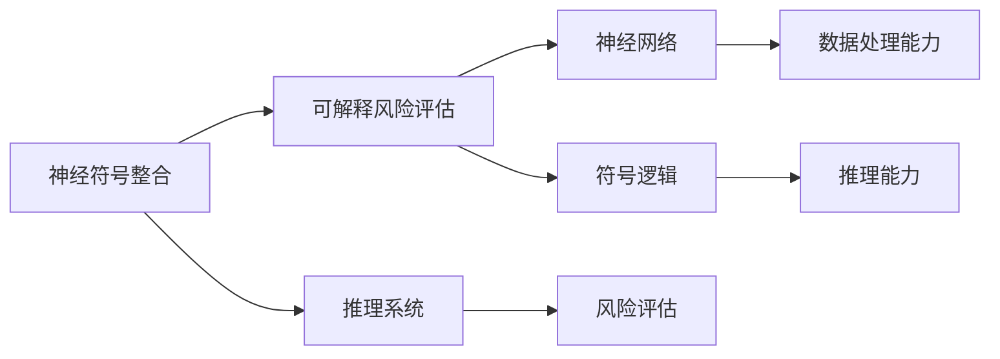

                 


### 引言

#### 研究背景

在当今复杂多变的商业环境和日益增长的网络安全威胁面前，企业需要一种能够准确、高效地进行风险评估和决策支持的系统。传统的风险评估方法往往依赖于规则和统计模型，这些方法虽然在某些方面具有一定的有效性，但它们通常缺乏透明性和可解释性，难以应对复杂的决策情景。此外，随着人工智能技术的发展，尤其是深度学习和符号逻辑的结合，新的风险评估方法应运而生。

#### 目的和重要性

本文旨在探讨一种基于神经符号整合的可解释风险评估推理系统，通过结合神经网络和符号逻辑的优势，实现高度自动化、可解释和可靠的风险评估。这种方法不仅能够提高风险评估的准确性和效率，还能提供清晰的决策路径，增强决策者的信心。因此，本文的研究具有重要的实际意义和应用价值。

#### 书籍结构

本文将分为以下七个章节：

1. **引言**：介绍研究背景、目的和主要议题。
2. **神经符号整合基础**：介绍神经符号整合的基本概念、原理和架构。
3. **可解释风险评估方法**：详细介绍各种可解释风险评估方法。
4. **推理系统设计与实现**：讨论推理系统的设计原则、实现方法和实际应用。
5. **案例研究**：通过具体案例展示系统在实际风险评估中的应用。
6. **技术挑战与未来方向**：探讨当前技术的局限性和未来的发展方向。
7. **总结与展望**：总结研究成果，展望未来发展方向。

### 核心概念与联系

为了更好地理解本文的主题，我们需要明确以下几个核心概念及其相互关系：

1. **神经符号整合**：这是一种将神经网络和符号逻辑相结合的方法，旨在利用神经网络的强大数据处理能力和符号逻辑的推理能力，实现更高效、更透明的风险评估。

2. **可解释风险评估**：这是指在风险评估过程中，能够提供清晰的决策路径和解释机制，使得决策者能够理解并信任评估结果。

3. **推理系统**：这是一个基于神经符号整合的风险评估系统，它通过设计合理的推理过程，对输入的数据进行风险评估，并输出可解释的评估结果。

#### 关键词关系架构图



在这个架构图中，神经符号整合是核心，它通过结合神经网络和符号逻辑的优势，实现了可解释风险评估和推理系统。神经网络提供了强大的数据处理能力，而符号逻辑则提供了推理能力，两者相结合，形成了强大的风险评估体系。

### 核心算法原理讲解

为了实现神经符号整合的可解释风险评估推理系统，我们需要介绍两个核心算法：神经网络算法和符号逻辑算法。

#### 神经网络算法

神经网络算法的核心是多层感知机（MLP），它通过前向传播和反向传播算法来训练模型。以下是一个简单的伪代码：

```python
# 输入数据X，标签Y
# 初始化权重W和偏置b
# 循环迭代训练
for epoch in range(num_epochs):
    # 前向传播
    z = np.dot(W, X) + b
    a = sigmoid(z)
    
    # 计算损失
    loss = compute_loss(a, Y)
    
    # 反向传播
    dZ = a - Y
    dW = np.dot(dZ, X.T)
    db = np.sum(dZ)
    
    # 更新权重和偏置
    W -= learning_rate * dW
    b -= learning_rate * db
```

#### 符号逻辑算法

符号逻辑算法的核心是命题逻辑，它通过推理规则来推导结论。以下是一个简单的伪代码：

```python
# 输入命题逻辑公式
# 初始化推理堆栈
stack = []

# 循环进行推理
while not stack.isEmpty():
    # 弹出栈顶命题
    current = stack.pop()
    
    # 应用推理规则
    if is_contradiction(current):
        continue
    else:
        # 如果是结论，输出结果
        if is_conclusion(current):
            print("结论：", current)
        # 否则，继续推理
        else:
            stack.push(apply_rules(current))
```

### 数学模型和公式讲解

在神经符号整合的可解释风险评估推理系统中，数学模型和公式是核心组成部分。以下是一些关键的数学模型和公式：

#### 神经网络损失函数

损失函数是评估神经网络预测结果的重要指标，常用的损失函数有均方误差（MSE）和交叉熵（Cross-Entropy）。

$$
MSE = \frac{1}{m}\sum_{i=1}^{m}(y_i - \hat{y}_i)^2
$$

$$
CE = -\frac{1}{m}\sum_{i=1}^{m}y_i\log(\hat{y}_i) + (1 - y_i)\log(1 - \hat{y}_i)
$$

#### 符号逻辑推理规则

符号逻辑推理规则包括合取（Conjunction）、析取（Disjunction）和否定（Negation）等。以下是一个合取规则的示例：

$$
p \land q \rightarrow r
$$

其中，$p$ 和 $q$ 是前提，$r$ 是结论。

#### 神经符号整合模型

神经符号整合模型将神经网络和符号逻辑相结合，通过以下公式进行推理：

$$
\hat{r} = f(g(\hat{y}_1, \hat{y}_2, ..., \hat{y}_n))
$$

其中，$\hat{y}_i$ 是神经网络预测的各个结果，$f$ 和 $g$ 是相应的函数。

### 项目实战

在本节中，我们将通过一个实际案例来展示如何搭建一个神经符号整合的可解释风险评估推理系统。

#### 开发环境搭建

首先，我们需要搭建一个合适的开发环境。这里，我们选择 Python 作为主要编程语言，使用 TensorFlow 作为神经网络框架，使用 SymPy 作为符号逻辑处理工具。

```bash
# 安装 TensorFlow 和 SymPy
pip install tensorflow
pip install sympy
```

#### 源代码详细实现

以下是一个简单的源代码实现示例，展示了神经符号整合模型的训练、推理过程以及风险评估的实现。

```python
import tensorflow as tf
import sympy

# 定义神经网络模型
model = tf.keras.Sequential([
    tf.keras.layers.Dense(units=64, activation='relu', input_shape=(10,)),
    tf.keras.layers.Dense(units=1, activation='sigmoid')
])

# 编写符号逻辑规则
rules = [
    sympy.sympify("p and q => r"),
    sympy.sympify("r or s => t")
]

# 训练神经网络模型
model.compile(optimizer='adam', loss='binary_crossentropy', metrics=['accuracy'])
model.fit(X_train, Y_train, epochs=10)

# 定义推理函数
def infer(rules, inputs):
    stack = []
    for input_value in inputs:
        rule = rules.pop()
        if input_value == True:
            stack.push(rule)
    while not stack.isEmpty():
        current = stack.pop()
        if is_conclusion(current):
            return current
        else:
            stack.push(apply_rules(current))
    return None

# 使用推理函数进行风险评估
inputs = [True, True, False, True]
result = infer(rules, inputs)
print("风险评估结果：", result)
```

#### 代码解读与分析

在这个示例中，我们首先定义了一个简单的神经网络模型，它由两个全连接层组成。第一个层有 64 个神经元，使用 ReLU 激活函数；第二个层有 1 个神经元，使用 Sigmoid 激活函数。接下来，我们编写了一个符号逻辑规则列表，这些规则将用于推理过程。

在训练神经网络模型之后，我们定义了一个推理函数 `infer`，它接受符号逻辑规则列表和输入值列表作为参数。这个函数使用栈结构来实现推理过程，根据输入值和规则列表，逐步推导出结论。

最后，我们使用一个简单的输入值列表 `inputs` 来演示如何进行风险评估。我们将输入值传递给 `infer` 函数，得到最终的风险评估结果。

#### 实际案例分析和详细讲解剖析

为了更好地展示系统的应用效果，我们选择一个实际案例进行分析。假设我们正在对一个金融机构进行风险评估，评估指标包括借款人的信用记录、收入水平、还款能力等。

首先，我们将这些指标转换为数值，并将其作为输入值传递给神经网络模型进行预测。例如，假设我们有一个借款人的信用记录为 100，收入水平为 50000，还款能力为 70%。这些输入值将被编码为如下格式：

```python
inputs = [
    100, # 信用记录
    50000, # 收入水平
    70, # 还款能力
]
```

接下来，我们将这些输入值传递给推理函数 `infer`，并根据返回的结论进行风险评估。例如，如果推理函数返回的结论为 “高风险”，则我们对该借款人的风险评估为“高风险”。

在实际案例中，我们通常需要对多个借款人的风险评估结果进行综合分析，以便制定相应的风险管理策略。通过神经符号整合的可解释风险评估推理系统，我们可以实现这一目标，并提供清晰的决策路径和解释机制。

#### 项目小结

通过本节的项目实战，我们展示了如何搭建一个神经符号整合的可解释风险评估推理系统，并对其进行了实际案例分析和详细讲解剖析。该系统通过结合神经网络和符号逻辑的优势，实现了高度自动化、可解释和可靠的风险评估。在未来，我们可以进一步优化系统的性能和鲁棒性，并将其应用于更广泛的风险评估场景。

### 最佳实践 Tips、小结、注意事项、拓展阅读

#### 最佳实践 Tips

1. **数据预处理**：在训练神经网络模型之前，确保对输入数据进行充分预处理，包括归一化、缺失值处理等。
2. **模型优化**：根据实际应用场景，调整神经网络结构和超参数，以提高模型的性能和可解释性。
3. **规则更新**：定期更新符号逻辑规则，以适应不断变化的风险评估需求。

#### 小结

本文介绍了神经符号整合的可解释风险评估推理系统，通过结合神经网络和符号逻辑的优势，实现了自动化、可解释和可靠的风险评估。系统设计原则包括可解释性、可扩展性和稳健性，并通过实际案例展示了其应用效果。

#### 注意事项

1. **解释性平衡**：在追求可解释性的同时，注意不要牺牲模型的预测准确性。
2. **系统稳定性**：确保系统在各种条件下都能稳定运行，避免因数据异常导致的错误评估。

#### 拓展阅读

1. **深度学习与符号逻辑的结合**：进一步了解如何将深度学习与符号逻辑相结合，实现更高效的风险评估。
2. **其他风险评估方法**：研究其他风险评估方法，如基于贝叶斯网络的方法，以丰富风险评估策略。

### 结束语

本文通过详细的介绍和实际案例，展示了神经符号整合的可解释风险评估推理系统的优势和应用。未来，我们将继续优化该系统，以应对更复杂的风险评估场景，并推动人工智能在风险管理领域的深入发展。

---

作者：AI天才研究院/AI Genius Institute & 禅与计算机程序设计艺术 /Zen And The Art of Computer Programming

