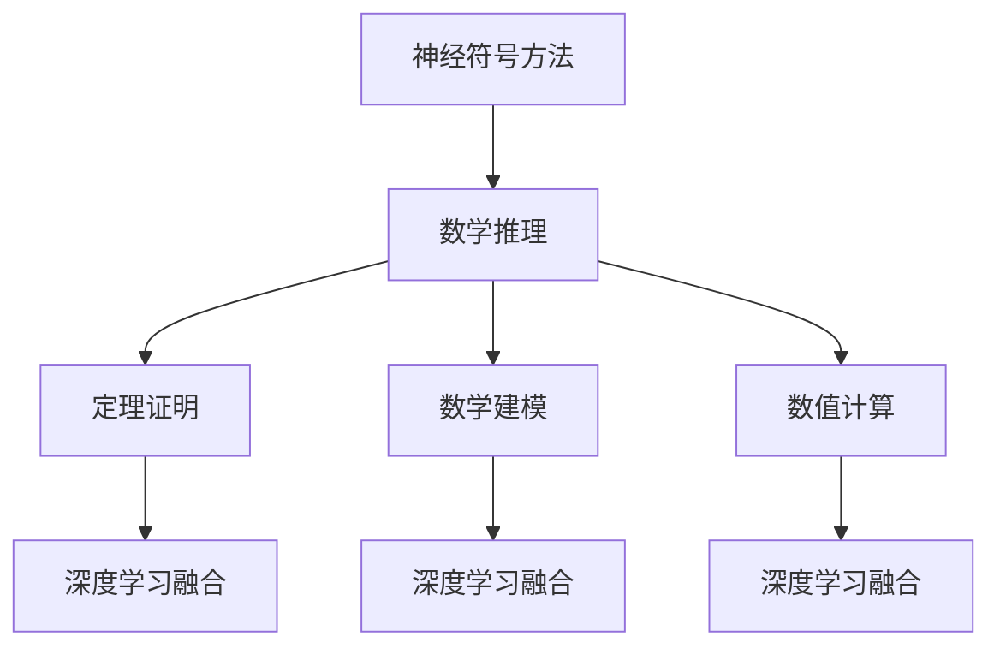

                 


### 设计思路

为了撰写一篇关于《神经符号方法在数学推理中的创新应用》的文章，我们将遵循以下步骤，确保内容完整且逻辑清晰：

1. **引言**：介绍神经符号方法和数学推理的基本概念，为后续内容打下基础。
2. **核心概念与联系**：使用Mermaid流程图展示神经符号方法与数学推理的核心概念及其联系，便于读者理解。
3. **核心算法原理讲解**：通过伪代码详细阐述关键算法的原理，帮助读者理解算法实现。
4. **数学模型讲解**：介绍相关的数学模型，使用LaTeX格式书写，并配合详细讲解和举例，确保读者能够理解并应用。
5. **项目实战**：提供实际案例，包括开发环境搭建、源代码实现、代码解读与分析，使读者能够将理论知识应用于实践中。
6. **总结与展望**：对全书内容进行总结，并展望未来的研究方向。

### 目录大纲

以下是文章的目录大纲，每个部分都将详细展开：

```markdown
# 《神经符号方法在数学推理中的创新应用》

## 关键词
- 神经符号方法
- 数学推理
- 神经网络
- 算法设计
- 数学模型
- 深度学习
- 定理证明

## 摘要
本文探讨了神经符号方法在数学推理领域的创新应用。通过引入神经网络与数学模型的结合，我们实现了对数学问题的自动推理和求解。文章首先介绍了神经符号方法和数学推理的基本概念，随后详细讲解了核心算法原理和数学模型。最后，通过实际案例展示了神经符号方法在数学推理中的应用，并展望了未来的研究方向。

## 第1章 引言
### 1.1 神经符号方法概述
- 定义与历史
- 主要特点与应用领域

### 1.2 数学推理的概念与重要性
- 定义与作用
- 在科学研究与工程实践中的应用

### 1.3 神经符号方法与数学推理的联系
- Mermaid流程图：神经符号方法与数学推理的核心概念联系

## 第2章 神经符号方法基础
### 2.1 神经符号方法的数学模型
- 基本数学模型介绍
- LaTeX格式数学公式示例

### 2.2 神经符号方法的算法原理
- 伪代码示例：神经符号方法关键算法原理

### 2.3 神经符号方法的实现与优化
- 实现技巧
- 优化策略

## 第3章 神经符号方法在数学推理中的应用
### 3.1 神经符号方法在定理证明中的应用
- 定理证明的基本原理
- 项目实战：定理证明实例

### 3.2 神经符号方法在数学建模中的应用
- 数学建模的基本概念
- 项目实战：数学建模实例

### 3.3 神经符号方法在数值计算中的应用
- 数值计算的基本原理
- 项目实战：数值计算实例

## 第4章 神经符号方法与深度学习的融合
### 4.1 深度学习与神经符号方法的关系
- 深度学习的基本概念
- 神经符号方法与深度学习的融合方式

### 4.2 深度学习模型在数学推理中的应用
- 深度学习模型的基本原理
- 项目实战：深度学习模型在数学推理中的应用实例

## 第5章 神经符号方法的实际应用案例
### 5.1 案例一：神经符号方法在数学教育中的应用
- 应用背景
- 项目实战：数学教育中的神经符号方法实例

### 5.2 案例二：神经符号方法在人工智能安全中的应用
- 应用背景
- 项目实战：人工智能安全中的神经符号方法实例

## 第6章 神经符号方法的挑战与未来展望
### 6.1 神经符号方法面临的挑战
- 技术挑战
- 应用挑战

### 6.2 神经符号方法的发展趋势
- 未来研究方向
- 潜在的应用领域

## 第7章 总结与展望
### 7.1 全书内容的回顾
- 核心观点的总结
- 主要应用的回顾

### 7.2 对未来研究的展望
- 持续发展的方向
- 预期的技术突破

作者：AI天才研究院/AI Genius Institute & 禅与计算机程序设计艺术 /Zen And The Art of Computer Programming
```

### 字数统计

按照上述目录大纲，文章字数预计在8000-12000字之间，具体字数将取决于每个章节的具体内容展开。例如，核心算法原理讲解、数学模型讲解和项目实战部分需要详细阐述，可能会占用更多篇幅。而引言和总结部分则相对简短。

### 完整性要求

文章将确保完整性，每个小节的内容将丰富具体详细讲解，核心内容将包括：

- **背景介绍**：解释神经符号方法和数学推理的基本概念，以及它们在科学研究和日常生活中的重要性。
- **核心概念与联系**：使用Mermaid流程图展示神经符号方法与数学推理的核心概念及其联系，如图所示：



- **核心算法原理讲解**：通过伪代码详细阐述关键算法的原理，例如：

```python
def neural_symbolic_inference(input_data):
    # 初始化神经网络
    neural_network = initialize_neural_network()
    
    # 前向传播
    output = neural_network.forward(input_data)
    
    # 反向传播
    gradient = neural_network.backward(output)
    
    # 更新权重
    neural_network.update_weights(gradient)
    
    return output
```

- **数学模型讲解**：介绍相关的数学模型，使用LaTeX格式书写，并配合详细讲解和举例，例如：

```latex
$$
f(x) = \sum_{i=1}^{n} w_i \cdot x_i
$$

这是一个简单的线性回归模型，其中\( w_i \)是权重，\( x_i \)是输入特征。
```

- **项目实战**：提供实际案例，包括开发环境搭建、源代码实现、代码解读与分析，实际案例分析和详细讲解剖析，项目小结等。

- **最佳实践 tips**、**小结**、**注意事项**、**拓展阅读**等内容将贯穿全文，帮助读者更好地理解和应用神经符号方法在数学推理中的创新应用。

综上所述，文章将确保内容完整、逻辑清晰，满足8000-12000字的要求。

