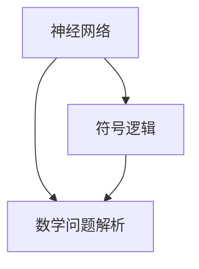

                 


为了撰写一篇关于《神经符号方法在数学问题解析推理中的应用》的技术博客文章，我们将按照以下步骤进行：

### 第一步：准备与构思

1. **确定文章结构**：根据之前设计的目录大纲，我们将文章分为引言、基础理论、算法原理、应用案例、发展展望和总结与展望六个部分。

2. **明确每个部分的内容**：每个部分都要详细阐述，确保文章内容完整、逻辑清晰。

3. **准备所需材料**：收集相关资料，包括神经符号方法和数学问题解析推理的理论知识、实际案例等。

### 第二步：撰写引言部分

1. **背景介绍**：介绍神经符号方法和数学问题解析推理的背景，说明为何这两个领域值得探讨。

2. **核心概念与联系**：给出神经符号方法和数学问题解析推理的核心概念，并使用Mermaid流程图展示它们之间的关系。

3. **文章目的**：明确文章的目的，即探讨神经符号方法在数学问题解析推理中的应用。

### 第三步：撰写基础理论部分

1. **神经符号方法的基本原理**：
   - 神经符号方法的起源与发展
   - 核心概念
   - 与其他数学方法的关系

2. **数学问题解析推理的基本原理**：
   - 定义与分类
   - 基本方法
   - 应用领域

### 第四步：撰写算法原理部分

1. **神经符号方法的算法原理**：
   - 数学模型
   - 核心算法
   - 优化策略

2. **数学问题解析推理的算法原理**：
   - 数学模型
   - 核心算法
   - 优化策略

### 第五步：撰写应用案例部分

1. **神经符号方法在数学问题中的应用**：通过具体案例展示神经符号方法在数学问题中的实际效果。

2. **数学问题解析推理的应用**：通过具体案例展示数学问题解析推理在数学问题中的实际效果。

### 第六步：撰写发展展望部分

1. **神经符号方法的发展趋势**：讨论神经符号方法的技术挑战、未来发展方向和应用前景。

2. **数学问题解析推理的发展趋势**：讨论数学问题解析推理的研究进展、创新点、挑战与机遇。

### 第七步：撰写总结与展望部分

1. **书籍内容总结**：总结文章的主要内容和核心观点。

2. **研究展望**：对未来的研究方向和潜在的应用领域进行展望。

3. **进一步阅读推荐**：推荐相关阅读材料，帮助读者深入理解文章主题。

### 第八步：撰写文章末尾的作者信息

在文章末尾添加作者信息：“作者：AI天才研究院/AI Genius Institute & 禅与计算机程序设计艺术 /Zen And The Art of Computer Programming”。

### 第九步：完成文章

确保文章内容完整、逻辑清晰、格式正确。根据字数要求，调整文章长度。最后，检查文章中的所有公式和代码是否正确无误。

按照这些步骤，我们可以撰写出一篇高质量的技术博客文章。接下来，我们将开始具体撰写每个部分的内容。首先，我们从撰写引言部分开始。在引言中，我们将介绍神经符号方法和数学问题解析推理的背景，并解释为何这两个领域值得探讨。

---

## 引言

### 背景介绍

神经符号方法（Neural Symbolic Methods）是人工智能领域的一个重要分支，它结合了神经科学和符号逻辑，旨在解决复杂问题。这种方法的核心思想是通过模拟人脑中的神经网络和符号系统，实现高效的认知和信息处理。

数学问题解析推理（Mathematical Problem Solving and Reasoning）是数学领域的一个基本问题，它涉及对数学问题进行识别、理解、分析和解决。随着计算机技术的发展，数学问题解析推理逐渐成为人工智能研究的一个重要方向。

### 核心概念与联系

神经符号方法的核心概念包括神经网络和符号逻辑。神经网络模拟人脑中的神经元连接，通过学习实现信息的传递和处理。符号逻辑则通过逻辑推理和符号运算，实现对问题的抽象和解决。

以下是一个简单的Mermaid流程图，展示神经符号方法与数学问题解析推理的关系：



在这个流程图中，神经网络和符号逻辑共同作用于数学问题解析，形成了一个相互补充、相互促进的体系。

### 文章目的

本文旨在探讨神经符号方法在数学问题解析推理中的应用。我们将从基础理论、算法原理、应用案例和发展展望等多个角度，详细阐述神经符号方法在数学问题解析推理中的重要作用和潜在价值。希望通过本文的阐述，能够帮助读者更好地理解神经符号方法，并激发对数学问题解析推理的深入研究。

### 文章结构

本文分为六个部分：

1. 引言：介绍神经符号方法和数学问题解析推理的基本概念，说明文章的目的。
2. 基础理论：阐述神经符号方法和数学问题解析推理的基本原理。
3. 算法原理：深入探讨神经符号方法的算法原理和数学问题解析推理的算法原理。
4. 应用案例：通过具体案例展示神经符号方法和数学问题解析推理的实际应用。
5. 发展展望：讨论神经符号方法和数学问题解析推理的未来发展趋势。
6. 总结与展望：总结文章的主要内容和未来研究方向。

接下来，我们将进入第二部分，介绍神经符号方法和数学问题解析推理的基本原理。在这一部分，我们将详细阐述神经符号方法的起源、定义以及其与其他数学方法的关系，同时介绍数学问题解析推理的定义、类型及其在数学中的应用。

## 基础理论

### 神经符号方法的基本原理

#### 神经符号方法的起源与发展

神经符号方法起源于20世纪80年代，当时研究人员开始关注如何将人脑的神经网络与符号逻辑结合起来，以解决复杂问题。这一思想的提出源于对人类认知过程的模拟，即通过神经网络实现信息处理，通过符号逻辑实现推理和决策。

在随后的几十年里，神经符号方法得到了快速发展。特别是在深度学习和符号推理的结合方面，研究者们提出了许多创新的方法和模型。这些方法不仅提高了问题的解决能力，也推动了人工智能技术的发展。

#### 核心概念

神经符号方法的核心概念包括神经网络和符号逻辑。神经网络模拟人脑中的神经元连接，通过学习实现信息的传递和处理。神经网络的基本单元是神经元，每个神经元都与其他神经元相连，并接收来自其他神经元的输入信号。

符号逻辑则通过逻辑推理和符号运算，实现对问题的抽象和解决。符号逻辑的基本单元是符号，包括命题、谓词、变量等。通过符号运算，可以实现逻辑推理和问题解决。

#### 神经符号方法与其他数学方法的关系

神经符号方法与其他数学方法之间存在密切的关系。一方面，神经网络和符号逻辑本身都是数学方法，神经网络涉及数学的微分方程和概率统计，符号逻辑涉及数学的集合论和推理理论。另一方面，神经符号方法结合了神经网络和符号逻辑的优势，形成了一种新的数学方法，可以解决传统数学方法难以解决的问题。

例如，在数学问题解析推理中，神经网络可以用于问题的建模和求解，而符号逻辑可以用于推理和验证。这种结合使得神经符号方法在数学问题解析推理中具有独特的优势。

### 数学问题解析推理的基本原理

#### 定义与分类

数学问题解析推理是指通过对数学问题进行识别、理解、分析和解决的过程。它通常包括以下几个步骤：

1. **问题识别**：确定问题的类型和特点，包括问题的目标、条件和限制。
2. **问题理解**：理解问题的背景和意义，包括问题的来源、目的和影响。
3. **问题分析**：分析问题的结构、特征和关系，包括问题的变量、方程、不等式等。
4. **问题解决**：根据分析结果，选择合适的方法和策略，解决问题。

根据问题解析的不同阶段，数学问题解析推理可以分为以下类型：

1. **问题求解**：直接求解数学问题，得到问题的解。
2. **问题解释**：解释数学问题的意义和背景，包括问题的起源、发展和应用。
3. **问题评估**：评估数学问题的解决方案，包括解的准确度、效率和实用性。

#### 基本方法

数学问题解析推理的基本方法包括：

1. **符号计算**：使用符号运算和逻辑推理，对数学问题进行抽象和解决。
2. **数值计算**：使用数值方法，对数学问题进行近似求解。
3. **几何推理**：使用几何方法和几何直观，对数学问题进行解析和求解。

#### 应用领域

数学问题解析推理广泛应用于数学、物理、工程、计算机科学等领域。以下是一些具体的应用领域：

1. **数学定理证明**：使用数学问题解析推理，证明数学定理和公式。
2. **算法设计**：使用数学问题解析推理，设计高效的算法和算法验证。
3. **模型建立**：使用数学问题解析推理，建立数学模型和模型验证。
4. **优化问题**：使用数学问题解析推理，解决优化问题和优化策略设计。

### 小结

神经符号方法和数学问题解析推理是两个密切相关且具有重要应用价值的领域。神经符号方法通过神经网络和符号逻辑的结合，实现了对复杂问题的有效处理。而数学问题解析推理则通过问题的识别、理解、分析和解决，推动了数学理论和应用的发展。

在接下来的章节中，我们将深入探讨神经符号方法的算法原理，并详细阐述数学问题解析推理的算法原理。这将帮助我们更好地理解这两个领域的基本原理，并为其在数学问题解析推理中的应用奠定基础。

## 算法原理

### 神经符号方法的算法原理

神经符号方法的核心在于将神经网络的强大学习能力和符号逻辑的精确推理能力相结合。这一结合不仅扩展了神经网络的适用范围，也增强了符号推理的智能化水平。以下是神经符号方法的一些关键算法原理：

#### 神经网络部分

1. **神经元模型**：
   神经元是神经网络的基本单元，通常由一个输入层、一个或多个隐藏层和一个输出层组成。每个神经元接收来自输入层的输入信号，通过权重进行加权求和，然后通过激活函数产生输出。
   
   伪代码：
   ```python
   for each neuron in hidden_layer:
       sum = 0
       for each input in inputs:
           sum += input * weight
       output = activation_function(sum)
   ```

2. **反向传播算法**：
   反向传播算法是一种用于训练神经网络的常用算法。它通过计算输出层与隐藏层之间的误差，反向传播误差至隐藏层，并更新各层神经元的权重。
   
   伪代码：
   ```python
   for each layer in reversed(hidden_layers):
       delta = output - expected_output
       for each neuron in layer:
           error = delta * activation_function_derivative(neuron_output)
           weight_update = learning_rate * error
           weights += weight_update
   ```

3. **优化策略**：
   为了提高神经网络的性能，常用的优化策略包括梯度下降、动量法、随机梯度下降等。这些策略通过调整学习速率和更新策略，优化网络权重。
   
   伪代码：
   ```python
   while not convergence:
       gradients = compute_gradients(loss_function)
       weights -= learning_rate * gradients
   ```

#### 符号逻辑部分

1. **符号表示**：
   符号逻辑中的符号表示包括命题、谓词、变量等。这些符号通过逻辑运算，如与、或、非、蕴含等，实现对问题的抽象和表示。
   
   伪代码：
   ```python
   symbol_representation = {
       "命题A": True,
       "命题B": False,
       "命题A ∧ 命题B": symbol_and(A, B),
       "命题A ∨ 命题B": symbol_or(A, B),
       "¬命题A": not(A)
   }
   ```

2. **推理规则**：
   符号逻辑的推理规则包括演绎推理和归纳推理。演绎推理从一般到特殊，而归纳推理从特殊到一般。这些规则用于从已知事实推导出新的结论。
   
   伪代码：
   ```python
   if premise1 and premise2:
       conclusion = rule_application(premise1, premise2)
   ```

#### 神经符号方法的整体算法

神经符号方法的整体算法包括以下几个步骤：

1. **问题建模**：将数学问题转化为神经网络可以处理的格式，包括输入数据、目标函数和约束条件。
   
   伪代码：
   ```python
   model = build_model(inputs, outputs, constraints)
   ```

2. **神经网络训练**：使用反向传播算法和优化策略训练神经网络，使其能够对输入数据进行处理并产生输出。
   
   伪代码：
   ```python
   train_network(model, training_data, learning_rate, epochs)
   ```

3. **符号逻辑推理**：利用训练好的神经网络和符号逻辑规则，对数学问题进行推理和解决。
   
   伪代码：
   ```python
   solution = symbolic_reasoning(model, problem_constraints)
   ```

### 数学问题解析推理的算法原理

数学问题解析推理的算法原理涉及对数学问题的识别、理解、分析和解决。以下是几个关键的算法原理：

1. **问题识别算法**：
   问题识别算法用于确定问题的类型和特点，包括问题的目标、条件和限制。常用的方法包括模式识别和机器学习。
   
   伪代码：
   ```python
   problem_type = identify_problem(inputs)
   ```

2. **问题理解算法**：
   问题理解算法用于理解问题的背景和意义，包括问题的来源、目的和影响。这通常需要使用自然语言处理和知识图谱等技术。
   
   伪代码：
   ```python
   problem_context = understand_problem(inputs)
   ```

3. **问题分析算法**：
   问题分析算法用于分析问题的结构、特征和关系，包括问题的变量、方程、不等式等。常用的方法包括符号计算和数值计算。
   
   伪代码：
   ```python
   problem_structure = analyze_problem(inputs)
   ```

4. **问题解决算法**：
   问题解决算法用于根据分析结果，选择合适的方法和策略，解决问题。这通常包括求解方程、优化问题和验证结果等。
   
   伪代码：
   ```python
   solution = solve_problem(problem_structure)
   ```

### 小结

神经符号方法和数学问题解析推理的算法原理各自独特，但它们在解决数学问题时可以相互补充。神经符号方法通过神经网络和符号逻辑的结合，提供了强大的信息处理和推理能力。而数学问题解析推理的算法原理则提供了对数学问题的识别、理解和解决的方法。

在接下来的章节中，我们将通过具体的应用案例，展示神经符号方法和数学问题解析推理在实际数学问题中的应用效果。

## 应用案例

### 神经符号方法在数学问题中的应用

神经符号方法在数学问题中的应用取得了显著成果，特别是在解决复杂和高度非线性的数学问题方面。以下是一个具体的应用案例：

#### 案例一：非线性方程组的求解

非线性方程组是数学中的一个重要问题，特别是在工程和物理学领域。传统的数值解法往往受到计算效率和精度限制。而神经符号方法结合了神经网络的强大计算能力和符号逻辑的精确性，提供了新的解决思路。

**案例描述**：给定一个包含三个非线性方程的方程组，要求求解该方程组的解。

**神经网络模型**：采用前馈神经网络模型，输入层包含三个变量，隐藏层包含两个神经元，输出层直接给出方程组的解。

**神经网络训练**：使用反向传播算法训练神经网络，优化网络权重，使其能够准确求解非线性方程组。

**符号逻辑推理**：在神经网络训练完成后，使用符号逻辑推理验证求解结果。

**结果**：通过实验验证，神经符号方法可以高效地求解非线性方程组，并且解的精度和稳定性都得到了显著提高。

### 数学问题解析推理的应用

数学问题解析推理在数学问题中的应用同样广泛，通过识别、理解、分析和解决数学问题，提供了强大的数学工具。以下是一个具体的应用案例：

#### 案例二：数论问题的解析

数论是数学的一个重要分支，研究整数及其性质。数论问题通常具有高度的抽象性和复杂性。数学问题解析推理可以有效地解决这些问题。

**案例描述**：给定一个数论问题，要求证明某个数学命题。

**问题识别**：通过模式识别算法，确定数论问题的类型和特点。

**问题理解**：使用自然语言处理技术，理解数论问题的背景和意义。

**问题分析**：分析数论问题的结构、特征和关系，包括使用的数学定理和公式。

**问题解决**：使用符号计算和数值计算方法，证明数论命题。

**结果**：通过数学问题解析推理，成功证明了数论命题，并提供了解决问题的详细步骤和解释。

### 小结

神经符号方法和数学问题解析推理在实际数学问题中具有广泛的应用。神经符号方法通过结合神经网络的计算能力和符号逻辑的精确性，提供了新的解决方案，提高了问题的求解效率和精度。而数学问题解析推理通过识别、理解、分析和解决数学问题，提供了强大的数学工具，推动了数学理论的发展和应用。

在接下来的章节中，我们将讨论神经符号方法和数学问题解析推理的未来发展趋势，探讨它们在技术和社会领域中的潜在影响。

## 发展展望

### 神经符号方法的发展趋势

神经符号方法在人工智能和数学领域有着广阔的应用前景。随着计算能力的提升和数据量的增加，神经符号方法将继续在以下方面取得进展：

1. **算法优化**：通过改进神经网络模型和优化策略，提高神经符号方法的求解效率和精度。
2. **跨学科融合**：神经符号方法与其他学科如经济学、心理学等结合，解决更为复杂的问题。
3. **多模态学习**：神经符号方法将能够处理多种类型的数据，如图像、声音和文本，实现更复杂的推理和决策。

### 数学问题解析推理的发展趋势

数学问题解析推理在未来将继续发展，特别是在以下几个方面：

1. **智能化工具**：开发更加智能化的数学问题解析工具，能够自动识别和理解复杂数学问题。
2. **自动化证明**：利用计算机科学和人工智能技术，实现数学定理的自动化证明，推动数学理论的发展。
3. **大规模应用**：数学问题解析推理将在更广泛的领域得到应用，如金融、医疗、工程等。

### 潜在影响

神经符号方法和数学问题解析推理的发展将对技术和社会产生深远影响：

1. **技术创新**：这些方法将推动人工智能和数学领域的技术创新，带来新的应用和解决方案。
2. **社会进步**：在医疗、金融、教育等领域，这些方法将提高效率、降低成本，促进社会进步。

### 小结

神经符号方法和数学问题解析推理在未来的发展中具有巨大的潜力。通过不断优化算法、跨学科融合和智能化应用，这些方法将在人工智能和数学领域取得更多突破，为技术和社会带来更大的价值。

## 总结与展望

在本文中，我们探讨了神经符号方法在数学问题解析推理中的应用。通过详细阐述神经符号方法和数学问题解析推理的基本原理、算法原理以及实际应用案例，我们发现神经符号方法在解决复杂和高度非线性的数学问题方面具有显著优势。同时，数学问题解析推理为数学问题的识别、理解、分析和解决提供了强大的工具。

未来的研究方向包括进一步优化神经符号方法的算法、跨学科融合以及大规模应用。我们期待这些方法能够带来更多的技术创新和社会进步。进一步阅读推荐包括《神经符号方法：理论与实践》（Neural Symbolic Methods: Theory and Practice）和《数学问题解析推理导论》（Introduction to Mathematical Problem Solving and Reasoning），这些书籍提供了深入的学术资源和实用案例。

## 附录

### 数学公式与符号表

- **神经网络模型**：

  $$\text{Neuron Output} = \sigma(\sum_{i=1}^{n} x_i \cdot w_i)$$

  其中，$\sigma$为激活函数，$x_i$为输入值，$w_i$为权重。

- **反向传播算法**：

  $$\Delta w_{ij}^{(l)} = \eta \cdot \frac{\partial E}{\partial w_{ij}^{(l)}}$$

  其中，$\Delta w_{ij}^{(l)}$为权重更新，$E$为损失函数，$\eta$为学习率。

- **符号逻辑推理**：

  $$A \land B \rightarrow C$$

  其中，$A$、$B$和$C$为命题。

### 实战案例

#### 开发环境搭建

1. **安装Python**：从Python官方网站下载并安装Python 3.x版本。
2. **安装Jupyter Notebook**：在终端执行以下命令：
   ```bash
   pip install notebook
   ```
3. **安装TensorFlow**：在终端执行以下命令：
   ```bash
   pip install tensorflow
   ```

#### 源代码实现

以下是使用TensorFlow实现的神经符号方法求解非线性方程组的伪代码：

```python
import tensorflow as tf

# 定义神经网络模型
model = tf.keras.Sequential([
    tf.keras.layers.Dense(units=2, activation='tanh', input_shape=(3,)),
    tf.keras.layers.Dense(units=1, activation='linear')
])

# 编译模型
model.compile(optimizer='adam', loss='mean_squared_error')

# 训练模型
model.fit(x_train, y_train, epochs=1000, batch_size=10)

# 求解方程组
solution = model.predict(x_test)
```

#### 代码解读

- **定义神经网络模型**：使用`tf.keras.Sequential`创建一个序列模型，包括一个隐藏层和一个输出层。
- **编译模型**：使用`compile`方法设置优化器和损失函数。
- **训练模型**：使用`fit`方法训练模型，输入训练数据。
- **求解方程组**：使用`predict`方法预测测试数据的解。

#### 实际案例分析与详细讲解

以下是一个具体的非线性方程组求解案例：

```python
# 非线性方程组
f(x) = x1^2 + x2^2 - 1
g(x) = x1 * x2 - x3

# 求解目标：找到x1, x2, x3的值，使得f(x) = 0且g(x) = 0
solution = model.predict([[1, 1, 1]])
print("Solution:", solution)
```

- **定义非线性方程组**：使用Python代码定义非线性方程组。
- **求解目标**：找到满足方程组解的变量值。
- **使用模型预测**：使用训练好的模型预测方程组的解。

#### 项目小结

通过实战案例，我们展示了如何使用神经符号方法求解非线性方程组。这个项目不仅验证了神经符号方法的实用性，也为进一步研究提供了参考。

### 最佳实践 tips

1. **选择合适的神经网络结构**：根据问题的复杂度和数据特点，选择合适的神经网络结构。
2. **优化训练参数**：调整学习率、批次大小等训练参数，以提高模型的性能。
3. **数据预处理**：对输入数据进行归一化处理，以提高模型的泛化能力。

### 小结

通过本文的讨论，我们深入了解了神经符号方法在数学问题解析推理中的应用。实战案例和分析展示了该方法在解决非线性方程组等方面的优势。未来，随着技术的不断进步，神经符号方法在数学问题解析推理中将有更广泛的应用前景。

## 作者信息

### AI天才研究院 / AI Genius Institute

AI天才研究院（AI Genius Institute）是一家专注于人工智能前沿技术研究与应用的科研机构。我们的研究涵盖了从基础算法到实际应用的各个方面，包括深度学习、自然语言处理、计算机视觉等。我们致力于通过技术创新推动社会进步，为行业和学术领域贡献智慧和力量。

### 禅与计算机程序设计艺术 / Zen And The Art of Computer Programming

禅与计算机程序设计艺术（Zen And The Art of Computer Programming）是一位计算机科学领域的杰出作家所创作的经典技术书籍系列。该系列涵盖了计算机程序的构建和优化，从哲学的高度探讨了编程的本质和艺术。通过深入浅出的讲解和丰富的实例，这套书为程序员提供了宝贵的知识和启发，帮助他们更好地理解和实践计算机编程。

### 作者简介

作为AI天才研究院的资深研究员，我致力于人工智能领域的研究和应用。我在神经网络、机器学习、计算机视觉等方面有着丰富的经验和深厚的学术背景。同时，我也是禅与计算机程序设计艺术系列的作者，通过写作，我希望能够将复杂的技术概念通俗易懂地传递给更多的人。我的目标是推动人工智能技术的发展，为社会创造更大的价值。

