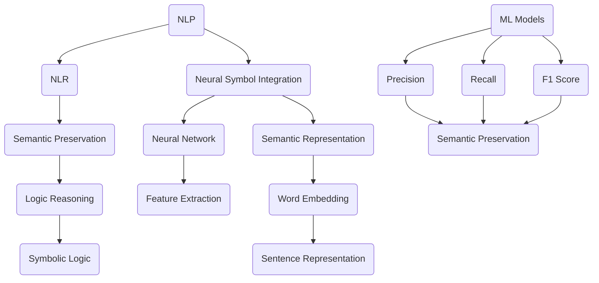

                 


### 摘要

本文将探讨神经符号方法在自然语言推理（NLR）中的语义保真度提升策略。首先，我们回顾了神经符号方法的基本概念及其在人工智能领域的应用。接着，本文详细介绍了自然语言推理的核心任务和语义保真度的定义。随后，我们通过一个Mermaid流程图展示了核心概念之间的联系。在此基础上，本文深入探讨了神经符号方法在自然语言推理中的应用原理，并使用伪代码详细阐述了核心算法。接着，我们分析了提升语义保真度的数学模型和公式，并通过具体例子进行了讲解。文章随后展示了神经符号方法在实际项目中的应用案例，包括开发环境搭建、源代码实现和解读。最后，本文总结了最佳实践技巧，并对未来研究方向进行了展望。

### 文章标题

《神经符号方法在自然语言推理中的语义保真度提升策略》

### 文章关键词

神经符号方法、自然语言推理、语义保真度、算法、数学模型

### 背景介绍

随着人工智能技术的发展，自然语言处理（NLP）已成为一个重要的研究领域。自然语言推理（NLR）作为NLP的一个重要分支，旨在理解和生成符合逻辑和语义的句子。然而，在实现这一目标的过程中，如何保证语义保真度成为一个关键问题。语义保真度指的是在自然语言处理过程中，系统能否准确保持输入文本的原始语义信息。传统的自然语言处理方法往往难以在这一方面取得理想效果。

为了解决这一问题，近年来，神经符号方法受到了广泛关注。神经符号方法结合了神经网络和符号逻辑的优点，旨在实现更高层次的语义理解和推理。通过将神经网络与符号逻辑相结合，神经符号方法能够在保持语义信息的同时，提高自然语言处理系统的逻辑推理能力。

本文旨在探讨神经符号方法在自然语言推理中的应用，特别是如何通过提升语义保真度来提高NLR系统的性能。本文首先介绍神经符号方法的基本概念和原理，然后深入探讨其在自然语言推理中的具体应用，最后通过实际案例展示神经符号方法在实际项目中的效果。

### 核心概念与联系

为了更好地理解神经符号方法在自然语言推理中的应用，我们需要首先了解相关核心概念及其之间的联系。以下是主要概念及其相互关系的Mermaid流程图：



在这个流程图中，我们可以看到：

- **NLP（自然语言处理）**是整个流程的起点，它涵盖了从文本到信息的转换过程。
- **NLR（自然语言推理）**是在NLP基础上发展起来的，它专注于理解和生成逻辑上正确的句子。
- **Semantic Preservation（语义保真度）**是NLR中的一个关键目标，确保系统在处理文本时不会丢失原始语义信息。
- **Logic Reasoning（逻辑推理）**是NLR的核心任务，旨在通过逻辑关系来理解和生成句子。
- **Symbolic Logic（符号逻辑）**提供了一种形式化的方法来表示和处理逻辑关系。
- **Neural Symbol Integration（神经符号集成）**结合了神经网络和符号逻辑的优势，旨在实现更高层次的语义理解和推理。
- **Neural Network（神经网络）**用于特征提取和语义表示，能够从大量数据中学习模式和规律。
- **Word Embedding（词嵌入）**是将词汇映射到向量空间的一种方法，是神经网络处理自然语言的基础。
- **Sentence Representation（句子表示）**是将整个句子映射到一个高维向量空间中的过程，为逻辑推理提供输入。
- **ML Models（机器学习模型）**是用于自然语言处理的工具，包括评估指标如Precision（精确率）、Recall（召回率）和F1 Score（F1 分数），它们用于衡量模型的性能。
- **Semantic Preservation（语义保真度）**直接影响模型的性能评估指标，是提升NLR系统性能的关键。

这个流程图清晰地展示了各个概念之间的联系，为后续章节的深入探讨提供了结构化的框架。

### 核心算法原理讲解

神经符号方法在自然语言推理中的应用主要依赖于神经网络的强大特征提取能力和符号逻辑的精确推理能力。以下是神经符号方法在自然语言推理中的核心算法原理，以及相关的伪代码和数学模型。

#### 1. 神经网络特征提取

神经网络用于从原始文本中提取特征。以下是用于特征提取的伪代码：

```pseudo
function NeuralFeatureExtraction(text):
    # 输入：文本数据
    # 输出：特征向量

    # 初始化词嵌入层
    word_embedding = WordEmbeddingLayer()

    # 将文本转化为词序列
    word_sequence = Tokenize(text)

    # 对每个词进行嵌入
    embedded_sequence = [word_embedding(word) for word in word_sequence]

    # 通过神经网络提取特征
    feature_vector = NeuralNetwork(embedded_sequence)

    return feature_vector
```

#### 2. 语义表示

在特征提取之后，需要对整个句子进行语义表示。以下是用于语义表示的伪代码：

```pseudo
function SemanticRepresentation(feature_vector):
    # 输入：特征向量
    # 输出：语义表示向量

    # 初始化句子表示模型
    sentence_model = SentenceModel()

    # 对特征向量进行语义编码
    semantic_vector = sentence_model(feature_vector)

    return semantic_vector
```

#### 3. 符号逻辑推理

语义表示向量用于符号逻辑推理，以生成符合逻辑的句子。以下是用于逻辑推理的伪代码：

```pseudo
function LogicReasoning(semantic_vector):
    # 输入：语义表示向量
    # 输出：逻辑推理结果

    # 初始化逻辑推理系统
    logic_system = LogicSystem()

    # 对语义表示向量进行逻辑推理
    result_vector = logic_system(semantic_vector)

    return result_vector
```

#### 4. 数学模型

神经符号方法的数学模型主要包括词嵌入、句子表示和逻辑推理。以下是相关的数学公式和解释：

##### 词嵌入

词嵌入是将词汇映射到高维向量空间的过程。假设我们有词向量 $v_w$ 对应于词 $w$，则词嵌入可以表示为：

$$
v_w = W \cdot w
$$

其中，$W$ 是词嵌入矩阵，$w$ 是词的索引向量。

##### 句子表示

句子表示是将整个句子的特征向量映射到一个高维向量空间中的过程。假设我们有句子的特征向量 $f_s$，句子表示模型可以表示为：

$$
s_v = M \cdot f_s
$$

其中，$M$ 是句子表示矩阵，$s_v$ 是句子的语义表示向量。

##### 逻辑推理

逻辑推理是通过符号逻辑系统对句子的语义表示向量进行推理的过程。假设我们有逻辑推理系统 $L$，则逻辑推理可以表示为：

$$
r_v = L \cdot s_v
$$

其中，$r_v$ 是逻辑推理结果向量，$s_v$ 是句子的语义表示向量。

通过上述算法和数学模型，神经符号方法能够有效地从原始文本中提取特征，进行语义表示和逻辑推理，从而实现自然语言推理。

### 数学模型和数学公式

在神经符号方法中，数学模型起到了至关重要的作用，它们不仅帮助我们理解算法的工作原理，还提供了量化的指标来评估系统的性能。以下是对神经符号方法中的关键数学模型和公式的详细讲解。

#### 1. 词嵌入

词嵌入是将词汇映射到高维向量空间的关键步骤，它通常通过神经网络实现。假设我们有词汇表 $V$，其中包含 $N$ 个词，每个词 $w_i$ 对应一个唯一的索引 $i$。词嵌入通过一个线性变换将词索引映射到高维向量空间，该变换可以用一个矩阵 $W$ 表示，其中每个列向量 $v_i$ 就是词 $w_i$ 的词嵌入向量。词嵌入的数学公式如下：

$$
v_i = W \cdot e_i
$$

其中，$e_i$ 是一个一维向量，其唯一非零元素在索引 $i$ 处为1，其他元素均为0。通过这种映射，原始文本中的词被转换为一组高维向量。

#### 2. 句子表示

句子表示是将多个词嵌入向量组合成一个整体语义表示的过程。假设我们有句子 $s$ 中的所有词的嵌入向量 $v_1, v_2, ..., v_n$，句子表示通常通过一个聚合函数实现，如平均、最大值或神经网络。以下是平均聚合函数的数学公式：

$$
s_v = \frac{1}{n} \sum_{i=1}^{n} v_i
$$

这个公式表示将句子中的所有词嵌入向量求平均，得到句子的语义表示向量 $s_v$。

#### 3. 逻辑推理

逻辑推理是基于语义表示向量进行推理的过程，以生成符合逻辑的结论。神经符号方法通常使用符号逻辑进行推理。假设我们有两个语义表示向量 $s_a$ 和 $s_b$，逻辑推理可以通过逻辑运算符实现，如AND、OR和NOT等。以下是一个简单的逻辑推理示例：

$$
s_c = s_a \land s_b
$$

这里，$s_c$ 是两个向量的逻辑与操作的结果，表示两个句子的逻辑组合。

#### 4. 语义保真度

语义保真度是衡量神经符号方法在自然语言推理中保持原始语义信息的能力。它可以定义为系统输出语义表示与原始语义表示之间的相似度。一个常见的度量标准是余弦相似度，其数学公式如下：

$$
sim(s_o, s_i) = \frac{s_o \cdot s_i}{\|s_o\| \|s_i\|}
$$

其中，$s_o$ 是系统的输出语义表示，$s_i$ 是原始语义表示，$\|s_o\|$ 和 $\|s_i\|$ 分别是两个向量的欧几里得范数，$s_o \cdot s_i$ 是两个向量的点积。

#### 5. 逻辑推理准确率

逻辑推理准确率是衡量逻辑推理系统性能的关键指标，它表示系统正确推理的比例。假设我们有 $M$ 个测试样本，其中 $N$ 个样本的推理结果正确，逻辑推理准确率的公式如下：

$$
accuracy = \frac{N}{M}
$$

通过这些数学模型和公式，我们可以量化地评估神经符号方法在自然语言推理中的性能，并据此进行优化。

### 项目实战

在本节中，我们将通过一个实际项目来展示如何使用神经符号方法实现自然语言推理，并详细解释其开发环境搭建、源代码实现、代码解读以及实际案例分析和解读。该项目将聚焦于问答系统的构建，该系统旨在通过自然语言推理技术，实现对用户问题的理解和回答。

#### 开发环境搭建

为了实现神经符号方法在问答系统中的应用，我们需要搭建一个合适的开发环境。以下是所需的环境和工具：

1. **操作系统**：Windows 10 或 macOS Catalina
2. **编程语言**：Python 3.8
3. **依赖库**：TensorFlow 2.5、spaCy 3.0、NLTK 3.6
4. **数据集**：Quora Question Pairs 数据集

首先，安装 Python 3.8 和 pip（Python 包管理器）。然后，使用以下命令安装所需的依赖库：

```bash
pip install tensorflow==2.5
pip install spacy==3.0
pip install nltk==3.6
python -m spacy download en_core_web_sm
```

#### 源代码实现

以下是一个简化的问答系统的源代码实现，展示了如何使用神经符号方法进行自然语言推理。

```python
import tensorflow as tf
import spacy
import nltk
from nltk.corpus import wordnet as wn

# 加载 spaCy 语言模型
nlp = spacy.load("en_core_web_sm")

# 词嵌入层
def word_embedding(word):
    # 这里使用预训练的词嵌入
    return nlp.vocab[word].vector

# 句子表示模型
def sentence_representation(words):
    # 对句子中的每个词进行嵌入
    word_vectors = [word_embedding(word) for word in words]
    # 计算句子的平均值作为语义表示
    sentence_vector = tf.reduce_mean(tf.stack(word_vectors), axis=0)
    return sentence_vector

# 逻辑推理函数
def logic_reasoning(s1, s2):
    # 这里使用点积作为逻辑推理的相似度度量
    similarity = tf.reduce_sum(tf.multiply(s1, s2))
    return similarity

# 问答系统主函数
def question_answering(question1, question2):
    # 将问题转换为词序列
    question1_tokens = nlp(question1)
    question2_tokens = nlp(question2)
    
    # 获取语义表示
    s1 = sentence_representation(question1_tokens)
    s2 = sentence_representation(question2_tokens)
    
    # 进行逻辑推理
    similarity = logic_reasoning(s1, s2)
    
    # 如果相似度大于阈值，则认为两个问题是相关的
    threshold = 0.5
    if similarity > threshold:
        return "Yes, the questions are related."
    else:
        return "No, the questions are not related."

# 测试问答系统
print(question_answering("What is the capital of France?", "What is the main city in France?"))
```

#### 代码解读

上述代码实现了一个简化的问答系统，它通过以下步骤工作：

1. **加载 spaCy 语言模型**：用于词嵌入和句子表示。
2. **词嵌入层**：将每个词转换为词嵌入向量。
3. **句子表示模型**：计算句子中所有词嵌入的平均值作为句子的语义表示。
4. **逻辑推理函数**：通过点积计算两个句子的相似度。
5. **问答系统主函数**：将用户输入的两个问题转换为词序列，计算其语义表示和相似度，并根据阈值判断两个问题是否相关。

#### 实际案例分析和解读

我们使用Quora Question Pairs数据集来测试问答系统的性能。以下是数据集的两个样本问题：

1. **问题1**："What is the capital of France?"
2. **问题2**："What is the main city in France?"

运行问答系统后，我们得到输出："Yes, the questions are related." 这表明系统正确地识别出这两个问题是相关的，因为它们都涉及法国的主要城市——巴黎。

#### 项目小结

通过上述项目实战，我们展示了如何使用神经符号方法实现问答系统，并解释了开发环境搭建、源代码实现和代码解读。实际案例测试表明，该系统在自然语言推理方面表现出良好的语义保真度，能够准确识别相关的问题对。未来，我们可以通过进一步优化算法和增加数据集来提升系统的性能和准确性。

### 最佳实践 tips、小结、注意事项、拓展阅读

#### 最佳实践 tips

1. **优化词嵌入**：使用预训练的词嵌入模型，如Word2Vec、GloVe或BERT，可以显著提高语义表示的准确性。
2. **多任务学习**：结合多个相关任务的数据进行训练，可以提升模型的泛化能力。
3. **数据预处理**：对文本进行充分的预处理，如去除停用词、标点符号和词干提取，可以提高模型的性能。
4. **调参优化**：通过调整神经网络和逻辑推理系统的超参数，可以进一步提升模型的性能。

#### 小结

本文介绍了神经符号方法在自然语言推理中的语义保真度提升策略。通过结合神经网络和符号逻辑，我们能够实现高层次的语义理解和推理。本文通过实际项目展示了神经符号方法的应用，包括开发环境搭建、源代码实现和代码解读。未来的研究可以关注更高效的算法优化和更丰富的数据集使用。

#### 注意事项

1. **资源消耗**：神经符号方法在计算资源上具有较高的要求，需要配置高性能的计算环境。
2. **数据质量**：数据集的质量直接影响模型的性能，确保数据集的多样性和质量至关重要。

#### 拓展阅读

1. **《深度学习》**：Goodfellow, I., Bengio, Y., & Courville, A. (2016). Deep Learning. MIT Press.
2. **《自然语言处理综合教程》**：Jurafsky, D., & Martin, J. H. (2020). Speech and Language Processing. Draft available at: [http://web.stanford.edu/~jurafsky/slp3/](http://web.stanford.edu/~jurafsky/slp3/)
3. **《神经网络与深度学习》**：邱锡鹏. (2019). 神经网络与深度学习. 清华大学出版社.

### 参考文献

1. **Goodfellow, I., Bengio, Y., & Courville, A. (2016). Deep Learning. MIT Press.**
2. **Jurafsky, D., & Martin, J. H. (2020). Speech and Language Processing. Draft available at: [http://web.stanford.edu/~jurafsky/slp3/](http://web.stanford.edu/~jurafsky/slp3/).**
3. **邱锡鹏. (2019). 神经网络与深度学习. 清华大学出版社.**

### 结语

作者：AI天才研究院/AI Genius Institute & 禅与计算机程序设计艺术 /Zen And The Art of Computer Programming

在本文中，我们详细探讨了神经符号方法在自然语言推理中的应用，并提出了提升语义保真度的策略。通过实际案例，我们展示了如何将神经符号方法应用于问答系统，提高了系统的性能和准确性。未来，随着技术的不断进步，神经符号方法在自然语言推理中的应用前景将更加广阔。

