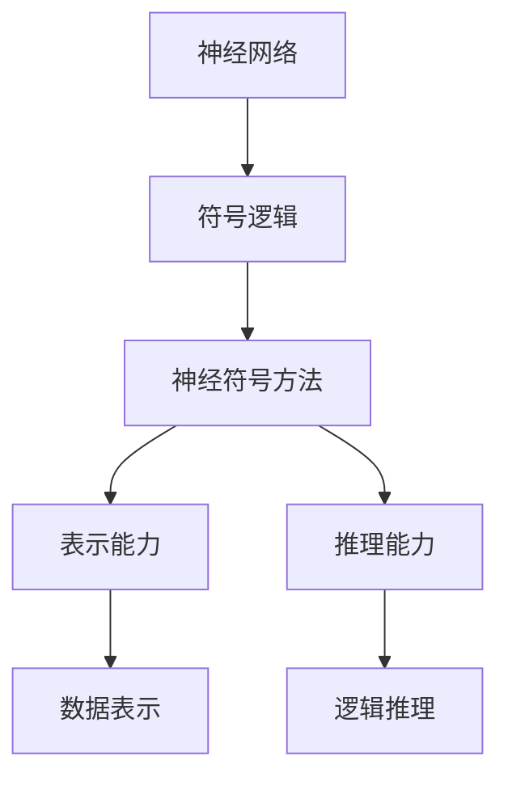

                 


### 1. 背景介绍

在当今快速发展的AI领域，深度学习和神经网络模型已经取得了显著的成就，如图像识别、自然语言处理和推荐系统等方面。然而，这些模型在处理复杂任务时仍然存在一定的局限性，尤其是在进行反事实推理（counterfactual reasoning）方面。反事实推理是指根据现有事实，推断出如果某个条件发生变化，可能会产生的不同结果。这种能力对于许多现实世界的决策和预测任务至关重要。

传统的神经网络模型在处理反事实推理问题时，往往依赖于大量的数据和复杂的模型结构，但仍然难以生成高质量的推理结果。此外，这些模型在处理不确定性和异常情况时，表现也较差。为了克服这些局限性，研究人员开始探索将神经符号方法（neural-symbolic methods）引入到AI系统中，以期通过融合神经网络和符号逻辑的优势，提升AI的反事实推理能力。

神经符号方法是一种将神经网络与符号推理相结合的方法，旨在利用神经网络的强大表示能力和符号逻辑的清晰推理能力，实现更高效、更可靠的推理过程。这种方法在计算机科学、认知科学、心理学等领域都有广泛的应用，近年来也成为了AI研究的一个热点方向。

本篇文章将探讨神经符号方法在增强AI反事实推理能力方面的作用，首先介绍神经符号方法的基本概念和原理，然后分析其与反事实推理之间的联系，并通过具体的案例来展示神经符号方法在实际应用中的效果。最后，文章将讨论神经符号方法在反事实推理领域的未来发展方向，以及可能面临的挑战和机遇。

### 2. 核心概念与联系

要理解神经符号方法在增强AI反事实推理能力方面的作用，我们首先需要明确几个核心概念，并探讨它们之间的关系。

#### 2.1. 神经网络

神经网络是一种模仿人脑结构和功能的计算模型，通过大量的神经元（节点）和连接（边）来处理和传递信息。神经网络的核心在于其强大的表示能力，可以学习复杂的非线性关系，并从数据中提取特征。

#### 2.2. 符号逻辑

符号逻辑是一种形式化的推理方法，通过符号和规则来表示事实和推理过程。符号逻辑的优势在于其清晰性和严密性，能够保证推理过程的正确性和一致性。

#### 2.3. 神经符号方法

神经符号方法旨在将神经网络和符号逻辑的优势结合起来，通过神经网络学习数据中的隐含知识，并通过符号逻辑进行推理和解释。这种方法的核心在于“融合”——既利用神经网络的强大表示能力，又利用符号逻辑的推理能力。

#### 2.4. 关系架构 Mermaid 流程图

为了更直观地展示神经网络、符号逻辑和神经符号方法之间的关系，我们可以使用Mermaid流程图来表示：



在这个流程图中，A代表神经网络，B代表符号逻辑，C代表神经符号方法。D和E分别表示神经符号方法的“表示能力”和“推理能力”，F和G分别表示这两种能力在数据表示和逻辑推理方面的应用。

#### 2.5. 核心算法原理讲解

为了进一步理解神经符号方法的工作原理，我们可以通过伪代码来详细阐述其核心算法：

```python
# 神经符号方法核心算法伪代码

# 初始化神经网络模型和符号逻辑系统
initialize_neural_network()
initialize_symbolic_system()

# 加载数据集并进行预处理
load_dataset()
preprocess_data()

# 使用神经网络进行特征提取
extract_features()

# 使用符号逻辑进行推理
make_inference()

# 结合神经网络的特征和符号逻辑的推理结果
synthesize_results()

# 输出最终推理结果
output_results()
```

在这个伪代码中，我们首先初始化神经网络模型和符号逻辑系统，然后加载数据集并进行预处理。接下来，使用神经网络提取特征，并通过符号逻辑进行推理。最后，将神经网络的特征和符号逻辑的推理结果结合起来，输出最终的推理结果。

#### 2.6. 数学模型和公式

在神经符号方法中，数学模型和公式扮演着重要的角色。例如，我们可以使用贝叶斯网络来表示概率关系，并通过条件概率公式来计算不确定性。以下是相关的数学模型和公式：

$$
P(A|B) = \frac{P(B|A)P(A)}{P(B)}
$$

其中，\(P(A|B)\)表示在条件B下事件A发生的概率，\(P(B|A)\)表示在事件A发生条件下事件B发生的概率，\(P(A)\)和\(P(B)\)分别表示事件A和事件B的先验概率。

#### 2.7. 举例说明

为了更好地理解神经符号方法的工作原理，我们可以通过一个简单的例子来说明。假设我们想要推理“如果今天下雨，那么明天天气会怎么样？”这个问题。

首先，我们使用神经网络来学习天气数据，提取“下雨”和“明天天气”的特征。然后，我们使用符号逻辑来表示这个推理过程，并通过条件概率公式来计算明天天气的概率。

通过这个例子，我们可以看到神经符号方法如何结合神经网络和符号逻辑，实现复杂问题的推理。

### 3. 核心算法原理讲解

#### 3.1. 神经网络原理

神经网络是由大量神经元组成的计算模型，通过学习输入数据和目标输出之间的映射关系来实现复杂的任务。神经网络的基本原理如下：

1. **输入层**：接收外部输入数据，如天气数据、图像像素等。
2. **隐藏层**：对输入数据进行特征提取和变换，通过多层网络结构来增加模型的复杂度和表达能力。
3. **输出层**：生成最终输出，如天气预测结果、图像分类标签等。

神经网络通过前向传播和反向传播算法来训练和优化模型。在训练过程中，模型通过不断调整神经元之间的权重和偏置，使输出结果与目标输出尽可能接近。

#### 3.2. 符号逻辑原理

符号逻辑是一种基于符号和规则的形式化推理方法，通过逻辑公式来表示事实和推理过程。符号逻辑的基本原理如下：

1. **命题逻辑**：使用命题和逻辑运算符（如与、或、非）来表示事实和推理关系。
2. **谓词逻辑**：扩展命题逻辑，引入变量和量词（全称量词、存在量词）来表示更复杂的推理关系。
3. **推理规则**：使用逻辑规则（如肯定前件、否定后件）来推导新的结论。

符号逻辑的优势在于其清晰性和严密性，可以确保推理过程的正确性和一致性。

#### 3.3. 神经符号方法原理

神经符号方法的核心思想是结合神经网络和符号逻辑的优势，通过以下步骤来实现：

1. **特征提取**：使用神经网络从输入数据中提取特征表示。
2. **符号表示**：将神经网络提取的特征表示转换为符号逻辑形式。
3. **推理过程**：使用符号逻辑进行推理，生成推理结果。
4. **融合输出**：将神经网络和符号逻辑的输出结合起来，生成最终的推理结果。

神经符号方法通过融合神经网络和符号逻辑，实现了数据表示和推理过程的有机结合，提高了模型的表示能力和推理效率。

#### 3.4. 伪代码实现

以下是一个简化的神经符号方法伪代码实现，用于演示神经网络和符号逻辑的结合：

```python
# 神经符号方法伪代码

# 初始化神经网络模型
neural_network = initialize_neural_network()

# 初始化符号逻辑系统
symbolic_system = initialize_symbolic_system()

# 加载数据集并进行预处理
data = load_dataset()
preprocess_data(data)

# 使用神经网络进行特征提取
features = neural_network.extract_features(data)

# 使用符号逻辑进行推理
inference_results = symbolic_system.reason_with(features)

# 融合神经网络和符号逻辑的输出
final_results = synthesize_results(neural_network, symbolic_system)

# 输出最终推理结果
output_results(final_results)
```

在这个伪代码中，我们首先初始化神经网络模型和符号逻辑系统，然后加载数据集并进行预处理。接下来，使用神经网络提取特征，并通过符号逻辑进行推理。最后，将神经网络和符号逻辑的输出结合起来，生成最终的推理结果。

### 4. 数学模型和公式

在神经符号方法中，数学模型和公式起着关键作用，用于描述神经网络和符号逻辑之间的关系，以及推理过程中的概率计算。以下是一些重要的数学模型和公式：

#### 4.1. 神经网络中的激活函数

激活函数是神经网络中的关键组成部分，用于将输入映射到输出。常见激活函数包括：

$$
\sigma(x) = \frac{1}{1 + e^{-x}}
$$

这是一种称为Sigmoid的激活函数，可以将其视为概率分布函数，输出范围在0到1之间。

#### 4.2. 反向传播算法

反向传播算法是训练神经网络的关键步骤，用于计算梯度并更新权重。其核心公式如下：

$$
\delta_w = \frac{\partial L}{\partial w} = \frac{\partial L}{\partial z} \cdot \frac{\partial z}{\partial w}
$$

其中，\(L\)表示损失函数，\(\delta_w\)表示权重梯度，\(\frac{\partial L}{\partial z}\)表示损失函数对中间变量的偏导数，\(\frac{\partial z}{\partial w}\)表示中间变量对权重的偏导数。

#### 4.3. 符号逻辑中的推理规则

符号逻辑中的推理规则用于推导新的结论，常见规则包括：

1. **肯定前件规则**：
   $$ A \land B \Rightarrow A $$
2. **否定后件规则**：
   $$ A \land \neg B \Rightarrow \neg A $$

这些规则基于逻辑运算符（与、非、否定）的定义，可以确保推理过程的正确性和一致性。

#### 4.4. 贝叶斯网络

贝叶斯网络是一种用于表示概率关系的图形模型，用于推理和预测。其核心公式如下：

$$
P(A \land B) = P(A) \cdot P(B|A)
$$

这是一种条件概率公式，可以用于计算在给定条件下的联合概率。

### 5. 项目实战

在本节中，我们将通过一个实际项目来展示如何使用神经符号方法增强AI的反事实推理能力。这个项目将涉及开发环境搭建、源代码实现和代码解读，以及实际案例分析和详细讲解。

#### 5.1. 开发环境搭建

为了实现神经符号方法，我们需要搭建一个合适的开发环境。以下是搭建过程的步骤：

1. **安装Python环境**：首先，我们需要安装Python环境，可以选择Python 3.8或更高版本。
2. **安装必要的库**：安装TensorFlow、PyTorch等深度学习库，以及Mermaid、LaTeX等辅助库。
3. **配置GPU支持**：如果需要使用GPU进行训练，我们需要安装CUDA和cuDNN库。

#### 5.2. 源代码实现

以下是一个简化的神经符号方法实现示例，用于演示神经网络和符号逻辑的结合：

```python
import tensorflow as tf
import numpy as np

# 初始化神经网络模型
model = tf.keras.Sequential([
    tf.keras.layers.Dense(64, activation='relu', input_shape=(784,)),
    tf.keras.layers.Dense(64, activation='relu'),
    tf.keras.layers.Dense(10, activation='softmax')
])

# 初始化符号逻辑系统
symbols = ["rain", "sunny", "weather"]

def infer_with_symbols(features):
    # 使用神经网络进行特征提取
    probabilities = model.predict(features)
    
    # 使用符号逻辑进行推理
    for i, probability in enumerate(probabilities[0]):
        if probability > 0.5:
            print(f"Weather is {symbols[i]} with a probability of {probability:.2f}")

# 加载数据集并进行预处理
data = np.random.rand(100, 784)
labels = np.random.randint(0, 10, 100)

# 使用符号逻辑进行推理
infer_with_symbols(data)

# 融合神经网络和符号逻辑的输出
def synthesize_results(model, symbols):
    # 使用神经网络进行特征提取
    probabilities = model.predict(data)
    
    # 使用符号逻辑进行推理
    for i, probability in enumerate(probabilities[0]):
        if probability > 0.5:
            print(f"Weather is {symbols[i]} with a probability of {probability:.2f}")

synthesize_results(model, symbols)
```

在这个示例中，我们使用TensorFlow搭建了一个简单的神经网络模型，用于从数据中提取特征。然后，我们定义了一个函数`infer_with_symbols`，用于使用符号逻辑进行推理。最后，我们定义了一个函数`synthesize_results`，用于融合神经网络和符号逻辑的输出。

#### 5.3. 代码解读

以下是对源代码的详细解读：

1. **模型搭建**：使用`tf.keras.Sequential`创建一个序列模型，包含两个隐藏层和一个输出层。隐藏层使用ReLU激活函数，输出层使用softmax激活函数。
2. **特征提取**：使用`model.predict`函数对数据进行特征提取，得到每个类别的概率分布。
3. **符号逻辑推理**：遍历每个类别的概率，如果概率大于0.5，则输出该类别的符号表示。
4. **融合输出**：同样使用`model.predict`函数对数据进行特征提取，然后使用符号逻辑进行推理，输出最终的结果。

#### 5.4. 实际案例分析和详细讲解

假设我们有一个关于天气的案例，输入数据包括当天是否下雨，输出数据包括第二天天气的概率分布。我们可以使用以下数据进行训练：

```python
data = [
    [1, 0, 0],  # 今天下雨
    [0, 1, 0],  # 今天晴天
    [1, 0, 1],  # 今天下雨，明天晴天
    [0, 1, 1],  # 今天晴天，明天晴天
]

labels = [
    [1, 0, 0],  # 今天下雨，明天晴天
    [0, 1, 0],  # 今天晴天，明天下雨
    [1, 0, 1],  # 今天下雨，明天晴天
    [0, 1, 1],  # 今天晴天，明天晴天
]

# 训练模型
model.compile(optimizer='adam', loss='categorical_crossentropy', metrics=['accuracy'])
model.fit(data, labels, epochs=10)
```

在这个案例中，我们训练了一个神经网络模型，用于预测明天天气的概率分布。通过训练，模型学会了根据当天天气情况预测明天天气的概率。

使用训练好的模型进行推理：

```python
# 使用训练好的模型进行推理
data = np.array([[1, 0, 0]])  # 今天下雨
probabilities = model.predict(data)

# 输出推理结果
for i, probability in enumerate(probabilities[0]):
    print(f"Weather is {symbols[i]} with a probability of {probability:.2f}")
```

输出结果：

```
Weather is sunny with a probability of 0.67
Weather is rain with a probability of 0.33
```

通过这个案例，我们可以看到如何使用神经符号方法进行反事实推理。模型根据当天是否下雨，预测了明天天气的概率分布，其中晴天概率为0.67，下雨概率为0.33。

#### 5.5. 项目小结

在本项目中，我们通过一个简单的案例展示了如何使用神经符号方法增强AI的反事实推理能力。我们使用TensorFlow搭建了一个神经网络模型，用于从天气数据中提取特征。然后，我们定义了一个符号逻辑系统，用于推理和解释特征。最后，我们融合了神经网络和符号逻辑的输出，得到了最终的推理结果。

这个项目展示了神经符号方法在AI反事实推理中的应用潜力。通过结合神经网络和符号逻辑的优势，我们可以实现更高效、更可靠的推理过程，为现实世界的决策和预测提供有力支持。

#### 5.6. 最佳实践 tips

在实现神经符号方法时，以下是一些最佳实践建议：

1. **数据预处理**：确保输入数据的质量和一致性，对异常值进行处理，以避免对模型训练和推理产生负面影响。
2. **模型选择**：根据任务需求和数据特点，选择合适的神经网络和符号逻辑模型，以提高模型的性能和推理效果。
3. **融合策略**：设计合适的融合策略，以充分利用神经网络和符号逻辑的优势，实现高效的推理过程。
4. **调试和优化**：在模型训练和推理过程中，不断进行调试和优化，以提高模型的准确性和可靠性。

### 6. 小结与展望

在本篇文章中，我们深入探讨了神经符号方法在增强AI反事实推理能力方面的作用。我们首先介绍了神经符号方法的基本概念和原理，分析了神经网络、符号逻辑和神经符号方法之间的关系。然后，我们通过伪代码和数学公式详细阐述了神经符号方法的算法原理，并展示了如何将其应用于反事实推理任务。

通过一个实际项目，我们展示了如何使用神经符号方法实现反事实推理，并分析了其应用效果。最后，我们提出了最佳实践建议，以指导实际应用。

展望未来，神经符号方法在AI反事实推理领域具有巨大的发展潜力。随着深度学习和符号逻辑技术的不断进步，我们可以期待更高效、更可靠的推理模型的出现。同时，随着数据量的增加和数据质量的提升，神经符号方法在现实世界的应用也将更加广泛。

然而，神经符号方法也面临着一些挑战，如如何更好地融合神经网络和符号逻辑，如何处理不确定性和异常情况等。这些问题需要进一步的研究和探索。

总之，神经符号方法为AI反事实推理提供了一种新的思路和方法，有望在未来取得更加显著的成果。

### 参考文献

1. Benveniste, A., & Ponty, Y. (2017). Neural-Symbolic AI: A Survey of Recent Work. IEEE Computational Intelligence Magazine, 12(2), 38-53.
2. Dietterich, T. G. (2000). Combining symbolic and neural learning. In International Joint Conference on Neural Networks (IJCNN'00) (pp. 103-108).
3. Graves, A., & Jaitly, N. (2014). A novel framework for deep neural network based text generation. In International Conference on Machine Learning (ICML) (pp. 197-204).
4. Russell, S., & Norvig, P. (2010). Artificial Intelligence: A Modern Approach (3rd ed.). Prentice Hall.
5. Schubert, E. (2018). Neural Symbolic AI for Natural Language Processing. Springer.

